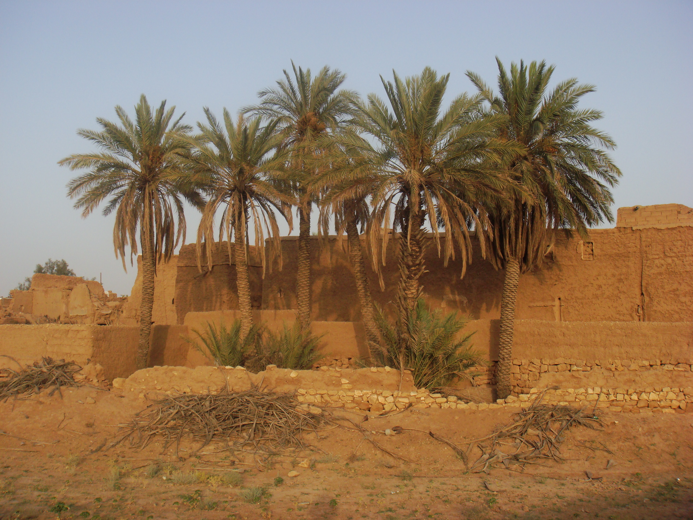

# Plants and Trees in the Bible

## License Information

Plants and Trees in the Bible © United Bible Societies, 2025. Adapted from: <cite>Each According to its Kind: Plants and Trees in the Bible</cite>, by Robert Koops © 2012 United Bible Societies. This work is licensed under Creative Commons Attribution-ShareAlike 4.0 International (<a href="https://creativecommons.org/licenses/by-sa/4.0/">https://creativecommons.org/licenses/by-sa/4.0/</a>).

--------------------------------

## 标题：海枣树（date palm） (id: FLORA:2.5)

2\.5 标题：海枣树（date palm）
======================

经文出处
----

### **树** ：

Hebrew 来：תָּמָר (音译：tamar)

[EXO 15:27](https://ref.ly/Exod15:27), [LEV 23:40](https://ref.ly/Lev23:40), [NUM 33:9](https://ref.ly/Num33:9), [DEU 34:3](https://ref.ly/Deut34:3), [JDG 1:16](https://ref.ly/Judg1:16), [JDG 3:13](https://ref.ly/Judg3:13), [2CH 28:15](https://ref.ly/2Chr28:15), [NEH 8:15](https://ref.ly/Neh8:15), [PSA 92:13](https://ref.ly/Ps92:13), [SNG 7:8](https://ref.ly/Song7:8), [SNG 7:9](https://ref.ly/Song7:9), [JOL 1:12](https://ref.ly/Joel1:12)

Hebrew 来：תֹּמֶר (音译：tomer)

[JDG 4:5](https://ref.ly/Judg4:5)

Hebrew 来：תִּמֹרָה (音译：timorah)

[1KI 6:29](https://ref.ly/1Kgs6:29), [1KI 6:32](https://ref.ly/1Kgs6:32), [1KI 6:32](https://ref.ly/1Kgs6:32), [1KI 6:35](https://ref.ly/1Kgs6:35), [1KI 7:36](https://ref.ly/1Kgs7:36), [2CH 3:5](https://ref.ly/2Chr3:5), [EZK 40:16](https://ref.ly/Ezek40:16), [EZK 40:22](https://ref.ly/Ezek40:22), [EZK 40:22](https://ref.ly/Ezek40:22), [EZK 40:26](https://ref.ly/Ezek40:26), [EZK 40:31](https://ref.ly/Ezek40:31), [EZK 40:34](https://ref.ly/Ezek40:34), [EZK 40:37](https://ref.ly/Ezek40:37), [EZK 41:18](https://ref.ly/Ezek41:18), [EZK 41:18](https://ref.ly/Ezek41:18), [EZK 41:19](https://ref.ly/Ezek41:19), [EZK 41:19](https://ref.ly/Ezek41:19), [EZK 41:20](https://ref.ly/Ezek41:20), [EZK 41:25](https://ref.ly/Ezek41:25), [EZK 41:26](https://ref.ly/Ezek41:26)

Greek 希：φοῖνιξ (音译：phoinix)

[JHN 12:13](https://ref.ly/John12:13), [REV 7:9](https://ref.ly/Rev7:9), [SIR 24:14](https://ref.ly/Sir24:14), [SIR 50:12](https://ref.ly/Sir50:12), [2MA 10:7](https://ref.ly/2Macc10:7), [2MA 14:4](https://ref.ly/2Macc14:4)

经文出处
----

### **枝子** ：

Hebrew 来：כִּפָּה (音译：kipah)

[JOB 15:32](https://ref.ly/Job15:32), [ISA 9:13](https://ref.ly/Isa9:13), [ISA 19:15](https://ref.ly/Isa19:15)

Greek 希：βαΐνη (音译：bainē)

[1MA 13:37](https://ref.ly/1Macc13:37)

Greek 希：βάϊον (音译：baion)

[JHN 12:13](https://ref.ly/John12:13), [1MA 13:51](https://ref.ly/1Macc13:51)

讨论
--

*海枣树 (Ray Pritz (UBS))*

在从加那利群岛开始，横贯非洲直到印度的气候干燥的热带国家，有40多种海枣树（学名*Phoenix dactylifera* ）。海枣树可能起源于中东（祖海里和霍普夫［Hopf］），现在那里仍有许多这种树。我们在[LEV 23:40](https://ref.ly/Lev23:40) 看到，住棚节会使用海枣树的枝子；在[JHN 12:13](https://ref.ly/John12:13) ，人们用海枣树的枝子（《和》、《和修》、《吕》作"棕树枝"，《思》作"棕榈枝"）欢迎耶稣。对于《约翰福音》12章所述事件，有一个合理的疑问：百姓是从哪里弄到这些海枣树枝的呢？因为耶路撒冷地势较高，气候较冷，海枣树无法生长。但是，女先知底波拉的海枣树（[JDG 4:5](https://ref.ly/Judg4:5) ）也存在同样的疑问，因为她所住的地方是在拉玛和伯特利之间，那地的海拔和耶路撒冷相差无几。耶利哥被称为"海枣树之城"（希伯来文*temarim* ；[DEU 34:3](https://ref.ly/Deut34:3); [JDG 1:16](https://ref.ly/Judg1:16); [JDG 3:13](https://ref.ly/Judg3:13); [2CH 28:15](https://ref.ly/2Chr28:15) ）。海枣可以生吃，也可以晒干后压成"饼"，有时还可以做成饮料。在[DEU 8:8](https://ref.ly/Deut8:8) 中，希伯来文*devash* 通常被认为是"蜂蜜"，但也可能指一种用海枣制成的糖浆。在过去和现在，人们都用海枣树的叶子做垫子、篮子、篱笆和屋顶。今天，在约旦河谷和阿拉瓦谷、死海周边，以及以色列沿海平原，都大量种植海枣树。英文"date"（"海枣"）是从拉丁文*dactylus* ，经古法文*datil* 演变而成的。拉丁文则源于希腊文*daktylos* （意为"手指"）。

描述
--

海枣树通常可以长到10—20米（33—66英尺）高，树顶的大叶子聚成一簇。老树叶每年枯萎下垂，果农就把老枝砍掉。未成熟的叶子紧紧地包在一起，这束叶子在希伯来文中称为*lulav* 。海枣树大约生长5年到8年就开始结果，果实甘甜，比大拇指略小，结成一大串。柔软的果肉里面有一颗长约2\.5厘米（1英寸）的硬核，也是种子。海枣树雌雄异株。有些地方只生有单一性株的海枣树，因为没有授粉，所以不结果实。果农更喜欢通过培育树基处的吸芽来繁殖海枣树，而不是通过种子繁殖，因为种子会产生太多的雄株。雌株在夏季（6月—8月）结果。

特殊意义
----

*海枣树 (haitham alfalah (Wikimedia Commons))*

在[SNG 7:8](https://ref.ly/Song7:8) （《和》7:7），海枣树是高贵和优雅的象征。[PSA 92:13](https://ref.ly/Ps92:13); [PSA 92:14](https://ref.ly/Ps92:14); [PSA 92:15](https://ref.ly/Ps92:15) （《和》92:12–14）说，义人要如海枣树那样兴旺，而[JOB 15:32](https://ref.ly/Job15:32) 说，恶人要像枯干的海枣枝那样枯萎。[NEH 8:15](https://ref.ly/Neh8:15) 提到与住棚节有关的四种特殊树木，海枣树便是其中之一。她玛（意为"海枣树"）是一个常见的希伯来名字，圣经有好几卷书都提到过这个名字（如[GEN 38:6](https://ref.ly/Gen38:6); [RUT 4:12](https://ref.ly/Ruth4:12); [1CH 2:4](https://ref.ly/1Chr2:4) ）。在[1MA 13:37](https://ref.ly/1Macc13:37) ，海枣枝是和平的象征，然而在[1MA 13:51](https://ref.ly/1Macc13:51) 象征胜利（另参[JHN 12:13](https://ref.ly/John12:13) ；[REV 7:9](https://ref.ly/Rev7:9) ；[2MA 10:7](https://ref.ly/2Macc10:7) ）。

翻译
--

*晒干的和新鲜的海枣 (Maderibeyza (Wikimedia Commons))*

对于通常生长在沙漠地区的海枣树，西非海岸的翻译者经常会用油棕树或椰子树来替代。还有一些翻译者熟悉扇叶棕榈（学名*Borassus* ；"鲁恩棕榈"），但应注意，扇叶棕榈的叶子和海枣树的叶子很不一样。我不清楚非欧洲语言中是否有棕榈树的统称。海枣树枝在住棚节的作用是搭建简陋的住所，因此这里的棕榈树是哪一种并没有太大的关系。在描述圣殿时，经文提到用棕树作装饰（参[1KI 6:29](https://ref.ly/1Kgs6:29); [1KI 6:35](https://ref.ly/1Kgs6:35) ），情况也是一样。但是，如果提到这种树的果实，那么建议按照希伯来文*tamar* 或某种主要语言的词语进行音译。

在有油棕树和椰子树、但没有海枣树的地方，建议译成"油棕"。在没有棕榈树的地方，市场上仍然可能有海枣树的果实，尤其是在穆斯林占多数的地方，海枣树的果实可能是斋月期间一种受欢迎的开斋食品。尼日利亚北部的峡谷内长着一种矮种海枣树（学名*Phoenix reclinata* ），所结的小果子和大棕榈树的果子非常像，可食用。至少有一个译本（贝罗姆文译本）采用了当地名称。

在海枣树根本不为人所知的地方，有以下几种选择：

1\. 使用表示油棕或椰子树的词语（并考虑添加脚注，说明希伯来文*tamar* 和*tomer* ，以及希腊文*phoinix* ，都是指另外一种外形相似但是果实非常不同的树）；

2\. 按照希伯来文（*tomera* 、*tamara* ）和希腊文（*fonis* 、*fowinik* ）进行音译；

3\. 按照一种主要语言进行音译，例如，*nakhal* /*temer* （阿拉伯文）、*dattier* （法文）、*datil* /*palmera* （西班牙文）、*mtende* （斯瓦希里文）、*khaji* （印度文）、*karchuram* （泰米尔文）、"海枣"（中文）；

4\. 使用一个与上下文相符的一般性短语，例如"好看的树"。

[NUM 24:6](https://ref.ly/Num24:6) ：这节经文的第一行是"如连绵的*nechalim* "（*nachal* 的复数）。希伯来文*nachal* 的字面意思是水的"急流"。由于"急流"与花园、沉香树和香柏木并列在一起很奇怪，并且阿拉伯文中有一个意为海枣的词与之相似，因此大多数学者认为这个词在这里指的就是海枣。许多英文译本译为"palm groves"（"棕榈丛"；NRSV (New Revised Standard Version (1989)) 、NLT (New Living Translation) 、REB (Revised English Bible (1989)) 、NJPSV (New Jewish Publication Society Version) ；CEV (Contemporary English Version) 类似），或"rows of palms"（"一行行的棕榈"；GNB (Good News Bible) ）。

[JOB 15:32](https://ref.ly/Job15:32) ：关于第31节的希伯来文*temurato* （"他的报应"）和第32节的*timmale'* （"它（报应）必完全实现"）的争论已持续几个世纪。乌比冈（Houbigant）等人说，*temurato* 应读作*timorato* （"他的棕榈树"）；*timmale'* 应读作*timmal* （"它必干枯"；《七十士译本》、《武加大译本》和叙利亚文译本同）。这个解释为第32节的希伯来文*kipah* （"枝子"）作了铺垫；该节第二行是"它的枝子不得青绿"。多尔姆（Dhorme）认为，*temurato* 应读作*zemorato* （"他的葡萄嫩枝"），指向第33节关于葡萄树的那行诗文。《〈约伯记〉手册》（*A Handbook on The Book of Job* ）支持在这段经文中使用"棕榈树"和"棕榈枝"。我们也赞同。

[JOB 29:18](https://ref.ly/Job29:18) ：《七十士译本》译作*phoinix* （"棕榈树"），而不是"尘沙"。许多学者在这里采用《七十士译本》的译法，但有些学者认为*phoinix* 不是指海枣树，而是指传说中一种很长寿的鸟，"凤凰"。

* **Associated Passages:** 出埃及记 15:27; 利未记 23:40; 民数记 33:9; 申命记 34:3; 士师记 1:16; 士师记 3:13; 历代志下 28:15; 尼希米记 8:15; 诗篇 92:13; 雅歌 7:8; 雅歌 7:9; 约珥书 1:12; 士师记 4:5; 列王纪上 6:29; 列王纪上 6:32; 列王纪上 6:35; 列王纪上 7:36; 历代志下 3:5; 以西结书 40:16; 以西结书 40:22; 以西结书 40:26; 以西结书 40:31; 以西结书 40:34; 以西结书 40:37; 以西结书 41:18; 以西结书 41:19; 以西结书 41:20; 以西结书 41:25; 以西结书 41:26; 约翰福音 12:13; 启示录 7:9; 德训篇 24:14; 德训篇 50:12; 玛加伯下 10:7; 玛加伯下 14:4; 约伯记 15:32; 以赛亚书 9:13; 以赛亚书 19:15; 玛加伯上 13:37; 玛加伯上 13:51; 申命记 8:8; 诗篇 92:14; 诗篇 92:15; 创世记 38:6; 路得记 4:12; 历代志上 2:4; 民数记 24:6; 约伯记 29:18

* **Associated ACAI Concepts:** Date Palm (ID: `flora:DatePalm`)
