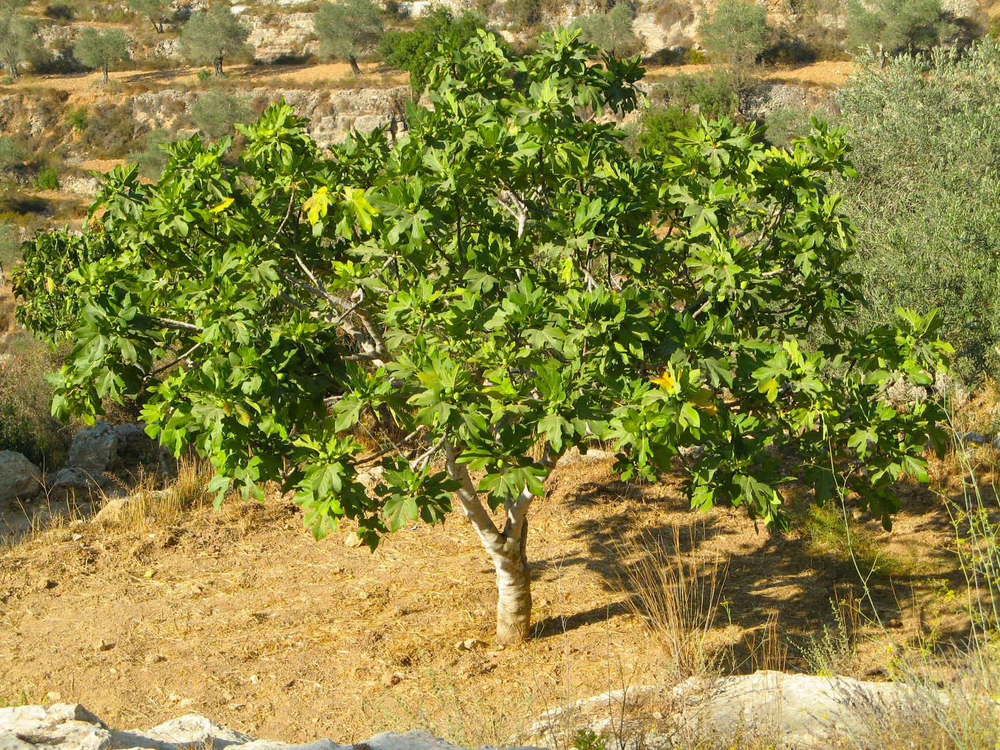

# Plants and Trees in the Bible

## License Information

Plants and Trees in the Bible © United Bible Societies, 2025. Adapted from: <cite>Each According to its Kind: Plants and Trees in the Bible</cite>, by Robert Koops © 2012 United Bible Societies. This work is licensed under Creative Commons Attribution-ShareAlike 4.0 International (<a href="https://creativecommons.org/licenses/by-sa/4.0/">https://creativecommons.org/licenses/by-sa/4.0/</a>).

--------------------------------

## 标题：无花果（fig） (id: FLORA:2.6)

2\.6 标题：无花果（fig）
================

经文出处
----

Hebrew 来：תְּאֵנָה (音译：te’enah)

[GEN 3:7](https://ref.ly/Gen3:7), [DEU 8:8](https://ref.ly/Deut8:8), [JDG 9:10](https://ref.ly/Judg9:10), [JDG 9:11](https://ref.ly/Judg9:11), [1KI 5:5](https://ref.ly/1Kgs5:5), [2KI 18:31](https://ref.ly/2Kgs18:31), [PSA 105:33](https://ref.ly/Ps105:33), [PRO 27:18](https://ref.ly/Prov27:18), [SNG 2:13](https://ref.ly/Song2:13), [ISA 34:4](https://ref.ly/Isa34:4), [ISA 36:16](https://ref.ly/Isa36:16), [JER 5:17](https://ref.ly/Jer5:17), [JER 8:13](https://ref.ly/Jer8:13), [HOS 2:14](https://ref.ly/Hos2:14), [HOS 9:10](https://ref.ly/Hos9:10), [JOL 1:7](https://ref.ly/Joel1:7), [JOL 1:12](https://ref.ly/Joel1:12), [JOL 2:22](https://ref.ly/Joel2:22), [AMO 4:9](https://ref.ly/Amos4:9), [MIC 4:4](https://ref.ly/Mic4:4), [NAM 3:12](https://ref.ly/Nah3:12), [HAB 3:17](https://ref.ly/Hab3:17), [HAG 2:19](https://ref.ly/Hag2:19), [ZEC 3:10](https://ref.ly/Zech3:10)

Greek 希：συκῆ (音译：sukē)

[MAT 21:19](https://ref.ly/Matt21:19), [MAT 21:19](https://ref.ly/Matt21:19), [MAT 21:20](https://ref.ly/Matt21:20), [MAT 21:21](https://ref.ly/Matt21:21), [MAT 24:32](https://ref.ly/Matt24:32), [MRK 11:13](https://ref.ly/Mark11:13), [MRK 11:20](https://ref.ly/Mark11:20), [MRK 11:21](https://ref.ly/Mark11:21), [MRK 13:28](https://ref.ly/Mark13:28), [LUK 13:6](https://ref.ly/Luke13:6), [LUK 13:7](https://ref.ly/Luke13:7), [LUK 21:29](https://ref.ly/Luke21:29), [JHN 1:48](https://ref.ly/John1:48), [JHN 1:50](https://ref.ly/John1:50), [JAS 3:12](https://ref.ly/Jas3:12), [REV 6:13](https://ref.ly/Rev6:13), [1MA 14:12](https://ref.ly/1Macc14:12)

**无花果树** ：

经文出处
----

### **无花果** ：

Hebrew 来：בִּכּוּרָה (音译：bikurah)

[ISA 28:4](https://ref.ly/Isa28:4), [JER 24:2](https://ref.ly/Jer24:2), [HOS 9:10](https://ref.ly/Hos9:10), [MIC 7:1](https://ref.ly/Mic7:1)

Hebrew 来：דְּבֵלָה (音译：develah)

[1SA 25:18](https://ref.ly/1Sam25:18), [1SA 30:12](https://ref.ly/1Sam30:12), [2KI 20:7](https://ref.ly/2Kgs20:7), [1CH 12:41](https://ref.ly/1Chr12:41), [ISA 38:21](https://ref.ly/Isa38:21)

Hebrew 来：פַּג (音译：pag)

[SNG 2:13](https://ref.ly/Song2:13)

Hebrew 来：תְּאֵנָה (音译：te’enah)

[NUM 13:23](https://ref.ly/Num13:23), [NUM 20:5](https://ref.ly/Num20:5), [2KI 20:7](https://ref.ly/2Kgs20:7), [NEH 13:15](https://ref.ly/Neh13:15), [ISA 38:21](https://ref.ly/Isa38:21), [JER 8:13](https://ref.ly/Jer8:13), [JER 24:1](https://ref.ly/Jer24:1), [JER 24:2](https://ref.ly/Jer24:2), [JER 24:2](https://ref.ly/Jer24:2), [JER 24:2](https://ref.ly/Jer24:2), [JER 24:3](https://ref.ly/Jer24:3), [JER 24:3](https://ref.ly/Jer24:3), [JER 24:5](https://ref.ly/Jer24:5), [JER 24:8](https://ref.ly/Jer24:8), [JER 29:17](https://ref.ly/Jer29:17)

Greek 希：ὄλυνθος (音译：olunthos)

[REV 6:13](https://ref.ly/Rev6:13)

Greek 希：σῦκον (音译：sukon)

[MAT 7:16](https://ref.ly/Matt7:16), [MRK 11:13](https://ref.ly/Mark11:13), [LUK 6:44](https://ref.ly/Luke6:44), [JAS 3:12](https://ref.ly/Jas3:12)

讨论
--

圣经提到两种近缘无花果树：普通无花果（学名*Ficus carica* ，希伯来文*te’enah* ）和西克莫无花果（学名*Ficus sycomorus* ，希伯来文*shiqmah* ；参[2\.11 西克莫无花果 (sycomore fig)](#FLORA:2.11) ）。普通无花果树生长在以色列和世界上其他气候温暖的地方。在圣地，无花果是常见的食物来源，可以生吃或者晒干后吃。有时，人们把干无花果压成扁平的"饼"或块（希伯来文*develah* ）。同样重要的是，无花果树的叶子很大，可以很好地遮荫。然而，圣经在第一次提到无花果树时（[GEN 3:7](https://ref.ly/Gen3:7) ），既不是作食物，也不是为了遮荫，而是用来做衣服；亚当和夏娃把无花果树的叶子缝起来，以遮掩赤身。

无花果树可能是在大约5000年前，从生长在土耳其西北部的一个野生品种栽培出来的。希腊、罗马和埃及的文献记录表明，这种水果很受欢迎。现在，无花果树主要生长在以色列、土耳其、希腊、意大利和葡萄牙，以及美国的温暖地区。它与黑桑树（学名*Morus nigra* ）、面包树（*Artocarpus altilis* ）、菠萝蜜树（*Artocarpus heterophyllus* ）和中国的柘树（*Cudrania tricuspidata* ）是远亲。

有学者认为，无花果树原产于西亚，由人类和鸟类传播到地中海地区。在可追溯到至少主前5000年的遗址中，人们发掘出了无花果的残余物。

描述
--

栽培的无花果树可长到5—8米（17—26英尺）高，树冠呈圆形，根极深，圆形。树干直径可超过70厘米（2英尺）。如果得到妥善照料，无花果树可以生长几十年，一般通过插枝来繁殖。这种树的花朵授粉是一个奇妙的、极其精细的过程，与一种小黄蜂的生命周期密切相关。无花果树与番木瓜树和海枣树一样都是雌雄异株。（现在有些品种的无花果不需授粉也能结果。）无花果的大小和鸡蛋差不多；根据品种不同，果子有绿色、黄色、紫色或棕色。这种水果甘甜柔软，很难运输。因此，大多数农民都会将其晒干后再运输。准确地说，无花果树的"果实"是一种形状奇特的花。因为没有"真正的"花，古印度人称之为不开花的树。

特殊意义
----

无花果树是犹太人三种"最重要的树"之一，另外两种是葡萄树和橄榄树。圣经提到无花果超过270次。对以色列人来说，安居乐业的景象就是："各人都在自己的葡萄树下和无花果树下安然居住"（[1KI 5:5](https://ref.ly/1Kgs5:5) ，《和》4:25）。

翻译
--

野生无花果树在热带地区很常见；无花果属（或榕属；学名*Ficus* ）的树木至少有800种，仅在非洲南部就有32种。榕树、菩提树和觉树都是无花果树的一个品种。野生无花果树的果实不像栽培的无花果那样多汁、甘甜。在许多地方，人们会吃野生无花果树的果实，但不会在市场上售卖，也不会种植这种树。我们强烈建议翻译者使用当地的词语来翻译；如有必要，应在脚注中说明当地品种与圣经所述品种之间的区别。在不知道无花果的地方，可以在非比喻性的经文中使用某种主要语言的音译，例如，*fikus* （拉丁文）、*teen* /*barchomi* （阿拉伯文）、*higo* /*higuera* （西班牙文）、*figue* （法文）、*Feige* （德文）、*fico* （意大利文）、*figuera* （葡萄牙文）、*mu hwa gwa* （韩文）、*anjeer* （印度文），或"无花果"（中文）。

* **Associated Passages:** 创世记 3:7; 申命记 8:8; 士师记 9:10; 士师记 9:11; 列王纪上 5:5; 列王纪下 18:31; 诗篇 105:33; 箴言 27:18; 雅歌 2:13; 以赛亚书 34:4; 以赛亚书 36:16; 耶利米书 5:17; 耶利米书 8:13; 何西阿书 2:14; 何西阿书 9:10; 约珥书 1:7; 约珥书 1:12; 约珥书 2:22; 阿摩司书 4:9; 弥迦书 4:4; 那鸿书 3:12; 哈巴谷书 3:17; 哈该书 2:19; 撒迦利亚书 3:10; 马太福音 21:19; 马太福音 21:20; 马太福音 21:21; 马太福音 24:32; 马可福音 11:13; 马可福音 11:20; 马可福音 11:21; 马可福音 13:28; 路加福音 13:6; 路加福音 13:7; 路加福音 21:29; 约翰福音 1:48; 约翰福音 1:50; 雅各书 3:12; 启示录 6:13; 玛加伯上 14:12; 以赛亚书 28:4; 耶利米书 24:2; 弥迦书 7:1; 撒母耳记上 25:18; 撒母耳记上 30:12; 列王纪下 20:7; 历代志上 12:41; 以赛亚书 38:21; 民数记 13:23; 民数记 20:5; 尼希米记 13:15; 耶利米书 24:1; 耶利米书 24:3; 耶利米书 24:5; 耶利米书 24:8; 耶利米书 29:17; 马太福音 7:16; 路加福音 6:44

