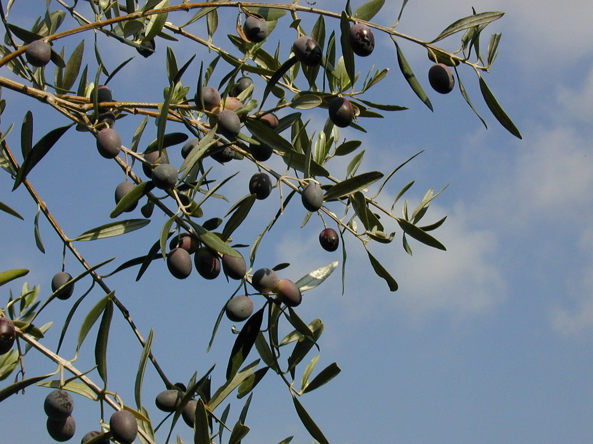

# Plants and Trees in the Bible

## License Information

Plants and Trees in the Bible © United Bible Societies, 2025. Adapted from: <cite>Each According to its Kind: Plants and Trees in the Bible</cite>, by Robert Koops © 2012 United Bible Societies. This work is licensed under Creative Commons Attribution-ShareAlike 4.0 International (<a href="https://creativecommons.org/licenses/by-sa/4.0/">https://creativecommons.org/licenses/by-sa/4.0/</a>).

--------------------------------

## 标题：橄榄树（olive） (id: FLORA:2.8)

2\.8 标题：橄榄树（olive）
==================

经文出处
----

Hebrew 来：זַיִת (音译：zayith)

[GEN 8:11](https://ref.ly/Gen8:11), [EXO 23:11](https://ref.ly/Exod23:11), [EXO 27:20](https://ref.ly/Exod27:20), [LEV 24:2](https://ref.ly/Lev24:2), [DEU 6:11](https://ref.ly/Deut6:11), [DEU 8:8](https://ref.ly/Deut8:8), [DEU 24:20](https://ref.ly/Deut24:20), [DEU 28:40](https://ref.ly/Deut28:40), [DEU 28:40](https://ref.ly/Deut28:40), [JOS 24:13](https://ref.ly/Josh24:13), [JDG 9:8](https://ref.ly/Judg9:8), [JDG 9:9](https://ref.ly/Judg9:9), [JDG 15:5](https://ref.ly/Judg15:5), [1SA 8:14](https://ref.ly/1Sam8:14), [2SA 15:30](https://ref.ly/2Sam15:30), [2KI 5:26](https://ref.ly/2Kgs5:26), [2KI 18:32](https://ref.ly/2Kgs18:32), [1CH 27:28](https://ref.ly/1Chr27:28), [NEH 5:11](https://ref.ly/Neh5:11), [NEH 8:15](https://ref.ly/Neh8:15), [NEH 9:25](https://ref.ly/Neh9:25), [JOB 15:33](https://ref.ly/Job15:33), [PSA 52:10](https://ref.ly/Ps52:10), [PSA 128:3](https://ref.ly/Ps128:3), [ISA 17:6](https://ref.ly/Isa17:6), [ISA 24:13](https://ref.ly/Isa24:13), [JER 11:16](https://ref.ly/Jer11:16), [HOS 14:7](https://ref.ly/Hos14:7), [AMO 4:9](https://ref.ly/Amos4:9), [MIC 6:15](https://ref.ly/Mic6:15), [HAB 3:17](https://ref.ly/Hab3:17), [HAG 2:19](https://ref.ly/Hag2:19), [ZEC 4:3](https://ref.ly/Zech4:3), [ZEC 4:11](https://ref.ly/Zech4:11), [ZEC 4:12](https://ref.ly/Zech4:12), [ZEC 14:4](https://ref.ly/Zech14:4), [ZEC 14:4](https://ref.ly/Zech14:4)

Greek 希：καλλιέλαιος (音译：kallielaios)

[ROM 11:24](https://ref.ly/Rom11:24)

Greek 希：ἀγριέλαιος (音译：agrielaios)

[ROM 11:17](https://ref.ly/Rom11:17), [ROM 11:24](https://ref.ly/Rom11:24)

Greek 希：ἐλαία (音译：elaia)

[MAT 21:1](https://ref.ly/Matt21:1), [MAT 24:3](https://ref.ly/Matt24:3), [MAT 26:30](https://ref.ly/Matt26:30), [MRK 11:1](https://ref.ly/Mark11:1), [MRK 13:3](https://ref.ly/Mark13:3), [MRK 14:26](https://ref.ly/Mark14:26), [LUK 19:29](https://ref.ly/Luke19:29), [LUK 19:37](https://ref.ly/Luke19:37), [LUK 21:37](https://ref.ly/Luke21:37), [LUK 22:39](https://ref.ly/Luke22:39), [JHN 8:1](https://ref.ly/John8:1), [ROM 11:17](https://ref.ly/Rom11:17), [ROM 11:24](https://ref.ly/Rom11:24), [JAS 3:12](https://ref.ly/Jas3:12), [REV 11:4](https://ref.ly/Rev11:4), [JDT 15:13](https://ref.ly/Jdt15:13), [SIR 24:14](https://ref.ly/Sir24:14), [SIR 50:10](https://ref.ly/Sir50:10)

Greek 希：ἐλαιών (音译：elaiōn)

[ACT 1:12](https://ref.ly/Acts1:12)

Greek 希：θαλλός (音译：thallos)

[2MA 14:4](https://ref.ly/2Macc14:4)

Latin 拉：oliva

Latin 拉：oliva

[2ES 16:30](https://ref.ly/2Esd16:30)

讨论
--

*橄榄树 (Ray Pritz (UBS))*

世界上有400多种橄榄科树木，其中许多生长在非洲、印度和澳大利亚，但最著名的品种是圣经中提到的油橄榄（学名*Olea europaea* ）。这种橄榄树很可能是在主前第三个千年的埃及或地中海东部盆地栽培的。植物学家纽伯里（Newberry）认为其原产地是在埃及。我们从圣经中知道，橄榄树生长在撒玛利亚的山地和丘陵地带。橄榄有一个野生品种，名叫*Olea europaea sylvestris* ，比栽培的品种矮小，并且果实较小，含油量也低。使徒保罗在[ROM 11:17](https://ref.ly/Rom11:17); [ROM 11:24](https://ref.ly/Rom11:24) 提到这种野橄榄树。橄榄树很容易繁殖，可以扦插，或者把高产的品种嫁接到低产的品种上。它们在排水较快的山坡上长势最好。8月结果，但是要到12月或次年1月才成熟。

描述
--

橄榄树并不高大，最高10米（33英尺），修剪后通常保持在5米（17英尺）左右。树叶的正面为灰绿色，背面是白色。幼树的树皮是银灰色的，随着树龄的增长，树皮会越来越粗糙，颜色越来越深。树干也会扭转并形成空心，直径可超过1米。橄榄树可以生长数百年，以色列地区的有些橄榄树可能已存活2000年之久。

*橄欖樹 (Elbert Boot (UBS))*

橄榄树的果实长约2厘米（1英寸），厚度略超过1厘米（0\.5英寸）。果实里面有一个硬核，柔软的果皮包着富含油的果肉。今天，一棵成熟的橄榄树可以结出10—20公斤（22—44磅）果实，加工后可产出1\.3—2\.6公斤（3—6磅）橄榄油（赫珀，第107页）。

特殊意义
----

*橄榄山上的老橄榄树 (James Emery (Wikimedia Commons))*

犹太人的"三大"树木是葡萄树、无花果树和橄榄树。橄榄不仅可以食用，更重要的是可以榨油。橄榄油可用于烹饪、点灯、擦身、入药和宗教礼仪。雅各在他看见天使的地方，把橄榄油倒在石头上，宣告那地为圣（[GEN 28:18](https://ref.ly/Gen28:18) ）。摩西用橄榄油混合多种香料，来涂抹帐幕和里面的一切器具（[EXO 40:9](https://ref.ly/Exod40:9) ）。亚伦和在帐幕中事奉的祭司也会受膏抹（[EXO 29:21](https://ref.ly/Exod29:21) ）。这个仪式后来推及到先知（[PSA 105:15](https://ref.ly/Ps105:15); [ISA 61:1](https://ref.ly/Isa61:1) ）和君王（[1SA 16:13](https://ref.ly/1Sam16:13); [1KI 1:39](https://ref.ly/1Kgs1:39) ）。在[2MA 14:4](https://ref.ly/2Macc14:4) ，希腊文*thallos* （"橄榄枝"）似乎是祭司阿耳基慕（亚勒基摩）属灵权柄的象征；他反对犹大马加比。

翻译
--

*橄榄 (Ray Pritz (UBS))*

有一些野橄榄品种生长在非洲、印度和澳大利亚，但并不为人熟知。人们所说的"非洲橄榄"（学名*Canarium schweinfurthii* ；豪萨文*atili* 、约鲁巴文*origbo* 、埃菲克文*eben etridon* 、喀麦隆文*abel* 、科特迪瓦*aiele* 、加纳*bediwunua* /*eyere* 、乌干达*mwafu* ）结黑色、含油的果实，和橄榄很像，在尼日利亚北部是一种常见的小吃。"中国橄榄"也是橄榄属（学名*Canarium* ）的一个品种，如果所结的果子可食用，并且能够榨油，就可以用作文化上的替代词。"俄罗斯橄榄"生长在世界干旱地区，隶于胡颓子科（学名*Elaeagnus* ），不是真正的橄榄树。在印度和尼泊尔，有一种用于建筑的橄榄树（学名*Olea cuspidate* ），但不能用在圣经译文中；不过，在研读版圣经中，可以指出这种树与圣经中的橄榄树是近缘树木。

由于世界上大部分橄榄树的果实都不能食用，因此在翻译时，可能无法用当地的品种来替代圣经中的橄榄树。但是，如果采用了当地的品种作为译词，则需要增加一个脚注，说明巴勒斯坦橄榄树的果实可以食用和榨油。如果在翻译者所在地区，橄榄属（学名*Canarium* ）的一个品种（例如尼日利亚北部的*atili* ）是可以食用的，那么就可以使用当地名称来翻译。否则，翻译者需要按照某种主要语言的词语进行音译，例如，*olivi* /*wolifu* （英文）、*zayitu* （法文、希伯来文）、*zeitun* （阿拉伯文）、*asetuna* （西班牙文）、*azeitona* /*olivo* （葡萄牙文）、*oliibu* （韩文），或"橄榄树"／"木犀榄"（中文）。

[1KI 6:23](https://ref.ly/1Kgs6:23); [1KI 6:31](https://ref.ly/1Kgs6:31); [1KI 6:32](https://ref.ly/1Kgs6:32); [1KI 6:33](https://ref.ly/1Kgs6:33); [NEH 8:15](https://ref.ly/Neh8:15); [ISA 41:19](https://ref.ly/Isa41:19) 提到"油树"（希伯来文*‘ets shemen* ），很多学者和圣经译本都认为这是指橄榄树。我们赞同祖海里和赫珀的意见，认为油树是松树的一个品种（参[1\.18\.2 阿勒坡松、地中海松 (aleppo pine)](#FLORA:1.18.2) ）。

关于橄榄油的说明

在希伯来文中，主要有两个词语指橄榄油：*shemen* 和*yitshar* 。*Shemen* 出现在[GEN 28:18](https://ref.ly/Gen28:18); [GEN 35:14](https://ref.ly/Gen35:14) ，以及许多其他旧约书卷中。*Yitshar* 几乎总是指新榨的油，而且几乎每次都与希伯来文*tirosh* （"酒"、"新酒"）和／或刚收成的五谷（*dagan* ）一起出现，参[NEH 5:11](https://ref.ly/Neh5:11) 等。希伯来文动词*tsahar* 意指"榨出油来"，引申指"闪烁"／"发光"。在[EZR 6:9](https://ref.ly/Ezra6:9) 中，作者使用了亚兰文词语来指称酒（*chamar* ）和油（*meshach* ，源自意为"膏抹"或"擦"的词根）。

关于橄榄油及其在圣经中的用途，参《人手所做之工：圣经中的物件》（WTH ），[9\.3](#REALIA:9.3) 。

* **Associated Passages:** 创世记 8:11; 出埃及记 23:11; 出埃及记 27:20; 利未记 24:2; 申命记 6:11; 申命记 8:8; 申命记 24:20; 申命记 28:40; 约书亚记 24:13; 士师记 9:8; 士师记 9:9; 士师记 15:5; 撒母耳记上 8:14; 撒母耳记下 15:30; 列王纪下 5:26; 列王纪下 18:32; 历代志上 27:28; 尼希米记 5:11; 尼希米记 8:15; 尼希米记 9:25; 约伯记 15:33; 诗篇 52:10; 诗篇 128:3; 以赛亚书 17:6; 以赛亚书 24:13; 耶利米书 11:16; 何西阿书 14:7; 阿摩司书 4:9; 弥迦书 6:15; 哈巴谷书 3:17; 哈该书 2:19; 撒迦利亚书 4:3; 撒迦利亚书 4:11; 撒迦利亚书 4:12; 撒迦利亚书 14:4; 罗马书 11:24; 罗马书 11:17; 马太福音 21:1; 马太福音 24:3; 马太福音 26:30; 马可福音 11:1; 马可福音 13:3; 马可福音 14:26; 路加福音 19:29; 路加福音 19:37; 路加福音 21:37; 路加福音 22:39; 约翰福音 8:1; 雅各书 3:12; 启示录 11:4; 友弟德传 15:13; 德训篇 24:14; 德训篇 50:10; 使徒行传 1:12; 玛加伯下 14:4; 厄斯德拉下 16:30; 创世记 28:18; 出埃及记 40:9; 出埃及记 29:21; 诗篇 105:15; 以赛亚书 61:1; 撒母耳记上 16:13; 列王纪上 1:39; 列王纪上 6:23; 列王纪上 6:31; 列王纪上 6:32; 列王纪上 6:33; 以赛亚书 41:19; 创世记 35:14; 以斯拉记 6:9

