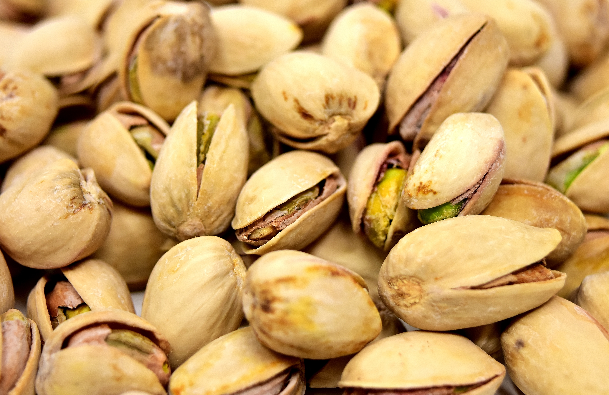

# Plants and Trees in the Bible

## License Information

Plants and Trees in the Bible © United Bible Societies, 2025. Adapted from: <cite>Each According to its Kind: Plants and Trees in the Bible</cite>, by Robert Koops © 2012 United Bible Societies. This work is licensed under Creative Commons Attribution-ShareAlike 4.0 International (<a href="https://creativecommons.org/licenses/by-sa/4.0/">https://creativecommons.org/licenses/by-sa/4.0/</a>).

--------------------------------

## 标题：开心果（pistachio） (id: FLORA:2.9)

2\.9 标题：开心果（pistachio）
======================

经文出处
----

Hebrew 来：בָּטְנִים (音译：botnim)

[GEN 43:11](https://ref.ly/Gen43:11)

讨论
--

世界各地都有黄连木属（学名*Pistacia* ）的树木，尤其是在欧洲和亚洲。结果实的黄连木在地中海地区、西亚，一直到巴基斯坦的地区都生长良好，并且可能在圣经时期就已经生长在那里了。与我们有关的品种有三个：阿月浑子树（学名*Pistacia vera* ，真正的开心果树）、笃耨香黄连木（*Pistacia palaestina* ）和大西洋黄连木（*Pistacia atlantica* ；又称阿特拉斯开心果或阿特拉斯山乳香树）。后两种在圣经中被称为*’elah* 或*’alah* （"笃耨香树"）；参[1\.24 笃耨香树、黄连木 (terebinth)](#FLORA:1.24) 。祖海里认为，[GEN 43:11](https://ref.ly/Gen43:11) 所记雅各的儿子带到埃及作为礼物献给法老的*botnim* ，可能是这三种树木中的一种所结的果子，因为这三种树在当地都有生长。他还认为，[JOS 13:26](https://ref.ly/Josh13:26) 中的"比多宁"这个地名，意思就是笃耨香树或真正的开心果树的果实。

描述
--

*开心果 (Alexas\_Fotos on Pixabay (Wikimedia Commons))*

真正的开心果树（阿月浑子树；学名*Pistacia vera* ）是一种小乔木，树枝繁茂，冬季落叶，种子是长约2厘米（1英寸）的坚果，外壳坚硬，红色，呈心形，绿色的内核长约1厘米（0\.5英寸），含油。

特殊意义
----

无论希伯来文*botnim* 是指真正的开心果还是笃耨香树的果实，显然这种食物具有很高的价值，因为我们看到雅各要儿子们将其作为礼物送给法老。

欧洲商店里的开心果通常会染成红色。这个传统始于20世纪30年代，当时的进口商给外壳染色，以遮盖采摘时造成的微小损坏。

翻译
--

由于*botnim* 指的是果实，且只出现过一次，因此我们不确定它是真正的开心果还是笃耨香树的果实。如果翻译者所在的地方没有这些树，那么可以依循一个主要语言的译本，采用开心果或笃耨香树的音译，甚至可以使用一个统称。用来音译开心果的词语有法文*pistache* 、阿拉伯文*fustuq* /*futua* 、西班牙文*pistachio* /*alfonigo* 、葡萄牙文*alfoncico* 等。

* **Associated Passages:** 创世记 43:11; 约书亚记 13:26

