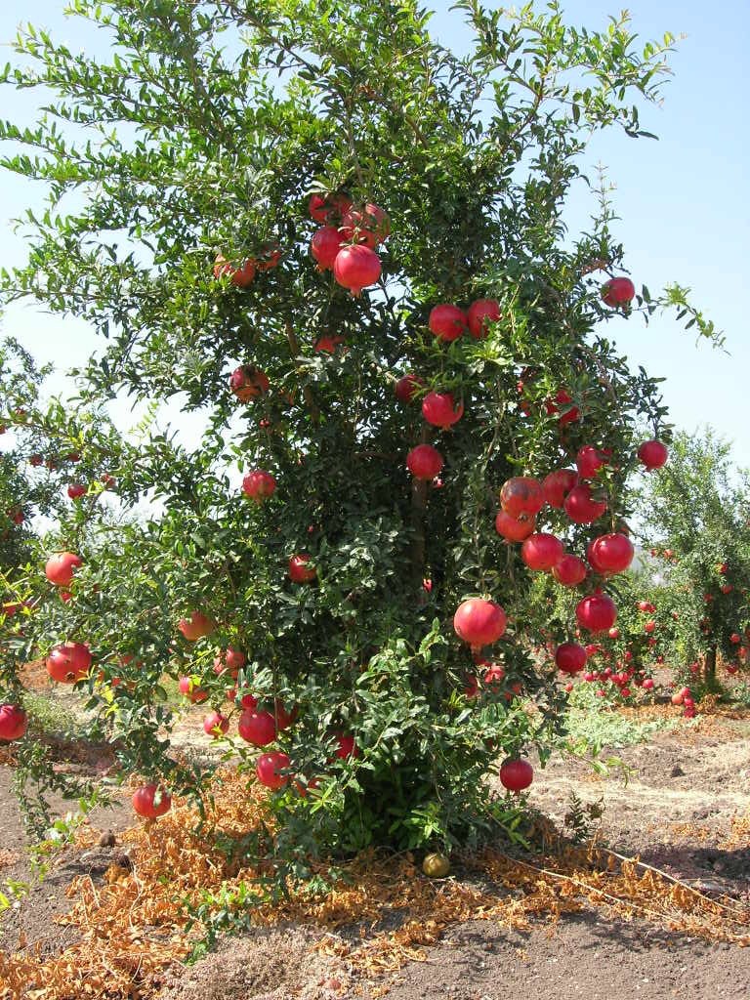
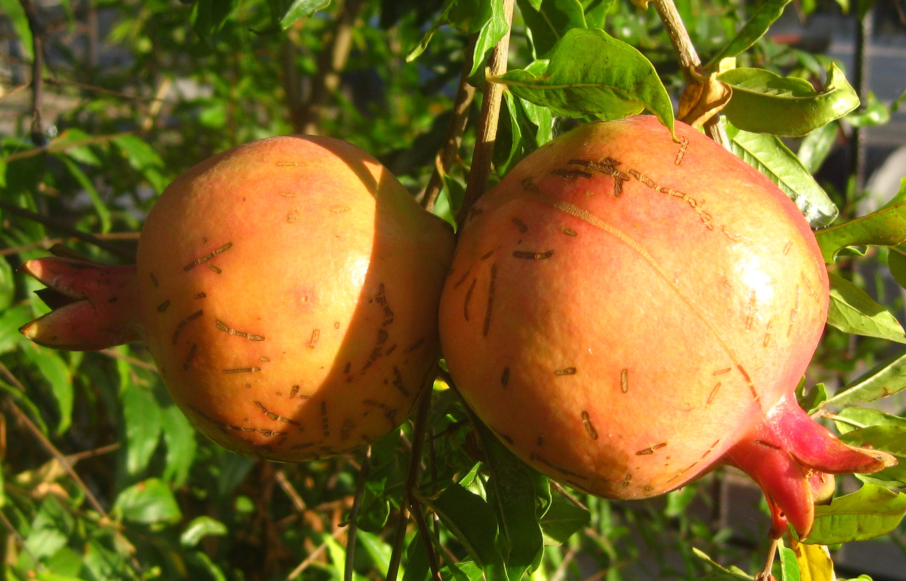

# Plants and Trees in the Bible

## License Information

Plants and Trees in the Bible © United Bible Societies, 2025. Adapted from: <cite>Each According to its Kind: Plants and Trees in the Bible</cite>, by Robert Koops © 2012 United Bible Societies. This work is licensed under Creative Commons Attribution-ShareAlike 4.0 International (<a href="https://creativecommons.org/licenses/by-sa/4.0/">https://creativecommons.org/licenses/by-sa/4.0/</a>).

--------------------------------

## 标题：石榴（pomegranate） (id: FLORA:2.10)

2\.10 标题：石榴（pomegranate）
========================

经文出处
----

Hebrew 来：רִמּוֹן (音译：rimmon)

[EXO 28:33](https://ref.ly/Exod28:33), [EXO 28:34](https://ref.ly/Exod28:34), [EXO 28:34](https://ref.ly/Exod28:34), [EXO 39:24](https://ref.ly/Exod39:24), [EXO 39:25](https://ref.ly/Exod39:25), [EXO 39:25](https://ref.ly/Exod39:25), [EXO 39:26](https://ref.ly/Exod39:26), [EXO 39:26](https://ref.ly/Exod39:26), [NUM 13:23](https://ref.ly/Num13:23), [NUM 20:5](https://ref.ly/Num20:5), [DEU 8:8](https://ref.ly/Deut8:8), [1SA 14:2](https://ref.ly/1Sam14:2), [1KI 7:18](https://ref.ly/1Kgs7:18), [1KI 7:20](https://ref.ly/1Kgs7:20), [1KI 7:42](https://ref.ly/1Kgs7:42), [1KI 7:42](https://ref.ly/1Kgs7:42), [2KI 25:17](https://ref.ly/2Kgs25:17), [2CH 3:16](https://ref.ly/2Chr3:16), [2CH 4:13](https://ref.ly/2Chr4:13), [2CH 4:13](https://ref.ly/2Chr4:13), [SNG 4:3](https://ref.ly/Song4:3), [SNG 4:13](https://ref.ly/Song4:13), [SNG 6:7](https://ref.ly/Song6:7), [SNG 6:11](https://ref.ly/Song6:11), [SNG 7:13](https://ref.ly/Song7:13), [SNG 8:2](https://ref.ly/Song8:2), [JER 52:22](https://ref.ly/Jer52:22), [JER 52:22](https://ref.ly/Jer52:22), [JER 52:23](https://ref.ly/Jer52:23), [JER 52:23](https://ref.ly/Jer52:23), [JOL 1:12](https://ref.ly/Joel1:12), [HAG 2:19](https://ref.ly/Hag2:19)

Greek 希：ροΐσκος (音译：roiskos)

[SIR 45:9](https://ref.ly/Sir45:9)

讨论
--

*石榴树 (Amnon s (Wikimedia Commons))*

自古以来，石榴（学名*Punica granatum* ）就生长在中东、伊朗，直至印度北部。这种树木在整个印度、东南亚的干旱地区、马来半岛、东印度群岛和热带非洲均广泛栽培。现在，石榴遍布南欧的温暖地区、北非和亚洲，一直到尼泊尔。在埃及的卡纳克法老神庙中，发现了可追溯到大约主前1480年的石榴图画。这种植物在古典拉丁文中的名称是*malum punium* （普尼苹果）或*malum granatum* （多籽苹果）。这个名称影响了石榴在许多语言中的常用名（例如，德文*Granatapfel* ，"有籽的苹果"）。英文的pomegranate（石榴）一词源于拉丁文*pomum* （水果、苹果），经古法文演变而成（比较法文中的*pomme* ）。阿拉伯文*rummân* 影响了其他一些语言，包括葡萄牙文*romã* 。

描述
--

*石榴 (Susan Slater (Wikimedia Commons))*

石榴是一种小型乔木，可长到3—5米（10—17英尺）高，叶子较窄、呈深绿色，树枝茂盛、带刺，开美丽的红色花朵。石榴果比橙子小一点，果皮很硬，要切开才能看到里面塞得密密实实的种室，每粒种子都包在一个多汁的小果肉袋内。果实的尾部呈独特的花形。果实成熟后，坚硬的果皮会从绿色变成红色，可作鞣革剂、入药，或制作墨水。种子有时用来酿酒。石榴树可存活200年左右。

特殊意义
----

[DEU 8:8](https://ref.ly/Deut8:8) 记载，以色列人在迦南将得享七种"特殊的"食物，石榴是其中之一。探子把迦南地的几种水果带回到以色列人安营的地方，其中就有石榴（[NUM 13:23](https://ref.ly/Num13:23) ）。在[JOS 15:32](https://ref.ly/Josh15:32) ，这是一个地名（临门）。[SNG 4:3](https://ref.ly/Song4:3) 描写君王新娘的脸颊像迸开的石榴，这可能是在形容脸颊的红润。石榴尾部的花形很适合作装饰，例如祭司长袍的下摆（[EXO 28:33](https://ref.ly/Exod28:33); [EXO 28:34](https://ref.ly/Exod28:34); [EXO 28:34](https://ref.ly/Exod28:34) ）、圣殿柱子的顶部，以及圣殿里面的器具（[2KI 25:17](https://ref.ly/2Kgs25:17) ）。耶路撒冷圣殿现存年代最早的物品之一，就是一个石榴形状的雕刻品，可能是一根杖的杖头。先知约珥提到五种因为干旱和蝗灾而枯干的植物，石榴是其中之一（[JOL 1:12](https://ref.ly/Joel1:12) ）。

在犹太传统中，石榴代表公义，因为据说石榴有613颗籽，对应《妥拉》中的613条诫命。由于这个原因和其他原因，许多犹太人在犹太新年（Rosh Hashanah）会吃石榴。犹太传统还认为，皇冠最初就是照着石榴的尖花萼来设计的。

巴比伦人相信，在战斗前咀嚼石榴籽能使他们战无不胜。《古兰经》中有三次提到石榴。其中两次是在提到上帝美好创造的时候，以石榴作为例子；还有一次是在讲到乐园里的水果时提到的。

翻译
--

*石榴 (Ton Rulkens (Wikimedia Commons))*

直到近年，石榴才开始在地中海地区以外种植。石榴在西非还不是一种常见的水果，知道的人称其为*rummân* （源自阿拉伯文）。在[SNG 4:3](https://ref.ly/Song4:3) 和[SNG 6:7](https://ref.ly/Song6:7) 中，石榴是修辞用语，翻译者可以使用表示红色或美丽的文化对等词。在其他经文中，建议翻译者按照某种主要语言进行音译；例如，*roman* /*rumman* （阿拉伯文）、*romã* /*romeira* /*roman­zeiro* （葡萄牙文）、*grenade* /*mangrano* （法文），以及*seok ryu* （韩文）。在英文"pomegranate"（"石榴"）一词中，*pome* 的意思是"果实"，因此要进行音译的基本词汇是*granate* （比较西班牙文的*granada* ）。可以音译为"garinada果"。石榴的拉丁文是*Punica granatum* ，意为布匿的"手榴弹"；布匿即迦太基，是位于今突尼斯的一座城市。拉丁文*granatum* 的意思是"充满五谷或种子"。为了反映出这一点，几内亚的班巴拉人将这个词译为"karanati果"。翻译者也可以使用希伯来文*rimmon* 作为基本词汇。在受阿拉伯文影响的地区，翻译者也许能找到像*rummân* 之类的词，例如曼丁哥文的*roomaanoo* 。另外，翻译者可以增加脚注，指出这种水果与一种红色、多籽的番石榴类似。

虽然石榴近年来被引进到整个非洲地区，但知道这种水果的人并不很多，因此石榴的名称很可能需要音译。由于石榴的英文很长（pomegranate），建议翻译者从其他语言进行音译，或缩短译名，例如译为"granata果"。

[EXO 28:33](https://ref.ly/Exod28:33) ："在袍子的下摆一圈，要用蓝色、紫色、朱红色的衣料做石榴，石榴中间要有金铃铛。"这里，作者说到用布料（"蓝色、紫色、朱红色的衣料"）做成石榴的图案。翻译者可以译成"用彩色的线（或棉）做出石榴图案"等，也可以考虑使用插图。另外，翻译者还可以考虑在文本中使用"好像树上的果子"这样的表述，然后在脚注中注明树的种类（石榴）。LB (Living Bible (1971)) 把石榴解作刺绣，但让人感觉铃铛也是绣上去的，这样就显得很奇怪，因为铃铛需要发出声音（35节）。NCV (New Century Version) 译成"balls like pomegranates"（英文直译："像石榴一样的球"），意思很清晰。CEV (Contemporary English Version) 为33—34节提供了一个很好的翻译范例，英文直译为："沿着袍子的下摆，用蓝色、紫色和红色的毛线织出石榴，每两个石榴之间有一个金铃铛。"

[1KI 7:18](https://ref.ly/1Kgs7:18) ：有些希伯来文抄本不作"石榴"，而是作"柱子"（*‘amudim* ，而非*rimmonim* ）。HOTTP (Hebrew Old Testament Text Project (UBS)) 在这里倾向于*‘amudim* （柱子），但是评级只有"C"。文本从*‘amudim* （"柱子"）变成*rimmonim* （"石榴"）可能是因为：

（1）"柱子"的读文很难理解。抄经者很可能觉得"石榴"更加合理，因此作了修改。

（2）与平行经文类似。在这个例子中，抄经者可能参考了第20和42节，可能还有[2CH 3:16](https://ref.ly/2Chr3:16) ，这三节经文都作*rimmonim* （石榴）。

即使译成"石榴"（如《七十士译本》、RSV (Revised Standard Version (1952)) 和大多数现代译本），也仍然存在一些问题。我们无法从希伯来文本中判断，这些铜做的水果是单独铸造的（NAB (New American Bible (1970)) 明确地这样表述），还是锤打或蚀刻到铜的表面上的（CEV (Contemporary English Version) 译为"designs that looked like pomegranates"，"似石榴的图案"）。最重要的一点是：要明确指出这些物件是石榴果实的模型还是图案，FFB 第168—170页对此有很好的描述。

* **Associated Passages:** 出埃及记 28:33; 出埃及记 28:34; 出埃及记 39:24; 出埃及记 39:25; 出埃及记 39:26; 民数记 13:23; 民数记 20:5; 申命记 8:8; 撒母耳记上 14:2; 列王纪上 7:18; 列王纪上 7:20; 列王纪上 7:42; 列王纪下 25:17; 历代志下 3:16; 历代志下 4:13; 雅歌 4:3; 雅歌 4:13; 雅歌 6:7; 雅歌 6:11; 雅歌 7:13; 雅歌 8:2; 耶利米书 52:22; 耶利米书 52:23; 约珥书 1:12; 哈该书 2:19; 德训篇 45:9; 约书亚记 15:32

* **Associated ACAI Concepts:** Pomegranate (ID: `flora:Pomegranate`)
