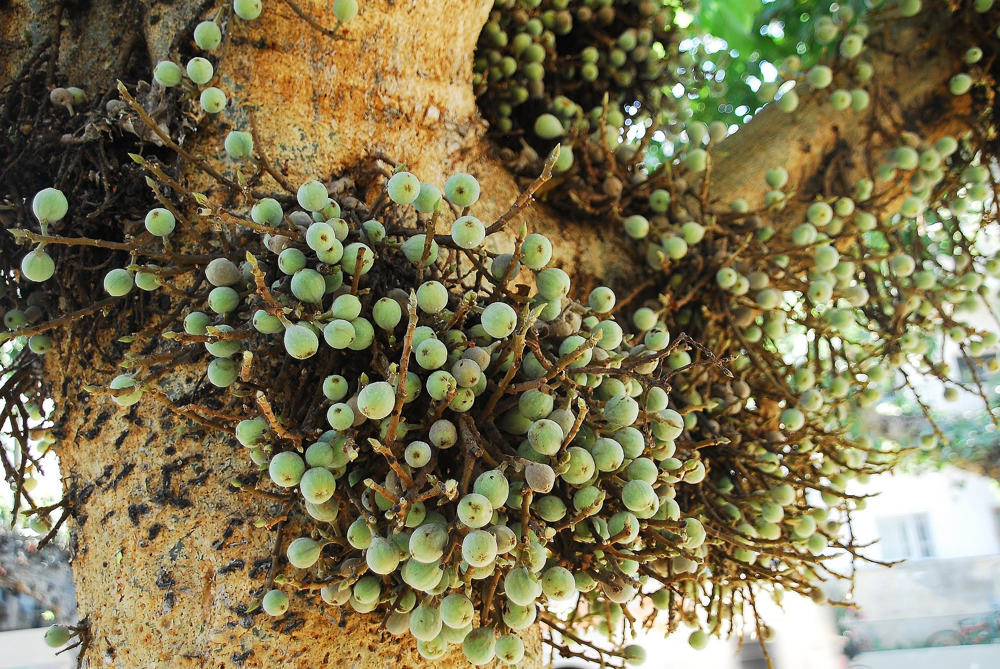
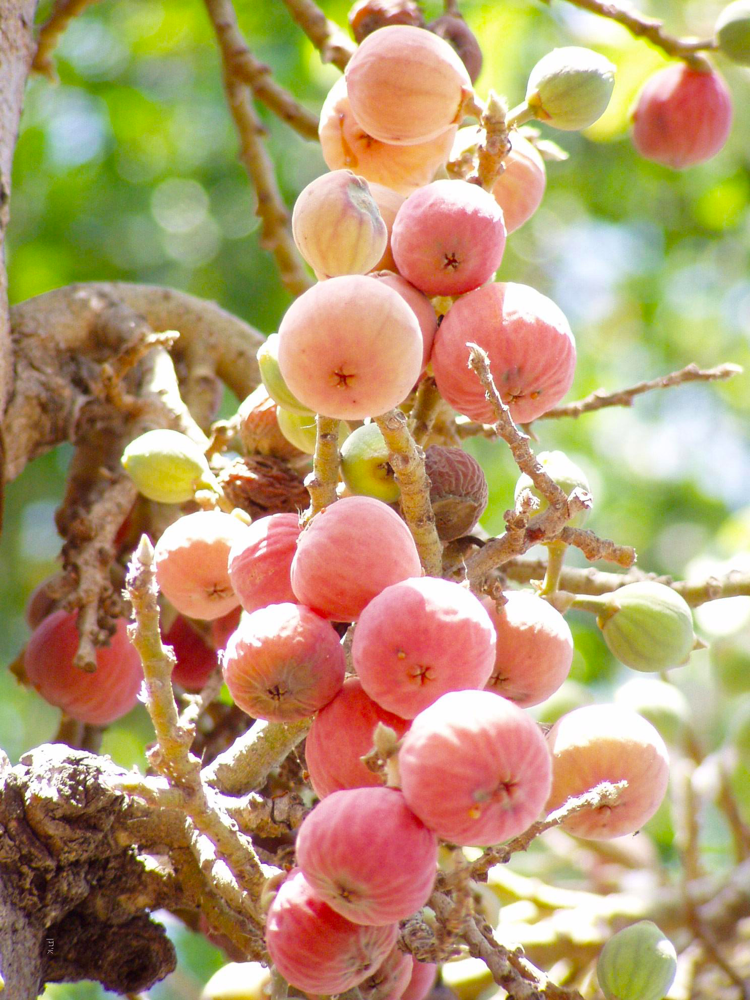

# Plants and Trees in the Bible

## License Information

Plants and Trees in the Bible © United Bible Societies, 2025. Adapted from: <cite>Each According to its Kind: Plants and Trees in the Bible</cite>, by Robert Koops © 2012 United Bible Societies. This work is licensed under Creative Commons Attribution-ShareAlike 4.0 International (<a href="https://creativecommons.org/licenses/by-sa/4.0/">https://creativecommons.org/licenses/by-sa/4.0/</a>).

--------------------------------

## 标题：西克莫无花果（sycomore fig） (id: FLORA:2.11)

2\.11 标题：西克莫无花果（sycomore fig）
=============================

经文出处
----

Hebrew 来：שִׁקְמָה (音译：shiqmah)

[1KI 10:27](https://ref.ly/1Kgs10:27), [1CH 27:28](https://ref.ly/1Chr27:28), [2CH 1:15](https://ref.ly/2Chr1:15), [2CH 9:27](https://ref.ly/2Chr9:27), [PSA 78:47](https://ref.ly/Ps78:47), [ISA 9:9](https://ref.ly/Isa9:9), [AMO 7:14](https://ref.ly/Amos7:14)

Greek 希：συκομορέα (音译：sukomorea)

[LUK 19:4](https://ref.ly/Luke19:4)

讨论
--

我们倾向于采纳赫珀的意见，译为"西克莫无花果"（"sycamore"），而不是"悬铃树"（"sycamore"）。因为"sycomore"的拼写含"o"，更好地保留了拉丁文（*sycomorus* ）和希腊文（*suko­morea* ），并且也在法文中使用。注意，在KJV (King James Version (1611)) 和NEB (New English Bible (1970)) 中，这种树的拼写含有"o"。正如赫珀所指出的（第114页），保留"sycamore"这个名称来指称美国的一种悬铃木（学名*Platanus* ）和英国槭属（学名*Acer* ）的一种树木，可能会对翻译有所帮助。

西克莫无花果（学名*Ficus sycomorus* ），又名桑树无花果（比较德文*Maulbeerfeigen­baum* ），是无花果的一种，尤其盛产于地中海地区的地势较低的地方。早在主前3000年，西克莫无花果在埃及和印度的印度河流域就已经为人所知。目前，以色列的西克莫无花果树主要分布在沿海平原，祖海里推测，这种无花果树先前分布的范围要更广。

先知阿摩司说自己是"修剪西克莫无花果树的"（RSV (Revised Standard Version (1952)) 直译；[AMO 7:14](https://ref.ly/Amos7:14) ）。这可能是指在未成熟的果实上切一道口，从而起到催熟的效果。赫珀（第113页）说，这种现象是果实切口后释放的乙烯气体引起的。今天，水果商贩也使用乙烯气体来催熟橘子和香蕉。

描述
--

西克莫无花果树并不高大，最高约10米（33英尺），低矮的树枝粗大而舒展，正好适合身材较矮的人爬到上面，好从一群较高的人的头顶上面看过去（参[LUK 19:4](https://ref.ly/Luke19:4) 所述撒该的故事）。果实可吃，但不如常见的无花果那样多汁、甘甜。这种树木最特别的地方是：果实是一簇簇地长在树干和树枝上的，而不是长在叶子中间。

特殊意义
----

在[1KI 10:27](https://ref.ly/1Kgs10:27) 中，西克莫无花果用来喻指某物的数量很多。这节经文的后半句说，"他（所罗门王）使香柏木多如谢非拉的西克莫无花果树"（RSV (Revised Standard Version (1952)) 直译）。翻译者要留意这里的逻辑。经文不是说所罗门要把香柏木引进低地（谢非拉），而是说以色列地的香柏木将要像低地的西克莫无花果那样多。

翻译
--

翻译者需要同时处理西克莫无花果和普通无花果。如果翻译倾向于异化，翻译者可能需要同时音译普通无花果和西克莫无花果（例如*sikomori* ）。在有些情况下，使用西克莫无花果这个全称可能较好。如果当地有一种无花果，那么可以使用当地名称来翻译栽培的无花果（希伯来文*te’enah* ；希腊文*sukē* ）；当提到西克莫无花果时，可以添加"野生"或"低地"等词语来指这种无花果（希伯来文*shiqmah* ；希腊文*sukomorea* ）。

如果当地人对无花果一无所知，那么可以使用某种国际语言的音译，例如法文（*sycomore* ）、西班牙文（*sicomoro* ）或希伯来文（*shiqmah* ）。与普通的无花果相比，西克莫无花果生长在海拔比较低的地方（谢非拉），这一点在翻译中可能会用到（例如译成"低地无花果"）。GECL (German Common Language Version (Gute Nachricht Bibel)) 译作*Maulbeerfeigenbaum* （意为"桑树无花果"）。

* **Associated Passages:** 列王纪上 10:27; 历代志上 27:28; 历代志下 1:15; 历代志下 9:27; 诗篇 78:47; 以赛亚书 9:9; 阿摩司书 7:14; 路加福音 19:4

