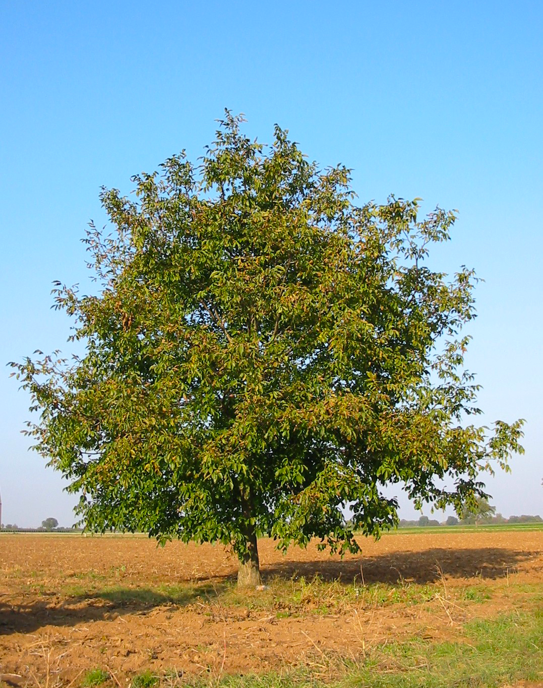

# Plants and Trees in the Bible

## License Information

Plants and Trees in the Bible © United Bible Societies, 2025. Adapted from: <cite>Each According to its Kind: Plants and Trees in the Bible</cite>, by Robert Koops © 2012 United Bible Societies. This work is licensed under Creative Commons Attribution-ShareAlike 4.0 International (<a href="https://creativecommons.org/licenses/by-sa/4.0/">https://creativecommons.org/licenses/by-sa/4.0/</a>).

--------------------------------

## 标题：胡桃（walnut） (id: FLORA:2.13)

2\.13 标题：胡桃（walnut）
===================

经文出处
----

Hebrew 来：אֱגוֹז (音译：’egoz)

[SNG 6:11](https://ref.ly/Song6:11)

讨论
--

*胡桃树 (Georg Slickers (Wikimedia Commons))*

关于[SNG 6:11](https://ref.ly/Song6:11) 中提到的*’egoz* （"坚果园"）是什么，人们尚无定论。这种树可能是胡桃（walnut；CEV (Contemporary English Version) 、GW (God's Word Translation) 、FRCL (French Common Language Version (Bible en français courant)) 、GECL (German Common Language Version (Gute Nachricht Bibel)) ），因为这种树在圣经时期是众所周知的，尽管可能只在这节经文中出现。大多数译本为了稳妥起见，译成"坚果园"（"nut orchard"；RSV (Revised Standard Version (1952)) ）、"坚果树林"（"grove of nut trees"；NIV (New International Version (1984)) ）或类似的短语。GNB (Good News Bible) 译为"almond"（"杏"），这也是可能的，尽管有人可能会问，如果作者是指杏，为什么不使用两个通常表示杏的希伯来文词语（*luz* 或*shaqed* ）。

犹太历史学家约瑟夫指出，胡桃是在加利利海地区栽培的。其他早期犹太著作描述了多种胡桃产品，包括油、单宁（用于皮革加工）和木材。东耶路撒冷还有一个地方叫胡桃谷。阿拉伯文同源词*goz* 和*jauz* 指胡桃，这进一步说明*’egoz* 指的是胡桃。

描述
--

*胡桃树皮和坚果 (Dalgial (Wikimedia Commons))*

中东胡桃树（学名*Juglans regia* ）可长到6—8米（20—26英尺）高，树干粗壮、枝条繁多、树冠呈圆形。胡桃木质地很硬，适合做家具。这种树原产于欧洲东南部，在高加索地区、土耳其北部、伊朗和其他西亚国家也曾有过胡桃林。迦南的胡桃树可能是从土耳其或现今的伊朗引进的。

在欧洲、亚洲、美洲，一直到安第斯山脉的温带地区，分布着40种胡桃树的亚种。日本也有一种胡桃。在热带地区，有一些树和真正的胡桃有些相似，因而也被称为"胡桃"。例如，常说的非洲胡桃（或尼日利亚金胡桃）其实是洛沃栋（学名*Lovoa trichilioides* ），东印度胡桃是阔荚合欢（学名*Albizia lebbeck* ），新几内亚胡桃是人面子属（学名*Dracontomelon* ）树木的一种，奥塔希地胡桃是石栗（学名*Aleurites moluccana* ），澳大利亚胡桃是昆士兰土楠（学名*Endiandra palmerstonii* ）。胡桃属中最为人所知的品种是波斯胡桃或普通胡桃（学名*Juglans regia* ），原产于欧洲东南部的巴尔干半岛、亚洲西南部和中部，以及中国西南部。美国人常把波斯胡桃误认为是英国胡桃（该品种并非原产于英格兰）。世界上最大、最古老的野生胡桃树林位于吉尔吉斯斯坦贾拉拉巴德省的阿斯兰博（Arslanbob）。

特殊意义
----

*带壳和剥掉壳的胡桃种子 (Fir0002 at English Wikipedia (Wikimedia Commons))*

[SNG 6:11](https://ref.ly/Song6:11) （"我下到坚果园……"）描绘了一幅美丽芳香的场景，引起人的遐想："我的幻想把我带到一辆马车上，坐在我王子的旁边。"普通胡桃的坚果很美味，过去和现在都被广泛种植。胡桃还产油，叶子芳香，树荫浓密。胡桃树在希腊和欧洲神话中具有正面意义。但在欧洲的"黑暗时代"，人们却对胡桃树感到恐惧，因为他们认为胡桃茂密的树叶是魔鬼的藏身之处。阿拉伯人使用胡桃木做盾牌，用胡桃坚果的壳做墨水。胡桃的坚果和油还有药用价值。

翻译
--

"坚果"（"nut"）是一个统称，指各种各样的种子、果实和根茎（花生）。很多语言都没有这样的统称。因此，翻译者可能需要采用一个比较一般性的短语，如"果园"，或者采用一个比较具体的名称。如果想要音译，那么"胡桃"可能比"杏仁"更好。如果翻译者生活的地区有真正的胡桃树，那么建议使用"胡桃"。如果翻译者生活的地区有所说的"非洲胡桃"，例如尼日利亚的品种（学名*Lovoa trichilioides* ），那么也可以使用这样的树木来翻译，尽管在植物学上它们和胡桃并不对等。

由于[SNG 6:11](https://ref.ly/Song6:11) 是一节诗歌体的经文，翻译者可以使用合适的当地对等词来"归化"文本，或使用某种主要语言的音译来"异化"文本。归化译法可能听起来比较有诗意，并且翻译者可以添加脚注来提供一些目前所知的植物学信息。然而，像"果园"这样的一般性短语也不见得就没有诗意。

对于上文所述的几种译法，我个人的倾向从高到低依次是：

1\. 使用统称"果园"；

2\. 使用当地某种美味的水果作为对等词；

3\. 音译某种主要语言中的"胡桃"一词。可以音译的词语有阿拉伯文*djawz* 、西班牙文*nogal comun* 、法文*noix royal* /*noix comun* 、葡萄牙文*noguera comun* 、中文"胡桃"等。

* **Associated Passages:** 雅歌 6:11

* **Associated ACAI Concepts:** Walnut (ID: `flora:Walnut`)
