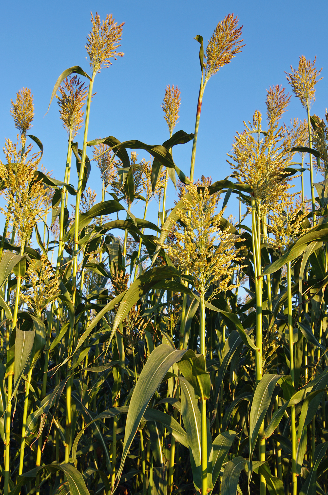
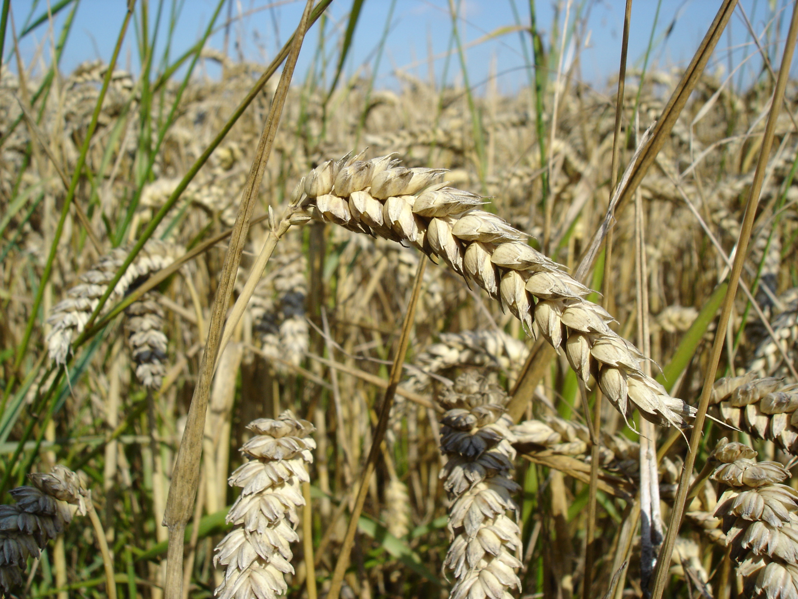

# Plants and Trees in the Bible

## License Information

Plants and Trees in the Bible © United Bible Societies, 2025. Adapted from: <cite>Each According to its Kind: Plants and Trees in the Bible</cite>, by Robert Koops © 2012 United Bible Societies. This work is licensed under Creative Commons Attribution-ShareAlike 4.0 International (<a href="https://creativecommons.org/licenses/by-sa/4.0/">https://creativecommons.org/licenses/by-sa/4.0/</a>).

--------------------------------

## 标题：谷物（grain） (id: FLORA:3.1)

3\.1 标题：谷物（grain）
=================

Hebrew 来：דָּגָן (音译：dagan)

[GEN 27:28](https://ref.ly/Gen27:28), [GEN 27:37](https://ref.ly/Gen27:37), [NUM 18:12](https://ref.ly/Num18:12), [NUM 18:27](https://ref.ly/Num18:27), [DEU 7:13](https://ref.ly/Deut7:13), [DEU 11:14](https://ref.ly/Deut11:14), [DEU 12:17](https://ref.ly/Deut12:17), [DEU 14:23](https://ref.ly/Deut14:23), [DEU 18:4](https://ref.ly/Deut18:4), [DEU 28:51](https://ref.ly/Deut28:51), [DEU 33:28](https://ref.ly/Deut33:28), [2KI 18:32](https://ref.ly/2Kgs18:32), [2CH 31:5](https://ref.ly/2Chr31:5), [2CH 32:28](https://ref.ly/2Chr32:28), [NEH 5:2](https://ref.ly/Neh5:2), [NEH 5:3](https://ref.ly/Neh5:3), [NEH 5:10](https://ref.ly/Neh5:10), [NEH 5:11](https://ref.ly/Neh5:11), [NEH 10:40](https://ref.ly/Neh10:40), [NEH 13:5](https://ref.ly/Neh13:5), [NEH 13:12](https://ref.ly/Neh13:12), [PSA 4:8](https://ref.ly/Ps4:8), [PSA 65:10](https://ref.ly/Ps65:10), [PSA 78:24](https://ref.ly/Ps78:24), [ISA 36:17](https://ref.ly/Isa36:17), [ISA 62:8](https://ref.ly/Isa62:8), [JER 31:12](https://ref.ly/Jer31:12), [LAM 2:12](https://ref.ly/Lam2:12), [EZK 36:29](https://ref.ly/Ezek36:29), [HOS 2:10](https://ref.ly/Hos2:10), [HOS 2:11](https://ref.ly/Hos2:11), [HOS 2:24](https://ref.ly/Hos2:24), [HOS 7:14](https://ref.ly/Hos7:14), [HOS 9:1](https://ref.ly/Hos9:1), [HOS 14:8](https://ref.ly/Hos14:8), [JOL 1:10](https://ref.ly/Joel1:10), [JOL 1:17](https://ref.ly/Joel1:17), [JOL 2:19](https://ref.ly/Joel2:19), [HAG 1:11](https://ref.ly/Hag1:11), [ZEC 9:17](https://ref.ly/Zech9:17)

Hebrew 来：בַּר (音译：bar)

[GEN 41:35](https://ref.ly/Gen41:35), [GEN 41:49](https://ref.ly/Gen41:49), [GEN 42:3](https://ref.ly/Gen42:3), [GEN 42:25](https://ref.ly/Gen42:25), [GEN 45:23](https://ref.ly/Gen45:23), [PSA 65:14](https://ref.ly/Ps65:14), [PSA 72:16](https://ref.ly/Ps72:16), [PRO 11:26](https://ref.ly/Prov11:26), [PRO 14:4](https://ref.ly/Prov14:4), [JER 23:28](https://ref.ly/Jer23:28), [JOL 2:24](https://ref.ly/Joel2:24), [AMO 5:11](https://ref.ly/Amos5:11), [AMO 8:5](https://ref.ly/Amos8:5), [AMO 8:6](https://ref.ly/Amos8:6)

Hebrew 来：שֶׁבֶר (音译：shever)

[GEN 42:1](https://ref.ly/Gen42:1), [GEN 42:2](https://ref.ly/Gen42:2), [GEN 42:19](https://ref.ly/Gen42:19), [GEN 42:26](https://ref.ly/Gen42:26), [GEN 43:2](https://ref.ly/Gen43:2), [GEN 44:2](https://ref.ly/Gen44:2), [GEN 47:14](https://ref.ly/Gen47:14)

Hebrew 来：קָמָה (音译：qamah)

[EXO 22:5](https://ref.ly/Exod22:5), [DEU 16:9](https://ref.ly/Deut16:9), [DEU 23:26](https://ref.ly/Deut23:26), [DEU 23:26](https://ref.ly/Deut23:26), [JDG 15:5](https://ref.ly/Judg15:5), [JDG 15:5](https://ref.ly/Judg15:5), [2KI 19:26](https://ref.ly/2Kgs19:26), [ISA 17:5](https://ref.ly/Isa17:5), [ISA 37:27](https://ref.ly/Isa37:27), [HOS 8:7](https://ref.ly/Hos8:7)

Hebrew 来：גָּדִישׁ (音译：gadish)

[EXO 22:5](https://ref.ly/Exod22:5), [JDG 15:5](https://ref.ly/Judg15:5), [JOB 5:26](https://ref.ly/Job5:26)

Hebrew 来：אָבִיב (音译：’aviv)

[EXO 9:31](https://ref.ly/Exod9:31), [LEV 2:14](https://ref.ly/Lev2:14)

Hebrew 来：שִׁבֹּלֶת (音译：shiboleth)

[GEN 41:5](https://ref.ly/Gen41:5), [GEN 41:6](https://ref.ly/Gen41:6), [GEN 41:7](https://ref.ly/Gen41:7), [GEN 41:7](https://ref.ly/Gen41:7), [GEN 41:22](https://ref.ly/Gen41:22), [GEN 41:23](https://ref.ly/Gen41:23), [GEN 41:24](https://ref.ly/Gen41:24), [GEN 41:24](https://ref.ly/Gen41:24), [GEN 41:26](https://ref.ly/Gen41:26), [GEN 41:27](https://ref.ly/Gen41:27), [RUT 2:2](https://ref.ly/Ruth2:2), [JOB 24:24](https://ref.ly/Job24:24), [ISA 17:5](https://ref.ly/Isa17:5), [ISA 17:5](https://ref.ly/Isa17:5)

Hebrew 来：כַּרְמֶל (音译：karmel)

[LEV 2:14](https://ref.ly/Lev2:14), [LEV 23:14](https://ref.ly/Lev23:14), [2KI 4:42](https://ref.ly/2Kgs4:42)

Hebrew 来：גֶּרֶשׂ (音译：geres)

[LEV 2:14](https://ref.ly/Lev2:14), [LEV 2:16](https://ref.ly/Lev2:16)

Hebrew 来：קלה, קָלִי (音译：qalah, qali)

[LEV 23:14](https://ref.ly/Lev23:14), [JOS 5:11](https://ref.ly/Josh5:11), [RUT 2:14](https://ref.ly/Ruth2:14), [1SA 17:17](https://ref.ly/1Sam17:17), [1SA 25:18](https://ref.ly/1Sam25:18), [2SA 17:28](https://ref.ly/2Sam17:28), [2SA 17:28](https://ref.ly/2Sam17:28)

Hebrew 来：עֲבוּר (音译：‘avur)

[JOS 5:11](https://ref.ly/Josh5:11), [JOS 5:12](https://ref.ly/Josh5:12)

Hebrew 来：בְּלִיל (音译：belil)

[JOB 6:5](https://ref.ly/Job6:5), [JOB 24:6](https://ref.ly/Job24:6), [ISA 30:24](https://ref.ly/Isa30:24)

Hebrew 来：רִיפוֹת (音译：rifoth)

[2SA 17:19](https://ref.ly/2Sam17:19), [PRO 27:22](https://ref.ly/Prov27:22)

Hebrew 来：לֶחֶם (音译：lechem)

[ISA 28:28](https://ref.ly/Isa28:28), [ISA 30:23](https://ref.ly/Isa30:23)

Hebrew 来：זֶרַע (音译：zera‘)

[NUM 20:5](https://ref.ly/Num20:5), [1SA 8:15](https://ref.ly/1Sam8:15), [JOB 39:12](https://ref.ly/Job39:12), [ISA 23:3](https://ref.ly/Isa23:3)

圣经至少提到四种谷物：大麦、小米、高粱和小麦。除了这些谷物，希伯来文中的"禾场"、"镰刀"、"簸箕"等词也证明谷物在古代以色列人的生活中非常重要。

KJV (King James Version (1611)) 、REB (Revised English Bible (1989)) 和其他一些译本依循英国人的用法，用"corn"（"谷物"）这个统称来表示小麦和大麦等农作物，而RSV (Revised Standard Version (1952)) 、NKJV (New King James Version (1982)) 和许多其他译本则依循美国人的用法，使用"grain"（"谷物"）作为统称。GNB (Good News Bible) 等部分译本既有英国版又有美国版，以满足不同语言用法的要求。我们现在所知的"maize"（"玉米"）这种植物在圣经时期并不存在，但是可能需要用它来表示一个物种；我们会依循英国的传统，称这个物种为"maize"（"玉米"），同时依循美国的用法，使用"grain"（"谷物"）作为五谷的统称。

统称可能会给翻译者带来一些难题。在[GEN 1:11](https://ref.ly/Gen1:11); [GEN 1:12](https://ref.ly/Gen1:12) 中，希伯来文短语*‘esev mazri‘a zera‘* （意为"结种子的植物"）与短语*‘ets peri ‘oseh peri* （"结果子的树木"）形成对比。有些英文译本把"结种子的植物"解作"grain"（"谷物"；GNB (Good News Bible) 、CEV (Contemporary English Version) 、NCV (New Century Version) ），还有些译本则使用更为广义的表述，如"seed\-bearing plants"（"含种子的植物"；NIV (New International Version (1984)) 、NJB (New Jerusalem Bible (1985)) 、NJPSV (New Jewish Publication Society Version) ），或"plants that bear seed"（"含种子的植物"；REB (Revised English Bible (1989)) ）。《创世记》的作者可能使用了传统的希伯来植物分类法，将有用的植物分为两类，即结种子的植物和结果实的植物。如果是这样，翻译者在翻译*‘esev mazri‘a zera‘* （"结种子的植物"）时，所选择的表达方式应该涵盖更多物种，而不仅仅是谷物。不要忘记，洋葱、蚕豆、豌豆、瓜类等植物和谷物一样，都是有种子的。

希伯来文*dagan* 在旧约中出现了40次（如[GEN 27:28](https://ref.ly/Gen27:28) ，[GEN 27:37](https://ref.ly/Gen27:37) ；[NUM 18:12](https://ref.ly/Num18:12) ，[NUM 18:27](https://ref.ly/Num18:27) ；[DEU 7:13](https://ref.ly/Deut7:13) ，[DEU 11:14](https://ref.ly/Deut11:14) 等），通常译为"谷、五谷"。然而，在圣经时期，*dagan* 这个词涵盖豌豆、蚕豆、扁豆和孜然，以及我们通常称为"谷物"的禾本科植物或五谷。在这40处提到*dagan* 的经文中，有30处与希伯来文*tirosh* （"采摘葡萄"）配对出现，有20处同时提到了希伯来文*yitshar* （"新榨的油"）。这三个希伯来文词语都含有"新收成"的意思，表达了"土地的出产"的观念，正如以撒对雅各的祝福（[GEN 27:28](https://ref.ly/Gen27:28) ）：

愿上帝赐你天上的甘露，

地上的肥土，

和丰富的*dagan* （农产品）和*tirosh* （葡萄园的出产）。

旧约还有许多其他希伯来文词语和短语指谷物。由于这些统称会给翻译者造成问题，我们这里将逐一进行讨论：

*Bar* ：这个词可以指禾场上的谷物（[JOL 2:24](https://ref.ly/Joel2:24) ），也可以指储存起来的谷物（[GEN 41:35](https://ref.ly/Gen41:35) ）。在[JER 23:28](https://ref.ly/Jer23:28) 中，这个词指谷物的子粒，与糠秕相对。

*Shever* ：记载，雅各听说埃及有*shever* 。这个词在这段经文中的意思很宽泛，几乎相当于"食物"。在[NEH 10:32](https://ref.ly/Neh10:32) （《和》10:31），尼希米禁止百姓在安息日买卖*shever* 。在[AMO 8:5](https://ref.ly/Amos8:5) 中，先知警告百姓在卖*shever* （与*bar* 平行）时不可欺骗。（00104200100012 00104200200014 01601003200024 03000800500030）

*Qamah* ：[JDG 15:5](https://ref.ly/Judg15:5) 记载，参孙在非利士人的田间焚烧*qamah* （"已成熟、未收割的谷物植株"）和*gadish* （"禾捆"）。英文译本通常把*qamah* 译为"standing grain"（"立着的谷物"）。在阿拉伯文中，小麦是*al\-kama* ，因此非利士人在梭烈谷种植的可能就是小麦。

*Gadish* 指禾捆。

*’Aviv* 指新长出来的麦穗。

*Shiboleth* 指麦穗。在[RUT 2:2](https://ref.ly/Ruth2:2) 中，路得拾取收割后剩下的大麦穗。埃及法老梦中（[GEN 41:5](https://ref.ly/Gen41:5); [GEN 41:6](https://ref.ly/Gen41:6); [GEN 41:7](https://ref.ly/Gen41:7); [GEN 41:7](https://ref.ly/Gen41:7) ）所见的麦穗大概是小麦。

*Karmel* 指新麦穗。在[LEV 2:14](https://ref.ly/Lev2:14) 中，百姓烘烤并当作初熟之物献上的麦穗可能是小麦。先知以利沙收到的一份礼物就是新麦穗（[2KI 4:42](https://ref.ly/2Kgs4:42) ）。

*Geres* 指磨碎的谷物。

*Qalah* /*qali* 指烘熟、晒干或烤过的谷粒。

*‘Avur* ：RSV (Revised Standard Version (1952)) 将[JOS 5:11](https://ref.ly/Josh5:11); [JOS 5:12](https://ref.ly/Josh5:12) 中的*‘avur* 译为"produce"（"出产"），但《〈约书亚记〉手册》（*A Handbook on The Book of Joshua* ）将这个词译为"grain (barley)"（"谷物（大麦）"）。

*Belil* ：[JOB 24:6](https://ref.ly/Job24:6) 说，野驴为它们的幼崽寻找*belil* （"食物"）。

*Rifoth* ：[2SA 17:19](https://ref.ly/2Sam17:19) 记载，有个妇人在藏着两个人的井口上面盖上垫子，又撒上*rifoth* （"谷物"）。[PRO 27:22](https://ref.ly/Prov27:22) 说，"用杵把愚妄人与压碎的谷粒（*rifoth* ）一同捣在臼中，他的愚昧还是离不了他。"

*Lechem* 通常译为"饼"，但RSV (Revised Standard Version (1952)) 在[ISA 28:28](https://ref.ly/Isa28:28) 中将这个词译为"bread grain"（"做饼的谷物"），而在[ISA 30:23](https://ref.ly/Isa30:23) 中译为"grain"（"谷物"）。

*Zera‘* 的字面意思是"播种"或"种子"，但在[NUM 20:5](https://ref.ly/Num20:5); [1SA 8:15](https://ref.ly/1Sam8:15); [JOB 39:12](https://ref.ly/Job39:12); [ISA 23:3](https://ref.ly/Isa23:3) 中意为"谷物"。

新约和次经中也有一些意指谷物的希腊文统称。
---------------------

Greek 希：καρπός (音译：karpos)

[MAT 13:8](https://ref.ly/Matt13:8), [MAT 13:26](https://ref.ly/Matt13:26), [MRK 4:7](https://ref.ly/Mark4:7), [MRK 4:8](https://ref.ly/Mark4:8)

Greek 希：κόκκος (音译：kokkos)

[MAT 13:31](https://ref.ly/Matt13:31), [MAT 17:20](https://ref.ly/Matt17:20), [MRK 4:31](https://ref.ly/Mark4:31), [LUK 13:19](https://ref.ly/Luke13:19), [LUK 17:6](https://ref.ly/Luke17:6), [JHN 12:24](https://ref.ly/John12:24), [1CO 15:37](https://ref.ly/1Cor15:37)

Greek 希：σπόριμος (音译：sporimos)

[MAT 12:1](https://ref.ly/Matt12:1), [MRK 2:23](https://ref.ly/Mark2:23), [LUK 6:1](https://ref.ly/Luke6:1)

Greek 希：στάχυς (音译：stachus)

[MAT 12:1](https://ref.ly/Matt12:1), [MRK 2:23](https://ref.ly/Mark2:23), [MRK 4:28](https://ref.ly/Mark4:28), [MRK 4:28](https://ref.ly/Mark4:28), [LUK 6:1](https://ref.ly/Luke6:1)

Greek 希：ἄλφιτον (音译：alfiton)

[JDT 10:5](https://ref.ly/Jdt10:5)

Greek 希：σπέρμα (音译：sperma)

[MAT 13:24](https://ref.ly/Matt13:24), [MAT 13:27](https://ref.ly/Matt13:27), [MAT 13:32](https://ref.ly/Matt13:32), [MAT 13:37](https://ref.ly/Matt13:37), [MAT 13:38](https://ref.ly/Matt13:38), [1CO 15:38](https://ref.ly/1Cor15:38)

Greek 希：σπορά (音译：spora)

[1MA 10:30](https://ref.ly/1Macc10:30)

Greek 希：σπόρος (音译：sporos)

[MRK 4:26](https://ref.ly/Mark4:26), [MRK 4:27](https://ref.ly/Mark4:27), [LUK 8:5](https://ref.ly/Luke8:5), [LUK 8:11](https://ref.ly/Luke8:11), [2CO 9:10](https://ref.ly/2Cor9:10), [2CO 9:10](https://ref.ly/2Cor9:10), [SIR 40:22](https://ref.ly/Sir40:22)

*Karpos* 的字面意思是"果实"，但在[MAT 13:8](https://ref.ly/Matt13:8) 、[MAT 13:26](https://ref.ly/Matt13:26) 和[MRK 4:7](https://ref.ly/Mark4:7); [MRK 4:8](https://ref.ly/Mark4:8) 的语境中，这个词指的是小麦或大麦，在英文中的自然对等词是"grain"（"谷物"）。

*Kokkos* 指谷物的子粒或种子。

*Sporimos* 源自希腊文动词"播种"，显然是指大麦田或小麦田。

*Stachus* 指小麦或大麦的穗子。

*Alfiton* 指烘熟、晒干或烤过的谷粒。RSV (Revised Standard Version (1952)) 将这个词译为"parched grain"（"烤熟的谷物"）。这就是路得在波阿斯的田里拾取麦穗时吃的午饭（希伯来文*qali* ）。*Alfiton* 出现在《七十士译本》的[RUT 2:14](https://ref.ly/Ruth2:14); [1SA 25:18](https://ref.ly/1Sam25:18); [2SA 17:28](https://ref.ly/2Sam17:28); [JDT 10:5](https://ref.ly/Jdt10:5) 中。

*Sperma* 指单个的谷粒，或者更普通的说法是一粒种子。

*Spora* 指"谷物收成"（"grain harvest"；GNB (Good News Bible) ）。

*Sporos* 在[SIR 40:22](https://ref.ly/Sir40:22) 中特指种子发芽。在《次经‧便西拉智训》（《思》《德训篇》）中，这个词可能指谷物在春天发芽（如REB (Revised English Bible (1989)) 、NJB (New Jerusalem Bible (1985)) ），但一些翻译者认为这个词泛指花芽的萌发（如NAB (New American Bible (1970)) ）。

在《次经‧厄斯德拉二书》（拉丁文）中，有几个表示谷物的拉丁文统称：

在[2ES 15:42](https://ref.ly/2Esd15:42) 中，*frumentum* 指谷物收成，与希腊文*spora* 同义。RSV (Revised Standard Version (1952)) 将这个词译为"grain"（"谷物"），REB (Revised English Bible (1989)) 的翻译比较宽泛，作"crops"（"庄稼"）。

*Granum* 在[2ES 4:30](https://ref.ly/2Esd4:30); [2ES 4:31](https://ref.ly/2Esd4:31) 中泛指谷物。

*Semen* ：在[2ES 8:43](https://ref.ly/2Esd8:43); [2ES 4:31](https://ref.ly/2Esd4:31); [2ES 4:32](https://ref.ly/2Esd4:32) 中，*semen* 指单个的谷粒，相当于希伯来文中的*zera‘* 和希腊文中的*sperma* （如[MAT 13:24](https://ref.ly/Matt13:24) ）。

[DEU 28:22](https://ref.ly/Deut28:22) 说，谷物将受到"焚风"（希伯来文*shidafon* ）和"霉烂"（*yeraqon* ）的影响。这对词语也出现在[1KI 8:37](https://ref.ly/1Kgs8:37); [2CH 6:28](https://ref.ly/2Chr6:28); [AMO 4:9](https://ref.ly/Amos4:9); [HAG 2:17](https://ref.ly/Hag2:17) 中。在这些经文中，我们看到接连不断的灾难临到百姓。希伯来文动词*shadaf* （"吹"）单独出现在[GEN 41:6](https://ref.ly/Gen41:6); [GEN 41:23](https://ref.ly/Gen41:23); [GEN 41:27](https://ref.ly/Gen41:27) 中，作者清楚地将这个词语与农作物被沙漠吹来的酷烈季风摧残相关联。这个词的迦勒底文同源词是*shadaf* ，意思是"烧焦的"。希伯来文名词*shedefah* （"灼热"）出现在[2KI 19:26](https://ref.ly/2Kgs19:26) （也出现在[ISA 37:27](https://ref.ly/Isa37:27) 的修订文本中），该节经文说房顶上的草因为泥土太少，还未长成就枯干了。（阿拉伯文同源词的意思是"黑"）。希伯来文*yeraqon* 在[JER 30:6](https://ref.ly/Jer30:6) 中是"苍白"的意思，形容人的脸，但在其他经文中是指一种阻碍麦穗正常生长的真菌。

除了这些表示谷物的专用词语，圣经中许多地方还用"从……禾场中"（如[DEU 15:14](https://ref.ly/Deut15:14) ）这样的表述来提到谷物。

在圣经中，献素祭所用的面粉或细面应该是指小麦粉。不过当小麦短缺时，人们也会用大麦粉。

* **Associated Passages:** 创世记 27:28; 创世记 27:37; 民数记 18:12; 民数记 18:27; 申命记 7:13; 申命记 11:14; 申命记 12:17; 申命记 14:23; 申命记 18:4; 申命记 28:51; 申命记 33:28; 列王纪下 18:32; 历代志下 31:5; 历代志下 32:28; 尼希米记 5:2; 尼希米记 5:3; 尼希米记 5:10; 尼希米记 5:11; 尼希米记 10:40; 尼希米记 13:5; 尼希米记 13:12; 诗篇 4:8; 诗篇 65:10; 诗篇 78:24; 以赛亚书 36:17; 以赛亚书 62:8; 耶利米书 31:12; 耶利米哀歌 2:12; 以西结书 36:29; 何西阿书 2:10; 何西阿书 2:11; 何西阿书 2:24; 何西阿书 7:14; 何西阿书 9:1; 何西阿书 14:8; 约珥书 1:10; 约珥书 1:17; 约珥书 2:19; 哈该书 1:11; 撒迦利亚书 9:17; 创世记 41:35; 创世记 41:49; 创世记 42:3; 创世记 42:25; 创世记 45:23; 诗篇 65:14; 诗篇 72:16; 箴言 11:26; 箴言 14:4; 耶利米书 23:28; 约珥书 2:24; 阿摩司书 5:11; 阿摩司书 8:5; 阿摩司书 8:6; 创世记 42:1; 创世记 42:2; 创世记 42:19; 创世记 42:26; 创世记 43:2; 创世记 44:2; 创世记 47:14; 出埃及记 22:5; 申命记 16:9; 申命记 23:26; 士师记 15:5; 列王纪下 19:26; 以赛亚书 17:5; 以赛亚书 37:27; 何西阿书 8:7; 约伯记 5:26; 出埃及记 9:31; 利未记 2:14; 创世记 41:5; 创世记 41:6; 创世记 41:7; 创世记 41:22; 创世记 41:23; 创世记 41:24; 创世记 41:26; 创世记 41:27; 路得记 2:2; 约伯记 24:24; 利未记 23:14; 列王纪下 4:42; 利未记 2:16; 约书亚记 5:11; 路得记 2:14; 撒母耳记上 17:17; 撒母耳记上 25:18; 撒母耳记下 17:28; 约书亚记 5:12; 约伯记 6:5; 约伯记 24:6; 以赛亚书 30:24; 撒母耳记下 17:19; 箴言 27:22; 以赛亚书 28:28; 以赛亚书 30:23; 民数记 20:5; 撒母耳记上 8:15; 约伯记 39:12; 以赛亚书 23:3; 马太福音 13:8; 马太福音 13:26; 马可福音 4:7; 马可福音 4:8; 马太福音 13:31; 马太福音 17:20; 马可福音 4:31; 路加福音 13:19; 路加福音 17:6; 约翰福音 12:24; 哥林多前书 15:37; 马太福音 12:1; 马可福音 2:23; 路加福音 6:1; 马可福音 4:28; 友弟德传 10:5; 马太福音 13:24; 马太福音 13:27; 马太福音 13:32; 马太福音 13:37; 马太福音 13:38; 哥林多前书 15:38; 玛加伯上 10:30; 马可福音 4:26; 马可福音 4:27; 路加福音 8:5; 路加福音 8:11; 哥林多后书 9:10; 德训篇 40:22; 创世记 1:11; 创世记 1:12; 尼希米记 10:32; 厄斯德拉下 15:42; 厄斯德拉下 4:30; 厄斯德拉下 4:31; 厄斯德拉下 8:43; 厄斯德拉下 4:32; 申命记 28:22; 列王纪上 8:37; 历代志下 6:28; 阿摩司书 4:9; 哈该书 2:17; 耶利米书 30:6; 申命记 15:14

## 标题：大麦（barley） (id: FLORA:3.1.1)

3\.1\.1 标题：大麦（barley）
=====================

经文出处
----

Hebrew 来：שְׂעֹרָה (音译：se‘orah)

[EXO 9:31](https://ref.ly/Exod9:31), [EXO 9:31](https://ref.ly/Exod9:31), [LEV 27:16](https://ref.ly/Lev27:16), [NUM 5:15](https://ref.ly/Num5:15), [DEU 8:8](https://ref.ly/Deut8:8), [JDG 7:13](https://ref.ly/Judg7:13), [RUT 1:22](https://ref.ly/Ruth1:22), [RUT 2:17](https://ref.ly/Ruth2:17), [RUT 2:23](https://ref.ly/Ruth2:23), [RUT 3:2](https://ref.ly/Ruth3:2), [RUT 3:15](https://ref.ly/Ruth3:15), [RUT 3:17](https://ref.ly/Ruth3:17), [2SA 14:30](https://ref.ly/2Sam14:30), [2SA 17:28](https://ref.ly/2Sam17:28), [2SA 21:9](https://ref.ly/2Sam21:9), [1KI 5:8](https://ref.ly/1Kgs5:8), [2KI 4:42](https://ref.ly/2Kgs4:42), [2KI 7:1](https://ref.ly/2Kgs7:1), [2KI 7:16](https://ref.ly/2Kgs7:16), [2KI 7:18](https://ref.ly/2Kgs7:18), [1CH 11:13](https://ref.ly/1Chr11:13), [2CH 2:9](https://ref.ly/2Chr2:9), [2CH 2:14](https://ref.ly/2Chr2:14), [2CH 27:5](https://ref.ly/2Chr27:5), [JOB 31:40](https://ref.ly/Job31:40), [ISA 28:25](https://ref.ly/Isa28:25), [JER 41:8](https://ref.ly/Jer41:8), [EZK 4:9](https://ref.ly/Ezek4:9), [EZK 4:12](https://ref.ly/Ezek4:12), [EZK 13:19](https://ref.ly/Ezek13:19), [EZK 45:13](https://ref.ly/Ezek45:13), [HOS 3:2](https://ref.ly/Hos3:2), [HOS 3:2](https://ref.ly/Hos3:2), [JOL 1:11](https://ref.ly/Joel1:11)

Greek 希：κριθή (音译：krithē)

[REV 6:6](https://ref.ly/Rev6:6), [JDT 8:2](https://ref.ly/Jdt8:2)

Greek 希：κρίθινος (音译：krithinos)

[JHN 6:9](https://ref.ly/John6:9), [JHN 6:13](https://ref.ly/John6:13)

讨论
--

大麦（学名*Hordeum distichum* 、*Hordeum vulgare* ）和小麦、水稻一样，属于禾本科植物，在中东地区已经种植了数千年，是目前世界上最重要的种子作物之一。大麦已知有20个品种，其中有8种在欧洲。大麦对雨水的需求比小麦少，因此通常生长在圣地沿海平原以上比较干旱的地区和旷野附近。我们从[2KI 7:1](https://ref.ly/2Kgs7:1) 和[REV 6:6](https://ref.ly/Rev6:6) 得知，当时的人认为大麦不如小麦，经常用大麦作牲畜饲料，与现今的做法一样。当小麦供应短缺时，人们只好用大麦做饼。大麦的收割时间在小麦之前，低地约在3月或4月，山区则在5月（参[EXO 9:31](https://ref.ly/Exod9:31); [2KI 4:42](https://ref.ly/2Kgs4:42) ）。埃及和古希腊人用大麦来酿造啤酒。

描述
--

大麦植株看起来与小麦和水稻差不多，高不到1米（3英尺），每根麦秆上只有1个麦穗，每个穗有6排子粒。不过，圣经中提到的品种可能只有2排子粒。成熟后，麦穗会弯下来。

特殊意义
----

在[JDG 7:13](https://ref.ly/Judg7:13) 所记基甸和米甸人的故事中，代表（被藐视的）以色列军队的"一个大麦饼"滚入米甸人的营中，撞倒了他们的帐棚（代表游牧的米甸人）。

翻译
--

大麦是温带作物，适宜生长在欧洲和近东等地，不宜生长在热带。然而近年来，大麦和小麦一起被引进到世界上的许多地方，用来酿造啤酒和其他麦芽饮品。早在主前1500年，大麦、小麦和小米就已经在朝鲜半岛种植。大麦在马来文中称为*barli* 。除了在《士师记》之外，圣经中其他提到大麦的经文都是非修辞性的，因此，我们不建议使用不相关的文化对等词来翻译。在有些目标语言中，人们可能会给它新造一个名字，就像马来文那样；或者翻译者也可以音译希伯来文（*se‘orah* ）、拉丁文（*horideyo* ），或某种主要语言（例如，阿拉伯文*sha‘ir* 、西班牙文*cebada* 、法文*orge* 、葡萄牙文*cevada* 、斯瓦希里文*shayiri* ）。如果有分类词，还可以加上分类词（如"shayir粒"）。有一个译本使用了"baali米"，但是恰好遇到一个问题：现在有种大米从巴厘岛出口到西非部分地区，这种大米叫做"巴厘（Bali）米"，与"baali米"发生了混淆。

[EXO 9:31](https://ref.ly/Exod9:31) 说："亚麻和大麦被摧毁了，因为大麦已经吐穗，亚麻也开了花。"如果按照字面翻译，这里提到的作物及其生长阶段可能会令人费解。以下提供两种译法：

1\. 使用统称加上音译（例如，"barli谷物"、"filas植物"），尤其是在经文的前半句。下半句可以选择性地重复统称，比如"因为谷物已经吐穗，而植物也已经开花"。

2\. 笼统地指出植物，然后在括号或脚注中注明植物的具体名称；例如，整节经文可以这样翻译："已成熟的庄稼（*barli* ）和含苞待放的作物（*filakis* ）都被摧毁了。"（这个译法调整了希伯来文本的交叉平行结构。）

* **Associated Passages:** 出埃及记 9:31; 利未记 27:16; 民数记 5:15; 申命记 8:8; 士师记 7:13; 路得记 1:22; 路得记 2:17; 路得记 2:23; 路得记 3:2; 路得记 3:15; 路得记 3:17; 撒母耳记下 14:30; 撒母耳记下 17:28; 撒母耳记下 21:9; 列王纪上 5:8; 列王纪下 4:42; 列王纪下 7:1; 列王纪下 7:16; 列王纪下 7:18; 历代志上 11:13; 历代志下 2:9; 历代志下 2:14; 历代志下 27:5; 约伯记 31:40; 以赛亚书 28:25; 耶利米书 41:8; 以西结书 4:9; 以西结书 4:12; 以西结书 13:19; 以西结书 45:13; 何西阿书 3:2; 约珥书 1:11; 启示录 6:6; 友弟德传 8:2; 约翰福音 6:9; 约翰福音 6:13

## 标题：小米（millet） (id: FLORA:3.1.2)

3\.1\.2 标题：小米（millet）
=====================

经文出处
----

Hebrew 来：דֹּחַן (音译：dochan)

[EZK 4:9](https://ref.ly/Ezek4:9)

Hebrew 来：פַּנַּג (音译：pannag)

[EZK 27:17](https://ref.ly/Ezek27:17)

讨论
--

在[EZK 4:9](https://ref.ly/Ezek4:9) 中，上帝指示以西结用小麦、大麦、蚕豆、扁豆、小米（希伯来文*dochan* ）和粗麦做饼，来演示耶路撒冷被围困的场景。在阿拉伯文中，小米是*dukhn* 或*dochna* ，这表明希伯来文*dochan* 可能确实是小米。有些学者认为小米（学名*Panicum miliaceum* 、*Panicum callosum* ）最早是在埃塞俄比亚种植的，但也有学者认为是在印度或东印度群岛种植的。大约在主前3000年，小米从其中一个地方被引入到美索不达米亚。如果情况确实是这样，那么以色列人可能是在埃及逗留期间或在攻取迦南地之后，才知道这种作物的。祖海里（Zohary）认为，*dochan* 可能是小米或高粱（[3\.1\.3 高粱（硬秆高粱）(sorghum \[durra])](#FLORA:3.1.3) ）。[EZK 27:17](https://ref.ly/Ezek27:17) 提到*pannag* ，莫尔登克（Moldenke）认为这个词可能是指小米，因为叙利亚文*pannag* 就是指小米。然而，赫珀（Hepper）认为，在基督教时期之前，小米和高粱都还没有引入到地中海地区，因此*dochan* 和*pannag* 都不太可能是指小米或高粱。

现今，世界各地的人们用小米来煮粥、酿酒，或作牲畜的饲料。小米不适合做饼，这在[EZK 4:9](https://ref.ly/Ezek4:9) 提到的事件中可能很关键。

描述
--

如果小米确实在旧约时期就已经开始种植，那么所种植的小米应该是不足1米（3英尺）高的低矮品种。这种小米的茎秆上只有一个穗，结有许多细小的种子，所以它的拉丁文名称是*miliaceum* （"一百万粒种子"）。

翻译
--

世界上有600种黍属（学名*Panicum* ）植物，生长在热带和温带地区，其中有很多是种植的，在欧洲有两种。如果翻译者所在的地方没有"小米"一词，则需要使用某种主要语言的音译，例如，法文*millet* 、葡萄牙文*miliyo* 或西班牙文*mijo* 。由于小米出现在非修辞性经文的清单中，因此没有必要寻找一个文化上的对等词。

* **Associated Passages:** 以西结书 4:9; 以西结书 27:17

## 标题：高粱（sorghum [durra]） (id: FLORA:3.1.3)

3\.1\.3 标题：高粱（sorghum \[durra]）
===============================

经文出处
----

Hebrew 来：דֹּחַן (音译：dochan)

[EZK 4:9](https://ref.ly/Ezek4:9)

讨论
--

高粱（学名*Sorghum vulgare* 、*Sorghum bicolor* ）在西非被称为几内亚玉米或"kint"。这种植物可能源于非洲东北部（可能是苏丹），早在主前2000年就经由亚洲西南部传入了印度。如果是这样，以色列人可能在攻取迦南地的时候就已经知道这种作物了，并且这种作物可能就是[EZK 4:9](https://ref.ly/Ezek4:9) 中的*dochan* （参[3\.1\.2 小米 (millet)](#FLORA:3.1.2) ）。赫珀认为，高粱大约是在基督在世时期才被引入圣地的，因此*dochan* 一词不可能是指高粱。也有人认为*dochan* 指的是"芦苇"（参[5\.1\.4 芦苇（普通芦苇、芦竹）（reed \[common reed, giant reed]）](#FLORA:5.1.4) ）。

高粱是现今世界上第四重要的谷物，位居小麦、稻米和玉米之后。高粱可作粮食，而且高粱秆可以榨出甜汁，还可以用来做扫帚和刷子。

描述
--

早期的高粱品种虽然比小麦、大麦和小米都要高，但其高度也仅仅为1—2米（3—7英尺）。有些后来培育的高粱品种达到了5米（17英尺）高。这些高粱品种在非洲的乡村非常受欢迎，因为它们的长茎秆可以用来做屋顶和篱笆。

翻译
--

我们不确定*dochan* 这种植物究竟是什么，因此用某个物种的名称来翻译是有些不合理的，最好采用音译。不过，如果它就是高粱，非洲的翻译者应该知道高粱也被称为几内亚玉米、硬秆高粱、dari或jowar（豪萨文*dawa* 、阿拉伯文*hhash* 、法文*sorgo* 、曼丁哥文*kintoo* 、斯瓦希里文*mkota* ）。这种植物在中国被称为"高粱"，在美国有时被称为麦罗玉米或扫帚玉米。

* **Associated Passages:** 以西结书 4:9

## 标题：小麦（wheat） (id: FLORA:3.1.4)

3\.1\.4 标题：小麦（wheat）
====================

经文出处
----

Hebrew 来：חִטָּה (音译：chittah)

[GEN 30:14](https://ref.ly/Gen30:14), [EXO 9:32](https://ref.ly/Exod9:32), [EXO 29:2](https://ref.ly/Exod29:2), [EXO 34:22](https://ref.ly/Exod34:22), [DEU 8:8](https://ref.ly/Deut8:8), [DEU 32:14](https://ref.ly/Deut32:14), [JDG 6:11](https://ref.ly/Judg6:11), [JDG 15:1](https://ref.ly/Judg15:1), [RUT 2:23](https://ref.ly/Ruth2:23), [1SA 6:13](https://ref.ly/1Sam6:13), [1SA 12:17](https://ref.ly/1Sam12:17), [2SA 4:6](https://ref.ly/2Sam4:6), [2SA 17:28](https://ref.ly/2Sam17:28), [1KI 5:25](https://ref.ly/1Kgs5:25), [1CH 21:20](https://ref.ly/1Chr21:20), [1CH 21:23](https://ref.ly/1Chr21:23), [2CH 2:9](https://ref.ly/2Chr2:9), [2CH 2:14](https://ref.ly/2Chr2:14), [2CH 27:5](https://ref.ly/2Chr27:5), [JOB 31:40](https://ref.ly/Job31:40), [PSA 81:17](https://ref.ly/Ps81:17), [PSA 147:14](https://ref.ly/Ps147:14), [SNG 7:3](https://ref.ly/Song7:3), [ISA 28:25](https://ref.ly/Isa28:25), [JER 12:13](https://ref.ly/Jer12:13), [JER 41:8](https://ref.ly/Jer41:8), [EZK 4:9](https://ref.ly/Ezek4:9), [EZK 27:17](https://ref.ly/Ezek27:17), [EZK 45:13](https://ref.ly/Ezek45:13), [JOL 1:11](https://ref.ly/Joel1:11)

Aramaic 兰：חִנְטִין (音译：chintan)

[EZR 6:9](https://ref.ly/Ezra6:9), [EZR 7:22](https://ref.ly/Ezra7:22)

Hebrew 来：כֻּסֶּמֶת (音译：kusemeth)

[EXO 9:32](https://ref.ly/Exod9:32), [ISA 28:25](https://ref.ly/Isa28:25), [EZK 4:9](https://ref.ly/Ezek4:9)

Greek 希：πυρός (音译：puros)

[JDT 2:27](https://ref.ly/Jdt2:27), [JDT 3:3](https://ref.ly/Jdt3:3), [SIR 39:26](https://ref.ly/Sir39:26), [1ES 6:29](https://ref.ly/1Esd6:29), [1ES 8:20](https://ref.ly/1Esd8:20)

Greek 希：σιτίον (音译：sition)

[ACT 7:12](https://ref.ly/Acts7:12)

Greek 希：σῖτος (音译：sitos)

[MAT 3:12](https://ref.ly/Matt3:12), [MAT 13:25](https://ref.ly/Matt13:25), [MAT 13:29](https://ref.ly/Matt13:29), [MAT 13:30](https://ref.ly/Matt13:30), [MRK 4:28](https://ref.ly/Mark4:28), [LUK 3:17](https://ref.ly/Luke3:17), [LUK 12:18](https://ref.ly/Luke12:18), [LUK 16:7](https://ref.ly/Luke16:7), [LUK 22:31](https://ref.ly/Luke22:31), [JHN 12:24](https://ref.ly/John12:24), [ACT 27:38](https://ref.ly/Acts27:38), [1CO 15:37](https://ref.ly/1Cor15:37), [REV 6:6](https://ref.ly/Rev6:6), [REV 18:13](https://ref.ly/Rev18:13), [TOB 1:7](https://ref.ly/Tob1:7), [JDT 11:13](https://ref.ly/Jdt11:13), [1MA 8:26](https://ref.ly/1Macc8:26), [1MA 8:28](https://ref.ly/1Macc8:28)

讨论
--

新月沃地北部有一片广阔的落叶橡树林，几千年来那里生长着两种野生小麦：一粒小麦（学名*Triticum monococcum* ）和二粒小麦（学名*Triticum dicoccum* ）。这两种小麦都是与大麦一起开始栽培的。就在罗马时期之前，裸面包小麦或硬粒小麦（学名*Triticum durum* ）开始取代脱皮品种。这种小麦后来成为制作面包和通心粉的最佳品种。斯佩尔特小麦（粗麦）是普通小麦（学名*Triticum aestivum* ）的一个亚种；遗憾的是，有一本词典指出，这个词在某地也用来指二粒小麦。

在RSV (Revised Standard Version (1952)) 和其他一些译本中，希伯来文统称*bar* 在[JER 23:28](https://ref.ly/Jer23:28); [AMO 5:11](https://ref.ly/Amos5:11); [AMO 8:5](https://ref.ly/Amos8:5); [AMO 8:6](https://ref.ly/Amos8:6) 中被译为"wheat"（"小麦"）。这样翻译是合理的，因为*bar* 所指的谷物很可能是小麦。不过，在这些经文中翻译为"grain"（"谷物"）可能更好。

对以色列人来说，早期最重要的小麦可能是二粒小麦，这可能是埃及唯一的一种小麦，希伯来文是*chittah* 。然而，赫珀认为，埃及法老梦中的七穗小麦（[GEN 41:5](https://ref.ly/Gen41:5); [GEN 41:6](https://ref.ly/Gen41:6); [GEN 41:7](https://ref.ly/Gen41:7) ）表明二粒小麦中可能也有圆锥小麦（学名*Triticum turgidum* ）。希伯来文*kusemeth* 可能指一种二粒小麦，埃及人称之为*swt* 。KJV (King James Version (1611)) 将[EXO 9:32](https://ref.ly/Exod9:32) 和[ISA 28:25](https://ref.ly/Isa28:25) 中的*kusemeth* 译为"rye"（"黑麦"），这是不正确的，因为黑麦是一种欧洲谷物，圣经时期的以色列人还不知道这种谷物。

描述
--

小麦和水稻、大麦一样，都是禾本科植物，可长到75厘米（2\.5英尺）高，麦穗上有许多排麦粒。

特殊意义
----

小麦饼是古代以色列人的主食，因此上帝通过折断"饼的杖"来惩罚他们（参[EZK 4:16](https://ref.ly/Ezek4:16) 等）。

翻译
--

如果不熟悉小麦，翻译者在非修辞性的语境中可以按照某种主要语言进行音译（例如，英文*witi* 、葡萄牙文*trigo* 、法文*ble* 或*froment* 、斯瓦希里文*ngano* 、阿拉伯文*kama* /*alkama* ）。音译时可以增加一个分类词，如"谷物"。新约中提到小麦的经文大多是修辞性的，因此可以使用比喻形式的对等词。

[EXO 9:32](https://ref.ly/Exod9:32); [EXO 9:32](https://ref.ly/Exod9:32) ："只是小麦和粗麦没有被击打，因为还没有长成。"在这节经文中，RSV (Revised Standard Version (1952)) 、NIV (New International Version (1984)) 、NLT (New Living Translation) 、NJB (New Jerusalem Bible (1985)) 和NAB (New American Bible (1970)) 把希伯来文*chittah* 译为"wheat"（"小麦"），把*kusemeth* 译为"spelt"（"粗麦"；斯佩尔特小麦）。REB (Revised English Bible (1989)) 则分别译为"wheat"（"小麦"）和"vetches"（"野豌豆"）。祖海里和赫珀都认为把*kusemeth* 翻译成"粗麦"是错误的。*Chittah* 和*kusemeth* 其实就是两种小麦。*Chittah* 更有价值，因为比较容易收割。*Kusemeth* 也很有益，因为可以在比较干旱和贫瘠的土地上生长。

在这节经文中，GNB (Good News Bible) 把*chittah* 和*kusemeth* 合在一起译为"wheat"（"小麦"）。CEV (Contemporary English Version) 和NCV (New Century Version) 的译法也类似，译为"wheat crops"（"小麦作物"）。参照我们对上一节经文中的大麦和亚麻所提出的建议（参[3\.1\.1 大麦 (barley)](#FLORA:3.1.1) ），这节经文可以译为"但较晚成熟的作物，就是不同品种的witi，并没有被击打"。另外，翻译者也可以采用希伯来文*kusemeth* 的音译。这个词还可以译为"灌木小麦"，或者仿照"山地稻子"译为"山地小麦"。

关于小麦磨成的"面粉"，参《人手所做之工：圣经中的物件》（WTH ），[9\.4 饼、面包 (bread)](#REALIA:9.4) 。

* **Associated Passages:** 创世记 30:14; 出埃及记 9:32; 出埃及记 29:2; 出埃及记 34:22; 申命记 8:8; 申命记 32:14; 士师记 6:11; 士师记 15:1; 路得记 2:23; 撒母耳记上 6:13; 撒母耳记上 12:17; 撒母耳记下 4:6; 撒母耳记下 17:28; 列王纪上 5:25; 历代志上 21:20; 历代志上 21:23; 历代志下 2:9; 历代志下 2:14; 历代志下 27:5; 约伯记 31:40; 诗篇 81:17; 诗篇 147:14; 雅歌 7:3; 以赛亚书 28:25; 耶利米书 12:13; 耶利米书 41:8; 以西结书 4:9; 以西结书 27:17; 以西结书 45:13; 约珥书 1:11; 以斯拉记 6:9; 以斯拉记 7:22; 友弟德传 2:27; 友弟德传 3:3; 德训篇 39:26; 厄斯德拉上 6:29; 厄斯德拉上 8:20; 使徒行传 7:12; 马太福音 3:12; 马太福音 13:25; 马太福音 13:29; 马太福音 13:30; 马可福音 4:28; 路加福音 3:17; 路加福音 12:18; 路加福音 16:7; 路加福音 22:31; 约翰福音 12:24; 使徒行传 27:38; 哥林多前书 15:37; 启示录 6:6; 启示录 18:13; 多俾亚传 1:7; 友弟德传 11:13; 玛加伯上 8:26; 玛加伯上 8:28; 耶利米书 23:28; 阿摩司书 5:11; 阿摩司书 8:5; 阿摩司书 8:6; 创世记 41:5; 创世记 41:6; 创世记 41:7; 以西结书 4:16

