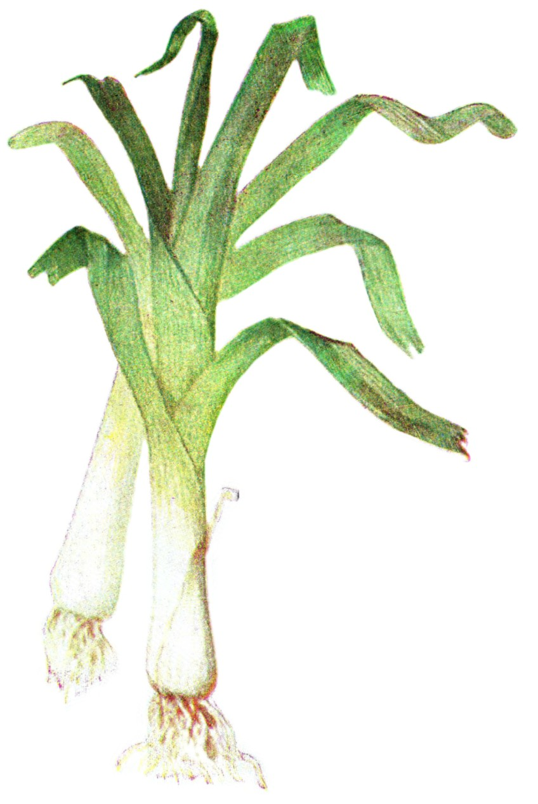
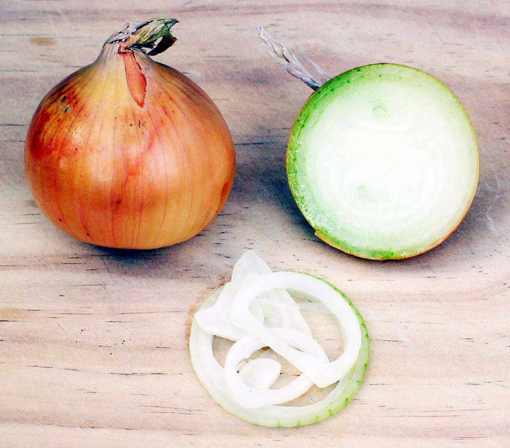

# Plants and Trees in the Bible

## License Information

Plants and Trees in the Bible © United Bible Societies, 2025. Adapted from: <cite>Each According to its Kind: Plants and Trees in the Bible</cite>, by Robert Koops © 2012 United Bible Societies. This work is licensed under Creative Commons Attribution-ShareAlike 4.0 International (<a href="https://creativecommons.org/licenses/by-sa/4.0/">https://creativecommons.org/licenses/by-sa/4.0/</a>).

--------------------------------

## 标题：叶类蔬菜（leafy vegetables） (id: FLORA:3.2)

3\.2 标题：叶类蔬菜（leafy vegetables）
==============================

我们这里讨论的叶类蔬菜是种植的或采摘的，或者两者都有。圣经中列出了四种叶类蔬菜：苦菜、蒜、韭葱和洋葱。此外，我们从近东的考古发掘以及希腊和罗马的文献中了解到，在圣经时期之前的几百年甚至上千年，人们就已经开始采摘和食用其他种类的叶类蔬菜，例如豌豆和葫芦巴（直译"希腊干草"）。虽然圣经并没有提到这些叶类蔬菜，但我们几乎可以肯定，圣经时期的人们也吃这些蔬菜。

希伯来文*‘esev* 在旧约中出现了33次，通常指可以食用的"香草"（参[GEN 9:3](https://ref.ly/Gen9:3) 等）。祖海里认为，希伯来文短语*‘esev hassadeh* （"田间／田野里的草／植物"）大概是指在野外采摘的可食用香草、野菜等植物（参[2KI 19:26](https://ref.ly/2Kgs19:26) 等）。然而在圣经时期，由于栽培仍在发展的进程中，因此有时候我们无法得知某种食物究竟是种植的还是采摘的。

在希伯来文中，蔬菜的另一个统称是[2KI 4:39](https://ref.ly/2Kgs4:39) 中的*’oroth* 。经文记载，有个年轻的先知去田野摘*’oroth* 。祖海里注意到这件事发生在约旦河谷的吉甲附近，他指出，*’oroth* 可能是指芝麻菜，就是阿拉伯文中的*jarjir* 。他的根据是：在《他勒目》中，*’oroth* 和*gargir* 是同一种植物。然而，上下文表明这是一个通称，因此这里最有可能的意思仍然是"蔬菜"或"香草"。该词是复数形式，而且亚兰文译本使用的词语无疑是一个通称，这两点都说明*’oroth* 是指"蔬菜"或"香草"。*’Oroth* 源于希伯来文词根*’arah* （意为"摘、采集、采摘"），这一点也支持*’oroth* 在这里是笼统地指"采摘的东西"。

这里的另一个希伯来文统称是*chatsir* （出现了22次），祖海里认为这个词最初是指"韭葱"（参[NUM 11:5](https://ref.ly/Num11:5) ），但后来意思变成"牧草"或"田间的香草"（参[PSA 37:2](https://ref.ly/Ps37:2) 等）。

希伯来文名词*deshe’* （出现了14次）是所有植物的统称。[GEN 1:11](https://ref.ly/Gen1:11) 使用了这个名词及其动词形式，译为"长出植物"。

另一个表示蔬菜的希伯来文统称是*yaraq* ，出现在[DEU 11:10](https://ref.ly/Deut11:10); [1KI 21:2](https://ref.ly/1Kgs21:2); [PRO 15:17](https://ref.ly/Prov15:17) 中。[1KI 21:2](https://ref.ly/1Kgs21:2) 记载，亚哈王觊觎拿伯的葡萄园，想拿来作自己的*gan yaraq* （"菜园"）。由于植物分类方法和统称的用法在不同语言中可能是不同的，因此这种表述方式可能会给翻译者带来困难。在许多语言中，根据所种植物的不同，不同类型的农田有不同的名称。拿伯的葡萄园就在王宫的旁边，因此表示"菜园"的词需要与这个情况相符合。如果没有合适的特定词汇，翻译者可以使用"我可以种菜的地方"或"我可以种东西的地方"等类短语。

希伯来文*zeru‘a* /*zero‘nim* （[LEV 11:37](https://ref.ly/Lev11:37); [ISA 61:11](https://ref.ly/Isa61:11); [DAN 1:12](https://ref.ly/Dan1:12); [DAN 1:16](https://ref.ly/Dan1:16) ）是动词"种植"的名词形式，字面意思是"种植的东西"。有些译本根据上下文将这个词译为"种子"、"植物"或"种的东西"。有几个译本在[DAN 1:12](https://ref.ly/Dan1:12); [DAN 1:16](https://ref.ly/Dan1:16) 中将这个词译为"蔬菜"。

希腊文*lachanon* 在[ROM 14:2](https://ref.ly/Acts14:2) 中是蔬菜的统称。在[LUK 11:42](https://ref.ly/Mark11:42) ，这个词所指的植物包括薄荷和芸香，因此翻译成"香草"是合宜的。RSV (Revised Standard Version (1952)) 在[MAT 13:32](https://ref.ly/Matt13:32) 和[MRK 4:32](https://ref.ly/Matt4:32) 中把这个词译为"shrubs"（"灌木"），因为在这两节经文中，该词指的是芥菜种长成后的植株。

* **Associated Passages:** 创世记 9:3; 列王纪下 19:26; 列王纪下 4:39; 民数记 11:5; 诗篇 37:2; 创世记 1:11; 申命记 11:10; 列王纪上 21:2; 箴言 15:17; 利未记 11:37; 以赛亚书 61:11; 但以理书 1:12; 但以理书 1:16; 罗马书 14:2; 路加福音 11:42; 马太福音 13:32; 马可福音 4:32

## 标题：苦菜（bitter herbs） (id: FLORA:3.2.1)

3\.2\.1 标题：苦菜（bitter herbs）
===========================

经文出处
----

Hebrew 来：מָרֹר (音译：maror)

[EXO 12:8](https://ref.ly/Exod12:8), [NUM 9:11](https://ref.ly/Num9:11), [LAM 3:15](https://ref.ly/Lam3:15)

讨论
--

在[EXO 12:8](https://ref.ly/Exod12:8); [NUM 9:11](https://ref.ly/Num9:11) 中，希伯来文*merorim* 是*maror* 的复数形式，源于意为"变苦"的词根*marar* （比较[RUT 1:20](https://ref.ly/Ruth1:20) 中的"玛拉"一名），因此这个词可能指某种特定的植物，也可能是一个通称。祖海里认为，*merorim* 可能是指矮菊苣（学名*Cichorium pumilum* ）、小菊苣（学名*Reichardia tingitana* ），和／或其他某种长着苦叶子的植物。莫尔登克提出，这个词可能是指苦苣、蒲公英或酸模。除了上面提到的植物，《米示拿》还列出了生菜、刺芹、山葵和苦苣菜。换句话说，拉比认为，在逾越节的宴席上，选择这些植物中的任何一种都是遵行吃*merorim* 的诫命。

特殊意义
----

在逾越节吃"无酵饼"和"苦菜"，是因为这些食物可以很快预备好，让人回想起以色列人仓促离开埃及的情景（参[EXO 12:11](https://ref.ly/Exod12:11) ）。他们可能把苦菜做成炖菜或酱菜，好在这种紧急情况下吃。

翻译
--

翻译者最好用描述性的短语来翻译"苦菜"，但如果没有这样的短语，那么可以译成某种有苦味的植物，或者在紧急情况下煮出来的某种酱菜或炖菜。可以按照某种主要语言音译矮菊苣，例如：*hindiba* /*kasiniya* （阿拉伯文）、*chicoree* （法文）、*escarole* （西班牙文）和*chicoria* （葡萄牙文）。

* **Associated Passages:** 出埃及记 12:8; 民数记 9:11; 耶利米哀歌 3:15; 路得记 1:20; 出埃及记 12:11

## 标题：蒜（garlic） (id: FLORA:3.2.2)

3\.2\.2 标题：蒜（garlic）
====================

经文出处
----

Hebrew 来：שׁוּמִים (音译：shum)

[NUM 11:5](https://ref.ly/Num11:5)

讨论
--

蒜（学名*Allium sativum* ）在埃及、西亚和欧洲都非常受欢迎，在圣经时期可能也是这样。在埃及和死海地区的古墓，人们发现了大量的蒜，年代可以追溯到主前3500年至主前3000年左右，这证明蒜在以色列人出埃及之前就已经被广泛使用。希腊作家普林尼知道三种蒜。蒜被用来祭祀神明、入药、做调料和保存肉类。

描述
--

蒜长着一个和洋葱相像的鳞茎，但比洋葱小，分四五个蒜瓣，每瓣都可以长成一棵新的植株，因为蒜不是通过种子来繁殖的。蒜瓣在英文中称为"cloves"（"小鳞茎"）。蒜的味道和气味非常独特，在世界各地被用来调味和入药。

特殊意义
----

[NUM 11:5](https://ref.ly/Num11:5) 罗列了以色列人在西奈旷野漂流时想吃的多种美味，其中包括洋葱、韭葱，还有蒜。

翻译
--

蒜起源于中东，但其野生原种不详。目前，蒜在世界各地都有种植，因此通常可以找到当地的名称。如果没有当地的名称，鉴于[NUM 11:5](https://ref.ly/Num11:5) 的上下文是非修辞性的，建议按照某种主要语言进行音译（例如，阿拉伯文*tawm* /*toum* 、法文*ail* 、西班牙文*ajo* /*aho* 、葡萄牙文*alho* /*alyo* 、斯瓦希里文*kitunguu**saumu* 、沃洛夫文*laaj* 、豪萨文*tafarnuwa* ）。

* **Associated Passages:** 民数记 11:5

## 标题：韭葱（leek） (id: FLORA:3.2.3)

3\.2\.3 标题：韭葱（leek）
===================

经文出处
----

Hebrew 来：חָצִיר (音译：chatsir)

[NUM 11:5](https://ref.ly/Num11:5)

讨论
--

根据祖海里的意见，[NUM 11:5](https://ref.ly/Num11:5) 中的希伯来文*chatsir* 指的是韭葱（学名*Allium porrum* ），这个意见也得到了莫尔登克的支持；但赫珀认为，该词更可能是指色拉韭葱（学名*Allium kurrat* ；又称埃及韭葱）；人们在埃及的古墓中发现了这种韭葱。莫尔登克等人认为，*chatsir* 也可能是葫芦巴（学名*Trigonella foenum\-graecum* ），在埃及和圣地的人都知道这种香草。在旧约的其他经文中，*chatsir* 的意思是"草"、"香草"或"干草"，因此这个词可能是统称任何可食用的绿色植物（参[5\.1\.2 草 (grass)](#FLORA:5.1.2) ）。然而，在同时出现"洋葱"和"蒜"的经文中，这个词应该是指韭葱。祖海里认为*chatsir* 最初指的是某种特定的植物，后来变成了一个统称。

描述
--

韭葱的叶子像洋葱，味道也像洋葱，但韭葱的叶子是扁的，而洋葱的叶子是圆的且空心。韭葱的"鳞茎"（如果可以这样说的话）又细又长，至少有10厘米（4英寸）。韭葱可以拌色拉生吃，也可以做成炖菜。

特殊意义
----

在古代，韭葱被认为是穷人的食物。《民数记》记载，以色列人离开埃及后，非常想吃韭葱、洋葱和蒜等蔬菜。

翻译
--

韭葱遍布世界各地。在西非，韭葱不像洋葱那么普遍，但我在尼日利亚和冈比亚的大城市都看到有韭葱售卖。鉴于[NUM 11:5](https://ref.ly/Num11:5) 这节经文是非修辞性的，翻译者应该找到当地的三种葱属（学名*Allium* ）植物来翻译韭葱、洋葱和蒜；或者音译这三种植物，韭葱可以按照法文*poireau* 、西班牙文*puerro* 、葡萄牙文*alho porro* 等进行音译。

* **Associated Passages:** 民数记 11:5

## 标题：洋葱（onion） (id: FLORA:3.2.4)

3\.2\.4 标题：洋葱（onion）
====================

经文出处
----

Hebrew 来：בָּצָל (音译：batsal)

[NUM 11:5](https://ref.ly/Num11:5)

讨论
--

毫无疑问，希伯来文*batsal* 指的是我们现在所称的洋葱（学名*Allium cepa* ）的原种。这种植物可能原产于圣地。早在主前3200年，埃及人就已熟知洋葱、韭葱和蒜。希腊文《七十士译本》把*batsal* 译为*krommuon* 。

描述
--

洋葱的叶子是空心的，茎也是空心的，高约30厘米（1英尺），花呈球状。根是一个圆形的鳞茎，由一层紧贴一层的可食用的肥厚组织包裹而成。洋葱的味道辛辣，但埃及品种的洋葱是甜的。

特殊意义
----

在西奈旷野漂流的40年间，以色列人怀念在埃及生活时吃的可口食物，其中就有洋葱、蒜和其他好吃的东西。

翻译
--

洋葱、韭葱和蒜都隶于葱属（学名*Allium* ），这个属约有600个物种，主要分布在世界上的温带地区。洋葱现在在非洲非常普遍，如果某种语言没有洋葱的名称是很令人意外的，通常是外来语，例如豪萨文中的*albasa* （源自阿拉伯文；注意它和希伯来文*batsal* 很像）。如果需要按照某种主要语言进行音译，可以考虑法文*oignon* 、西班牙文*cebolla* 、葡萄牙文*cebola* 、意大利文*cipolla* ，或斯瓦希里文*kitunguu* 。

* **Associated Passages:** 民数记 11:5

