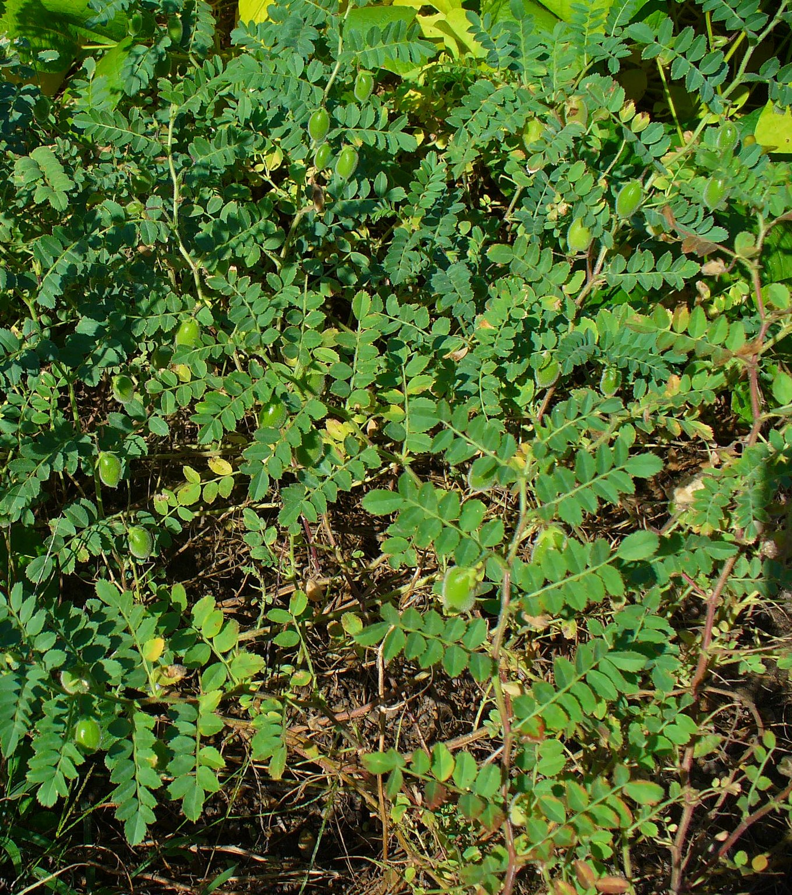

# Plants and Trees in the Bible

## License Information

Plants and Trees in the Bible © United Bible Societies, 2025. Adapted from: <cite>Each According to its Kind: Plants and Trees in the Bible</cite>, by Robert Koops © 2012 United Bible Societies. This work is licensed under Creative Commons Attribution-ShareAlike 4.0 International (<a href="https://creativecommons.org/licenses/by-sa/4.0/">https://creativecommons.org/licenses/by-sa/4.0/</a>).

--------------------------------

## 标题：豆类植物（pulses） (id: FLORA:3.3)

3\.3 标题：豆类植物（pulses）
====================

圣经中提到三种豆类植物：蚕豆、鹰嘴豆和扁豆。

## 标题：蚕豆（beans） (id: FLORA:3.3.1)

3\.3\.1 标题：蚕豆（beans）
====================

经文出处
----

Hebrew 来：פּוֹל (音译：pol)

[2SA 17:28](https://ref.ly/2Sam17:28), [EZK 4:9](https://ref.ly/Ezek4:9)

讨论
--

解经家和翻译者一致认为，希伯来文*pol* 指的是蚕豆（学名*Vicia faba* 、*Faba vulgaris* ）。蚕豆在中东种植了几千年，而且可能就原产于那里。目前还没有发现蚕豆的野生品种，很有可能它们的原种已经灭绝了。考古学家在耶利哥发掘时，发现了蚕豆的残余物，年代可追溯到7000至8000年前。

描述
--

蚕豆是一种直立植物，而非藤本植物，可以长到1米（3英尺）高，枝子只长在茎的上部。蚕豆没有卷须，这一点和今天许多种类的豆子不同。蚕豆的花是白色的，成熟后形成豆荚，里面有3—6颗豆子，豆子又大又扁，呈奶油色或棕褐色。

特殊意义
----

[2SA 17:28](https://ref.ly/2Sam17:28) 记载，大卫王在躲避他儿子押沙龙的时候，人们给他送来食物，其中就有蚕豆。在[EZK 4:9](https://ref.ly/Ezek4:9) 中，上帝吩咐以西结要当众用小麦、大麦、蚕豆、扁豆（即他能够找到的任何粮食）来做"饼"，这里的重点可能是，优质的饼很快就会在耶路撒冷变得稀缺。

翻译
--

蚕豆属（或野豌豆属；学名*Vicia* ）至少有200个品种，蚕豆就是其中的一种。蚕豆属隶于庞大的豆科。希伯来文*pol* 可能实际上不止指一种豆子，其中包括我们现在所知道的豌豆。由于世界各地都知道蚕豆和豌豆，翻译者应该能够找到一个当地的对等词。在《撒母耳记下》和《以西结书》的这两节经文中，*pol* 都是出现在清单里面。如果翻译者无法找到当地的豆子品种，那么可以采用音译（例如，阿拉伯文*adas* 、法文*faverole* 或*fève* 或*haricot* 、西班牙文*frijol* 、葡萄牙文*fava* 或*favarola* 或*feijão* ，斯瓦希里文*haragwe* 、拉丁文*vicia* ）。

* **Associated Passages:** 撒母耳记下 17:28; 以西结书 4:9

## 标题：鹰嘴豆（chickpeas） (id: FLORA:3.3.2)

3\.3\.2 标题：鹰嘴豆（chickpeas）
=========================

经文出处
----

Hebrew 来：חָמִיץ (音译：chamits)

[ISA 30:24](https://ref.ly/Isa30:24)

讨论
--

以赛亚先知在[ISA 30:24](https://ref.ly/Isa30:24) 中说，当上帝复兴犹大国的时候，牛和驴必吃"用铲子和杈子扬净的"（*belil chamits* ）。希伯来文*belil* 意为"草料、饲料"，这是人们普遍接受的，但修饰词*chamits* 的意思存在争议。RSV (Revised Standard Version (1952)) 将这个词译为"salted"（"加盐的"），GNB (Good News Bible) 译为"finest and best"（"最精细的和最好的"），REB (Revised English Bible (1989)) 译为"well\-seasoned"（"调好味的"），NLT (New Living Translation) 译为"good"（"好的"）。NRSV (New Revised Standard Version (1989)) 和NAB (New American Bible (1970)) 把两个词合在一起，译为"silage"（"青储饲料"）。然而，希伯来文*chamits* 与阿拉伯文*chumus* 及亚兰文*chimtsa* 同源，而且后面两个词都是指鹰嘴豆（学名*Cicer arietinum* ）。因此，祖海里建议将*chamits* 译成"鹰嘴豆"。翻译者的选择取决于对*chamits* 的两种解释：一种有同源词的证据支持，另一种有传统的释经支持。在耶利哥的发掘中，考古学家发现的鹰嘴豆至少可追溯到主前2000年，比以赛亚时期早得多；另外，考古学家声称在中东其他地方的遗址中也发现了鹰嘴豆，其中一些可追溯到主前7000年。在新月沃地北部，人们发现了鹰嘴豆的野生品种，因此，植物学家相信鹰嘴豆就起源于那里。

描述
--

鹰嘴豆植株约有20厘米（8英寸）高，茎和枝上都有对生的小叶子，开蓝色或白色的花，并结出一个短豆荚，里面有1—2颗近乎立方体的棕褐色种子。

特殊意义
----

[ISA 30:24](https://ref.ly/Isa30:24) 旨在展示犹大辉煌的将来，到那时，就是牛和驴也必吃美味的食物。

翻译
--

这里的语境是修辞性的，所以如果翻译者把*chamits* 理解为"鹰嘴豆"，那么可以使用一个文化上的对等词，最好是当地家畜喜欢吃的一种植物。如果翻译者找不到特定的词语来翻译鹰嘴豆，则可使用一个统称或一般性的短语。如果想要采用某种主要语言的音译，可以考虑阿拉伯文*hummus* 、法文*pois**chiche* 或*cicerole* 、葡萄牙文*graão**de**bico* ，或者西班牙文*garbanzo* 。另一方面，如果依循*chamits* 的另一种解释，也可以译为"好的食物"、"最好的食物"、"混匀的食物"等。

* **Associated Passages:** 以赛亚书 30:24

## 标题：扁豆（lentils） (id: FLORA:3.3.3)

3\.3\.3 标题：扁豆（lentils）
======================

经文出处
----

Hebrew 来：עֲדָשָׁה (音译：‘adashah)

[GEN 25:34](https://ref.ly/Gen25:34), [2SA 17:28](https://ref.ly/2Sam17:28), [2SA 23:11](https://ref.ly/2Sam23:11), [EZK 4:9](https://ref.ly/Ezek4:9)

讨论
--

学者一致认为，希伯来文*‘adashah* 指的是扁豆（学名*Lens culinaris* ，曾作*Lens esculenta* ）。阿拉伯文*‘adas* 、圣经成书之后的希伯来文献中几次出现该词，以及《七十士译本》，都证实这个词指的是扁豆。考古发掘中发现的主前第六个或第七个千年的种子表明，扁豆是人类最早种植的植物之一。在这些考古中，扁豆经常与小麦和大麦种子一起被发现。

描述
--

扁豆是一种分枝低、茎软的植物，像南瓜和西葫芦一样长着卷须，花朵粉红色，可以像蚕豆那样长成豆荚，豆荚很短，里面只有一粒豌豆大小的种子。有一种扁豆的豆粒是红棕色的，因此[GEN 25:30](https://ref.ly/Gen25:30) 说是"红的"汤。豆荚通常两个或三个一簇。在圣地，扁豆在比较冷的季节（11月—3月）生长。

特殊意义
----

[EZK 4:9](https://ref.ly/Ezek4:9) 提到一种奇怪的饼，用包括扁豆在内的六种谷物和豆类做成，可能是为了表明食物将会短缺，人们只能找到什么就吃什么。扁豆通常用来煮汤或做炖菜。雅各就是用这样的红豆汤诱使哥哥以扫放弃了长子的权利。大卫被押沙龙追赶时，有人送食物给他，其中就有扁豆。

翻译
--

现今，扁豆广泛分布在亚洲、印度和北非。在人们不知道扁豆的地方，我们建议使用当地某种豆子的名称来翻译，而不使用音译。不过，[EZK 4:9](https://ref.ly/Ezek4:9) 也提到了"蚕豆"，因此可以将"蚕豆和扁豆"译为"不同种类的豆子"。在[GEN 25:34](https://ref.ly/Gen25:34) 中，用一个一般性的表达来翻译"红扁豆汤"比较合适，例如"豆子汤"、"炖豆子"（"bean stew"；CEV (Contemporary English Version) ），或"蔬菜汤"（"vegetable soup"；NCV (New Century Version) ）。如果想按某种主要语言进行音译，可以考虑阿拉伯文*adas* 、法文*cristallin* 或*lentille* 、西班牙文*lenteja* 、葡萄牙文*lentilha* ，或斯瓦希里文*adesi* 。

* **Associated Passages:** 创世记 25:34; 撒母耳记下 17:28; 撒母耳记下 23:11; 以西结书 4:9; 创世记 25:30

