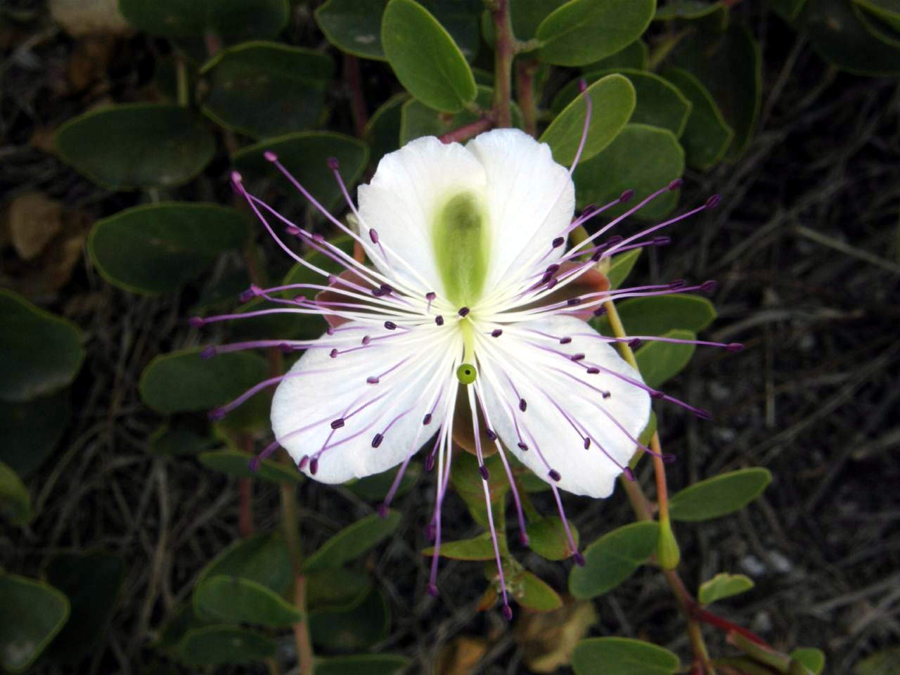
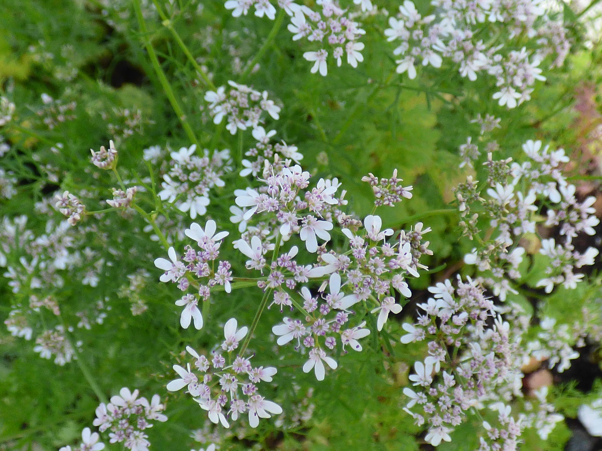
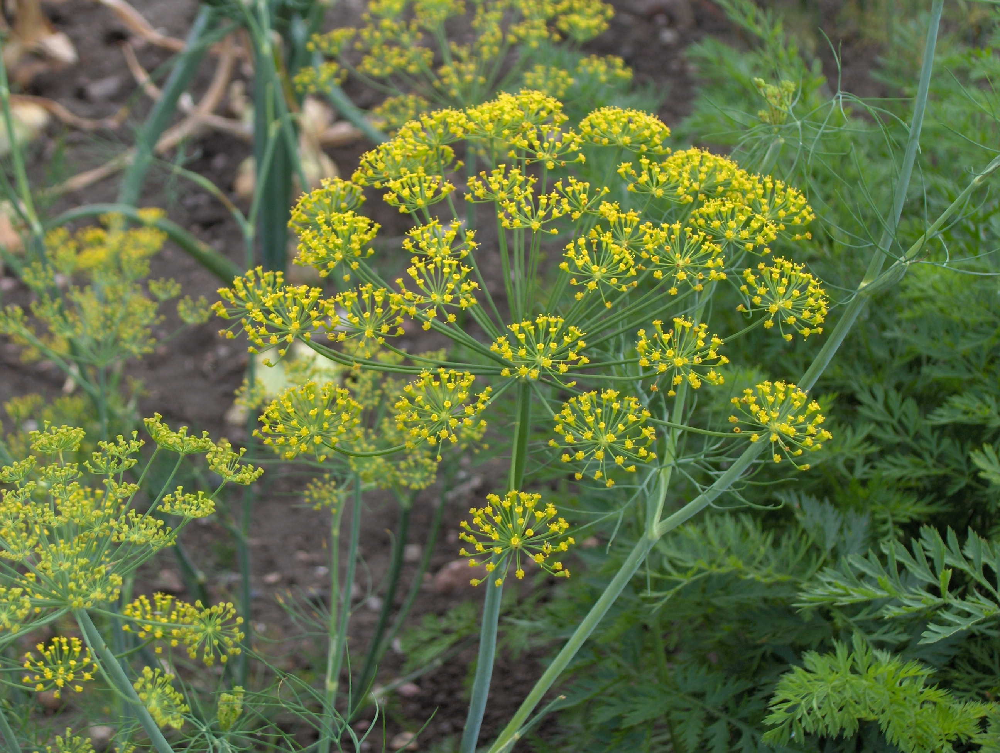
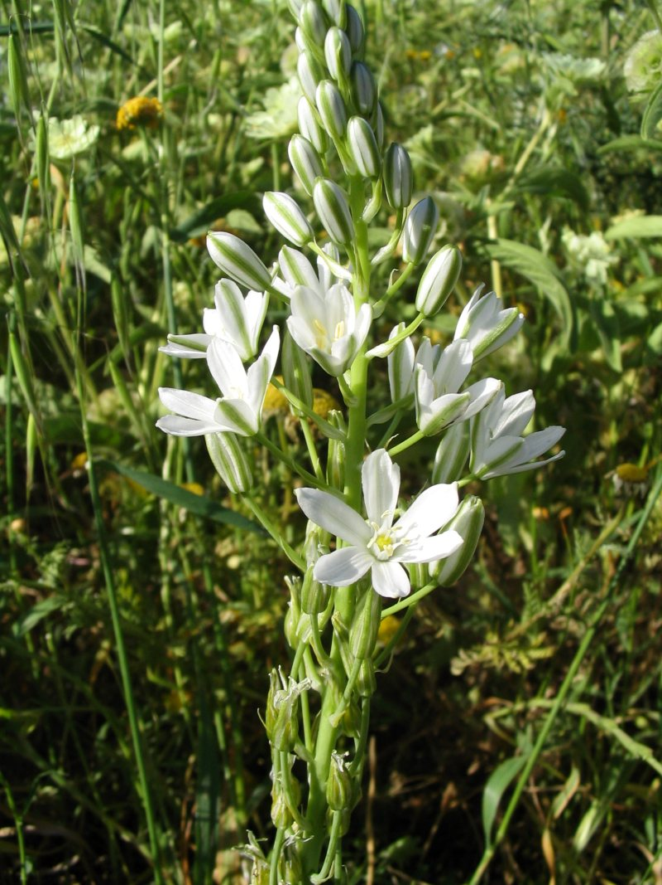
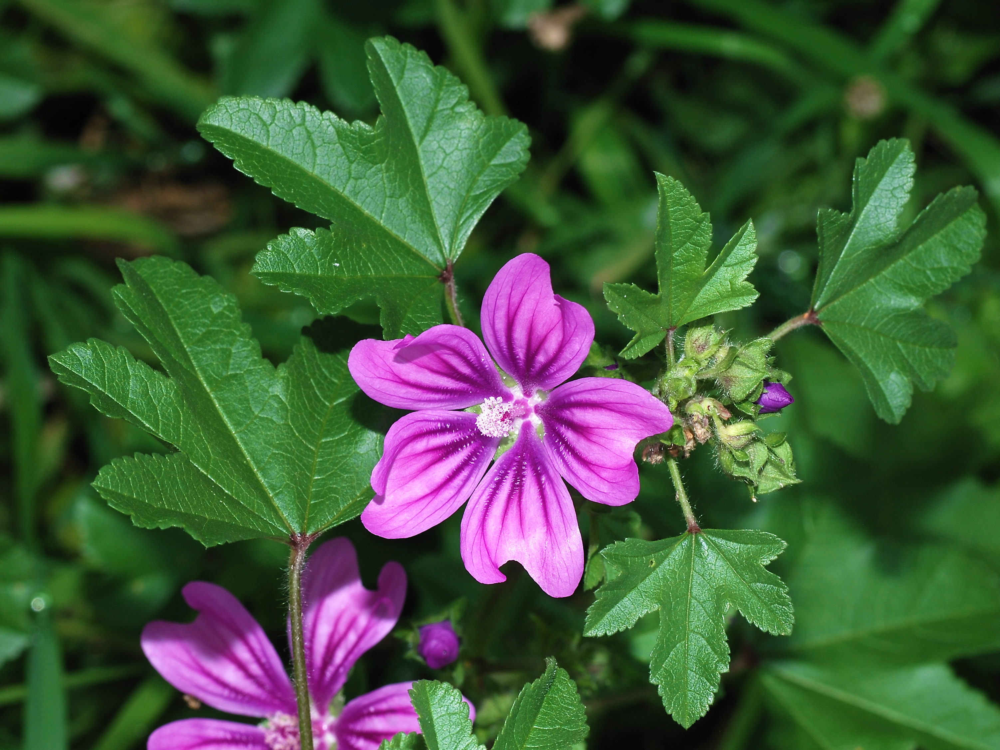
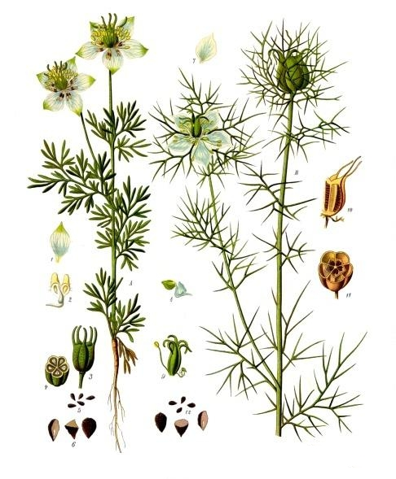

# Plants and Trees in the Bible

## License Information

Plants and Trees in the Bible © United Bible Societies, 2025. Adapted from: <cite>Each According to its Kind: Plants and Trees in the Bible</cite>, by Robert Koops © 2012 United Bible Societies. This work is licensed under Creative Commons Attribution-ShareAlike 4.0 International (<a href="https://creativecommons.org/licenses/by-sa/4.0/">https://creativecommons.org/licenses/by-sa/4.0/</a>).

--------------------------------

## 标题：调味料（condiments） (id: FLORA:3.5)

3\.5 标题：调味料（condiments）
=======================

圣经中提到11种调味料：刺山柑、芫荽、孜然、莳萝、鸽子粪、锦葵、薄荷、芥菜、黑种草、滨藜和芸香。

## 标题：刺山柑（刺山柑灌木、刺山柑浆果）（Caper [caper bush, caper berry]） (id: FLORA:3.5.1)

3\.5\.1 标题：刺山柑（刺山柑灌木、刺山柑浆果）（Caper \[caper bush, caper berry]）
=============================================================

经文出处
----

Hebrew 来：אֲבִיּוֹנָה (音译：’aviyonah)

[ECC 12:5](https://ref.ly/Eccl12:5)

讨论
--

[ECC 12:0](https://ref.ly/Eccl12:0) 描绘了美好的老年，在分句"欲望（希伯来文*’aviyonah* ）不再挑起"之后是一系列的比喻。*’Aviyonah* 这个词在圣经中只出现了一次，因此它的意思还有很多争论。《七十士译本》的翻译者采用了这个词的第一个意思，译为"刺山柑浆果"，指的是中东一种常见的小灌木刺山柑（学名*Capparis spinosa* ）的辣味花蕾。叙利亚文译本、《武加大译本》、NAB (New American Bible (1970)) 和GECL (German Common Language Version (Gute Nachricht Bibel)) 也采用了这个译法。GW (God's Word Translation) 、JB (Jerusalem Bible (1966)) 和NJPSV (New Jewish Publication Society Version) 的译法类似，为"刺山柑灌木"（"caper bush"），NEB (New English Bible (1970)) 和REB (Revised English Bible (1989)) 则译为"刺山柑花蕾"（"caper\-buds"）。*La Nouvelle Bible Segond* 和*La Sainte Bible: Version Synodale* 简单地译为"刺山柑"，FRCL (French Common Language Version (Bible en français courant)) 使用了统称"香料"。

古时的犹太人和其他一些族群用刺山柑浆果和腌制的刺山柑花蕾来增进食欲。另外，在希腊文和希伯来文字典中，意为"欲望"的词语似乎就是源于刺山柑和欲望之间的联系。中世纪的欧洲人认为刺山柑浆果是一种春药，然而莫尔登克没有找到它在古代用作春药的证据。

许多知名的植物学家相信，摩西五经中的希伯来文*’ezov* 一词并不是指牛膝草（《七十士译本》同）或马郁兰（"叙利亚牛膝草"），而是指生长在埃及和西奈旷野的刺山柑灌木；在那里，上帝吩咐以色列人在庆祝逾越节时使用这种植物。这种植物生长在城墙的裂缝中，与[1KI 5:13](https://ref.ly/1Kgs5:13) （《和》4:33）所述所罗门对于植物的认识相符。有些学者甚至说，刺山柑灌木枝的枝条长度符合[JHN 19:29](https://ref.ly/Luke19:29) 中的描述（希腊文*hussōpos* ），在这节经文中，兵丁用一根枝条把一块海绵送到耶稣的嘴边。然而，根据词源学，祖海里和其他一些人相信，*’ezov* 和*hussōpos* 最有可能是指马郁兰。我同意他们的意见。关于这些词语的讨论，另参[5\.2\.4 马郁兰 (marjoram)](#FLORA:5.2.4) 。

描述
--

在开阔的地带，刺山柑可以长成1米（3英尺）高的灌木，但更普遍的情况是，这种植物蔓延在岩石和倒塌的墙垣上，或者悬挂在悬崖和外墙的裂缝上。刺山柑的花很漂亮，有3片白紫色的花瓣和许多长而弯的紫色雄蕊。叶子呈圆形，灰绿色。花朵在夜晚开放，第二天早上枯萎，最后长成一根花梗和一个浆果，并且浆果里面含许多种子。

特殊意义
----

在中东和许多其他地方，人们把刺山柑的花蕾泡在醋里，然后和肉一起吃。这个过程称为"腌制"，早在基督时期之前，以色列、埃及和阿拉伯就已经出现了腌制食物。中东人也吃刺山柑的辣果子。现今，腌制的刺山柑花蕾在整个欧洲都很受欢迎，尤其是在法国。古希腊作家常常提到这种植物。人们用刺山柑来治疗胃胀气。

翻译
--

刺山柑在整个地中海地区很常见。另一个品种（学名*Capparis sodado* ）生长在东非（苏丹）、阿拉伯和印度南部。这是一种几乎没有叶子的多刺灌木，长着可食用的浆果。山柑属（学名*Capparis* ）的另外四个品种分布于南美洲（主要在阿根廷、巴西南部、哥伦比亚、巴拉圭和委内瑞拉），名叫*Pan y agua* 和*Sacha\-poroto* 。那里的人们也吃这些植物的果实，但它们显然不如南欧的刺山柑那样受欢迎。[ECC 12:5](https://ref.ly/Eccl12:5) 提到的刺山柑出现在一系列比喻中，因此，"刺山柑"的翻译取决于翻译者如何处理"杏树"和其他比喻：是保留它们的字面意思，还是使用当地对等词或统称来进行"归化"。在这节经文中，我们倾向于使用当地一种具有相同功能的植物来替代，从而保留语言上的诗意；这里可以使用能够刺激味蕾的一种植物。在这里，我们想要表达老人不能享用辛辣的食物这个意思。如果要翻译得更符合字面意思，可以使用英文的音译，把整个分句译为"*kaparis* 不再使你／他垂涎"，并在脚注中注明*kaparis* 是犹太人常吃的一种香料。另外也可以按照以下语言进行音译：阿拉伯文*assaf* /*alkabara* 、法文*capre* 、葡萄牙文*alcaparras* ，或者西班牙文*alcaparron* /*caparra* 。RSV (Revised Standard Version (1952)) 作"desire fails"（"欲望衰败"），这种翻译是非比喻性的。如果采用这个译法，那么要增加一个脚注，说明这里的希伯来文是指一种辛辣的食物。

* **Associated Passages:** 传道书 12:5; 传道书 12:0; 列王纪上 5:13; 约翰福音 19:29

## 标题：芫荽（coriander） (id: FLORA:3.5.2)

3\.5\.2 标题：芫荽（coriander）
========================

经文出处
----

Hebrew 来：גַּד (音译：gad)

[EXO 16:31](https://ref.ly/Exod16:31), [NUM 11:7](https://ref.ly/Num11:7)

讨论
--

[EXO 16:31](https://ref.ly/Exod16:31) 记载，上帝施行神迹，赐给在旷野漂流的以色列人一种叫做"吗哪"的食物，这种食物"像芫荽子，是白的"。芫荽（学名*Coriandrum sativum* ）确实生长在埃及和圣地。然而，它的种子不是白的，而更像是棕色或灰色。[NUM 11:7](https://ref.ly/Num11:7) 告诉我们，吗哪的颜色"如同bdellium"，我们对bdellium几乎没有任何确定的了解。此外，《七十士译本》用了希腊文*korion* ，但这个词不是指芫荽。阿拉伯文名称*gidda* 与希伯来文*gad* 同源，指的是另一种植物，即艾草。另外，[EXO 16:14](https://ref.ly/Exod16:14) 描述吗哪是"薄片状的"，然而芫荽的种子却是球形或卵形的，这使问题更加复杂了。

鉴于上述疑难，祖海里怀疑*gad* 这个词不是指我们今天所知的芫荽。他推测，早期的翻译者不知道*gad* 指的是什么，就取了意为芫荽的布匿文*goid* ，从而把*gad* 和芫荽联系在一起。如果作者说"好像芫荽的花"，那我们还好理解一些，因为芫荽的花是白色的，但文本用了"子"，即种子。有可能早期的讲述者或抄经者在传递文本时犯了一个错误。希伯来文的*perach* （"花"）会不会被*zera‘* （"种子"）取代了呢？

然而，经文原意确实也有可能是指芫荽种子，而吗哪和芫荽种子比较的是大小，芫荽种子的直径约4毫米（3/16英寸），和胡椒籽的大小差不多。因此，REB (Revised English Bible (1989)) 和NAB (New American Bible (1970)) 译为："like coriander seed, but white"（"好像芫荽的种子，然而是白色的"）。另一种可能是，作者想要比较的是种子群聚在一起的样子，或者是种子的硬度。[NUM 11:8](https://ref.ly/Num11:8) 告诉我们，百姓用臼捣，或用磨来磨，表明吗哪具有一定的硬度。

描述
--

芫荽高约60厘米（2英尺），上面的叶子比较细碎，下面的叶子较阔，开白色或红色的小花，香味浓郁。种子含油，呈棕色或灰色，大小和小豌豆差不多。芫荽的叶子和种子在古时用于烹饪，今天仍然用来做汤和色拉。从种子中提取的芳香油有时用来制作香水和入药。

特殊意义
----

如上所述，经文用芫荽来描述吗哪的外形。可惜的是，我们不知道比较的是颜色、形状、大小，还是手感。在以色列和埃及，一直到伊拉克和印度，芫荽都很常见。叶子用作烹饪调料，也用来制作香水。但如果比较的要点是芫荽的种子，那么这些都是无关紧要的。

翻译
--

《〈出埃及记〉手册》（*A Handbook on Exodus* ）提出，芫荽和吗哪作比较的要点是芫荽种子的形状和大小，我们对此并不确定，所以很难找到一个文化上的对等词。因此，翻译者可以采用一般性的译法，例如，GNB (Good News Bible) 译成"like a small white seed"（"好像一颗白色的小种子"），并没有提到芫荽（但在脚注中有说明）。翻译者也可以依循REB (Revised English Bible (1989)) 和NAB (New American Bible (1970)) 的译法（"like coriander seed, but white"，"好像芫荽种子，然而是白色的"），把种子和颜色分开。如果把种子和颜色分开，翻译者可以按照某种语言来音译"芫荽"，例如法文*koriyandro* 或*korion* 、阿拉伯文*kuzbara* 、葡萄牙文*coentro* 、西班牙文*cilantro* ，或者按照希伯来文*gad* 进行音译。

《七十士译本》把[EXO 16:31](https://ref.ly/Exod16:31) 中芫荽的希腊文（*korion* ）上移到了第14节。有些译本采纳了这个做法，但帮助不大。

* **Associated Passages:** 出埃及记 16:31; 民数记 11:7; 出埃及记 16:14; 民数记 11:8

## 标题：孜然芹、孜然（cumin [cumin]） (id: FLORA:3.5.3)

3\.5\.3 标题：孜然芹、孜然（cumin \[cumin]）
=================================

经文出处
----

Hebrew 来：כַּמֹּן (音译：kammon)

[ISA 28:25](https://ref.ly/Isa28:25), [ISA 28:27](https://ref.ly/Isa28:27), [ISA 28:27](https://ref.ly/Isa28:27)

Greek 希：κύμινον (音译：kuminon)

[MAT 23:23](https://ref.ly/Matt23:23)

讨论
--

[ISA 28:25](https://ref.ly/Isa28:25); [ISA 28:25](https://ref.ly/Isa28:25); [ISA 28:27](https://ref.ly/Isa28:27); [ISA 28:27](https://ref.ly/Isa28:27) 提到两种有争议的种子：*qetsach* （参[3\.5\.9 黑种草（黑小茴香、黑子草、斯亚丹、肉豆蔻花）（nigella \[kalonji, black cumin, black seed, charnushka, nutmeg flower]）](#FLORA:3.5.9) ）和*kammon* 。这里的*kammon* 种子可能就是孜然的种子，其英文名称（cumin、cummin）源自拉丁文学名*Cuminum cyminum* ，而后者源自希腊文。孜然在地中海地区（尤其是叙利亚）和埃塞俄比亚很常见，甚至可能在埃及当地就有出产。埃及人用孜然来烹饪和入药。

描述
--

孜然和胡萝卜属于同一个科，从植株的底部就长出许多分枝，叶子和花与胡萝卜相似，不过种子的味道比胡萝卜种子更有刺激性。孜然是一年生植物，高度可达50—60厘米（20—24英寸）。

特殊意义
----

[ISA 28:25](https://ref.ly/Isa28:25); [ISA 28:25](https://ref.ly/Isa28:25); [ISA 28:27](https://ref.ly/Isa28:27); [ISA 28:27](https://ref.ly/Isa28:27) 提到了孜然和其他植物，以说明不同的植物及其果实需要不同的照料和处理（例如在脱粒时，孜然和黑种草比硬谷物更容易损坏）。这两节经文出自以赛亚向骄傲的以色列领袖所讲的一个比喻，这些领袖以为他们知道上帝如何对待百姓。有趣的是，马耳他的农民如今仍然使用以赛亚所述的方法来打孜然。在新约时期，犹太人的领袖不确定是否要献上孜然的十分之一，因为《摩西律法》并没有明确提到这种植物。为谨慎起见，他们坚持要百姓献上孜然的十分之一。但是，他们忽略了公义和怜悯，因此受到耶稣的谴责（[MAT 23:23](https://ref.ly/Matt23:23) ）。

翻译
--

翻译者可以按照某种主要语言进行音译（例如，西班牙文*comino* 、葡萄牙文*cuminho* 或*cominho* 、阿拉伯文*kamun* 、斯瓦希里文*jamda* 或*kisibiti* 或*jira* ），也可以根据[MAT 23:23](https://ref.ly/Matt23:23) 中其他词语（"薄荷"和"莳萝"）的处理方式来寻找一个对等词。简译本可以使用"各种田园小作物"这类一般性的短语。

* **Associated Passages:** 以赛亚书 28:25; 以赛亚书 28:27; 马太福音 23:23

## 标题：莳萝（dill） (id: FLORA:3.5.4)

3\.5\.4 标题：莳萝（dill）
===================

经文出处
----

Greek 希：ἄνηθον (音译：anēthon)

[MAT 23:23](https://ref.ly/Matt23:23)

讨论
--

KJV (King James Version (1611)) 把[MAT 23:23](https://ref.ly/Matt23:23) 中的希腊文*anēthon* 译为"anise"（"八角茴香"），但现在学者一致认为耶稣指的是莳萝（学名*Anethum graveolens* ），这是一种花园香草。RSV (Revised Standard Version (1952)) 、NEB (New English Bible (1970)) 和REB (Revised English Bible (1989)) 把[ISA 28:25](https://ref.ly/Isa28:25); [ISA 28:27](https://ref.ly/Isa28:27); [ISA 28:27](https://ref.ly/Isa28:27) 中的希伯来文*qetsach* 译为"dill""莳萝"，现在被认为是错误的。（参[3\.5\.9 黑种草（黑小茴香、黑子草、斯亚丹、肉豆蔻花）（nigella \[kalonji, black cumin, black seed, charnushka, nutmeg flower]）](#FLORA:3.5.9) 。）

描述
--

莳萝是一种一年生植物，可长到50厘米（20英寸）高。与胡萝卜、欧芹和小茴香一样，莳萝长着很细的叶子，黄色的花朵好像一个有盖的杯子，叶子和种子有一股很好闻的辛香味。

特殊意义
----

像孜然（3\.5\.3）和薄荷（3\.5\.7）等例子一样，耶稣也借用莳萝来谴责犹太宗教领袖扭曲的价值观，他们无视穷人的不幸，毫无怜悯地要求他们缴纳十分之一，哪怕是花园作物的小种子。

翻译
--

莳萝在西亚、印度、欧洲和美洲都为人所熟知。如果翻译者对[MAT 23:23](https://ref.ly/Matt23:23) 所述的其他植物，即薄荷和孜然，采用了音译，那么"莳萝"也可以按照希腊文*anēthon* 或某种主要语言进行音译（例如，法文*aneth* 、西班牙文*anega* 或*eneldo* 或*aneto* 、葡萄牙文*endro* 或*aneto* 或*funcho* 、阿拉伯文*bazrul* 或*shibit* 或*sjama* ）。学者对于这里的语境是不是修辞性的尚有争议，因此翻译者可以音译这三种植物，另外也可以选择文化上的对等词。翻译者需要特别注意[2KI 6:25](https://ref.ly/2Kgs6:25) 的平行经文，那里并没有提到莳萝。AT (American Translation (Goodspeed, 1935)) 、Mft (Moffatt Translation (1926)) 、韦茅斯（Weymouth），以及一些现代英文译本在这里使用了"dill"（"莳萝"）。

* **Associated Passages:** 马太福音 23:23; 以赛亚书 28:25; 以赛亚书 28:27; 列王纪下 6:25

## 标题：鸽子粪（伯利恒之星、伞花虎眼万年青）（dove’s dung [star of bethlehem]） (id: FLORA:3.5.5)

3\.5\.5 标题：鸽子粪（伯利恒之星、伞花虎眼万年青）（dove’s dung \[star of bethlehem]）
===============================================================

经文出处
----

Hebrew 来：חֲרָאִים, חרצנים (音译：chareyonim或chartsonim)

[2KI 6:25](https://ref.ly/2Kgs6:25)

讨论
--

在撒玛利亚城被围困的叙事中，[2KI 6:25](https://ref.ly/2Kgs6:25) 说"四分之一卡布的鸽子粪值五舍客勒"。撒玛利亚人必定已经身处绝境，但即便如此，他们应该也不会吃鸽子的粪便，因此专家给出了三种可能性：

1\. 原作者写的是希伯来文*chartsonim* （"野生洋葱"），但被错抄成了*chareyonim* （"鸽子粪"）。NJB (New Jerusalem Bible (1985)) 和NAB (New American Bible (1970)) 采取了这种解释。

2\. 鸽子粪是一种常见植物的名称（GNB (Good News Bible) 和NLT (New Living Translation) 中的脚注）。这种被称为"鸽子粪"的植物可能是：

（1）刺槐豆或长角豆（NIV (New International Version (1984)) 、REB (Revised English Bible (1989)) 、NJPSV (New Jewish Publication Society Version) 中的脚注）；

（2）一种花的鳞茎（林奈（Linnaeus）、约瑟夫）。

3\. 真正的鸽子粪，进行了加工以替代盐（GECL (German Common Language Version (Gute Nachricht Bibel)) ［1982］中的脚注）。

赫珀认为鸽子粪不大可能是指长角豆或刺槐豆，他认为2（2）的可能性更大，即*chareyonim* 指的是伯利恒之星（学名*Ornithogalum narbonense* ；又称伞花虎眼万年青）的鳞茎。根据历史学家的说法，在撒玛利亚被围困期间，这种植物的鳞茎以每杯约两盎司白银的价格出售。林奈称伯利恒之星为ornitho\-galum（鸟粪）。这个名称的字面意思是鸟奶，表明这位植物学家可能知道它与"鸟粪"之类的名字有联系。在众多虎眼万年青属（学名*Ornithogalum* ）植物中，只有一种可食用，其他都是有毒的。我在尼日利亚生活过，那里有一种叫"鸟粪"的植物，叶子是一种很受欢迎的做汤食材（豪萨文称为*kashin tsuntsu* ），因此我更倾向于接受上面的解释2。安德森（Anderson）、祖海里和哈鲁范尼（Hareuveni）没有提到"鸽子粪"，可能是因为他们不认为这是一种植物。

描述
--

伯利恒之星的植株高约25厘米（10英寸），底部有一束细长的叶子，芳香的白色花朵长在一根茎上，有6片花瓣。这种植物在春季末期开花，仅开放两星期左右就会枯萎。花在早上开放，通常到中午就会闭合。

特殊意义
----

不论"鸽子粪"在[2KI 6:25](https://ref.ly/2Kgs6:25) 中指的是什么，目的都是描写撒玛利亚居民在围城期间的绝望处境，在当时的情况下，即便是几乎不能吃的东西都能卖出高价。

翻译
--

关于[JOB 6:6](https://ref.ly/Job6:6) 中"鸽子粪"的译法，用某种勉强能吃、市场上有售的食物，或者"野生洋葱"等类短语来翻译都是合适的。翻译者如果使用一种常用的度量单位或钱币来替代"卡布"和"舍客勒"，会有助于读者掌握这里的重点。只要能够把银子的价值合理地表达出来，"鸽子粪"和"驴头"的对比也会有助于读者理解。如果翻译者用当地的一种物品来替代"鸽子粪"，那么必须是一种非常低廉的商品。《七十士译本》按照字面意思翻译"鸽子粪"。翻译者如果想要直译，像RSV (Revised Standard Version (1952)) 和NLT (New Living Translation) 所做的那样，则要在脚注中说明"鸽子粪"可能是一种植物。如果采用音译，可以按照法文*ornithogale* 或*aspergette* 、葡萄牙文*ornitogalos* ，或西班牙文*ornitogala* 。

* **Associated Passages:** 列王纪下 6:25; 约伯记 6:6

## 标题：锦葵（mallow） (id: FLORA:3.5.6)

3\.5\.6 标题：锦葵（mallow）
=====================

经文出处
----

Hebrew 来：חַלָּמוּת (音译：challamuth)

[JOB 24:24](https://ref.ly/Job24:24)

Hebrew 来：כֹּל (音译：kol)

[JOB 6:6](https://ref.ly/Job6:6)

讨论
--

在[JOB 6:6](https://ref.ly/Job6:6) 中，约伯回应他所谓的朋友那些毫无帮助、毫不友善的话语时，问了这样一个问题："食物淡而无盐岂可吃呢？马齿苋（希伯来文*challamuth* ）的黏液有什么滋味呢？"这两行平行诗句的要点是：（1）无味的东西需要盐；（2）*challamuth* 的黏液无味。

关于希伯来文*challamuth* 一词在这里是否指植物，学者仍有许多争议。有些译本将这个词译为"蛋白"（"white of an egg"，GNB (Good News Bible) 、NLT (New Living Translation) 、GW (God's Word Translation) ；"egg white"，NIV (New International Version (1984)) ），有位解经家提出这可能是指"石灰水"、"灰泥"，甚至"死人"。然而，根据阿拉伯文同源词*lachamut* 和米示拿传统，祖海里认为*challamuth* 可能是指锦葵科（学名*Malvaceae* ）中的一种或多种植物，即欧锦葵（学名*Malva sylvestris* ）、法国锦葵（学名*Malva nicaeensis* ），或蜀葵（学名*Alcea setosa* ）。REB (Revised English Bible (1989)) 译为"mallow"（"锦葵"）。该科的一些物种是山羊的食物，贝都因人也会煮来吃。

然而，赫珀认为*challamuth* 是普通的马齿苋（学名*Portulaca oleracea* ），这是另一种用来做色拉和入药的植物。莫尔登克认为[JOB 6:6](https://ref.ly/Job6:6) 中根本没有植物。

描述
--

普通锦葵是一种小型植物，可以长到大约25厘米（10英寸）高，叶子为圆形、浅裂状或心形，茎长，开紫色花。

特殊意义
----

如果*challamuth* 指的是一种植物，那么在[JOB 6:6](https://ref.ly/Job6:6) 中，这种植物就是象征一种无味的、黏稠的东西。约伯形容他朋友的话像黏滑的*challamuth* ，毫无味道、毫无帮助。毫不意外，比勒达在[JOB 8:1](https://ref.ly/Job8:1) 中以同样的方式回应约伯，说约伯的话如"狂风"。

翻译
--

[JOB 6:6](https://ref.ly/Job6:6) ：由于专家的意见分歧很大，翻译者在翻译*challamuth* 时，最简单的方法就是依循所在地区的某个主要译本。这节经文是修辞性的，因此翻译者如果想要追求诗体效果，可以找一个文化上的对等词——某种没有味道的植物，或者其他难吃的东西，例如生蛋清。

这里有一个重要的问题：到底*challamuth* 是完全不能吃的东西，还是某种加了盐就可以吃的东西？在非洲，秋葵和玫瑰茄都是大家所熟知（且有黏液）的植物，可以用这样的植物来翻译。然而，翻译者要谨慎，因为人们常常把秋葵和玫瑰茄放到汤里吃，而且觉得很美味！《〈约伯记〉手册》（*A Handbook on The Book of Job* ）用了大致相同的篇幅来阐述"马齿苋"、"锦葵"、"马利筋"和"蛋清"等译法，最后建议采用"蛋清"，GNB (Good News Bible) 就用了这个译法。然而，如果翻译者想把*challamuth* 译为一种植物，我们根据两种假设提供了下述翻译范例：

1\. 如果希伯来文*tafel* （"无味的东西"）和*rir challamuth* （"马齿苋的黏液"）指的是完全不可食用的东西，那么[JOB 6:6](https://ref.ly/Job6:6) 有两种译法：

"给我吃的东西，没有人能咽下去。它好像灰泥，又像马利筋（或：大戟属仙人掌／锦葵）的汁液。"

"没有人吃得下石灰水（或：灰泥／沙子／稻草／棉花）。马利筋的汁液（或：大戟的汁液）毫无味道。"

2\. 如果这两个希伯来文词语指的是可食用但无味的东西，有以下两种译法：

"给我吃的东西，没有人能下咽，好像无盐的流食（或：生木薯或某种没有什么味道的当地普通食物），又像锦葵的汁液（或：某种没有味道但可以食用植物的汁液）。"

"没有人吃得下没加盐的半流质食物（或：生木薯或某种味道寡淡的当地食物，例如大米）。锦葵的汁液（或：某种无味但是可以食用的植物的汁液）毫无味道。"

这些译法都可以为约伯的下句话作铺垫："我心不肯挨近。"

[JOB 24:24](https://ref.ly/Job24:24) ：HOTTP (Hebrew Old Testament Text Project (UBS)) 提出，译为"好像锦葵"（"like the mallow"；RSV (Revised Standard Version (1952)) ）的希伯来文*kakol* 的意思可能是"像众人"或"像伞形花序"。（伞形花序是长在一根花轴上的一簇花。）如果*kakol* 后面的希伯来文动词真的意指"闭合"，那么"伞形花序"就显得很奇怪，因为据我所知，伞形花序不会"闭合"。因此，如果翻译者在这里依循HOTTP (Hebrew Old Testament Text Project (UBS)) ，我们建议译为"像众人"。NIV (New International Version (1984)) 就是采取这个意思，把这节经文的第二行译为"they are brought low and gathered up like all others"（"他们降为卑，像众人一样被收聚"；LB (Living Bible (1971)) 、NAB (New American Bible (1970)) 和沃尔弗斯（Wolfers）的译法类似）。

根据波普（Pope）的意见，《七十士译本》把*kol* 译为一种名叫"盐草"的植物。如果翻译者要依循《七十士译本》，"盐草"这个译名要优于"锦葵"。如果需要按照英文进行音译，那么从植物学的角度，"saltwort"（"盐草"；NJB (New Jerusalem Bible (1985)) ）或"盐土植物"比"mallow"（"锦葵"；RSV (Revised Standard Version (1952)) 、NJPSV (New Jewish Publication Society Version) ）更准确。参[3\.5\.10 滨藜（盐草）（orache \[saltwort]）](#FLORA:3.5.10) 。

GNB (Good News Bible) 和CEV (Contemporary English Version) 把*kol* 译为"weeds"（"杂草"），以避开确定植物品种的问题，但这个笼统的译法无疑会使文本有所减色。

* **Associated Passages:** 约伯记 24:24; 约伯记 6:6; 约伯记 8:1

## 标题：薄荷（mint） (id: FLORA:3.5.7)

3\.5\.7 标题：薄荷（mint）
===================

经文出处
----

Greek 希：ἡδύοσμον (音译：hēduosmon)

[MAT 23:23](https://ref.ly/Matt23:23), [LUK 11:42](https://ref.ly/Mark11:42)

讨论
--

欧薄荷（学名*Mentha longifolia* ）是圣地最常见的一种薄荷，分布在全以色列的河岸上。犹太人称之为*dandanah* ，这个希伯来文词语没有出现在旧约中。犹太人把这种薄荷的叶子和奶、黄瓜一起煮成热饮，也会把薄荷叶入药或作烹饪调料，罗马人和希腊人也这样做。莫尔登克说，犹太人把薄荷叶撒在会堂的地面上，当人们进来踩在叶子上面时，叶子就会散发出香味。

描述
--

欧薄荷比其他品种的薄荷要大，可长到2米（7英尺）高，叶子小而柔软，边缘为锯齿状，花朵呈淡紫色。

特殊意义
----

在[MAT 23:23](https://ref.ly/Matt23:23) 和[LUK 11:42](https://ref.ly/Mark11:42) 中，耶稣谴责法利赛人恪守律法，凡物都献上十分之一，不仅是橄榄、枣和小麦等主要粮食作物，甚至薄荷等摘来做汤的叶子也要缴纳，但他们却无视公义和贫穷的问题。

翻译
--

全世界温带地区至少分布有25种薄荷。在西非，薄荷是一种广为人知的茶叶添加剂。在[MAT 23:23](https://ref.ly/Matt23:23) 和[LUK 11:42](https://ref.ly/Mark11:42) 中，这个词的译法取决于翻译者如何处理经文中提到的其他植物（莳萝、孜然和芸香）。如果当地没有这些植物，翻译者可以音译某种主要语言（例如，法文*menthe* 、西班牙文*menta* 、葡萄牙文*hortelã* 或*hisopo* 或*erva**de**São**Lourenco* 、斯瓦希里文*mnaanaa* ）。在简译本中，翻译者可以使用一个概括性的短语来涵盖所有这些植物，例如"田园中的各种矮小植物"。

* **Associated Passages:** 马太福音 23:23; 路加福音 11:42

## 标题：芥菜（mustard） (id: FLORA:3.5.8)

3\.5\.8 标题：芥菜（mustard）
======================

经文出处
----

Greek 希：σίναπι (音译：sinapi)

[MAT 13:31](https://ref.ly/Matt13:31), [MAT 17:20](https://ref.ly/Matt17:20), [MRK 4:31](https://ref.ly/Matt4:31), [LUK 13:19](https://ref.ly/Mark13:19), [LUK 17:6](https://ref.ly/Mark17:6)

讨论
--

耶稣曾经讲过一个芥菜种的比喻，关于这个著名比喻中所提到的植物是什么，人们并没有完全一致的看法。圣地有两种芥菜，即黑芥（学名*Brassica nigra* ）和白芥（学名*Sinapis alba* ），这两种芥菜很可能在圣经时期就已经生长在那里了。祖海里和莫尔登克认为是黑芥，而赫珀未下定论。圣经时期的人们种植或采摘这两种植物，可能更多是为了获取入药或烹饪的油，而不是作香料。这两种芥菜现今都有种植。

描述
--

芥菜与其他一些人们熟知的蔬菜有亲缘关系，例如羽衣甘蓝、西兰花、花椰菜、抱子甘蓝、芜菁甘蓝和大白菜。芥菜是一年生植物，高度可达2米（7英尺），长着枝条，就像是一棵树。枝子末端有亮黄色的花，4片花瓣，和十字花科（学名*Brassicaceae* ）几乎所有的植物一样。芥菜的种子在菜园植物中是比较小的，直径约2毫米（1/12英寸），但绝对不是最小的。

特殊意义
----

耶稣所讲的芥菜种比喻的重点是：微小的东西也可以产生出巨大而复杂的事物，就像上帝的国，或像一个人因着信心做出惊人之举。

翻译
--

世界上已知的芥菜至少有30种，其中21种在欧洲。其他品种分布在北非、印度、日本和中国。福音书中每次提到芥菜种时，都旨在强调：芥菜的种子很小，但长成的植株却很大。翻译者即便找到芥菜的近缘植物，也必须注意种子与植株的大小对比。如果找不到有效的对等词，就要按照某种主要语言进行音译，例如，法文*moutarde* 、西班牙文*mostaza* 、葡萄牙文*mostarda* 、阿拉伯文*khardal**aswad* ，或斯瓦希里文*haradali* 。

* **Associated Passages:** 马太福音 13:31; 马太福音 17:20; 马可福音 4:31; 路加福音 13:19; 路加福音 17:6

## 标题：黑种草（黑小茴香、黑子草、斯亚丹、肉豆蔻花）（nigella [kalonji, black cumin, black seed, charnushka, nutmeg flower]） (id: FLORA:3.5.9)

3\.5\.9 标题：黑种草（黑小茴香、黑子草、斯亚丹、肉豆蔻花）（nigella \[kalonji, black cumin, black seed, charnushka, nutmeg flower]）
=========================================================================================================

经文出处
----

Hebrew 来：קֶצַח (音译：qetsach)

[ISA 28:25](https://ref.ly/Isa28:25), [ISA 28:27](https://ref.ly/Isa28:27), [ISA 28:27](https://ref.ly/Isa28:27)

讨论
--

比较各英文译本的[ISA 28:25](https://ref.ly/Isa28:25); [ISA 28:27](https://ref.ly/Isa28:27); [ISA 28:27](https://ref.ly/Isa28:27) 可以看出，翻译者对希伯来文*qetsach* 非常困惑。这个词被译为"鸡鼬"（"fitches"；KJV (King James Version (1611)) ）、"莳萝"（"dill"；RSV (Revised Standard Version (1952)) 、GNB (Good News Bible) 、CEV (Contemporary English Version) 、NLT (New Living Translation) 、NEB (New English Bible (1970)) 、REB (Revised English Bible (1989)) ）、"小茴香"（"fennel"；JB (Jerusalem Bible (1966)) 、NJB (New Jerusalem Bible (1985)) ），以及"藏茴香"（"caraway"；NIV (New International Version (1984)) ）等。祖海里认为这些译法都不准确，他确信*qetsach* 指的是黑种草（学名*Nigella sativa* ），又称为肉豆蔻花、黑孜然（black cumin，中文常称"黑小茴香"）、黑子草、斯亚丹。（这两节经文中的希伯来文*kammon* 是指普通的孜然；参[3\.5\.3 孜然芹、孜然 (cumin \[cumin])](#FLORA:3.5.3) 。）赫珀也同意祖海里的看法，并且显然得到了波斯特（Post）、莫尔登克等人的支持。在亚兰文和阿拉伯文中，*qetsach* 的对等词是*qatscha* 。直到今天，犹太人、阿拉伯人和欧洲人仍然用黑种草籽来点缀蛋糕和面包。黑种草还可以用作调味料。

描述
--

黑种草是一年生植物，可以长到大约30厘米（1英尺）高，叶子像莳萝和胡萝卜叶一样带有花边，开蓝绿色的花，有5片花瓣。花的基部会长成一个种荚，里面有许多黑色的圆种子，气味刺鼻。

特殊意义
----

以赛亚在讲给以色列领袖的一个比喻中提到了几种植物，黑种草就是其中之一。他说，农民在为下一个季节作准备时，不会毁坏当季的工作成果。他这个比喻是对那些自以为什么都知道、好讥诮的人说的，这些人声称上帝的道路是已经完全定死的。以赛亚反驳他们说：上帝的道路是根据他所造之物的情况而定的，就像农民根据不同作物的需要来种植和收获那样。

翻译
--

黑种草的名称很多，说明这种植物在世界各地都很受欢迎。幸好，如今它的拉丁名*Nigella* 取代了令人困惑的"黑孜然"（或"黑小茴香"）这个名称。这样很好，因为黑种草与孜然（和小茴香）是完全不同的植物。同样地，"肉豆蔻花"和"藏茴香"这两个名称也失去了人们的青睐。因此，为避免英文带来的混淆，翻译者可以通过从其他主要语言进行音译，例如拉丁文（*nigella* ）、法文和荷兰文（*nigelle* ）、西班牙文（*agenuz* 、*neguilla* 、*arañuel* ）、德文（*Nigella* 、*Schwartzkümmel* ［字面意为"黑种子"）、希伯来文（*qetsach* ）、波斯文（*kalanji* ），或阿拉伯文（*habbet as suda* 、*kamun aswad* 、*shuniz* ）。黑种草在亚兰文中是*tikur azmud* ，在印尼文中是*jinten hitam* 。

* **Associated Passages:** 以赛亚书 28:25; 以赛亚书 28:27

## 标题：滨藜（盐草）（orache [saltwort]） (id: FLORA:3.5.10)

3\.5\.10 标题：滨藜（盐草）（orache \[saltwort]）
======================================

经文出处
----

Hebrew 来：מַלּוּחַ (音译：malluach)

[JOB 30:4](https://ref.ly/Job30:4)

讨论
--

[JOB 30:4](https://ref.ly/Job30:4) 描写了一群可怜的人在饥饿时采摘*malluach* 和灌木的叶子来吃。有少数植物学家把*malluach* 译为"锦葵"（"mallow"；RSV (Revised Standard Version (1952)) 同），但祖海里依循莫尔登克等人的看法，认为*malluach* 是指灌木滨藜（学名*Atriplex halimus* ），也称为盐草。希腊文《七十士译本》译作*halimōn* （源自*halmē* ，意为"咸的"），指的是一种盐草或滨藜。滨藜在沙漠、地中海和死海沿岸的盐碱地尤其常见。如果我们依循《七十士译本》，滨藜或盐草也可用在[JOB 24:24](https://ref.ly/Job24:24) （参[3\.5\.6 锦葵 (mallow)](#FLORA:3.5.6) ）。

描述
--

滨藜植株可长到2米（7英尺）高，从地面开始就长出许多枝子。茎和枝上长着银灰色的小叶子，上面覆盖着细小的毛。叶子可吃，但很咸。滨藜和菠菜同隶于藜科（学名*Chenopodiaceae* ）。

翻译
--

由于无法确定希伯来文*malluach* 指的是什么植物，翻译者在这里可以采用一般性的短语，译为"粗糙的叶子"（"coarse leaves"；NLT (New Living Translation) ）、"无味的灌木"（"tasteless shrubs"；CEV (Contemporary English Version) ）、"沙漠植物"（"desert plants"；NCV (New Century Version) ），或"在沙漠中生长的植物"（"plants of the desert"；GNB (Good News Bible) ）。NIV (New International Version (1984)) 译作"salt herbs"（"盐苦菜"），指的是滨藜的耐盐性，这种性质反映在《七十士译本》的用词及其别称"盐草"中。然而，这里也可以使用某种植物的名称；如果想要这样翻译，可以根据某种主要语言进行音译（例如，英文*orash* 、法文*arroche* ），也可以新造一个类似"盐灌木"这样的词。翻译者不应使用"锦葵"，因为它指的是[JOB 6:6](https://ref.ly/Job6:6) 中提到的另一种植物（参[3\.5\.6 锦葵 (mallow)](#FLORA:3.5.6) ）。

* **Associated Passages:** 约伯记 30:4; 约伯记 24:24; 约伯记 6:6

## 标题：芸香（rue） (id: FLORA:3.5.11)

3\.5\.11 标题：芸香（rue）
===================

经文出处
----

Greek 希：πήγανον (音译：pēganon)

[LUK 11:42](https://ref.ly/Mark11:42)

讨论
--

在耶稣时期，圣地只有一种比较常见的野生芸香，即叙利亚芸香（学名*Ruta chalepensis* ），这很可能就是耶稣斥责法利赛人时提到的那种芸香（[LUK 11:42](https://ref.ly/Mark11:42) ）。后来，犹太人从南欧引入了一种栽培类芸香（学名*Ruta graveolens* ），这种芸香和叙利亚芸香十分相似。直到今天，芸香在从叙利亚到西奈的整个中东地区仍然很常见。芸香具有浓郁的特殊气味，现今仍用于烹饪和入药。希腊人、罗马人和犹太人用它来治疗蛇咬，以及蜜蜂、黄蜂和蝎子的蛰刺；另外，他们认为芸香还可以治疗精神错乱、癫痫，甚至"邪恶之眼"。在后圣经时期的犹太文学作品中，芸香被称为*pigam* ，这个词与希腊文*pēganon* 和阿拉伯文*fegan* 同源。

描述
--

芸香是一种小型灌木植物，可长到1米（3英尺）高，在地面处就开始生出许多枝子，开许多黄色花朵，叶子很香。

特殊意义
----

古犹太法典《他勒目》规定，种植的植物应献上十分之一。新约时期，人们已经种植了芸香、莳萝等从前没有种植过的植物。法利赛人把《他勒目》中关于奉献的规条应用到了这些小作物上，使普通百姓的生活更加艰难，但他们却忽略了公义和怜悯，这是耶稣和法利赛人之间的核心分歧。

翻译
--

根据[LUK 11:42](https://ref.ly/Mark11:42) 中"薄荷"的具体译法，翻译者可以使用一个文化上的对等词来翻译"芸香"，或者使用一个表示"薄荷、芸香和各种香草"的一般性短语。由于这里的语境是非修辞性的，所提到的植物也是中东独有的，因此适合采用"芸香"的音译；可以按照希腊文*pēganon* 或某种主要语言进行音译。英文"rue"（"芸香"）源自古英文*ruwe* ，而*ruwe* 则源于拉丁文*ruta* 和希腊文*rhyte* 。

* **Associated Passages:** 路加福音 11:42

