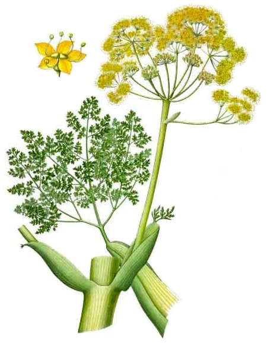
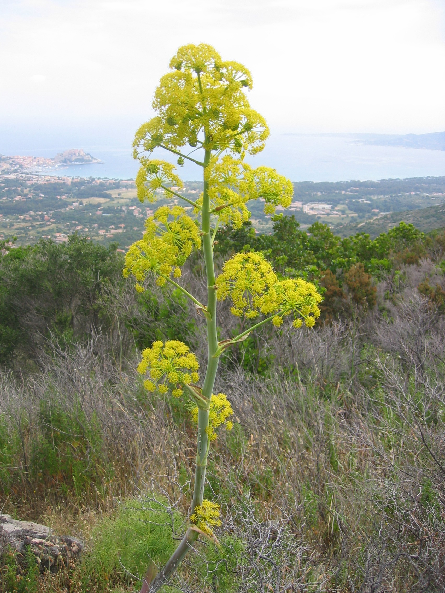
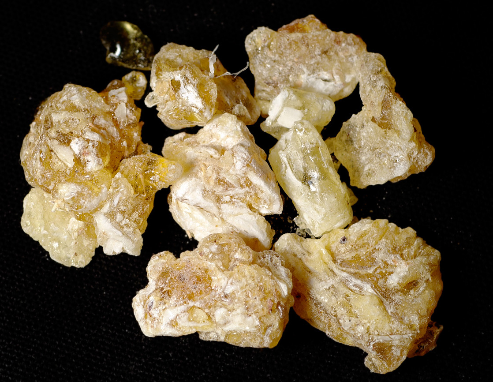
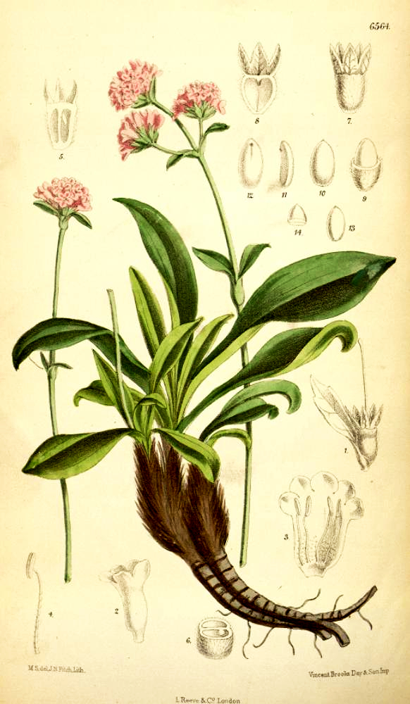

# Plants and Trees in the Bible

## License Information

Plants and Trees in the Bible © United Bible Societies, 2025. Adapted from: <cite>Each According to its Kind: Plants and Trees in the Bible</cite>, by Robert Koops © 2012 United Bible Societies. This work is licensed under Creative Commons Attribution-ShareAlike 4.0 International (<a href="https://creativecommons.org/licenses/by-sa/4.0/">https://creativecommons.org/licenses/by-sa/4.0/</a>).

--------------------------------

## 标题：制作香和香水的树木和植物 (id: FLORA:4.1)

4\.1 标题：制作香和香水的树木和植物
====================

## 标题：沉香树、沉香木（鹰木、伽罗木）（agarwood [eaglewood, aloeswood, lingaloes]） (id: FLORA:4.1.1)

4\.1\.1 标题：沉香树、沉香木（鹰木、伽罗木）（agarwood \[eaglewood, aloeswood, lingaloes]）
=======================================================================

经文出处
----

Hebrew 来：אֲהָלִים (音译：’ahalim)

[NUM 24:6](https://ref.ly/Num24:6), [PRO 7:17](https://ref.ly/Prov7:17)

Hebrew 来：אֲהָלוֹת (音译：’ahaloth)

[PSA 45:9](https://ref.ly/Ps45:9), [SNG 4:14](https://ref.ly/Song4:14)

讨论
--

祖海里非常确信[PSA 45:9](https://ref.ly/Ps45:9) （《和》45:8）中的*’ahaloth* 就是沉香木或鹰木（学名*Aquillaria agallocha* ），这是一种原产于印度北部的树木。（他曾说，沉香木也原产于东非，但这似乎是一个错误）。古希腊作家迪奥斯科里季斯（Dioscorides）称其为鹰木（*agallochon* ），这是出产于印度和阿拉伯半岛的树木。安德森赞成这个观点，解经家斯奈思（Snaith）和巴德（Budd）也都赞同。赫珀（Hepper）对此表示怀疑，因为他对印度与远东在这段历史时期有贸易往来的说法存有疑问，但是因为不能提出其他可能的植物，他也就附和了这种看法。这种木材的碎屑在印度称为*agar* （赫珀，第140页），作为燃香出售。所罗门王的远航探险（[1KI 9:26–1KI 9:28](https://ref.ly/1Kgs9:26-1Kgs9:28) ）可能曾取道提玛（[JOB 6:19](https://ref.ly/Job6:19) ）或底但（[ISA 21:13](https://ref.ly/Isa21:13) ）等神秘的地方，然后从印度带回来这种珍贵的商品；提玛和底但可能位于阿拉伯半岛。

在[NUM 24:6](https://ref.ly/Num24:6) 中，希伯来文*'ahalim* 不是指沉香树的香木条，而是指实际的树木。这节经文的最后两行是："如耶和华栽种的沉香树（*’ahalim* ），又如水边的香柏木。"这两句平行诗句描绘树木正在旺盛地生长。如果沉香树确实只在远东才有，那么巴兰或《民数记》的作者如何得知它们的样子呢？巴德和其他一些学者认为，在这节经文中，大自然的多种元素融合在一幅繁茂、美丽的奇异景象之中。Mft (Moffatt Translation (1926)) 将*’ahalim* 译为"oaks"（"橡树"），认为这里描绘的是中东的树种；莫尔登克赞同这种观点。

在英文中，沉香树也称为"lignaloes"或"aloeswood"，但它与中东、马达加斯加和非洲南部原产的芦荟（学名*Aloe vera* ）没有任何关系（参[4\.2\.1 芦荟（苦芦荟）（aloe \[bitter aloe]）](#FLORA:4.2.1) ）。

描述
--

鹰木或沉香树的高度为35—40米（115—132英尺），周长4米（13英尺）。木料芳香，特别是在被某种真菌感染时，沉香树会产生一种芳香树脂来对抗真菌。

特殊意义
----

《民数记》提到了沉香木，这很不寻常；除此之外，圣经别处提及沉香木时，均同时提到了没药，证实这种芳香物质被人用来制作香和香水。人们取材的传统做法是：将长了很多年的沉香树砍倒，以获取树木中心含树脂的木材。现今，由于这种树木的数量严重下降，泰国、不丹和其他东南亚国家的人们已经找到了促使树龄较小的树木产生树脂的方法。许多世纪以来，这种树脂一直是佛教和伊斯兰教仪式中很重要的部分，并且也用于制作香水和入药。古埃及的尸体防腐工匠同样使用沉香木和其他香料。日本人在香道仪式（*koh\-do* ）中，也会使用沉香木和檀香木。

翻译
--

由于沉香树在东非和印度（梵文作*aghal* ）广为人知，这些地区的翻译者应该能够找到当地的名称。在阿拉伯文中，沉香木被称为*oud* （"木头"），欧洲的调香师也使用这个名称，但由于其成本昂贵，所以很少见。这种树在日文中称为*jin\-koh* ，印尼文称为*gaharu* 。其他地方的翻译者需要考虑：当没药和沉香这两个词同时出现时，应当如何翻译。如果"没药"采用音译，那么"沉香"也可以音译。在亚洲，这种树的名称得自其产物（沉香）。在[PSA 45:9](https://ref.ly/Ps45:9) （《和》45:8）、[PRO 7:17](https://ref.ly/Prov7:17) 和[SNG 4:14](https://ref.ly/Song4:14) 中，需要音译的是芳香物质的名称（"沉香"），而不是这种树（"沉香树"）。有些学者认为这些经文是修辞性的，因此翻译者可以使用当地文化中的对等词来翻译没药和沉香。对于[NUM 24:6](https://ref.ly/Num24:6) ，巴兰对以色列人的祝福虽具修辞色彩，甚至可能是某种想象，但这是一个比较复杂的案例，因为这节经文将沉香树与香柏木配对使用，而香柏木在非修辞性的语境中也被频繁引用。这里，翻译者需要在历史和地理上的准确性与修辞效果之间做出选择。

* **Associated Passages:** 民数记 24:6; 箴言 7:17; 诗篇 45:9; 雅歌 4:14; 列王纪上 9:26; 列王纪上 9:28; 约伯记 6:19; 以赛亚书 21:13

## 标题：香菖蒲（calamus [sweet flag, aromatic cane, sweet cane, ginger grass]） (id: FLORA:4.1.2)

4\.1\.2 标题：香菖蒲（calamus \[sweet flag, aromatic cane, sweet cane, ginger grass]）
==============================================================================

经文出处
----

Hebrew 来：קָנֶה (音译：qaneh)

[SNG 4:14](https://ref.ly/Song4:14), [ISA 43:24](https://ref.ly/Isa43:24), [EZK 27:19](https://ref.ly/Ezek27:19)

Hebrew 来：קְנֵה־בֹשֶׂם (音译：qeneh bosem)

[EXO 30:23](https://ref.ly/Exod30:23)

Hebrew 来：קָנֶה הַטּוֹב (音译：qaneh hattov)

[JER 6:20](https://ref.ly/Jer6:20)

讨论
--

希伯来文*qaneh* /*qeneh* 的意思是"茎"或"秆"，*tov* 意为"好"，*bosem* 表示"有香气的"。关于*qaneh* 的辨识，目前有三种意见。许多植物学家认为，这个词指的是香茅属（学名*Cymbopogon* ）中三四种香草的任何一种，其中一种在以色列有野生。这是一种可能。另一种解释是：这种植物是从印度引进。在印度还有其他香味的香茅属植物，并且从古至今都有栽培，如姜草（玫瑰草；学名*Cymbopogon martinii* ）、骆驼草（学名*Cymbopogon schoenanthrus* ）和柠檬草（学名*Cymbopogon citratus* ）。其中，祖海里和莫尔登克都倾向于"姜草"的解释，这种草也称为"甜菖蒲"。然而，这个词的第三种可能就是真正的菖蒲（学名*Acorus calamus* ）。这是一种外形类似芦苇的植物，更常见的名称是"水菖蒲"。学者对于这种植物的起源争论非常大，可能是源于印度，然后蔓延到欧洲的沼泽地区，又称为蒲根、茎蒲、白菖、溪荪、兰荪等。埃及学家若雷（Joret）认为法老也用过这种草。植物学家伯基尔（Burkill）认为，希腊人知道如何使用水菖蒲的姜状根，但他们将其与真正的姜草的根混淆了，结果给后人留下了这种混乱的局面（赫珀，第144页）。

描述
--

姜草（第二种解释）为丛生植物，高度超过1米（3英尺），并且像剑草一样有坚硬的叶子。人们通过煮沸和蒸馏叶子来提取油脂。

菖蒲（第三种解释）是一种芦苇，长着坚硬的叶子，茎上的绿色花序特别显眼，可以长到约50厘米（20英寸）高。

特殊意义
----

[EXO 30:23](https://ref.ly/Exod30:23) 记载，*qeneh bosem* 是膏抹祭司所用圣油的成分之一。

翻译
--

[ISA 43:24](https://ref.ly/Isa43:24) 和[JER 6:20](https://ref.ly/Jer6:20) 提到了*qaneh* ，有学者认为是修辞性的。在这两处经文中，可以采用当地的文化对等词，并记住*qaneh* 是与乳香一起出现的。翻译者可能会觉得最好以同样的方式处理这两个词。如果是这样，可以用草或芦苇的统称加上一个意为"芳香的"词语来翻译*qaneh* 。亚洲的翻译者可以使用姜草或柠檬草的当地名称。或者，翻译者也可以直接音译希腊文*kalamos* ，加不加"甜"字都可以。香菖蒲／姜草的提取物是一种油，因此可以译为"甜菖蒲油"。翻译者可以也考虑按照某种主要语言的词语进行音译，例如，法文*verveine* 或*citronelle* 、葡萄牙文*erva* \-*cideira* 、西班牙文*limonaria* 或*paja**de**Meca* 或*Pasto cetron* 或*Zacate lemon* 或*palmarosa* 、中文"石菖蒲"。

* **Associated Passages:** 雅歌 4:14; 以赛亚书 43:24; 以西结书 27:19; 出埃及记 30:23; 耶利米书 6:20

## 标题：桂皮（cassia） (id: FLORA:4.1.3)

4\.1\.3 标题：桂皮（cassia）
=====================

经文出处
----

Hebrew 来：קִדָּה (音译：qiddah)

[EXO 30:24](https://ref.ly/Exod30:24), [EZK 27:19](https://ref.ly/Ezek27:19)

Hebrew 来：קְצִיעָה (音译：qetsi‘ah)

[PSA 45:9](https://ref.ly/Ps45:9)

讨论
--

与上文讨论的沉香树的情况一样（[4\.1\.1 沉香树、沉香木（鹰木、伽罗木）（agarwood \[eaglewood, aloeswood, lingaloes]）](#FLORA:4.1.1) ），祖海里确信，希伯来文*qiddah* 和*qetsi‘ah* 是指从肉桂树（学名*Cinnamomum cassia* ）的叶子、嫩枝或树皮中获取的油或粉末。肉桂树生长在东亚地区。"桂皮"这个名字可能来自印度东北部和孟加拉的卡西族人，他们先前生活在阿萨姆邦和缅甸等地，在古代从事桂皮贸易。因此，桂皮油可能是从东亚带到了以色列。然而，对于[EXO 30:23](https://ref.ly/Exod30:23); [EXO 30:24](https://ref.ly/Exod30:24) 中的"桂皮"和"香肉桂"，赫珀认为这些香料可能不是人们一般认为的亚洲香料。他引用卢卡斯（Lucas）和哈里斯（Harris）对古埃及材料的研究，指出埃及坟墓中没有这些亚洲香料的证据（赫珀，第138页）。如果它们是由备受欺压的以色列人带到迦南的，那为什么没有被更富裕的埃及人使用呢？此外，摩西是如何在偏远的西奈山区得到这些东西的呢？赫珀倾向于认为，香树皮和树脂是来源于阿拉伯半岛南部和非洲东北部。请注意提玛和底但的商队（[JOB 6:19](https://ref.ly/Job6:19) ；[ISA 21:13](https://ref.ly/Isa21:13); [ISA 21:14](https://ref.ly/Isa21:14) ），以及示巴女王的拜访（[1KI 10:2](https://ref.ly/1Kgs10:2) ）。

描述
--

亚洲桂皮树可长到10米（33英尺）高，长着独特的对生叶子，上有三条浅色叶脉或叶肋，由基部辐射出去。花朵很小，成簇下垂。

特殊意义
----

[EXO 30:24](https://ref.ly/Exod30:24) 记载，*qiddah* 是祭司膏抹所用圣油中的一种成分。在[JOB 42:14](https://ref.ly/Job42:14) 中，希伯来文*qetsi'ah* 是约伯的一个女儿的名字。

翻译
--

桂皮与广为人知的香料肉桂密切相关。事实上，在北美销售的大部分"肉桂"都是桂皮。欧洲人和南美人更愿意使用斯里兰卡和其他地方的真正肉桂。由于桂皮原产于东亚，那里的翻译者会知道桂皮在当地的名称，例如，印尼文*kayu manis cina* 、韩文*kaeseo* 、泰文*ob choey chin* /*thephatharo* ，以及越南文*que don* /*que quang* 。中文至少有十个名称，包括"官桂"、"桂辛"等。在中国，人们栽培这种植物以获取其树皮、花蕾和油。由于提到桂皮的经文是非修辞性的，所以其他地区的翻译者可以按照一种主要语言的词语来音译这个词，例如，阿拉伯文*darsini* 或*kirfa* 或*karfa* 或*salika* 、法文*kas* 或*kanéfis* 或*kanel**de**chin* /*selon* 、西班牙文／葡萄牙文*cassia* 或*canela de la China* 。桂皮（cassia）隶于樟属（学名*Cinnamomum* ），与非洲盛产的决明属（学名*Cassia* ）植物完全不同。因此，按照"cassia"进行音译在非洲可能会令人产生误解。为了避免读者将其与非洲决明属植物（没有香味）错误地联系在一起，非洲的翻译者可以采取以下译法：

1\. 音译希伯来文*qiddah* ；

2\. 音译英文（*kasiya* ），并用脚注说明这种树与非洲的决明属树木没有关系；

3\. 用一种众所周知的馨香树胶替代。

* **Associated Passages:** 出埃及记 30:24; 以西结书 27:19; 诗篇 45:9; 出埃及记 30:23; 约伯记 6:19; 以赛亚书 21:13; 以赛亚书 21:14; 列王纪上 10:2; 约伯记 42:14

## 标题：肉桂（cinnamon） (id: FLORA:4.1.4)

4\.1\.4 标题：肉桂（cinnamon）
=======================

经文出处
----

Hebrew 来：קִנָּמוֹן (音译：qinnamon)

[EXO 30:23](https://ref.ly/Exod30:23), [PRO 7:17](https://ref.ly/Prov7:17), [SNG 4:14](https://ref.ly/Song4:14)

Greek 希：κιννάμωμον (音译：kinnamōmon)

[REV 18:13](https://ref.ly/Rev18:13), [SIR 24:15](https://ref.ly/Sir24:15)

讨论
--

锡兰肉桂（学名*Cinnamomum verum* 、*Cinnamomum zeylanicum* ）是一种主要生长在斯里兰卡、印度和缅甸的树。如果追溯字源，希伯来文*qinnamon* 可能是源自马来文／印尼文*kayu**manis* 的早期形式，意思是"甜木"。关于肉桂的讨论，存在着与桂皮类似的争议，即旧约中提到的肉桂是从远东进口的，还是当时就有来自阿拉伯或非洲的、称为*qinnamon* 的香料，因为这个名称在撰写旧约书卷时就已经为人所知。有些学者认为，早在主前第二个千年，印度和埃及之间就有贸易往来。事实上，有人认为著名的埃及女王哈特谢普苏特（Hatshepsut）在主前1490年就从朋特（Punt）带回来了没药或乳香树，这个地方可能位于索马里甚至是印度。然而，她显然没有带回来肉桂树，并且在埃及陵墓发现的香料中也没有肉桂和桂皮。因此，圣经中提到的"cinnamon"（"肉桂"）究竟是哪种植物，现今仍旧不明。

描述
--

真正的肉桂树可长到10米（33英尺）高。茎干分枝茂盛，革质叶子长10—15厘米（4—6英寸），有三条浅色的辐射状叶脉。刮掉海绵状的外皮后，会露出芳香的浅棕色内皮。这种内皮有肉桂味，把它切割下来并干燥后，树皮就会卷曲成小卷。肉桂树的小花会发出难闻的气味。

特殊意义
----

[EXO 30:23](https://ref.ly/Exod30:23) 记载，用于涂抹帐幕、约柜和膏抹祭司的圣膏油中有肉桂的成分。[PRO 7:17](https://ref.ly/Prov7:17) 所述诱惑人的女子，就是用肉桂加上没药和沉香熏了她的床榻。今天，肉桂皮被磨成粉末作为食物的调料，也用作香和香水的成分，甚至叶子和未成熟的浆果（"芽"）也作为调味品出售。

翻译
--

亚洲的翻译者可以采用自己语言中表示肉桂的词语，例如中文"肉桂"或"锡兰肉桂"、韩文*kye* /*kyepi* 或*sillon\-gyepi* 、马来文*kayu manis* 、尼泊尔文*dalchini* 、泰米尔文*lavanga pattai* 、泰文*ob**choey* ，以及越南文*cay que* /*nhuc que* 或*que ranh* ，甚至可以区分桂皮和肉桂。在其他地区，最好音译希伯来文*qinnamon* 或某种主要语言（例如，英文*sinamon* 、法文*kanel* 、西班牙文／葡萄牙文*kanela* 、阿拉伯文*kirfa* 或*darini* 或*salika* ）。由于树皮会被研磨成粉末，因此可以用"树皮"或"粉末"来将其分类。在[EXO 30:23](https://ref.ly/Exod30:23); [EXO 30:24](https://ref.ly/Exod30:24) 中，翻译者需要用两个不同的词语，来翻译密切相关的桂皮和肉桂。

* **Associated Passages:** 出埃及记 30:23; 箴言 7:17; 雅歌 4:14; 启示录 18:13; 德训篇 24:15; 出埃及记 30:24

## 标题：小茴香（白松香）（fennel [galbanum]） (id: FLORA:4.1.5)

4\.1\.5 标题：小茴香（白松香）（fennel \[galbanum]）
=======================================

经文出处
----

Hebrew 来：חֶלְבְּנָה (音译：chelbenah)

[EXO 30:34](https://ref.ly/Exod30:34)

Greek 希：χαλβάνη (音译：chalbanē)

[SIR 24:15](https://ref.ly/Sir24:15)

讨论
--

虽然圣经中提到的白松香所指何物并不确定，但很有可能是一种树脂，来自一种名为小茴香（学名*Ferula galbaniflua* ）的植物。这种植物生长在印度、伊朗和阿富汗，特别是在伊朗的高山上。小茴香与欧芹科有亲缘关系。今天，大多数的白松香商品来自于黎巴嫩和伊朗。

描述
--

小茴香可以长到1\.5米（5英尺）高。小叶纤细有光泽，茎粗而光滑，伞状花序，种子有光泽且很小。这种植物有乳状汁液，会从节部自行分泌而出，或者在切割后从茎部渗出。汁液干燥后，会结成芳香的淡绿色或淡黄色小珠。味苦，气味浓郁。有一种小茴香生长在加利利（学名*Ferula communis* ），但它不产白松香脂。另一种小茴香生长在北非，名为*silphion* （可能是*Ferula tingitana* ），其图案曾出现在迦太基出土的罗马钱币上。

特殊意义
----

摩西在[EXO 30:34](https://ref.ly/Exod30:34) 说，白松香（喜利比拿）是以色列人在帐幕中所燃圣香的成分之一。亚述人将白松香用作熏香。它可能就是[GEN 37:25](https://ref.ly/Gen37:25) 中提到的"香料"。罗马作家普林尼认为，这是一种非常有效的药物。

翻译
--

由于小茴香并不为人所熟知，因此大多数翻译者都需要按照某种主要语言进行音译，比如：

1\. 音译希伯来文词语：*helibena* 、*elbenahi* 、*lebena* ；

2\. 通过英文音译拉丁文词语：*galbanum* ；

3\. 用当地的某种树胶来替代，增加*chelbenah* 或*galbanum* 作为辅助说明，或在脚注中说明；

4\. 音译这种植物的名称，同时增加分类词"树胶"：*ferula* （法文）树胶、*feneli* （英文）树胶，或*hinojo* /*ferula* （西班牙文）树胶。

* **Associated Passages:** 出埃及记 30:34; 德训篇 24:15; 创世记 37:25

## 标题：乳香（frankincense） (id: FLORA:4.1.6)

4\.1\.6 标题：乳香（frankincense）
===========================

经文出处
----

Hebrew 来：לְבוֹנָה (音译：levonah)

[EXO 30:34](https://ref.ly/Exod30:34), [LEV 2:1](https://ref.ly/Lev2:1), [LEV 2:2](https://ref.ly/Lev2:2), [LEV 2:15](https://ref.ly/Lev2:15), [LEV 2:16](https://ref.ly/Lev2:16), [LEV 5:11](https://ref.ly/Lev5:11), [LEV 6:8](https://ref.ly/Lev6:8), [LEV 24:7](https://ref.ly/Lev24:7), [NUM 5:15](https://ref.ly/Num5:15), [1CH 9:29](https://ref.ly/1Chr9:29), [NEH 13:5](https://ref.ly/Neh13:5), [NEH 13:9](https://ref.ly/Neh13:9), [SNG 3:6](https://ref.ly/Song3:6), [SNG 4:6](https://ref.ly/Song4:6), [SNG 4:14](https://ref.ly/Song4:14), [ISA 43:23](https://ref.ly/Isa43:23), [ISA 60:6](https://ref.ly/Isa60:6), [ISA 66:3](https://ref.ly/Isa66:3), [JER 6:20](https://ref.ly/Jer6:20), [JER 17:26](https://ref.ly/Jer17:26), [JER 41:5](https://ref.ly/Jer41:5)

Greek 希：λιβανόομαι (音译：libanoomai（动词）)

[3MA 5:45](https://ref.ly/3Macc5:45)

Greek 希：λίβανος (音译：libanos)

[MAT 2:11](https://ref.ly/Matt2:11), [REV 18:13](https://ref.ly/Rev18:13), [SIR 24:15](https://ref.ly/Sir24:15), [SIR 39:14](https://ref.ly/Sir39:14), [BAR 1:10](https://ref.ly/Bar1:10), [3MA 5:10](https://ref.ly/3Macc5:10)

Greek 希：λιβανωτός (音译：libanōtos)

[3MA 5:2](https://ref.ly/3Macc5:2)

讨论
--

乳香（学名*Boswellia sacra* ）产自乳香属（学名*Boswellia* ）15种芳香植物中的一种，该植物所产生的黄色或浅红色树胶就是乳香，可能是从阿拉伯半岛、非洲或亚洲输入到以色列的。埃及的图画记录显示，哈特谢普苏特女王曾经前往一个叫作朋特（Punt）的地方（可能位于索马里甚至是印度），带回来了看起来像是乳香属的树木，并把它们种植在她宫殿的花园里面。赫珀认为，以色列人起初使用来自索马里的树胶（学名*Boswellia carteri* ），埃塞俄比亚树胶（*Boswellia papyrifera* ）和阿拉伯树胶（*Boswellia sacra* ），后来才得到来自印度的乳香（*Boswellia serrata* ）。有些人称乳香为*olibanum* （这是一个中东词语，意思是"香"），但是*olibanum* 可能仅指来自印度的*Boswellia serrata* ，这种植物具有柠檬／酸橙的气味，真正的乳香则是柑橘的气味。

现今，最好的乳香来自阿曼，但也门和索马里的产量也很大。*Olibanum* 这个名称可能来自阿拉伯文*al\-lubán* （"牛奶"），或者源自意思是"黎巴嫩油"的词语。希伯来文*levonah* 的意思可能是"白色"或"黎巴嫩人"。

描述
--

乳香树实际上是灌木，高达3米（10英尺），有多条树干从地里冒出来，长着羽状叶子，开绿色或白色的小花。乳香树的树胶会自动从树枝上滴下来，但是也可以通过割开树干上的树皮来获取。流出的树脂为球状，过一段时间会变硬。

特殊意义
----

乳香是古代以色列人在帐幕中所燃圣香的成分之一。另外，律法规定的素祭也包含了乳香。

翻译
--

翻译者可以增加一个合适的分类词（例如，"某某树脂"）。如果采用音译，建议音译希伯来文（*labona* 、*lebonahi* ）、希腊文（*libano* ）、法文（*bosweli* 、*olibán* ），或阿拉伯文（*akor* 、*mager* 、*mogar* ），会比音译英文（*firankinsensi* ）更加好读。

[JER 6:20](https://ref.ly/Jer6:20) 记载，上帝说"从示巴来的乳香（*levonah* ），从远方出的香菖蒲（*qaneh hattov* ），奉来给我有何用呢？"这个反问句中提到两种植物制品（*levonah* 和*qaneh hattov* ），两者都是指香。这个反问句可以转换为肯定陈述句如下：

你从示巴带来*levonah* 是无益的。

忘掉你从遥远的地方带来的*qaneh hattov* 吧。

如果采用比较自由的翻译方式，可以将两种植物材料视为"香"。翻译示例如下：

你远路风尘从示巴把香带来，但又何必呢？

何必费力从遥远的国家带来祭物呢？

这节经文的下半句有助于解释上半句的含义，如果能够使意思更加明显，那么将上下两个半句交换位置也未尝不可。

* **Associated Passages:** 出埃及记 30:34; 利未记 2:1; 利未记 2:2; 利未记 2:15; 利未记 2:16; 利未记 5:11; 利未记 6:8; 利未记 24:7; 民数记 5:15; 历代志上 9:29; 尼希米记 13:5; 尼希米记 13:9; 雅歌 3:6; 雅歌 4:6; 雅歌 4:14; 以赛亚书 43:23; 以赛亚书 60:6; 以赛亚书 66:3; 耶利米书 6:20; 耶利米书 17:26; 耶利米书 41:5; 玛加伯三书 5:45; 马太福音 2:11; 启示录 18:13; 德训篇 24:15; 德训篇 39:14; 巴路克 1:10; 玛加伯三书 5:10; 玛加伯三书 5:2

## 标题：散沫花（henna） (id: FLORA:4.1.7)

4\.1\.7 标题：散沫花（henna）
=====================

经文出处
----

Hebrew 来：כֹּפֶר (音译：kofer)

[SNG 1:14](https://ref.ly/Song1:14), [SNG 4:13](https://ref.ly/Song4:13)

讨论
--

散沫花（学名*Lawsonia inermis* ）在旧约时期生长在死海周围的绿洲中，又名埃及女贞树，在非洲、南亚和澳大利亚北部炎热干燥的地区很常见。在过去和现在，散沫花的用处主要是从其干燥的叶子中提取染料，但是在[SNG 1:14](https://ref.ly/Song1:14) 中，作者提到的却是它的花朵。散沫花的花朵确实美丽芳香，呈"束状"（希伯来文*’eshkol* ），可以看作一个编织物品，与第13节中没药的小袋子平行，或者看作一个花环，或者直接看作隐•基底泉上方梯田中的花丛。[SNG 4:13](https://ref.ly/Song4:13) 的散沫花比较特别，因为希伯来文本是以复数形式（*kefarim* ）出现；同样以复数出现的是比散沫花更加特别的希伯来文*neradim* （源于*nerd* ；参[4\.1\.9 甘松（哪哒）（spikenard \[nard]）](#FLORA:4.1.9) ），两种植物平行出现。这些植物的果实都不明显，因此这节经文可以看作是揉合了香料和花朵的浪漫比喻。

描述
--

散沫花是一种灌木，高度为2—3米（7—10英尺）。叶子对生，开许多芳香的白花。叶子会分泌一种红色汁液，许多国家的人用它来做染料，给皮肤或头发染色。

特殊意义
----

在[SNG 1:14](https://ref.ly/Song1:14) ，新娘将她的良人比作馨香美丽的散沫花花朵，在隐•基底泉上方梯田的葡萄园里面或附近生长。在[SNG 4:13](https://ref.ly/Song4:13) ，新郎将他的佳偶比作花园或果园，那里生长着各种芳香美丽的植物，其中一些来自异国。

翻译
--

在提到散沫花的两处经文中，上下文显然是个比喻，因此可以用当地已知的相应植物来替代。有些地方只知道散沫花是给头发、皮肤或指甲染色的，此时就要用一种替代植物，或是在脚注中说明，经文关注的是这种花的芳香和美丽。在[SNG 4:13](https://ref.ly/Song4:13) 中，大多数英文译本忽略了这个词的复数形式，也许是认为它只是受到了前文复数"果子"的影响，因而未予重视。另外，翻译者也可以按照某种主要语言的词语进行音译，例如，法文*henné* 、西班牙文*alcana* 或*alheña* 、葡萄牙文*hena* 或*alfenero* ，或者阿拉伯文*hinna* 。近来，人们又开始使用散沫花来进行皮肤装饰（"mehndi"），这可能会使翻译者更容易找到一个合适的对等词。KJV (King James Version (1611)) 中的"Camphire"（"指甲花"）也许可以作为一个文化上的替代词。

* **Associated Passages:** 雅歌 1:14; 雅歌 4:13

## 标题：没药（myrrh） (id: FLORA:4.1.8)

4\.1\.8 标题：没药（myrrh）
====================

经文出处
----

Hebrew 来：מֹר (音译：mor)

[EST 2:12](https://ref.ly/Esth2:12), [PSA 45:9](https://ref.ly/Ps45:9), [PRO 7:17](https://ref.ly/Prov7:17), [SNG 1:13](https://ref.ly/Song1:13), [SNG 3:6](https://ref.ly/Song3:6), [SNG 4:6](https://ref.ly/Song4:6), [SNG 4:14](https://ref.ly/Song4:14), [SNG 5:1](https://ref.ly/Song5:1), [SNG 5:5](https://ref.ly/Song5:5), [SNG 5:5](https://ref.ly/Song5:5), [SNG 5:13](https://ref.ly/Song5:13)

Hebrew 来：מָר־דְּרוֹר (音译：mor deror)

[EXO 30:23](https://ref.ly/Exod30:23), [EXO 30:23](https://ref.ly/Exod30:23)

Greek 希：μύρον (音译：muron)

[REV 18:13](https://ref.ly/Rev18:13)

Greek 希：σμύρνα (音译：smurna)

[MAT 2:11](https://ref.ly/Matt2:11), [JHN 19:39](https://ref.ly/John19:39), [SIR 24:15](https://ref.ly/Sir24:15)

Greek 希：σμυρνίζω (音译：smurnizō（动词）)

[MRK 15:23](https://ref.ly/Mark15:23)

讨论
--

没药可能是圣经中最珍贵的香料，价值超过同等重量的黄金。参与编纂本手册的植物学家同意，希伯来文*mor* 指的是没药属（学名*Commiphora* ）中一种植物的树脂，可能是*myrrha* 、*abyssinica* 或*schimperi* 的树脂，这些植物都生长在现在的也门、埃塞俄比亚、索马里和马达加斯加地区。其他种类的没药可能来自印度（学名*Commiphora erythraea* 、*Commiphora opobalsamum* ）。另外，有一个更困难的问题，就是[EXO 30:23](https://ref.ly/Exod30:23) 中*deror* 一词的含义。在出现这个词的其他经文中，其含义是"自由"。因此，有些译本在这里将其译成"流质的"，但我们并不确定"自由"就是指"流质的"。没药有时会与葡萄酒混合使用，这个事实可能表明*deror* 在这里的意思是"流质的"，但另一方面，没药是以干量单位而不是液量单位来称量的，这又表明它不是液体（德拉姆，第407页）。

在[GEN 37:25](https://ref.ly/Gen37:25); [GEN 43:11](https://ref.ly/Gen43:11) 中，RSV (Revised Standard Version (1952)) 将希伯来文*lot* 译为"myrrh"（"没药"），但是根据最新的学术研究结果，这个词应该译为"ladanum"（"劳丹脂"）（参[4\.2\.5 岩玫瑰（劳丹脂）（rock rose \[ladanum]）](#FLORA:4.2.5) ）。

在[1KI 10:25](https://ref.ly/1Kgs10:25); [2CH 9:24](https://ref.ly/2Chr9:24) 中，RSV (Revised Standard Version (1952)) 将希伯来文*nesheq* 同样译为"myrrh"（"没药"）（类似地，REB (Revised English Bible (1989)) 译为"perfume""香水"），但大多数其他英文译本将这个词译为"weapons"（"武器"）或"armor"（"盔甲"）。

描述
--

没药是一种灌木或灌木丛，长着厚密多刺的枝子，其伸展和弯曲的角度很奇特。叶子以三片为一组，果实像李子一样呈卵形。木材和树皮具有馨香的气味。枝子会自然渗出汁液，但有些采集者会切开枝条以增加树液的收获量。树液或树胶在流出时呈透明或黄棕色，但干燥后颜色会变暗。没药味苦（注意，*mor* 与意为"苦"的希伯来文*mar* 相似）。在市场上，没药常与卡他夫没药灌木（*bisabol* ）的树胶混合。

特殊意义
----

上帝指示以色列人，没药为圣膏油的成分之一（[EXO 30:23](https://ref.ly/Exod30:23) ），在《以斯帖记》、《诗篇》、《箴言》中，没药用作香水，在《雅歌》中出现过8次。东方博士也将其作为贵重的礼物献给新生王（[MAT 2:11](https://ref.ly/Matt2:11) ）。当耶稣在十字架上垂死的时候，那些同情耶稣的旁观者可能给他掺了没药的葡萄酒喝（[MRK 15:23](https://ref.ly/Mark15:23) ；参[MAT 27:34](https://ref.ly/Matt27:34) 中的平行叙述）。亚利马太的约瑟和尼哥德慕带来了没药和沉香，预备埋葬耶稣（[JHN 19:39](https://ref.ly/John19:39) ）。在古埃及，太阳神的祭坛上会焚烧没药；而在波斯，当国王出现在公众面前时，王冠上面会系着没药；罗马人在葬礼和火葬时也会焚烧没药。这些事实在部分程度上解释了没药为什么会出现在[REV 18:13](https://ref.ly/Rev18:13) 的香料清单中（《和》、《和修》译作"香膏"）。今天，没药被用在香水、乳液，甚至牙膏中。

翻译
--

非洲之角和马达加斯加生长着多种没药，因此这些地区的翻译者要找到合适的译词应该没有问题。对于[EXO 30:23](https://ref.ly/Exod30:23) 所述的没药是液体还是固体，学者似乎没有达成共识，所以翻译者可以忽略希伯来文*deror* （如CEV (Contemporary English Version) 的做法）。*Mor deror* 有几种翻译方法，例如，"没药条"（"sticks of myrrh"；REB (Revised English Bible (1989)) ）、"自由流动的没药"（"free\-flowing myrrh"；NAB (New American Bible (1970)) ）、"凝结的没药"（"solidified myrrh"；NJPSV (New Jewish Publication Society Version) ）、"没药粉"（"powdered myrrh"；GW (God's Word Translation) 、德拉姆）、"鲜没药"（"fresh myrrh"；NJB (New Jerusalem Bible (1985)) ）、"液体没药"（"liquid myrrh"；GNB (Good News Bible) 、NIV (New International Version (1984)) 、NCV (New Century Version) ），以及"纯没药"（"pure myrrh"；NLT (New Living Translation) 、LB (Living Bible (1971)) ）。如果采用音译，可以音译希伯来文*mor* 、阿拉伯文*mar* 、法文*mireh* ，或者西班牙文／葡萄牙文*mirra* 。英文或法文音译需要稍作修改，以利于发音（例如，*mura* ），避免像一个早期的尼日利亚文译本那样，将不易发音的myrrh（"没药"）直接音译而不加改变。

* **Associated Passages:** 以斯帖记 2:12; 诗篇 45:9; 箴言 7:17; 雅歌 1:13; 雅歌 3:6; 雅歌 4:6; 雅歌 4:14; 雅歌 5:1; 雅歌 5:5; 雅歌 5:13; 出埃及记 30:23; 启示录 18:13; 马太福音 2:11; 约翰福音 19:39; 德训篇 24:15; 马可福音 15:23; 创世记 37:25; 创世记 43:11; 列王纪上 10:25; 历代志下 9:24; 马太福音 27:34

## 标题：甘松（哪哒）（spikenard [nard]） (id: FLORA:4.1.9)

4\.1\.9 标题：甘松（哪哒）（spikenard \[nard]）
====================================

经文出处
----

Hebrew 来：נֵרְדְּ (音译：nerd)

[SNG 1:12](https://ref.ly/Song1:12), [SNG 4:13](https://ref.ly/Song4:13), [SNG 4:14](https://ref.ly/Song4:14)

Greek 希：νάρδος (音译：nardos)

[MRK 14:3](https://ref.ly/Mark14:3), [JHN 12:3](https://ref.ly/John12:3)

讨论
--

在世界各地讲英语的地方，人们使用"spikenard"（"甘松"）这个名字多过使用"nard"（"哪哒"）。甘松（哪哒）的希伯来文和希腊文词语可用来指称出自多种植物的多种不同物质。普林尼列出了12种。祖海里认为新约中的甘松与旧约中的甘松是同样的东西，即来自印度的匙叶甘松（学名*Nardostachys jatamansi* ）。赫珀质疑圣经中的大多数香料源于印度的说法，他认为《雅歌》中提及的甘松可能是骆驼草（学名*Cymbopogon schoenanthus* ），这种草生长在阿拉伯和北非的沙漠中。亚述文称之为*lardu* 。但是，如果《雅歌》是比较晚期的作品，那么其中提到的甘松就很可能源于印度。在[MRK 14:3](https://ref.ly/Mark14:3); [JHN 12:3](https://ref.ly/John12:3) 中，RSV (Revised Standard Version (1952)) 将希腊文*nardos pistikos* 译为"pure nard"（"纯甘松"），但*pistikos* 的含义是值得商榷的。这个词实际上可能来自梵文*picita* ，即甘松的当地名称。在阿拉伯文中，甘松被称为*sunbul Hindi* （"印度甘松"）。

描述
--

甘松是一种高度不到1米（3英尺）的绿叶灌木，全株具有浓郁的芳香，茎较短，每根茎的尖端有一束三片小窄叶。粉红色的花朵为伞状。人们将根茎（块茎）捣碎，以提取味道辛辣的淡橙色或黄色的油。

特殊意义
----

[SNG 4:13](https://ref.ly/Song4:13); [SNG 4:14](https://ref.ly/Song4:14) 的比喻中两次提及甘松，新娘被喻为茂盛的花园，里面长满了各种可爱的馨香植物和树木。希伯来文本先是用复数形式提到甘松，与复数形式的散沫花平行，似乎是作为植物或树木，或者是树木所结果实的名称。之后，甘松的单数形式又与番红花平行，接着提到香菖蒲和肉桂等香料。甘松是古埃及、近东和罗马的一种奢侈品。有一篇主后1100年左右的中医文献记载了甘松香的镇静效果。今天，中国人仍然用它来制作线香（*senko* ）和入药。另外，甘松也是日本梅花节所用熏香的成分之一。[JHN 12:3](https://ref.ly/John12:3) 提到了甘松，那里拉撒路的姐妹马利亚用"极贵的纯哪哒香膏"来膏抹耶稣。

翻译
--

对于《雅歌》的比喻中提及的甘松，可以用当地文化中的对等词来翻译。《马可福音》和《约翰福音》提到甘松当然是非修辞性的，所以应当尽量用甘松的当地名称来翻译；如果为了保持整体翻译的一致性而采用音译，建议使用"naridi"之类的音译。

* **Associated Passages:** 雅歌 1:12; 雅歌 4:13; 雅歌 4:14; 马可福音 14:3; 约翰福音 12:3

