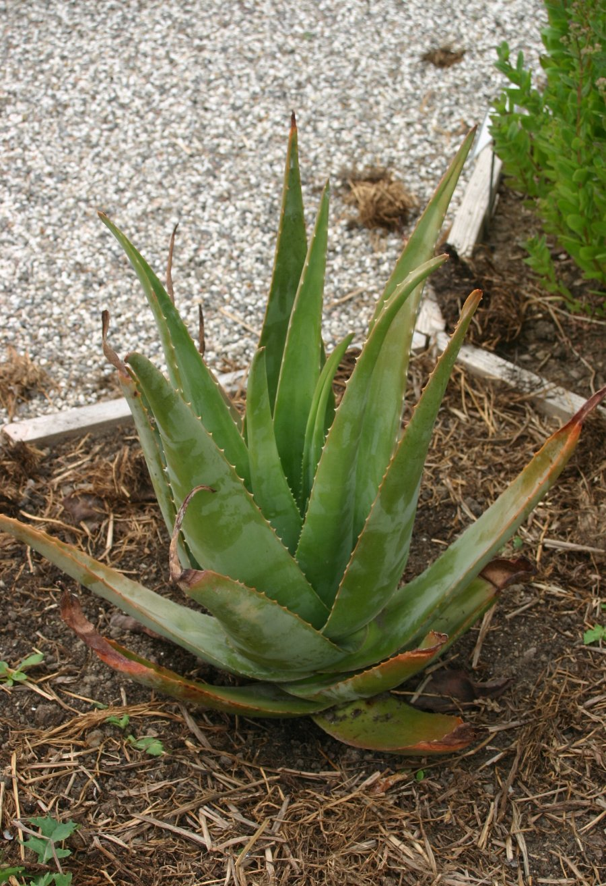
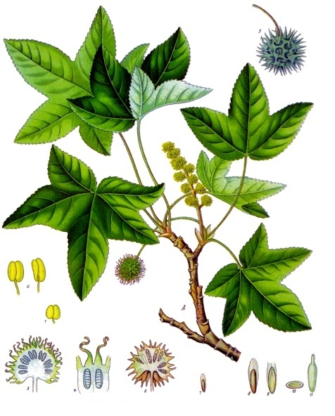
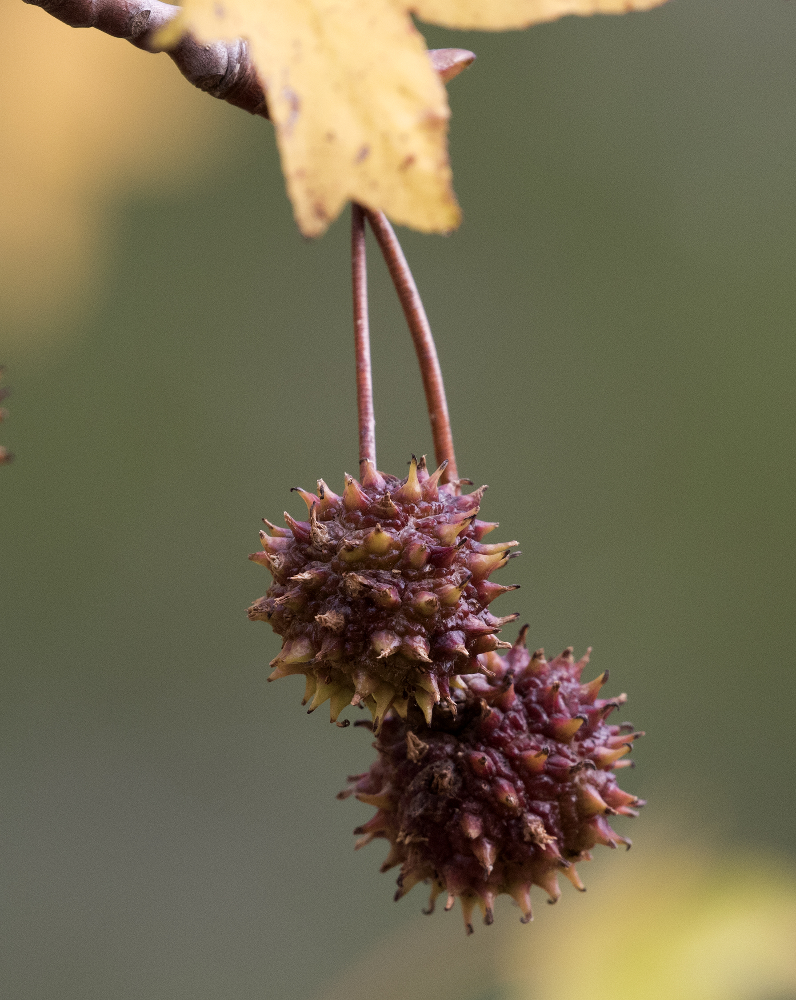
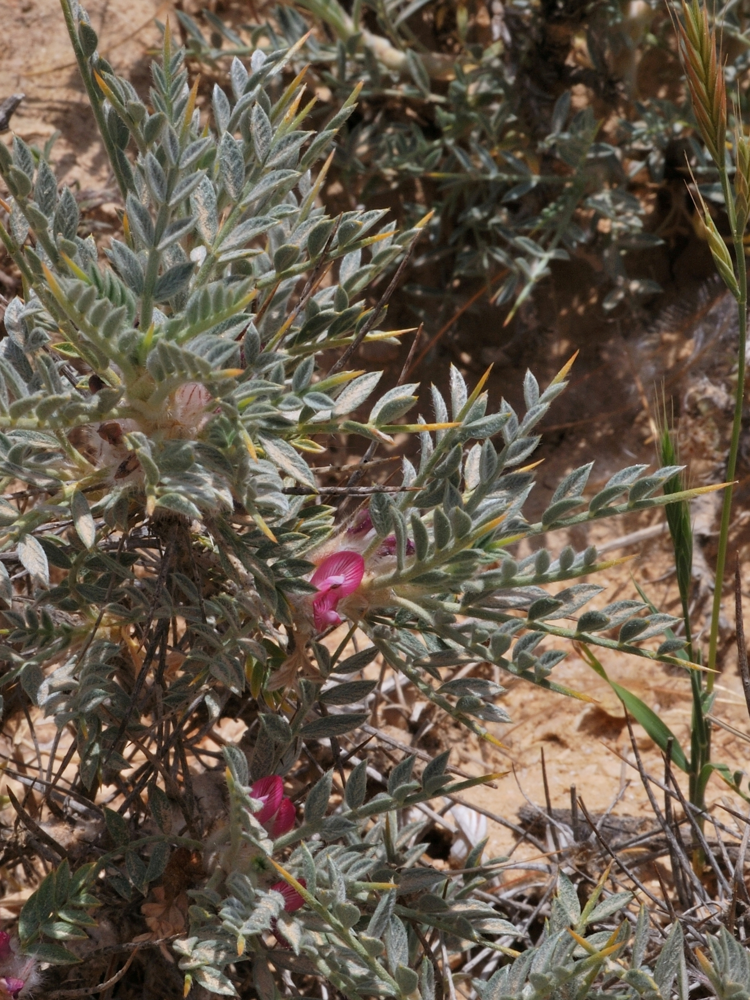

# Plants and Trees in the Bible

## License Information

Plants and Trees in the Bible © United Bible Societies, 2025. Adapted from: <cite>Each According to its Kind: Plants and Trees in the Bible</cite>, by Robert Koops © 2012 United Bible Societies. This work is licensed under Creative Commons Attribution-ShareAlike 4.0 International (<a href="https://creativecommons.org/licenses/by-sa/4.0/">https://creativecommons.org/licenses/by-sa/4.0/</a>).

--------------------------------

## 标题：药膏和香膏（药用植物） (id: FLORA:4.2)

4\.2 标题：药膏和香膏（药用植物）
===================

如前所述，许多用来制作香和香水的芳香植物也被认为具有治病的效果。下面列出的植物主要用于治疗：芦荟、蓖麻子、苏合香、麦加香脂、岩玫瑰、番红花和黄蓍胶。

为了有一个正确的开始，我们必须先处理各词语的定义。正如本章介绍中所说，"balm"（"香膏"）一词可能令人困惑。因为一般来说，它是指任何用来治疗伤处或减轻疼痛的油性或树脂状物质。但也可以用来指阿拉伯半岛出产的某种植物，以及从中取得的树脂。本手册兼取这两种意思。请注意上面的标题，以及[4\.2\.3 苏合香（东方枫香）（liquidambar \[Oriental sweetgum, storax]）](#FLORA:4.2.3) 和[4\.2\.4 麦加香脂（香脂、香膏）（opobalsamum \[balsam, balm]）](#FLORA:4.2.4) 对"香膏"的讨论。

## 标题：芦荟（苦芦荟）（aloe [bitter aloe]） (id: FLORA:4.2.1)

4\.2\.1 标题：芦荟（苦芦荟）（aloe \[bitter aloe]）
=======================================

经文出处
----

Greek 希：ἀλόη (音译：aloē)

[JHN 19:39](https://ref.ly/John19:39)

讨论
--

*芦荟 (© Thamizhpparithi Maari (Wikimedia Commons))*

翻译者必须区别新约提到的沉香与某些译本在旧约中所称的沉香。在[NUM 24:6](https://ref.ly/Num24:6) 、[PSA 45:9](https://ref.ly/Ps45:9) （《和》45:8）和其他几处经文中，沉香指的是印度北部生长的沉香树的芳香木片（参[4\.1\.1 沉香树、沉香木（鹰木、伽罗木）（agarwood \[eaglewood, aloeswood, lingaloes]）](#FLORA:4.1.1) ）。然而，新约中提到的沉香则是芦荟（学名*Aloe vera* ）。这种芦荟原产于非洲南部、阿拉伯半岛和马达加斯加。芦荟叶中的凝胶状物质用作药物已有数百年之久，特别是用来治疗皮肤的烧伤和擦伤，另外也用作泻药，今天还用来制作护肤霜、肥皂、洗发水等，（在亚洲）甚至作为饮料，或加在茶里面。

描述
--

芦荟的叶子较硬，就像从植株中心长出的肥厚刀片，边缘多刺，基本上为纯绿色，有些品种带有斑点。大多数芦荟没有可见的茎，但有些品种确实有茎。芦荟可以长到1米（3英尺）以上。在花梗上绽开一簇簇红色或黄色的管状小花。

特殊意义
----

[JHN 19:39](https://ref.ly/John19:39) 记载，尼哥德慕带来芦荟和没药来涂抹耶稣的身体。

翻译
--

芦荟原产于非洲南部、马达加斯加和阿拉伯半岛，现在则遍布世界各地的热带国家。这些地区的翻译者应该可以找到该植物的当地名称。[JHN 19:39](https://ref.ly/John19:39) 在一个非修辞语境中提到芦荟，因此建议采用某种主要语言的音译，但这也取决于同时出现的没药一词的译法。翻译者可以按照拉丁文*alovera* 、法文*alowes* 或西班牙文*asibar* 进行音译。

* **Associated Passages:** 约翰福音 19:39; 民数记 24:6; 诗篇 45:9

* **Associated ACAI Concepts:** Aloes (ID: `realia:Aloes`); Aloes (ID: `flora:Aloes`)

## 标题：蓖麻（castor oil plant [castor bean plant]） (id: FLORA:4.2.2)

4\.2\.2 标题：蓖麻（castor oil plant \[castor bean plant]）
====================================================

经文出处
----

Hebrew 来：קִיקָיוֹן (音译：qiqayon)

[JON 4:6](https://ref.ly/Jonah4:6), [JON 4:6](https://ref.ly/Jonah4:6), [JON 4:7](https://ref.ly/Jonah4:7), [JON 4:9](https://ref.ly/Jonah4:9), [JON 4:10](https://ref.ly/Jonah4:10)

讨论
--

*蓖麻叶 (© I, MJJR (Wikimedia Commons))*

从耶柔米和奥古斯丁时期以来，关于《约拿书》中的*qiqayon* 是什么植物就一直存在争议。祖海里、赫珀和莫尔登克都认为*qiqayon* 是指蓖麻（学名*Ricinus communis* ），并且NJB (New Jerusalem Bible (1985)) 、FFB 、多本注释书和一些圣经百科全书都是照此而译。然而，KJV (King James Version (1611)) 中"gourd"（"葫芦"）的译法也有着悠久的历史，包括《七十士译本》（希腊文*kolocuntha* ；参[5\.2\.6 野瓜（柯罗辛、苦西瓜、药西瓜）（wild gourd \[colocynth, egusi, bitter apple]）](#FLORA:5.2.6) ）、REB (Revised English Bible (1989)) 、NAB (New American Bible (1970)) 、Mft (Moffatt Translation (1926)) 和AT (American Translation (Goodspeed, 1935)) 都依循此例。《拉丁文武加大译本》将*qiqayon* 译为*hedera* （"常春藤"；参[1\.10 常春藤 (ivy)](#FLORA:1.10) ），并且为《诺克斯译本》采用，但这种译法没有植物学上的支持。1985年，罗宾逊（Robinson）对耶柔米以来的文献进行了深入的研究，并勉强接受它是葫芦（colocynth，苦西瓜）。有些学者甚至提出，这可能是故事中插入的亚述文词语，只是为了使故事听起来具有异国风情，甚或这只是一个虚构的词。

描述
--

*蓖麻种柄 (© Parvathisri (Wikimedia Commons))*

蓖麻可以长到3米（10英尺）高，深绿色扇形叶子的宽度可以达到半米。茎上长有一串串带刺的圆形种子。

特殊意义
----

古人将蓖麻子的油作为药用，通常是用作泻药。在《约拿书》中，这种植物是上帝和他固执的先知之间激烈对抗的关键元素。

翻译
--

许多翻译者会在这里选择一个通称，以避免在"葫芦"和"蓖麻"之间做出选择，例如译成"藤本植物"（"vine"；CEV (Contemporary English Version) 、NIV (New International Version (1984)) ）或"植物"（"plant"；RSV (Revised Standard Version (1952)) 、GNB (Good News Bible) ）。NJPSV (New Jewish Publication Society Version) 译成拉丁文的"蓖麻子"。由于蓖麻最初是非洲植物，因此那里的大多数翻译者都会知道这种植物。有些翻译者可能更喜欢按照一种主要语言来音译这个词（例如，阿拉伯文*karwa* 、法文*ricin* 、葡萄牙文*ricino* 或*bofarera* 或*karapatero* 、西班牙文*catapucia* 或*higuera* 或*higuerillo* ），或者使用一个描述性短语，如"枝叶茂盛的灌木"。

* **Associated Passages:** 约拿书 4:6; 约拿书 4:7; 约拿书 4:9; 约拿书 4:10

* **Associated ACAI Concepts:** Castor Oil (ID: `flora:CastorOil`)

## 标题：苏合香（东方枫香）（liquidambar [Oriental sweetgum, storax]） (id: FLORA:4.2.3)

4\.2\.3 标题：苏合香（东方枫香）（liquidambar \[Oriental sweetgum, storax]）
==============================================================

经文出处
----

Hebrew 来：צֳרִי (音译：tsori)

[GEN 37:25](https://ref.ly/Gen37:25), [GEN 43:11](https://ref.ly/Gen43:11), [JER 8:22](https://ref.ly/Jer8:22), [JER 46:11](https://ref.ly/Jer46:11), [JER 51:8](https://ref.ly/Jer51:8), [EZK 27:17](https://ref.ly/Ezek27:17)

Hebrew 来：נָטָף (音译：nataf)

[EXO 30:34](https://ref.ly/Exod30:34)

Greek 希：στακτή (音译：staktē)

[SIR 24:15](https://ref.ly/Sir24:15)

讨论
--

*苏合香树 (Franz Eugen Köhler, Köhler's Medizinal\-Pflanzen)*

希伯来文*tsori* （"香膏"）可能是"storax"（"苏合香"）这个词的来源，祖海里认为苏合香是干了的苏合香树（学名*Liquidambar orientalis* ）的树脂，这种树在希伯来文中也被称为*kataf* 或*nataf* 。FFB 和《安克圣经大词典》（ABD (Anchor Bible Dictionary) ）主张，*tsori* 是生长在巴勒斯坦和埃及的卤刺树（学名*Balanites aegyptiaca* ），但这种见解存在一个问题：如果埃及本地就有大量这类树脂，为什么以实玛利人（或米甸人）的商人还会把它带到埃及去呢？因此，这个词更有可能是一个统称，涵盖所有药用香料。

在圣经中，希伯来文*nataf* 只在[EXO 30:34](https://ref.ly/Exod30:34) 出现过一次。《七十士译本》将这个词译为*staktē* ，RSV (Revised Standard Version (1952)) 音译为"stacte"。祖海里认为，*nataf* 是*tsori* （\= storax）的同义词，该词在圣经中出现过6次。赫珀勉强承认这是可能的，但指出*nataf* 也有可能是麦加香脂（参[4\.2\.4 麦加香脂（香脂、香膏）（opobalsamum \[balsam, balm]）](#FLORA:4.2.4) ），就是祖海里称之为"香膏"的物质。苏合香树（或storax）过去在中东和土耳其广泛生长，与生长在溪边的安息香树（styrax）非常不同（参[1\.22 安息香树 (styrax)](#FLORA:1.22) ）。

描述
--

*苏合香树叶和果实 (© Zeynel Cebeci (Wikimedia Commons))*

苏合香树可长到10米（33英尺）高，叶柄长约4厘米（2英寸），上面长有深裂叶和圆形黄花，叶子有5个尖，果实带刺。切割树干时会流出有黏性的灰棕色树胶。

特殊意义
----

*干燥的苏合香果实 (© Zeynel Cebeci (Wikimedia Commons))*

《耶利米书》和《以西结书》提到这种植物的经文表明*tsori* 具有治疗效果。我们从[EXO 30:34](https://ref.ly/Exod30:34) 得知，它会散发出芳香。[GEN 37:25](https://ref.ly/Gen37:25) 表明它在埃及人的贸易中很受重视。

翻译
--

化石证据表明，枫香树属（学名*Liquidambar* ）的植物在数千年前就已在世界各地广泛生长，但在冰川来到欧洲后，那里的该属树木就消失了。除了中东的苏合香（学名*Liquidambar orientalis* ）之外，存留的物种只剩华南和台湾的枫香树（学名*Liquidambar formosana* ），以及美国东部和中美洲的北美枫香树（学名*Liquidambar styraciflua* ）。

《创世记》和《以西结书》提及*tsori* 的语境并不带修辞色彩，《出埃及记》中的*nataf* 也是如此。如果祖海里的推断正确，并且翻译者想要明确表达，那么在这些经文中可以使用"storax"（"苏合香"）的音译。另外，翻译者也可以在[EXO 30:34](https://ref.ly/Exod30:34) 中采用一般性的表达，例如"树脂"（"resin"；NCV (New Century Version) ）或"树胶脂"（"gum resin"；NIV (New International Version (1984)) 、REB (Revised English Bible (1989)) ）；也就是说，可以使用当地表示这种树木所产凝固树脂的词语。

如果有"芳香的药膏"这类词语，翻译者可以用它来表示《创世记》中的*tsori* 。*Tsori* 是[GEN 37:25](https://ref.ly/Gen37:25) 中以实玛利商人携带的三种香料中的第二种，另外两种是*neko’th* （"香料"）和*lot* （"没药"）。翻译者可以用"不同种类的芳香药物和香"等短语来涵盖这三个单词。也可以按照希伯来文*tsori* 或阿拉伯文*nakaa* /*nakati* 进行音译。另外，不宜按照英文的"balm"（"香膏"）进行音译。

* **Associated Passages:** 创世记 37:25; 创世记 43:11; 耶利米书 8:22; 耶利米书 46:11; 耶利米书 51:8; 以西结书 27:17; 出埃及记 30:34; 德训篇 24:15

* **Associated ACAI Concepts:** Liquidambar (ID: `flora:Liquidambar`)

## 标题：麦加香脂（香脂、香膏）（opobalsamum [balsam, balm]） (id: FLORA:4.2.4)

4\.2\.4 标题：麦加香脂（香脂、香膏）（opobalsamum \[balsam, balm]）
===================================================

经文出处
----

Hebrew 来：בֹּשֶׂם (音译：bosem)

[EXO 25:6](https://ref.ly/Exod25:6), [EXO 30:23](https://ref.ly/Exod30:23), [EXO 30:23](https://ref.ly/Exod30:23), [EXO 30:23](https://ref.ly/Exod30:23), [EXO 35:8](https://ref.ly/Exod35:8), [EXO 35:28](https://ref.ly/Exod35:28), [1KI 10:2](https://ref.ly/1Kgs10:2), [1KI 10:10](https://ref.ly/1Kgs10:10), [1KI 10:10](https://ref.ly/1Kgs10:10), [1KI 10:25](https://ref.ly/1Kgs10:25), [2KI 20:13](https://ref.ly/2Kgs20:13), [1CH 9:29](https://ref.ly/1Chr9:29), [1CH 9:30](https://ref.ly/1Chr9:30), [2CH 9:1](https://ref.ly/2Chr9:1), [2CH 9:9](https://ref.ly/2Chr9:9), [2CH 9:9](https://ref.ly/2Chr9:9), [2CH 9:24](https://ref.ly/2Chr9:24), [2CH 16:14](https://ref.ly/2Chr16:14), [2CH 32:27](https://ref.ly/2Chr32:27), [EST 2:12](https://ref.ly/Esth2:12), [SNG 4:10](https://ref.ly/Song4:10), [SNG 4:14](https://ref.ly/Song4:14), [SNG 4:16](https://ref.ly/Song4:16), [SNG 5:1](https://ref.ly/Song5:1), [SNG 5:13](https://ref.ly/Song5:13), [SNG 6:2](https://ref.ly/Song6:2), [SNG 8:14](https://ref.ly/Song8:14), [ISA 3:24](https://ref.ly/Isa3:24), [ISA 39:2](https://ref.ly/Isa39:2), [EZK 27:22](https://ref.ly/Ezek27:22)

讨论
--

*香脂树 (© Forestowlet (Wikimedia Commons))*

希伯来文*bosem* 在英文译本中通常译为"balm"（"香膏"；源自balsam"香脂"），可指任何类型的芳香治疗物质，但也特指某种树木的产物，即香脂树或麦加香脂树（学名*Commiphora gileadensis* ）。阿拉伯人称其为*balasam* 或*balasham* 。在《他勒目》中，这种树被称为*afarsimon* 。另外，在隐•基底附近的考古发掘发现了一座古老的香脂油加工厂。

莫尔登克认为，[SNG 5:1](https://ref.ly/Song5:1) 中的*bosem* （译为"香料"）是指黄蓍胶（参[4\.2\.7 黄蓍（黄蓍胶）（tragacanth \[gum tragacanth]）](#FLORA:4.2.7) ）。本手册则认同祖海里和赫珀的观点，认为*bosem* 与麦加香脂有关。

描述
--

麦加香脂树性喜沙漠或半沙漠气候，可长到2—3米（7—10英尺）高，叶子小而皱，以3片为一组，花为白色，结有豌豆大小的红色浆果，里面有一粒芳香的黄色种子。幼嫩树枝的树皮为灰色，长成后变成棕色。树干和树枝会自动渗出绿色树脂液滴，但是采脂者也可以切开树枝来加快树脂采集的过程。液滴会由绿色变为棕色，聚在一处落到地上，然后被人收集起来。

特殊意义
----

在圣经时期，香脂油是圣膏油、药物和香水的成分之一。

翻译
--

尽管一些地方有香脂树的特定名称，如阿拉伯半岛西南部和索马里等地，但也可以使用一般性的词语或短语来翻译*bosem* 。世界各地的干旱地区至少分布有上百种没药属（学名*Commiphora* ）植物。有些地区的翻译者会认识这些植物，还有一些翻译者可能只知道香料市场上销售的干没药树脂。

* **Associated Passages:** 出埃及记 25:6; 出埃及记 30:23; 出埃及记 35:8; 出埃及记 35:28; 列王纪上 10:2; 列王纪上 10:10; 列王纪上 10:25; 列王纪下 20:13; 历代志上 9:29; 历代志上 9:30; 历代志下 9:1; 历代志下 9:9; 历代志下 9:24; 历代志下 16:14; 历代志下 32:27; 以斯帖记 2:12; 雅歌 4:10; 雅歌 4:14; 雅歌 4:16; 雅歌 5:1; 雅歌 5:13; 雅歌 6:2; 雅歌 8:14; 以赛亚书 3:24; 以赛亚书 39:2; 以西结书 27:22

* **Associated ACAI Concepts:** Balsam Tree (ID: `flora:BalsamTree`)

## 标题：岩玫瑰（劳丹脂）（rock rose [ladanum]） (id: FLORA:4.2.5)

4\.2\.5 标题：岩玫瑰（劳丹脂）（rock rose \[ladanum]）
=========================================

经文出处
----

Hebrew 来：לֹט (音译：lot)

[GEN 37:25](https://ref.ly/Gen37:25), [GEN 43:11](https://ref.ly/Gen43:11)

讨论
--

*岩玫瑰 (© Ray Pritz (UBS)*

在《创世记》中，希伯来文*lot* 被一些译本错译为"没药"（"myrrh"；RSV (Revised Standard Version (1952)) 等）。这个词应该译成"劳丹脂"（"ladanum"）。劳丹脂是一种黏稠的汁液，来自一种名叫岩蔷薇或土耳其岩玫瑰（学名*Cistus laurifolius* ）的低矮灌木，这种植物的毛叶会渗出汁液，变硬后以香料块的形式出售，经研磨制成治疗咳嗽、黏膜炎和痢疾的药物。赫珀说它也用来制作香水。

在北非，劳丹脂被称为*latai* （比较亚述文*ladanu* ）。希伯来文*lot* 的亚兰文译词是*letem* ，类似于后圣经时期的希伯来文名称*lotem* 。

描述
--

岩玫瑰灌木可长到约70厘米（28英寸）高，有多毛的叶子和较大的粉红色花朵。

特殊意义
----

近东人用小耙子收集岩玫瑰叶子上出现的汁液，小耙子上面是柔软的皮革条，而非金属齿。在塞浦路斯岛上，当地农民收集岩玫瑰胶的方式，是将岩玫瑰胶从觅食后的山羊的胡须上梳理下来。今天，这种胶主要用来制香。

翻译
--

经文提到岩玫瑰都是非比喻性的用法，因此翻译者通常采用一般性的表达方式（例如，Mft (Moffatt Translation (1926)) 译成"fragrant gum"，"芳香的胶"），或者采用音译（例如，AT (American Translation (Goodspeed, 1935)) 译成"laudanum"）。另外，也可以按照希伯来文*lot* 或阿拉伯文*ladan* 进行音译。

[EXO 30:34](https://ref.ly/Exod30:34) ：大多数解经家也许受到《七十士译本》的影响，认为希伯来文*shecheleth* （"施喜列"，希腊文译作"onycha"）指的是"onyx"（"玛瑙"）；然而玛瑙是一种石头，而非植物。祖海里对这个词没有进行论述。鉴于上下文（圣香成分清单），FFB 和赫珀都认为这可能是一种分泌树脂的植物，可能是岩蔷薇属（学名*Cistus* ），如劳丹脂。莫尔登克认为，施喜列可能指两种物质，一是某种树脂，另一种是地中海某种软件动物的壳所产出的物质。以下证据支持该词是指树脂：圣经的阿拉伯文译本作*ladana* ，暗示这种物质是劳丹脂。鉴于*shecheleth* 具体是什么物质并不确定，翻译者可以简单地按照某种主要语言进行音译，如英文（*onika* 、*oniki* ）。对于那些想要具体表达含义的翻译者，可以考虑"软件动物香"（"mollusk scent"；德拉姆）或"芳香贝壳"（"aromatic shell"；REB (Revised English Bible (1989)) ）等词语。

* **Associated Passages:** 创世记 37:25; 创世记 43:11; 出埃及记 30:34

* **Associated ACAI Concepts:** Rock Rose (ID: `flora:Ladanum`)

## 标题：番红花（saffron crocus） (id: FLORA:4.2.6)

4\.2\.6 标题：番红花（saffron crocus）
==============================

经文出处
----

Hebrew 来：כַּרְכֹּם (音译：karkom)

[SNG 4:14](https://ref.ly/Song4:14)

讨论
--

*番红花 (© Dixi (Wikimedia Commons))*

参与编纂本手册的植物学家同意，希伯来文*karkom* 就是番红花（学名*Crocus sativus* ）。但也有一些人认为，依据其阿拉伯文名称*kurkum* 或*kurkam* ，这是指印度植物姜黄（学名*Curcuma longa* ）。然而，莫尔登克认为，阿拉伯文*kurkum* 指的是植物，它的产物名叫*saferan* ，并衍生出英文单词"saffron"（"番红花"；比较阿拉伯文*asfar* ，意为"黄色"）。现今，番红花作为食品添加剂和染料而广为人知，但在圣经时期，它也曾用作香水和药物。这种物质来自番红花的红紫色花朵，在圣经时期遍布整个小亚细亚。从那时起，番红花在欧洲、英国和美国被广泛种植。英文单词"crocus"（"番红花"）源自希腊文*krokos* ，而这个希腊文词语则源自希伯来文*karkom* 。

根据考古学的相关记录，番红花在主前7世纪的亚述，以及后来的克里特岛（青铜器时代）都有种植。在现今属于伊拉克的地区，发现一些距今四千年的图画中有以番红花为基底的油墨。苏美尔人将番红花用于药物和魔法药水，并与其他王国进行番红花的交易。与克里特人进行的国际贸易在主前第二个千年达到顶峰。由于波斯人和／或蒙古人的东征西讨，番红花在整个亚洲传播开来，得到广泛的使用。今天，印度的佛教僧侣穿着番红花色长袍。中东的商人贩卖干的红花（学名*Carthamus tinctorius* ），称之为*saferan* ，但真正的番红花香料只来自番红花植物的花。假番红花在西班牙文中合宜地称为*alazor bastardo* ，在法文中称为*safran batard* （西班牙文的"bastardo"和法文的"batard"均有"杂种、杂交"的意思）。

描述
--

番红花植株长着较长的、锥形的草状叶子，从地下的洋葱状球茎中长出，高度不到13厘米（5英寸），开漂亮的红色或紫色花朵。

特殊意义
----

在圣经时期，番红花用来制作香水和入药，但今天主要是作布料和食品的着色剂。番红花价格昂贵的一个原因是，大约要用600朵花才能产出几滴番红花油。

翻译
--

自圣经时期以来，番红花主要生长在地中海地区的盆地，但在印度、大洋洲和北非也有很多，因此在这些地方，翻译者可以很容易找到当地的名称。在其他地区，建议采用某种主要语言的音译，例如阿拉伯文*asfar* 或*zafaran* 或*kruku* 或*kurkum* 、法文*safran* 、葡萄牙文*asafrao* ，或者西班牙文*azafran* 。

* **Associated Passages:** 雅歌 4:14

* **Associated ACAI Concepts:** Saffron Plant (ID: `flora:SaffronPlant`)

## 标题：黄蓍（黄蓍胶）（tragacanth [gum tragacanth]） (id: FLORA:4.2.7)

4\.2\.7 标题：黄蓍（黄蓍胶）（tragacanth \[gum tragacanth]）
================================================

经文出处
----

Hebrew 来：נְכֹאת (音译：neko’th)

[GEN 37:25](https://ref.ly/Gen37:25), [GEN 43:11](https://ref.ly/Gen43:11)

讨论
--

*黄蓍 (© Gideon Pisanty (Wikimedia Commons))*

希伯来文*neko’th* （"树胶"）是[GEN 37:25](https://ref.ly/Gen37:25) 中提到的三种香料中的第一种，由以实玛利人连同*tsori* （"香膏"）和*lot* （被误译为"没药"）一起带到埃及。[GEN 43:11](https://ref.ly/Gen43:11) 记载，雅各吩咐他的儿子们带一些*neko’th* 送给埃及法老。它是制香的重要成分，也可入药。希伯来文*neko’th* 指的是黄蓍。在黄蓍属（学名*Astragalus* ）的1,800种黄蓍（常称为"紫云英"）中，大多数都会产生黄蓍胶，但是生长在犹大和基列的黄蓍（学名*Astragalus gummifer* 、*Astragalus bethlehemiticus* ）的产胶量极高。

描述
--

黄蓍灌木可长到大约50厘米（20英寸）高，从基部开始就密集分枝。一些生长在高海拔或贫瘠土壤中的黄蓍紧贴着地面，看起来像是带着锐刺的海葵或针垫。花从叶子与茎的连接处长出，落花后结出毛茸茸的小果实，随风传播。

特殊意义
----

黄蓍灌木的树液储存在根部，在干燥季节为植物提供水分。收集树液的人将其根部露出来，切开一个口子，并放置一个杯子来接住从根部渗出的树液。他们通常会以这种方式，同时从许多株黄蓍灌木中获取树液。割取树液的工作通常在6月开始。现今，黄蓍仍然用来制作熏香和药品，另外也用于制作皮革、烘焙，甚至用在雪茄生产中。

翻译
--

REB (Revised English Bible (1989)) 和NJB (New Jerusalem Bible (1985)) 将*neko’th* 译为"gum tragacanth"（"黄蓍胶"），GNB (Good News Bible) 、NIV (New International Version (1984)) 、NLT (New Living Translation) 和NCV (New Century Version) 将这个词译为"spices"（"香料"）。GW (God's Word Translation) 把[GEN 37:25](https://ref.ly/Gen37:25) 中的三种物质巧妙地译成"materials for cosmetics, medicine, and embalming"（"化妆品、药物和防腐所用物质"）。这种植物的阿拉伯文是*nakaa* 或*nakaath* 。

《创世记》提及这些物质的语境都不是修辞性的，因此翻译者可以选择一般性的短语来涵盖清单中的所有名称。另外，也可以将*neko’th* 译成"涂抹用的药膏"，或者根据某种主要语言进行音译。有一种基于英文的音译是"tiragacanti"，但这个词有些冗长。如果目标语言中有表示干树液（树胶）的词语，可以单独使用该词，或者与音译结合使用。在有些地方，音译阿拉伯文*nakaa* 一词是很便利的译法。

* **Associated Passages:** 创世记 37:25; 创世记 43:11

* **Associated ACAI Concepts:** Gum Tragacanth (ID: `flora:GumTragacanth`)
