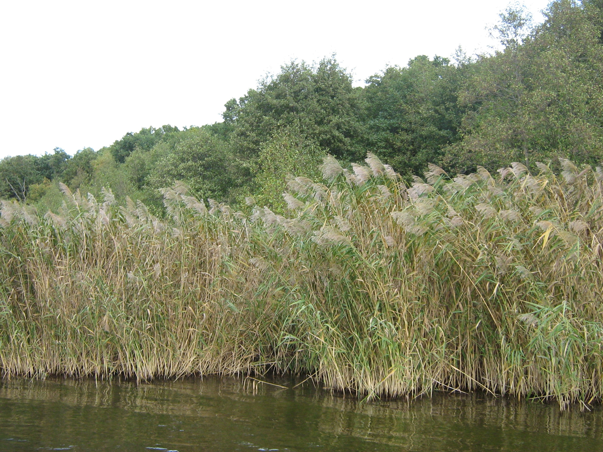
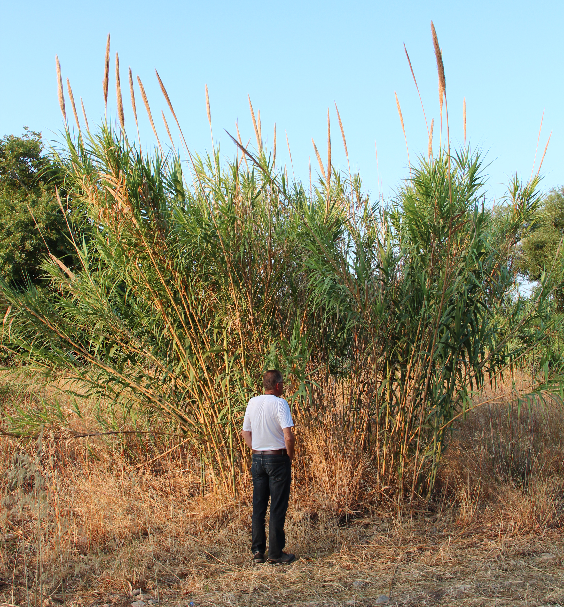
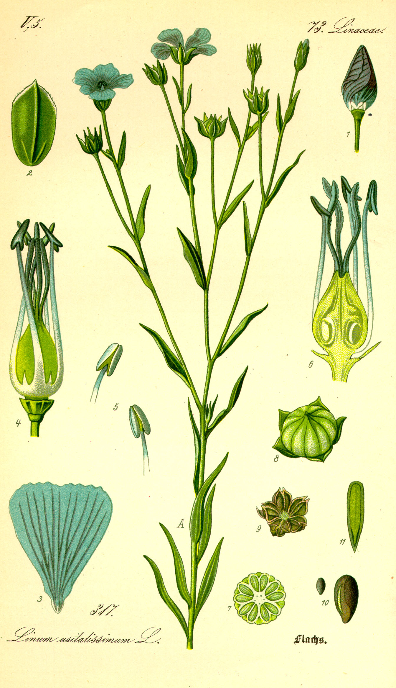
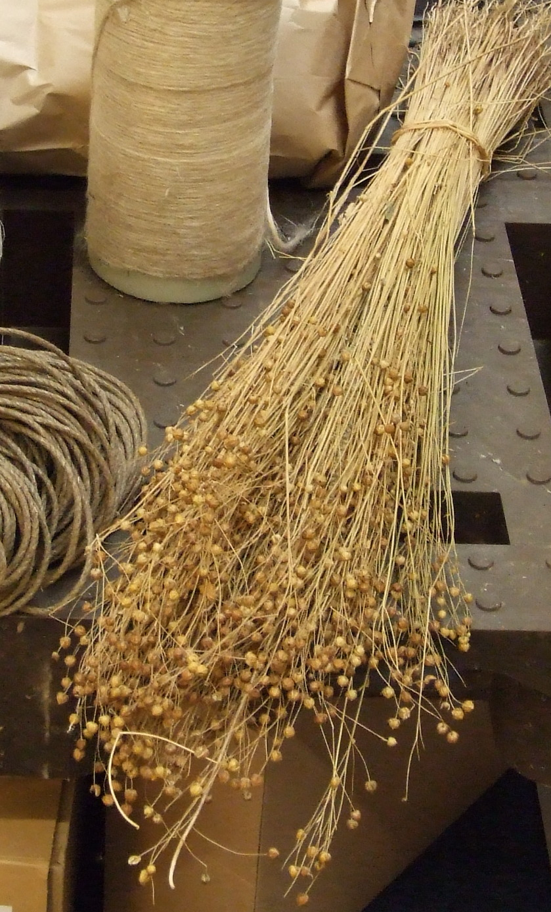

# Plants and Trees in the Bible

## License Information

Plants and Trees in the Bible © United Bible Societies, 2025. Adapted from: <cite>Each According to its Kind: Plants and Trees in the Bible</cite>, by Robert Koops © 2012 United Bible Societies. This work is licensed under Creative Commons Attribution-ShareAlike 4.0 International (<a href="https://creativecommons.org/licenses/by-sa/4.0/">https://creativecommons.org/licenses/by-sa/4.0/</a>).

--------------------------------

## 标题：用于纺织和建筑的植物 (id: FLORA:5.1)

5\.1 标题：用于纺织和建筑的植物
==================

在讨论这部分内容之前，我们需要先澄清一些一般性的表达。有些人认为，草就是在耕种前必须从田里除掉的一些绿色植物，或是长在房子周围、需要定期修剪的东西。但是，植物学家将草划作一个极大的科（禾本科；学名*Poaceae* ），包含9,000多个物种，分成600个属。这个科涵盖世界各地主要的粮食作物（谷类）：大米、玉米、高粱、小麦、大麦、藜麦、黑麦等等；还包括重要的建筑材料竹子，以及用来制作篮子、床、乐器、纸张、椅子的芦苇和藤条。甚至甘蔗也是一种草。这些植物的茎都是中空的，叶子在茎节处长出，都生有保护叶子基部的叶鞘、某种类型的穗、由风授粉的无瓣小花，以及生长在植株基部而非顶端的剑形窄叶。

关于希伯来文中的统称和特定词汇可能产生的问题，我们可以在[GEN 1:11](https://ref.ly/Gen1:11); [GEN 1:12](https://ref.ly/Gen1:12) 看到一个很好的例子。从字面意思来看，上帝在第11节的开头说："地要长出（*tadshe’* ）芽（*deshe’* ），含种子的植物（*‘esev* ），以及结果子的果树……。"对于希伯来文*deshe’* 一词，学者仍有争论，不确定这个词是引出后面两个类别的统称，还是指"草、含种子的植物和果树"这三个类别中的第一类（详参[5\.1\.2 草 (grass)](#FLORA:5.1.2) 中的讨论和翻译）。

另一个希伯来文统称出现在[GEN 1:30](https://ref.ly/Gen1:30) ，那里提到上帝将*yereq ‘esev* （意为"绿色植物"）赐给动物作食物。有意思的是，[GEN 9:3](https://ref.ly/Gen9:3) 同样记载了*yereq ‘esev* 一词，但却是连同动物的肉一起赐给挪亚作食物的。

还有一个需要提及的希伯来文统称是*siach* 。这个词通常意为"抱怨"、"沉思"、"默想"或"喋喋不休"，但在一些地方是指"灌木丛"或"灌木"。在[GEN 2:5](https://ref.ly/Gen2:5); [GEN 21:15](https://ref.ly/Gen21:15); [JOB 30:4](https://ref.ly/Job30:4); [JOB 30:7](https://ref.ly/Job30:7) 中，*siach* 是后一种意思。

* **Associated Passages:** 创世记 1:11; 创世记 1:12; 创世记 1:30; 创世记 9:3; 创世记 2:5; 创世记 21:15; 约伯记 30:4; 约伯记 30:7

## 标题：香蒲（cattail [reed-mace]） (id: FLORA:5.1.1)

5\.1\.1 标题：香蒲（cattail \[reed\-mace]）
====================================

经文出处
----

Hebrew 来：סוּף (音译：suf)

[EXO 2:3](https://ref.ly/Exod2:3), [EXO 2:5](https://ref.ly/Exod2:5), [ISA 19:6](https://ref.ly/Isa19:6), [JON 2:6](https://ref.ly/Jonah2:6)

讨论
--

希伯来文*suf* 所指的香蒲可能不止一种，香蒲又名"猫尾草"、"水烛"和"蒲草"。以色列有两种香蒲：长苞香蒲（学名*Typha domingensis* ）和宽叶香蒲（学名*Typha latifolia* ；祖海里认为是*Typha australis* ）。这两种香蒲都喜欢生长在河边或溪边缓慢的水流中。祖海里（Zohary）推测，*suf* 可能是很多种水生植物的统称。[JON 2:6](https://ref.ly/Jonah2:6) （《和》2:5）提到*suf* ，中文译本多译为"海草"，可算是支持此论点的例子。在[ISA 19:6](https://ref.ly/Isa19:6) ，*suf* 与*qaneh* （"芦苇"）是一组成对的词，因此几乎可以肯定*suf* 就是香蒲，因为两者都生长在沼泽和缓流的小溪中。

有些解经家认为，耶稣被人戏弄时，放在他手里的"苇子"是一根香蒲草的秆（[MAT 27:29](https://ref.ly/Matt27:29) ）。还有些人则反对这个看法，认为香蒲花梗不会在一年中这么早的时候成熟。但是，这根香蒲草的秆也可能是前一年的。关于此争论，目前仍未有共识。

描述
--

香蒲草的高度可达3米（10英尺），柔软且毛茸茸的棕色果穗非常显眼，果穗最终裂成蓬松状，被风吹落，漂在水面上。这种植物的粗根会沿着浅水湖泊和溪流的底部匍匐蔓延，长长的叶子又直又尖。

特殊意义
----

香蒲草叶在圣经时期就用来制作篮子和垫子，现今依然如此。这种植物的粗根、花粉和嫩茎都可食用。《出埃及记》中的香蒲（芦苇）众所周知，摩西的母亲正是把他藏在漂浮的小箱子里面，然后把箱子搁在了香蒲丛中。

翻译
--

香蒲的大部分品种分布在欧洲和北美洲，叶子用来编制垫子和椅座。印度有一种香蒲属（学名*Typha* ）植物叫做象蒲（学名*Typha elephantina* ），人们用它来造纸和制作装饰品。生活在河流附近的翻译者可能有其他类似芦苇的植物名称用作译词，然而需要留意，圣经共提到过四种类似芦苇的植物（另参[5\.1\.3 纸莎草、蒲草 (papyrus)](#FLORA:5.1.3) 、[5\.1\.4 芦苇（普通芦苇、芦竹）（reed \[common reed, giant reed]）](#FLORA:5.1.4) 和[5\.1\.5 灯心草（蒲草、莎草）（rush \[bulrush, sedge]）](#FLORA:5.1.5) ）。在[EXO 2:3](https://ref.ly/Exod2:3); [EXO 2:5](https://ref.ly/Exod2:5) ，许多英文译本都使用了统称"reeds"（"芦苇"；RSV (Revised Standard Version (1952)) 、NRSV (New Revised Standard Version (1989)) 、NIV (New International Version (1984)) 、LB (Living Bible (1971)) 、REB (Revised English Bible (1989)) 、NJB (New Jerusalem Bible (1985)) 、NJPSV (New Jewish Publication Society Version) ）。GW (God's Word Translation) 译作"papyrus plants"（"纸莎草"），但是植物学家认为，纸莎草更适合作为希伯来文*gome’* 的译词。在不熟悉水边植物的地方，可以译成"很高的草"（"tall grass"；GNB (Good News Bible) 、CEV (Contemporary English Version) ）或"很高的草秆"（"tall stalks of grass"；NCV (New Century Version) ）等一般性的表述。对于《出埃及记》和《以赛亚书》中的*suf* ，主要译法有：

1\. 使用当地生长在溪流或河水中的一种草；

2\. 使用"草"的统称；

3\. 使用描述性短语，如"很高的草"。

希伯来文*suf* 在[JON 2:6](https://ref.ly/Jonah2:6) （《和》2:5）中的含义不同。该节经文所记的植物生长在水里，但没有根，或者扎根在浅海的海底。因此，英文译本通常译成"seaweed"（"海草"；GNB (Good News Bible) 、CEV (Contemporary English Version) 、NLT (New Living Translation) 、GW (God's Word Translation) 、REB (Revised English Bible (1989)) ），这是一种叶子长长的、似草的植物，通常不固着在海床上。

如果需要音译*suf* ，可以考虑音译以下主要语言的词语：阿拉伯文*bardi* 或*but* 或*dadi* 或*tifa* 、法文*jonc* 或*marset* 、葡萄牙文*murao* 或*tabua* 、西班牙文*aseña* 或*enea* 或*espadaina* 或*españada* 或*junco* 或*macio* 或*totora* 或*tule espidilla* 。

希伯来文*yam suf* （字面意为"芦苇海"）在《七十士译本》和许多其他译本中被译成"红海"，这种译法有些不准确。除非目标语言文化中的"红海"翻译传统根深蒂固，否则应依照《〈出埃及记〉手册》（*A Handbook on Exodus* ）的建议，按照希伯来文本直译成"芦苇海"，或采用现代的对等词"苏伊士湾"（"Gulf of Suez"；如GNB (Good News Bible) ）。如果使用"红海"，则应在脚注里注明希伯来文本的字面意思是"芦苇海"。

* **Associated Passages:** 出埃及记 2:3; 出埃及记 2:5; 以赛亚书 19:6; 约拿书 2:6; 马太福音 27:29

## 标题：草（grass） (id: FLORA:5.1.2)

5\.1\.2 标题：草（grass）
===================

经文出处
----

Hebrew 来：אָחוּ (音译：’achu)

[GEN 41:2](https://ref.ly/Gen41:2), [GEN 41:18](https://ref.ly/Gen41:18), [JOB 8:11](https://ref.ly/Job8:11)

Hebrew 来：דשׁא (音译：dasha’（动词）)

[GEN 1:11](https://ref.ly/Gen1:11), [JOL 2:22](https://ref.ly/Joel2:22)

Hebrew 来：דֶּשֶׁא (音译：deshe’)

[GEN 1:11](https://ref.ly/Gen1:11), [GEN 1:12](https://ref.ly/Gen1:12), [DEU 32:2](https://ref.ly/Deut32:2), [2SA 23:4](https://ref.ly/2Sam23:4), [2KI 19:26](https://ref.ly/2Kgs19:26), [JOB 6:5](https://ref.ly/Job6:5), [JOB 38:27](https://ref.ly/Job38:27), [PSA 23:2](https://ref.ly/Ps23:2), [PSA 37:2](https://ref.ly/Ps37:2), [PRO 27:25](https://ref.ly/Prov27:25), [ISA 15:6](https://ref.ly/Isa15:6), [ISA 37:27](https://ref.ly/Isa37:27), [ISA 66:14](https://ref.ly/Isa66:14), [JER 14:5](https://ref.ly/Jer14:5)

Hebrew 来：דֶּתֶא (音译：dethe’)

[DAN 4:12](https://ref.ly/Dan4:12), [DAN 4:20](https://ref.ly/Dan4:20)

Hebrew 来：חָצִיר (音译：chatsir)

[1KI 18:5](https://ref.ly/1Kgs18:5), [2KI 19:26](https://ref.ly/2Kgs19:26), [JOB 8:12](https://ref.ly/Job8:12), [JOB 40:15](https://ref.ly/Job40:15), [PSA 37:2](https://ref.ly/Ps37:2), [PSA 90:5](https://ref.ly/Ps90:5), [PSA 103:15](https://ref.ly/Ps103:15), [PSA 104:14](https://ref.ly/Ps104:14), [PSA 129:6](https://ref.ly/Ps129:6), [PSA 147:8](https://ref.ly/Ps147:8), [PRO 27:25](https://ref.ly/Prov27:25), [ISA 15:6](https://ref.ly/Isa15:6), [ISA 34:13](https://ref.ly/Isa34:13), [ISA 35:7](https://ref.ly/Isa35:7), [ISA 37:27](https://ref.ly/Isa37:27), [ISA 40:6](https://ref.ly/Isa40:6), [ISA 40:7](https://ref.ly/Isa40:7), [ISA 40:7](https://ref.ly/Isa40:7), [ISA 40:8](https://ref.ly/Isa40:8), [ISA 44:4](https://ref.ly/Isa44:4), [ISA 51:12](https://ref.ly/Isa51:12)

Hebrew 来：חֲשַׁשׁ (音译：chashash)

[ISA 5:24](https://ref.ly/Isa5:24), [ISA 33:11](https://ref.ly/Isa33:11)

Hebrew 来：יֶרֶק (音译：yereq)

[GEN 1:30](https://ref.ly/Gen1:30), [GEN 9:3](https://ref.ly/Gen9:3), [EXO 10:15](https://ref.ly/Exod10:15), [NUM 22:4](https://ref.ly/Num22:4), [2KI 19:26](https://ref.ly/2Kgs19:26), [PSA 37:2](https://ref.ly/Ps37:2), [ISA 15:6](https://ref.ly/Isa15:6), [ISA 37:27](https://ref.ly/Isa37:27)

Hebrew 来：מִרְעֶה (音译：mir‘eh)

[GEN 47:4](https://ref.ly/Gen47:4), [1CH 4:39](https://ref.ly/1Chr4:39), [1CH 4:40](https://ref.ly/1Chr4:40), [1CH 4:41](https://ref.ly/1Chr4:41), [JOB 39:8](https://ref.ly/Job39:8), [ISA 32:14](https://ref.ly/Isa32:14), [LAM 1:6](https://ref.ly/Lam1:6), [EZK 34:14](https://ref.ly/Ezek34:14), [EZK 34:14](https://ref.ly/Ezek34:14), [EZK 34:18](https://ref.ly/Ezek34:18), [EZK 34:18](https://ref.ly/Ezek34:18), [JOL 1:18](https://ref.ly/Joel1:18), [NAM 2:12](https://ref.ly/Nah2:12)

Hebrew 来：עֲשַׂב (音译：‘asav)

[DAN 4:12](https://ref.ly/Dan4:12), [DAN 4:22](https://ref.ly/Dan4:22), [DAN 4:29](https://ref.ly/Dan4:29), [DAN 4:30](https://ref.ly/Dan4:30), [DAN 5:21](https://ref.ly/Dan5:21)

Hebrew 来：עֵשֶׂב (音译：‘esev)

[GEN 1:11](https://ref.ly/Gen1:11), [GEN 1:12](https://ref.ly/Gen1:12), [GEN 1:29](https://ref.ly/Gen1:29), [GEN 1:30](https://ref.ly/Gen1:30), [GEN 2:5](https://ref.ly/Gen2:5), [GEN 3:18](https://ref.ly/Gen3:18), [GEN 9:3](https://ref.ly/Gen9:3), [EXO 9:22](https://ref.ly/Exod9:22), [EXO 9:25](https://ref.ly/Exod9:25), [EXO 10:12](https://ref.ly/Exod10:12), [EXO 10:15](https://ref.ly/Exod10:15), [EXO 10:15](https://ref.ly/Exod10:15), [DEU 11:15](https://ref.ly/Deut11:15), [DEU 29:22](https://ref.ly/Deut29:22), [DEU 32:2](https://ref.ly/Deut32:2), [2KI 19:26](https://ref.ly/2Kgs19:26), [JOB 5:25](https://ref.ly/Job5:25), [PSA 72:16](https://ref.ly/Ps72:16), [PSA 92:8](https://ref.ly/Ps92:8), [PSA 102:5](https://ref.ly/Ps102:5), [PSA 102:12](https://ref.ly/Ps102:12), [PSA 104:14](https://ref.ly/Ps104:14), [PSA 105:35](https://ref.ly/Ps105:35), [PSA 106:20](https://ref.ly/Ps106:20), [PRO 19:12](https://ref.ly/Prov19:12), [PRO 27:25](https://ref.ly/Prov27:25), [ISA 37:27](https://ref.ly/Isa37:27), [ISA 42:15](https://ref.ly/Isa42:15), [JER 12:4](https://ref.ly/Jer12:4), [JER 14:6](https://ref.ly/Jer14:6), [AMO 7:2](https://ref.ly/Amos7:2), [MIC 5:6](https://ref.ly/Mic5:6), [ZEC 10:1](https://ref.ly/Zech10:1)

Greek 希：βοτάνη (音译：botanē)

[HEB 6:7](https://ref.ly/Phlm6:7), [WIS 16:12](https://ref.ly/EsthGr16:12)

Greek 希：λάχανον (音译：lachanon)

[MAT 13:32](https://ref.ly/Matt13:32), [MRK 4:32](https://ref.ly/Matt4:32), [LUK 11:42](https://ref.ly/Mark11:42), [ROM 14:2](https://ref.ly/Acts14:2)

Greek 希：χλόη (音译：chloē)

[SIR 40:22](https://ref.ly/Wis40:22), [SIR 43:21](https://ref.ly/Wis43:21)

Greek 希：χόρτος (音译：chortos)

[MAT 6:30](https://ref.ly/Matt6:30), [MAT 13:26](https://ref.ly/Matt13:26), [MAT 14:19](https://ref.ly/Matt14:19), [MRK 4:28](https://ref.ly/Matt4:28), [MRK 6:39](https://ref.ly/Matt6:39), [LUK 12:28](https://ref.ly/Mark12:28), [JHN 6:10](https://ref.ly/Luke6:10), [1CO 3:12](https://ref.ly/Rom3:12), [JAS 1:10](https://ref.ly/Heb1:10), [JAS 1:11](https://ref.ly/Heb1:11), [1PE 1:24](https://ref.ly/Jas1:24), [1PE 1:24](https://ref.ly/Jas1:24), [1PE 1:24](https://ref.ly/Jas1:24), [REV 8:7](https://ref.ly/Jude8:7), [REV 9:4](https://ref.ly/Jude9:4), [SIR 40:16](https://ref.ly/Wis40:16)

Latin 拉：faenum

Latin 拉：faenum

[2ES 9:27](https://ref.ly/1Esd9:27), [2ES 15:42](https://ref.ly/1Esd15:42)

讨论
--

圣地有450多种草，因此上面的希伯来文、亚兰文、希腊文和拉丁文词语不大可能是指特定的物种。这些词语可能是统称，在不同的时间或地点，指称各种不同种类的草。

祖海里认为，[GEN 41:2](https://ref.ly/Gen41:2); [GEN 41:18](https://ref.ly/Gen41:18) 中的希伯来文*’achu* （"芦苇"）指的不是一种草，而是"用于放牧的沼泽湿地"（第127页；参KJV (King James Version (1611)) "meadow"，"草地"）。然而，[JOB 8:11](https://ref.ly/Job8:11) 似乎明确地提到某种植物（与蒲草平行），指出*’achu* 需要在有水的地方生长。

希伯来文*chashash* 在[ISA 5:24](https://ref.ly/Isa5:24) 中是指干草，与碎秸平行，意指必被烧灭的恶人。在[ISA 33:11](https://ref.ly/Isa33:11) ，恶人徒劳无益的计谋被比作*chashash* ，同样与碎秸平行。

希伯来文*yereq* （"绿色"）在旧约出现过8次，都是指植被。其中大部分出现在短语中，如*yereq ‘esev* （在[GEN 1:30](https://ref.ly/Gen1:30); [GEN 9:3](https://ref.ly/Gen9:3) 译作"绿色植物"、"绿色的菜蔬"），或*yereq deshe’* （在[2KI 19:26](https://ref.ly/2Kgs19:26); [PSA 37:2](https://ref.ly/Ps37:2); [ISA 37:27](https://ref.ly/Isa37:27) 译作"嫩草"或"青菜"）。然而，有3处经文的*yereq* 是单独使用的，在[EXO 10:15](https://ref.ly/Exod10:15); [NUM 22:4](https://ref.ly/Num22:4); [ISA 15:6](https://ref.ly/Isa15:6) 中分别译作"青草"、"青绿之物"或"绿的东西"。

希伯来文*deshe’* 有时被译为"草"。这个词通常出现在修辞语境中，常与*chatsir* 、*yereq* 或*‘esev* 平行。

希伯来文*‘esev* 在圣经中出现33次。RSV (Revised Standard Version (1952)) 有12次将其译作"plant"（"植物"），12次译作"grass"（"草"），5次译作"herb"（"草木"）或"herbage"（"牧草"），4次译作"vegetation"（"菜蔬"）。因为有些语言可能不存在像"植物"这样的统称，所以在这些经文中，很多时候可以根据语境来译成"草"或"生长的东西"等。

表示"牧场"的词语有很多，牧场就是绵羊、山羊和牛吃草的地方。希伯来文至少有5个表示"牧场"的词语：除了上文所列的*mir‘eh* ，还有*migrash* （114次，大多出现在《约书亚记》和《历代志上》）、*dover* （[ISA 5:17](https://ref.ly/Isa5:17) ；[MIC 2:12](https://ref.ly/Mic2:12) ）、*kar* （[PSA 37:20](https://ref.ly/Ps37:20) ，[PSA 65:14](https://ref.ly/Ps65:14) ［《和》65:13］；[ISA 30:23](https://ref.ly/Isa30:23) ）和*nawah* （11次）。

除此之外，还有译作"稻草"的希伯来文*teven* ，指用来做砖和铺在动物身下的干草。例如，这个词出现在[GEN 24:25](https://ref.ly/Gen24:25); [GEN 24:32](https://ref.ly/Gen24:32) ，但翻译者需要注意的是，这里的"稻草"不是给骆驼吃的，而是放在地上吸收尿液的。

有两个希伯来文词语常被译为"饲料"（即动物的食物）或"草料"，即*belil* （[JOB 6:5](https://ref.ly/Job6:5) ，[JOB 24:6](https://ref.ly/Job24:6) ；[ISA 30:24](https://ref.ly/Isa30:24) ）和*mispo’* （[GEN 24:25](https://ref.ly/Gen24:25) ，[GEN 24:32](https://ref.ly/Gen24:32) ，[GEN 42:27](https://ref.ly/Gen42:27) ，[GEN 43:24](https://ref.ly/Gen43:24) ；[JDG 19:19](https://ref.ly/Judg19:19) ）。这两个词可能是指某种草类。

希腊文*chortos* 在新约出现了15次，RSV (Revised Standard Version (1952)) 通常将其译作"grass"（"草"）。

希腊文*lachanon* 在新约出现了4次。这是一个花园植物的统称，可根据上下文来翻译。[MAT 13:32](https://ref.ly/Matt13:32) 和[MRK 4:32](https://ref.ly/Matt4:32) 提到，芥菜种长起来比园中所有的*lachanon* （"灌木"）都要大。[LUK 11:42](https://ref.ly/Mark11:42) 记载，法利赛人将薄荷、芸香和各样*lachanon* （"香草"）献上十分之一。[ROM 14:2](https://ref.ly/Acts14:2) 说，信心软弱的弟兄只吃*lachanon* （"蔬菜"）。

希腊文*botanē* 也是一个统称，在[HEB 6:7](https://ref.ly/Phlm6:7) 译作"植被"（"vegetation"；RSV (Revised Standard Version (1952)) ），中文译本多译为"蔬菜"。

在次经中，希腊文*chloē* 意为"嫩绿的禾苗"（[SIR 40:22](https://ref.ly/Wis40:22) ，[SIR 43:21](https://ref.ly/Wis43:21) ）。《七十士译本》使用这个词来翻译希伯来文*deshe’* （[2SA 23:4](https://ref.ly/2Sam23:4) ；[2KI 19:26](https://ref.ly/2Kgs19:26) ；[JOB 38:27](https://ref.ly/Job38:27) ；[PSA 23:2](https://ref.ly/Ps23:2) ，[PSA 37:2](https://ref.ly/Ps37:2) ）。

描述
--

对大多数翻译者来说，草极其常见，因此不需要特别加以描述。但对于生活在北极圈内，或者不宜人居的荒漠地带的翻译者来说，翻译圣地的草可能会不太容易。其中一个常见的问题是，当地语言有太多特定词语但没有"草"的统称。在尼日尔（Tamasheq），曾有一个翻译团队因为[MRK 6:39](https://ref.ly/Matt6:39) 中的"坐在青草地上"一语而十分困扰，因为他们唯一知道的一种草只出现在短暂的雨季，没有任何人会愿意坐在上面。草可以描述为：高不到1米（3英尺）的植物，叶子狭窄、青绿、挺直，通常成束或成簇地生长。

特殊意义
----

在[PSA 90:5](https://ref.ly/Ps90:5) 和[ISA 40:6](https://ref.ly/Isa40:6); [ISA 40:7](https://ref.ly/Isa40:7) 中，作者用草作为比喻，强调人生命的短暂。在[MAT 6:30](https://ref.ly/Matt6:30) ，耶稣将"野地里的草"作为没有太大价值的东西，来与人进行比较。

翻译
--

在一些非洲语言中，"草"的译词实际上指的是"未开发的植物"，与作为食物、入药和制作器具的植物相对。希伯来文也可能存在这样的区别，只是目前我们还未发现。在翻译之前，需要先研究当地人对植物的分类；在了解当地的植物分类之后，翻译者就可以决定在多大程度上加以使用，这取决于对整体翻译的通盘考虑。

如果可能，希伯来文*deshe’* 的译词应含有植物新长出来或发出新芽的意思。由于*deshe’* 常出现在修辞语境中，并且常与其他指草的词语平行，所以翻译者需要找出两三个用来指草以及类似草的植物的词语。

[GEN 1:11](https://ref.ly/Gen1:11) a："地要长出植物（*deshe’* ）。"由于这节经文与第20节平行，故本手册赞同大多数学者的观点，即*deshe’* 是一个统称，引出后面的两个类别（参本章的介绍部分）。翻译者需要使用一个涵盖最广的植物统称来翻译这里的*deshe’* 。如果没有合适的统称，可以使用"有叶子的东西"或"发芽的东西"这样的短语。万不得已的情况下，可以不译这个统称，直接翻译后面具体的词语。

[GEN 1:11](https://ref.ly/Gen1:11) b："结种子的植物。"我们很难知道这里的希伯来文短语（*‘esev mazri‘a zera‘* ）指的是像稻子这样"果实"即是种子的植物，还是任何一种有种子的植物，包括西红柿、辣椒、葡萄、茄子等等。关于这节经文，英文译本的译文含糊不清，例如，GNB (Good News Bible) 译作"those that bear grain"（"结出谷物的植物"），CEV (Contemporary English Version) 译作"grain"（"谷物"），NCV (New Century Version) 译作"some to make grain for seeds"（"一些结子粒为种子的植物"），NIV (New International Version (1984)) 译作"seed\-bearing plants"（"含种子的植物"；NJB (New Jerusalem Bible (1985)) 、NJPSV (New Jewish Publication Society Version) 同；NLT (New Living Translation) 、GW (God's Word Translation) 相似），REB (Revised English Bible (1989)) 译作"plants that bear seed"（"带种子的植物"）。如果译成grain（"谷物"，相当于英式英语中的corn），可能太狭义了。无论怎样，这类植物都与接下来"结果子的植物"相对，如苹果和芒果。

[GEN 1:11](https://ref.ly/Gen1:11) c："会结果子且果子里有种子的果树。"这节经文需要探讨的问题是，希伯来文短语*’asher zar‘o vo* （意为"果子里有种子"）是像"鸟是空中的鸟"这种多余的表述，还是实际增添了新的内容。GNB (Good News Bible) 和CEV (Contemporary English Version) 将其理解为多余的表述（GNB (Good News Bible) 译作"those that bear fruit"，"结果子的树木"；CEV (Contemporary English Version) 译作"fruit trees"，"果树"）。其他译本似乎认为有必要保留这个短语（例如，NCV (New Century Version) 译作"others to make fruits with seeds in them"，"结果子且果子里有种子的其他植物"；NJB (New Jerusalem Bible (1985)) 译作"fruit trees……bearing fruit with their seed inside"，"结果子且果子里有种子的……果树"；NJPSV (New Jewish Publication Society Version) 类似）。

[GEN 1:11](https://ref.ly/Gen1:11) d："各从其类"。GW (God's Word Translation) 译作"each according to its own type"（"各从其种类"）。英文译本对这个希伯来文短语主要有三种解释：

1\. 有些译本认为这个短语是在强调植物类型的多样性；例如，GNB (Good News Bible) 和CEV (Contemporary English Version) 译作"all kinds of plants"（"所有种类的植物"；NAB (New American Bible (1970)) 、NJPSV (New Jewish Publication Society Version) 类似）。

2\. 有些译本的重点在于植物的分门别类；例如，NIV (New International Version (1984)) 译作"according to their various kinds"（"根据它们不同的种类"）、NJB (New Jerusalem Bible (1985)) 译作"each corresponding to its own species"（"各自对应自己的物种"）。

3\. 有些译本侧重植物的繁殖；例如，NCV (New Century Version) 译作"Every seed will produce more of its own kind of plant"（"每个种子都将长成同类的植物"），NLT (New Living Translation) 译作"The seeds will then produce the kinds of plants and trees from which they came"（"种子将长成自身所出的植物和树木种类"）。比较REB (Revised English Bible (1989)) 的译文："each with its own kind of seed"（"各自含有自身种类的种子"）。

在[GEN 1:11](https://ref.ly/Gen1:11) ，作者表达的一个主题似乎是创造的秩序——类别和子类别。这个论点支持了NIV (New International Version (1984)) 和NJB (New Jerusalem Bible (1985)) 的译文。但是，文中反复使用"种子"一词，表明作者也对遗传法则的规律性感兴趣。与这个主题相呼应，《申命记》所述的律法严格禁止在田里混种不同种类的植物（在有些语言中是"种子"！），也禁止穿混合布料做成的衣服。关于希伯来人对这一点的关切，基督自己也作了补充："荆棘上岂能摘葡萄呢？蒺藜里岂能摘无花果呢？"（[MAT 7:16](https://ref.ly/Matt7:16) ）。以下是[GEN 1:11](https://ref.ly/Gen1:11) 的两个翻译范本：

1\. 地要长满植物。要有结种子的植物（或一个当地亚种），以及结果子的树木（或一个当地亚种）。每种植物结不同种类的种子。

2\. 地要长出各样植物，遍满地面。要有草、灌木和树木（或结种子的植物和结果子的树木；或谷物、蔬菜和果树）。每种植物要繁衍自身。

翻译者应该先研究自己语言的植物分类系统，然后仔细考虑这节经文的两种基本结构，确定哪一种更符合自己的语言。NLT (New Living Translation) 和一些注释书所作的三重区分很可能更符合当地的植物分类系统。若是这样，不妨采纳。

翻译者在研究了当地的植物分类系统之后，必须决定是要采用该分类系统，还是尝试表现希伯来人的分类。如果没有中间程度的统称，翻译者可以使用"大米等植物"和"芒果等植物"之类的短语，不过这可能会让人以为，经文最初的读者知道大米或芒果等作物。

希伯来人的植物分类方法更多是从类型学的角度，而没有严格的逻辑性或科学性，所以我们看到了一些重叠的分类或是较为模棱两可的分类。也许，作者最想要表达的是上帝造物的有序。

[2KI 19:26](https://ref.ly/2Kgs19:26) ：这节经文的后两行是"如房顶上的草（*chatsir* ），又如未长成而枯干的禾稼"（同[ISA 37:27](https://ref.ly/Isa37:27) ；[PSA 129:6](https://ref.ly/Ps129:6) 类似）。这两行诗描绘的景象是：一座平顶房屋的屋顶落上了一些尘土，形成一个利于草籽发芽的环境，但土层很浅，由于缺乏水分和土壤，草注定很快就要枯萎死亡。然而，最后一行有一个文本问题。HOTTP (Hebrew Old Testament Text Project (UBS)) 支持MT (Masoretic Text) 的文本，即"未长成就枯萎／烤焦"（*shedefah lifne qamah* ）。HOTTP (Hebrew Old Testament Text Project (UBS)) 把MT (Masoretic Text) 的可靠性定为C级，不支持"被东风吹枯萎／烤焦"（*shedefah lifne qadim* ）这一猜测。GNB (Good News Bible) 和REB (Revised English Bible (1989)) 采纳了这个猜测。HOTTP (Hebrew Old Testament Text Project (UBS)) 推断：抄经者不具备充分的希伯来文知识，不理解这一行的意思，因而猜测其意可能是"被东风烤焦"，这种说法也是非常符合逻辑的。但各译本基本上已有共识，一致遵循MT (Masoretic Text) 的文本（如RSV (Revised Standard Version (1952)) 、NIV (New International Version (1984)) 、LB (Living Bible (1971)) 、GW (God's Word Translation) ）。NJPSV (New Jewish Publication Society Version) 也参照了MT (Masoretic Text) ，但却将最后一行译作"blasted before the standing grain"（"在长成挺立的植株之前就枯萎"），这在上下文中完全说不通。

* **Associated Passages:** 创世记 41:2; 创世记 41:18; 约伯记 8:11; 创世记 1:11; 约珥书 2:22; 创世记 1:12; 申命记 32:2; 撒母耳记下 23:4; 列王纪下 19:26; 约伯记 6:5; 约伯记 38:27; 诗篇 23:2; 诗篇 37:2; 箴言 27:25; 以赛亚书 15:6; 以赛亚书 37:27; 以赛亚书 66:14; 耶利米书 14:5; 但以理书 4:12; 但以理书 4:20; 列王纪上 18:5; 约伯记 8:12; 约伯记 40:15; 诗篇 90:5; 诗篇 103:15; 诗篇 104:14; 诗篇 129:6; 诗篇 147:8; 以赛亚书 34:13; 以赛亚书 35:7; 以赛亚书 40:6; 以赛亚书 40:7; 以赛亚书 40:8; 以赛亚书 44:4; 以赛亚书 51:12; 以赛亚书 5:24; 以赛亚书 33:11; 创世记 1:30; 创世记 9:3; 出埃及记 10:15; 民数记 22:4; 创世记 47:4; 历代志上 4:39; 历代志上 4:40; 历代志上 4:41; 约伯记 39:8; 以赛亚书 32:14; 耶利米哀歌 1:6; 以西结书 34:14; 以西结书 34:18; 约珥书 1:18; 那鸿书 2:12; 但以理书 4:22; 但以理书 4:29; 但以理书 4:30; 但以理书 5:21; 创世记 1:29; 创世记 2:5; 创世记 3:18; 出埃及记 9:22; 出埃及记 9:25; 出埃及记 10:12; 申命记 11:15; 申命记 29:22; 约伯记 5:25; 诗篇 72:16; 诗篇 92:8; 诗篇 102:5; 诗篇 102:12; 诗篇 105:35; 诗篇 106:20; 箴言 19:12; 以赛亚书 42:15; 耶利米书 12:4; 耶利米书 14:6; 阿摩司书 7:2; 弥迦书 5:6; 撒迦利亚书 10:1; 希伯来书 6:7; 智慧篇 16:12; 马太福音 13:32; 马可福音 4:32; 路加福音 11:42; 罗马书 14:2; 德训篇 40:22; 德训篇 43:21; 马太福音 6:30; 马太福音 13:26; 马太福音 14:19; 马可福音 4:28; 马可福音 6:39; 路加福音 12:28; 约翰福音 6:10; 哥林多前书 3:12; 雅各书 1:10; 雅各书 1:11; 彼得前书 1:24; 启示录 8:7; 启示录 9:4; 德训篇 40:16; 厄斯德拉下 9:27; 厄斯德拉下 15:42; 以赛亚书 5:17; 弥迦书 2:12; 诗篇 37:20; 诗篇 65:14; 以赛亚书 30:23; 创世记 24:25; 创世记 24:32; 约伯记 24:6; 以赛亚书 30:24; 创世记 42:27; 创世记 43:24; 士师记 19:19; 马太福音 7:16

## 标题：纸莎草、蒲草（papyrus） (id: FLORA:5.1.3)

5\.1\.3 标题：纸莎草、蒲草（papyrus）
==========================

经文出处
----

Hebrew 来：גֹּמֶא (音译：gome’)

[EXO 2:3](https://ref.ly/Exod2:3), [JOB 8:11](https://ref.ly/Job8:11), [ISA 18:2](https://ref.ly/Isa18:2), [ISA 35:7](https://ref.ly/Isa35:7)

Hebrew 来：אֵבֶה (音译：’eveh)

[JOB 9:26](https://ref.ly/Job9:26)

讨论
--

对于圣经中提及的各种芦苇究竟是什么品种，植物学界仍有相当大的争议，但根据词源学和实际情况，人们普遍认为希伯来文*gome’* 指的是纸莎草（又名蒲草；学名*Cyperus Papyrus* ）。至于希伯来文*’eveh* ，[JOB 9:26](https://ref.ly/Job9:26) 中的短语"*’eveh* 做的快船"暗示*’eveh* 指纸莎草，因为埃及除了有木船，还有纸莎草做的船。然而，在这节经文中，英文译本有"papyrus"（"纸莎草"；NIV (New International Version (1984)) ）和"reed"（"芦苇"；RSV (Revised Standard Version (1952)) 、REB (Revised English Bible (1989)) ）两种译法。

描述
--

纸莎草是一种很高的草，生有许多花茎，花茎高度可达6米（20英尺），直径达10厘米（4英寸）。茎顶端的穗分成数百个分支，像棕榈树顶一样伸展开来，每个分支都开小花。

特殊意义
----

纸莎草是古代近东用途最广的草。在埃及，人们用纸莎草制作箱子、垫子、绳子，最特别的是做纸张。当约基别试图解救幼子摩西脱离法老的残暴法令所害时，她或许想到了纸莎草造船的功能（[EXO 2:3](https://ref.ly/Exod2:3) ）。约伯的朋友比勒达以纸莎草是一种需要水的植物来抨击约伯，暗示他必定犯了罪（[JOB 8:11](https://ref.ly/Job8:11) ）。[ISA 18:2](https://ref.ly/Isa18:2) 提到"使者在水面上，坐蒲草船过海"，藉此象征埃及强大的政治力量。穷人还用纸莎草做桶、棚屋、凉鞋和衣服。然而，纸莎草通常不用来编篮子，这或许有些出人意料。与现今撒哈拉沙漠以南的非洲地区的制作方式相似，埃及人的篮子是以海枣树叶、纤维或劈开的叶片中脉为心，外面缠绕纤维（像吉他弦一样）制成的，呈盘绕结构。

翻译
--

世界上有超过600种莎草属（学名*Cyperus* ）植物，生长在热带和温带气候地区，但是很多都和纸莎草的外形不相像。例如，分布在西亚和非洲的油莎草隶于莎草属，块茎（又称*chufa* 或*Zulu nut* ）很可口。亚洲各地用来做垫子的可可草（续根草）和其他几种类型的草也隶于莎草属。纸莎草今天在埃及很少见，但在乌干达北部却生长得很繁茂，当地称之为*sudd* 。

希伯来文*gome’* 在经文中出现的语境大部分是修辞性的（[EXO 2:3](https://ref.ly/Exod2:3) 除外），因此翻译者可以用当地在修辞意义上对等的词语来替代。然而，如果原来的植物名称被替代，最好在脚注中注明原词，特别是在这个词语和某个特定地区有关联的经文里；例如，在[ISA 18:1](https://ref.ly/Isa18:1) ，蒲草船和"埃塞俄比亚"有关联。在[EXO 2:3](https://ref.ly/Exod2:3) ，摩西的母亲用的不是"蒲草"（"bulrushes"；RSV (Revised Standard Version (1952)) 、KJV (King James Version (1611)) ），而是纸莎草；用的不是"篮子"（"basket"；RSV (Revised Standard Version (1952)) ），而是"箱子"（"box"；希伯来文*tevah* ）。若有表示"箱子"的词，就应该使用该词。不然，可以使用"篮子"的统称，并用一种编制篮子的韧草来指明材料。以下是*gome’* 的几种译法：

1\. 采用当地的一种韧草作为译词；

2\. 使用描述性的短语，如"坚韧的草"；

3\. 使用"草"的统称；

4\. 在[EXO 2:3](https://ref.ly/Exod2:3) 中，把这种植物隐含在动词"编织"或名词"箱子／篮子"里；

5\. 使用"灯心草"（"rush"；REB (Revised English Bible (1989)) ）、"纸莎草"（"papyrus reeds"；LB (Living Bible (1971)) ）或"芦苇"（"reeds"；GNB (Good News Bible) ）为译词。

如果需要音译纸莎草，可以按照法文*jonc* 或葡萄牙文／西班牙文*papiro* 。

[ISA 35:7](https://ref.ly/Isa35:7) ：这节经文的最后两行是："野狗躺卧休息之处，必长出青草、芦苇和蒲草（*gome’* ）。"在这里，翻译者必须有一组表示"草"的词语，因为这两行平行诗句需要表现出一种递进：曾经的沙漠（野狗出没的地方）将变成沼泽，普通的草将变成水生的草。

* **Associated Passages:** 出埃及记 2:3; 约伯记 8:11; 以赛亚书 18:2; 以赛亚书 35:7; 约伯记 9:26; 以赛亚书 18:1

## 标题：芦苇（普通芦苇、芦竹）（reed [common reed, giant reed]） (id: FLORA:5.1.4)

5\.1\.4 标题：芦苇（普通芦苇、芦竹）（reed \[common reed, giant reed]）
=======================================================

经文出处
----

Hebrew 来：קָנֶה (音译：qaneh)

[1KI 14:15](https://ref.ly/1Kgs14:15), [2KI 18:21](https://ref.ly/2Kgs18:21), [JOB 40:21](https://ref.ly/Job40:21), [PSA 68:31](https://ref.ly/Ps68:31), [ISA 19:6](https://ref.ly/Isa19:6), [ISA 35:7](https://ref.ly/Isa35:7), [ISA 36:6](https://ref.ly/Isa36:6), [ISA 42:3](https://ref.ly/Isa42:3), [EZK 29:6](https://ref.ly/Ezek29:6), [EZK 40:3](https://ref.ly/Ezek40:3), [EZK 40:5](https://ref.ly/Ezek40:5), [EZK 40:5](https://ref.ly/Ezek40:5), [EZK 40:5](https://ref.ly/Ezek40:5), [EZK 40:6](https://ref.ly/Ezek40:6), [EZK 40:6](https://ref.ly/Ezek40:6), [EZK 40:7](https://ref.ly/Ezek40:7), [EZK 40:7](https://ref.ly/Ezek40:7), [EZK 40:7](https://ref.ly/Ezek40:7), [EZK 40:8](https://ref.ly/Ezek40:8), [EZK 41:8](https://ref.ly/Ezek41:8), [EZK 42:16](https://ref.ly/Ezek42:16), [EZK 42:16](https://ref.ly/Ezek42:16), [EZK 42:16](https://ref.ly/Ezek42:16), [EZK 42:17](https://ref.ly/Ezek42:17), [EZK 42:17](https://ref.ly/Ezek42:17), [EZK 42:18](https://ref.ly/Ezek42:18), [EZK 42:18](https://ref.ly/Ezek42:18), [EZK 42:19](https://ref.ly/Ezek42:19), [EZK 42:19](https://ref.ly/Ezek42:19)

Greek 希：καλάμη (音译：kalamē)

[1CO 3:12](https://ref.ly/Rom3:12), [WIS 3:7](https://ref.ly/EsthGr3:7)

Greek 希：κάλαμος (音译：kalamos)

[MAT 11:7](https://ref.ly/Matt11:7), [MAT 12:20](https://ref.ly/Matt12:20), [MAT 27:29](https://ref.ly/Matt27:29), [MAT 27:30](https://ref.ly/Matt27:30), [MAT 27:48](https://ref.ly/Matt27:48), [MRK 15:19](https://ref.ly/Matt15:19), [MRK 15:36](https://ref.ly/Matt15:36), [LUK 7:24](https://ref.ly/Mark7:24), [3JN 1:13](https://ref.ly/2John1:13), [REV 11:1](https://ref.ly/Jude11:1), [REV 21:15](https://ref.ly/Jude21:15), [REV 21:16](https://ref.ly/Jude21:16), [3MA 2:22](https://ref.ly/2Macc2:22)

讨论
--

以色列的芦苇分为两大类，即普通芦苇（学名*Phragmites australis* ）和芦竹（学名*Arundo donax* ），然而在某个给定的圣经语境中，很难分辨作者指的是哪一种芦苇。

英文"cane"（"杖、藤、中空的茎"）源自希伯来文*qaneh* 。在众多指称芦苇和灯心草的希伯来文词语中，*qaneh* 的含义最广。就像英文"reed"（"芦苇"）一样，*qaneh* 可以具体地指某种芦苇，也可以是几种水生植物的统称。这个词也用来指法老梦中的麦秆（[GEN 41:5](https://ref.ly/Gen41:5) ，[GEN 41:22](https://ref.ly/Gen41:22) ）、帐幕中金灯台的干和枝子（[EXO 25:31](https://ref.ly/Exod25:31); [EXO 25:32](https://ref.ly/Exod25:32); [EXO 25:33](https://ref.ly/Exod25:33) ，[EXO 25:35](https://ref.ly/Exod25:35); [EXO 25:36](https://ref.ly/Exod25:36) ，[EXO 37:17](https://ref.ly/Exod37:17); [EXO 37:18](https://ref.ly/Exod37:18); [EXO 37:19](https://ref.ly/Exod37:19) ，[EXO 37:21](https://ref.ly/Exod37:21); [EXO 37:22](https://ref.ly/Exod37:22) ）、天平的杆（[ISA 46:6](https://ref.ly/Isa46:6) ）、人的上臂（[JOB 31:22](https://ref.ly/Job31:22) ）、丈量竿（[EZK 40:3](https://ref.ly/Ezek40:3) ，[EZK 40:5](https://ref.ly/Ezek40:5); [EZK 40:6](https://ref.ly/Ezek40:6); [EZK 40:7](https://ref.ly/Ezek40:7); [EZK 40:8](https://ref.ly/Ezek40:8) ，[EZK 40:5](https://ref.ly/Ezek40:5) ，[EZK 42:16](https://ref.ly/Ezek42:16); [EZK 42:17](https://ref.ly/Ezek42:17); [EZK 42:18](https://ref.ly/Ezek42:18); [EZK 42:19](https://ref.ly/Ezek42:19) ），以及香菖蒲（[EXO 30:23](https://ref.ly/Exod30:23) ；[SNG 4:14](https://ref.ly/Song4:14) ；[ISA 43:24](https://ref.ly/Isa43:24) ；[JER 6:20](https://ref.ly/Jer6:20) ；[EZK 27:19](https://ref.ly/Ezek27:19) ；参[4\.1\.2 香菖蒲（水菖蒲、香甘蔗、甜甘蔗、姜草）(calamus \[sweet flag, aromatic cane, sweet cane, ginger grass])](#FLORA:4.1.2) ）。

希腊文*kalamos* 也用来指丈量的杖（[REV 11:1](https://ref.ly/Jude11:1) ，[REV 21:15](https://ref.ly/Jude21:15); [REV 21:16](https://ref.ly/Jude21:16) ）和笔（[3JN 1:13](https://ref.ly/2John1:13) ；[3MA 4:20](https://ref.ly/2Macc4:20) ）。关于芦苇笔的讨论，参WTH ，[1\.7\.3 笔 (pen)](#REALIA:1.7.3) 。

描述
--

普通芦苇是一种很高的草，叶子硬而尖，羽毛状花序的高度可达2米（7英尺）以上。这种芦苇生长在湖泊和溪流中，根在水底匍匐，并生出新叶和茎。

芦竹的外形与普通芦苇相似，但不是生长在水中，而是长在河岸上。中空的茎秆看起来像竹子，其上巨大的羽毛状花序可达5米（17英尺）高。

特殊意义
----

这两种芦苇都可用来制作篮子、垫子、笛子、笔、箭和屋顶。[ISA 42:3](https://ref.ly/Isa42:3) 说，弥赛亚将温和地对待软弱的人，"压伤的芦苇，他不折断"，这个温柔的形象与当时典型的铁腕暴君形成对比。在[2KI 18:21](https://ref.ly/2Kgs18:21) 、[ISA 36:6](https://ref.ly/Isa36:6) 和[EZK 29:6](https://ref.ly/Ezek29:6) ，法老被比作一根靠不住的芦苇杖。在[1KI 14:15](https://ref.ly/1Kgs14:15) ，以色列被比作水中摇动的芦苇。

翻译
--

地中海地区的普通芦苇在欧洲、印度、日本和北美都有近缘植物。一般认为，普通芦苇是芦苇属（学名*Phragmites* ）的唯一一种植物，但也有一些植物学家将其分为3个物种。普通芦苇对自然资源的保护非常重要，因为它为许多种类的动物和鸟类提供了栖息地。在北美，适应环境能力较弱的当地品种正在被源自欧洲的更强壮的品种所取代，这些外来品种也正威胁着其他种类的沼泽植物。此外，日本人会食用芦苇的嫩芽，印第安人曾吃芦苇的种子。

芦竹属（学名*Arundo* ）植物遍布地中海地区和台湾，至今仍用于制作单簧管簧片、管风琴管（"西班牙藤"）、钓鱼竿和手杖。

芦苇中的纤维素可用于人造丝工业。

对于生活在湖泊和河流附近的翻译者来说，即使找不到芦苇的近缘植物，也必定能找到对等的植物。其他翻译者可以采用一般性的表述，译成"草"或"长在水里面的很高的草"等类短语。

* **Associated Passages:** 列王纪上 14:15; 列王纪下 18:21; 约伯记 40:21; 诗篇 68:31; 以赛亚书 19:6; 以赛亚书 35:7; 以赛亚书 36:6; 以赛亚书 42:3; 以西结书 29:6; 以西结书 40:3; 以西结书 40:5; 以西结书 40:6; 以西结书 40:7; 以西结书 40:8; 以西结书 41:8; 以西结书 42:16; 以西结书 42:17; 以西结书 42:18; 以西结书 42:19; 哥林多前书 3:12; 智慧篇 3:7; 马太福音 11:7; 马太福音 12:20; 马太福音 27:29; 马太福音 27:30; 马太福音 27:48; 马可福音 15:19; 马可福音 15:36; 路加福音 7:24; 约翰三书 1:13; 启示录 11:1; 启示录 21:15; 启示录 21:16; 玛加伯三书 2:22; 创世记 41:5; 创世记 41:22; 出埃及记 25:31; 出埃及记 25:32; 出埃及记 25:33; 出埃及记 25:35; 出埃及记 25:36; 出埃及记 37:17; 出埃及记 37:18; 出埃及记 37:19; 出埃及记 37:21; 出埃及记 37:22; 以赛亚书 46:6; 约伯记 31:22; 出埃及记 30:23; 雅歌 4:14; 以赛亚书 43:24; 耶利米书 6:20; 以西结书 27:19; 玛加伯三书 4:20

## 标题：灯心草（蒲草、莎草）（rush [bulrush, sedge]） (id: FLORA:5.1.5)

5\.1\.5 标题：灯心草（蒲草、莎草）（rush \[bulrush, sedge]）
=============================================

经文出处
----

Hebrew 来：אַגְמוֹן (音译：’agmon)

[JOB 41:12](https://ref.ly/Job41:12), [ISA 9:13](https://ref.ly/Isa9:13), [ISA 19:15](https://ref.ly/Isa19:15), [ISA 58:5](https://ref.ly/Isa58:5)

讨论
--

地中海沼泽地区生长着许多种灯心草（或莎草），其中两种是湖泊灯心草（学名*Scirpus lacustris* ）和软灯心草（学名*Juncus effusus* ）。莫尔登克（Moldenke）指出，圣地生长着15种藨草属（学名*Scirpus* ）植物和21种灯心草属（学名*Juncus* ）植物。祖海里确信，RSV (Revised Standard Version (1952)) 译作"reed"（"芦苇"）或"rush"（"灯心草"）的希伯来文*’agmon* 是一个统称，不应等同于某种特定的植物。

描述
--

灯心草生长在潮湿的沙地和河畔，茎秆可高达1米（3英尺），没有叶子，顶端下方的茎秆侧面长着小花簇。

特殊意义
----

灯心草常用来编制垫子和篮子，也用来作房屋的墙壁和隔断。

翻译
--

灯心草属（学名*Juncus* ）至少有200种植物。生活在溪流附近的翻译者可以轻松地找到与圣经提到的物种相近或相同的植物。在其他地方，翻译者可以将其译成"生长在水中的很高的植物"。在[ISA 58:5](https://ref.ly/Isa58:5) 的修辞语境中（"如芦苇般低头"），翻译者可以使用符合"低头"这一描述的植物来替代。

赫珀（Hepper）认为，RSV (Revised Standard Version (1952)) 和KJV (King James Version (1611)) 将[EXO 2:3](https://ref.ly/Exod2:3) 中的希伯来文*gome’* 错译成"bulrushes"（"蒲草"），其实应该是"papyrus"（"纸莎草"）；参[5\.1\.3 纸莎草、蒲草 (papyrus)](#FLORA:5.1.3) 。

* **Associated Passages:** 约伯记 41:12; 以赛亚书 9:13; 以赛亚书 19:15; 以赛亚书 58:5; 出埃及记 2:3

## 标题：棉花（cotton） (id: FLORA:5.1.6)

5\.1\.6 标题：棉花（cotton）
=====================

经文出处
----

Hebrew 来：חוֹרַי (音译：choray)

[ISA 19:9](https://ref.ly/Isa19:9)

Hebrew 来：כַּרְפַּס (音译：karpas)

[EST 1:6](https://ref.ly/Esth1:6)

讨论
--

在印度河流域（今天的巴基斯坦），草棉（学名*Gossypium herbaceum* ）的种植和纺织至少已有5000年的历史。在那里，人们发现了同样年代久远的棉布残余物。然而，直到基督降生前几百年，棉花才在以色列地种植。

以斯帖的故事发生在巴比伦，亚哈随鲁（薛西斯）王统治期间（主前485—主前465年）。那个时候，棉花和亚麻产品可能已经在整个巴比伦帝国往来交易，并且这两种植物的种植面积可能都在扩大，但印度、巴基斯坦和巴比伦地区可能仍是棉花和亚麻最大的产地。主前5世纪的希罗多德提到来自印度的"长羊毛的树"。

《以斯帖记》的作者描述了由*karpas* 制成的布料。希伯来文*karpas* 源自梵文，梵文是印度在很久以前使用的语言，而棉花就是在印度栽培的。这或许证明*karpas* 可能单指棉花，特别是因为同一节经文中的另一个希伯来文词语*buts* 可能指"亚麻"。

有些植物学家指出，圣经中提到的一些"亚麻布"实际上可能是棉布，特别是在较晚写成的旧约书卷中，因为那时棉花已经广为人知。此外，有49处经文提到希伯来文*tekeleth* ，这个词通常译作"蓝色"或"紫色"，并且常与*argamon* 一起出现，可能是指棉纱，不过有些学者认为这种材料肯定是羊毛。

[ISA 19:9](https://ref.ly/Isa19:9) 是一则论到埃及的默示，其中提到"织布（*choray* ）的"，与"以细致的麻编织的"平行。这节经文支持下述观点：在旧约时期，至少在以色列王国时期，棉花就已经在埃及广泛使用了。

描述
--

印度和阿拉伯的原产棉花（"黎凡特棉"）可以长到2米（7英尺）高，叶子柔软、浅裂（像其近缘植物芙蓉和蜀葵）。黄色的花朵类似锦葵，中间是紫色的。花朵成熟后，下面的棉铃会膨胀裂开，露出一团白色细丝，也就是我们所称的"棉花"。

特殊意义
----

棉花主要用来织布，也用于医药（做药签）和其他多种行业。

翻译
--

现今，棉花在世界各地广泛种植，特别是在气候温暖干燥的地区。树棉（学名*Gossypium arboreum* ）原产于北非，现种植于尼罗河上游的上埃及地区。另一种海岛棉（学名*Gossypium barbadense* ）则生长在西印度群岛。埃及、印度、中国和尼日利亚都大量种植棉花，因为棉布是这些国家最重要的纺织品。如果需要从一种主要语言音译棉花，建议音译以下词语：法文*cotonnier* 、葡萄牙文*algodão* 或*algodeiro* 、西班牙文*algodonero* 、阿拉伯文*kutun* ，或者英文*cotton* 。

[EST 1:6](https://ref.ly/Esth1:6) a：希伯来文短语*chur choray utekeleth* 被译作"有白色的棉布幔子和蓝色帐子"（RSV (Revised Standard Version (1952)) 直译）。有些译本在这里只提到一件物品（NIV (New International Version (1984)) 、NLT (New Living Translation) 、GW (God's Word Translation) 、NJB (New Jerusalem Bible (1985)) ），显然是将*utekeleth* （"和蓝色"）解作物品*karpas* 的另一种颜色。有些译本提到两件物品（RSV (Revised Standard Version (1952)) 、NRSV (New Revised Standard Version (1989)) 、REB (Revised English Bible (1989)) 、NAB (New American Bible (1970)) ），是将*chur karpas* 理解为白色的幔子或帐子，将*tekeleth* 理解为蓝色的幔子或帐子。

即使翻译者的民族并不种植棉花，他们也会从布料商那里得知棉花的名称。如果不知道，建议按照一种主要语言进行音译。

对于[EST 1:6](https://ref.ly/Esth1:6) a中提到的材料，就英文译本来说，我认为较好的译法依次是：

1\. "blue and white cotton curtains"（"蓝色和白色棉布 幔子"；GNB (Good News Bible) 、CEV (Contemporary English Version) ）；

2\. "\[hangings of] white cotton and blue wool "（"白色棉布 和蓝色羊毛 的（帐子）"；NJPSV (New Jewish Publication Society Version) ）；

3\. "white and violet hangings"（"白色和紫色的帐子"；NJB (New Jerusalem Bible (1985)) ，此译本没有提到任何材料）；

4\. "hangings of white and blue linen "（"白色和蓝色亚麻布 的帐子"；NIV (New International Version (1984)) ；NLT (New Living Translation) 类似）；

5\. "white and violet hangings of linen and cotton "（"白色和紫色的亚麻布 及棉布 帐子"；布什）。

* **Associated Passages:** 以赛亚书 19:9; 以斯帖记 1:6

## 标题：亚麻（亚麻布）（flax [linen]） (id: FLORA:5.1.7)

5\.1\.7 标题：亚麻（亚麻布）（flax \[linen]）
=================================

经文出处
----

Hebrew 来：אֵטוּן (音译：’etun)

[PRO 7:16](https://ref.ly/Prov7:16)

Hebrew 来：בַּד (音译：bad)

[EXO 28:42](https://ref.ly/Exod28:42), [EXO 39:28](https://ref.ly/Exod39:28), [LEV 6:3](https://ref.ly/Lev6:3), [LEV 6:3](https://ref.ly/Lev6:3), [LEV 16:4](https://ref.ly/Lev16:4), [LEV 16:4](https://ref.ly/Lev16:4), [LEV 16:4](https://ref.ly/Lev16:4), [LEV 16:4](https://ref.ly/Lev16:4), [LEV 16:23](https://ref.ly/Lev16:23), [LEV 16:32](https://ref.ly/Lev16:32), [1SA 2:18](https://ref.ly/1Sam2:18), [1SA 22:18](https://ref.ly/1Sam22:18), [2SA 6:14](https://ref.ly/2Sam6:14), [1CH 15:27](https://ref.ly/1Chr15:27), [EZK 9:2](https://ref.ly/Ezek9:2), [EZK 9:3](https://ref.ly/Ezek9:3), [EZK 9:11](https://ref.ly/Ezek9:11), [EZK 10:2](https://ref.ly/Ezek10:2), [EZK 10:6](https://ref.ly/Ezek10:6), [EZK 10:7](https://ref.ly/Ezek10:7), [DAN 10:5](https://ref.ly/Dan10:5), [DAN 12:6](https://ref.ly/Dan12:6), [DAN 12:7](https://ref.ly/Dan12:7)

Hebrew 来：בּוּץ (音译：buts)

[1CH 4:21](https://ref.ly/1Chr4:21), [1CH 15:27](https://ref.ly/1Chr15:27), [2CH 2:13](https://ref.ly/2Chr2:13), [2CH 3:14](https://ref.ly/2Chr3:14), [2CH 5:12](https://ref.ly/2Chr5:12), [EST 1:6](https://ref.ly/Esth1:6), [EST 8:15](https://ref.ly/Esth8:15), [EZK 27:16](https://ref.ly/Ezek27:16)

Hebrew 来：סָדִין (音译：sadin)

[JDG 14:12](https://ref.ly/Judg14:12), [JDG 14:13](https://ref.ly/Judg14:13), [PRO 31:24](https://ref.ly/Prov31:24), [ISA 3:23](https://ref.ly/Isa3:23)

Hebrew 来：פֵּשֶׁת, פִּשְׁתָּה (音译：pesheth, pishtah)

[EXO 9:31](https://ref.ly/Exod9:31), [EXO 9:31](https://ref.ly/Exod9:31), [LEV 13:47](https://ref.ly/Lev13:47), [LEV 13:48](https://ref.ly/Lev13:48), [LEV 13:52](https://ref.ly/Lev13:52), [LEV 13:59](https://ref.ly/Lev13:59), [DEU 22:11](https://ref.ly/Deut22:11), [JOS 2:6](https://ref.ly/Josh2:6), [JDG 15:14](https://ref.ly/Judg15:14), [PRO 31:13](https://ref.ly/Prov31:13), [ISA 19:9](https://ref.ly/Isa19:9), [ISA 42:3](https://ref.ly/Isa42:3), [ISA 43:17](https://ref.ly/Isa43:17), [JER 13:1](https://ref.ly/Jer13:1), [EZK 40:3](https://ref.ly/Ezek40:3), [EZK 44:17](https://ref.ly/Ezek44:17), [EZK 44:18](https://ref.ly/Ezek44:18), [EZK 44:18](https://ref.ly/Ezek44:18), [HOS 2:7](https://ref.ly/Hos2:7), [HOS 2:11](https://ref.ly/Hos2:11)

Hebrew 来：שֵׁשׁ (音译：shesh)

[GEN 41:42](https://ref.ly/Gen41:42), [EXO 25:4](https://ref.ly/Exod25:4), [EXO 26:1](https://ref.ly/Exod26:1), [EXO 26:31](https://ref.ly/Exod26:31), [EXO 26:36](https://ref.ly/Exod26:36), [EXO 27:9](https://ref.ly/Exod27:9), [EXO 27:16](https://ref.ly/Exod27:16), [EXO 27:18](https://ref.ly/Exod27:18), [EXO 28:5](https://ref.ly/Exod28:5), [EXO 28:6](https://ref.ly/Exod28:6), [EXO 28:8](https://ref.ly/Exod28:8), [EXO 28:15](https://ref.ly/Exod28:15), [EXO 28:39](https://ref.ly/Exod28:39), [EXO 28:39](https://ref.ly/Exod28:39), [EXO 35:6](https://ref.ly/Exod35:6), [EXO 35:23](https://ref.ly/Exod35:23), [EXO 35:25](https://ref.ly/Exod35:25), [EXO 35:35](https://ref.ly/Exod35:35), [EXO 36:8](https://ref.ly/Exod36:8), [EXO 36:35](https://ref.ly/Exod36:35), [EXO 36:37](https://ref.ly/Exod36:37), [EXO 38:9](https://ref.ly/Exod38:9), [EXO 38:16](https://ref.ly/Exod38:16), [EXO 38:18](https://ref.ly/Exod38:18), [EXO 38:23](https://ref.ly/Exod38:23), [EXO 39:2](https://ref.ly/Exod39:2), [EXO 39:3](https://ref.ly/Exod39:3), [EXO 39:5](https://ref.ly/Exod39:5), [EXO 39:8](https://ref.ly/Exod39:8), [EXO 39:27](https://ref.ly/Exod39:27), [EXO 39:28](https://ref.ly/Exod39:28), [EXO 39:28](https://ref.ly/Exod39:28), [EXO 39:28](https://ref.ly/Exod39:28), [EXO 39:29](https://ref.ly/Exod39:29), [PRO 31:22](https://ref.ly/Prov31:22), [EZK 16:10](https://ref.ly/Ezek16:10), [EZK 16:13](https://ref.ly/Ezek16:13), [EZK 16:13](https://ref.ly/Ezek16:13), [EZK 27:7](https://ref.ly/Ezek27:7)

Greek 希：βύσσινος (音译：bussinos)

[REV 18:12](https://ref.ly/Jude18:12), [REV 18:16](https://ref.ly/Jude18:16), [REV 19:8](https://ref.ly/Jude19:8), [REV 19:8](https://ref.ly/Jude19:8), [REV 19:14](https://ref.ly/Jude19:14), [1ES 3:6](https://ref.ly/4Macc3:6)

Greek 希：βύσσος (音译：bussos)

[LUK 16:19](https://ref.ly/Mark16:19)

Greek 希：λίνον; λινοῦς (音译：linon, linous)

[MAT 12:20](https://ref.ly/Matt12:20), [REV 15:6](https://ref.ly/Jude15:6), [JDT 16:8](https://ref.ly/Tob16:8)

Greek 希：ὀθόνη; ὀθόνιον (音译：othonē, othonion)

[LUK 24:12](https://ref.ly/Mark24:12), [JHN 19:40](https://ref.ly/Luke19:40), [JHN 20:5](https://ref.ly/Luke20:5), [JHN 20:6](https://ref.ly/Luke20:6), [JHN 20:7](https://ref.ly/Luke20:7), [ACT 10:11](https://ref.ly/John10:11), [ACT 11:5](https://ref.ly/John11:5)

Greek 希：σινδών (音译：sindōn)

[MAT 27:59](https://ref.ly/Matt27:59), [MRK 14:51](https://ref.ly/Matt14:51), [MRK 14:52](https://ref.ly/Matt14:52), [MRK 15:46](https://ref.ly/Matt15:46), [MRK 15:46](https://ref.ly/Matt15:46), [LUK 23:53](https://ref.ly/Mark23:53)

讨论
--

早在主前5000年，亚麻布的原料亚麻（学名*Linum usitatissimum* ）就开始在中东种植，包括迦南地区。亚麻甚至可能起源于圣地（祖海里，第78页）。一份来自以色列基色的文献提到了亚麻的种植，时间约在扫罗王时期（主前1000年），指出亚麻和羊毛是布匹的主要原料。[JOS 2:6](https://ref.ly/Josh2:6) 记载，以色列人的探子被喇合藏在了亚麻梗中。亚麻在埃及广泛种植，并用来编织成布料和垫子。

如果事实真如祖海里所言，亚麻确实曾在圣地培植，那么*pesheth* 和*pishtah* 可能是最初指称亚麻的希伯来文词语。这两个词可能与*pashat* 有关，意为"剥去"或"剥皮"，或者与*pasas* 有关，意为"分解"。*Pesheth* 和*pishtah* 在旧约中使用了20次，其中两次明确用来指称这种植物（[EXO 9:31](https://ref.ly/Exod9:31); [JOS 2:6](https://ref.ly/Josh2:6) ）。其他经文出处是指加工后的亚麻（[JDG 15:14](https://ref.ly/Judg15:14) ；[PRO 31:13](https://ref.ly/Prov31:13) ；[ISA 19:9](https://ref.ly/Isa19:9) ；[HOS 2:7](https://ref.ly/Hos2:7) ［《和》2:5］，[HOS 2:11](https://ref.ly/Hos2:11) ［《和》2:9］）。还有几处是指亚麻制品，即灯心（[ISA 42:3](https://ref.ly/Isa42:3); [ISA 43:17](https://ref.ly/Isa43:17) ）、麻绳（[EZK 40:3](https://ref.ly/Ezek40:3) ）和衣物（[JER 13:1](https://ref.ly/Jer13:1); [EZK 44:17](https://ref.ly/Ezek44:17); [EZK 44:18](https://ref.ly/Ezek44:18); [EZK 44:18](https://ref.ly/Ezek44:18) ）。

希伯来人很可能是在埃及寄居期间，从那里借来*shesh* 这个词的，因为亚麻也在埃及种植。亚麻的埃及文是*shent* （源于*shen\-suten* ）。希伯来文*shesh* 在旧约中使用了38次：指法老给约瑟穿上的细麻衣、《出埃及记》中帐幕的幔子和帷子、以弗得和祭司的外袍。[PRO 31:22](https://ref.ly/Prov31:22) 中的才德妇人也穿它。在[EZK 16:10](https://ref.ly/Ezek16:10); [EZK 16:13](https://ref.ly/Ezek16:13); [EZK 16:13](https://ref.ly/Ezek16:13) ，细麻布与丝绸成对出现；[EZK 27:7](https://ref.ly/Ezek27:7) 记载，"埃及的*shesh* "是船帆的材料。

有几处提到亚麻的经文使用的是希伯来文*bad* 。[EXO 28:42](https://ref.ly/Exod28:42) 记载，祭司的内袍是用*bad* 做的，之后《利未记》用*bad* 来描述祭司所穿的各件衣服——外袍、裤子、腰带和头巾。后来，在提到撒母耳和大卫王所穿的以弗得时，*bad* 又出现了；在《以西结书》和《但以理书》中，我们看到"一个人穿着*bad* "的异象。

在《历代志上下》、《以斯帖记》和《以西结书》，表示亚麻布的希伯来文是*buts* ，用来描述圣殿诗班、王和富人所穿的长袍。莫尔登克认为这个词是亚述文，指东方出产的亚麻布。但是，*buts* 也可能是源于埃及文的外来词（比较埃及文*nbos* ，意为"穿上衣服"）；另外，注意希伯来文动词*bots* /*bits* 的意思是"使变白"或"漂白"（《昂格尔圣经字典》，*Unger’s Bible Dictionary* ）。在这些经文中，《七十士译本》通常使用希腊文*bussos* 或*bussinos* 为译词。

旧约有4处经文出现希伯来文*sadin* （"亚麻衣服"）：[JDG 14:12](https://ref.ly/Judg14:12) （参孙答应将细麻内衣给他的敌人）、[PRO 31:24](https://ref.ly/Prov31:24) （才德的妇人做细麻布衣裳），以及[ISA 3:23](https://ref.ly/Isa3:23) （耶路撒冷富贵的女子穿细麻衣）。在这些经文中，《七十士译本》使用的希腊文是*bussos* 或*sindōn* 。

希伯来文*’etun* 只出现在[PRO 7:16](https://ref.ly/Prov7:16) ，指埃及麻织的被单（比较指裹尸布的希腊文*othonion* ，以及在[ACT 10:11](https://ref.ly/John10:11) 中，指彼得在异象中所见大布的希腊文*othonē* ）。《七十士译本》在这里使用的希腊文是*amphitapos* ，该词通常指双面的毯子。

在新约中，表示亚麻的希腊文词语主要有3个：*linon* /*linous* 、*sindōn* 和*othonē* /*othonion* 。在[REV 15:6](https://ref.ly/Jude15:6) ，*linon* 是指天使穿的衣服；在[MAT 12:20](https://ref.ly/Matt12:20) 指"将残的灯心"（引用[ISA 42:3](https://ref.ly/Isa42:3) ，与《七十士译本》[ISA 42:3](https://ref.ly/Isa42:3) 所用的希腊文词语相同)。符类福音书的作者用*sindōn* 指约瑟和尼哥德慕用来裹耶稣的麻布。马可用同一个词指耶稣被捕时，那个在场的少年人所披的麻布（[MRK 14:51](https://ref.ly/Matt14:51); [MRK 14:52](https://ref.ly/Matt14:52) ）。约翰用另一个希腊文*othonion* 来表示耶稣的裹尸布。

在拉撒路的故事中，那个财主穿着"细麻布"（*bussos* ）衣服（[LUK 16:19](https://ref.ly/Mark16:19) ）。希腊文*bussos* 是*bussinos* 的词根，*bussinos* 是指用亚麻布做成的内衣、长袍和头巾（[REV 18:12](https://ref.ly/Jude18:12) ，[REV 18:16](https://ref.ly/Jude18:16) ，[REV 19:8](https://ref.ly/Jude19:8); [REV 19:8](https://ref.ly/Jude19:8) ，[REV 19:14](https://ref.ly/Jude19:14) ；[1ES 3:6](https://ref.ly/4Macc3:6) ）。

这些表示亚麻的希伯来文和希腊文词语指的是布料还是衣服，如衬衫、长袍、内衣、外套等，我们通常很难判断。更多关于亚麻布的讨论，参WTH ，[1\.5\.3\.7 麻、亚麻、细麻布 (linen)](#REALIA:1.5.3.7) 。

描述
--

亚麻高约1米（3英尺），比芝麻植株略高。叶子较窄，花为宝蓝色，有5个花瓣。蒴果含油，可用于烹饪和稀释油漆。亚麻成熟后，植株会被连根拔起，秸秆要放置一段时间使其干燥。然后，将秸秆进行浸泡、晾干、捶打等步骤，使纤维分离出来，再把纤维进行梳理并织成布。

特殊意义
----

亚麻布在以色列地比较昂贵，因其质地轻又易染色而受到珍视。以色列人的祭司穿亚麻布衣服来减少出汗（参[EZK 44:18](https://ref.ly/Ezek44:18); [EZK 44:18](https://ref.ly/Ezek44:18) ）。他们在离开圣殿时必须脱掉这些圣衣，"免得……使百姓成为圣"（[EZK 44:19](https://ref.ly/Ezek44:19) ）。还有一件事情表明犹太人非常珍视亚麻布，即他们用细麻布埋葬死者，并且据称死海古卷就是用细麻布包裹着的。另外，亚麻植物还具有其他特别用途，压碎的亚麻秸秆还可用来制作绳子和灯心，亚麻籽可用来榨油。

今天，人们种植亚麻主要是为了榨取亚麻籽的油，而不是为了获取亚麻纤维，不过人们也用亚麻秸秆制作特殊的纸张。

在圣经中，亚麻的比喻性用法比较少，而且都是在强调这种材料的脆弱。在[JDG 15:14](https://ref.ly/Judg15:14) ，亚麻纤维被用来比喻捆绑参孙的绳索（它们像亚麻线一样断开）。[ISA 42:3](https://ref.ly/Isa42:3) 说，弥赛亚会温和地对待软弱的人，"将残的灯火（*pishtah* ），他不熄灭"，这个形象与当时典型的铁腕暴君形成鲜明对比。[ISA 43:17](https://ref.ly/Isa43:17) 描述了仇敌巴比伦人的命运：他们灭没，好像熄灭的"灯火（*pishtah* ）"。

翻译
--

亚麻布（或其他名称相似的布料）在世界各地都十分普遍。翻译者所在地区的布料商可能知道其商业名称，此时翻译者可以使用这个名称。在尼日利亚北部的豪萨，亚麻称为*lilin* 。在有些地方，亚麻布只用于埋葬死者。在这种情况下，如果在翻译中使用了该词，则需要在脚注中注明这个文化差异。由于亚麻布的颜色源自漂白的工序，所以在很多地方可以考虑使用"精美的白布"这样的一般性短语。在指亚麻布衣服时，英文通俗译本使用的是"beautiful clothing"（"美丽的衣服"；NLT (New Living Translation) ）或"fine clothes"（"精致的衣服"；CEV (Contemporary English Version) ）这样的短语。在上文提到的三节比喻性经文中（[JDG 15:14](https://ref.ly/Judg15:14); [ISA 42:3](https://ref.ly/Isa42:3); [ISA 43:17](https://ref.ly/Isa43:17) ），翻译者可以用当地文化中一个恰当的比喻来替代，或用一个表示软弱或脆弱的副词来翻译。在不具有修辞意义的经文中，可按照下述某种主要语言的词语进行音译：拉丁文*linum* 、阿拉伯文*fitas* 或*kattan* 、西班牙文*lino* 、葡萄牙文*linho* 、法文*lin* 、泰米尔文*alvira* ，或者中文"亚麻"。

[EXO 9:31](https://ref.ly/Exod9:31); [EXO 9:31](https://ref.ly/Exod9:31) 提到的亚麻植物并非修辞性的，翻译者可以按照一种主要语言进行音译，如英文*filaks* /*filas* ，或希伯来文*pishita* /*fisita* 。

* **Associated Passages:** 箴言 7:16; 出埃及记 28:42; 出埃及记 39:28; 利未记 6:3; 利未记 16:4; 利未记 16:23; 利未记 16:32; 撒母耳记上 2:18; 撒母耳记上 22:18; 撒母耳记下 6:14; 历代志上 15:27; 以西结书 9:2; 以西结书 9:3; 以西结书 9:11; 以西结书 10:2; 以西结书 10:6; 以西结书 10:7; 但以理书 10:5; 但以理书 12:6; 但以理书 12:7; 历代志上 4:21; 历代志下 2:13; 历代志下 3:14; 历代志下 5:12; 以斯帖记 1:6; 以斯帖记 8:15; 以西结书 27:16; 士师记 14:12; 士师记 14:13; 箴言 31:24; 以赛亚书 3:23; 出埃及记 9:31; 利未记 13:47; 利未记 13:48; 利未记 13:52; 利未记 13:59; 申命记 22:11; 约书亚记 2:6; 士师记 15:14; 箴言 31:13; 以赛亚书 19:9; 以赛亚书 42:3; 以赛亚书 43:17; 耶利米书 13:1; 以西结书 40:3; 以西结书 44:17; 以西结书 44:18; 何西阿书 2:7; 何西阿书 2:11; 创世记 41:42; 出埃及记 25:4; 出埃及记 26:1; 出埃及记 26:31; 出埃及记 26:36; 出埃及记 27:9; 出埃及记 27:16; 出埃及记 27:18; 出埃及记 28:5; 出埃及记 28:6; 出埃及记 28:8; 出埃及记 28:15; 出埃及记 28:39; 出埃及记 35:6; 出埃及记 35:23; 出埃及记 35:25; 出埃及记 35:35; 出埃及记 36:8; 出埃及记 36:35; 出埃及记 36:37; 出埃及记 38:9; 出埃及记 38:16; 出埃及记 38:18; 出埃及记 38:23; 出埃及记 39:2; 出埃及记 39:3; 出埃及记 39:5; 出埃及记 39:8; 出埃及记 39:27; 出埃及记 39:29; 箴言 31:22; 以西结书 16:10; 以西结书 16:13; 以西结书 27:7; 启示录 18:12; 启示录 18:16; 启示录 19:8; 启示录 19:14; 厄斯德拉上 3:6; 路加福音 16:19; 马太福音 12:20; 启示录 15:6; 友弟德传 16:8; 路加福音 24:12; 约翰福音 19:40; 约翰福音 20:5; 约翰福音 20:6; 约翰福音 20:7; 使徒行传 10:11; 使徒行传 11:5; 马太福音 27:59; 马可福音 14:51; 马可福音 14:52; 马可福音 15:46; 路加福音 23:53; 以西结书 44:19

