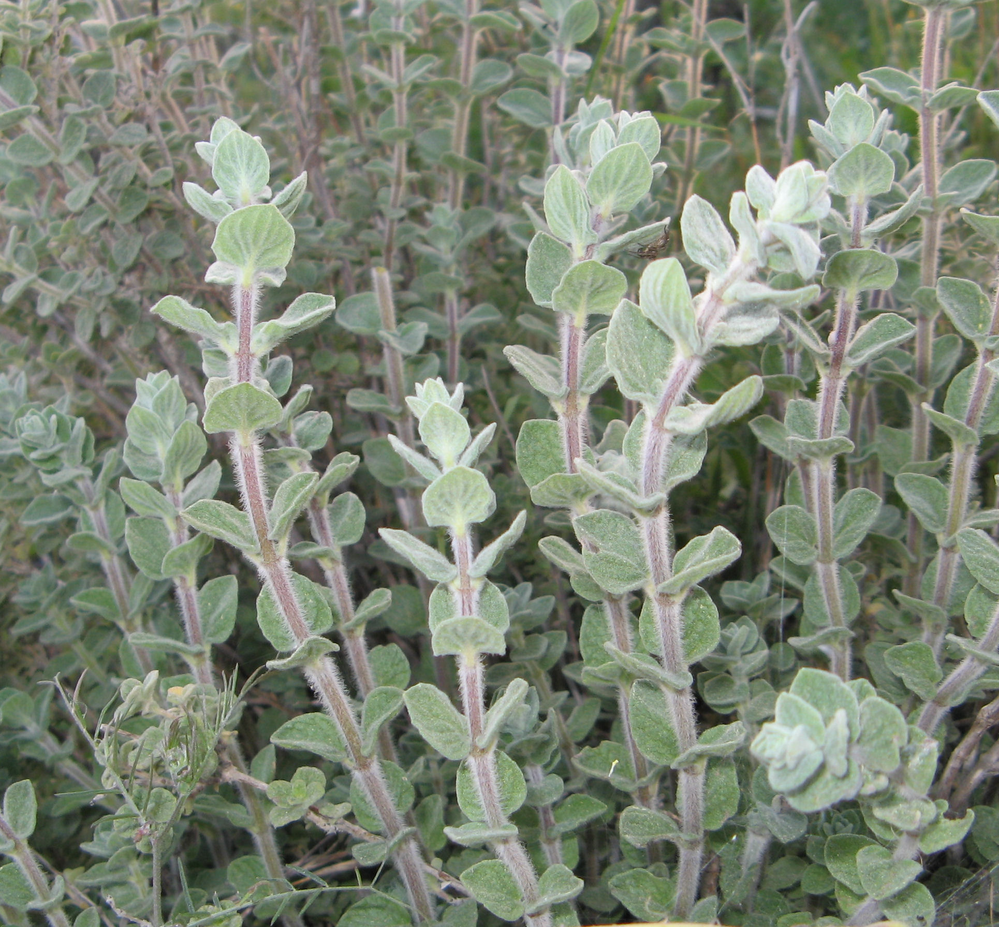
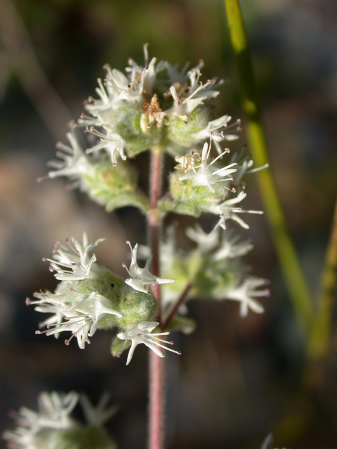
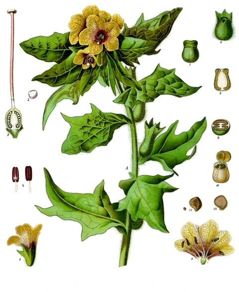
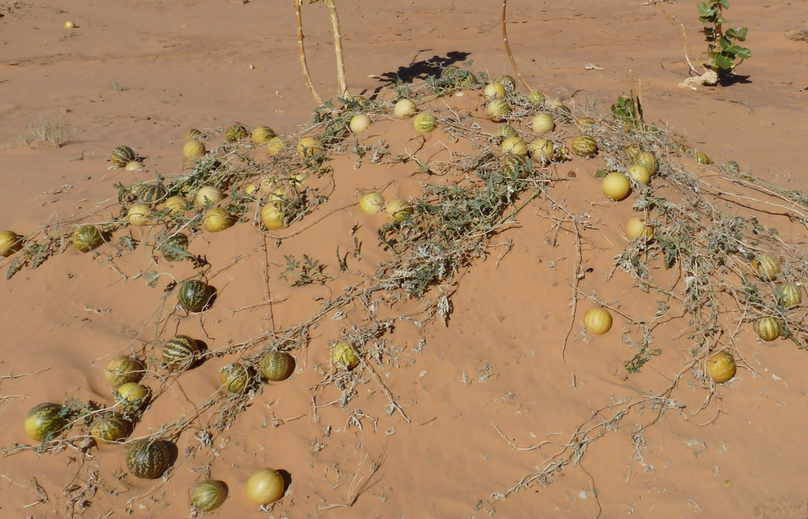
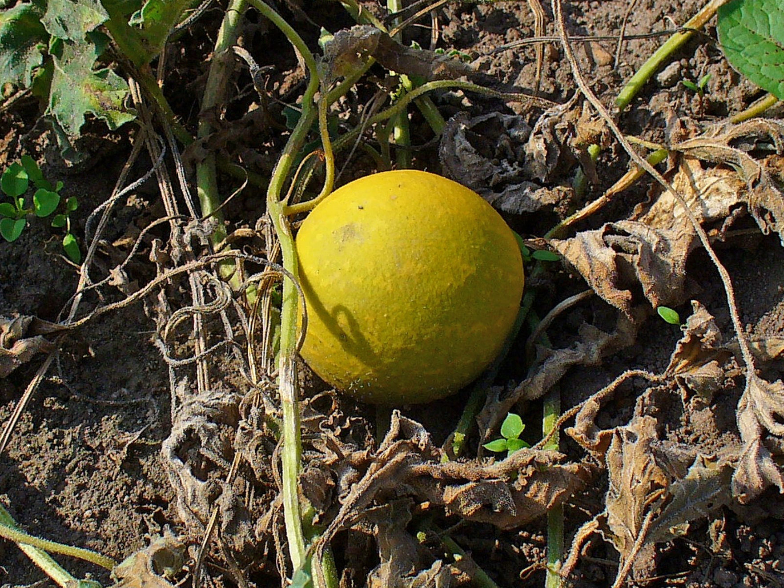
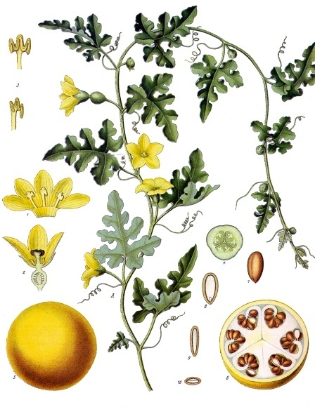

# Plants and Trees in the Bible

## License Information

Plants and Trees in the Bible © United Bible Societies, 2025. Adapted from: <cite>Each According to its Kind: Plants and Trees in the Bible</cite>, by Robert Koops © 2012 United Bible Societies. This work is licensed under Creative Commons Attribution-ShareAlike 4.0 International (<a href="https://creativecommons.org/licenses/by-sa/4.0/">https://creativecommons.org/licenses/by-sa/4.0/</a>).

--------------------------------

## 标题：其他实用的植物 (id: FLORA:5.2)

5\.2 标题：其他实用的植物
===============

本节讨论的植物包括葫芦、梭梭（用于制作碱液）、曼德拉草、马郁兰（牛膝草）、毒参、野瓜和苦艾。虽然后3种可以入药，但这不是我们在圣经中看到的主要功能，所以我们将其列在这里，而没有放在第4章。

## 标题：葫芦（bottle gourd） (id: FLORA:5.2.1)

5\.2\.1 标题：葫芦（bottle gourd）
===========================

经文出处
----

Hebrew 来：פְּקָעִים (音译：peqa‘im)

[1KI 6:18](https://ref.ly/1Kgs6:18), [1KI 7:24](https://ref.ly/1Kgs7:24), [1KI 7:24](https://ref.ly/1Kgs7:24)

讨论
--

葫芦（学名*Lagenaria siceraria* ）是人类最早种植的植物之一，可作食物，入药，以及制作各种器皿和乐器。葫芦原产于非洲，可能在一万年前左右，由于人为或自然因素被引入到亚洲和美洲。这个植物属的名称来自拉丁文*lagoena* ，意思是"长颈瓶"（几乎可以确定，最早的罗马长颈瓶就是用干葫芦制成）。这种植物的名称源于拉丁文的"干"一词，说明其果实干了以后很有用。无疑，住在圣地的人们会把切开的葫芦用作家里的碗或"长柄勺"，就像我们在非洲和亚洲看到的那样。但是，圣经中提到葫芦时，仅仅是说在所罗门圣殿里的香柏木上刻着葫芦图案（[1KI 6:18](https://ref.ly/1Kgs6:18) ），以及圣殿前面的大铜盆装饰着葫芦图案（[1KI 7:24](https://ref.ly/1Kgs7:24); [1KI 7:24](https://ref.ly/1Kgs7:24) ）。祖海里认为，葫芦也出现在地名"底连"（Dilean，[JOS 15:38](https://ref.ly/Josh15:38) ）中；Dilean源于希伯来文*dela‘ath* ，在圣经成书之后的时期，*dela‘ath* 是葫芦的希伯来文名称。

描述
--

葫芦是一种藤蔓植物，与黄瓜和南瓜一样。葫芦的茎是四方形的，有棱，有毛，长度可达5米（17英尺）。叶子为心形，大小和人的手掌差不多，叶缘轻微浅裂。花为黄色，有5个花瓣，花落后结出的果实根据品种不同有许多种形状。大多数葫芦的一端是球形，并且带一个细长的突出部分，所以切成两半后非常实用，可在厨房里作大勺子用。

特殊意义
----

数千年来，葫芦一直用作容器，或者切开后作舀水的器具，另外也用来制作乐器。大多数葫芦品种的果肉都很苦，有时甚至有毒。在一些国家，有些品种还用作药物，有通便、驱虫、治疗胸痛和头痛的功效。在非洲南部，叶子和未成熟的幼果被当作蔬菜食用。

翻译
--

在非洲和亚洲的温带和热带地区，翻译者应该很容易找到表示葫芦的词语。葫芦在法国称为*courge bouteille* ，在葡萄牙称为*abo­bora\-carneira* 或*cabaco* ，在拉丁美洲称为*calabaza* 或*cogorda* ，在中国称为"匏瓜"，在印度称为*lauki* ，在印度尼西亚称为*labu* ，在日本称为*hyotan* 或*yugao* ，在马来西亚称为*labu ayer* ，在菲律宾称为*upo* ，在斯里兰卡称为*diya labu* ，在泰国称为*buap khaus* ，在越南称为*bau* 。

如果当地人们唯一熟知的葫芦是圆球形的，那么提供插图会有助于读者理解，或者可以在脚注中描述我们所知的圣地葫芦的特殊形状。葫芦与[2KI 4:39](https://ref.ly/2Kgs4:39) 提到的野瓜是近缘物种，这种野瓜使一群先知发生食物中毒（参[5\.2\.6 野瓜（柯罗辛、苦西瓜、药西瓜）（wild gourd \[colocynth, egusi, bitter apple]）](#FLORA:5.2.6) ）。对于[JON 4:6](https://ref.ly/Jonah4:6) 中的"葫芦"（"gourd"；KJV (King James Version (1611)) 、REB (Revised English Bible (1989)) ），现在认为该植物是蓖麻（参[4\.2\.2 蓖麻 (castor oil plant \[castor bean plant])](#FLORA:4.2.2) ）。

* **Associated Passages:** 列王纪上 6:18; 列王纪上 7:24; 约书亚记 15:38; 列王纪下 4:39; 约拿书 4:6

## 标题：梭梭（猪毛菜属[Salsola]、盐角草属[Salicornia]）（hammada [Salsola, Salicornia]） (id: FLORA:5.2.2)

5\.2\.2 标题：梭梭（猪毛菜属\[Salsola]、盐角草属\[Salicornia]）（hammada \[Salsola, Salicornia]）
===============================================================================

经文出处
----

Hebrew 来：בֹּר (音译：bor)

[JOB 9:30](https://ref.ly/Job9:30), [ISA 1:25](https://ref.ly/Isa1:25)

Hebrew 来：בֹּרִית (音译：borith)

[JER 2:22](https://ref.ly/Jer2:22), [MAL 3:2](https://ref.ly/Mal3:2)

讨论
--

耶利米时期的犹太人还没有肥皂，肥皂要在许多个世纪以后才出现。然而，他们将某些植物的灰与橄榄油混合，做出了一种类似肥皂的东西。其中一种植物是梭梭树（学名*Hammada salicornica* ），常见于沙漠，阿拉伯文称为*rimth* 。赫珀说，任何一种家里产生的灰烬都可以当作肥皂的原料，但是藜科灌木（\[Salsola]猪毛菜属和\[Salicornia]盐角草属、盐草和海蓬子）的灰特别有效。莫尔登克赞成这个观点，并进一步补充说，阿拉伯人称盐草为*kali* 或*elkali* ，化学术语碱（alkali）就是由此衍生而来。

描述
--

盐角草属（学名\[Salicornia]）有两种。白梭梭是一种无叶灌木，经常生长在金合欢树旁边，高不到1米（3英尺），茎绿色、多节。小花在12月左右开放，所结的小果实里面有一粒羽翼状的种子，可以随风散播。黑梭梭与之类似，但颜色较深，喜砂土，在北非也有分布。

特殊意义
----

[MAL 3:2](https://ref.ly/Mal3:2) 提到漂布，指的是洗去羊毛织物上的天然油脂，好进行染色。漂布的人把某些植物的灰烬和橄榄油混合，制成我们所说的碱液或苏打，然后漂洗衣物，并在漂布场晒干（参[2KI 18:17](https://ref.ly/2Kgs18:17) ）。漂布所用的碱液要比肥皂强劲得多，更像是今天的漂白剂，《玛拉基书》就是用这种"漂布的碱"来描述上帝对他子民进行的强力清洁。

翻译
--

我们建议翻译者先研究当地制作肥皂的方法，了解其中的成分，以找到合适的译词。如果要保留[JER 2:22](https://ref.ly/Jer2:22) 中希伯来文本的平行结构，翻译者需要有两个表示"使某物洁净"的词语。如果没有"碱液"（或"苏打"）的对等词，翻译者可以考虑使用当地诗歌中表示擦洗身体之物的文化对等词，比如西非的丝瓜或浮石。如果需要音译*Salsola kali* （带刺的盐草），可以按照希伯来文*borith* 、阿拉伯文*hurd* 或*shawk ahhmar* 、法文*soude conchee* 或*sonde kali* 、葡萄牙文*barilla espinhosa* 或*soda* 或*trago\-espinhoso* 、西班牙文*abrojos* 或*barella* 或*salsora* 等词语进行音译。

* **Associated Passages:** 约伯记 9:30; 以赛亚书 1:25; 耶利米书 2:22; 玛拉基书 3:2; 列王纪下 18:17

## 标题：曼德拉草（"爱情果"）（mandrake ["love apple"]） (id: FLORA:5.2.3)

5\.2\.3 标题：曼德拉草（"爱情果"）（mandrake \["love apple"]）
================================================

经文出处
----

Hebrew 来：דּוּדָאִים (音译：duda’im)

[GEN 30:14](https://ref.ly/Gen30:14), [GEN 30:14](https://ref.ly/Gen30:14), [GEN 30:15](https://ref.ly/Gen30:15), [GEN 30:15](https://ref.ly/Gen30:15), [GEN 30:16](https://ref.ly/Gen30:16), [SNG 7:14](https://ref.ly/Song7:14)

讨论
--

解经家对于希伯来文*duda’im* 所指植物的意见不一。许多解经家断言，这个词必定是指曼陀罗（毒参茄）或曼德拉草（学名*Mandragora autumnalis* ），但祖海里认为这是不可能的，因为曼陀罗从来没有生长在美索不达米亚地区，即[GEN 30:14](https://ref.ly/Gen30:14); [GEN 30:15](https://ref.ly/Gen30:15); [GEN 30:16](https://ref.ly/Gen30:16) 的故事所在地。在[SNG 7:14](https://ref.ly/Song7:14) （《和》7:13），*duda’im* 是指一种与苹果有关的、种植在河岸上的"佳美果子"（不像《创世记》中的*duda’im* 那样是从地里挖出来的）。不论这种生长在美索不达米亚的植物原本是什么物种，当以色列人讲述这个故事时，他们使用了一个听众都知道的词，即*duda’im* 。《创世记》的上下文暗示，*duda’im* 与生育能力有关。根据学者们的意见，在圣经时期最受欢迎的助孕植物是曼陀罗。《七十士译本》和《他尔根》的翻译者带着他们自己对于爱和生育的看法，将*duda’im* 置于圣地的背景下，却无意弄清这种生长在美索不达米亚的植物究竟是什么。英文译本参照《七十士译本》，使用了"mandrake"（"曼德拉草"）一词。

描述
--

曼德拉草是一种没有茎的草本植物，与土豆和西红柿有亲缘关系，但长的更贴近地面。叶子为深绿色，长30厘米（1英尺），宽10厘米（4英寸），呈玫瑰状从中心向外展开。紫色或蓝色的花开在靠近植株中心的茎上，果实呈黄色，成熟后看起来像鸟巢里的蛋。曼德拉草有一种独特的气味，有些人觉得香甜，有些人觉得刺鼻。根很粗壮，通常是分叉的，看起来像人的身体，这也许就是它催情的名声在中东和欧洲远播的原因，也是"爱情果"这个名字的由来。

特殊意义
----

传说，曼德拉草具有很多神奇的特性。比如，当曼德拉草从地里拔出时会发出尖叫声，叶子在黑暗中会发光。在中世纪，德意志人给它们穿上衣服，向其献祭，以免冒犯神灵。法兰西人相信小精灵住在曼德拉草里面，并要求人们每天献祭。1630年，汉堡的三名妇女因被控行巫术而处死，原因是她们的家中有曼德拉草的根。阿拉伯人称曼德拉草为"魔鬼的蜡烛"。

翻译
--

"曼德拉草"的译法有：

1\. 使用类似的植物，比如"野生茄子"（如尼日利亚的贝罗姆文），并加上脚注。有些地方可以仿照尼日利亚的豪萨文*gautan daji* （或*yalo* ）。

2\. 使用一个功能对等词，即当地众所周知的某种助孕植物，如尼日利亚的蒂夫文的译法（*mkehem* ）。

3\. 新造一个描述性短语，如"爱情花"（"love flower"；CEV (Contemporary English Version) ）或"爱情果"。

4\. 按照希伯来文*duda’im* 或某种主要语言进行音译，如英文*mandaraki* 或法文*mandragore* ，并在脚注中说明这种植物可能被人认为具有助孕能力。在音译时，建议增加"的根"一语，说明是这种植物的根产生效力。

* **Associated Passages:** 创世记 30:14; 创世记 30:15; 创世记 30:16; 雅歌 7:14

## 标题：马郁兰（marjoram） (id: FLORA:5.2.4)

5\.2\.4 标题：马郁兰（marjoram）
========================

经文出处
----

Hebrew 来：אֵזוֹב (音译：’ezov)

[EXO 12:22](https://ref.ly/Exod12:22), [LEV 14:4](https://ref.ly/Lev14:4), [LEV 14:6](https://ref.ly/Lev14:6), [LEV 14:49](https://ref.ly/Lev14:49), [LEV 14:51](https://ref.ly/Lev14:51), [LEV 14:52](https://ref.ly/Lev14:52), [NUM 19:6](https://ref.ly/Num19:6), [NUM 19:18](https://ref.ly/Num19:18), [1KI 5:13](https://ref.ly/1Kgs5:13), [PSA 51:9](https://ref.ly/Ps51:9)

Greek 希：ὕσσωπος (音译：hussōpos)

[JHN 19:29](https://ref.ly/Luke19:29), [HEB 9:19](https://ref.ly/Phlm9:19)

讨论
--

 祖海里、赫珀和ABD (Anchor Bible Dictionary) 都认为希伯来文*’ezov* 可能是指马郁兰（学名*Origanum syriacum* 或*Majorana syriaca* ）。《七十士译本》的翻译者决定使用希腊文名称*hussōpos* （意为"牛膝草"，英文"hyssop"）为译词，这个词通常是指一种欧洲植物，类似圣地的马郁兰。有些植物学家把圣经中提到的马郁兰称为"叙利亚牛膝草"，带来了更大的困惑。《国际标准圣经百科全书》（*The International Standard Bible Encyclopedia* ）指出，*’ezov* 可能包括多种植物。我们认为"叙利亚牛膝草"这个名称太过于以欧洲为中心，故建议译成"马郁兰"。*’Ezov* 和*hussōpos* 是同源词。19世纪和20世纪的一些植物学家查考了"刺山柑"的阿拉伯文（*el asaf* ，后来演变成*lassaf* ），并推测五经中的*’ezov* 必定是指这种盛产于埃及和阿拉伯沙漠的刺山柑灌木（参[3\.5\.1 刺山柑（刺山柑灌木、刺山柑浆果）(Caper \[caper bush, caper berry])](#FLORA:3.5.1) ）。的确，在[1KI 5:13](https://ref.ly/1Kgs5:13) （《和》4:33），墙上长的刺山柑灌木比马郁兰更说得通。*’Ezov* 是犹太人在洁净礼仪时所需要的植物。是否存在以下可能：当希伯来人进入应许之地后，他们在那里发现了很多马郁兰，洁净礼仪随之发生改变，*’ezov* "符合律法"的定义发生了延伸，从而将马郁兰包含在内呢？马郁兰是一种多毛植物，淋洒水非常方便。因此，新约《约翰福音》中的*hussōpos* 一词指马郁兰的茎是很有可能的。

描述
--

马郁兰植株高50—80厘米（20—32英寸），叶小，有很多分枝。茎上长着很多茸毛，因此很适合做刷子。马郁兰的花是白色的。叶子和茎可以提取油脂，加在肥皂或乳液中以添加香气。

特殊意义
----

在现今的欧洲和中东，马郁兰被用作调味品，圣经时期可能也是这样。但是，圣经记载这种植物是用作刷子。以色列人快要出埃及的时候，摩西吩咐他们把血涂在门框上，给灭命的天使作越过的记号，他们就是用这种植物涂血的。这个事件标志着逾越节的开始，犹太人从此谨守逾越节。在[PSA 51:9](https://ref.ly/Ps51:9) （《和》51:7），*’ezov* 象征灵性上的洁净。提到这个词的第三处经文是[1KI 5:13](https://ref.ly/1Kgs5:13) （《和》4:33；所涉问题见下文讨论），这里*’ezov* 指一种不起眼的植物，与高大佳美的黎巴嫩香柏树作对比。

翻译
--

有很多英文译本出于尊重传统，用"hyssop"（"牛膝草"）来翻译*’ezov* ；REB (Revised English Bible (1989)) 没有采用这种译法。翻译者没有必要延续这个传统，应该尽量采用在植物学上更正确的"马郁兰"一词。

[EXO 12:22](https://ref.ly/Exod12:22) a："要拿一把牛膝草（*’ezov* ），蘸盆里的血。"在《出埃及记》的经文中，*’ezov* 的功用比植物本身是什么更为重要。翻译者即使采用"esov的枝子"这样的音译，也应该使用"洒"这样的动词来激发读者对这个画面的想象。如果翻译者选择使用当地通常用于淋洒水的植物，那么需要增加脚注说明原文所指植物是什么。如果翻译者习惯音译英文，那么最好音译"marjoram"（"马郁兰"），而非"hyssop"（"牛膝草"）。此外，翻译者还可以音译拉丁文*majorana* 、西班牙文*mejorana* 或阿拉伯文*mardakush* 等词语。综上所述，"马郁兰"的部分译法如下：

1\. 一般性的表述，如"叶子"；

2\. 音译（见上文）；

3\. 替代成当地一种用来点洒水的植物，并加脚注。

西非有多种马郁兰的近缘植物，翻译者可从中选择。在这些候选植物中，有一种叶子带毛的植物生长在冈比亚，被用作驱蚊剂。尼日利亚的蒂夫族称同一种植物为*huuhuu* ，尼日利亚的艾特萨克族（Etsako）称其为"蚊草"。这种植物的叶子有一种辛辣的味道，并且因为多毛而适合做刷子。

[1KI 5:13](https://ref.ly/1Kgs5:13) a（《思》4:33a）："他（所罗门）讲论草木，从黎巴嫩的香柏树直到墙上长的牛膝草（*’ezov* ）"（"草木"在RSV (Revised Standard Version (1952)) 作"trees""各种树木"）。这节经文有三个不解之处：

1\. 马郁兰（类似欧洲牛膝草）不是一种树，而是一种相对低矮的植物，长着细小的叶子和白色的花。如果目标语言中有涵盖"树"和"植物"的统称，翻译者应该使用该词语。德弗里斯（De Vries）认为，希伯来文*‘ets* （"树"）的含义比英文"tree"（"树"）更广，因为这个词还包含了我们所说的藤本植物（参[EZK 15:2](https://ref.ly/Ezek15:2) ）。尽管如此，将*‘ets* 这个词延伸到涵盖马郁兰这样的草本植物在内也是很牵强的，这也是一些学者仍然不相信*’ezov* 是马郁兰的原因之一。例如，赫珀倾向于同意特里斯特拉姆（Tristram）和鲍尔弗（Balfour）的意见，这两人在19世纪末提出，*’ezov* 在这里指的是刺山柑灌木（参[3\.5\.1 刺山柑（刺山柑灌木、刺山柑浆果）(Caper \[caper bush, caper berry])](#FLORA:3.5.1) ）。他们的观点有一部分是基于同源词的证据：刺山柑灌木的阿拉伯文是*lassaf* （源于*el asaf* ），这个词似乎与*’ezov* 同源，但马郁兰的阿拉伯文（*zaatar* ）却与之完全无关。有人可能会说，刺山柑也不是树，但很重要的是，它确实有木质的茎。

2\. "墙上长的*’ezov* "这个短语很奇怪，因为实际上，马郁兰通常不会长在墙缝里面。马郁兰性喜岩质土壤，但是不太可能长到墙上。即使对小学生来说，这个植物学上的细节也是显而易见的，难道伟大的生物学家所罗门王会在这上面出错吗？

3\. 在这节经文里，从文学的角度来说，与马郁兰相比，从墙缝中长出的植物更能与高大的香柏树形成鲜明的对比。上文提到的刺山柑是一个很好的备选，因为这种植物确实生长在城墙的裂缝中，而且与香柏树形成强烈对比。然而，较晚期的植物学家并不赞同这种意见，并且其他多处出现该词的经文也不适合译成刺山柑。以色列人在出埃及时，用一束*’ezov* 把血涂在门框上。马郁兰的茎多毛，非常适合作此用途，刺山柑灌木却不是特别适合。那么，*’ezov* 是否可能在不同的语境中指不同的植物呢？这并非没有先例。例如，祖海里认为希伯来文*berosh* 在有些经文中指"柏树"，在另一些经文中指"杉树"（参[1\.6 柏树 (cypress)](#FLORA:1.6) ）。希伯来文*suf* 也出现了相同的情况，这个词可以指"香蒲"，也可以指"海藻"（参[5\.1\.1 香蒲 (cattail \[reed\-mace])](#FLORA:5.1.1) ）。

还有最后一个证据，然而遗憾的是，这个证据也没能解决争议。这个证据是：刺山柑灌木在旷野非常多见，而马郁兰更多生长在人们开垦的湿润梯田上。所以，或许在以色列人出埃及的时候，还可以在那里找到马郁兰，但在旷野就没有了。因此，他们难道是出于迫不得已，才在洒血礼仪上使用刺山柑灌木吗？

[1KI 5:13](https://ref.ly/1Kgs5:13) （《和》4:33）中的*’ezov* 译法总结如下：

1\. 音译*’ezov* （*esobu* 、*esofi* ）或马郁兰（*marjoramu* 、*macora* ）；

2\. 替代成当地一种可以长在墙上的植物。

以下是这节经文前半部分的一个翻译示例："所罗门讲论各样草木／植物，从黎巴嫩（山上）高大的香柏树一直到城墙上面（低矮）的majoram/esob/kaper/kafer/asafu。"

* **Associated Passages:** 出埃及记 12:22; 利未记 14:4; 利未记 14:6; 利未记 14:49; 利未记 14:51; 利未记 14:52; 民数记 19:6; 民数记 19:18; 列王纪上 5:13; 诗篇 51:9; 约翰福音 19:29; 希伯来书 9:19; 以西结书 15:2

## 标题：毒参（poison hemlock [black henbane, gall]） (id: FLORA:5.2.5)

5\.2\.5 标题：毒参（poison hemlock \[black henbane, gall]）
====================================================

经文出处
----

Hebrew 来：רֹאשׁ, רוֹשׁ (音译：ro’sh, rosh)

[DEU 29:17](https://ref.ly/Deut29:17), [DEU 32:32](https://ref.ly/Deut32:32), [PSA 69:22](https://ref.ly/Ps69:22), [JER 8:14](https://ref.ly/Jer8:14), [JER 9:14](https://ref.ly/Jer9:14), [JER 23:15](https://ref.ly/Jer23:15), [LAM 3:5](https://ref.ly/Lam3:5), [LAM 3:19](https://ref.ly/Lam3:19), [HOS 10:4](https://ref.ly/Hos10:4), [AMO 6:12](https://ref.ly/Amos6:12)

Greek 希：χολή (音译：cholē)

[MAT 27:34](https://ref.ly/Matt27:34), [ACT 8:23](https://ref.ly/John8:23)

讨论
--

 祖海里提出，希伯来文*ro’sh* /*rosh* 最初可能是某种有毒植物的名称，后来推及到许多产生毒素的植物。*Ro’sh* /*rosh* 常译作"毒药"，也可指提取自毒参（学名*Conium maculatum* ；英文Poison Hemlock）的毒芹碱。毒参隶于伞形科，与另一种英文同名的常绿树（Hemlock，铁杉）没有亲缘关系。赫珀说，[HOS 10:4](https://ref.ly/Hos10:4) （"……如苦菜滋生在田间的犁沟中"）中的*ro’sh* 一词可能不是指毒参，因为毒参通常不会生长在田地里。根据他的意见，这节经文更可能是指有脉纹的天仙子（学名*Hyoscyamus reticulatus* ）。旧约提到*ro’sh* /*rosh* 有10次，在《七十士译本》中有5次译作希腊文*cholē* （"苦胆"）。这表明*ro’sh/rosh* 是作为统称使用的，指一种味苦的有毒物质，并且不一定源于植物。[DEU 32:33](https://ref.ly/Deut32:33) 提到的*ro’sh* 出自蛇，《次经‧多比传》（《思》《多俾亚传》）中的*cholē* 出自鱼（[TOB 6:4](https://ref.ly/Rev6:4); [TOB 6:5](https://ref.ly/Rev6:5); [TOB 6:7](https://ref.ly/Rev6:7) ，[TOB 6:9](https://ref.ly/Rev6:9) ，[TOB 11:4](https://ref.ly/Rev11:4) ，[TOB 11:8](https://ref.ly/Rev11:8) ，[TOB 11:11](https://ref.ly/Rev11:11) ）。

[MRK 15:23](https://ref.ly/Matt15:23) 记载，耶稣在马上被钉十字架的时候，有人（可能是他的门徒）拿"没药调和的酒"给他作镇静剂。马太有意呼应[PSA 69:22](https://ref.ly/Ps69:22) a（RSV (Revised Standard Version (1952)) 直译"他们拿毒药给我当食物"；"毒药"在《七十士译本》作*cholē* ；《和》69:21a），写道："士兵拿苦胆调和的酒给耶稣喝"（[MAT 27:34](https://ref.ly/Matt27:34) ）；他使用了希腊文中表示苦胆／毒药的统称*cholē* ，以此强调救主承受的羞辱。

描述
--

毒参的高度为1\.5—2\.5米（5—8英尺）。茎绿色、表面光滑，靠底部的地方长有紫色或红色的条纹。叶子像胡萝卜叶一样呈花边状，叶长可达半米（2英尺），白色小花成簇生长，呈小伞状。因此，毒参可能会被误认为是欧芹或野生胡萝卜。根很粗壮，像欧洲防风草的根。叶子和根均散发出一种苦味。

两年生天仙子具有不同的形态，但一般可以长到1米（3英尺）或者更高（包括花在内）。茎直立，多分枝，长有白色的伞状花序。灰绿色的卵形叶子尖端锐利，叶长可达30厘米（1英尺），叶面覆满具有黏性的毛。

在古代，希腊和阿拉伯的医生用毒参作镇静剂，但过量服用将会致命，或者会导致语言能力丧失或瘫痪。天仙子（英文henbane，意为"杀鸡药"）曾被希腊人用作催眠和止痛的药物。欧洲人在中世纪就使用天仙子，11世纪的盎格鲁\-撒克逊医学著作在"亨贝尔"（henbell）的名目下提到了天仙子。从毒参中提取的毒素叫做"毒芹碱"。

翻译
--

旧约中所有提及*ro’sh* /*rosh* 的经文都是修辞性的，因此翻译者可以自由寻找富有表现力的当地词语作为译词。另外，由于毒药经常用于打猎、捕鱼或灭鼠，因此大多数语言都会有表示毒药的词。经文提到*ro’sh* /*rosh* 时，有一半与希伯来文*la‘anah* 成对出现（参[5\.2\.7 苦艾 (wormwood)](#FLORA:5.2.7) ），因此翻译者需要寻找一个合适的词对。如果没有表示"毒药"的词语，那么也可以用有毒植物的名称来替代这对词语。毒参遍布中欧、南欧、亚洲和北非，并被引进北美和南美。野生天仙子遍布欧洲中部和南部、西亚、印度，一直到西伯利亚，现今也生长在北美和南美，特别是巴西。天仙子属（学名*Hyoscyamus* ）的一个近缘物种生长范围广泛，从加那利群岛起，经北非一直到亚洲都有发现。

* **Associated Passages:** 申命记 29:17; 申命记 32:32; 诗篇 69:22; 耶利米书 8:14; 耶利米书 9:14; 耶利米书 23:15; 耶利米哀歌 3:5; 耶利米哀歌 3:19; 何西阿书 10:4; 阿摩司书 6:12; 马太福音 27:34; 使徒行传 8:23; 申命记 32:33; 多俾亚传 6:4; 多俾亚传 6:5; 多俾亚传 6:7; 多俾亚传 6:9; 多俾亚传 11:4; 多俾亚传 11:8; 多俾亚传 11:11; 马可福音 15:23

## 标题：野瓜（柯罗辛、苦西瓜、药西瓜）（wild gourd [colocynth, egusi, bitter apple]） (id: FLORA:5.2.6)

5\.2\.6 标题：野瓜（柯罗辛、苦西瓜、药西瓜）（wild gourd \[colocynth, egusi, bitter apple]）
========================================================================

经文出处
----

Hebrew 来：גֶּפֶן סְדוֹם (音译：gefen sedom)

[DEU 32:32](https://ref.ly/Deut32:32), [DEU 32:32](https://ref.ly/Deut32:32)

Hebrew 来：פַּקֻּעֹת שָׂדֶה (音译：paqu‘oth sadeh)

[2KI 4:39](https://ref.ly/2Kgs4:39), [2KI 4:39](https://ref.ly/2Kgs4:39)

讨论
--

[2KI 4:39](https://ref.ly/2Kgs4:39) 提到的先知门徒可能来自城里。他出去摘"菜"时甚至可能不知道该采些什么。他发现了一棵*gefen sadeh* （字面意为"田间的藤"）。希伯来文*gefen* 泛指攀爬或缠绕的植物，但是和英文"vine"（"藤"）一样，这个词也可以特指葡萄藤。在这节经文中，这个词指的是野瓜或柯罗辛（药西瓜），一种在干燥气候里常见的藤本植物。柯罗辛的果实（*paqu‘oth* ）有几分毒性，不过瓜的粉末可作药用。柯罗辛除了生长在沿海平原之外，现仍生长在约旦河谷靠近吉甲的地方，据说先知门徒的故事就发生在那里。根据赫珀的研究，在主后54年，罗马皇帝革老丢就是被他的妻子用柯罗辛毒死的。相关的希伯来文*peqa‘im* 出现在其他地方，指葫芦的果实（参[5\.2\.1 葫芦 (bottle gourd)](#FLORA:5.2.1) ）。

赫珀认为，摩西的歌（[DEU 32:32](https://ref.ly/Deut32:32) ）提到的"所多玛的葡萄树"（希伯来文*gefen sedom* ）可能是柯罗辛（学名*Citrullus colocynthis* ）。虽然这个比喻很恰当，但经文本身可能根本不是指一种有毒的植物，而仅仅是把悖逆顽梗的以色列人比作罪恶的所多玛人。赫珀还指出，[DEU 29:17](https://ref.ly/Deut29:17) （《和》29:18）、[PSA 69:22](https://ref.ly/Ps69:22) （《和》69:21）、[JER 8:14](https://ref.ly/Jer8:14) 、[JER 9:14](https://ref.ly/Jer9:14) （《和》9:15）、[JER 23:15](https://ref.ly/Jer23:15) 和[AMO 6:12](https://ref.ly/Amos6:12) 中的希伯来文*ro’sh* 所指的植物可能就是柯罗辛（参[5\.2\.2 梭梭（猪毛菜属\[Salsola]、盐角草属\[Salicornia]）（hammada \[Salsola, Salicornia]）](#FLORA:5.2.2) ）。

描述
--

柯罗辛藤与西瓜藤、黄瓜藤和葫芦藤很相似。根粗壮，富含水分，可以深深扎入土里。茎匍匐于地，卷须缠在灌木或篱笆上。叶子呈三角形，叶缘浅裂，像西瓜的叶子。花朵黄色，果实黄色、球形，大小如大苹果或西柚。果壳坚硬光滑，果肉松软，种子白色或棕色。

特殊意义
----

西奈半岛和尼革夫西部的阿拉伯人供应柯罗辛给医药市场，用于治疗胃病和通便。在食物匮乏的时期，人们会把柯罗辛的种子磨成面做面包。在存放羊毛衣物时，柯罗辛也可用来驱蛾。

翻译
--

柯罗辛生长在整个地中海地区和西亚。有些翻译者的语言可能没有一个表示攀缘植物的统称，但他们可能有"植物"这个更一般性的词语，或者也可以采用"野生黄瓜"这样的短语。需要记住的一点是：[2KI 4:39](https://ref.ly/2Kgs4:39) 中的希伯来文短语*paqu‘oth sadeh* （"野瓜"）是个笼统的名称，先知门徒自己也不认识这种果实。因此，只有使用较为笼统的词语为译词，这个故事才最合理。圣经植物学家非常确定这个门徒发现的瓜藤就是柯罗辛，但从某种意义上说，这并非故事的重点，因为故事的目的在于显明上帝的奇妙大能。

如果要音译"柯罗辛"，翻译者可以按照法文*coloquinthe* 、西班牙／葡萄牙文*coloquinta* ，或阿拉伯文*banzal* 来音译。

* **Associated Passages:** 申命记 32:32; 列王纪下 4:39; 申命记 29:17; 诗篇 69:22; 耶利米书 8:14; 耶利米书 9:14; 耶利米书 23:15; 阿摩司书 6:12

## 标题：苦艾（wormwood） (id: FLORA:5.2.7)

5\.2\.7 标题：苦艾（wormwood）
=======================

经文出处
----

Hebrew 来：לַעֲנָה (音译：la‘anah)

[DEU 29:17](https://ref.ly/Deut29:17), [PRO 5:4](https://ref.ly/Prov5:4), [JER 9:14](https://ref.ly/Jer9:14), [JER 23:15](https://ref.ly/Jer23:15), [LAM 3:15](https://ref.ly/Lam3:15), [LAM 3:19](https://ref.ly/Lam3:19), [AMO 5:7](https://ref.ly/Amos5:7), [AMO 6:12](https://ref.ly/Amos6:12)

Greek 希：ἄψινθος (音译：apsinthos)

[REV 8:11](https://ref.ly/Jude8:11), [REV 8:11](https://ref.ly/Jude8:11)

讨论
--

希伯来文*la‘anah* 在字面上是指一种植物，但在旧约中只用作比喻，表示某种味道非常苦的东西。尽管证据很少，但解经家和植物学家一致认为，这个词可能指一种从白苦艾中提取的物质。白苦艾盛产于圣地的旷野。

描述
--

白苦艾（学名*Artemisia herba\-alba* ）是一种不到半米（18英寸）高的灌木。叶子毛绒绒的，叶片细碎，在以色列凉爽的雨季结束时掉落，叶片在炎热的季节会变为鳞片状。在9月或10月左右，苦艾花以2至4朵成簇开放，并结成多毛的小果实。植物成熟后，把叶子和花晒干可以制成一种非常苦的茶，或者磨成粉、制成膏或油以入药。

特殊意义
----

旧约提到苦艾时，大多与希伯来文*ro’sh* （"毒药／苦胆"）一词成对使用，喻指痛苦的经历和悲伤（参[5\.2\.5 毒参 (poison hemlock \[black henbane, gall])](#FLORA:5.2.5) ）。[REV 8:11](https://ref.ly/Jude8:11); [REV 8:11](https://ref.ly/Jude8:11) 提到，一颗名叫茵陈（希腊文*apsinthos* ）的星星使地上三分之一的水变苦且有毒。苦艾叶的味道很苦。少量的苦艾可用作麻醉剂，欧洲人用它来调酒（苦艾酒）。苦艾也可用来驱除飞蛾、跳蚤和肠道寄生虫。

翻译
--

圣地的白苦艾遍布中东、北非（埃及、摩洛哥）和欧洲西南部，然而全世界至少有300种蒿属（学名*Artemisia* ）植物，通常分布在干旱地区。中国的一种蒿属植物（"黄花蒿"）被用作抗疟疾的药物。山道年蒿（学名*Artemisia cina* ）和驱蛔蒿（学名*Artemisia maritima* ）生长在欧亚大陆，从中提取的山道年（学名*Santonica* ）是一种驱肠虫药。因纽特人把青蒿（学名*Artemisia tilesii* ）当作可待因使用。美国西部的山艾树也隶于蒿属，美洲土著人曾将其用于多种用途。

大多数语言都有指称叶子和／或根味苦植物的词语。因为在旧约中提到苦艾的经文都是比喻性的，所以翻译者可以使用当地的这类植物来表达经文的中心意思。如上所述，*la‘anah* 大多与*ro’sh* 成对出现，所以在这些经文中，这两个词要一起处理。如果没有具体的植物，可以使用"苦果子"、"苦香料"或"苦物"等短语。如果需要，可以按照法文*absinthe* 、葡萄牙文*absinto* 或*losna* ，或者西班牙文*absintio* 或*ajenjo* 来音译。

* **Associated Passages:** 申命记 29:17; 箴言 5:4; 耶利米书 9:14; 耶利米书 23:15; 耶利米哀歌 3:15; 耶利米哀歌 3:19; 阿摩司书 5:7; 阿摩司书 6:12; 启示录 8:11

