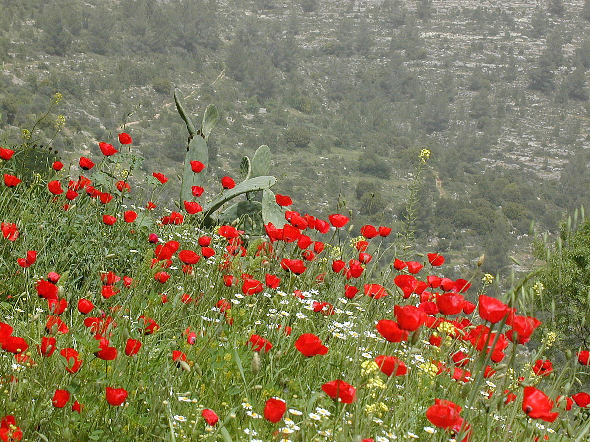
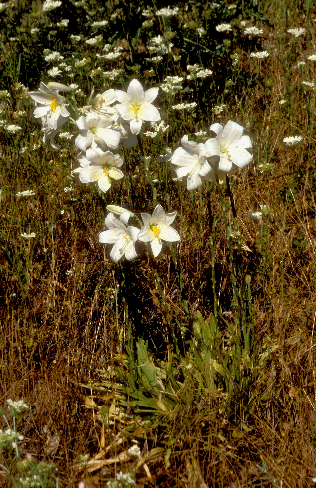
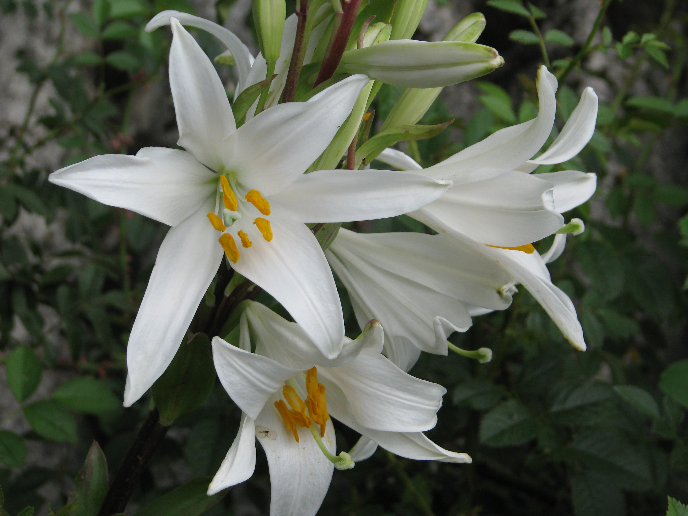
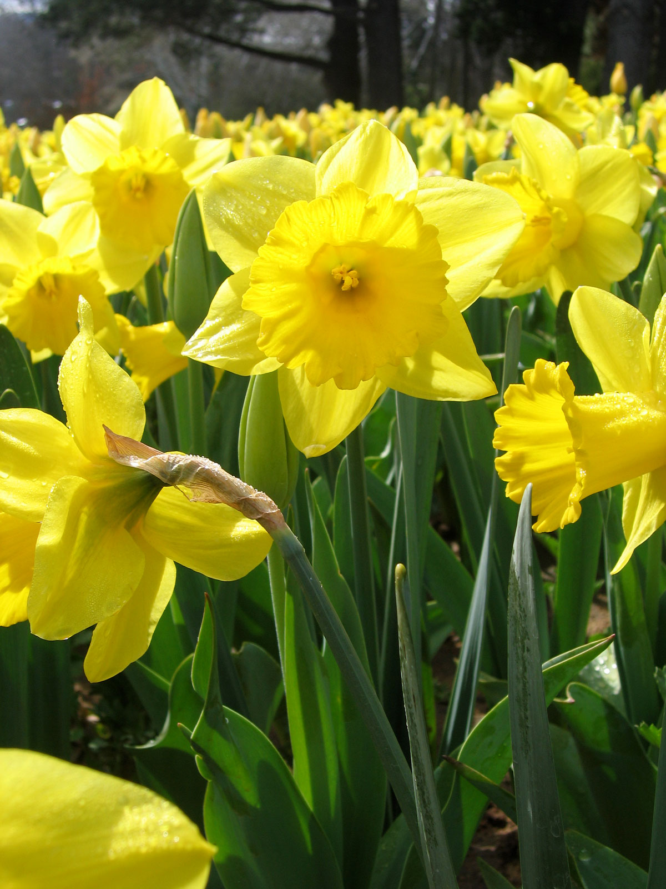

# Plants and Trees in the Bible

## License Information

Plants and Trees in the Bible © United Bible Societies, 2025. Adapted from: <cite>Each According to its Kind: Plants and Trees in the Bible</cite>, by Robert Koops © 2012 United Bible Societies. This work is licensed under Creative Commons Attribution-ShareAlike 4.0 International (<a href="https://creativecommons.org/licenses/by-sa/4.0/">https://creativecommons.org/licenses/by-sa/4.0/</a>).

--------------------------------

## 标题：花 (id: FLORA:6.1)

6\.1 标题：花
=========

有了以上的提醒，我们现在来讨论我们认为可能是统指"花"的希伯来文和希腊文词语。

希伯来文*tsits* 和*tsitsah* 出现了12次，意思是"花朵"或"花"。[NUM 17:23](https://ref.ly/Num17:23) （《和》17:8）记载，亚伦的杖"开了花"。所罗门圣殿的墙和门上都刻着"绽开的花"（[1KI 6:18](https://ref.ly/1Kgs6:18); [1KI 6:29](https://ref.ly/1Kgs6:29); [1KI 6:32](https://ref.ly/1Kgs6:32); [1KI 6:35](https://ref.ly/1Kgs6:35) ）。有几位圣经作者用*tsits* 来形容人生的短暂（[JOB 14:2](https://ref.ly/Job14:2); [PSA 103:15](https://ref.ly/Ps103:15); [ISA 28:1](https://ref.ly/Isa28:1); [ISA 40:6](https://ref.ly/Isa40:6); [ISA 40:7](https://ref.ly/Isa40:7); [ISA 40:8](https://ref.ly/Isa40:8) ）。*Tsits* 的动词形式（*tsuts* ）出现在[NUM 17:23](https://ref.ly/Num17:23) （《和》17:8）、[ISA 27:6](https://ref.ly/Isa27:6) 和[EZK 7:10](https://ref.ly/Ezek7:10) 中。这个希伯来文词语在希腊文中的对等词是*anthos* ，见于[JAS 1:10](https://ref.ly/Jas1:10); [JAS 1:11](https://ref.ly/Jas1:11) 和[1PE 1:24](https://ref.ly/1Pet1:24); [1PE 1:24](https://ref.ly/1Pet1:24) （引自[ISA 40:6](https://ref.ly/Isa40:6) ）。作者使用*tsits* 和*anthos* 这两个词时，是否指某种具体的植物呢？我们不得而知，因为符合描述的花有几十种。当然，这对翻译者来说就非常方便了，因为他们可以自由地选择符合上下文的植物，《七十士译本》、《武加大译本》和KJV (King James Version (1611)) 的翻译者就是这样做的。我们在很多译本的[SNG 2:1](https://ref.ly/Song2:1) 中，都能看到"沙仑的玫瑰"一语，原因也在于此。

希伯来文*nets* 出现在[GEN 40:10](https://ref.ly/Gen40:10) ，那里提到法老的司酒长梦见一棵葡萄树开了"花"。这个词语也出现在[SNG 2:12](https://ref.ly/Song2:12) ，经文描写：当地上的"百花"绽放时，歌唱的时候就到了。圣地有很多种红色的花在春天开放。有意思的是，在伊拉克人所讲的阿拉伯语中，有一个指这些花的同源词（*nissan* ），祖海里（Zohary）认为，这个词证实了希伯来历中的尼散月与百花开放有联系的说法。与之相关的希伯来文名词*nitstah* 出现在[JOB 15:33](https://ref.ly/Job15:33) 中，指的是橄榄树的花；这个词也出现在[ISA 18:5](https://ref.ly/Isa18:5) 中，指葡萄树的花。与之相关的希伯来文动词*natsats* （"开花"）出现在[ECC 12:5](https://ref.ly/Eccl12:5) 、[SNG 6:11](https://ref.ly/Song6:11) 和[SNG 7:13](https://ref.ly/Song7:13) （《和》7:12）中。

这里还要提到希伯来文动词*parach* ，这个词一共出现了14次，意思是"开花"；名词形式是*perach* ，一共出现了15次。[EXO 25:31](https://ref.ly/Exod25:31); [EXO 25:31](https://ref.ly/Exod25:31); [EXO 25:32](https://ref.ly/Exod25:32); [EXO 25:33](https://ref.ly/Exod25:33); [EXO 25:34](https://ref.ly/Exod25:34); [EXO 25:35](https://ref.ly/Exod25:35); [EXO 25:36](https://ref.ly/Exod25:36); [EXO 25:37](https://ref.ly/Exod25:37); [EXO 25:38](https://ref.ly/Exod25:38); [EXO 25:39](https://ref.ly/Exod25:39); [EXO 25:40](https://ref.ly/Exod25:40) 、[EXO 37:17](https://ref.ly/Exod37:17); [EXO 37:18](https://ref.ly/Exod37:18); [EXO 37:19](https://ref.ly/Exod37:19); [EXO 37:20](https://ref.ly/Exod37:20); [EXO 37:21](https://ref.ly/Exod37:21); [EXO 37:22](https://ref.ly/Exod37:22); [EXO 37:23](https://ref.ly/Exod37:23); [EXO 37:24](https://ref.ly/Exod37:24) 和[NUM 8:4](https://ref.ly/Num8:4) 在描述金灯台时使用了*perach* 一词，该提及非常重要。在这些经文中，作者把灯台比作一个有茎有花的开花植物。七个枝子的顶端在希伯来文中被称为*perach* ，在《七十士译本》中作*krinon* 。这表明，《七十士译本》的翻译者认为希腊文*krinon* 泛指"花形的物件"或"花"。另一方面，[1KI 7:26](https://ref.ly/1Kgs7:26) 在描述圣殿中的大铜海时，希伯来文本说它的边缘如*perach shushan* （"*shushan* 花"），《七十士译本》译为*blastos krinou* （"*krinon* 花"），这可能表明*shushan* 和*krinon* 都是指某种特定的花或一些花瓣弯曲的花（RSV (Revised Standard Version (1952)) 和GNB (Good News Bible) 译为"lily""百合花"）。此外，在[SNG 2:1](https://ref.ly/Song2:1) 中，*chavatseleth* 与*shushan* 平行，表明它们都是某种特定的花。这个问题关系到如何解释许多其他不确定是特指某种花还是泛指花的经文，例如福音书中的短语"野地里的百合花"（[MAT 6:28](https://ref.ly/Matt6:28) ；[LUK 12:27](https://ref.ly/Luke12:27) ）。马太和路加使用了希腊文*krinon* ，但该词在这里很可能是统称，指很多花，或者指某种常见的花，因为那时的"野地里"还没有真正的百合花。（白色的百合花只生长在森林里。）*krinon* 可能指称的花有冠状银莲花、红毛莨、罂粟、春菊或狗甘菊。

希腊文*anthos* 出现在[WIS 2:7](https://ref.ly/Wis2:7) 、[SIR 24:17](https://ref.ly/Sir24:17) 、[SIR 39:14](https://ref.ly/Sir39:14) 、[SIR 50:8](https://ref.ly/Sir50:8) 、[SIR 51:15](https://ref.ly/Sir51:15) 和[3MA 7:16](https://ref.ly/3Macc7:16) 中。在[WIS 2:7](https://ref.ly/Wis2:7) 中，这个词似乎是指整棵开花植物，除此之外都是指"花朵"，即开花植物上面长着花瓣的那一部分。[SIR 50:8](https://ref.ly/Sir50:8) 提到了具体的花名——玫瑰（参[6\.1\.4 玫瑰（腓尼基玫瑰）（rose \[phoenician rose]）](#FLORA:6.1.4) ）。

拉丁文*flos* 出现在[2ES 5:24](https://ref.ly/2Esd5:24) 、[2ES 5:36](https://ref.ly/2Esd5:36) 、[2ES 6:3](https://ref.ly/2Esd6:3) 、[2ES 6:44](https://ref.ly/2Esd6:44) 、[2ES 9:17](https://ref.ly/2Esd9:17) 、[2ES 9:24](https://ref.ly/2Esd9:24) 、[2ES 9:26](https://ref.ly/2Esd9:26) 、[2ES 12:51](https://ref.ly/2Esd12:51) 和[2ES 15:50](https://ref.ly/2Esd15:50) 中，大多泛指开花植物。

我们在这一节讨论的花包括：

* **Associated Passages:** 民数记 17:23; 列王纪上 6:18; 列王纪上 6:29; 列王纪上 6:32; 列王纪上 6:35; 约伯记 14:2; 诗篇 103:15; 以赛亚书 28:1; 以赛亚书 40:6; 以赛亚书 40:7; 以赛亚书 40:8; 以赛亚书 27:6; 以西结书 7:10; 雅各书 1:10; 雅各书 1:11; 彼得前书 1:24; 雅歌 2:1; 创世记 40:10; 雅歌 2:12; 约伯记 15:33; 以赛亚书 18:5; 传道书 12:5; 雅歌 6:11; 雅歌 7:13; 出埃及记 25:31; 出埃及记 25:32; 出埃及记 25:33; 出埃及记 25:34; 出埃及记 25:35; 出埃及记 25:36; 出埃及记 25:37; 出埃及记 25:38; 出埃及记 25:39; 出埃及记 25:40; 出埃及记 37:17; 出埃及记 37:18; 出埃及记 37:19; 出埃及记 37:20; 出埃及记 37:21; 出埃及记 37:22; 出埃及记 37:23; 出埃及记 37:24; 民数记 8:4; 列王纪上 7:26; 马太福音 6:28; 路加福音 12:27; 智慧篇 2:7; 德训篇 24:17; 德训篇 39:14; 德训篇 50:8; 德训篇 51:15; 玛加伯三书 7:16; 厄斯德拉下 5:24; 厄斯德拉下 5:36; 厄斯德拉下 6:3; 厄斯德拉下 6:44; 厄斯德拉下 9:17; 厄斯德拉下 9:24; 厄斯德拉下 9:26; 厄斯德拉下 12:51; 厄斯德拉下 15:50

## 标题：银莲花（anemone [crown anemone]） (id: FLORA:6.1.1)

6\.1\.1 标题：银莲花（anemone \[crown anemone]）
========================================

经文出处
----

Greek 希：κρίνον (音译：krinon)

[MAT 6:28](https://ref.ly/Matt6:28), [LUK 12:27](https://ref.ly/Luke12:27), [SIR 39:14](https://ref.ly/Sir39:14), [SIR 50:8](https://ref.ly/Sir50:8)

讨论
--

*冠状银莲花 (Ray Pritz (UBS))*

关于耶稣所说的"野地里的百合花"究竟是什么，人们的争论无休无止。许多学者对"百合花"所存的疑问是：在耶稣时期，"白百合"并不为人所熟知，也不是一种"野地里的花"。然而，希腊文*krinon* 可能是许多不同品种的百合花的统称（就像在中文和英文中一样）。有一位植物学家（英国皇家植物园的史密斯）认为，红头巾百合原产于黎凡特（Levant），但这个说法存在争议。实际上，*krinon* 所指的花可能范围更广，我们只能提出许多种可能中的一部分。其中一种是冠状银莲花（学名*Anemone coronaria* ），每年春天在整个地中海盆地争芳斗艳。冠状银莲花隶于毛莨科，在1月至3月间开花。

描述
--

银莲花可长到近50厘米（20英寸）高，根状茎或根较粗，用来储存营养和水，因此植株非常耐旱，能够在干燥地区生长。银莲花的叶子像胡萝卜一样有花边，花朵通常有6个大花瓣，颜色鲜艳，一般为红色，花在夜间闭合。

特殊意义
----

耶稣以"野地里的百合花"为例说明：虽然有些事物很美好，但是在上帝的眼中却远远没有他的儿女宝贵。

翻译
--

全世界大约有120种银莲花，共35属。由于这种花所在的上下文是教导性的（[MAT 6:28](https://ref.ly/Matt6:28) ；[LUK 12:27](https://ref.ly/Luke12:27) ），因此翻译者可以用某种合适的野花来替代，或译成一般性的短语"野花"。和RSV (Revised Standard Version (1952)) 一样，许多英文译本在这两段经文中仍然使用"lilies of the field"（"野地里的百合花"）。GNB (Good News Bible) 、CEV (Contemporary English Version) 和NAB (New American Bible (1970)) 作"wild flowers"（"野花"），而ICB (International Children's Bible) 译为"flowers in the field"（"野地里的花"；GW (God's Word Translation) 类似）。

* **Associated Passages:** 马太福音 6:28; 路加福音 12:27; 德训篇 39:14; 德训篇 50:8

## 标题：百合花（白百合、圣母百合）（lily [white lily, madonna lily]） (id: FLORA:6.1.2)

6\.1\.2 标题：百合花（白百合、圣母百合）（lily \[white lily, madonna lily]）
==========================================================

经文出处
----

Hebrew 来：שׁוּשַׁן, שׁוֹשָׁן, שׁוֹשַׁנָּה (音译：shushan, shoshan, shoshanah)

[1KI 7:19](https://ref.ly/1Kgs7:19), [1KI 7:22](https://ref.ly/1Kgs7:22), [1KI 7:26](https://ref.ly/1Kgs7:26), [2CH 4:5](https://ref.ly/2Chr4:5), [PSA 45:1](https://ref.ly/Ps45:1), [PSA 60:1](https://ref.ly/Ps60:1), [PSA 69:1](https://ref.ly/Ps69:1), [PSA 80:1](https://ref.ly/Ps80:1), [SNG 2:1](https://ref.ly/Song2:1), [SNG 2:2](https://ref.ly/Song2:2), [SNG 2:16](https://ref.ly/Song2:16), [SNG 4:5](https://ref.ly/Song4:5), [SNG 5:13](https://ref.ly/Song5:13), [SNG 6:2](https://ref.ly/Song6:2), [SNG 6:3](https://ref.ly/Song6:3), [SNG 7:3](https://ref.ly/Song7:3), [HOS 14:6](https://ref.ly/Hos14:6)

Latin 拉：lilium

Latin 拉：lilium

[2ES 2:19](https://ref.ly/2Esd2:19), [2ES 5:24](https://ref.ly/2Esd5:24)

讨论
--

*圣母百合 (Ernst Gügel (Wikimedia Commons))*

希伯来文*shushan* 译作"百合花"的语言学依据主要是：这个词在其他语言（叙利亚文、科普特文和阿拉伯文）中的同源词指的是白百合。白百合在以色列一直都很罕见。在1925年以前，许多学者甚至认为圣地没有这种花。（另外两种百合在圣地很常见。）然而，现在有许多植物学家相信，至少在部分语境中，*shushan* 可能是指白百合（学名*Lilium candidum* ）。这种百合花也被称为圣母百合，因为在中世纪的艺术和诗歌中，它经常与圣母马利亚联系在一起。在[SNG 2:1](https://ref.ly/Song2:1) 中，RSV (Revised Standard Version (1952)) 将希伯来文*chavatseleth* 译为"rose"（"玫瑰"），在[ISA 35:1](https://ref.ly/Isa35:1) 中译为"crocus"（"番红花"）；祖海里认为，该词在这两处经文中也可以译为"百合"，但我们有理由持不同意见。

有些学者根据古代近东其他地方的柱顶上面雕刻的图案，认为[1KI 7:19](https://ref.ly/1Kgs7:19); [1KI 7:22](https://ref.ly/1Kgs7:22) 所述装饰圣殿柱子顶端的*shushan* 是白百合。如果事实的确如此，那么*shushan* 在同一章再次出现（[1KI 7:26](https://ref.ly/1Kgs7:26) ），用来描述圣殿外面铜海的向下弯曲的边缘时，可能指的是同一种植物（另见于[2CH 4:5](https://ref.ly/2Chr4:5) ）。在所有这些例子中，任何种类的百合都是有可能的，因为它们都有非常独特的弯曲花瓣。

希伯来文*shushan* 也出现在《尼希米记》、《以斯帖记》和《但以理书》，指的是波斯的都城书珊。有些学者认为，书珊之所以叫这个名字是因为该地有许多百合花。还有学者认为是源于该城神明的名字"因舒希纳克"（"Inshushinak"）。然而，后面这种意见并不能证明百合花就不是书珊一名的起源，因为"Inshushinak"这个词也有可能是源于*shushan* 。

希伯来文*shushan* 一词也出现在几篇诗篇的标题中（[PSA 45:1](https://ref.ly/Ps45:1); [PSA 60:1](https://ref.ly/Ps60:1); [PSA 69:1](https://ref.ly/Ps69:1); [PSA 80:1](https://ref.ly/Ps80:1) ），这里可以使用百合花，不过读者并不需要了解这种植物才能理解诗歌的意思。

[HOS 14:6](https://ref.ly/Hos14:6) （《和》14:5）展望一个"如百合花绽放"的新以色列。

《雅歌》也提到了*shushan* ，那里的上下文表明它所指的花范围更广。例如，[SNG 2:16](https://ref.ly/Song2:16); [SNG 6:3](https://ref.ly/Song6:3) 指在田野的*shushan* 中牧放群羊。AT (American Translation (Goodspeed, 1935)) 译为"hyacinths"（"风信子"），这是一种蓝色的花；植物学家莫尔登克（Moldenke）赞同这个译法。但是，这里也可能是冠状银莲花、罂粟，或是在春天开满山谷和牧场的别的花。[SNG 5:13](https://ref.ly/Song5:13) 的第三行是："他的嘴唇是*shoshanim* 。"有些人认为这里作比较的是红色，因此阿里尔和查纳布洛克（Ariel \& Chana Bloch）译为，"他的嘴唇（是）红色的百合花。"然而，正如墨菲（Murphy）所指出的，"这里以花朵为喻，与其说与男子嘴唇的颜色有关，不如说与其带来的愉悦有关"（第166页）。[SNG 7:3](https://ref.ly/Song7:3) （《和》7:2）说，女子腰间系着一串*shushan* 。这里几乎可以是任何一种花，但应该是一种花朵很多的花。因此，我们建议在这些经文中采用一个一般性的表达，如"美丽的花"，这主要是从实践出发，过于从理论的角度。

现在，学者一般认为[MAT 6:28](https://ref.ly/Matt6:28); [LUK 12:27](https://ref.ly/Luke12:27) 中的希腊文*krinon* 指的是冠状银莲花、普通罂粟，或者一整类植物（参[6\.1\.1 银莲花 (anemone \[crown anemone])](#FLORA:6.1.1) ）。

*圣母百合 (Peganum from Henfield, England (Wikimedia Commons))*

拉丁文*lilium* 源自希腊文，这个词在[2ES 2:19](https://ref.ly/2Esd2:19); [2ES 5:24](https://ref.ly/2Esd5:24) 中是泛指。由于这两节经文的上下文是启示性的，因此不确定其中提到的百合是什么品种。在[2ES 2:19](https://ref.ly/2Esd2:19) 中，百合花与玫瑰花配对（参[6\.1\.4 玫瑰（腓尼基玫瑰）（rose \[phoenician rose]）](#FLORA:6.1.4) ）。

描述
--

白百合可长到1\.5米（5英尺）高，球根，直立茎，叶子细长，花呈锥形，通常有5—6片花瓣，在茎的顶部直接朝上或略微朝下开花。

特殊意义
----

几乎所有提到*shushan* 的经文都是在表达一种无与伦比的美丽。从很早的时候开始，在古代近东和欧洲，百合就因其美丽而被广泛栽培。

翻译
--

如果翻译者确信*shushan* 指的是某种特定的花，并且当地有相应的品种，那就可以使用该名称；或者也可以用一个文化对等词来替代。不论是作为野花还是一种培育的花，百合花在世界各地都很有名。许多翻译者更喜欢使用"花"或"美丽的花"这样的短语，有些通俗译本也是这样处理的。我们不建议在诗体段落中使用音译。在《雅歌》中，英文译本通常译为"lily/lilies"（"百合"），但FRCL (French Common Language Version (Bible en français courant)) 译为"银莲花"，*La Biblia: Traducción en Lenguaje Actual* 译为"玫瑰花"。

"野地里的百合花"：参[6\.1\.1 银莲花 (anemone \[crown anemone])](#FLORA:6.1.1) 。

* **Associated Passages:** 列王纪上 7:19; 列王纪上 7:22; 列王纪上 7:26; 历代志下 4:5; 诗篇 45:1; 诗篇 60:1; 诗篇 69:1; 诗篇 80:1; 雅歌 2:1; 雅歌 2:2; 雅歌 2:16; 雅歌 4:5; 雅歌 5:13; 雅歌 6:2; 雅歌 6:3; 雅歌 7:3; 何西阿书 14:6; 厄斯德拉下 2:19; 厄斯德拉下 5:24; 以赛亚书 35:1; 马太福音 6:28; 路加福音 12:27

## 标题：水仙花（黄水仙花）（narcissus [daffodil]） (id: FLORA:6.1.3)

6\.1\.3 标题：水仙花（黄水仙花）（narcissus \[daffodil]）
===========================================

经文出处
----

Hebrew 来：חֲבַצֶּלֶת (音译：chavatseleth)

[ISA 35:1](https://ref.ly/Isa35:1)

讨论
--

*水仙花 (Zachi Evenor (Wikimedia Commons))*

*黄水仙花 (John O'Neill (Wikimedia Commons))*

[ISA 35:1](https://ref.ly/Isa35:1) 宣告，复兴后的以色列必"如*chavatseleth* "绽放。同一个希伯来文词语也出现在[SNG 2:1](https://ref.ly/Song2:1) ，在那里，年轻的女子形容自己是"沙仑的*chavatseleth* "（著名的"沙仑的玫瑰"）。许多植物学家认为，这两节经文中提到的植物是水仙花（学名*Narcissus tazetta* ）。墨菲认为也有可能是日光兰。还有学者认为是番红花、山地郁金香或白百合（圣母百合）。我们依循莫尔登克的观点，区分了《以赛亚书》和《雅歌》的不同语境，在[ISA 35:1](https://ref.ly/Isa35:1) 中译为水仙花（或黄水仙），在[SNG 2:1](https://ref.ly/Song2:1) 中译为郁金香（参[6\.1\.5 郁金香（山地郁金香，"沙仑的玫瑰"）（tulip \[mountain tulip, "rose of sharon"]）](#FLORA:6.1.5) ）。水仙花和郁金香一样，盛产于凯撒利亚和约帕（今特拉维夫）之间的沙仑平原，以及整个以色列的其他地方。事实上，从以色列横亘亚洲一直到中国，都有很多水仙花。水仙花气味芳香，深受人们喜爱，人们喜欢用它来做花束。水仙在早春开花。

描述
--

水仙属（学名*Narcissus* ）有许多品种，其中包括黄水仙花和北美所称的"长寿花"。然而，许多人常把"水仙"与黄水仙花这个特定品种联系在一起，甚至几乎等同起来。水仙高约30—45厘米（12—18英寸），叶子长、扁且窄。水仙的根是一个洋葱状的鳞茎，花朵通常有6片可爱的乳白色花瓣，从亮黄色漏斗状的花心向外辐射。茎在临近开花时会弯曲，因此花朵不是朝上，而是朝外或朝下。

特殊意义
----

显然，以赛亚是用*chavatseleth* 来描述新以色列土地上的新群体，在那里，沙漠必成为有大片鲜艳花朵绽放之地。水仙非常符合这个描述。这种花是以希腊神话里的美少年那喀索斯（Narcissus）的名字命名的。另外，从他的名字还衍生出希腊文*narkē* ，意思是"失去知觉的"；英文"narcotic"（"麻醉的"）这个词就是源自希腊文*narkē* 。对于希腊人来说，那喀索斯代表虚荣，因为他不回应他人的爱，而更喜欢凝视自己在水中的倒影。黄色的水仙花是威尔士的国花，人们在圣大卫日（3月1日）会佩戴这种花。在中国，水仙是新年期间一种常见的装饰花卉。

翻译
--

各英文译本对[ISA 35:1](https://ref.ly/Isa35:1) 中*chavatseleth* 的译法差异很大。RSV (Revised Standard Version (1952)) 、NRSV (New Revised Standard Version (1989)) 、NIV (New International Version (1984)) 和*The Message* 译为"crocus"（"番红花"）；NEB (New English Bible (1970)) 和REB (Revised English Bible (1989)) 译为"asphodel"（"日光兰"）；KJV (King James Version (1611)) 、NKJV (New King James Version (1982)) 和NJPSV (New Jewish Publication Society Version) 译为"rose"（"玫瑰花"）；GW (God's Word Translation) 译为"lily"（"百合花"）；而GNB (Good News Bible) 、CEV (Contemporary English Version) 、NLT (New Living Translation) 和NCV (New Century Version) 使用了统称"flowers"（"花"）。欧洲、北美洲和亚洲的翻译者都会知道水仙花。由于许多学者认为*chavatseleth* 也有可能是番红花、水仙、郁金香或圣母百合，因此翻译者如果在当地或附近的某种主要语言中发现这些词，也可以进行音译，虽然我们通常不建议在诗体经文中使用音译。翻译者最好使用能引起相同情感的某种花来替代，或使用描述性的语言，例如"繁花似锦"。

* **Associated Passages:** 以赛亚书 35:1; 雅歌 2:1

## 标题：玫瑰（腓尼基玫瑰）（rose [phoenician rose]） (id: FLORA:6.1.4)

6\.1\.4 标题：玫瑰（腓尼基玫瑰）（rose \[phoenician rose]）
=============================================

经文出处
----

Greek 希：ῥόδον (音译：rodon)

[ESG 1:6](https://ref.ly/EsthGr1:6), [WIS 2:8](https://ref.ly/Wis2:8), [SIR 24:14](https://ref.ly/Sir24:14), [SIR 39:13](https://ref.ly/Sir39:13), [SIR 50:8](https://ref.ly/Sir50:8)

Latin 拉：rosa

Latin 拉：rosa

[2ES 2:19](https://ref.ly/2Esd2:19)

讨论
--

*腓尼基玫瑰 (Ray Pritz (UBS))*

学者普遍认为，次经中的希腊文*rodon* 指的是腓尼基玫瑰（学名*Rosa phoenicia* ）。这种玫瑰原产于土耳其地区，也生长在黎巴嫩和伊拉克北部，其同属植物分布广泛，从西欧经尼泊尔山脉一直到中国都有。然而，莫尔登克认为，《次经‧便西拉智训》（《思》《德训篇》）中的*rodon* 一词指的是夹竹桃（学名*Nerium oleander* ）。我们认为这两种花都有可能。

描述
--

腓尼基玫瑰是一种多刺植物，木质茎，高度为1—2米（3—7英尺）。枝子像葡萄藤，上面长着很小的钩状刺。叶子很小，有毛，边缘呈锯齿状。开许多小白花，气味芬芳。花瓣掉落后，种子就留在一个圆形的果实里，这种果实叫做"玫瑰果"。

*夹竹桃 (Ray Pritz (UBS))*

夹竹桃在温带国家已经栽培了许多个世纪。这种灌木在约旦平原和以色列其他地方的溪流旁边生长繁茂，高2—4米（7—13英尺），枝叶浓密，开满粉色的花朵。叶子很细，长约8厘米（3英寸）。叶子和花都会分泌一种有毒的乳白色树脂。

特殊意义
----

数千年来，玫瑰一直为人所喜爱。早在主前2000年，埃及人就开始种植玫瑰。基督时期，罗马人非常喜爱玫瑰，以致作家贺拉西（Horace）担心农民因为玫瑰而疏忽了橄榄园。罗马人用玫瑰花瓣烹饪、酿酒，又用玫瑰精油沐浴。欧洲人对玫瑰的热情更进一步，他们培育出了复合品种的新型玫瑰；到现在，我们已经拥有数百个栽培品种。在一些地区，人们还使用花瓣凋谢后留下的球形"玫瑰果"，用于医药和热饮中。《次经‧便西拉智训》（《思》《德训篇》）中的经文明确指出，玫瑰因其美丽而被人珍视。

翻译
--

《次经‧便西拉智训》（《思》《德训篇》）提到玫瑰的语境都是修辞性的，因此翻译者最好用当地一种象征美丽和芳香的花来翻译。如果不是特别强调感染力，可以使用描述性短语，例如"美丽的花"，或者使用某种主要语言名称的音译，例如*rosa* （西班牙文）、*warda* （阿拉伯文），或*mugunga* /*jangmi* （韩文）。在[2ES 2:19](https://ref.ly/2Esd2:19) 中，"玫瑰"与"百合花"成对出现（参[6\.1\.2 百合花（白百合、圣母百合）（lily \[white lily, madonna lily]）](#FLORA:6.1.2) ），因此这两种花要采用相同的译法。

沙仑的玫瑰：参[6\.1\.5 郁金香（山地郁金香，"沙仑的玫瑰"）（tulip \[mountain tulip, "rose of sharon"]）](#FLORA:6.1.5) 。

* **Associated Passages:** 以斯帖记补篇 1:6; 智慧篇 2:8; 德训篇 24:14; 德训篇 39:13; 德训篇 50:8; 厄斯德拉下 2:19

## 标题：郁金香（山地郁金香，"沙仑的玫瑰"）（tulip [mountain tulip, "rose of sharon"]） (id: FLORA:6.1.5)

6\.1\.5 标题：郁金香（山地郁金香，"沙仑的玫瑰"）（tulip \[mountain tulip, "rose of sharon"]）
========================================================================

经文出处
----

Hebrew 来：חֲבַצֶּלֶת (音译：chavatseleth)

[SNG 2:1](https://ref.ly/Song2:1)

讨论
--

*沙仑的郁金香 (Esther Westerveld (Wikimedia Commons))*

*郁金香 (Zachi Evenor (Wikimedia Commons))*

 在[SNG 2:1](https://ref.ly/Song2:1) 中，女子形容自己是"沙仑的玫瑰花"（希伯来文*chavatseleth* ），是"谷中的百合花"（希伯来文*shushan* ）。沙仑是一片肥沃的平原，位于地中海沿岸的迦密山和约帕之间。大多数植物学家认为，沙仑的"玫瑰"并不是玫瑰，尽管这个名字在英文译本和中文译本中一直沿用至今（如RSV (Revised Standard Version (1952)) 、CEV (Contemporary English Version) 、NIV (New International Version (1984)) 、NLT (New Living Translation) 、NJB (New Jerusalem Bible (1985)) 、NJPSV (New Jewish Publication Society Version) 、《和》、《和修》等）。希伯来文*chavatselah* 可能与动词*batsal* 有关，意思是"形成球状物"，因此这种花有多种可能，包括番红花、水仙花（黄水仙）、郁金香和圣母百合。这些植物的花苞确实是球状的，花瓣卷成一团。同一个词也出现在[ISA 35:1](https://ref.ly/Isa35:1) ，该节经文宣告复兴后的以色列必"如*chavatseleth* 绽放"。[HOS 14:6](https://ref.ly/Hos14:6) b（《思》14:5b）中的平行经文（"他必如*shushan* 开放"）可能表明：*chavatseleth* 与真正的百合花是同义词。然而，我们在上面已经讨论过，*shushan* 实际上可能是一个通称（参[6\.1\.2 百合花（白百合、圣母百合）（lily \[white lily, madonna lily]）](#FLORA:6.1.2) ），并且在[ISA 35:1](https://ref.ly/Isa35:1) 中，*chavatseleth* 指的是水仙花／黄水仙（参[6\.1\.3 水仙花（黄水仙花）（narcissus \[daffodil]）](#FLORA:6.1.3) ）。因此在[SNG 2:1](https://ref.ly/Song2:1) 中，我们还剩下三种可能：番红花、水仙花／黄水仙，以及郁金香（山地郁金香或沙仑郁金香）。（顺带一提，花店把另外两种花称为"沙仑玫瑰"，这让人们更加困惑。其中一种花实际上是木槿，另一种是金丝桃。）我们依循希伯来大学哈鲁范尼（Hareuveni）教授和植物学家莫尔登克的观点，认为[SNG 2:1](https://ref.ly/Song2:1) 中的*chavatseleth* 最有可能是山地郁金香（学名*Tulipa montana* ），其次是沙仑郁金香（学名*Tulipa agenensis* ；有些植物学家认为它们是同一品种）。

描述
--

山地郁金香和沙仑郁金香都能长到15—30厘米（6—12英寸）高，灰绿色的叶子呈矛状，长长的茎上只开一朵花，花瓣深红色，有4—5片，像头巾那样相互重叠。郁金香在土耳其文（*shuliban* ）和波斯文（*thuliband* /*dulband* ）中的意思就是"头巾"。英文中的郁金香（tulip）来自古法文*dulipan* ，这个法文词则源自波斯文*thuliband* 。

特殊意义
----

不论*chavatseleth* 指的是郁金香、番红花、水仙花，还是其他的花，它在[SNG 2:1](https://ref.ly/Song2:1) 中显然是形容美丽。

翻译
--

在[SNG 2:1](https://ref.ly/Song2:1) ，*chavatseleth* 被译为"玫瑰"（"rose"；RSV (Revised Standard Version (1952)) 、KJV (King James Version (1611)) 、NKJV (New King James Version (1982)) 、NIV (New International Version (1984)) 、REB (Revised English Bible (1989)) ）、日光兰（"asphodel"；NEB (New English Bible (1970)) ）、"野花"（"wild flower"；GNB (Good News Bible) ）、"花"（FRCL (French Common Language Version (Bible en français courant)) ）和"番红花"（"saffron \[crocus]"；AT (American Translation (Goodspeed, 1935)) ）。近代的解经家认为，在这节经文中，少女只是用两种普通的花来作比较，有意地对自己的美貌轻描淡写。因此，GNB (Good News Bible) 把第一行译为，"I am only a wild flower in Sharon"（英文直译："我只是沙仑的一朵野花"）。翻译者可以考虑使用当地某种具有相同特征的花，或者像GNB (Good News Bible) 那样使用一般性的表达。从诗歌的角度来说，具体的植物名称比一个笼统的词语更有感染力。

* **Associated Passages:** 雅歌 2:1; 以赛亚书 35:1; 何西阿书 14:6

