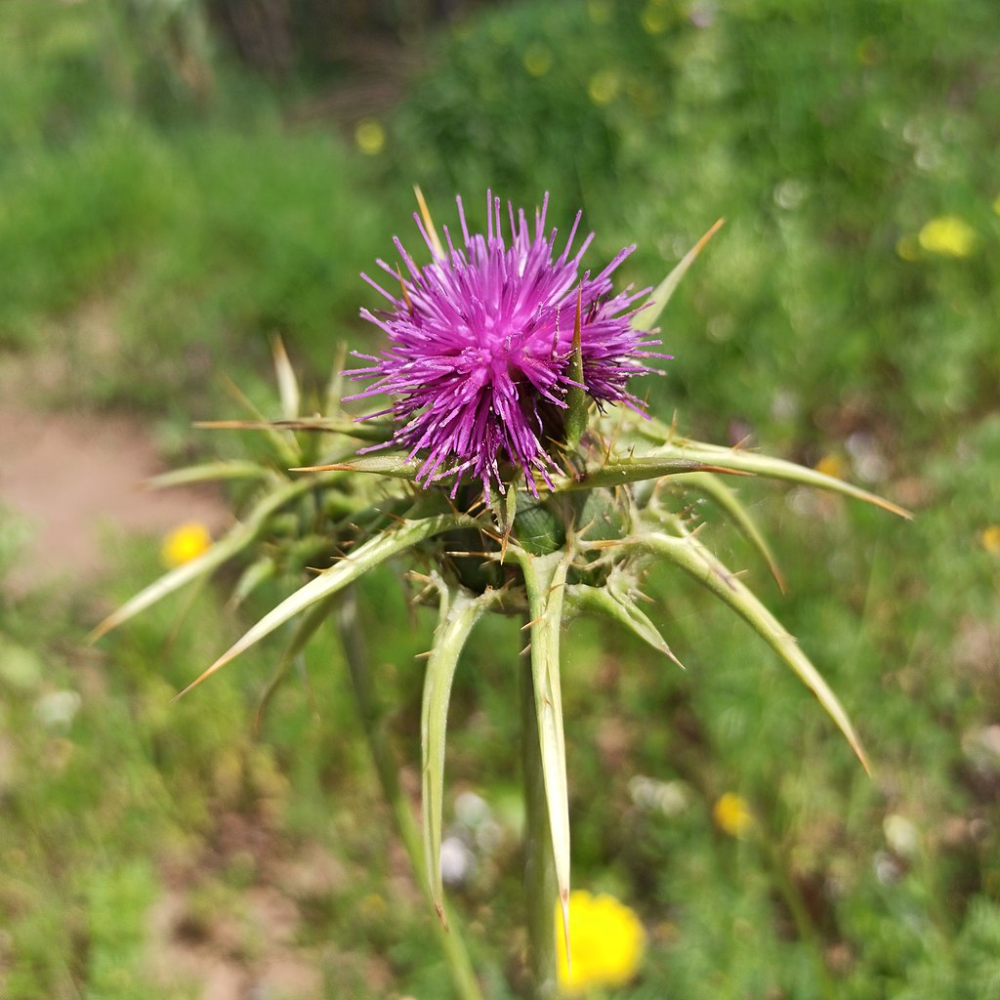
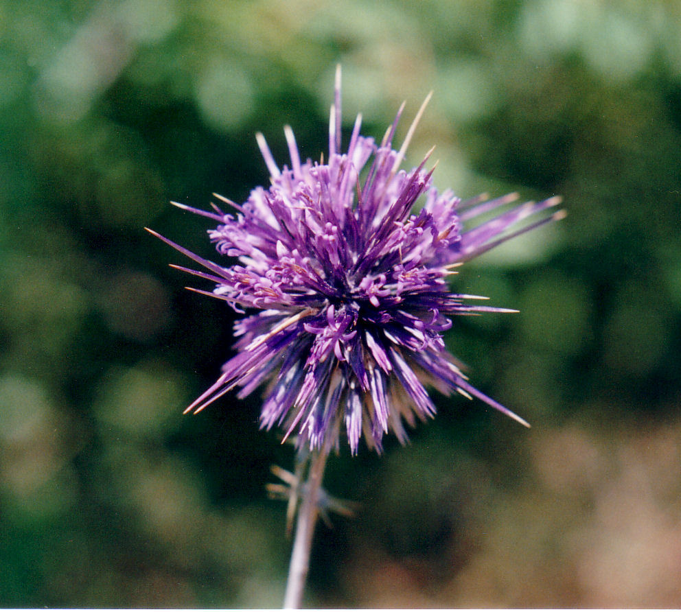
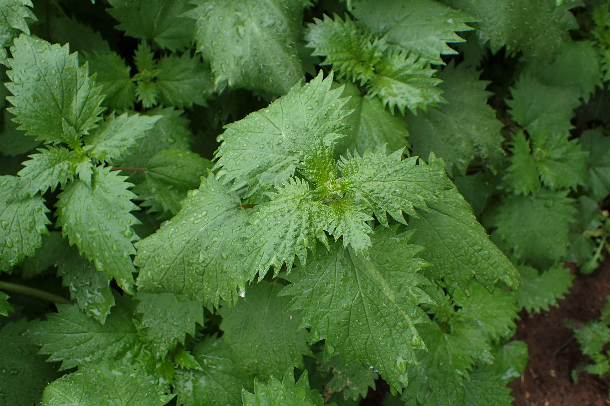
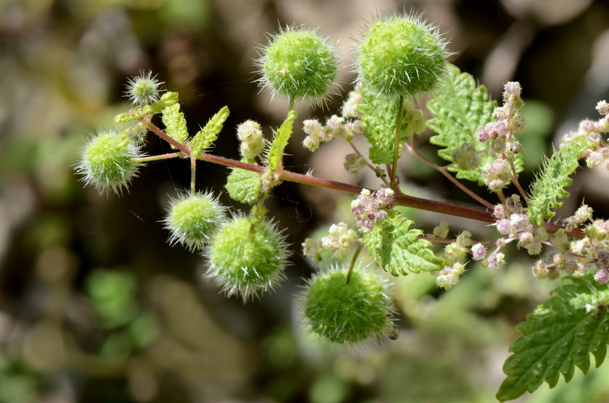

# Plants and Trees in the Bible

## License Information

Plants and Trees in the Bible © United Bible Societies, 2025. Adapted from: <cite>Each According to its Kind: Plants and Trees in the Bible</cite>, by Robert Koops © 2012 United Bible Societies. This work is licensed under Creative Commons Attribution-ShareAlike 4.0 International (<a href="https://creativecommons.org/licenses/by-sa/4.0/">https://creativecommons.org/licenses/by-sa/4.0/</a>).

--------------------------------

## 标题：荆棘、蒺藜、树莓和石南 (id: FLORA:6.2)

6\.2 标题：荆棘、蒺藜、树莓和石南
===================

圣经大约有二十多个指荆棘和多刺植物的希伯来文和希腊文名称，而圣地至少有七八十种这类植物。若要把这些名称与植物对应起来，简直比花的对应难度还要大。有些情况下，某个词语可能根本不是指一种特定的植物，但我们甚至不确知哪些词语是统称。如果使用次数越多意味着该词越有可能是统称，那么希伯来文*qots* 和希腊文*akantha* 是最常用来指荆棘和多刺植物的词语。

在大多数情况下，我们根本不知道这些词语是指多刺植物中的哪一种。在关于野生乔木和灌木的讨论中（参[1\.2 欧洲枸杞 (boxthorn)](#FLORA:1.2) ），我们已经谈到了欧洲枸杞（学名*Lycium europaeum* ）和滨枣（基督刺；学名*Ziziphus spina\-christi* ）。在本章，我们会讨论其他的品种。我们对这些圣经植物的了解是基于以下两个信息源：（1）古植物学，即关于古时有哪些植物可能生长在中东的研究；（2）相关语言中的同源词。我们研究同源词的原因是：尽管希伯来文不常使用已有几百年之久，但这些植物的阿拉伯文和叙利亚文名称可能一直沿用至今，并且很多名称与希伯来文名称相似，这可能会提供一些线索，让我们知道希伯来文可能指的是什么植物。

到目前为止，我们还没有讨论植物用作地名或人名的情况，但值得一提的是，荆棘类植物在这些名称中占有一席之地；例如，在[GEN 4:23](https://ref.ly/Gen4:23) 中，拉麦妻子的名字"亚大"和"洗拉"其实是有刺植物的名称。至于名字有没有可能影响她们的性格和行为，则留给读者见仁见智。无论如何，希伯来文读者在读到拉麦的故事时，一定会注意到这一点。同样，希伯来文名字"沙密"的意思是"多刺的"，尽管这个词在有些语境中被译为"钻石"或"金刚钻"（如[JER 17:1](https://ref.ly/Jer17:1) ）。希伯来文*qots* 的意思是"有刺灌木"，出现在"哥斯"和"哈歌斯"这两个人名中；《历代志上》、《以斯拉记》和《尼希米记》提到了这两个人。

生物学家对枝刺（thorns）、叶刺（spines）和皮刺（prickles）做了明确的区分。枝刺由树枝变态发育而来，叶刺由树叶变态发育而来，而皮刺通常是叶子上的微小突起，尤其是在较小的植物上。英文也用"thorns"来指带刺的树或灌木。蒺藜是叶子边缘有尖刺的开花植物，分多个属，大多是菊科植物（学名*Asteraceae* ）。荨麻隶于荨麻属（学名*Urtica* ），几乎所有荨麻属植物的茎和叶上都有刺毛。刺痛是由这种植物分泌的毒素引起的。我们接下来讨论"石南"和"树莓"。

* **Associated Passages:** 创世记 4:23; 耶利米书 17:1

## 标题：蒺藜（thistles） (id: FLORA:6.2.1)

6\.2\.1 标题：蒺藜（thistles）
=======================

经文出处
----

Hebrew 来：בַּרְקָן (音译：barqan)

[JDG 8:7](https://ref.ly/Judg8:7), [JDG 8:16](https://ref.ly/Judg8:16)

Hebrew 来：גַּלְגַּל (音译：galgal)

[PSA 83:14](https://ref.ly/Ps83:14), [ISA 17:13](https://ref.ly/Isa17:13)

Hebrew 来：דַּרְדַּר (音译：dardar)

[GEN 3:18](https://ref.ly/Gen3:18), [HOS 10:8](https://ref.ly/Hos10:8)

Hebrew 来：חוֹחַ (音译：choach)

[1SA 13:6](https://ref.ly/1Sam13:6), [2KI 14:9](https://ref.ly/2Kgs14:9), [2KI 14:9](https://ref.ly/2Kgs14:9), [2CH 25:18](https://ref.ly/2Chr25:18), [2CH 25:18](https://ref.ly/2Chr25:18), [JOB 31:40](https://ref.ly/Job31:40), [PRO 26:9](https://ref.ly/Prov26:9), [SNG 2:2](https://ref.ly/Song2:2), [ISA 34:13](https://ref.ly/Isa34:13), [HOS 9:6](https://ref.ly/Hos9:6)

讨论
--

有些经文的上下文表明，圣经中的一些植物可能是蒺藜，在希伯来文中主要用*barqan* 、*dardar* 和*choach* 来指称。然而，*galgal* 、*sirah* 和*qots* 等其他希伯来文词语也可能是指蒺藜。以下可能是圣经中提到的一些蒺藜：

*风滚蓟 (Ray Pritz (UBS))*

**风滚蓟** （学名*Gundelia tournefortii* ）是广泛分布在中东地区的一种蓟属植物；早春时候，这种植物的幼苗会被当作蔬菜来吃。然而，在植株成熟后，叶子会变得又干又尖，并且整棵植物也会变成球形。到了一定的时候，茎会折断，植物变成一棵"风滚草"在风中滚动，同时散播种子。这种植物在阿拉伯文中被称为*akub* 或*ka’aub* 。地名"Akov"可能就源于这种植物。

在[PSA 83:14](https://ref.ly/Ps83:14) （《和》83:13）和[ISA 17:13](https://ref.ly/Isa17:13) 中，希伯来文*galgal* 可能是指风滚蓟或猪毛菜（又名俄罗斯蓟或风滚草；学名*Salsola kali* ；参[5\.2\.2 梭梭（猪毛菜属\[Salsola]、盐角草属\[Salicornia]）（hammada \[Salsola, Salicornia]）](#FLORA:5.2.2) ）。猪毛菜和风滚蓟一样呈球形，干了之后会断，被强风吹着翻滚。

*奶蓟 (Ray Pritz (UBS))*

**奶蓟** （学名*Silybum marianum* ），又称为玛丽蓟、圣玛丽草、圣蓟或水飞蓟，分布在南欧、北非和中东，一年生或两年生草本植物，高1—2米（3—7英尺），与其他蓟属植物一样长着裂开的叶子和尖刺。奶蓟每根茎上长一个头状花序，上面集生许多粉色或紫色的小花，形成一朵大花。有些人相信，从奶蓟种子中提取的一种化学物质（水飞蓟素）可以增强肝功能，被用来治疗肝硬化、肝炎和胆囊疾病。北美和南美有水飞蓟属（学名*Silybum* ）的近缘植物。

*叙利亚蓟 (באדיבות הצלם \- ניר אוהד (Wikimedia Commons))*

**叙利亚蓟** （学名*Notobasis syriaca* ）原产于地中海地区，从加那利群岛起，经摩洛哥向东，一直到埃及、伊朗和阿塞拜疆都有，也生长在欧洲的地中海沿岸。祖海里认为，这种蓟可能就是基甸责打疏割长老所用的*barkan* （[JDG 8:7](https://ref.ly/Judg8:7); [JDG 8:16](https://ref.ly/Judg8:16) ）。叙利亚蓟是一年生植物，可长到1米（3英尺）高，叶片呈螺旋状排列，深裂，灰绿色中带白色叶脉，边缘和顶端有尖刺。花瓣紫色，周围有尖刺。

*金黄蓟 (Chenspec (Wikimedia Commons))*

**金黄蓟** （学名*Scolymus maculatus* ；又称普通蓟或牡蛎蓟）是一种一年生或多年生植物，可长到1米（3英尺）高，花为亮黄色。与其他蓟属植物一样，叶子边缘有尖刺。

*蓝刺头 (Ray Pritz (UBS))*

**伊比利亚蓟** （学名*Centaurea iberica* ）又称针刺矢车菊、星蓟或西班牙蓟。祖海里认为，希伯来文*dardar* 可能是指这种蓟，但它不是田地里的杂草，因此不符合[GEN 3:18](https://ref.ly/Gen3:18) 的语境。赫珀（Hepper）则认为有可能是腾红花（学名*Carthamus tenuis* ）、克里特刺芹（学名*Eryngium creticum* ）、芒柄花（学名*Ononis antiquorum* ），或牧豆树（学名*Prosopis farcta* ）。另外，也有可能是风滚蓟、蓝刺头（学名*Echinops adenocaulus* ）和苏格兰大翅蓟（学名*Onopordum cynarocephalum* ）。

翻译
--

法语地区的翻译者可能知道一种叫做*artichout sauvage* （"野生菜蓟"）的蓟属植物，在葡萄牙文中称为*cardo leiteiro* ，在西班牙文中称为*cardo de Maria* 或*cardo lechero* 。某些地区的翻译者可能知道蓟属植物。如果不知道，译为任何一种惹人厌的植物，尤其是有刺的植物，就足够了。

翻译者需要知道，"荆棘和蒺藜"等类短语是一种修辞手法，称为"词对"，目的是强调所描述的情形很严重、很棘手。例如亚当在伊甸园中可悲的选择所导致的后果（[GEN 3:18](https://ref.ly/Gen3:18) ），或临到撒玛利亚拜偶像之人的惩罚（[HOS 10:8](https://ref.ly/Hos10:8) ）。由于这些都是修辞性的段落，翻译者要尽量表达出整个短语的强烈语气，而希伯来文中的植物具体是什么并不是这里的重点。如果找不到一个人所熟知的、指荆棘类植物的特定词汇，翻译者可以使用"令人讨厌的多刺植物"或"各样的荆棘"之类短语，来表达负面的意思。另外，如果没有带刺植物，也可以使用农民认为对庄稼具有破坏性的任何植物。请注意英文译本在[GEN 3:18](https://ref.ly/Gen3:18) 中的差异：NJB (New Jerusalem Bible (1985)) 译为"brambles and thistles"（"树莓和蒺藜"），GNB (Good News Bible) 译为"weeds and thorns""杂草和荆棘"。

* **Associated Passages:** 士师记 8:7; 士师记 8:16; 诗篇 83:14; 以赛亚书 17:13; 创世记 3:18; 何西阿书 10:8; 撒母耳记上 13:6; 列王纪下 14:9; 历代志下 25:18; 约伯记 31:40; 箴言 26:9; 雅歌 2:2; 以赛亚书 34:13; 何西阿书 9:6

## 标题：荨麻（nettles） (id: FLORA:6.2.2)

6\.2\.2 标题：荨麻（nettles）
======================

经文出处
----

Hebrew 来：חָרוּל (音译：charul)

[JOB 30:7](https://ref.ly/Job30:7), [PRO 24:31](https://ref.ly/Prov24:31), [ZEP 2:9](https://ref.ly/Zeph2:9)

Hebrew 来：סָרָב (音译：sarav)

[EZK 2:6](https://ref.ly/Ezek2:6)

Hebrew 来：סִרְפַּד (音译：sirpad)

[ISA 55:13](https://ref.ly/Isa55:13)

Hebrew 来：קִמּוֹשׂ (音译：qimmos)

[PRO 24:31](https://ref.ly/Prov24:31), [ISA 34:13](https://ref.ly/Isa34:13), [HOS 9:6](https://ref.ly/Hos9:6)

讨论
--

*荨麻 (Krzysztof Ziarnek, Kenraiz (Wikimedia Commons))*

*小球荨麻 (Pancrat (Wikimedia Commons))*

 荨麻有30—45种，隶于荨麻科（学名*Urtica* ），主要分布在世界上的温带地区。以色列常见的荨麻有3种，可能在圣经时期就已存在了，分别是：尾尖荨麻（学名*Urtica caudata* 、*Urtica membranacea* ）、罗马荨麻（学名*Urtica pilulifera* ；又称小球荨麻）、欧荨麻（学名*Urtica urens* ；又称异株荨麻）。大多数荨麻是多年生植物，有刺毛。希伯来文词根*s\-r\-f* 和*ch\-r\-h* 都是"灼烧"或"灼热"的意思，被荨麻刺过的人很能意会这一点。有一种荨麻的阿拉伯文名称在以色列是*chorreig* ，在埃及是*sorbei* 。

特殊意义
----

上面列出的所有经文都出现在修辞语境中，重点是植物多刺或刺痛人。荨麻一直以来都是许多农场的公害。它们很容易在废弃了的居住地发芽生长，经常和财狼、猫头鹰一起被援引，来描述一个国家被敌人摧毁，变为荒场的景象。今天，很多地方的人会吃嫩荨麻的尖。荨麻的提取物用于治疗关节炎和花粉热，也用作洗发水的一种去屑成分。

翻译
--

荨麻分布在远东、亚洲、欧洲和北美洲。这些地区的翻译者可以用一个专称，也可以采用一个包含所有带茎刺、叶刺、针刺或倒刺的荆棘类植物的统称。如果要在脚注中补充音译，可以考虑法文*orties* 、葡萄牙文*urtiga* 、西班牙文*ortiga* ，以及阿拉伯文*angura* 或*nabat* 或*akub* 。

* **Associated Passages:** 约伯记 30:7; 箴言 24:31; 西番雅书 2:9; 以西结书 2:6; 以赛亚书 55:13; 以赛亚书 34:13; 何西阿书 9:6

## 标题：其他带刺植物（荆棘、树莓和石南）（other thorny plants [thorns, brambles, briers]） (id: FLORA:6.2.3)

6\.2\.3 标题：其他带刺植物（荆棘、树莓和石南）（other thorny plants \[thorns, brambles, briers]）
============================================================================

经文出处
----

Hebrew 来：חֵדֶק (音译：chedeq)

[PRO 15:19](https://ref.ly/Prov15:19), [MIC 7:4](https://ref.ly/Mic7:4)

Hebrew 来：נַעֲצוּץ (音译：na‘atsuts)

[ISA 7:19](https://ref.ly/Isa7:19), [ISA 55:13](https://ref.ly/Isa55:13)

Hebrew 来：סִירָה (音译：sirah)

[ECC 7:6](https://ref.ly/Eccl7:6), [ISA 34:13](https://ref.ly/Isa34:13), [HOS 2:8](https://ref.ly/Hos2:8), [NAM 1:10](https://ref.ly/Nah1:10)

Hebrew 来：סַלּוֹן, סִלּוֹן (音译：sallon/sillon)

[EZK 2:6](https://ref.ly/Ezek2:6), [EZK 28:24](https://ref.ly/Ezek28:24)

Hebrew 来：צֵן, צְנִינִים (音译：tsen, tseninim)

[NUM 33:55](https://ref.ly/Num33:55), [JOS 23:13](https://ref.ly/Josh23:13), [JOB 5:5](https://ref.ly/Job5:5), [PRO 22:5](https://ref.ly/Prov22:5)

Hebrew 来：קוֹץ (音译：qots)

[GEN 3:18](https://ref.ly/Gen3:18), [EXO 22:5](https://ref.ly/Exod22:5), [JDG 8:7](https://ref.ly/Judg8:7), [JDG 8:16](https://ref.ly/Judg8:16), [2SA 23:6](https://ref.ly/2Sam23:6), [PSA 118:12](https://ref.ly/Ps118:12), [ISA 32:13](https://ref.ly/Isa32:13), [ISA 33:12](https://ref.ly/Isa33:12), [JER 4:3](https://ref.ly/Jer4:3), [JER 12:13](https://ref.ly/Jer12:13), [EZK 28:24](https://ref.ly/Ezek28:24), [HOS 10:8](https://ref.ly/Hos10:8)

Hebrew 来：שֵׂךְ (音译：sek)

[NUM 33:55](https://ref.ly/Num33:55)

Hebrew 来：שַׁיִת (音译：shayith)

[ISA 5:6](https://ref.ly/Isa5:6), [ISA 7:23](https://ref.ly/Isa7:23), [ISA 7:24](https://ref.ly/Isa7:24), [ISA 7:25](https://ref.ly/Isa7:25), [ISA 9:17](https://ref.ly/Isa9:17), [ISA 10:17](https://ref.ly/Isa10:17), [ISA 27:4](https://ref.ly/Isa27:4)

Hebrew 来：שָׁמִיר (音译：shamir)

[ISA 5:6](https://ref.ly/Isa5:6), [ISA 7:23](https://ref.ly/Isa7:23), [ISA 7:24](https://ref.ly/Isa7:24), [ISA 7:25](https://ref.ly/Isa7:25), [ISA 9:17](https://ref.ly/Isa9:17), [ISA 10:17](https://ref.ly/Isa10:17), [ISA 27:4](https://ref.ly/Isa27:4), [ISA 32:13](https://ref.ly/Isa32:13)

Greek 希：ἄκανθα (音译：akantha)

[MAT 7:16](https://ref.ly/Matt7:16), [MAT 13:7](https://ref.ly/Matt13:7), [MAT 13:7](https://ref.ly/Matt13:7), [MAT 13:22](https://ref.ly/Matt13:22), [MAT 27:29](https://ref.ly/Matt27:29), [MRK 4:7](https://ref.ly/Mark4:7), [MRK 4:7](https://ref.ly/Mark4:7), [MRK 4:18](https://ref.ly/Mark4:18), [LUK 6:44](https://ref.ly/Luke6:44), [LUK 8:7](https://ref.ly/Luke8:7), [LUK 8:7](https://ref.ly/Luke8:7), [LUK 8:14](https://ref.ly/Luke8:14), [JHN 19:2](https://ref.ly/John19:2), [HEB 6:8](https://ref.ly/Heb6:8), [SIR 28:24](https://ref.ly/Sir28:24)

Greek 希：ἀκάνθινος (音译：akanthinos)

[MRK 15:17](https://ref.ly/Mark15:17), [JHN 19:5](https://ref.ly/John19:5)

Greek 希：βάτος (音译：batos)

[MRK 12:26](https://ref.ly/Mark12:26), [LUK 6:44](https://ref.ly/Luke6:44), [LUK 20:37](https://ref.ly/Luke20:37), [ACT 7:30](https://ref.ly/Acts7:30), [ACT 7:35](https://ref.ly/Acts7:35)

Greek 希：ῥάμνος (音译：ramnos)

[LJE 1:70](https://ref.ly/EpJer1:70)

Greek 希：τρίβολος (音译：tribolos)

[MAT 7:16](https://ref.ly/Matt7:16), [HEB 6:8](https://ref.ly/Heb6:8)

Latin 拉：spina

Latin 拉：spina

[2ES 16:33](https://ref.ly/2Esd16:33), [2ES 16:78](https://ref.ly/2Esd16:78)

讨论
--

这里，我们把9个希伯来文词语、5个希腊文词语和1个拉丁文词语放在一起，本来还要把希伯来文*‘atad* 放在这里，但是因为这种植物有树那么大，因此我们把它放到了第1章（参[1\.2 欧洲枸杞 (boxthorn)](#FLORA:1.2) ）。另外，希伯来文*barqan* 也可以放在这里讨论，但我们认为这个词是指蒺藜（参[6\.2\.1 蒺藜 (thistles)](#FLORA:6.2.1) ）。赫珀认为，*barqan* 可能是指枸杞的枝子。下面讨论的希伯来文和希腊文词语在英文中通常译为"thorn"（"荆棘"）、"bramble"（"树莓"）或"brier"（"石南"）。"石南"和"树莓"这两个词语有专门的用法。树莓专指蔷薇科（悬钩子属；学名*Rubus* ）中的有刺植物，包括黑莓和覆盆子，这两种植物都是欧洲和北美洲常见的食用植物。石南可能是指一种开粉色花朵的玫瑰，也叫野蔷薇或多花蔷薇，或者是指美国东部的一种多刺藤类植物，名叫菝葜、绿蔷薇等。

*chedeq*

提到这个希伯来文词语的两处经文都与栅栏或篱笆（*mesukah* ）有关。[PRO 15:19](https://ref.ly/Prov15:19) 第一行的字面意思是"懒惰人的道路像荆棘（*chedeq* ）篱笆"。[MIC 7:4](https://ref.ly/Mic7:4) 第一行说"他们当中最好的，不过像石南（*chedeq* ）"，与"他们最正直的，不过如荆棘篱笆"平行。[ISA 5:5](https://ref.ly/Isa5:5) 提到了带篱笆的葡萄园。这个篱笆可能是用石头砌成的，但是顶上可能铺了多刺地榆或基督刺的枝子。[HOS 2:8](https://ref.ly/Hos2:8) （《和》2:6）提到上帝用"荆棘"（*sirah* ）堵塞顽梗任性的以色列人的道路。

*na‘atsuts*

这个希伯来文词语在《以赛亚书》中出现了两次。[ISA 7:19](https://ref.ly/Isa7:19) 说，苍蝇和蜜蜂将停在"荆棘丛"（*na‘atsuts* ）中。后来，在关于新以色列的异象中，[ISA 55:13](https://ref.ly/Isa55:13) 宣告佳美的香柏树必代替荆棘丛（*na‘atsuts* ），芬芳的桃金娘树必代替石南（*sirpad* ）。

*sirah*

出现这个希伯来文词语的两处经文是：[ECC 7:6](https://ref.ly/Eccl7:6) （"好像锅子下面烧荆棘［*sirah* ］的爆声……"），以及[HOS 2:8](https://ref.ly/Hos2:8) （"因此，我要用荆棘堵塞她的道［*sirah* ］"；《和》2:6）。根据祖海里的意见，*sirah* 可能指多刺植物或多刺地榆（学名*Sarcopoterium spinosum* ）。现今，与这个词语相关联的阿拉伯文*sir* /*thir* 所指的植物仍被用来修筑篱笆，以及作为烹饪和石灰窑的燃料。

*sallon* /*sillon*

提到这个希伯来文词语的两处经文都出自《以西结书》。在[EZK 2:6](https://ref.ly/Ezek2:6) 中，该词与*sarav* 组成一个词对："虽有石南（*sarav* ）和荆棘（*sallon* ）在你那里……。"[EZK 28:24](https://ref.ly/Ezek28:24) 宣告，在复兴后的以色列，"那里必不再有石南（*sillon* ）刺人，也不再有荆棘（*qots* ）伤害他们。"

*tsen* 、*tseninim*

希伯来文单数词*tsen* 有两次指称植物，还有一次出现在[AMO 4:2](https://ref.ly/Amos4:2) 中，意为"钩子"。[PRO 22:5](https://ref.ly/Prov22:5) a说，"乖僻人的路上有荆棘（*tsen* ）和网罗。"赫珀认为，这里可能是指正树莓（黑莓；学名*Rubus sanguineus* ；法文*mûre* 、*mûrier* ，西班牙文*zarza* ）。[JOB 5:5](https://ref.ly/Job5:5) 说，"他的庄稼被饥饿的人吃尽了，就是在荆棘（*tsen* ）里的也抢去了……。"关于这节难解经文的讨论，参阅下文。在[NUM 33:55](https://ref.ly/Num33:55); [JOS 23:13](https://ref.ly/Josh23:13) 中，希伯来文复数词*tseninim* 是一个隐喻："以色列的敌人将像他们身上的刺。"

*qots*

这个词可能是希伯来文中最常用来表示荆棘的词语，共出现了12次，其中6次与*barqan* 、*dardar* 、*sillon* 或*shamir* 组成词对。

*sek*

这个希伯来文词语只在[NUM 33:55](https://ref.ly/Num33:55) 中出现过1次，经文说，迦南地的居民"必成为你们眼中的刺（*sek* ），肋下的荆棘（*tseninim* ）。"然而，关于*sek* 的含义，有几个相关的词语为我们提供了线索：在[JOB 40:31](https://ref.ly/Job40:31) （《和》41:7）中，*sukkah* 指鱼叉，而*sakkin* 意为"刀"。

*shayith*

这个希伯来文词语出现了7次，每次都与*shamir* 组成词对，且仅出现在《以赛亚书》中。

*shamir*

这个希伯来文词语在《以赛亚书》中出现了8次，指植物，其中7次与*shayith* 平行。RSV (Revised Standard Version (1952)) 通常把这个词对译为"briers \[*shamir* ] and thorns \[*shayith* ]"（"石南和荆棘"）。在[ISA 10:17](https://ref.ly/Isa10:17) 中，这两个希伯来文词语的顺序调换了，因此RSV (Revised Standard Version (1952)) 译为"thorns and briers"（"荆棘和石南"）。在[JER 17:1](https://ref.ly/Jer17:1) 、[JER 17:1](https://ref.ly/Jer17:1) 、[EZK 3:9](https://ref.ly/Ezek3:9) 和[ZEC 7:12](https://ref.ly/Zech7:12) 中，RSV (Revised Standard Version (1952)) 把*shamir* 译为"diamond"（"钻石"）或"adamant"（"金刚钻"），这是一种坚硬的石头。"沙密"这个名字在[JOS 15:48](https://ref.ly/Josh15:48) 和[JDG 10:1](https://ref.ly/Judg10:1); [JDG 10:2](https://ref.ly/Judg10:2) 中是地名，在[1CH 24:24](https://ref.ly/1Chr24:24) 中是人名。

*akantha*

这个希腊文词语出现在[MAT 7:16](https://ref.ly/Matt7:16) b，经文反问："岂能在荆棘（*akantha* ）上摘葡萄呢？岂能在蒺藜（*tribolos* ）里摘无花果呢？"有意思的是，[LUK 6:44](https://ref.ly/Luke6:44) 中的平行经文保留了*akantha* ，但用*batos* （"树莓灌木"）替代了*tribolos* 。在[HEB 6:8](https://ref.ly/Heb6:8) 中，*akantha* 又和*tribolos* 构成词对。*Akantha* 也出现在撒种的比喻中（[MAT 13:7](https://ref.ly/Matt13:7); [MAT 13:7](https://ref.ly/Matt13:7); [MAT 13:22](https://ref.ly/Matt13:22); [MRK 4:7](https://ref.ly/Mark4:7); [MRK 4:7](https://ref.ly/Mark4:7); [MRK 4:18](https://ref.ly/Mark4:18); [LUK 8:7](https://ref.ly/Luke8:7); [LUK 8:7](https://ref.ly/Luke8:7); [LUK 8:14](https://ref.ly/Luke8:14) ）。[MAT 27:29](https://ref.ly/Matt27:29) 和[JHN 19:2](https://ref.ly/John19:2) 记载，兵丁把"荆棘（*akantha* ）冠冕"戴在耶稣的头上。几个世纪以来，学者们一直在猜测这几节经文中的*akantha* 指的是什么植物。林奈（Linnaeus）确信它就是叙利亚的基督刺（学名*Ziziphus spina\-christi* ），因此他把这种植物命名为"基督刺"。还有一些学者，特别是希伯来植物学家，则认为是多刺地榆（学名*Sarcopoterium spinosum* ），他们的理由是兵丁会用最容易找到的有刺植物。另外也可能是滨枣（学名*Paliurus spina\-christi* ）、枣莲（学名*Ziziphus lotus* ），或枸杞（学名*Lycium shawii* ；参[1\.2 欧洲枸杞 (boxthorn)](#FLORA:1.2) ）。我们相信，马太和约翰对这些荆棘出自哪种灌木并不感兴趣，所以他们在这里用了一个通称。

*akanthinos*

这个希腊文词语源于*akantha* ，在[MRK 15:17](https://ref.ly/Mark15:17); [JHN 19:5](https://ref.ly/John19:5) 中用来指称荆棘冠冕。该词似乎是一个通用词，意为"多刺的"或"用荆棘做成的"。

*batos*

在[EXO 3:2](https://ref.ly/Exod3:2); [EXO 3:3](https://ref.ly/Exod3:3); [EXO 3:4](https://ref.ly/Exod3:4) 中，《七十士译本》将著名的烧着的荆棘（希伯来文*seneh* ）译为希腊文*batos* ，并且在故事的复述中使用了这个词（[MRK 12:26](https://ref.ly/Mark12:26); [LUK 20:37](https://ref.ly/Luke20:37); [ACT 7:30](https://ref.ly/Acts7:30); [ACT 7:35](https://ref.ly/Acts7:35) ；参[1\.4 烧着的荆棘(burning bush)](#FLORA:1.4) ）。唯一能表明这个词可能表示有刺植物的线索是：路加在[LUK 6:44](https://ref.ly/Luke6:44) b把它与*akantha* 平行使用，"因为无花果不是从荆棘（*akantha* ）上摘来的，葡萄也不是从树莓灌木（*batos* ）里摘来的。"

*ramnos*

[LJE 1:70](https://ref.ly/EpJer1:70) 与[JER 10:5](https://ref.ly/Jer10:5) 相呼应；在[LJE 1:70](https://ref.ly/EpJer1:70) ，希腊文*ramnos* 指的是鸟类栖息的一种灌木。那么，RSV (Revised Standard Version (1952)) 的翻译者如何知道这是"荆棘丛"的呢？他们把[LJE 1:70](https://ref.ly/EpJer1:70) 中的*ramnos* 译作"thorn bush"（"荆棘丛"），可能是因为《七十士译本》的翻译者用*ramnos* 来翻译[JDG 9:14](https://ref.ly/Judg9:14); [JDG 9:15](https://ref.ly/Judg9:15) 中意为"树莓"的希伯来文*‘atad* 的缘故（参[1\.2 欧洲枸杞 (boxthorn)](#FLORA:1.2) ）。

*tribolos*

这个希腊文词语只在[MAT 7:16](https://ref.ly/Matt7:16); [HEB 6:8](https://ref.ly/Heb6:8) 出现过，译为"蒺藜"，两处都与*akantha* 构成词对。

*spina*

在[2ES 16:33](https://ref.ly/2Esd16:33); [2ES 16:78](https://ref.ly/2Esd16:78) 中，拉丁文*spina* 指生长在荒道上的荆棘。根据该处的语境，翻译者需要使用一个灌木的通称，这种灌木会阻挡道路，使人们不能轻易通过。

翻译
--

与蒺藜和荨麻的情况一样，其他有刺植物所在的上下文通常是修辞性的，翻译者可以自由使用恰当的文化对等词。许多时候，这些经文会出现词对（例如，"荆棘和蒺藜"、"荆棘和石南"），或者在平行句中出现同义词。在许多语言中，"有刺植物"语意域中可供选择的词汇可能没有希伯来文那么多，因此翻译者只能重复使用词汇，尽可能地保持一致。

[JDG 8:7](https://ref.ly/Judg8:7); [JDG 8:16](https://ref.ly/Judg8:16) ：这两节经文中有两个问题。首先，这里提到的植物是什么？其次，译为"鞭打"（*dush* ）的希伯来文动词是什么意思？基甸承诺会惩罚疏割人，用"荆棘"（*qots* ）和"石南"（*barqan* ）鞭打他们的身体。希伯来文动词*dush* 出现在其他地方时，意思是"打禾"、"践踏"或"打"。我们并不确定，这里是指基甸威胁用带刺植物的枝条责打疏割人，还是说这是一个比喻，实际意思是"我必处理你们的肉，就像农民在收获的季节打场一样，只是我要用带刺的枝条。"翻译者要记得，打谷的方式在过去和现在有许多种，比如用棍子打、用驴和牛踩、拖动打谷机来碾压等。我们可以设想，在农业发展的过程中，最初是用棍打，然后是用牲畜踩踏谷物，最后是发明打谷机。动词*dush* 起初是"打"的意思，随着技术的更新，它的意思变得更加具体。打谷机的底部有突出物，可以将谷物压碎并使外皮脱落（参WTH ，[1\.1\.8\.2 打谷机、脱粒板 (threshing board, sledge)](#REALIA:1.1.8.2) ）。因此，有些解经家认为*barqan* 在这里可能是指打谷机。然而，最简单的答案往往就是最好的答案；对于基甸的威胁，可能用一个意为"打"（"beat"；GNB (Good News Bible) ）或"鞭打"（"whip"；NCV (New Century Version) 、GW (God's Word Translation) ）的动词来翻译就足够了，不需要译为"践踏"（"trample"；NRSV (New Revised Standard Version (1989)) ）、"打谷"（"thresh"；NJPSV (New Jewish Publication Society Version) ），或"抽打"（"flail"；RSV (Revised Standard Version (1952)) 、REB (Revised English Bible (1989)) ）。把*dush* 译为"撕裂"（"tear"；NIV (New International Version (1984)) 、NLT (New Living Translation) 、NKJV (New King James Version (1982)) ），似乎超出了这个词的正常语义范围。尽管如此，作者使用了"你们的肉体"，而不是简单的"你们"，表明作者的意图可能不仅仅是"用某种工具打人"。因此，依循NIV (New International Version (1984)) 、NLT (New Living Translation) 和NKJV (New King James Version (1982)) 的译本也有一定的道理。

[JOB 5:5](https://ref.ly/Job5:5) ：这节经文说，上帝通过让穷人获得富人的财产，来给予富人以应得的报应。第二行似乎是说，"他们必抢去（富人的）庄稼，就是在荆棘（*tsinnim* ，即*tsen* 的复数）里的也抢去了。"有些解经家认为*tsinnim* 在这里是指荆棘，他们的理解是：这里或者是指田边长着多刺植物的地方，播种时有种子落到了那里（如GNB (Good News Bible) 、NCV (New Century Version) 、GW (God's Word Translation) ；参[MAT 13:7](https://ref.ly/Matt13:7) ）；或者是指用荆棘篱笆围起来的田地，这是很常见的。后一种情况的意思是，穷人甚至会穿过荆棘篱笆去夺取富人的粮食（如NLT (New Living Translation) 、FRCL (French Common Language Version (Bible en français courant)) ）。

有些解经家认为上述情况很奇怪，他们认为作者本来想说的不是"荆棘"，而是另一个词。REB (Revised English Bible (1989)) 和NJPSV (New Jewish Publication Society Version) 认为*tsinnim* 是*tsinna’* （篮子／背筐）的复数形式。NJPSV (New Jewish Publication Society Version) 译作"carrying it off in baskets"（英文直译："把它装进篮子里带走"），而REB (Revised English Bible (1989)) 是"stronger men seize it from the panniers"（"更强壮的人把它从背筐里拿走"）。这里译为"更强壮的人"，是因为翻译者把希伯来文*’el* 解作"强壮的人"，而不是介词"to"（"对、向"）。其他采用不同文本修订的解经家和译本把这一行翻译成"带到隐秘的地方去"（Dhorme，多尔姆）、"他把它带给饥饿的人"（Guillaume，纪尧姆）、"or God shall take it away by blight"（英文直译："上帝必使其枯萎，把它夺走"；NAB (New American Bible (1970)) ，带方括号），以及"God snatches it from their mouths"（"上帝将其从他们口中夺去"；NJB (New Jerusalem Bible (1985)) ）。《七十士译本》可能依循了另一份文本，译为"但他们必不能从灾难中得救"。有些解经家认为这一行无法翻译，因此将其删掉了。犹太解经家摩西艾泽曼（Moshe Eisemann）稍微作了以下解释："那些贫穷的拾穗者并不着急。他们不紧不慢地拾取麦穗，甚至从长着荆棘的地方或荆棘篱笆后面拾取，因为他们并不害怕会被人驱赶。"考虑到这一点，我建议依循GNB (Good News Bible) 和NCV (New Century Version) ，或NLT (New Living Translation) 和FRCL (French Common Language Version (Bible en français courant)) ，保留"荆棘"这个译法。

* **Associated Passages:** 箴言 15:19; 弥迦书 7:4; 以赛亚书 7:19; 以赛亚书 55:13; 传道书 7:6; 以赛亚书 34:13; 何西阿书 2:8; 那鸿书 1:10; 以西结书 2:6; 以西结书 28:24; 民数记 33:55; 约书亚记 23:13; 约伯记 5:5; 箴言 22:5; 创世记 3:18; 出埃及记 22:5; 士师记 8:7; 士师记 8:16; 撒母耳记下 23:6; 诗篇 118:12; 以赛亚书 32:13; 以赛亚书 33:12; 耶利米书 4:3; 耶利米书 12:13; 何西阿书 10:8; 以赛亚书 5:6; 以赛亚书 7:23; 以赛亚书 7:24; 以赛亚书 7:25; 以赛亚书 9:17; 以赛亚书 10:17; 以赛亚书 27:4; 马太福音 7:16; 马太福音 13:7; 马太福音 13:22; 马太福音 27:29; 马可福音 4:7; 马可福音 4:18; 路加福音 6:44; 路加福音 8:7; 路加福音 8:14; 约翰福音 19:2; 希伯来书 6:8; 德训篇 28:24; 马可福音 15:17; 约翰福音 19:5; 马可福音 12:26; 路加福音 20:37; 使徒行传 7:30; 使徒行传 7:35; 耶利米书信 1:70; 厄斯德拉下 16:33; 厄斯德拉下 16:78; 以赛亚书 5:5; 阿摩司书 4:2; 约伯记 40:31; 耶利米书 17:1; 以西结书 3:9; 撒迦利亚书 7:12; 约书亚记 15:48; 士师记 10:1; 士师记 10:2; 历代志上 24:24; 出埃及记 3:2; 出埃及记 3:3; 出埃及记 3:4; 耶利米书 10:5; 士师记 9:14; 士师记 9:15

