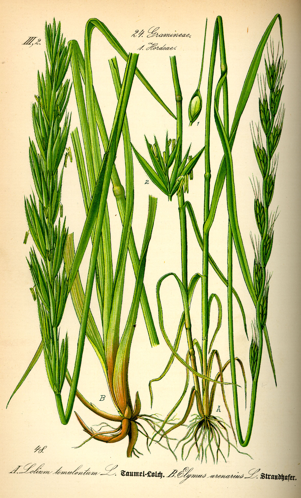

# Plants and Trees in the Bible

## License Information

Plants and Trees in the Bible © United Bible Societies, 2025. Adapted from: <cite>Each According to its Kind: Plants and Trees in the Bible</cite>, by Robert Koops © 2012 United Bible Societies. This work is licensed under Creative Commons Attribution-ShareAlike 4.0 International (<a href="https://creativecommons.org/licenses/by-sa/4.0/">https://creativecommons.org/licenses/by-sa/4.0/</a>).

--------------------------------

## 标题：杂草 (id: FLORA:6.3)

6\.3 标题：杂草
==========

圣经中提到有一种植物，其名字本身并没有多刺的意思。这种植物之所以不受欢迎是因为它顽固地生长在不该生长的地方。它就是福音书一个著名比喻中的"稗子"。

## 标题：杂草（稗子、毒麦）（weed [tare, darnel]） (id: FLORA:6.3.1)

6\.3\.1 标题：杂草（稗子、毒麦）（weed \[tare, darnel]）
==========================================

经文出处
----

Hebrew 来：בָּאְשָׁה (音译：ba’ashah)

[JOB 31:40](https://ref.ly/Job31:40)

Greek 希：ζιζάνιον (音译：zizanion)

[MAT 13:25](https://ref.ly/Matt13:25), [MAT 13:26](https://ref.ly/Matt13:26), [MAT 13:27](https://ref.ly/Matt13:27), [MAT 13:29](https://ref.ly/Matt13:29), [MAT 13:30](https://ref.ly/Matt13:30), [MAT 13:36](https://ref.ly/Matt13:36), [MAT 13:38](https://ref.ly/Matt13:38), [MAT 13:40](https://ref.ly/Matt13:40)

讨论
--

*毒麦 (Wikimedia Commons)*

[MAT 13:25](https://ref.ly/Matt13:25) 讲到仇敌把杂草（或稗子）的种子撒到麦子里。虽然圣地的田里有很多种有害的杂草，但希腊文*zizanion* 在这里最有可能指的是毒麦（学名*Lolium temulentum* ）。埃及坟墓和拉吉考古发掘的证据告诉我们，毒麦这种有害的杂草已经烦扰人们至少3000年了。毒麦的外形很像二粒小麦，两者很难区分。

希伯来文名词*ba’ashah* 只在[JOB 31:40](https://ref.ly/Job31:40) 中出现了一次，但它的动词形式在旧约出现过很多次，意思是"发臭"，就像腐烂的疮或尸体那样。这个名词实际上并不是指一种植物，它的字面意思是"发臭的东西"。然而在[JOB 31:40](https://ref.ly/Job31:40) 中，该词与希伯来文*choach* （"蒺藜"；参[6\.2\.1 蒺藜 (thistles)](#FLORA:6.2.1) ）平行，因此在这个上下文中有"发臭的／难闻的杂草"的意思。有词典将这个词解作一种叫做"臭草"的植物，但它在这节经文里的意思比较宽泛，指任何散发出臭味的杂草。

描述
--

*毒麦 (H. Zell (Wikimedia Commons))*

毒麦是一年生植物，分布在整个巴勒斯坦地区，植株高为30—60厘米（1—2英尺）。

特殊意义
----

圣经提到毒麦时，仅是一种有害的植物。不过，亚述人曾把毒麦入药。

翻译
--

圣经时期的农民在面对讨厌的杂草时会感到沮丧，农业地区的翻译者应该不难理解这一点。毒麦广为人知，因此具有很多名字（例如，法文*herbe a couteau* 、*herbe d’ivrogue* 、*ivraie* ，西班牙文*barrachuela* 、*cizaña* 、*cominillo* 、*joyo* 、*trigollo* ，葡萄牙文*joio* ）。翻译者如果不了解农村和农业，需要向农民讨教合适的译名。圣经提到的"假的麦子"可能会有文化上的对等词。若不然，在杂草的比喻中，翻译者可以采用"假的麦子"这类短语。

* **Associated Passages:** 约伯记 31:40; 马太福音 13:25; 马太福音 13:26; 马太福音 13:27; 马太福音 13:29; 马太福音 13:30; 马太福音 13:36; 马太福音 13:38; 马太福音 13:40

* **Associated ACAI Concepts:** Weed (ID: `flora:Weed`)
