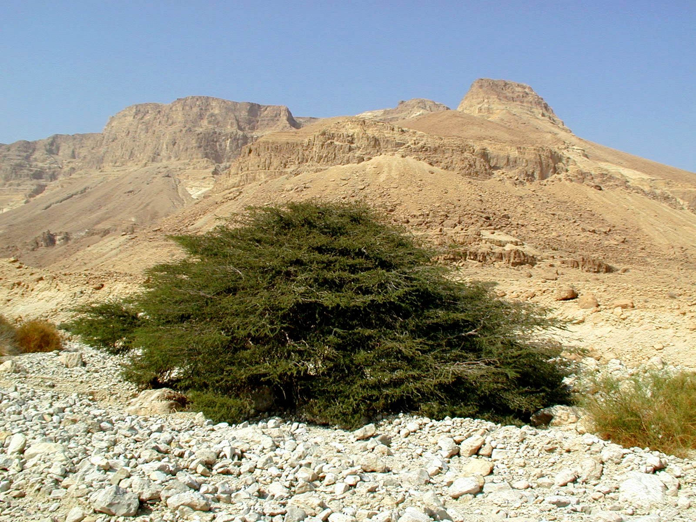

# Plants and Trees in the Bible

## License Information

Plants and Trees in the Bible © United Bible Societies, 2025. Adapted from: <cite>Each According to its Kind: Plants and Trees in the Bible</cite>, by Robert Koops © 2012 United Bible Societies. This work is licensed under Creative Commons Attribution-ShareAlike 4.0 International (<a href="https://creativecommons.org/licenses/by-sa/4.0/">https://creativecommons.org/licenses/by-sa/4.0/</a>).

--------------------------------

## 標題：金合歡樹（acacia） (id: FLORA:1.1)

1\.1 標題：金合歡樹（acacia）
====================

經文出處
----

Hebrew 來： שִׁטָּה (音譯： shittah)

[EXO 25:5](https://ref.ly/Exod25:5), [EXO 25:10](https://ref.ly/Exod25:10), [EXO 25:13](https://ref.ly/Exod25:13), [EXO 25:23](https://ref.ly/Exod25:23), [EXO 25:28](https://ref.ly/Exod25:28), [EXO 26:15](https://ref.ly/Exod26:15), [EXO 26:26](https://ref.ly/Exod26:26), [EXO 26:32](https://ref.ly/Exod26:32), [EXO 26:37](https://ref.ly/Exod26:37), [EXO 27:1](https://ref.ly/Exod27:1), [EXO 27:6](https://ref.ly/Exod27:6), [EXO 30:1](https://ref.ly/Exod30:1), [EXO 30:5](https://ref.ly/Exod30:5), [EXO 35:7](https://ref.ly/Exod35:7), [EXO 35:24](https://ref.ly/Exod35:24), [EXO 36:20](https://ref.ly/Exod36:20), [EXO 36:31](https://ref.ly/Exod36:31), [EXO 36:36](https://ref.ly/Exod36:36), [EXO 37:1](https://ref.ly/Exod37:1), [EXO 37:4](https://ref.ly/Exod37:4), [EXO 37:10](https://ref.ly/Exod37:10), [EXO 37:15](https://ref.ly/Exod37:15), [EXO 37:25](https://ref.ly/Exod37:25), [EXO 37:28](https://ref.ly/Exod37:28), [EXO 38:1](https://ref.ly/Exod38:1), [EXO 38:6](https://ref.ly/Exod38:6), [DEU 10:3](https://ref.ly/Deut10:3), [ISA 41:19](https://ref.ly/Isa41:19)

討論
--

*金合歡樹 (Ray Pritz (UBS))*

希伯來文*shittah* 的複數形式*shittim* 有時用作地名（[NUM 25:1](https://ref.ly/Num25:1) ，[NUM 33:49](https://ref.ly/Num33:49) ；[JOS 2:1](https://ref.ly/Josh2:1) ，[JOS 3:1](https://ref.ly/Josh3:1) ；[HOS 5:2](https://ref.ly/Hos5:2) ；[JOL 4:18](https://ref.ly/Joel4:18) ［《和》3:18］；[MIC 6:5](https://ref.ly/Mic6:5) ），說明這種樹廣泛分佈在西奈半島和巴勒斯坦南部。聖經中提到的金合歡樹有兩種：傘刺金合歡（學名*Acacia tortilis* ）和普通金合歡（學名*Acacia raddiana* ）。

傘刺金合歡（學名*Acacia tortilis* ）生長在炎熱的亞拉巴谷，而普通金合歡（學名*Acacia raddiana* ）通常分佈在西奈半島較為涼爽的地帶。另外一種金合歡樹（微白金合歡；學名*Acacia albida* ）分佈在以色列低地、沙崙平原和下加利利。以色列人建造帳幕時，唯一可用的樹木就是普通金合歡。哈魯范尼（Hareuveni）探討了如何在曠野中取得足夠的金合歡木，來製造帳幕所需的全部物件，包括貫通帳幕整面牆的長達15米（50英呎）的橫木。他確信，雖然大多數金合歡樹都比較矮小，但也有一些高度可及15米。然而，即使有15米高的金合歡樹，是否有足夠筆直的樹幹可以用來製作豎板上的橫木呢？我對此仍有懷疑。或許，他們可以把幾根短木拼接起來成為一根長木。事實上，可折疊的橫木更容易運輸。哈魯范尼認為，尼羅河上的船也是用金合歡木造的。（另參《人手所做之工：聖經中的物件》［WTH ］中的討論，[3\.15\.2\.3](#REALIA:3.15.2.3) \- [3\.15\.2\.3\.9\.1](#REALIA:3.15.2.3.9.1) ，特別是[3\.15\.2\.3\.5](#REALIA:3.15.2.3.5) 。）

描述
--

*金合歡花 (B. Attard (Wikimedia Commons))*

傘刺金合歡和普通金合歡都不算高，僅3—5米（10—17英呎），但是樹冠很寬廣。金合歡屬於含羞草科，長有尖刺，葉片細分如羽，淺黃色的小花一串串下垂。金合歡結的豆莢在乾燥後會捲起來。

翻譯
--

金合歡樹在非洲、阿拉伯半島、印度和澳大利亞的乾旱地區很常見，因此這些地區的翻譯者應該能夠找到當地的對等詞。帕爾格雷夫（Palgrave）僅僅在非洲南部就發現了43種金合歡樹。在尼日利亞、乍得、尼日爾等地使用的豪薩語中，至少有12個指稱金合歡樹的詞語。在這些語言中，翻譯者應該使用當地的一種金合歡樹的名稱作為譯詞，尤其以用於建築的樹種為佳。在其他沒有這些詞語的地方，翻譯者可以按照希伯來文（*shittah* ）或一種主要語言進行音譯，如*sunt* 、*talh* （阿拉伯文）或*akasiya* （英文／法文／西班牙文，源於拉丁文）。西非的翻譯者需要避免混淆「金合歡」（"acacia"）和「臘腸樹」（"cassia"），臘腸樹是當地一種常見的開黃花的樹。

* **Associated Passages:** 出埃及記 25:5; 出埃及記 25:10; 出埃及記 25:13; 出埃及記 25:23; 出埃及記 25:28; 出埃及記 26:15; 出埃及記 26:26; 出埃及記 26:32; 出埃及記 26:37; 出埃及記 27:1; 出埃及記 27:6; 出埃及記 30:1; 出埃及記 30:5; 出埃及記 35:7; 出埃及記 35:24; 出埃及記 36:20; 出埃及記 36:31; 出埃及記 36:36; 出埃及記 37:1; 出埃及記 37:4; 出埃及記 37:10; 出埃及記 37:15; 出埃及記 37:25; 出埃及記 37:28; 出埃及記 38:1; 出埃及記 38:6; 申命記 10:3; 以賽亞書 41:19; 民數記 25:1; 民數記 33:49; 約書亞記 2:1; 約書亞記 3:1; 何西阿書 5:2; 約珥書 4:18; 彌迦書 6:5

