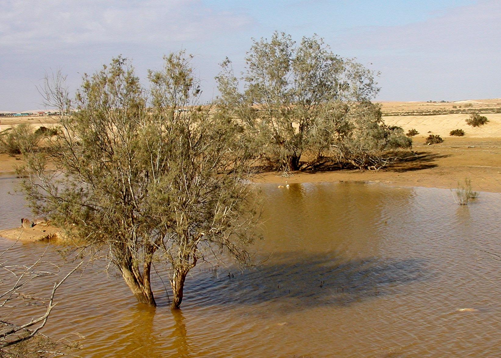

# Plants and Trees in the Bible

## License Information

Plants and Trees in the Bible © United Bible Societies, 2025. Adapted from: <cite>Each According to its Kind: Plants and Trees in the Bible</cite>, by Robert Koops © 2012 United Bible Societies. This work is licensed under Creative Commons Attribution-ShareAlike 4.0 International (<a href="https://creativecommons.org/licenses/by-sa/4.0/">https://creativecommons.org/licenses/by-sa/4.0/</a>).

--------------------------------

## 標題：羅騰樹（broom） (id: FLORA:1.3)

1\.3 標題：羅騰樹（broom）
==================

經文出處
----

Hebrew 來： רֹתֶם (音譯： rothem)

[1KI 19:4](https://ref.ly/1Kgs19:4), [1KI 19:5](https://ref.ly/1Kgs19:5), [JOB 30:4](https://ref.ly/Job30:4), [PSA 120:4](https://ref.ly/Ps120:4)

討論
--

*羅騰樹和山羊 (Michael Baranovsky (Wikimedia Commons))*

許多學者認為*rothem* 就是白羅騰樹（學名*Retama raetam* ），這是一種生長在聖地和阿拉伯半島的硬質沙漠灌木。早些時候，莫爾登克（Moldenke）主張*rothem* 是一種叫做狗棍（dog's club）的寄生植物。在以利亞逃離耶洗別的敘事中，[1KI 19:4](https://ref.ly/1Kgs19:4) 提到了羅騰，為這節經文前面的「曠野」一詞帶給人的荒涼景象補充了細節。學者從[PSA 120:4](https://ref.ly/Ps120:4) （「……羅騰木的炭火」）和[JOB 30:4](https://ref.ly/Job30:4) （「……羅騰樹的根為他們取暖」；RSV (Revised Standard Version (1952)) 直譯）這兩節經文提到的*rothem* 推斷，這種植物就是羅騰灌木，因為羅騰灌木的莖和葉裡有油，燒起來火很旺。[NUM 33:18](https://ref.ly/Num33:18); [NUM 33:19](https://ref.ly/Num33:19) 提到的地名利提瑪（意為「羅騰之地」）也可能與羅騰樹有關。白羅騰樹遍佈聖地的山區、多石的地方、溝壑和沙地，尤其在死海附近、基列、迦密山、敘利亞沙漠和腓尼基海岸等地更是常見。

描述
--

*羅騰花 (תמר מרום Pikiwiki Israel (Wikimedia Commons))*

白羅騰樹可長到2米（7英呎）高，與其說是矮樹，不如說是較大的叢生灌木。白羅騰樹有很多小枝子，葉子寥寥，一簇簇美麗的白花點綴在山坡之上。

翻譯
--

在[1KI 19:4](https://ref.ly/1Kgs19:4) ，NJB (New Jerusalem Bible (1985)) 使用了一個只有英國園丁才知道的名稱，把*rothem* 翻譯為"furze bush"（「荊豆叢」），又名"gorse"（「金雀花」）。但在21世紀，不瞭解植物學的城市居民對"gorse"和"furze"都不熟悉。同樣，德文通俗譯本GECL (German Common Language Version (Gute Nachricht Bibel)) 將其譯成*Ginsterstrauch* ，這個詞也不太常用。因此，一些英文現代譯本在《列王紀上》使用了比較一般性的表述，如 "large bush"（「大灌木叢」；CEV (Contemporary English Version) ）、"tree"（「樹」；GNB (Good News Bible) ）、"bush"（「灌木叢」；NCV (New Century Version) ）。在植物種類有具體名稱的地區，翻譯者可以選擇一種生長在乾旱貧瘠地區的灌木（這種灌木必須大到足以遮蔭），也可以音譯希伯來文（*rothem* ）或一種主要語言（如阿拉伯文*retem* ）。另外，翻譯者也可以使用「小樹」或「灌木」這樣的通稱。

在[PSA 120:4](https://ref.ly/Ps120:4) ，翻譯者可以使用當地一種燒起來很旺的木材，因為這裡的經文是修辭性的，需要用一個非常热的東西來作比喻。

[JOB 30:4](https://ref.ly/Job30:4) 提到的羅騰樹具有很大的文本和解經問題，所以在現代聖經譯本中出現了許多種譯法。RSV (Revised Standard Version (1952)) 譯作："they pick mallow and the leaves of bushes, and to warm themselves the roots of the broom"（英文直譯：「他們採摘錦葵和灌木的葉子，並用羅騰樹的根取暖」）。在GNB (Good News Bible) 和NIV (New International Version (1984)) 的譯文裡，這些可憐人「吃」羅騰樹的根。然而，根據可靠的資料，羅騰樹的根是有毒的。因此，莫爾登克提出，這裡必定是從羅騰樹的根部長出來的另外一種植物，即寄生的歐洲鎖陽（學名*Cynomorium coccineum* ）。然而，有充分的證據表明，作者想說的話是根部「被燒了」（如RSV (Revised Standard Version (1952)) 的譯文），而不是「被吃了」（如GNB (Good News Bible) 和NIV (New International Version (1984)) 的譯文）。對這節難解的經文，哈尼 庫恩（Hanni Kuhn）在《聖經翻譯者》（*The Bible Translator* ）中為翻譯者提供了三種譯法，這裡我們列出了其中兩種（第三種是根據莫爾登克提出的歐洲鎖陽，支持的學者較少，我們也不建議採納）：

1\. 他們採鹹草葉作食物，

燒羅騰樹的根來取暖。

這裡將最後一個希伯來文詞語的字母*l\-ch\-m\-m* 讀作*lchumam* （「給自己取暖」），對添加到希伯來文本中的元音作了一處改變，RSV (Revised Standard Version (1952)) 和Mft (Moffatt Translation (1926)) 採納了這種做法。（關於「鹹草」，參[3\.5\.10 濱藜（鹽草）（orache \[saltwort]）](#FLORA:3.5.10) ）

2\. 他們採鹹草葉作食物，

賣／做羅騰木炭來糊口。

這種譯法將*l\-ch\-m\-m* 讀作*lachmam* （「他們的餅／食物」）。哈魯范尼也支持這個觀點（第31—32頁）。

* **Associated Passages:** 列王紀上 19:4; 列王紀上 19:5; 約伯記 30:4; 詩篇 120:4; 民數記 33:18; 民數記 33:19

