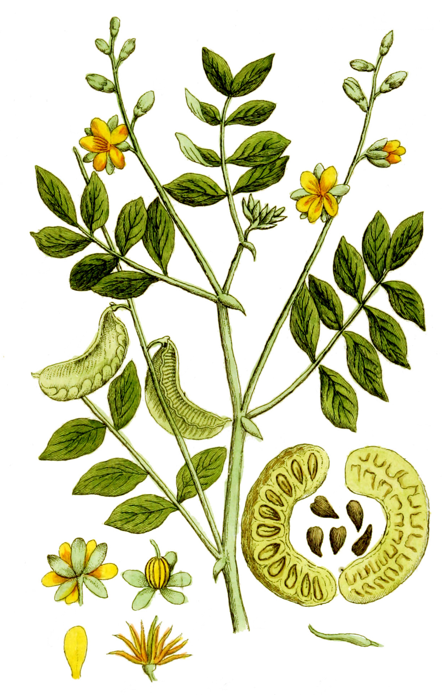

# Plants and Trees in the Bible

## License Information

Plants and Trees in the Bible © United Bible Societies, 2025. Adapted from: <cite>Each According to its Kind: Plants and Trees in the Bible</cite>, by Robert Koops © 2012 United Bible Societies. This work is licensed under Creative Commons Attribution-ShareAlike 4.0 International (<a href="https://creativecommons.org/licenses/by-sa/4.0/">https://creativecommons.org/licenses/by-sa/4.0/</a>).

--------------------------------

## 標題：燒著的荊棘（burning bush） (id: FLORA:1.4)

1\.4 標題：燒著的荊棘（burning bush）
===========================

經文出處
----

Hebrew 來： סְנֶה (音譯： seneh)

[EXO 3:2](https://ref.ly/Exod3:2), [EXO 3:2](https://ref.ly/Exod3:2), [EXO 3:2](https://ref.ly/Exod3:2), [EXO 3:3](https://ref.ly/Exod3:3), [EXO 3:4](https://ref.ly/Exod3:4), [DEU 33:16](https://ref.ly/Deut33:16)

討論
--

*番瀉樹叢 (Adolphus Ypey (Wikimedia Commons))*

如果一本關於聖經植物的書從頭到尾都沒有提到著名的「燒著的荊棘」，那將是不完整的，因為上帝就是在西奈曠野的這株「燒著的荊棘」中向摩西啟示他的聖名的。似乎我們對某樣事物掌握的證據越少，爭論就越激烈！關於「燒著的荊棘」，最被人認可的猜測是黑莓（學名*Rubus sanguineus* ）；然而，這是不合理的。儘管西奈山腳下的聖凱瑟琳修道院裡的修士們熱情地推崇這種詮釋，並在那裡種了一棵*Rubus sanguineus* ，可是除了這一株黑莓之外，沒有證據表明任何一種懸鈎子屬（學名*Rubus* ）植物曾生長在西奈半島，甚至是在以色列南部。阿拉伯金合歡樹（學名*Acacia nilotica* ）的情況可能也是這樣；儘管植物學家莫爾登克和特里斯特拉姆（Tristram）都認為「燒著的荊棘」就是這種植物，但卻沒有一處生長的痕跡。

祖海里認為*seneh* （「燒著的荊棘」）是番瀉樹叢（學名*Cassia senna* ），他強烈反對這裡的「荊棘」是一種懸鈎子（學名*Rubus* ）屬植物。他還反對阿拉伯金合歡樹（學名*Acacia nilotica* ）的可能性，因為*Acacia nilotica* 從來沒有在西奈半島生長過。其他可能的植物有山楂（果實為紅色），或一種金合歡灌木，其上長有紅花狀的寄生蟲。赫珀認為我們無法得知這裡的荊棘具體是什麼植物。他說，找尋某個樹種是徒勞的，這一事件應被視為「主的榮耀」的顯現，就像[2CH 7:1](https://ref.ly/2Chr7:1) 中的敘述，「耶和華臨在的榮光充滿了殿」（GNB (Good News Bible) 直譯）。從植物學的觀點，以下四種植物有可能生長在摩西時期的西奈山區，同時又最符合「燒著的荊棘」這段描述：

1\. 番瀉樹叢（學名*Cassia senna* ；阿拉伯文\*sene\*）；

2\. 山楂樹叢，其紅色的果實可能會使人聯想到火焰；

3\. 生有紅色金合歡桑寄生（學名*Loranthus acaciae* ）的任何一種金合歡屬植物；

4\. 生長在西奈山的氣囊豆（學名*Colutea istria* ），其鮮艷的黃色花朵讓人聯想到火焰。

描述
--

番瀉樹叢可能就是[EXO 3:2](https://ref.ly/Exod3:2); [EXO 3:2](https://ref.ly/Exod3:2); [EXO 3:2](https://ref.ly/Exod3:2); [EXO 3:3](https://ref.ly/Exod3:3); [EXO 3:4](https://ref.ly/Exod3:4) 提到的樹木，可長到1米（3英呎）高，葉小，開黃花，豆莢長約10厘米（4英吋），裡面有很多種子。

翻譯
--

注意，上述所有爭議都是關乎*seneh* 所指的具體樹種。然而，*seneh* 很有可能是一個像「灌木」這樣的統稱。遺憾的是，很多語言沒有表示矮樹或灌木的通用詞，只有「樹」和「草」。英文"bush"通常意為「矮樹、灌木叢」，但是在西非英文中，這個詞指的是無人居住的荒野，並且當地人每年會「焚燒荒野」。在西非的許多地方，翻譯者在翻譯「燒著的荊棘」這段經文時，會誤導人想起焚燒荒野這幅畫面；另外，[DEU 33:16](https://ref.ly/Deut33:16) 如果譯成"him that dwelt in the bush"，必定會讓許多西非人深感困惑，因為他們會理解為「住在無人居住的荒野裡面的人」。如果沒有表示「灌木」的詞語，翻譯者可能有必要使用「樹」一詞。為清楚表明荊棘燃燒是個神蹟，可以說「綠樹」或「多葉的樹」。[DEU 33:16](https://ref.ly/Deut33:16) 提到的*seneh* 似乎是指[EXO 3:0](https://ref.ly/Exod3:0) 所述事件（儘管NRSV (New Revised Standard Version (1989)) 將*seneh* 譯作"Sinai"「西奈」），並且大多數譯本都清楚說明了這種聯繫（如GNB (Good News Bible) 、NLT (New Living Translation) 、REB (Revised English Bible (1989)) 、NJPSV (New Jewish Publication Society Version) ）。

* **Associated Passages:** 出埃及記 3:2; 出埃及記 3:3; 出埃及記 3:4; 申命記 33:16; 歷代志下 7:1; 出埃及記 3:0

