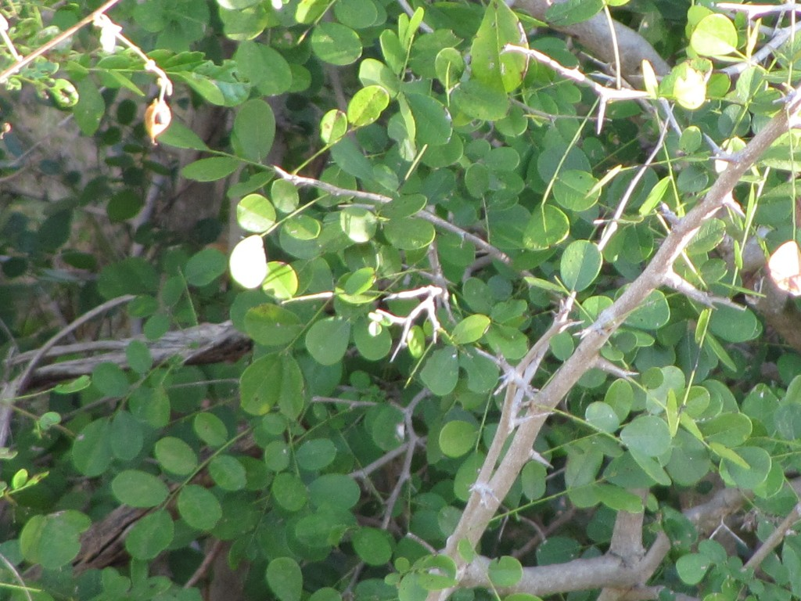

# Plants and Trees in the Bible

## License Information

Plants and Trees in the Bible © United Bible Societies, 2025. Adapted from: <cite>Each According to its Kind: Plants and Trees in the Bible</cite>, by Robert Koops © 2012 United Bible Societies. This work is licensed under Creative Commons Attribution-ShareAlike 4.0 International (<a href="https://creativecommons.org/licenses/by-sa/4.0/">https://creativecommons.org/licenses/by-sa/4.0/</a>).

--------------------------------

## 標題：黑檀木、烏木（ebony） (id: FLORA:1.7)

1\.7 標題：黑檀木、烏木（ebony）
=====================

經文出處
----

Hebrew 來： הָבְנִים (音譯： hovnim)

[EZK 27:15](https://ref.ly/Ezek27:15)

討論
--

*非洲黑檀 (Malcolm Manners (Wikimedia Commons))*

《以西結書》記載客商把*hovnim* 帶到了推羅。希伯來文*hovnim* 和象牙聯繫在一起，可能是指亞洲或非洲的產品。1982年祖海里指出，《以西結書》中的*hovnim* 是什麼尚不清楚。他表示，最多只能斷定亞洲和非洲的商品運到了阿拉伯海岸的腓尼基商業中心底但。然而在那以後，赫珀認為推羅與遠東之間的貿易比許多學者所斷言的要少，他主張這種樹不是我們今天知道的亞洲烏木*Diospyros ebenum* ，而是一種豆科樹種非洲黑檀（學名*Dalbergia melanoxylon* ），這種樹木生長在非洲撒哈拉沙漠的南部邊緣一帶。他提出了一個證據，即古埃及象形文字中的同源詞*hbny* 指的就是非洲黑檀。

描述
--

如果*hovnim* 產自非洲，那麼如赫珀所說，這種樹可能是非洲黑檀（學名*Dalbergia melanoxylon* ），或者是遍佈非洲的眾多柿屬（學名*Diospyros* ）樹木中的一種，如歐查狀柿（學名*Diospyros mespiliformis* ）。歐查狀柿是一種高大的、分佈廣泛的森林樹種，高度可達35米（115英呎）。非洲黑檀是一種相對矮小的多刺樹木，高6—7米（20—23英呎），生長在乾旱的熱帶草原地區，分佈範圍從埃塞俄比亞到塞內加爾，直至非洲南部，在那裡被稱為斑馬木。非洲黑檀的葉子複生，小葉子在支脈上接近相對。白色花朵鬆散成簇，到了10月左右就會結出長約6厘米（2\.5英吋）、寬約1厘米（0\.5英吋）的扁平似紙的豆莢。如果*hovnim* 指的是亞洲烏木，那麼這種樹見於印度和斯里蘭卡，可以長到10米（33英呎）高，葉子常綠，樹幹內部呈黑色，因而成為雕刻者青睞的木材，他們還會把象牙鑲嵌在上面。

翻譯
--

全球熱帶地區有數百種烏木（美洲有80種，非洲有94種，亞洲有200種）。根據凱伊（Keay）、達爾齊爾（Dalziel）和哈欽森（Hutchinson）的意見，非洲大部分真正的烏木來自歐查狀柿，這種樹木遍佈從塞內加爾到紅海和阿拉伯的廣大地區，南至非洲西南部和德蘭士瓦。烏木在尼日利亞稱為*kanran* 或*kanyan* （富拉尼文*nel'bi* ，卡努里文*bergem* ）。然而，尼日利亞的約魯巴文和伊博文聖經卻都使用了*eboni* 一詞（烏木的英文為ebony），這相當令人意外，也許反映出這些社會（或者至少是翻譯者）已經高度城市化和英語化了。豪薩文*kanya* 指烏木是正確的。出產於印度和斯里蘭卡的亞洲烏木可能在聖經時期就已經在各國售賣。在翻譯時，可以採用表示這種樹木的當地詞語。非洲黑檀在非洲當地被稱為「烏木」，也用於雕刻；如果赫珀是對的，那麼應該譯成「非洲黑檀」。另外也可以採用音譯，如*ebene* （法文）和*ebenuz* （西班牙文）。

黃檀屬（學名*Dalbergia* ）樹木也見於中美洲和南美洲，在那裡稱為黑黃檀（palisander）、王木（kingwood）或鬱金香木（tulipwood）。印度有一個品種叫黑木（blackwood）或玫瑰木（rosewood）。在以上這些地方，這種木材被用來製作收音機櫃、樂器、鈕扣、刀柄、棋子，以及賣給遊客的飾品。

* **Associated Passages:** 以西結書 27:15

