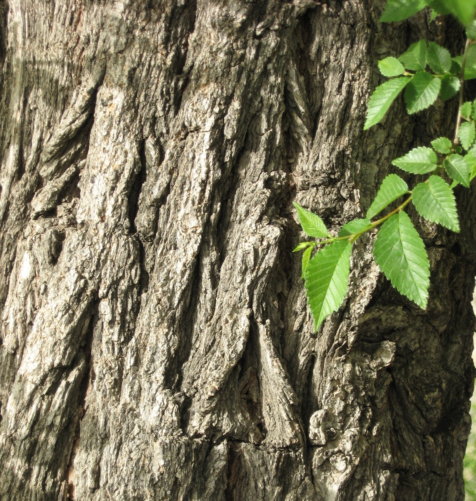

# Plants and Trees in the Bible

## License Information

Plants and Trees in the Bible © United Bible Societies, 2025. Adapted from: <cite>Each According to its Kind: Plants and Trees in the Bible</cite>, by Robert Koops © 2012 United Bible Societies. This work is licensed under Creative Commons Attribution-ShareAlike 4.0 International (<a href="https://creativecommons.org/licenses/by-sa/4.0/">https://creativecommons.org/licenses/by-sa/4.0/</a>).

--------------------------------

## 標題：榆樹（elm） (id: FLORA:1.8)

1\.8 標題：榆樹（elm）
===============

經文出處
----

Hebrew 來： גֶּשֶׁם (音譯： geshem)

[ISA 44:14](https://ref.ly/Isa44:14)

討論
--

*榆樹和葉子 (Ptelea (Wikimedia Commons))*

在以賽亞對木匠雕刻偶像的描述中，有一個句子寫道：「或栽種香柏樹，得雨水滋潤長大」（希伯來文*nata‘ ’oren wegeshem yegadel* ）。分句「得雨水滋潤長大」在這個語境裡顯得很奇怪。所以，祖海里把這裡的*geshem* （「雨水」）修改為*neshem* ，這個詞在阿拉伯文中意為毛榆（學名*Ulmus canescens* ）。考慮到希伯來文字母*nun* 和*gimel* 十分相似，加上句法也相仿，我們很容易推斷這裡是指另外一種樹。根據祖海里的修改，[ISA 44:14](https://ref.ly/Isa44:14) a中的*tirzah we’allon* （"stone pine and oak"，「石松和橡樹」；RSV (Revised Standard Version (1952)) ）與[ISA 44:14](https://ref.ly/Isa44:14) b中的*’oren weneshem* （"laurel and elm"，「月桂和榆樹」；RSV (Revised Standard Version (1952)) ）可能是平行的。祖海里的假設是基於這個前提：該希伯來原文詞語和阿拉伯文*neshem* 很相似（即以字母*nun* 開頭），並且抄寫經文的文士在某個時候把原始文本中的字母*nun* 錯寫成了與之非常相似的*gimel* 。可是，據我所知，目前似乎沒有聖經學者考慮過這種可能性。《七十士譯本》仍譯作「雨水」。

在[HOS 4:13](https://ref.ly/Hos4:13) ，KJV (King James Version (1611)) 將*’elah* 譯為"elm"（「榆樹」），這在植物學上是不正確的，應該是「篤耨香樹」。

翻譯
--

到目前為止，還沒有一個翻譯者採納這個建議，把榆樹納入這節經文。然而，如果祖海里的假設得到證實，我們鼓勵翻譯者認真考慮這個建議。具體譯法取決於翻譯者如何處理這節經文中的其他三種樹木：石松、橡樹和月桂樹。如果翻譯者從修辭的角度來考慮，並用一種製造偶像的樹木來替代，那麼也要對*neshem* 做同樣的處理。如果其他樹木是從一種主要語言音譯過來的，那麼*neshem* 也要音譯，如*elem* /*elmu* （音譯自英文）或*ulum* /*ulmu* （音譯自拉丁文）。

榆屬（學名*Ulmus* ）樹木生長在世界各地氣候溫和的地方，常栽植在街道兩旁提供蔭涼，木材可用來製作家具、工具手柄、棺材、椅子、輪轂、木槌頭，等等。

* **Associated Passages:** 以賽亞書 44:14; 何西阿書 4:13

