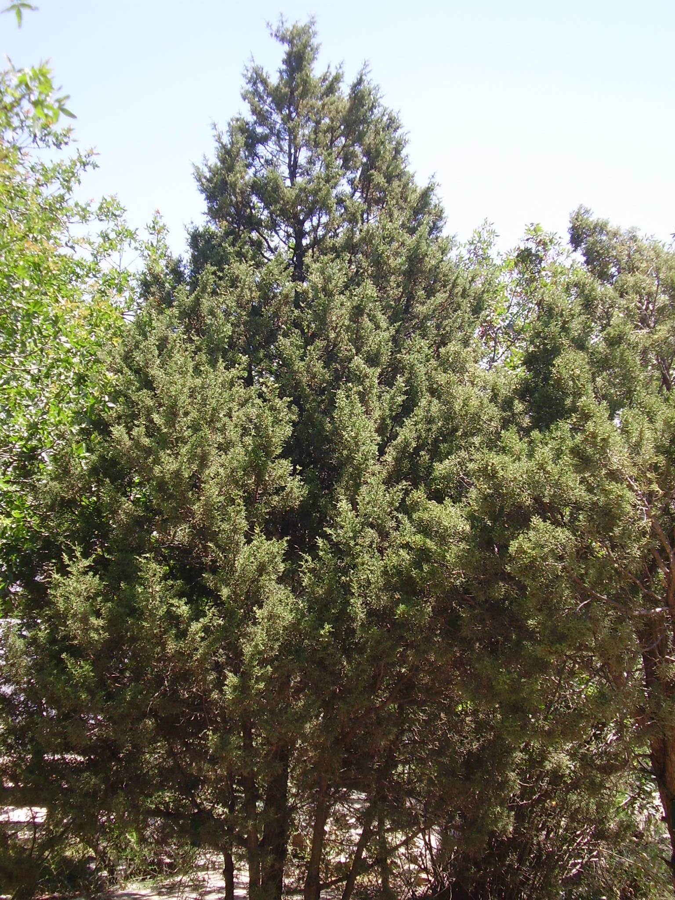

# Plants and Trees in the Bible

## License Information

Plants and Trees in the Bible © United Bible Societies, 2025. Adapted from: <cite>Each According to its Kind: Plants and Trees in the Bible</cite>, by Robert Koops © 2012 United Bible Societies. This work is licensed under Creative Commons Attribution-ShareAlike 4.0 International (<a href="https://creativecommons.org/licenses/by-sa/4.0/">https://creativecommons.org/licenses/by-sa/4.0/</a>).

--------------------------------

## 標題：杜松（juniper） (id: FLORA:1.11)

1\.11 標題：杜松（juniper）
====================

聖經時期的聖地生長著兩種杜松：一種是希臘杜松，由希伯來文通稱*berosh* 來表示；另一種是腓尼基杜松（或稱沿海杜松），在摩西五經中稱為*’erez* ，在《耶利米書》中稱為*‘ar‘ar* 。

## 標題：希臘杜松、東方檜柏（grecian juniper [eastern savin]） (id: FLORA:1.11.1)

1\.11\.1 標題：希臘杜松、東方檜柏（grecian juniper \[eastern savin]）
=======================================================

經文出處
----

Hebrew 來： בְּרוֹשׁ (音譯： berosh)

[ISA 14:8](https://ref.ly/Isa14:8), [ISA 37:24](https://ref.ly/Isa37:24), [ISA 41:19](https://ref.ly/Isa41:19), [ISA 55:13](https://ref.ly/Isa55:13), [ISA 60:13](https://ref.ly/Isa60:13), [EZK 27:5](https://ref.ly/Ezek27:5), [EZK 31:8](https://ref.ly/Ezek31:8), [HOS 14:9](https://ref.ly/Hos14:9), [ZEC 11:2](https://ref.ly/Zech11:2)

討論
--

*希臘杜松 (Ray Pritz (UBS))*

希臘杜松（學名*Juniperus excelsa* ）是一種高大的常綠樹，又名東方檜柏，與香柏樹、杉樹和柏樹（希伯來文*berosh* 可能涵蓋這三種樹木）一同生長在黎巴嫩的山區。在[EZK 27:5](https://ref.ly/Ezek27:5) ，*berosh* 和示尼珥山的關聯支持希臘杜松的說法，因為該山以盛產希臘杜松聞名。時至今日，黎巴嫩人仍稱杜松為*brotha* ，這個詞可能與*berosh* 同源。無疑，所羅門王把這些樹木連同香柏樹和杉樹一起運到耶路撒冷，用來建造他的王宮和耶和華的殿。以色列植物學家哈魯范尼主張將*berosh* 譯為「杜松」，可能就是希臘杜松。

描述
--

希臘杜松呈圓錐形，高度可達20米（65英呎），「葉子」飽滿，非扁平狀，果實是結種子的多肉毬果，不能食用。

翻譯
--

希伯來文和希臘文都沒有專門指稱希臘杜松的詞語。在對柏樹和杉樹的討論中，我們主張使用通稱來翻譯*berosh* ；在《列王紀上下》和《歷代志下》（通常與黎巴嫩或香柏樹聯繫在一起），將其譯作「杉樹」或「杜松」。如果目標語言沒有通稱，可以使用描述性短語，如「挺拔而美麗的樹木」。對於[HOS 14:9](https://ref.ly/Hos14:9) （《和》14:8）、[EZK 31:8](https://ref.ly/Ezek31:8) 、[ZEC 11:2](https://ref.ly/Zech11:2) 等詩歌體經文，可考慮當地對等的詩歌用詞。

* **Associated Passages:** 以賽亞書 14:8; 以賽亞書 37:24; 以賽亞書 41:19; 以賽亞書 55:13; 以賽亞書 60:13; 以西結書 27:5; 以西結書 31:8; 何西阿書 14:9; 撒迦利亞書 11:2

## 標題：腓尼基杜松（沿海杜松）（phoenician juniper [coastal juniper]） (id: FLORA:1.11.2)

1\.11\.2 標題：腓尼基杜松（沿海杜松）（phoenician juniper \[coastal juniper]）
==============================================================

經文出處
----

Hebrew 來： אֶרֶז (音譯： ’erez)

[LEV 14:4](https://ref.ly/Lev14:4), [LEV 14:6](https://ref.ly/Lev14:6), [LEV 14:49](https://ref.ly/Lev14:49), [LEV 14:51](https://ref.ly/Lev14:51), [LEV 14:52](https://ref.ly/Lev14:52), [NUM 19:6](https://ref.ly/Num19:6), [NUM 24:6](https://ref.ly/Num24:6)

Hebrew 來： עֲרוֹעֵר (音譯： ‘aro‘er)

[JER 48:6](https://ref.ly/Jer48:6)

Hebrew 來： עַרְעָר (音譯： ‘ar‘ar)

[JER 17:6](https://ref.ly/Jer17:6)

討論
--

*腓尼基杜松 (Ray Pritz) (Ray Pritz (UBS))*

腓尼基杜松（學名*Juniperus phoenicea* ）是上一個條目討論的希臘杜松的近緣樹種，生長在海拔較低的地方，今天散佈在西奈半島北部和約旦南部的山區。赫珀指出，腓尼基杜松遍佈西奈半島和阿拉伯半島的高地。在古時，這種樹木可能遍佈整個尼革夫。[DEU 2:36](https://ref.ly/Deut2:36) 提到一座名叫亞羅珥的城鎮，位於亞嫩谷旁邊，亞羅珥可能與希伯來文*‘ar‘ar* 同源，說明這種樹木可能生長在那裡。多個國家的阿拉伯人稱這種杜松為*‘ar‘ar* ，這為我們將*‘ar‘ar* /*‘aro‘er* 確認為腓尼基杜松提供了支持。由於腓尼基杜松與香柏樹密切相關，有些人也將其稱為「腓尼基的香柏樹」。請注意，希伯來文使用同一個詞語*’erez* 來指稱腓尼基杜松和高大的黎巴嫩香柏樹。對於[JER 17:6](https://ref.ly/Jer17:6) 中的*‘ar‘ar* ，挪迦‧哈魯范尼（Nogah Hareuveni，Desert and Shepherd in our Biblical Heritage，第67—71頁）從「文學」角度建議譯成「所多瑪的蘋果樹」（學名*Calotropis procera* ）。所多瑪的蘋果樹生長在「無人居住的鹽堿地」，長著悅人眼目的綠葉和果實，但果實是空心的，而且有毒——這與生長在溪邊的果樹形成了鮮明的對比。然而，其他植物學家沒有採納這個提議，而是更多地依賴阿拉伯文提供的語言證據。

描述
--

腓尼基杜松是一種矮灌木或喬木，高度可達5米（17英呎），長著革質小葉子和漿果狀的小毬果。

特殊意義
----

在[NUM 24:6](https://ref.ly/Num24:6) ，巴蘭將以色列的營地比作上帝的園子，其中栽種著芬芳的沉香樹和蒼翠的*’arazim* 。我們無法從上下文判斷這裡巴蘭所見的異象是端莊的腓尼基杜松，還是佳美的黎巴嫩香柏樹。[JER 17:6](https://ref.ly/Jer17:6) 說，只倚靠人類力量的人就像「沙漠裡的矮樹（*‘ar‘ar* ）」。這裡描繪的是一幅嚴酷環境中的孤獨景象，與倚靠上帝的人形成對比（7—8節）。

翻譯
--

根據祖海里的提議，我們主張在讀者知道「杜松」這種樹木的前提下，將《利未記》和《民數記》中的*’erez* 譯為「杜松」，或者按照一種主要語言來音譯。[JER 17:6](https://ref.ly/Jer17:6) 提到的*‘ar‘ar* 是詩歌體語言，可以使用文化上對應的樹木。由於所多瑪蘋果樹在非洲和亞洲很常見，因此可以使用「所多瑪蘋果樹」的當地詞語。有些學者認為，[JER 48:6](https://ref.ly/Jer48:6) 最後一行的希伯來文*‘aro‘er* 意指「杜松」。但是，這個希伯來文詞語仍有一些文本問題，故有以下四種翻譯主張：

1\. 音譯這個希伯來文詞語，將這行譯作「如曠野裡的亞羅珥」（如NJPSV (New Jewish Publication Society Version) 的譯法）。亞羅珥是曠野中的一座城鎮。

2\. 修訂*‘aro‘er* 為*‘arod* ，將這行譯作「如曠野裡的野驢」（如RSV (Revised Standard Version (1952)) 、GNB (Good News Bible) 、CEV (Contemporary English Version) 、NJB (New Jerusalem Bible (1985)) 、NAB (New American Bible (1970)) 的譯法）。在希伯來文中，字母*‘r* 和*‘d* 十分相似。

3\. 根據阿拉伯文用*‘arar* 指稱杜松這一點，將*‘aro‘er* 確定為杜松矮樹。NCV (New Century Version) 的譯文貼近這個提議，英文直譯為：「如曠野裡被風吹動的矮樹。」

4\. 將*‘aro‘er* 讀作*‘ar‘ar* （意為「窮人」）。REB (Revised English Bible (1989)) 據此翻譯，英文直譯作：「如曠野裡的窮人。」

* **Associated Passages:** 利未記 14:4; 利未記 14:6; 利未記 14:49; 利未記 14:51; 利未記 14:52; 民數記 19:6; 民數記 24:6; 耶利米書 48:6; 耶利米書 17:6; 申命記 2:36

