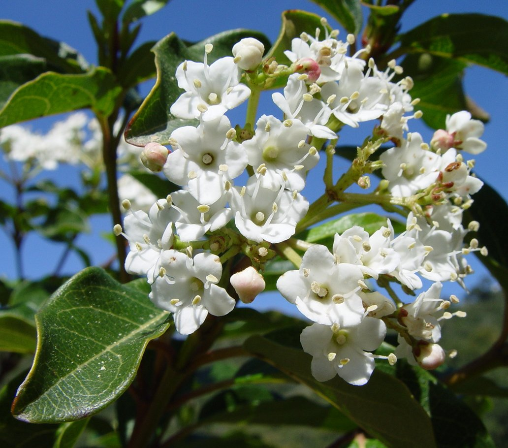

# Plants and Trees in the Bible

## License Information

Plants and Trees in the Bible © United Bible Societies, 2025. Adapted from: <cite>Each According to its Kind: Plants and Trees in the Bible</cite>, by Robert Koops © 2012 United Bible Societies. This work is licensed under Creative Commons Attribution-ShareAlike 4.0 International (<a href="https://creativecommons.org/licenses/by-sa/4.0/">https://creativecommons.org/licenses/by-sa/4.0/</a>).

--------------------------------

## 標題：地中海莢蒾（laurustinus [laurestinus]） (id: FLORA:1.13)

1\.13 標題：地中海莢蒾（laurustinus \[laurestinus]）
==========================================

經文出處
----

Hebrew 來： תִּדְהָר (音譯： tidhar)

[ISA 41:19](https://ref.ly/Isa41:19), [ISA 60:13](https://ref.ly/Isa60:13)

討論
--

*地中海莢蒾的花和葉 (Lumbar (Wikimedia Commons))*

關於[ISA 41:19](https://ref.ly/Isa41:19) 和[ISA 60:13](https://ref.ly/Isa60:13) 中希伯來文*tidhar* 所指的植物，目前還沒有達成共識。*Tidhar* 只出現在這兩處經文裡，RSV (Revised Standard Version (1952)) 和JB (Jerusalem Bible (1966)) 均譯成"plane"（「懸鈴樹」）。其他英文譯本有"fir"（「杉樹」；CEV (Contemporary English Version) 、NIV (New International Version (1984)) 、NLT (New Living Translation) 、REB (Revised English Bible (1989)) 、GW (God's Word Translation) ）、"box"（「黃楊樹」；NJPSV (New Jewish Publication Society Version) ）和"pine"（「松樹」；KJV (King James Version (1611)) ，莫爾登克贊同此譯法）等譯詞。祖海里根據亞蘭文譯本《約拿單的他爾根》（*Targum Jonathan* ），主張*tidhar* 為地中海莢蒾（學名*Viburnum tinus* ），因為亞蘭文譯本將*tidhar* 譯作*mornian* ，這個詞和地中海莢蒾的阿拉伯文名稱*murran* 同源。赫珀同意祖海里的意見。FFB （按照莫爾登克的意見）謹慎地將*tidhar* 確定為土耳其松（學名*Pinus brutia* ）。BDB (Brown-Driver-Briggs Hebrew and English Lexicon) 和其他一些譯本參照《武加大譯本》，將其翻譯為"elm"（「榆樹」），注意敘利亞文稱普通的榆樹為"dadar"。新近的證據支持「地中海莢蒾」（laurustinus）的譯法。另一種拼寫法「laurestinus」則不太常見。

描述
--

地中海莢蒾是一種堅韌的常綠灌木，高度可達3\.5米（12英呎），葉子深綠有光澤，開白花，紫色的漿果有毒。

翻譯
--

地中海莢蒾所屬的樹科生長在溫帶及氣候暖和的地方，包括歐洲、亞洲和北美洲；但是，地中海莢蒾的近緣樹種只生長在地中海地區。由於「地中海莢蒾」（laurustinus）並不是一個為人熟知的名稱，而且音譯冗長，所以最好按照一個主要譯本進行音譯，或者音譯希伯來文*tidhar* 或阿拉伯文*murran* 。然而，翻譯者對於*tidhar* 的具體處理，可能取決於如何處理[ISA 41:19](https://ref.ly/Isa41:19) 和[ISA 60:13](https://ref.ly/Isa60:13) 中其他表示樹木的詞語。如果把*berosh* 翻譯成「杉樹」或者據此音譯，那麼就要用一個不同的詞語來翻譯*tidhar* （比如「懸鈴樹」，同RSV (Revised Standard Version (1952)) 和JB (Jerusalem Bible (1966)) ）。在聖經研讀本中，「地中海莢蒾」可以作為*tidhar* 可能指稱的一種樹，「松樹」的可能性略居其次。

* **Associated Passages:** 以賽亞書 41:19; 以賽亞書 60:13

