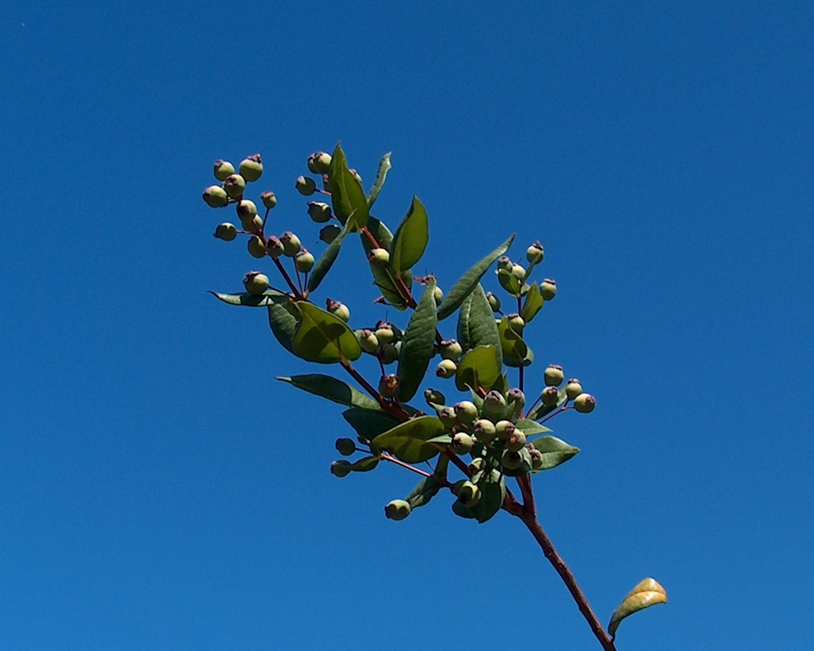

# Plants and Trees in the Bible

## License Information

Plants and Trees in the Bible © United Bible Societies, 2025. Adapted from: <cite>Each According to its Kind: Plants and Trees in the Bible</cite>, by Robert Koops © 2012 United Bible Societies. This work is licensed under Creative Commons Attribution-ShareAlike 4.0 International (<a href="https://creativecommons.org/licenses/by-sa/4.0/">https://creativecommons.org/licenses/by-sa/4.0/</a>).

--------------------------------

## 標題：香桃木、桃金娘（myrtle） (id: FLORA:1.15)

1\.15 標題：香桃木、桃金娘（myrtle）
========================

經文出處
----

Hebrew 來： הֲדַס (音譯： hadas)

[NEH 8:15](https://ref.ly/Neh8:15), [ISA 41:19](https://ref.ly/Isa41:19), [ISA 55:13](https://ref.ly/Isa55:13), [ZEC 1:8](https://ref.ly/Zech1:8), [ZEC 1:10](https://ref.ly/Zech1:10), [ZEC 1:11](https://ref.ly/Zech1:11)

討論
--

*香桃木花 (Giancarlo Dessì (Wikimedia Commons))*

時至今日，香桃木（學名*Myrtus communis* ）仍然生長在加利利山區，以及北非和整個中東地區。在[ISA 41:19](https://ref.ly/Isa41:19) 這節天啟文學經文中，香桃木與香柏樹、金合歡樹和橄欖樹同列（另參[ISA 55:13](https://ref.ly/Isa55:13) ）；經文告訴我們，在新的時代，這些蒼翠的樹木將取代曠野的蒺藜。阿拉伯文*as* 和阿卡德文*asu* 是希伯來文*hadas* 的同源詞。香桃木的葉子和花可用於婚禮和醫藥，木料則可用來做手杖和家具。樹皮和樹根含有單寧酸，今天的俄羅斯和土耳其仍然使用單寧酸來製革。

描述
--

*香桃木枝 (Giancarlo Dessì (Wikimedia Commons))*

香桃木是一種常綠灌木，葉芳香，高度通常為2—3米（7—10英呎）。革質的葉子呈深綠色，白色的花很美麗，藍黑色的漿果有一種甜甜的氣味。

特殊意義
----

[NEH 8:15](https://ref.ly/Neh8:15) 告訴我們，猶太人在住棚節用香桃木和其他樹木的枝條搭棚，至今仍隨從這個風俗。《以賽亞書》提到香桃木的經文將其與復興的時代和良善聯繫在一起。綜上所述，我們可以推斷：當撒迦利亞在異象中看到馬和騎馬的人在「香桃木中間」，他腦海中浮現的是一個神聖的、上帝臨在的地方，甚至可能是「天堂的通道」。這裡使用了定冠詞，因此也可能指撒迦利亞及其讀者所知道的一個具體地方。有些解經家認為，撒迦利亞異象中的香桃木代表以色列百姓。請注意，經文說這些香桃木生長在窪地中，或是山谷或是溝壑，這本身可能象徵國家的負面遭遇，或許如一些人所提出的，象徵被擄到巴比倫的經歷。

香桃木的希伯來文名稱被用作男子的名字（Assa，阿薩），也可作女子的名字（Hadassah，哈大沙；參[EST 2:7](https://ref.ly/Esth2:7) ）。

翻譯
--

香桃木屬於龐大的桃金娘科（學名*Myrtaceae* ），該科在世界各地至少有3000種樹木，包括番石榴、桉樹和丁香。然而，香桃木的近緣樹種可能很難找到，所以音譯一種主要語言的詞語可能是最好的選擇。在《以賽亞書》的詩歌體經文中，*hadas* 的處理將取決於翻譯者如何處理清單中的其他樹木，不論是採用文學對等還是音譯，都需保持一致性。在《尼希米記》，我們建議音譯，除非香桃木或其近緣樹木在當地為人所知。在《撒迦利亞書》，由於我們不知道作者心中存想著香桃木的哪些顯著特徵，因此很難作出恰當的對等描述。然而，翻譯者可以使用音譯或一般性的短語，如「灌木」或「多葉的小樹」。

* **Associated Passages:** 尼希米記 8:15; 以賽亞書 41:19; 以賽亞書 55:13; 撒迦利亞書 1:8; 撒迦利亞書 1:10; 撒迦利亞書 1:11; 以斯帖記 2:7

