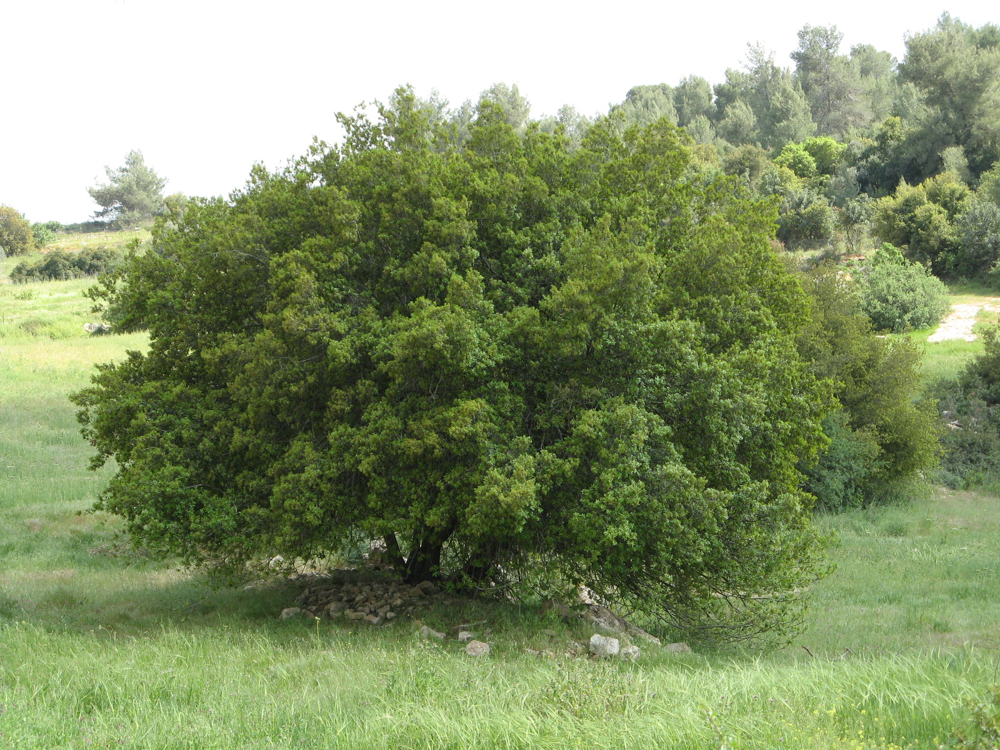
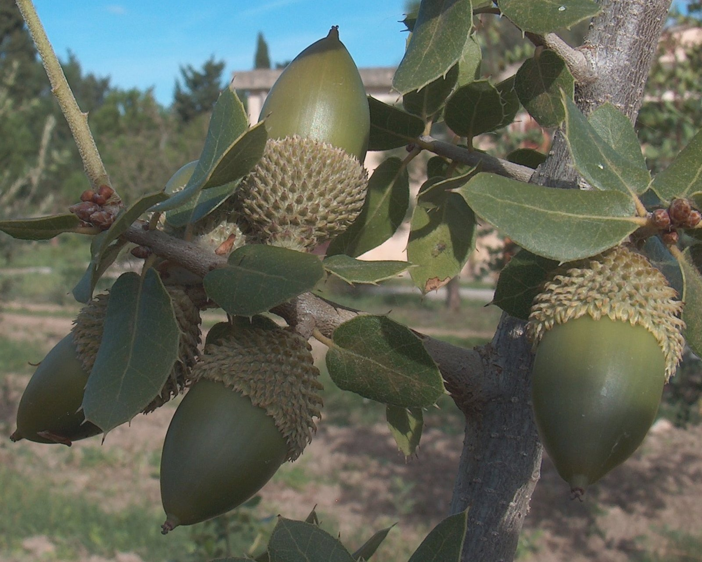

# Plants and Trees in the Bible

## License Information

Plants and Trees in the Bible © United Bible Societies, 2025. Adapted from: <cite>Each According to its Kind: Plants and Trees in the Bible</cite>, by Robert Koops © 2012 United Bible Societies. This work is licensed under Creative Commons Attribution-ShareAlike 4.0 International (<a href="https://creativecommons.org/licenses/by-sa/4.0/">https://creativecommons.org/licenses/by-sa/4.0/</a>).

--------------------------------

## 標題：橡樹（oak） (id: FLORA:1.16)

1\.16 標題：橡樹（oak）
================

經文出處
----

Hebrew 來： אֵלוֹן (音譯： ’elon)

[GEN 12:6](https://ref.ly/Gen12:6), [GEN 13:18](https://ref.ly/Gen13:18), [GEN 14:13](https://ref.ly/Gen14:13), [GEN 18:1](https://ref.ly/Gen18:1), [DEU 11:30](https://ref.ly/Deut11:30), [JOS 19:33](https://ref.ly/Josh19:33), [JDG 4:11](https://ref.ly/Judg4:11), [JDG 9:6](https://ref.ly/Judg9:6), [JDG 9:37](https://ref.ly/Judg9:37), [1SA 10:3](https://ref.ly/1Sam10:3)

Hebrew 來： אַלּוֹן (音譯： ’allon)

[GEN 35:8](https://ref.ly/Gen35:8), [GEN 35:8](https://ref.ly/Gen35:8), [ISA 2:13](https://ref.ly/Isa2:13), [ISA 6:13](https://ref.ly/Isa6:13), [ISA 44:14](https://ref.ly/Isa44:14), [EZK 27:6](https://ref.ly/Ezek27:6), [HOS 4:13](https://ref.ly/Hos4:13), [AMO 2:9](https://ref.ly/Amos2:9), [ZEC 11:2](https://ref.ly/Zech11:2)

討論
--

以色列地有三種橡樹，主要是他泊橡樹和胭脂蟲（或普通）橡樹。兩者在希伯來文中的名稱都是*’elon* 或*’allon* 。這兩個名稱和希伯來文*’el* （「神明」）很相似，並且具有重要的意義，因為這些樹一直以來都與崇拜和埋葬聯繫在一起。他泊橡樹最為高大，因此*’elon* 和*’allon* 很可能指的就是這種橡樹。英文譯本有時把希伯來文詞語*’elah* （「篤耨香樹」）錯譯為"oak"（「橡樹」）。

根據赫珀的意見，在聖經時期，胭脂蟲橡樹（學名*Quercus calliprinos* 或*Quercus coccifera* ）曾覆蓋以色列山地，從迦密山一直到撒瑪利亞。胭脂蟲橡樹林是以色列最常見、最重要的植被類型。

在阿拉伯時期（主後800—1400年），他泊橡樹（學名*Quercus macrolepsis* 、*Quercus aegilops* 、*Quercus ithaburensis* ；以色列的瓦隆那橡樹）顯然取代了原有的普通橡樹。但是在近代，木炭製造商、石灰石爐和土耳其鐵路幾乎將他泊橡樹消耗殆盡。這種橡樹是落葉喬木，主要分佈在迦密山。

描述
--

高大的他泊橡樹高度可達25米（82英呎），在大約5\.5米（18英呎）處分枝。胭脂蟲橡樹更像是一種大型灌木，通常在地面就分枝。他泊橡樹每年冬天落葉；胭脂蟲橡樹常綠且多刺。

特殊意義
----

橡樹曾用來標記墓地（參[GEN 35:8](https://ref.ly/Gen35:8) ），經文提及的「摩利橡樹」或「幔利橡樹」可能暗示有名人葬在那裡。如果[JDG 9:37](https://ref.ly/Judg9:37) 提到的「占卜者的橡樹」可說是具有代表性的情境，那麼橡樹在占卜中可能也扮演了很重要的角色。經文中提到的人名亞龍（[1CH 4:37](https://ref.ly/1Chr4:37) ）和以倫（[GEN 46:14](https://ref.ly/Gen46:14); [NUM 26:26](https://ref.ly/Num26:26); [JDG 12:12](https://ref.ly/Judg12:12) ）可能表明橡樹象徵力量或美麗，或者兩者兼有。

翻譯
--

橡樹主要生長在溫帶（歐洲、北美洲、北亞和日本）和地中海地區，包括北非。熱帶地區的翻譯者沒有當地的樹木可供選擇。因此，在歷史性的語境中，有必要按照一種主要語言進行音譯。在詩歌體經文中，如《詩篇》、《箴言》和先知書，橡樹通常代表一種高大而結實的樹木，翻譯時可以考慮具有這些特徵的當地樹木。

* **Associated Passages:** 創世記 12:6; 創世記 13:18; 創世記 14:13; 創世記 18:1; 申命記 11:30; 約書亞記 19:33; 士師記 4:11; 士師記 9:6; 士師記 9:37; 撒母耳記上 10:3; 創世記 35:8; 以賽亞書 2:13; 以賽亞書 6:13; 以賽亞書 44:14; 以西結書 27:6; 何西阿書 4:13; 阿摩司書 2:9; 撒迦利亞書 11:2; 歷代志上 4:37; 創世記 46:14; 民數記 26:26; 士師記 12:12

