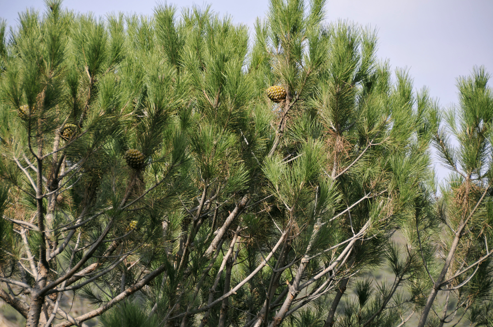
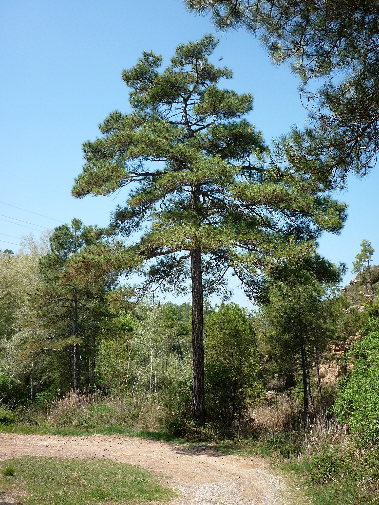

# Plants and Trees in the Bible

## License Information

Plants and Trees in the Bible © United Bible Societies, 2025. Adapted from: <cite>Each According to its Kind: Plants and Trees in the Bible</cite>, by Robert Koops © 2012 United Bible Societies. This work is licensed under Creative Commons Attribution-ShareAlike 4.0 International (<a href="https://creativecommons.org/licenses/by-sa/4.0/">https://creativecommons.org/licenses/by-sa/4.0/</a>).

--------------------------------

## 標題：松樹（pine） (id: FLORA:1.18)

1\.18 標題：松樹（pine）
=================

聖經中提及的「松樹」都不是百分之百確定的譯詞，因為學者對於所有針葉樹的辨識都很難確定其具體樹種。聖經中提到的松樹可能有兩種，這兩種松樹在形態和生長環境上有很大的差異。

## 標題：石松（stone pine） (id: FLORA:1.18.1)

1\.18\.1 標題：石松（stone pine）
==========================

經文出處
----

Hebrew 來： תִּרְזָה (音譯： tirzah)

[ISA 44:14](https://ref.ly/Isa44:14)

討論
--

*石松 (Serge Melki (Wikimedia Commons))*

根據湯姆森（Tomson，1860，祖海里引述）的意見，石松（學名*Pinus pinea* ；又名矮松）在19世紀的巴勒斯坦沿海平原很常見。愛琴海岸和黎巴嫩曾有石松林。今天，以色列只在迦密山和加利利沿海平原有幾片小規模的石松林，但在黎巴嫩仍有很多，因為那裡人們會種植石松以收穫美味的含油松子。祖海里提出，[ISA 44:14](https://ref.ly/Isa44:14) 中的希伯來文*tirzah* 可能是指石松；一些英文譯本的譯法如下："holm"（「石櫟」；RSV (Revised Standard Version (1952)) ）、"cypress"（「柏樹」；NIV (New International Version (1984)) ）、"plane"（「懸鈴樹」；NJPSV (New Jewish Publication Society Version) ）、"fir"（「杉樹」；GW (God's Word Translation) ）、"oak"（「橡樹」；GNB (Good News Bible) ）。詞根*r\-z* 表明該詞可能與希伯來文*’erez* （「香柏樹」）一詞有關聯，並且第一本阿拉伯文聖經（10世紀）也使用了意為「石松」的阿拉伯文。

因其種子的特性，有人建議將[HOS 14:9](https://ref.ly/Hos14:9) （《和》14:8）中的*berosh* 譯為石松，那裡上帝將自己比作常青的*berosh* 樹。但這種翻譯是有爭議的，因為語法似乎表明，那裡提到的果子不是說話人（上帝）的果子，而是聽者的果子，即「你的果子」或「他們的果子」。

描述
--

*結著毬果的石松枝 (Luis Fernández García (Wikimedia Commons))*

石松的高度可達10米（33英呎），通常呈傘狀，因此在一些地方又被稱為「傘松」。只有這種松樹的種子可以食用。

翻譯
--

各英文譯本對[ISA 44:14](https://ref.ly/Isa44:14) 中*tirzah* 的翻譯，如"holm"（「石櫟」）、"plane"（「懸鈴樹」）、"fir"（「杉樹」）、"oak"（「橡樹」）和"cypress"（「柏樹」）等，都只是猜測。因此，一個合理的解決辦法是採納祖海里的建議，他的建議至少在古生物學和語言學上有一定的根據；另外就是音譯一種主要語言的詞語（如*pino* 、*payin* 、*pinyola* ）。如果以目標語言的文化為導向，那麼翻譯者可以用一種經常用來雕刻偶像的樹木來替代，並且這個名稱不曾用來翻譯其他樹木。

現今，中國出產的「松子」在美國作為沙拉配料銷售。我們認為這些松子產自石松的一個亞種。

* **Associated Passages:** 以賽亞書 44:14; 何西阿書 14:9

* **Associated ACAI Concepts:** Stone Pine (ID: `flora:Pine`)

## 標題：阿勒坡松、地中海松（aleppo pine） (id: FLORA:1.18.2)

1\.18\.2 標題：阿勒坡松、地中海松（aleppo pine）
==================================

經文出處
----

Hebrew 來： עֵץ שֶׁמֶן (音譯： ‘ets shemen)

[1KI 6:23](https://ref.ly/1Kgs6:23), [1KI 6:31](https://ref.ly/1Kgs6:31), [1KI 6:32](https://ref.ly/1Kgs6:32), [1KI 6:33](https://ref.ly/1Kgs6:33), [NEH 8:15](https://ref.ly/Neh8:15), [ISA 41:19](https://ref.ly/Isa41:19)

討論
--

*阿勒坡松 (Isidre Blanc (Wikimedia Commons))*

高貴的阿勒坡松（學名*Pinus halepensis* ）又稱地中海松或耶路撒冷松，原產於以色列和黎巴嫩。以色列從未盛產阿勒坡松，因為這種樹最適宜生長在鬆軟的白堊質土壤裡，而以色列這樣的土質很少。在現代，許多阿勒坡松種植在以色列的多個保護區內。在現代希伯來文中，這種松樹叫做*’oren* ，出現在[ISA 41:19](https://ref.ly/Isa41:19) ；有些譯本在該節經文中譯成「松樹」（"pine"；NIV (New International Version (1984)) ），但祖海里認為那裡指的是月桂樹（參[1\.12 月桂樹 (laurel \[bay tree])](#FLORA:1.12) ）。

在[1KI 6:23](https://ref.ly/1Kgs6:23); [1KI 6:31](https://ref.ly/1Kgs6:31); [1KI 6:32](https://ref.ly/1Kgs6:32); [1KI 6:33](https://ref.ly/1Kgs6:33) 中，希伯來文短語*‘ets shemen* （字面意為「油樹」）是製作聖殿中基路伯、門扇和門柱的木料。大部分英文譯本都將其譯作"wild olive"（「野橄欖木」）；不過，橄欖樹無論是栽植的還是野生的，其扭曲和多節瘤的外形都是眾所周知的，通常不適合做建築木材或雕刻大型物品。

[NEH 8:15](https://ref.ly/Neh8:15) 列出了搭棚所用的四種樹木，包括*zayith* （「橄欖樹」）和*‘ets shemen* （「野橄欖樹」）。GNB (Good News Bible) 和NJPSV (New Jewish Publication Society Version) 都將*‘ets shemen* 譯作"pine"（「松樹」；GNB (Good News Bible) 顛倒了這兩種樹的順序）。「各樣茂密樹」表明是闊葉樹而不是針葉樹，但松樹枝也可能因其宜人的氣味而被包含在內。

[ISA 41:19](https://ref.ly/Isa41:19) 所列的樹木將於新的時代栽植在曠野，包括*‘ets shemen* 、香柏樹、金合歡樹和香桃木。

有了這個證據，祖海里確信*‘ets shemen* 就是阿勒坡松；自被擄時期以來，庫爾德斯坦北部的松樹至今仍被那裡的猶太人稱為*‘ets shemen* ，這一事實支持上述觀點。布倫金索普（Blenkinsopp，第292頁）和其他解經家，包括早期的猶太解經家薩阿迪亞（Saadiah）、書尚魯克（Shulchan Aruch）和基姆奇（Kimchi），也贊同將「油樹」翻譯為「松樹」。但是，赫珀認為[1KI 6:23](https://ref.ly/1Kgs6:23) 中的基路伯（以及[1KI 6:31](https://ref.ly/1Kgs6:31); [1KI 6:32](https://ref.ly/1Kgs6:32); [1KI 6:33](https://ref.ly/1Kgs6:33) 中的門扇和門框）是用橄欖木做的。他說，像基路伯這樣的大物件可能是「由許多小木塊以某種方式連接在一起，然後雕刻成所需的形狀」（第158頁）。GNB (Good News Bible) 、NIV (New International Version (1984)) 、NCV (New Century Version) 、LB (Living Bible (1971)) ， NAB (New American Bible (1970)) 、NJPSV (New Jewish Publication Society Version) 、GECL (German Common Language Version (Gute Nachricht Bibel)) 也都採納了這個觀點，將*‘ets shemen* 譯為"olive"（「橄欖木」）。

FFB 的作者採納了第三種觀點，即《列王紀上》6章的*‘ets shemen* 指沙棗樹（學名*Elaeagnus angustifolia* ），有時也稱為野橄欖（或俄羅斯橄欖），儘管這種樹與橄欖樹並沒有親緣關係。赫珀說，*‘ets shemen* 不可能是沙棗樹，因為沙棗樹並不是以色列本土植物。此外，沙棗樹太小，無法用來製作任何家具或建築物。

描述
--

阿勒坡松是一種常綠針葉樹，高度達20米（66英呎），壽命可達150年，與香柏樹、柏樹和杜松同屬。

特殊意義
----

如上所述，*‘ets shemen* 是住棚節搭棚所用的四種特殊樹木之一。如果它是某種松樹，那麼它的樹枝就不僅有遮蔭的作用，還可以給棚屋帶來芳香。

翻譯
--

希伯來文*‘ets shemen* 有幾種譯法：

1\. 按照祖海里的建議，音譯一種主要語言中表示「松樹」的詞語（如法文*pin* 、西班牙文*pino* 、阿拉伯文*sanawbar* 、葡萄牙文*pinheiro* ），或者音譯由政府引進的松樹樹種。（在尼日利亞南部的一些地方，所有針葉樹都被稱為「聖誕樹」，這種譯法是不可取的！）

2\.按字面譯為「油樹」（"oil tree"），如KJV (King James Version (1611)) 在[ISA 41:19](https://ref.ly/Isa41:19) 的譯文。

3\. 按照通俗英文的用法，取當地表示「橄欖」的詞語（最早出現在[GEN 8:11](https://ref.ly/Gen8:11) ），並增加詞語「野」或「灌木叢」，與栽種的樹木相區分（如同REB (Revised English Bible (1989)) 的處理方式）。這與FFB 的建議一致。

4\. 按照一種主要語言音譯「橄欖」這個詞（如*olivi* 或*wolifu* ），再增加詞語「野」或「灌木叢」。

* **Associated Passages:** 列王紀上 6:23; 列王紀上 6:31; 列王紀上 6:32; 列王紀上 6:33; 尼希米記 8:15; 以賽亞書 41:19; 創世記 8:11

* **Associated ACAI Concepts:** Aleppo Pine (ID: `flora:PineTree`)
