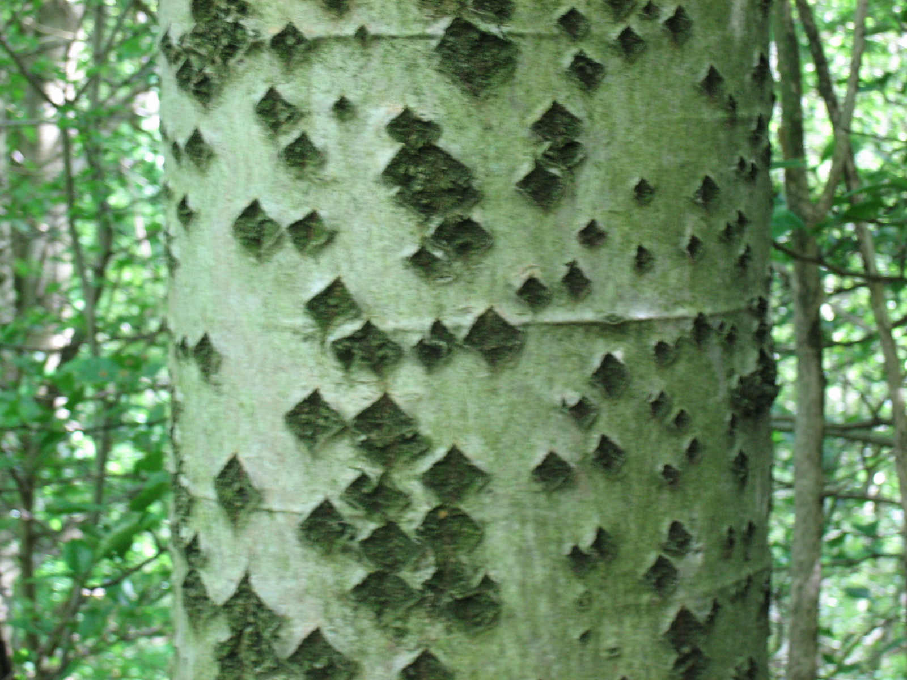

# Plants and Trees in the Bible

## License Information

Plants and Trees in the Bible © United Bible Societies, 2025. Adapted from: <cite>Each According to its Kind: Plants and Trees in the Bible</cite>, by Robert Koops © 2012 United Bible Societies. This work is licensed under Creative Commons Attribution-ShareAlike 4.0 International (<a href="https://creativecommons.org/licenses/by-sa/4.0/">https://creativecommons.org/licenses/by-sa/4.0/</a>).

--------------------------------

## 標題：楊樹（poplar） (id: FLORA:1.20)

1\.20 標題：楊樹（poplar）
===================

經文出處
----

Hebrew 來： בָּכָא (音譯： baka’)

[2SA 5:23](https://ref.ly/2Sam5:23), [2SA 5:24](https://ref.ly/2Sam5:24), [1CH 14:14](https://ref.ly/1Chr14:14), [1CH 14:15](https://ref.ly/1Chr14:15)

Hebrew 來： לִבְנֶה (音譯： livneh)

[GEN 30:37](https://ref.ly/Gen30:37)

Hebrew 來： עֲרָבָה (音譯： ‘aravah)

[LEV 23:40](https://ref.ly/Lev23:40), [JOB 40:22](https://ref.ly/Job40:22), [PSA 137:2](https://ref.ly/Ps137:2), [ISA 15:7](https://ref.ly/Isa15:7), [ISA 44:4](https://ref.ly/Isa44:4)

討論
--

*胡楊樹 (Michael D. Manning (Britannica))*

中東地區有多種楊樹，因此，某個特定的希伯來文詞語指的是哪一種楊樹常有爭議。在聖經時期，以色列地有兩種常見的楊樹，即白楊和胡楊（胡楊又名幼發拉底楊樹）。

在[GEN 30:37](https://ref.ly/Gen30:37) ，雅各用來繁殖綿羊和山羊的神奇方法是借助白楊（學名*Populus alba* ）淺色的裡層木質。白楊生長在以色列地區的河岸上。這種樹的樹皮為灰色，木質較軟，用作建築木料，也可製作工具和椽子，有些地方還將樹皮入藥。

胡楊（學名*Populus euphratica* ）也生長在河岸上，但在中東地區，胡楊的分佈要比白楊廣泛得多，因而自然而然地成為[PSA 137:2](https://ref.ly/Ps137:2) 所述樹木的候選，這節經文說：「在一排*‘aravim* 中，我們掛上我們的豎琴」（RSV (Revised Standard Version (1952)) 將*‘aravim* 譯作"willows"，即「柳樹」）。在伊拉克，胡楊被稱為*gharab* ，該詞與*‘aravah* 同源，從而佐證了「楊樹」的譯法。祖海里認為，[EZK 17:5](https://ref.ly/Ezek17:5) 中的希伯來文*tsaftsafah* 可能是指胡楊。赫珀認同此觀點，舉出了這種楊樹容易生根的特性。然而，阿拉伯人稱柳樹為*safsaf* ，因此我們認為《以西結書》的這節經文指的是柳樹。

[2SA 5:23](https://ref.ly/2Sam5:23); [2SA 5:24](https://ref.ly/2Sam5:24) 和[1CH 14:14](https://ref.ly/1Chr14:14); [1CH 14:15](https://ref.ly/1Chr14:15) 提到的樹木可能是楊樹（RSV (Revised Standard Version (1952)) 譯作"balsam trees"，「香脂樹」；KJV (King James Version (1611)) 譯作"mulberry trees"，「桑樹」；NEB (New English Bible (1970)) 和REB (Revised English Bible (1989)) 譯作"aspens"，「山楊」），因為楊樹的葉子在風吹過時會沙沙作響。

請注意，在[HOS 4:13](https://ref.ly/Hos4:13) ，希伯來文*livneh* 指的是安息香樹（參[1\.22 安息香樹 (styrax)](#FLORA:1.22) ），依據是*livneh* 在這處經文中與橡樹和篤耨香樹聯繫在一起。

描述
--

*白楊樹葉，背面和正面 (MPF (Wikimedia Commons))*

白楊樹很高大，高度可達20米（66英呎），種子像一簇簇長而柔順的毛絮隨風飄散。胡楊也很高大，有兩種葉子，小樹的葉子像柳葉一樣細窄，成熟後的葉子比較寬。在辨識聖經中提到的柳樹和楊樹時，這個特點給學者造成了一些困惑。

翻譯
--

*白楊樹幹 (MPF (Wikimedia Commons))*

楊屬（學名*Populus* ）樹木（三角葉楊、山楊）在歐洲和北美洲廣為人知。北非和南非從歐洲引進了若干種楊樹，除此之外非洲似乎沒有任何楊屬樹木。然而，帕爾格雷夫指出，有一種近緣樹種分佈在非洲，範圍從埃及、蘇丹起，經肯尼亞、烏干達、扎伊爾，一直到非洲南部的廣大地區；該近緣樹木即野柳（學名*Salix subserrata* ）。在亞洲，從阿拉伯半島到喜馬拉雅地區，楊屬樹木廣為人知。

在有楊屬樹木的地方，如果當地品種的內皮是白色的，就可以用在《創世記》中；但是要記住，[LEV 23:40](https://ref.ly/Lev23:40) 提到了另一種同科樹木（柳樹）。由於[GEN 30:37](https://ref.ly/Gen30:37) 的背景是歷史性的，而非修辭性的，因此在不熟悉楊屬樹木的地方，我們主張按照一種主要語言進行音譯（例如*popula* 、*populari* 、*hawur* （阿拉伯文）或*abele* （法文）），避免用當地樹木的名稱來替代，儘管《〈創世記〉手冊》（*A Handbook on Genesis* ，第701—702頁）贊同替代名稱。

* **Associated Passages:** 撒母耳記下 5:23; 撒母耳記下 5:24; 歷代志上 14:14; 歷代志上 14:15; 創世記 30:37; 利未記 23:40; 約伯記 40:22; 詩篇 137:2; 以賽亞書 15:7; 以賽亞書 44:4; 以西結書 17:5; 何西阿書 4:13

* **Associated ACAI Concepts:** Poplar (ID: `flora:Poplar`)
