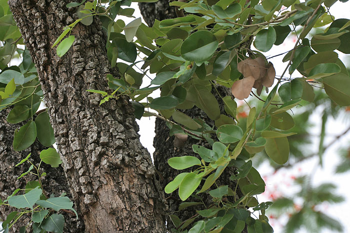

# Plants and Trees in the Bible

## License Information

Plants and Trees in the Bible © United Bible Societies, 2025. Adapted from: <cite>Each According to its Kind: Plants and Trees in the Bible</cite>, by Robert Koops © 2012 United Bible Societies. This work is licensed under Creative Commons Attribution-ShareAlike 4.0 International (<a href="https://creativecommons.org/licenses/by-sa/4.0/">https://creativecommons.org/licenses/by-sa/4.0/</a>).

--------------------------------

## 標題：檀香木（sandalwood [red saunders]） (id: FLORA:1.21)

1\.21 標題：檀香木（sandalwood \[red saunders]）
========================================

經文出處
----

Hebrew 來： אַלְגּוּמִּים (音譯： ’algum)

[2CH 2:7](https://ref.ly/2Chr2:7), [2CH 9:10](https://ref.ly/2Chr9:10), [2CH 9:11](https://ref.ly/2Chr9:11)

Hebrew 來： אַלְמֹגִּים (音譯： ’almug)

[1KI 10:11](https://ref.ly/1Kgs10:11), [1KI 10:12](https://ref.ly/1Kgs10:12), [1KI 10:12](https://ref.ly/1Kgs10:12)

討論
--

*印度的檀香木 (J.M.Garg (Wikimedia Commons))*

考察一下各英文譯本就會發現，《列王紀上》的希伯來文*’almug* 及其在《歷代志下》平行經文中的*’algum* ，這兩個詞不僅帶來了理解上的困惑，也造成了學者間激烈的爭論。大部分的英文譯本（RSV (Revised Standard Version (1952)) 、NRSV (New Revised Standard Version (1989)) 、NIV (New International Version (1984)) 、REB (Revised English Bible (1989)) 、NJB (New Jerusalem Bible (1985)) ）都是直接音譯這兩卷書中的兩個希伯來文詞語，但GNB (Good News Bible) 、CEV (Contemporary English Version) 和NCV (New Century Version) 把這兩個詞語都譯成"juniper"（「杜松」）。GECL (German Common Language Version (Gute Nachricht Bibel)) 也採取類似的作法，在這兩卷書中都譯作「珍貴的木材」，從而避開了兩處希伯來文詞語拼法不同的問題。爭論的關鍵在於以下兩個問題：

1\. 《列王紀上》的*’almug* 是否與《歷代志下》的*’algum* 相同？

2\. *’Almug* /*’algum* 樹產自什麼地方？

注意經文對於產地的描述：根據[1KI 10:11](https://ref.ly/1Kgs10:11) ，*’almug* 來自俄斐；根據[2CH 2:7](https://ref.ly/2Chr2:7) （《和》2:8），*’algum* 來自黎巴嫩；根據[2CH 9:10](https://ref.ly/2Chr9:10) ，*’algum* 來自俄斐。

植物學解經家的觀點如下：祖海里根據特里斯特拉姆的提議，主張這兩個詞語是指同一種樹木，也就是從印度（經俄斐）運來的檀香紫檀（學名*Pterocarpus santolinus* ，也稱為紅木）。赫珀根據莫爾登克、攝爾西烏斯（Celsius）和史密斯（W. Smith）等人的看法，認為兩者並不相同：*’almug* 是紫檀木；*’algum* 是黎巴嫩的希臘杜松（學名*Juniperus excelsa* ）。

根據FFB ，這兩種樹為同一品種，但產地未知，可能是紫檀木、白檀木，或腓尼基杜松。

解經家凱爾和德利奇認為這兩個詞指同一種樹，即檀香木。他們認為，作者在[2CH 2:7](https://ref.ly/2Chr2:7) （《和》2:8）錯誤地將*’algum* 與香柏樹和柏樹同列為黎巴嫩的樹木，其實*’algum* 應該與另外兩種樹木分開，與「寶石」同列，像[2CH 9:10](https://ref.ly/2Chr9:10) 那樣。此外，瓊斯（G. H. Jones）認為，根據烏加列文中的同源詞（*’\-l\-m\-g* ）和阿卡德文中的同源詞（*elammakku* ），*’algum* 應作*’almug* 。另外，梵文方言中有*mocha* 一詞表示檀香木（另參下文附錄），在添加了阿拉伯文定冠詞*al* 之後，即成*al\-mug* （阿拉伯文常將外來語中的*o* 改為*u* ）。根據赫珀的引述，格林菲爾德（Greenfield）和邁爾霍費爾（Mayrhofer）在1967年基於語言學的理由，也認為*’algum* 和*’almug* 是同一種樹木；他們確認這種樹出自黎巴嫩，但沒有說明名稱。順帶一提，烏加列文獻也提到了一種叫做*’\-l\-m\-g* 的樹。

哈魯范尼（第99頁）採用了另一種非常不同的詮釋，他試圖將*’almug* 譯為「珊瑚」，一種海洋中的礦物，依據是*’almog* 在現代希伯來文中是「珊瑚」的意思，與「寶石」形成很好的對應。哈魯范尼引述了《巴比倫他勒目》，該書詳細描述了這些「珊瑚樹」是如何從地中海的海底採集上來的。

GNB (Good News Bible) 、CEV (Contemporary English Version) 和NCV (New Century Version) 的翻譯者遵循FFB 的譯法，即依據克勒（Koehler）和鮑姆格特納（Baumgartner）的意見，認為[2CH 2:7](https://ref.ly/2Chr2:7) （《和》2:8）中的短語「黎巴嫩的*’algum* 」是基本的表達，必定是指腓尼基杜松（參[1\.11\.2 腓尼基杜松（沿海杜松）（phoenician juniper \[coastal juniper]）](#FLORA:1.11.2) ）。所以，這些譯本統一了《歷代志下》和《列王紀上》的譯法。

在《列王紀上》10章和《歷代志下》9章關於希蘭向所羅門王進貢的故事裡，讀者首先可能會注意到，兩卷書的記載都突然被示巴女王來訪的故事打斷了，敘事顯得很突兀。除了*’almug* /*’algum* 的差異外，兩段敘事幾乎逐字對應。希蘭王從俄斐運來黃金，又運來*’algum* /*’almug* 木和寶石。《列王紀上》提到*’almug* 共三次；在《歷代志下》的平行經文提到*’algum* 兩次，第三次雖未提及但在文中也有清楚的暗示。我們難免得出以下結論：這兩個詞指的是同一樣東西，而這裡的差異是由於某份記載將兩個希伯來文輔音*mem* 和*gimel* 顛倒抄寫所造成的。然而，這兩份記載都沒有說明木材的產地，但似乎不是黎巴嫩，這就排除了「杜松」（"juniper"；GNB (Good News Bible) 、CEV (Contemporary English Version) 、NCV (New Century Version) ）的可能性。但也似乎不是產自俄斐。到底哪份記載的年代更早？學者一般認為，《列王紀上》的記載在先，而歷代志作者參考了申典列王紀的記載（寫法為*’almug* ）。因此我們假定*’almug* 是更早期的用語。

注意，[2CH 2:7](https://ref.ly/2Chr2:7) （《和》2:8）記載所羅門王希望希蘭王運來「香柏木、柏木和*’algum* 」。《列王紀上》沒有與之完全平行的經文，但在[1KI 5:7](https://ref.ly/1Kgs5:7); [1KI 5:8](https://ref.ly/1Kgs5:8); [1KI 5:9](https://ref.ly/1Kgs5:9) （《和》5:21–23），我們看到希蘭王回應了所羅門的要求，說他必將香柏木和柏木給所羅門；經文中並沒有提到任何其他樹木。但在[2CH 9:10](https://ref.ly/2Chr9:10) ，我們發現希蘭運來了*’algum* 木和寶石。可以推斷，*’algum* 被添加到[2CH 2:7](https://ref.ly/2Chr2:7) （《和》2:8），為了給[2CH 9:10](https://ref.ly/2Chr9:10) （和[1KI 10:11](https://ref.ly/1Kgs10:11) ）敘述的所羅門用*’algum* 木建造聖殿作鋪墊。遺憾的是，這種後來添加的方式，會讓人認為這種珍貴的木材是來自黎巴嫩。[2CH 8:18](https://ref.ly/2Chr8:18) 和[2CH 9:10](https://ref.ly/2Chr9:10) （被示巴女王的故事打斷）清楚地將金子（來自俄斐）與*’algum* 和寶石（來源不詳）區分開來。我們推斷：文士在抄寫[2CH 9:10](https://ref.ly/2Chr9:10); [2CH 9:11](https://ref.ly/2Chr9:11) 時，改變了[1KI 10:11](https://ref.ly/1Kgs10:11); [1KI 10:12](https://ref.ly/1Kgs10:12) 的文本，將兩個輔音顛倒，寫成了*’algum* ，並且改寫了[2CH 2:7](https://ref.ly/2Chr2:7) （《和》2:8）的經文（添加了*’algum* ），使兩處經文相一致。

描述
--

檀香紫檀（學名*Pterocarpus santolinus* ）是一種高大的熱帶喬木，木質堅硬，呈紅色，開黃花。果實似豆莢，內有兩顆種子。

翻譯
--

*紫檀樹葉 (J.M.Garg (Wikimedia Commons))*

如果翻譯者根據同源詞的證據，確信《列王紀上》和《歷代志下》指的都是檀香木，正如我們所提議的那樣，那麼需要留意，世界各地有很多種不同的檀香木（學名*Pterocarpus* ）。熱帶檀香木有20種，有些稱為非洲紫檀、紅木、血木和奇諾紫檀。在非洲，紫檀屬樹木被稱為玫瑰木、非洲紫檀或奇諾紫檀；在亞洲，稱為緬甸紫檀、紅木、印度紫檀或鳥足紫檀。法語地區可能稱之為*santal rouge* ；葡萄牙文中則是*sandalo vermelho* 。

翻譯方法：

1\. 使用當地檀香木的同屬樹木作譯詞，或按照一種主要語言進行音譯。

2\. 以《列王紀上》為「原本」，在兩卷書中都使用*mug* /*mok* 或*almug* /*almok* 的音譯。在[2CH 2:7](https://ref.ly/2Chr2:7) （《和》2:8），翻譯者可以在腳註中註明希伯來文是*’algum* 。（研讀本聖經可解釋為什麼這種熱帶樹木會出現在這節與黎巴嫩有關的經文中。）

3\. 兩卷書都使用含義比較寬泛的「珍貴的木材」，如GECL (German Common Language Version (Gute Nachricht Bibel)) 的譯文。

4\. 分別音譯《列王紀上》和《歷代志下》中的希伯來文詞語，如RSV (Revised Standard Version (1952)) 和NIV (New International Version (1984)) 的譯文，接受兩者令人困惑的相似性（如*aligumu* /*alimugu* ），並等候考古學家在聖殿山發現實物。

祖海里建議將[2CH 2:7](https://ref.ly/2Chr2:7) a（《和》2:8a）修訂為「請你從黎巴嫩運香柏木、柏木到我這裡來，另運檀香木」。這更符合《列王紀上》的記載，但語法的變動也更大，有些翻譯者可能不會接受。

附錄
--

祖海里等人主張*’almug* 是檀香木，依據是*mug* 與梵文*mocha* 同源，並有定冠詞*al* 為前綴。這個主張的前提是：阿拉伯人販賣檀香木，使用*almuka* 之類的名稱，並且這個阿拉伯文詞語在《列王紀上下》和《歷代志上下》成書期間進入了希伯來聖經中。但這裡有一個問題，就是在這些書卷成書時，阿拉伯文是否使用定冠詞。莫斯卡蒂（Moscati）在《閃族語言比較語法導論》（*An Introduction to the Comparative Grammar of the Semitic Languages* ）一書中指出，大部分南阿拉伯文銘文和北阿拉伯文早期文本（主前5世紀—主後4世紀）都沒有定冠詞，而是以*nun* 或*mem* 為後綴來表示獨立詞（與巴比倫文同）。人們普遍認為，直到近期，冠詞*al* 通常只出現在古典阿拉伯文中（從第4世紀開始）。然而，關於*al* ，人們在銘文中發現了兩處重要的例外。莫斯卡蒂承認，這些例外可能早至北阿拉伯文初期就已經存在。此外，在主前5世紀的一份亞蘭文銘文中，希羅多德就已經使用了帶有*h* /*hn* 和*al* 兩個前綴的短語，來表示「女神」。

《列王紀上》

[1KI 9:26](https://ref.ly/1Kgs9:26); [1KI 9:27](https://ref.ly/1Kgs9:27) 俄斐的金子

[1KI 10:11](https://ref.ly/1Kgs10:11); [1KI 10:12](https://ref.ly/1Kgs10:12) *’almug* 和寶石

[1KI 10:14](https://ref.ly/1Kgs10:14); [1KI 10:15](https://ref.ly/1Kgs10:15) 全部的金子

《歷代志下》

[2CH 8:17](https://ref.ly/2Chr8:17); [2CH 8:18](https://ref.ly/2Chr8:18) 俄斐的金子

[2CH 9:10](https://ref.ly/2Chr9:10); [2CH 9:11](https://ref.ly/2Chr9:11) *’algum* 和寶石

[2CH 9:13](https://ref.ly/2Chr9:13); [2CH 9:14](https://ref.ly/2Chr9:14) 全部的金子

* **Associated Passages:** 歷代志下 2:7; 歷代志下 9:10; 歷代志下 9:11; 列王紀上 10:11; 列王紀上 10:12; 列王紀上 5:7; 列王紀上 5:8; 列王紀上 5:9; 歷代志下 8:18; 列王紀上 9:26; 列王紀上 9:27; 列王紀上 10:14; 列王紀上 10:15; 歷代志下 8:17; 歷代志下 9:13; 歷代志下 9:14

* **Associated ACAI Concepts:** Sandalwood (ID: `flora:Sandalwood`)
