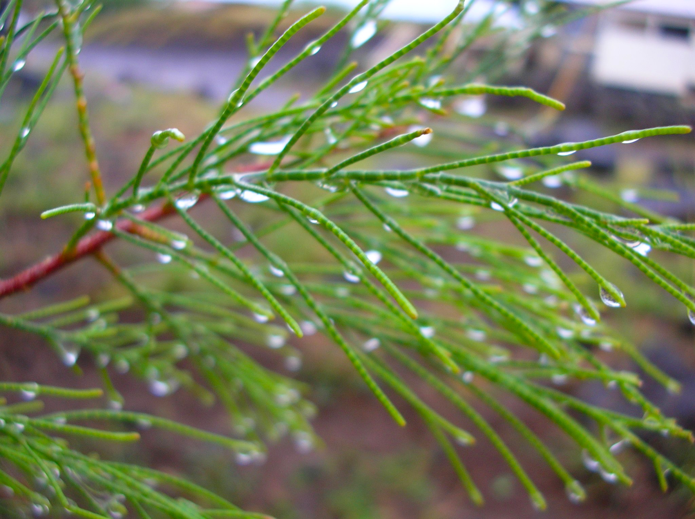

# Plants and Trees in the Bible

## License Information

Plants and Trees in the Bible © United Bible Societies, 2025. Adapted from: <cite>Each According to its Kind: Plants and Trees in the Bible</cite>, by Robert Koops © 2012 United Bible Societies. This work is licensed under Creative Commons Attribution-ShareAlike 4.0 International (<a href="https://creativecommons.org/licenses/by-sa/4.0/">https://creativecommons.org/licenses/by-sa/4.0/</a>).

--------------------------------

## 標題：檉柳（tamarisk） (id: FLORA:1.23)

1\.23 標題：檉柳（tamarisk）
=====================

經文出處
----

Hebrew 來： אֶשֶׁל (音譯： ’eshel)

[GEN 21:33](https://ref.ly/Gen21:33), [1SA 22:6](https://ref.ly/1Sam22:6), [1SA 31:13](https://ref.ly/1Sam31:13)

討論
--

*無葉檉柳 (Michael Baranovsky (Wikimedia Commons))*

聖經提到檉柳的兩個主要品種：無葉檉柳（學名*Tamarix aphylla* ）和更為常見的尼羅河檉柳（學名*Tamarix nilotica* ）。這兩個品種遍佈平原地區，以及阿拉瓦和尼革夫的河谷（乾河床），汲取突發洪水後滲入地下的水。檉柳可以在鹽堿地生長，因此有些地方稱之為「鹽地香柏樹」。另一種檉柳只生長在約旦河谷。這三種檉柳都沒有真正的葉子，只有多肉的小樹枝，成為山羊和綿羊的食物。羅望子樹（學名*Tamarindus indica* ）與檉柳的名稱十分相似，但實際上兩者沒有親緣關係。

在埋葬掃羅的敘事中，[1SA 31:13](https://ref.ly/1Sam31:13) 說他葬在*’eshel* 下（RSV (Revised Standard Version (1952)) 譯為"tamarisk"，「檉柳」），而[1CH 10:12](https://ref.ly/1Chr10:12) 說他葬在*’elah* 下（RSV (Revised Standard Version (1952)) 譯為"oak"，「橡樹」），兩者不符。那麼究竟是什麼樹呢？也許這兩種都不是！

在希伯來文發展的某個階段，*’eshel* 一詞成為了樹木的統稱。然而，*’allon* （「橡樹」）和*’elah* （「篤耨香樹」）這兩個詞在聖經成書時期之後的希伯來文中被一般化為*’ilan* ，意思是「樹」。所以一種可能性是，在《歷代志上》的編輯過程中，*’elah* 作為一個通稱取代了早前的*’eshel* ，而後者在當時可能已經是一個通稱。也就是說，這兩個詞可能都是「樹」的統稱，只是各自作為不同地區、風格或時興的變體。

描述
--

*檉柳在一些柏樹前面 (Ray Pritz (UBS))*

無葉檉柳可以長到10米（33英呎）高，樹幹底部直徑可達1米（3英呎）。更為常見的尼羅河檉柳比較矮小，實際上是從地面開始分枝的灌木。檉柳生長在非常乾旱的地方，根系深深地紮進地裡。據發現，伊拉克一棵檉柳的樹根延伸到了地表以下11米（36英呎）處（赫珀，第53頁）。這兩個品種都有寬大的樹冠，樹幹通常呈扭絞狀，枝條類似香柏樹，並且會像柳樹一樣垂下來。貝都因牧羊人為了牧羊，在尼革夫各地栽種了許多檉柳。

特殊意義
----

*類似香柏樹葉子的檉柳葉 (Forest and Kim Starr (Wikimedia Commons))*

亞伯拉罕種了一棵檉柳，在那裡敬拜耶和華（[GEN 21:33](https://ref.ly/Gen21:33) ），表明這些樹就像橡樹那樣，與靈界有關。祖海里認為，在[LEV 14:4](https://ref.ly/Lev14:4) 和[NUM 19:6](https://ref.ly/Num19:6) 關於潔淨條例中提到的「香柏樹」的枝子可能是檉柳枝，儘管以色列人在曠野漂流的一些地方也長著腓尼基杜松（與香柏樹非常相似）。檉柳被引進到美國西部後，在河床裡繁殖得非常快速，以致現在被視為一種造成重大損失的環境公害。有些地方會用檉柳來製造染料或加工皮革。

翻譯
--

檉柳盛產於亞洲（40種）和歐洲（14種），另有幾個品種生長在地中海盆地的非洲。英文譯本幾乎一致將*’eshel* 譯為"tamarisk"（「檉柳」）。CEV (Contemporary English Version) 譯作"tamarisk"（「檉柳」），並增加了一個腳註：「一種高大的遮蔭樹，根系深，需水少。」翻譯「檉柳」的方法有：

1\. 從一種主要語言進行音譯，如*tamarisiki* 、*tamaris* 、*esheli* （希伯來文），或*eteli* /*atali* （阿拉伯文）。

2\. 在《創世記》，幾乎可以肯定這種樹與亞伯拉罕敬拜上帝有關聯，鑒於樹的這個功能，可以將其翻譯為「聖樹」，或許還可以增加一個腳註來說明這個詞的希伯來文和／或英文；如果在[GEN 12:6](https://ref.ly/Gen12:6) 已經使用了「聖樹」來表示「橡樹」，則更需要在腳註中說明。

3\. 只譯作「樹」，在腳註中說明希伯來文作*’eshel* ，即檉柳。

* **Associated Passages:** 創世記 21:33; 撒母耳記上 22:6; 撒母耳記上 31:13; 歷代志上 10:12; 利未記 14:4; 民數記 19:6; 創世記 12:6

* **Associated ACAI Concepts:** Tamarisk (ID: `flora:Tamarisk`)
