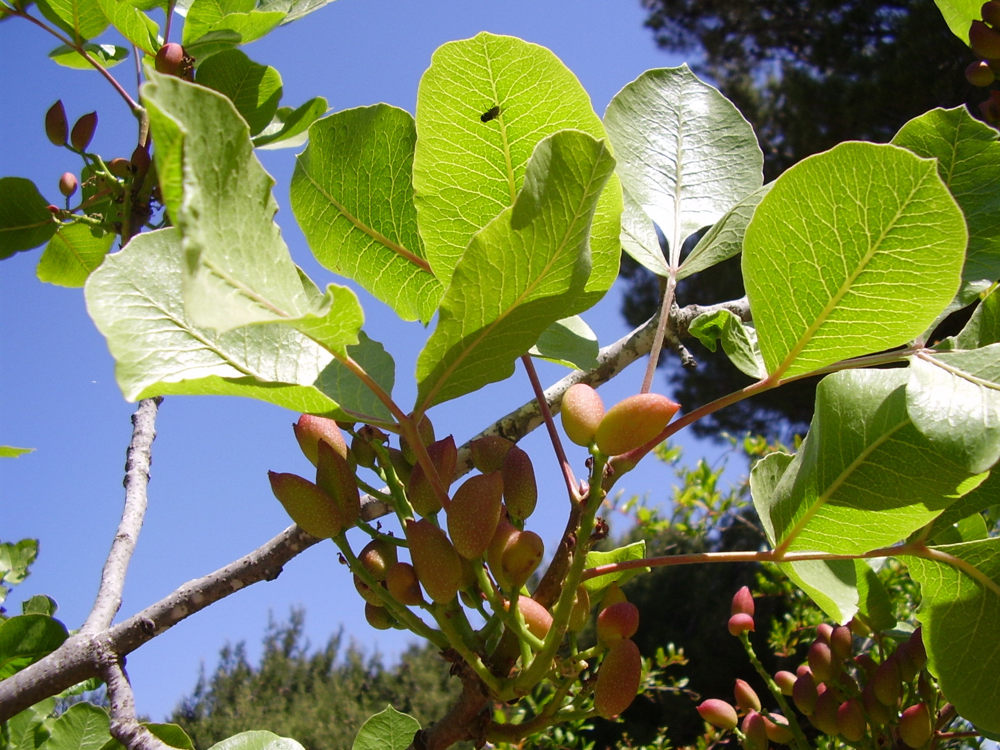

# Plants and Trees in the Bible

## License Information

Plants and Trees in the Bible © United Bible Societies, 2025. Adapted from: <cite>Each According to its Kind: Plants and Trees in the Bible</cite>, by Robert Koops © 2012 United Bible Societies. This work is licensed under Creative Commons Attribution-ShareAlike 4.0 International (<a href="https://creativecommons.org/licenses/by-sa/4.0/">https://creativecommons.org/licenses/by-sa/4.0/</a>).

--------------------------------

## 標題：篤耨香樹、黃連木（terebinth） (id: FLORA:1.24)

1\.24 標題：篤耨香樹、黃連木（terebinth）
============================

經文出處
----

### **樹** ：

Hebrew 來： אֵלָה, אַלָּה (音譯： ’elah, ’alah)

[GEN 35:4](https://ref.ly/Gen35:4), [JOS 24:26](https://ref.ly/Josh24:26), [JDG 6:11](https://ref.ly/Judg6:11), [JDG 6:19](https://ref.ly/Judg6:19), [1SA 17:2](https://ref.ly/1Sam17:2), [1SA 17:19](https://ref.ly/1Sam17:19), [1SA 21:10](https://ref.ly/1Sam21:10), [2SA 18:9](https://ref.ly/2Sam18:9), [2SA 18:9](https://ref.ly/2Sam18:9), [2SA 18:10](https://ref.ly/2Sam18:10), [2SA 18:14](https://ref.ly/2Sam18:14), [1KI 13:14](https://ref.ly/1Kgs13:14), [1CH 10:12](https://ref.ly/1Chr10:12), [ISA 1:30](https://ref.ly/Isa1:30), [ISA 6:13](https://ref.ly/Isa6:13), [EZK 6:13](https://ref.ly/Ezek6:13), [HOS 4:13](https://ref.ly/Hos4:13)

Hebrew 來： אַיִל (音譯： ’ayil)

[ISA 1:29](https://ref.ly/Isa1:29), [ISA 57:5](https://ref.ly/Isa57:5), [ISA 61:3](https://ref.ly/Isa61:3), [EZK 31:14](https://ref.ly/Ezek31:14)

Hebrew 來： אֵלֶם (音譯： ’elem)

[PSA 56:1](https://ref.ly/Ps56:1)

Greek 希： σχῖνος (音譯： schinos)

[SUS 1:54](https://ref.ly/Sus1:54)

Greek 希： τερέμινθος (音譯： tereminthos)

[SIR 24:16](https://ref.ly/Sir24:16)

經文出處
----

### **果實** ：

Hebrew 來： בָּטְנִים (音譯： boten)

[GEN 43:11](https://ref.ly/Gen43:11)

經文出處
----

### **樹脂** ：

Hebrew 來： צֳרִי (音譯： tsori)

[GEN 37:25](https://ref.ly/Gen37:25), [GEN 43:11](https://ref.ly/Gen43:11), [JER 8:22](https://ref.ly/Jer8:22), [JER 46:11](https://ref.ly/Jer46:11), [JER 51:8](https://ref.ly/Jer51:8), [EZK 27:17](https://ref.ly/Ezek27:17)

討論
--

希伯來文*’elah* 和*’alah* 指聖經中提到的三種黃連木中的任何一種：（1）大西洋黃連木（學名*Pistacia atlantica* ）；（2）篤耨香黃連木（*Pistacia palaestina* 、*Pistacia terebinthus* ）；（3）乳香黃連木（*Pistacia lentiscus* 、*Pistacia lenticus* ），又稱乳香樹。

根據祖海里的意見，大西洋黃連木，又名椴樹（teil tree），分佈在尼革夫、下加利利和但河河谷。赫珀說，基列地曾盛產大西洋黃連木，樹幹和樹皮可作為芳香樹脂（乳香）的原料出口到埃及。這種樹為旱地樹，生長在常綠林地和矮灌木草原的鄰接地帶（注意[1SA 17:2](https://ref.ly/1Sam17:2); [1SA 17:19](https://ref.ly/1Sam17:19); [1SA 21:10](https://ref.ly/1Sam21:10) 中的「以拉谷」）。大西洋黃連木的堅果可用來染色和鞣革，烤熟後也可以食用。這些堅果常在阿拉伯市場上售賣，比篤耨香黃連木的果實大，與聖地之外出產的真正的開心果非常不同（見下文）。

篤耨香黃連木主要生長在樹林茂密的山丘，經常與一般的橡樹混生。小小的球形堅果可以整個生吃，或烤熟吃。這些堅果（*boten* ）可能就是雅各的兒子帶到埃及的禮物（[GEN 43:11](https://ref.ly/Gen43:11) ）；但是祖海里認為，這些禮物也可能是盛產於波斯（現伊朗）的、真正的開心果樹（阿月渾子樹；學名*Pistacia vera* ）的果實。

乳香黃連木是一種生長在基列山的灌木或灌木叢，可能就是[GEN 37:25](https://ref.ly/Gen37:25) 所載以實瑪利人販賣的「乳香」（希伯來文*tsori* ）的原料，也可能在[GEN 43:11](https://ref.ly/Gen43:11) 與開心果一起被雅各的兒子帶到埃及。[GEN 37:25](https://ref.ly/Gen37:25); [JER 8:22](https://ref.ly/Jer8:22); [JER 46:11](https://ref.ly/Jer46:11) 均提到基列與乳香（學名*Tsori* ）之間的聯繫，說明乳香的原料是巴勒斯坦特有的一種植物，所以乳香*tsori* 可以用來交換埃及的貨物。《耶利米書》指的可能是由篤耨香樹脂製成的藥膏。

描述
--

篤耨香樹的外形很像橡樹，但葉子呈羽狀。大西洋黃連木可長到10米（33英呎）高。篤耨香黃連木較矮，高可達5米（17英呎）。乳香黃連木，或乳香樹，是一種小灌木或小喬木，高為1—3米（3—10英呎），枝幹切開會流出芳香的樹脂。樹脂乾燥成硬塊後再磨碎，溶解在橄欖油中，可用來製作藥品、香水、薰香、清漆和膠水。

特殊意義
----

這兩種比較高大的黃連木都受到古代以色列人和其他民族的崇敬。他們在黃連木樹林裡築壇，有時還在那裡埋葬死者。乳香黃連木的樹脂因藥用價值而被珍視，這就是為什麼以實瑪利人（[GEN 37:25](https://ref.ly/Gen37:25) ）和雅各的眾子（[GEN 43:11](https://ref.ly/Gen43:11) ）將其作為交易的貨物帶到埃及。[SIR 24:16](https://ref.ly/Sir24:16) 用枝幹舒展的黃連木來比喻智慧。

翻譯
--

在[HOS 4:13](https://ref.ly/Hos4:13) ，KJV (King James Version (1611)) 將本應是「篤耨香樹」的樹木譯作"elms"（「榆樹」）。在[GEN 35:4](https://ref.ly/Gen35:4) 中，示劍那裡的篤耨香樹（*’elah* ）似乎與[GEN 12:6](https://ref.ly/Gen12:6) 中的橡樹（*’elon* ）相衝突。有些譯本在這兩處都使用「橡樹」來統一譯詞。其他譯本則都譯作「篤耨香樹」。還有的譯本將這兩處都譯作「大樹」或「聖樹」。*’Elah* 很有可能在某個時期變成了大樹的通稱。

篤耨香黃連木只生長在中東地區，但黃連木屬（學名*Pistacia* ）樹種分佈很廣，從南歐經亞洲，一直到菲律賓等地區都有。如果在當地找不到同屬樹木，建議使用一般性的短語，或者從一種主要語言進行音譯，例如*terebinti* ，或根據希伯來文音譯為*elahi* 。

[PSA 56:1](https://ref.ly/Ps56:1) ：雖然希伯來文*’elem* 在[PSA 56:0](https://ref.ly/Ps56:0) 的標題中常作「無聲」的意思，但大多數解經家更傾向於將其視為「篤耨香樹」（*’elah* 、*’alah* ）的另一種拼寫法。

* **Associated Passages:** 創世記 35:4; 約書亞記 24:26; 士師記 6:11; 士師記 6:19; 撒母耳記上 17:2; 撒母耳記上 17:19; 撒母耳記上 21:10; 撒母耳記下 18:9; 撒母耳記下 18:10; 撒母耳記下 18:14; 列王紀上 13:14; 歷代志上 10:12; 以賽亞書 1:30; 以賽亞書 6:13; 以西結書 6:13; 何西阿書 4:13; 以賽亞書 1:29; 以賽亞書 57:5; 以賽亞書 61:3; 以西結書 31:14; 詩篇 56:1; 蘇撒拿傳 1:54; 德訓篇 24:16; 創世記 43:11; 創世記 37:25; 耶利米書 8:22; 耶利米書 46:11; 耶利米書 51:8; 以西結書 27:17; 創世記 12:6; 詩篇 56:0

