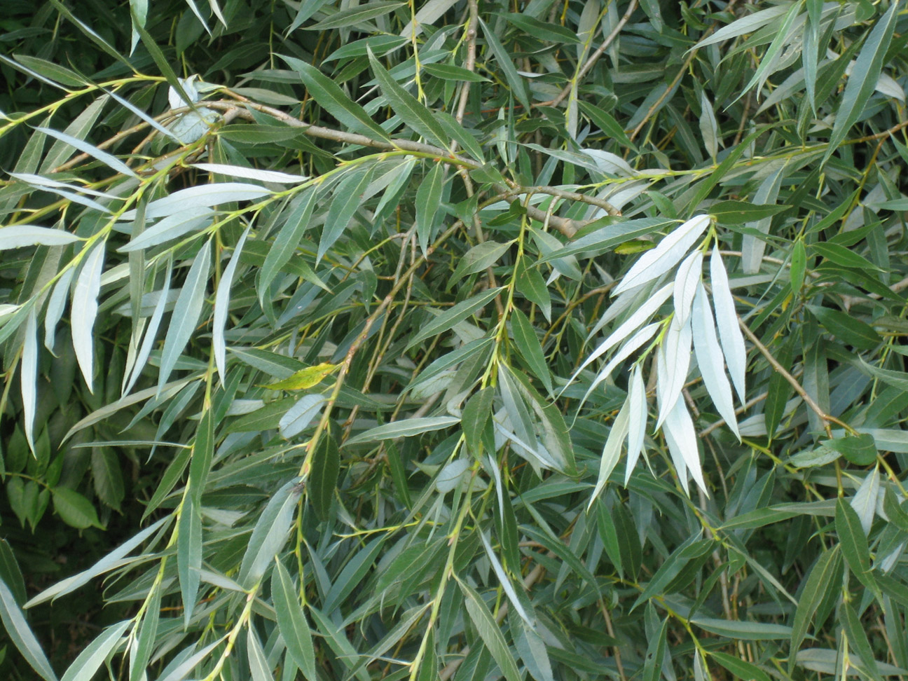

# Plants and Trees in the Bible

## License Information

Plants and Trees in the Bible © United Bible Societies, 2025. Adapted from: <cite>Each According to its Kind: Plants and Trees in the Bible</cite>, by Robert Koops © 2012 United Bible Societies. This work is licensed under Creative Commons Attribution-ShareAlike 4.0 International (<a href="https://creativecommons.org/licenses/by-sa/4.0/">https://creativecommons.org/licenses/by-sa/4.0/</a>).

--------------------------------

## 標題：柳樹、楊柳（willow） (id: FLORA:1.26)

1\.26 標題：柳樹、楊柳（willow）
======================

經文出處
----

Hebrew 來： עֲרָבָה (音譯： ‘aravah)

[LEV 23:40](https://ref.ly/Lev23:40), [JOB 40:22](https://ref.ly/Job40:22), [ISA 44:4](https://ref.ly/Isa44:4)

Hebrew 來： צַפְצָפָה (音譯： tsaftsafah)

[EZK 17:5](https://ref.ly/Ezek17:5)

討論
--

*白柳 (Willow (Wikimedia Commons))*

巴勒斯坦有兩種柳樹，白柳（學名*Salix alba* ）生長在北方，普通柳樹（學名*Salix acmophylla* ）生長在南方，耐熱能力較強。在約旦河谷靠近死海的流域，柳樹被耐鹽的胡楊所取代。胡楊樹上長有兩種葉子，故引起一些名稱上的混淆。胡楊幼樹的嫩枝長出的葉子像柳葉一般細窄，成熟的胡楊葉子則較寬，呈卵形。

祖海里確信，[LEV 23:40](https://ref.ly/Lev23:40) 和[ISA 44:4](https://ref.ly/Isa44:4) 提到的樹木一定是柳樹。同一個希伯來文*‘aravah* 在[JOB 40:22](https://ref.ly/Job40:22) 中可能也是指柳樹。赫珀將[ISA 44:4](https://ref.ly/Isa44:4) 中的這個詞翻譯為「柳樹」，顯然與祖海里的觀點一致。FFB 承認，將「柳樹」放在[LEV 23:40](https://ref.ly/Lev23:40) 的語境下可能是對的，但隨即又說，「楊樹」在所有這些經文中都是合理的，因為阿拉伯文名稱*gharab* 與這個希伯來文詞語同源。祖海里回應說，阿拉伯人用*gharab* 來指稱楊樹和柳樹，因為這兩種樹的葉子十分相似。

根據上下文，[PSA 137:2](https://ref.ly/Ps137:2) 中的*‘aravah* 一詞最有可能是指胡楊（參[1\.20 楊樹 (poplar)](#FLORA:1.20) ）。《以西結書》提到一種生長在溪邊的植物（希伯來文*tsaftsafah* ），這可能是指楊樹，也可能指柳樹。根據祖海里的意見，埃及的阿拉伯人稱柳樹為*safsaf* ，而在北非的其他地方，*safsaf* 卻是指胡楊。

描述
--

*柳樹葉 (MPF (Wikimedia Commons))*

柳樹生長在河流和小溪邊，可長到6米（20英呎）高。葉子細長，冬天會掉落，綠色小花的花期在10月左右。

特殊意義
----

如果「柳樹」確實是《利未記》中*‘aravah* 的正確翻譯，那麼柳樹就是經文建議在住棚節用來搭棚的四種植物之一。《約伯記》記載，無人能夠馴服的神秘巨獸貝希摩斯就棲息在柳樹林裡面。在《以賽亞書》和《以西結書》中，柳樹象徵生長茂盛的事物。

翻譯
--

關於[LEV 23:40](https://ref.ly/Lev23:40) 中*‘aravah* 的翻譯，英文譯本分為幾種：（1）"willows"（「柳樹」；RSV (Revised Standard Version (1952)) 、NLT (New Living Translation) 、REB (Revised English Bible (1989)) 、NASB (New American Standard Bible) 、NJPSV (New Jewish Publication Society Version) ）；（2）"poplars"（「楊樹」；NIV (New International Version (1984)) 、NCV (New Century Version) 、 GW (God's Word Translation) 、NAB (New American Bible (1970)) ）；（3）"flowering shrubs"（「開花灌木」；NJB (New Jerusalem Bible (1985)) ）；（4）"leafy trees/branches"（「樹葉茂密的樹木／枝條」；GNB (Good News Bible) 、CEV (Contemporary English Version) ；GNB (Good News Bible) 結合了（3）和（4）的譯法，CEV (Contemporary English Version) 結合了後面三種譯法）。

如上所述，在[LEV 23:40](https://ref.ly/Lev23:40); [JOB 40:22](https://ref.ly/Job40:22); [ISA 44:4](https://ref.ly/Isa44:4) 中，我們建議譯成「柳樹」或一種柳屬（學名*Salix* ）樹木。世界各地的溫帶地區分佈有超過300種柳屬樹木。至少有一種柳屬樹木（學名*Salix subserrata* ）分佈在埃及、利比亞、以色列，以及撒哈拉以南的非洲地區。《熱帶西非的植物》（*Flora of West Tropical Africa* ）又列出了3種，帕爾格雷夫記錄了另外兩種在非洲南部土生土長的柳樹。尼日利亞的喬斯高原上也長有柳樹（赫珀，私人交流所獲訊息）。在建造圓形茅屋時，人們使用灌木柔韌的細木棍做成同心圓，以固定縱向的枝條（竹子或高粱稈）。其中一些可能是柳條，如果是這樣的話，與搭棚有關的經文可以使用柳樹的當地詞語。

在沒有這種植物的地方，我們傾向於採用「*wilo* 樹」這樣的表達，或者使用一個一般性的短語，並將其與「*wilo* 樹」合併，但務必在腳註中註明*wilo* 一詞，或是*wilo* 在一種主要語言中的對等詞。

在[ISA 44:4](https://ref.ly/Isa44:4) 和[EZK 17:5](https://ref.ly/Ezek17:5) 中，柳樹象徵快速生長，可能需要相應地譯為當地一種生長迅速的植物。

* **Associated Passages:** 利未記 23:40; 約伯記 40:22; 以賽亞書 44:4; 以西結書 17:5; 詩篇 137:2

* **Associated ACAI Concepts:** Willow (ID: `flora:Willow`)
