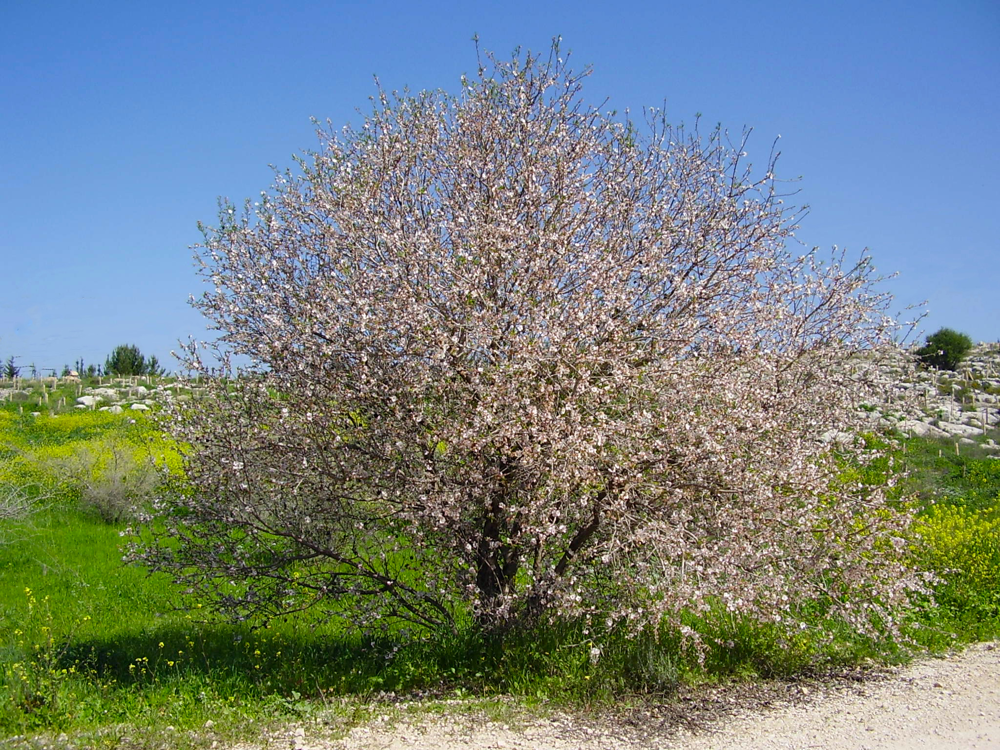

# Plants and Trees in the Bible

## License Information

Plants and Trees in the Bible © United Bible Societies, 2025. Adapted from: <cite>Each According to its Kind: Plants and Trees in the Bible</cite>, by Robert Koops © 2012 United Bible Societies. This work is licensed under Creative Commons Attribution-ShareAlike 4.0 International (<a href="https://creativecommons.org/licenses/by-sa/4.0/">https://creativecommons.org/licenses/by-sa/4.0/</a>).

--------------------------------

## 標題：杏樹、杏仁樹（almond） (id: FLORA:2.1)

2\.1 標題：杏樹、杏仁樹（almond）
======================

經文出處
----

Hebrew 來： לוּז (音譯： luz)

[GEN 30:37](https://ref.ly/Gen30:37)

Hebrew 來： מְשֻׁקָּד (音譯： meshuqad)

[EXO 25:33](https://ref.ly/Exod25:33), [EXO 25:33](https://ref.ly/Exod25:33), [EXO 25:34](https://ref.ly/Exod25:34), [EXO 37:19](https://ref.ly/Exod37:19), [EXO 37:19](https://ref.ly/Exod37:19), [EXO 37:20](https://ref.ly/Exod37:20)

Hebrew 來： שָׁקֵד (音譯： shaqed)

[GEN 43:11](https://ref.ly/Gen43:11), [NUM 17:23](https://ref.ly/Num17:23), [ECC 12:5](https://ref.ly/Eccl12:5), [JER 1:11](https://ref.ly/Jer1:11)

討論
--

*杏花 (Ray Pritz (UBS))*

杏仁樹是一種果樹，與李樹、櫻桃樹、桃樹和杏李樹同屬於李屬（學名*Prunus* ）。伊朗有15種野生杏仁樹；以色列有2種野生杏仁樹，1種栽培的杏仁樹（學名*Prunus dulcis* ；又稱*Amygdalus communis* ）。現今，在以色列的山區，甚至是在炎熱乾燥的尼革夫，生長著很多杏仁樹，並且在聖經時期可能就是這樣。

描述
--

杏仁樹可以長到約4米（13英呎）高，冬天落葉，在春季長出新葉之前，會開滿白色或粉色的花。杏仁樹的花朵扁平、花瓣呈橢圓形。果子長著絨毛，約有海棗大小，大約在開花10星期後長出。種子（「杏仁」）的50%是油脂，可生食，但通常會烘烤後再吃。

特殊意義
----

有三段經文提到杏樹的形態特徵。在[EXO 25:33](https://ref.ly/Exod25:33); [EXO 25:33](https://ref.ly/Exod25:33); [EXO 25:34](https://ref.ly/Exod25:34); [EXO 37:19](https://ref.ly/Exod37:19); [EXO 37:19](https://ref.ly/Exod37:19); [EXO 37:20](https://ref.ly/Exod37:20) 中，希伯來文*meshuqad* （「像杏」）指杏花的形狀。扁平的杏花很適合作為帳幕中燈臺枝子頂部的燈盞座的模型。

*杏樹 (Avishai Teicher (Wikimedia Commons))*

[ECC 12:5](https://ref.ly/Eccl12:5) 的作者用杏樹白色的花簇來象徵老年，這當然是將白花與老年人的白髮作比較。FFB 的註釋說，杏樹是「春天之美的象徵，卻不會給老人帶來快樂」（第89頁）；這樣的註釋沒有領會到詩人的才華。

在[JER 1:11](https://ref.ly/Jer1:11) 中，作者利用希伯來文*shaqed* （「杏樹」）與*shoqed* （意為「看守」或「清醒的」）之間的相似，來強調耶和華「看顧」以色列。有些解經家補充說，因為杏樹是春天最早開花的樹，甚至在發葉之前就開了，所以說它「很早醒來」；同樣地，上帝也是人們在患難中「很早就來到的幫助」。

[GEN 28:19](https://ref.ly/Gen28:19); [GEN 35:6](https://ref.ly/Gen35:6); [GEN 48:3](https://ref.ly/Gen48:3); [JOS 16:2](https://ref.ly/Josh16:2); [JOS 18:13](https://ref.ly/Josh18:13); [JOS 18:13](https://ref.ly/Josh18:13); [JDG 1:23](https://ref.ly/Judg1:23); [JDG 1:26](https://ref.ly/Judg1:26) 等經文提到了「路斯」這個地名，在希伯來文中，這個名稱與「杏」相同，表明了杏對當地人的價值，並且當時西奈的荒山上可能有杏樹，雖然現今那裡已經看不到這種樹木了。

翻譯
--

*成熟的杏仁堅果 (antcaesar (Wikimedia Commons))*

薔薇科李屬植物分佈在世界各地，例如中國有中國李（學名*Prunus salicina* ），北美洲的東部有雁李（學名*Prunus munsoniana* ）。不過，其中很多樹的枝子和果實與真正的杏仁樹相差很大，因此在非比喻性的經文中，不能使用當地樹種的名稱。在[GEN 30:37](https://ref.ly/Gen30:37) 這樣的經文中，建議按照某種主要語言的詞語進行音譯，例如*shaked* /*lus* （希伯來文）、*lawus* （阿拉伯文）、*amande* （法文）、*amendoa* （葡萄牙文）、*almendra* （西班牙文），以及*alimondi* 。英文中的l字母不發音，所以杏仁樹（almond）可以音譯為*amond* 。在比喻性的經文中，例如《出埃及記》和《傳道書》（參下文），翻譯者可以使用一種形狀和顏色與杏花相似的花朵。

在大多數譯本中，*shaqed* 和*luz* 需要根據上下文來翻譯，例如：

[GEN 43:11](https://ref.ly/Gen43:11) ：雅各給法老的禮物是「乳香、蜂蜜、香料、沒藥、堅果、杏仁各取一點」。大多數翻譯者在這裡都需要使用「杏仁樹的果實」或「杏仁樹的種子」這樣的短語。

[EXO 25:33](https://ref.ly/Exod25:33); [EXO 25:33](https://ref.ly/Exod25:33); [EXO 25:34](https://ref.ly/Exod25:34) ：這裡的重點是花的形狀（GNB (Good News Bible) 、CEV (Contemporary English Version) 、NIV (New International Version (1984)) 、REB (Revised English Bible (1989)) ；其他英文譯本作"almond blossoms"，「杏花」）。杏花有5個花瓣，大致呈杯狀。

[NUM 17:23](https://ref.ly/Num17:23) （《和》17:8）：因為亞倫的杖在第23節（《和》第8節）結了杏，所以有理由相信第17節（《和》第2節）提到的杖取自杏樹。對於有些語言，在第2節說明這一點可能會有助於經文的銜接。

[ECC 12:5](https://ref.ly/Eccl12:5) ：這裡，杏樹喻指老年。從英文或其他主要語言中音譯「杏樹」，會使詩歌的感染力大打折扣。Mft (Moffatt Translation (1926)) 把這節經文的第三句譯為"when his hair is almond white"（英文直譯：「當他的頭髮如杏般斑白」），在我所見過的譯本中，這是唯一試圖保留樹名和詩歌意象的譯法。

[JER 1:11](https://ref.ly/Jer1:11) ：如前所述，這裡的*shaqed* /*shoqed* （「杏／看守」）是一個雙關語。有幾個譯本在翻譯這個雙關語時作了大膽的嘗試；例如，Mft (Moffatt Translation (1926)) 把這節經文的最後一個分句譯為"The shoot of a wake\-tree"（「守夜之樹的枝子」），NJB (New Jerusalem Bible (1985)) 譯為"I see a branch of the Watchful Tree"（「我看見一根警醒之樹的枝子」）。

* **Associated Passages:** 創世記 30:37; 出埃及記 25:33; 出埃及記 25:34; 出埃及記 37:19; 出埃及記 37:20; 創世記 43:11; 民數記 17:23; 傳道書 12:5; 耶利米書 1:11; 創世記 28:19; 創世記 35:6; 創世記 48:3; 約書亞記 16:2; 約書亞記 18:13; 士師記 1:23; 士師記 1:26

* **Associated ACAI Concepts:** Almond (ID: `flora:Almond`)
