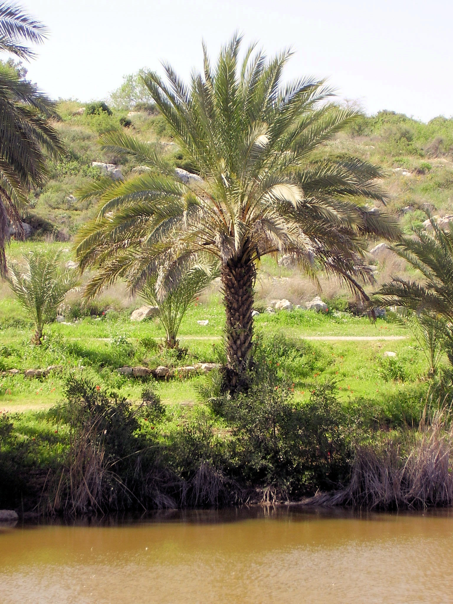

# Plants and Trees in the Bible

## License Information

Plants and Trees in the Bible © United Bible Societies, 2025. Adapted from: <cite>Each According to its Kind: Plants and Trees in the Bible</cite>, by Robert Koops © 2012 United Bible Societies. This work is licensed under Creative Commons Attribution-ShareAlike 4.0 International (<a href="https://creativecommons.org/licenses/by-sa/4.0/">https://creativecommons.org/licenses/by-sa/4.0/</a>).

--------------------------------

## 標題：海棗樹（date palm） (id: FLORA:2.5)

2\.5 標題：海棗樹（date palm）
======================

經文出處
----

### **樹** ：

Hebrew 來： תָּמָר (音譯： tamar)

[EXO 15:27](https://ref.ly/Exod15:27), [LEV 23:40](https://ref.ly/Lev23:40), [NUM 33:9](https://ref.ly/Num33:9), [DEU 34:3](https://ref.ly/Deut34:3), [JDG 1:16](https://ref.ly/Judg1:16), [JDG 3:13](https://ref.ly/Judg3:13), [2CH 28:15](https://ref.ly/2Chr28:15), [NEH 8:15](https://ref.ly/Neh8:15), [PSA 92:13](https://ref.ly/Ps92:13), [SNG 7:8](https://ref.ly/Song7:8), [SNG 7:9](https://ref.ly/Song7:9), [JOL 1:12](https://ref.ly/Joel1:12)

Hebrew 來： תֹּמֶר (音譯： tomer)

[JDG 4:5](https://ref.ly/Judg4:5)

Hebrew 來： תִּמֹרָה (音譯： timorah)

[1KI 6:29](https://ref.ly/1Kgs6:29), [1KI 6:32](https://ref.ly/1Kgs6:32), [1KI 6:32](https://ref.ly/1Kgs6:32), [1KI 6:35](https://ref.ly/1Kgs6:35), [1KI 7:36](https://ref.ly/1Kgs7:36), [2CH 3:5](https://ref.ly/2Chr3:5), [EZK 40:16](https://ref.ly/Ezek40:16), [EZK 40:22](https://ref.ly/Ezek40:22), [EZK 40:22](https://ref.ly/Ezek40:22), [EZK 40:26](https://ref.ly/Ezek40:26), [EZK 40:31](https://ref.ly/Ezek40:31), [EZK 40:34](https://ref.ly/Ezek40:34), [EZK 40:37](https://ref.ly/Ezek40:37), [EZK 41:18](https://ref.ly/Ezek41:18), [EZK 41:18](https://ref.ly/Ezek41:18), [EZK 41:19](https://ref.ly/Ezek41:19), [EZK 41:19](https://ref.ly/Ezek41:19), [EZK 41:20](https://ref.ly/Ezek41:20), [EZK 41:25](https://ref.ly/Ezek41:25), [EZK 41:26](https://ref.ly/Ezek41:26)

Greek 希： φοῖνιξ (音譯： phoinix)

[JHN 12:13](https://ref.ly/John12:13), [REV 7:9](https://ref.ly/Rev7:9), [SIR 24:14](https://ref.ly/Sir24:14), [SIR 50:12](https://ref.ly/Sir50:12), [2MA 10:7](https://ref.ly/2Macc10:7), [2MA 14:4](https://ref.ly/2Macc14:4)

經文出處
----

### **枝子** ：

Hebrew 來： כִּפָּה (音譯： kipah)

[JOB 15:32](https://ref.ly/Job15:32), [ISA 9:13](https://ref.ly/Isa9:13), [ISA 19:15](https://ref.ly/Isa19:15)

Greek 希： βαΐνη (音譯： bainē)

[1MA 13:37](https://ref.ly/1Macc13:37)

Greek 希： βάϊον (音譯： baion)

[JHN 12:13](https://ref.ly/John12:13), [1MA 13:51](https://ref.ly/1Macc13:51)

討論
--

*海棗樹 (Ray Pritz (UBS))*

在從加那利群島開始，橫貫非洲直到印度的氣候乾燥的熱帶國家，有40多種海棗樹（學名*Phoenix dactylifera* ）。海棗樹可能起源於中東（祖海里和霍普夫［Hopf］），現在那裡仍有許多這種樹。我們在[LEV 23:40](https://ref.ly/Lev23:40) 看到，住棚節會使用海棗樹的枝子；在[JHN 12:13](https://ref.ly/John12:13) ，人們用海棗樹的枝子（《和》、《和修》、《呂》作「棕樹枝」，《思》作「棕櫚枝」）歡迎耶穌。對於《約翰福音》12章所述事件，有一個合理的疑問：百姓是從哪裡弄到這些海棗樹枝的呢？因為耶路撒冷地勢較高，氣候較冷，海棗樹無法生長。但是，女先知底波拉的海棗樹（[JDG 4:5](https://ref.ly/Judg4:5) ）也存在同樣的疑問，因為她所住的地方是在拉瑪和伯特利之間，那地的海拔和耶路撒冷相差無幾。耶利哥被稱為「海棗樹之城」（希伯來文*temarim* ；[DEU 34:3](https://ref.ly/Deut34:3); [JDG 1:16](https://ref.ly/Judg1:16); [JDG 3:13](https://ref.ly/Judg3:13); [2CH 28:15](https://ref.ly/2Chr28:15) ）。海棗可以生吃，也可以曬乾後壓成「餅」，有時還可以做成飲料。在[DEU 8:8](https://ref.ly/Deut8:8) 中，希伯來文*devash* 通常被認為是「蜂蜜」，但也可能指一種用海棗製成的糖漿。在過去和現在，人們都用海棗樹的葉子做墊子、籃子、籬笆和屋頂。今天，在約旦河谷和阿拉瓦谷、死海周邊，以及以色列沿海平原，都大量種植海棗樹。英文"date"（「海棗」）是從拉丁文*dactylus* ，經古法文*datil* 演變而成的。拉丁文則源於希臘文*daktylos* （意為「手指」）。

描述
--

海棗樹通常可以長到10—20米（33—66英呎）高，樹頂的大葉子聚成一簇。老樹葉每年枯萎下垂，果農就把老枝砍掉。未成熟的葉子緊緊地包在一起，這束葉子在希伯來文中稱為*lulav* 。海棗樹大約生長5年到8年就開始結果，果實甘甜，比大拇指略小，結成一大串。柔軟的果肉裡面有一顆長約2\.5厘米（1英吋）的硬核，也是種子。海棗樹雌雄異株。有些地方只生有單一性株的海棗樹，因為沒有授粉，所以不結果實。果農更喜歡通過培育樹基處的吸芽來繁殖海棗樹，而不是通過種子繁殖，因為種子會產生太多的雄株。雌株在夏季（6月—8月）結果。

特殊意義
----

*海棗樹 (haitham alfalah (Wikimedia Common))*

在[SNG 7:8](https://ref.ly/Song7:8) （《和》7:7），海棗樹是高貴和優雅的象徵。[PSA 92:13](https://ref.ly/Ps92:13); [PSA 92:14](https://ref.ly/Ps92:14); [PSA 92:15](https://ref.ly/Ps92:15) （《和》92:12–14）說，義人要如海棗樹那樣興旺，而[JOB 15:32](https://ref.ly/Job15:32) 說，惡人要像枯乾的海棗枝那樣枯萎。[NEH 8:15](https://ref.ly/Neh8:15) 提到與住棚節有關的四種特殊樹木，海棗樹便是其中之一。她瑪（意為「海棗樹」）是一個常見的希伯來名字，聖經有好幾卷書都提到過這個名字（如[GEN 38:6](https://ref.ly/Gen38:6); [RUT 4:12](https://ref.ly/Ruth4:12); [1CH 2:4](https://ref.ly/1Chr2:4) ）。在[1MA 13:37](https://ref.ly/1Macc13:37) ，海棗枝是和平的象徵，然而在[1MA 13:51](https://ref.ly/1Macc13:51) 象徵勝利（另參[JHN 12:13](https://ref.ly/John12:13) ；[REV 7:9](https://ref.ly/Rev7:9) ；[2MA 10:7](https://ref.ly/2Macc10:7) ）。

翻譯
--

*曬乾的和新鮮的海棗 (Maderibeyza (Wikimedia Commons))*

對於通常生長在沙漠地區的海棗樹，西非海岸的翻譯者經常會用油棕樹或椰子樹來替代。還有一些翻譯者熟悉扇葉棕櫚（學名*Borassus* ；「魯恩棕櫚」），但應注意，扇葉棕櫚的葉子和海棗樹的葉子很不一樣。我不清楚非歐洲語言中是否有棕櫚樹的統稱。海棗樹枝在住棚節的作用是搭建簡陋的住所，因此這裡的棕櫚樹是哪一種並沒有太大的關係。在描述聖殿時，經文提到用棕樹作裝飾（參[1KI 6:29](https://ref.ly/1Kgs6:29); [1KI 6:35](https://ref.ly/1Kgs6:35) ），情況也是一樣。但是，如果提到這種樹的果實，那麼建議按照希伯來文*tamar* 或某種主要語言的詞語進行音譯。

在有油棕樹和椰子樹、但沒有海棗樹的地方，建議譯成「油棕」。在沒有棕櫚樹的地方，市場上仍然可能有海棗樹的果實，尤其是在穆斯林占多數的地方，海棗樹的果實可能是齋月期間一種受歡迎的開齋食品。尼日利亞北部的峽谷內長著一種矮種海棗樹（學名*Phoenix reclinata* ），所結的小果子和大棕櫚樹的果子非常像，可食用。至少有一個譯本（貝羅姆文譯本）採用了當地名稱。

在海棗樹根本不為人所知的地方，有以下幾種選擇：

1\. 使用表示油棕或椰子樹的詞語（並考慮添加腳註，說明希伯來文*tamar* 和*tomer* ，以及希臘文*phoinix* ，都是指另外一種外形相似但是果實非常不同的樹）；

2\. 按照希伯來文（*tomera* 、*tamara* ）和希臘文（*fonis* 、*fowinik* ）進行音譯；

3\. 按照一種主要語言進行音譯，例如，*nakhal* /*temer* （阿拉伯文）、*dattier* （法文）、*datil* /*palmera* （西班牙文）、*mtende* （斯瓦希里文）、*khaji* （印度文）、*karchuram* （泰米爾文）、「海棗」（中文）；

4\. 使用一個與上下文相符的一般性短語，例如「好看的樹」。

[NUM 24:6](https://ref.ly/Num24:6) ：這節經文的第一行是「如連綿的*nechalim* 」（*nachal* 的複數）。希伯來文*nachal* 的字面意思是水的「急流」。由於「急流」與花園、沉香樹和香柏木並列在一起很奇怪，並且阿拉伯文中有一個意為海棗的詞與之相似，因此大多數學者認為這個詞在這裡指的就是海棗。許多英文譯本譯為"palm groves"（「棕櫚叢」；NRSV (New Revised Standard Version (1989)) 、NLT (New Living Translation) 、REB (Revised English Bible (1989)) 、NJPSV (New Jewish Publication Society Version) ；CEV (Contemporary English Version) 類似），或"rows of palms"（「一行行的棕櫚」；GNB (Good News Bible) ）。

[JOB 15:32](https://ref.ly/Job15:32) ：關於第31節的希伯來文*temurato* （「他的報應」）和第32節的*timmale'* （「它（報應）必完全實現」）的爭論已持續幾個世紀。烏比岡（Houbigant）等人說，*temurato* 應讀作*timorato* （「他的棕櫚樹」）；*timmale'* 應讀作*timmal* （「它必乾枯」；《七十士譯本》、《武加大譯本》和敘利亞文譯本同）。這個解釋為第32節的希伯來文*kipah* （「枝子」）作了鋪墊；該節第二行是「它的枝子不得青綠」。多爾姆（Dhorme）認為，*temurato* 應讀作*zemorato* （「他的葡萄嫩枝」），指向第33節關於葡萄樹的那行詩文。《〈約伯記〉手冊》（*A Handbook on The Book of Job* ）支持在這段經文中使用「棕櫚樹」和「棕櫚枝」。我們也贊同。

[JOB 29:18](https://ref.ly/Job29:18) ：《七十士譯本》譯作*phoinix* （「棕櫚樹」），而不是「塵沙」。許多學者在這裡採用《七十士譯本》的譯法，但有些學者認為*phoinix* 不是指海棗樹，而是指傳說中一種很長壽的鳥，「鳳凰」。

* **Associated Passages:** 出埃及記 15:27; 利未記 23:40; 民數記 33:9; 申命記 34:3; 士師記 1:16; 士師記 3:13; 歷代志下 28:15; 尼希米記 8:15; 詩篇 92:13; 雅歌 7:8; 雅歌 7:9; 約珥書 1:12; 士師記 4:5; 列王紀上 6:29; 列王紀上 6:32; 列王紀上 6:35; 列王紀上 7:36; 歷代志下 3:5; 以西結書 40:16; 以西結書 40:22; 以西結書 40:26; 以西結書 40:31; 以西結書 40:34; 以西結書 40:37; 以西結書 41:18; 以西結書 41:19; 以西結書 41:20; 以西結書 41:25; 以西結書 41:26; 約翰福音 12:13; 啟示錄 7:9; 德訓篇 24:14; 德訓篇 50:12; 瑪加伯下 10:7; 瑪加伯下 14:4; 約伯記 15:32; 以賽亞書 9:13; 以賽亞書 19:15; 瑪加伯上 13:37; 瑪加伯上 13:51; 申命記 8:8; 詩篇 92:14; 詩篇 92:15; 創世記 38:6; 路得記 4:12; 歷代志上 2:4; 民數記 24:6; 約伯記 29:18

* **Associated ACAI Concepts:** Date Palm (ID: `flora:DatePalm`)
