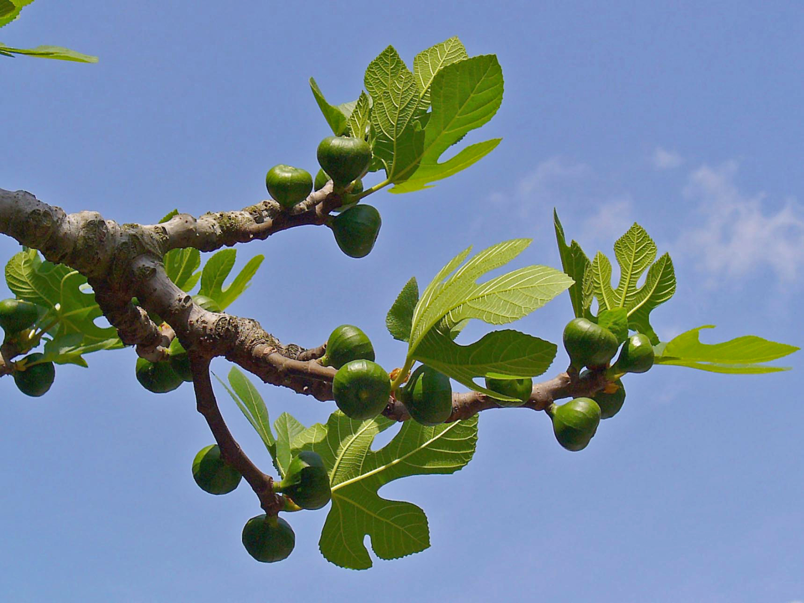

# Plants and Trees in the Bible

## License Information

Plants and Trees in the Bible © United Bible Societies, 2025. Adapted from: <cite>Each According to its Kind: Plants and Trees in the Bible</cite>, by Robert Koops © 2012 United Bible Societies. This work is licensed under Creative Commons Attribution-ShareAlike 4.0 International (<a href="https://creativecommons.org/licenses/by-sa/4.0/">https://creativecommons.org/licenses/by-sa/4.0/</a>).

--------------------------------

## 標題：無花果（fig） (id: FLORA:2.6)

2\.6 標題：無花果（fig）
================

經文出處
----

Hebrew 來： תְּאֵנָה (音譯： te’enah)

[GEN 3:7](https://ref.ly/Gen3:7), [DEU 8:8](https://ref.ly/Deut8:8), [JDG 9:10](https://ref.ly/Judg9:10), [JDG 9:11](https://ref.ly/Judg9:11), [1KI 5:5](https://ref.ly/1Kgs5:5), [2KI 18:31](https://ref.ly/2Kgs18:31), [PSA 105:33](https://ref.ly/Ps105:33), [PRO 27:18](https://ref.ly/Prov27:18), [SNG 2:13](https://ref.ly/Song2:13), [ISA 34:4](https://ref.ly/Isa34:4), [ISA 36:16](https://ref.ly/Isa36:16), [JER 5:17](https://ref.ly/Jer5:17), [JER 8:13](https://ref.ly/Jer8:13), [HOS 2:14](https://ref.ly/Hos2:14), [HOS 9:10](https://ref.ly/Hos9:10), [JOL 1:7](https://ref.ly/Joel1:7), [JOL 1:12](https://ref.ly/Joel1:12), [JOL 2:22](https://ref.ly/Joel2:22), [AMO 4:9](https://ref.ly/Amos4:9), [MIC 4:4](https://ref.ly/Mic4:4), [NAM 3:12](https://ref.ly/Nah3:12), [HAB 3:17](https://ref.ly/Hab3:17), [HAG 2:19](https://ref.ly/Hag2:19), [ZEC 3:10](https://ref.ly/Zech3:10)

Greek 希： συκῆ (音譯： sukē)

[MAT 21:19](https://ref.ly/Matt21:19), [MAT 21:19](https://ref.ly/Matt21:19), [MAT 21:20](https://ref.ly/Matt21:20), [MAT 21:21](https://ref.ly/Matt21:21), [MAT 24:32](https://ref.ly/Matt24:32), [MRK 11:13](https://ref.ly/Mark11:13), [MRK 11:20](https://ref.ly/Mark11:20), [MRK 11:21](https://ref.ly/Mark11:21), [MRK 13:28](https://ref.ly/Mark13:28), [LUK 13:6](https://ref.ly/Luke13:6), [LUK 13:7](https://ref.ly/Luke13:7), [LUK 21:29](https://ref.ly/Luke21:29), [JHN 1:48](https://ref.ly/John1:48), [JHN 1:50](https://ref.ly/John1:50), [JAS 3:12](https://ref.ly/Jas3:12), [REV 6:13](https://ref.ly/Rev6:13), [1MA 14:12](https://ref.ly/1Macc14:12)

**無花果樹** ：

經文出處
----

### **無花果** ：

Hebrew 來： בִּכּוּרָה (音譯： bikurah)

[ISA 28:4](https://ref.ly/Isa28:4), [JER 24:2](https://ref.ly/Jer24:2), [HOS 9:10](https://ref.ly/Hos9:10), [MIC 7:1](https://ref.ly/Mic7:1)

Hebrew 來： דְּבֵלָה (音譯： develah)

[1SA 25:18](https://ref.ly/1Sam25:18), [1SA 30:12](https://ref.ly/1Sam30:12), [2KI 20:7](https://ref.ly/2Kgs20:7), [1CH 12:41](https://ref.ly/1Chr12:41), [ISA 38:21](https://ref.ly/Isa38:21)

Hebrew 來： פַּג (音譯： pag)

[SNG 2:13](https://ref.ly/Song2:13)

Hebrew 來： תְּאֵנָה (音譯： te’enah)

[NUM 13:23](https://ref.ly/Num13:23), [NUM 20:5](https://ref.ly/Num20:5), [2KI 20:7](https://ref.ly/2Kgs20:7), [NEH 13:15](https://ref.ly/Neh13:15), [ISA 38:21](https://ref.ly/Isa38:21), [JER 8:13](https://ref.ly/Jer8:13), [JER 24:1](https://ref.ly/Jer24:1), [JER 24:2](https://ref.ly/Jer24:2), [JER 24:2](https://ref.ly/Jer24:2), [JER 24:2](https://ref.ly/Jer24:2), [JER 24:3](https://ref.ly/Jer24:3), [JER 24:3](https://ref.ly/Jer24:3), [JER 24:5](https://ref.ly/Jer24:5), [JER 24:8](https://ref.ly/Jer24:8), [JER 29:17](https://ref.ly/Jer29:17)

Greek 希： ὄλυνθος (音譯： olunthos)

[REV 6:13](https://ref.ly/Rev6:13)

Greek 希： σῦκον (音譯： sukon)

[MAT 7:16](https://ref.ly/Matt7:16), [MRK 11:13](https://ref.ly/Mark11:13), [LUK 6:44](https://ref.ly/Luke6:44), [JAS 3:12](https://ref.ly/Jas3:12)

討論
--

*耶路撒冷的無花果樹 (Ray Pritz (UBS))*

*無花果樹的葉子 (Ray Pritz (UBS))*

聖經提到兩種近緣無花果樹：普通無花果（學名*Ficus carica* ，希伯來文*te’enah* ）和西克莫無花果（學名*Ficus sycomorus* ，希伯來文*shiqmah* ；參[2\.11 西克莫無花果 (sycomore fig)](#FLORA:2.11) ）。普通無花果樹生長在以色列和世界上其他氣候溫暖的地方。在聖地，無花果是常見的食物來源，可以生吃或者曬乾後吃。有時，人們把乾無花果壓成扁平的「餅」或塊（希伯來文*develah* ）。同樣重要的是，無花果樹的葉子很大，可以很好地遮蔭。然而，聖經在第一次提到無花果樹時（[GEN 3:7](https://ref.ly/Gen3:7) ），既不是作食物，也不是為了遮蔭，而是用來做衣服；亞當和夏娃把無花果樹的葉子縫起來，以遮掩赤身。

無花果樹可能是在大約5000年前，從生長在土耳其西北部的一個野生品種栽培出來的。希臘、羅馬和埃及的文獻記錄表明，這種水果很受歡迎。現在，無花果樹主要生長在以色列、土耳其、希臘、意大利和葡萄牙，以及美國的溫暖地區。它與黑桑樹（學名*Morus nigra* ）、麵包樹（*Artocarpus altilis* ）、菠蘿蜜樹（*Artocarpus heterophyllus* ）和中國的柘樹（*Cudrania tricuspidata* ）是遠親。

有學者認為，無花果樹原產於西亞，由人類和鳥類傳播到地中海地區。在可追溯到至少主前5000年的遺址中，人們發掘出了無花果的殘餘物。

描述
--

*未成熟的無花果 (H. Zell (Wikimedia Commons))*

栽培的無花果樹可長到5—8米（17—26英呎）高，樹冠呈圓形，根極深，圓形。樹幹直徑可超過70厘米（2英呎）。如果得到妥善照料，無花果樹可以生長幾十年，一般通過插枝來繁殖。這種樹的花朵授粉是一個奇妙的、極其精細的過程，與一種小黃蜂的生命週期密切相關。無花果樹與番木瓜樹和海棗樹一樣都是雌雄異株。（現在有些品種的無花果不需授粉也能結果。）無花果的大小和雞蛋差不多；根據品種不同，果子有綠色、黃色、紫色或棕色。這種水果甘甜柔軟，很難運輸。因此，大多數農民都會將其曬乾後再運輸。準確地說，無花果樹的「果實」是一種形狀奇特的花。因為沒有「真正的」花，古印度人稱之為不開花的樹。

特殊意義
----

*切開的新鮮無花果 (Eric Hunt (Wikimedia Commons))*

無花果樹是猶太人三種「最重要的樹」之一，另外兩種是葡萄樹和橄欖樹。聖經提到無花果超過270次。對以色列人來說，安居樂業的景象就是：「各人都在自己的葡萄樹下和無花果樹下安然居住」（[1KI 5:5](https://ref.ly/1Kgs5:5) ，《和》4:25）。

翻譯
--

野生無花果樹在熱帶地區很常見；無花果屬（或榕屬；學名*Ficus* ）的樹木至少有800種，僅在非洲南部就有32種。榕樹、菩提樹和覺樹都是無花果樹的一個品種。野生無花果樹的果實不像栽培的無花果那樣多汁、甘甜。在許多地方，人們會吃野生無花果樹的果實，但不會在市場上售賣，也不會種植這種樹。我們強烈建議翻譯者使用當地的詞語來翻譯；如有必要，應在腳註中說明當地品種與聖經所述品種之間的區別。在不知道無花果的地方，可以在非比喻性的經文中使用某種主要語言的音譯，例如，*fikus* （拉丁文）、*teen* /*barchomi* （阿拉伯文）、*higo* /*higuera* （西班牙文）、*figue* （法文）、*Feige* （德文）、*fico* （意大利文）、*figuera* （葡萄牙文）、*mu hwa gwa* （韓文）、*anjeer* （印度文），或「無花果」（中文）。

* **Associated Passages:** 創世記 3:7; 申命記 8:8; 士師記 9:10; 士師記 9:11; 列王紀上 5:5; 列王紀下 18:31; 詩篇 105:33; 箴言 27:18; 雅歌 2:13; 以賽亞書 34:4; 以賽亞書 36:16; 耶利米書 5:17; 耶利米書 8:13; 何西阿書 2:14; 何西阿書 9:10; 約珥書 1:7; 約珥書 1:12; 約珥書 2:22; 阿摩司書 4:9; 彌迦書 4:4; 那鴻書 3:12; 哈巴谷書 3:17; 哈該書 2:19; 撒迦利亞書 3:10; 馬太福音 21:19; 馬太福音 21:20; 馬太福音 21:21; 馬太福音 24:32; 馬可福音 11:13; 馬可福音 11:20; 馬可福音 11:21; 馬可福音 13:28; 路加福音 13:6; 路加福音 13:7; 路加福音 21:29; 約翰福音 1:48; 約翰福音 1:50; 雅各書 3:12; 啟示錄 6:13; 瑪加伯上 14:12; 以賽亞書 28:4; 耶利米書 24:2; 彌迦書 7:1; 撒母耳記上 25:18; 撒母耳記上 30:12; 列王紀下 20:7; 歷代志上 12:41; 以賽亞書 38:21; 民數記 13:23; 民數記 20:5; 尼希米記 13:15; 耶利米書 24:1; 耶利米書 24:3; 耶利米書 24:5; 耶利米書 24:8; 耶利米書 29:17; 馬太福音 7:16; 路加福音 6:44

* **Associated ACAI Concepts:** Fig (ID: `flora:Fig`)
