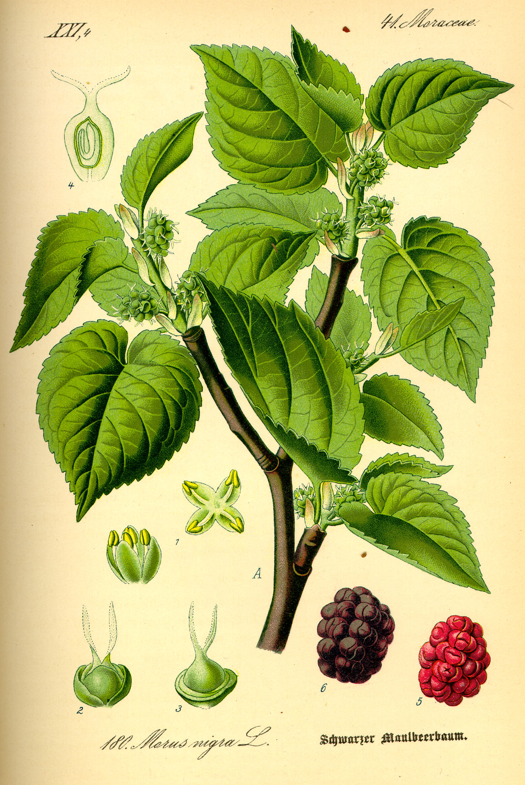

# Plants and Trees in the Bible

## License Information

Plants and Trees in the Bible © United Bible Societies, 2025. Adapted from: <cite>Each According to its Kind: Plants and Trees in the Bible</cite>, by Robert Koops © 2012 United Bible Societies. This work is licensed under Creative Commons Attribution-ShareAlike 4.0 International (<a href="https://creativecommons.org/licenses/by-sa/4.0/">https://creativecommons.org/licenses/by-sa/4.0/</a>).

--------------------------------

## 標題：桑樹（mulberry） (id: FLORA:2.7)

2\.7 標題：桑樹（mulberry）
====================

經文出處
----

Hebrew 來： מְסֻכָּן (音譯： mesukan)

[ISA 40:20](https://ref.ly/Isa40:20)

Greek 希： μόρον (音譯： moron)

[1MA 6:34](https://ref.ly/Bel6:34)

Greek 希： συκάμινος (音譯： sukaminos)

[LUK 17:6](https://ref.ly/Mark17:6)

討論
--

聖經中提到桑樹的經文都是有爭議的。不過，根據蘇美爾文中的同源詞（*messikanu* 、*sukannu* ），祖海里確信，[ISA 40:20](https://ref.ly/Isa40:20) 中的希伯來文*mesukan* 就是指桑樹；此前，湯普森（Tompson）也是這樣認爲。此外，他們還認為[LUK 17:6](https://ref.ly/Mark17:6) 中的希臘文*sucaminos* 與蘇美爾文中的*sukannu* 同源。與蘋果、石榴、無花果和開心果一樣，黑桑樹（學名*Morus nigra* ）可能也是從波斯（今伊朗）等鄰國傳入聖地的。

描述
--

黑桑樹是一種又大又闊的樹（高6米或20英呎），每年春天開花長葉，冬天落葉。樹冠開闊而低矮；樹幹隨著樹齡的增長而扭轉，甚至可能腐爛，最後被同根發出的另一個樹幹取代。人們會堆起石頭來支撐老樹的矮樹枝。黑桑樹的葉子硬挺、粗糙，並且長著柔毛。花靠風力授粉，結黑色漿果（桑葚），很酸，約有腰果大小。在歐洲和北美洲，桑葚主要用來做餡餅和酒。另外還有一種結白色果實的白桑樹。

黑桑樹的大小和形狀與西克莫無花果相似（參[2\.11 西克莫無花果 (sycomore fig)](#FLORA:2.11) ）。實際上，《七十士譯本》的翻譯者把希伯來文*shiqmah* 譯為*sucaminos* （[1KI 10:27](https://ref.ly/1Kgs10:27) ；[1CH 27:28](https://ref.ly/1Chr27:28) ；[2CH 1:15](https://ref.ly/2Chr1:15) ，[2CH 9:27](https://ref.ly/2Chr9:27) ；[PSA 78:47](https://ref.ly/Ps78:47) ；[ISA 9:9](https://ref.ly/Isa9:9) ［《和》9:10］；[AMO 7:14](https://ref.ly/Amos7:14) ），引起了極大的混淆。此混淆在德文等語言中一直存在，這些語言把西克莫無花果稱為「桑樹無花果」。

特殊意義
----

新約在[LUK 17:6](https://ref.ly/Mark17:6) 提到桑樹，這段經文記載了耶穌關於信心的比喻。他說，「你們若有信心像一粒芥菜種，就是對這棵桑樹（*sucaminos* ）說：『你要連根拔起，栽在海裡』，它也會聽從你們。」

[1MA 6:34](https://ref.ly/Bel6:34) 記載，士兵在大象前面放置鮮紅的桑葚汁，以刺激牠們去作戰。

在中國，人們主要用桑樹（一個白色亞種）的葉子來餵養一種能產絲線的毛蟲（蠶），這些線可以織成絲綢。有證據表明，在基督教時期的最初幾個世紀，地中海的哥士島和腓尼基的西頓城就已經出現了養蠶業，人們通過餵養當地的一種蠶蛾來獲取絲線，這些蠶蛾就是以黑桑樹的葉子為食的。赫珀（第169頁）認為，[EZK 16:10](https://ref.ly/Ezek16:10); [EZK 16:13](https://ref.ly/Ezek16:13) 中提到的絲綢可能來自這些當地養蠶業的前身。

翻譯
--

世界上至少有18個桑樹亞種，分佈在中國至北美的廣大地區。中東地區栽培的桑樹有兩種，即黑桑樹和白桑樹。黑桑樹在今伊朗地區長勢很好，並且很可能就是從那裡引入迦南的。

在生長桑樹的地區，[LUK 17:6](https://ref.ly/Mark17:6) 應使用當地的桑樹名稱來翻譯。在沒有桑樹的地區（例如非洲大部分地區），建議採用一種主要語言的音譯，例如*muluberi* 或*sikamayin* 。（法文*mûrier* 、西班牙文*mora* 、葡萄牙文*amoreira* 、阿拉伯文*tut* 。）KJV (King James Version (1611)) 在[2SA 5:23](https://ref.ly/2Sam5:23); [2SA 5:24](https://ref.ly/2Sam5:24) 和[1CH 14:14](https://ref.ly/1Chr14:14); [1CH 14:15](https://ref.ly/1Chr14:15) 中使用的是"mulberry"（「桑樹」）；但在這兩處經文中，我們建議譯為「楊樹」（參[1\.20 楊樹 (poplar)](#FLORA:1.20) ）。

* **Associated Passages:** 以賽亞書 40:20; 瑪加伯上 6:34; 路加福音 17:6; 列王紀上 10:27; 歷代志上 27:28; 歷代志下 1:15; 歷代志下 9:27; 詩篇 78:47; 以賽亞書 9:9; 阿摩司書 7:14; 以西結書 16:10; 以西結書 16:13; 撒母耳記下 5:23; 撒母耳記下 5:24; 歷代志上 14:14; 歷代志上 14:15

