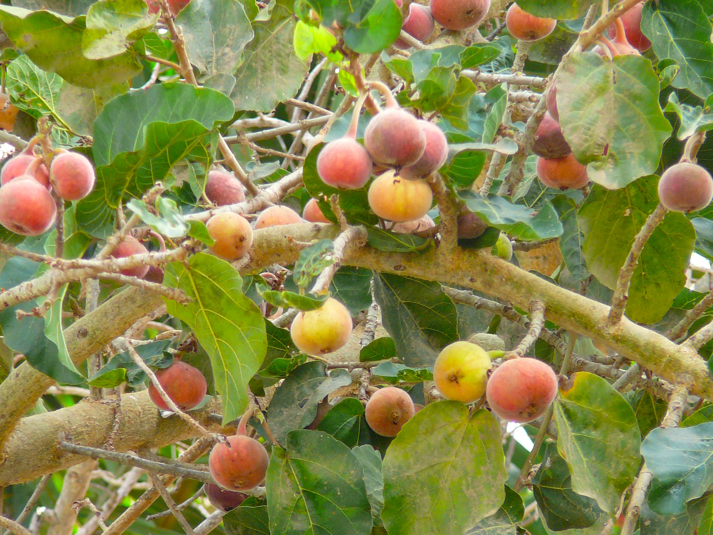

# Plants and Trees in the Bible

## License Information

Plants and Trees in the Bible © United Bible Societies, 2025. Adapted from: <cite>Each According to its Kind: Plants and Trees in the Bible</cite>, by Robert Koops © 2012 United Bible Societies. This work is licensed under Creative Commons Attribution-ShareAlike 4.0 International (<a href="https://creativecommons.org/licenses/by-sa/4.0/">https://creativecommons.org/licenses/by-sa/4.0/</a>).

--------------------------------

## 標題：西克莫無花果（sycomore fig） (id: FLORA:2.11)

2\.11 標題：西克莫無花果（sycomore fig）
=============================

經文出處
----

Hebrew 來： שִׁקְמָה (音譯： shiqmah)

[1KI 10:27](https://ref.ly/1Kgs10:27), [1CH 27:28](https://ref.ly/1Chr27:28), [2CH 1:15](https://ref.ly/2Chr1:15), [2CH 9:27](https://ref.ly/2Chr9:27), [PSA 78:47](https://ref.ly/Ps78:47), [ISA 9:9](https://ref.ly/Isa9:9), [AMO 7:14](https://ref.ly/Amos7:14)

Greek 希： συκομορέα (音譯： sukomorea)

[LUK 19:4](https://ref.ly/Luke19:4)

討論
--

*長成的西克莫無花果樹 (Atamari (Wikimedia Coomons))*

我們傾向於採納赫珀的意見，譯為「西克莫無花果」（"sycamore"），而不是「懸鈴樹」（"sycamore"）。因為「sycomore」的拼寫含「o」，更好地保留了拉丁文（*sycomorus* ）和希臘文（*suko­morea* ），並且也在法文中使用。注意，在KJV (King James Version (1611)) 和NEB (New English Bible (1970)) 中，這種樹的拼寫含有「o」。正如赫珀所指出的（第114頁），保留"sycamore"這個名稱來指稱美國的一種懸鈴木（學名*Platanus* ）和英國槭屬（學名*Acer* ）的一種樹木，可能會對翻譯有所幫助。

西克莫無花果（學名*Ficus sycomorus* ），又名桑樹無花果（比較德文*Maulbeerfeigen­baum* ），是無花果的一種，尤其盛產於地中海地區的地勢較低的地方。早在主前3000年，西克莫無花果在埃及和印度的印度河流域就已經為人所知。目前，以色列的西克莫無花果樹主要分佈在沿海平原，祖海里推測，這種無花果樹先前分佈的範圍要更廣。

先知阿摩司說自己是「修剪西克莫無花果樹的」（RSV (Revised Standard Version (1952)) 直譯；[AMO 7:14](https://ref.ly/Amos7:14) ）。這可能是指在未成熟的果實上切一道口，從而起到催熟的效果。赫珀（第113頁）說，這種現象是果實切口後釋放的乙烯氣體引起的。今天，水果商販也使用乙烯氣體來催熟橘子和香蕉。

描述
--

*在樹幹上結實的無花果 (udi Steinwell, PikiWiki Israel (Wikimedia Commons))*

西克莫無花果樹並不高大，最高約10米（33英呎），低矮的樹枝粗大而舒展，正好適合身材較矮的人爬到上面，好從一群較高的人的頭頂上面看過去（參[LUK 19:4](https://ref.ly/Luke19:4) 所述撒該的故事）。果實可吃，但不如常見的無花果那樣多汁、甘甜。這種樹木最特別的地方是：果實是一簇簇地長在樹幹和樹枝上的，而不是長在葉子中間。

特殊意義
----

在[1KI 10:27](https://ref.ly/1Kgs10:27) 中，西克莫無花果用來喻指某物的數量很多。這節經文的後半句說，「他（所羅門王）使香柏木多如謝非拉的西克莫無花果樹」（RSV (Revised Standard Version (1952)) 直譯）。翻譯者要留意這裡的邏輯。經文不是說所羅門要把香柏木引進低地（謝非拉），而是說以色列地的香柏木將要像低地的西克莫無花果那樣多。

翻譯
--

*成熟的西克莫無花果 (איתן פרמן (Wikimedia Commons))*

翻譯者需要同時處理西克莫無花果和普通無花果。如果翻譯傾向於異化，翻譯者可能需要同時音譯普通無花果和西克莫無花果（例如*sikomori* ）。在有些情況下，使用西克莫無花果這個全稱可能較好。如果當地有一種無花果，那麼可以使用當地名稱來翻譯栽培的無花果（希伯來文*te’enah* ；希臘文*sukē* ）；當提到西克莫無花果時，可以添加「野生」或「低地」等詞語來指這種無花果（希伯來文*shiqmah* ；希臘文*sukomorea* ）。

如果當地人對無花果一無所知，那麽可以使用某種國際語言的音譯，例如法文（*sycomore* ）、西班牙文（*sicomoro* ）或希伯來文（*shiqmah* ）。與普通的無花果相比，西克莫無花果生長在海拔比較低的地方（謝非拉），這一點在翻譯中可能會用到（例如譯成「低地無花果」）。GECL (German Common Language Version (Gute Nachricht Bibel)) 譯作*Maulbeerfeigenbaum* （意為「桑樹無花果」）。

* **Associated Passages:** 列王紀上 10:27; 歷代志上 27:28; 歷代志下 1:15; 歷代志下 9:27; 詩篇 78:47; 以賽亞書 9:9; 阿摩司書 7:14; 路加福音 19:4

* **Associated ACAI Concepts:** Sycomore Fig (ID: `flora:SycomoreFig`); Fig (ID: `flora:Fig`)
