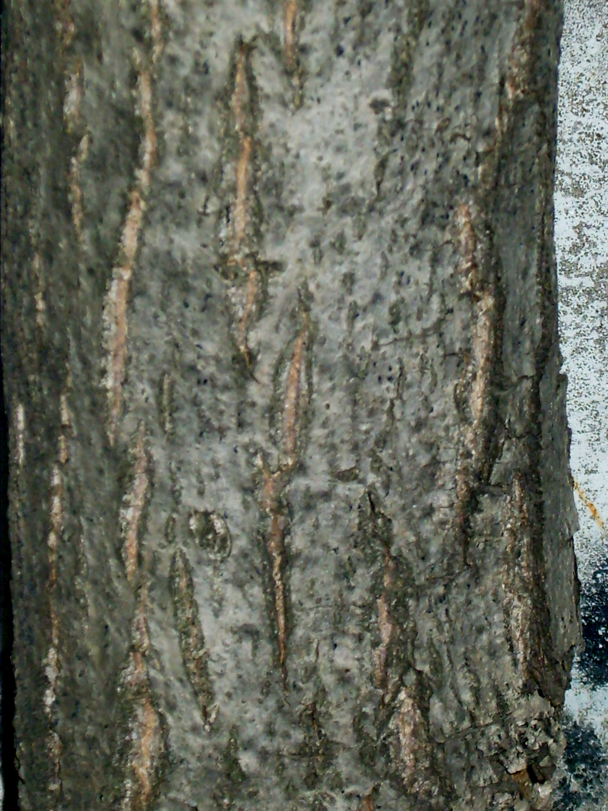

# Plants and Trees in the Bible

## License Information

Plants and Trees in the Bible © United Bible Societies, 2025. Adapted from: <cite>Each According to its Kind: Plants and Trees in the Bible</cite>, by Robert Koops © 2012 United Bible Societies. This work is licensed under Creative Commons Attribution-ShareAlike 4.0 International (<a href="https://creativecommons.org/licenses/by-sa/4.0/">https://creativecommons.org/licenses/by-sa/4.0/</a>).

--------------------------------

## 標題：胡桃（walnut） (id: FLORA:2.13)

2\.13 標題：胡桃（walnut）
===================

經文出處
----

Hebrew 來： אֱגוֹז (音譯： ’egoz)

[SNG 6:11](https://ref.ly/Song6:11)

討論
--

關於[SNG 6:11](https://ref.ly/Song6:11) 中提到的*’egoz* （「堅果園」）是什麼，人們尚無定論。這種樹可能是胡桃（walnut；CEV (Contemporary English Version) 、GW (God's Word Translation) 、FRCL (French Common Language Version (Bible en français courant)) 、GECL (German Common Language Version (Gute Nachricht Bibel)) ），因爲這種樹在聖經時期是衆所周知的，儘管可能只在這節經文中出現。大多數譯本為了穩妥起見，譯成「堅果園」（"nut orchard"；RSV (Revised Standard Version (1952)) ）、「堅果樹林」（"grove of nut trees"；NIV (New International Version (1984)) ）或類似的短語。GNB (Good News Bible) 譯為"almond"（「杏」），這也是可能的，儘管有人可能會問，如果作者是指杏，為什麽不使用兩個通常表示杏的希伯來文詞語（*luz* 或*shaqed* ）。

猶太歷史學家約瑟夫指出，胡桃是在加利利海地區栽培的。其他早期猶太著作描述了多種胡桃產品，包括油、單寧（用於皮革加工）和木材。東耶路撒冷還有一個地方叫胡桃谷。阿拉伯文同源詞*goz* 和*jauz* 指胡桃，這進一步説明*’egoz* 指的是胡桃。

描述
--

中東胡桃樹（學名*Juglans regia* ）可長到6—8米（20—26英呎）高，樹幹粗壯、枝條繁多、樹冠呈圓形。胡桃木質地很硬，適合做家具。這種樹原產於歐洲東南部，在高加索地區、土耳其北部、伊朗和其他西亞國家也曾有過胡桃林。迦南的胡桃樹可能是從土耳其或現今的伊朗引進的。

在歐洲、亞洲、美洲，一直到安第斯山脈的溫帶地區，分佈著40種胡桃樹的亞種。日本也有一種胡桃。在熱帶地區，有一些樹和真正的胡桃有些相似，因而也被稱為「胡桃」。例如，常說的非洲胡桃（或尼日利亞金胡桃）其實是洛沃棟（學名*Lovoa trichilioides* ），東印度胡桃是闊莢合歡（學名*Albizia lebbeck* ），新幾內亞胡桃是人面子屬（學名*Dracontomelon* ）樹木的一種，奧塔希地胡桃是石栗（學名*Aleurites moluccana* ），澳大利亞胡桃是昆士蘭土楠（學名*Endiandra palmerstonii* ）。胡桃屬中最為人所知的品種是波斯胡桃或普通胡桃（學名*Juglans regia* ），原產於歐洲東南部的巴爾干半島、亞洲西南部和中部，以及中國西南部。美國人常把波斯胡桃誤認為是英國胡桃（該品種並非原產於英格蘭）。世界上最大、最古老的野生胡桃樹林位於吉爾吉斯斯坦賈拉拉巴德省的阿斯蘭博（Arslanbob）。

特殊意義
----

[SNG 6:11](https://ref.ly/Song6:11) （「我下到堅果園……」）描繪了一幅美麗芳香的場景，引起人的遐想：「我的幻想把我帶到一輛馬車上，坐在我王子的旁邊。」普通胡桃的堅果很美味，過去和現在都被廣泛種植。胡桃還產油，葉子芳香，樹蔭濃密。胡桃樹在希臘和歐洲神話中具有正面意義。但在歐洲的「黑暗時代」，人們卻對胡桃樹感到恐懼，因為他們認為胡桃茂密的樹葉是魔鬼的藏身之處。阿拉伯人使用胡桃木做盾牌，用胡桃堅果的殼做墨水。胡桃的堅果和油還有藥用價值。

翻譯
--

「堅果」（"nut"）是一個統稱，指各種各樣的種子、果實和根莖（花生）。很多語言都沒有這樣的統稱。因此，翻譯者可能需要採用一個比較一般性的短語，如「果園」，或者採用一個比較具體的名稱。如果想要音譯，那麼「胡桃」可能比「杏仁」更好。如果翻譯者生活的地區有真正的胡桃樹，那麽建議使用「胡桃」。如果翻譯者生活的地區有所說的「非洲胡桃」，例如尼日利亞的品種（學名*Lovoa trichilioides* ），那麼也可以使用這樣的樹木來翻譯，儘管在植物學上它們和胡桃並不對等。

由於[SNG 6:11](https://ref.ly/Song6:11) 是一節詩歌體的經文，翻譯者可以使用合適的當地對等詞來「歸化」文本，或使用某種主要語言的音譯來「異化」文本。歸化譯法可能聽起來比較有詩意，並且翻譯者可以添加腳註來提供一些目前所知的植物學信息。然而，像「果園」這樣的一般性短語也不見得就沒有詩意。

對於上文所述的幾種譯法，我個人的傾向從高到低依次是：

1\. 使用統稱「果園」；

2\. 使用當地某種美味的水果作為對等詞；

3\. 音譯某種主要語言中的「胡桃」一詞。可以音譯的詞語有阿拉伯文*djawz* 、西班牙文*nogal comun* 、法文*noix royal* /*noix comun* 、葡萄牙文*noguera comun* 、中文「胡桃」等。

* **Associated Passages:** 雅歌 6:11

