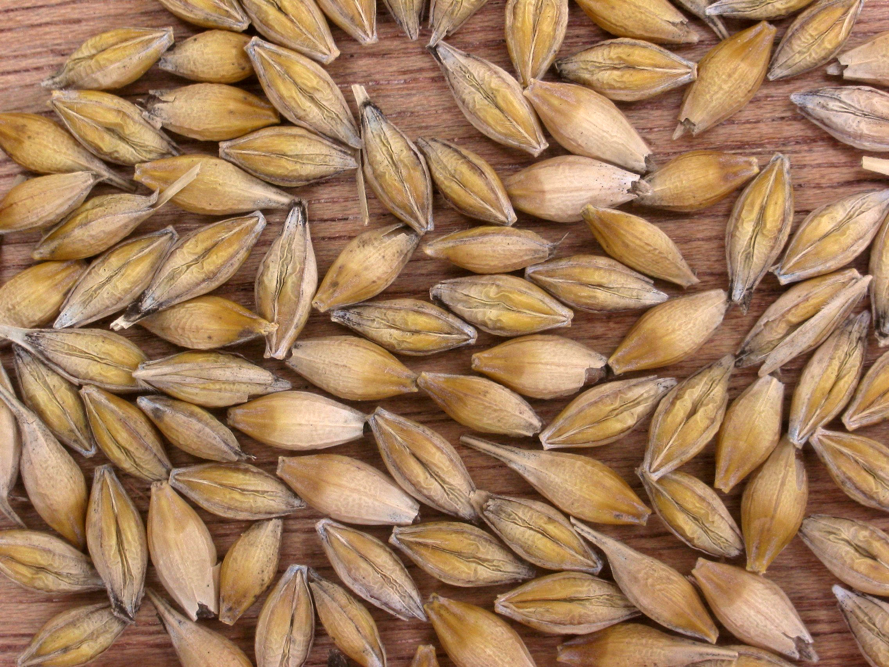
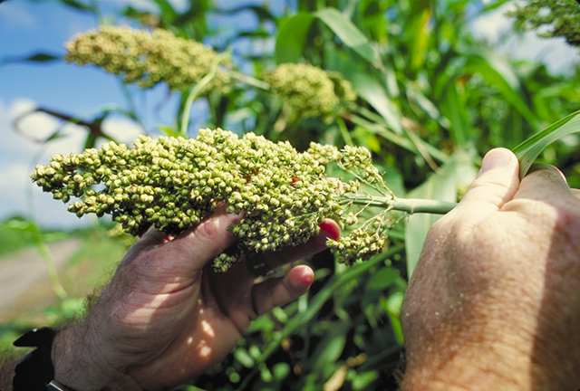
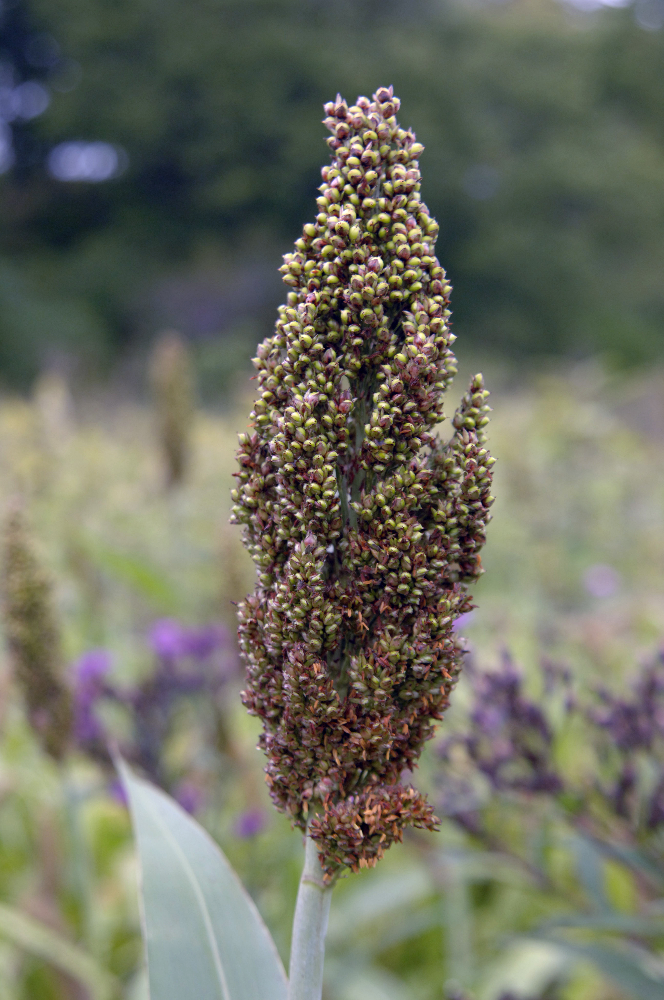

# Plants and Trees in the Bible

## License Information

Plants and Trees in the Bible © United Bible Societies, 2025. Adapted from: <cite>Each According to its Kind: Plants and Trees in the Bible</cite>, by Robert Koops © 2012 United Bible Societies. This work is licensed under Creative Commons Attribution-ShareAlike 4.0 International (<a href="https://creativecommons.org/licenses/by-sa/4.0/">https://creativecommons.org/licenses/by-sa/4.0/</a>).

--------------------------------

## 標題：穀物（grain） (id: FLORA:3.1)

3\.1 標題：穀物（grain）
=================

Hebrew 來： דָּגָן (音譯： dagan)

[GEN 27:28](https://ref.ly/Gen27:28), [GEN 27:37](https://ref.ly/Gen27:37), [NUM 18:12](https://ref.ly/Num18:12), [NUM 18:27](https://ref.ly/Num18:27), [DEU 7:13](https://ref.ly/Deut7:13), [DEU 11:14](https://ref.ly/Deut11:14), [DEU 12:17](https://ref.ly/Deut12:17), [DEU 14:23](https://ref.ly/Deut14:23), [DEU 18:4](https://ref.ly/Deut18:4), [DEU 28:51](https://ref.ly/Deut28:51), [DEU 33:28](https://ref.ly/Deut33:28), [2KI 18:32](https://ref.ly/2Kgs18:32), [2CH 31:5](https://ref.ly/2Chr31:5), [2CH 32:28](https://ref.ly/2Chr32:28), [NEH 5:2](https://ref.ly/Neh5:2), [NEH 5:3](https://ref.ly/Neh5:3), [NEH 5:10](https://ref.ly/Neh5:10), [NEH 5:11](https://ref.ly/Neh5:11), [NEH 10:40](https://ref.ly/Neh10:40), [NEH 13:5](https://ref.ly/Neh13:5), [NEH 13:12](https://ref.ly/Neh13:12), [PSA 4:8](https://ref.ly/Ps4:8), [PSA 65:10](https://ref.ly/Ps65:10), [PSA 78:24](https://ref.ly/Ps78:24), [ISA 36:17](https://ref.ly/Isa36:17), [ISA 62:8](https://ref.ly/Isa62:8), [JER 31:12](https://ref.ly/Jer31:12), [LAM 2:12](https://ref.ly/Lam2:12), [EZK 36:29](https://ref.ly/Ezek36:29), [HOS 2:10](https://ref.ly/Hos2:10), [HOS 2:11](https://ref.ly/Hos2:11), [HOS 2:24](https://ref.ly/Hos2:24), [HOS 7:14](https://ref.ly/Hos7:14), [HOS 9:1](https://ref.ly/Hos9:1), [HOS 14:8](https://ref.ly/Hos14:8), [JOL 1:10](https://ref.ly/Joel1:10), [JOL 1:17](https://ref.ly/Joel1:17), [JOL 2:19](https://ref.ly/Joel2:19), [HAG 1:11](https://ref.ly/Hag1:11), [ZEC 9:17](https://ref.ly/Zech9:17)

Hebrew 來： בַּר (音譯： bar)

[GEN 41:35](https://ref.ly/Gen41:35), [GEN 41:49](https://ref.ly/Gen41:49), [GEN 42:3](https://ref.ly/Gen42:3), [GEN 42:25](https://ref.ly/Gen42:25), [GEN 45:23](https://ref.ly/Gen45:23), [PSA 65:14](https://ref.ly/Ps65:14), [PSA 72:16](https://ref.ly/Ps72:16), [PRO 11:26](https://ref.ly/Prov11:26), [PRO 14:4](https://ref.ly/Prov14:4), [JER 23:28](https://ref.ly/Jer23:28), [JOL 2:24](https://ref.ly/Joel2:24), [AMO 5:11](https://ref.ly/Amos5:11), [AMO 8:5](https://ref.ly/Amos8:5), [AMO 8:6](https://ref.ly/Amos8:6)

Hebrew 來： שֶׁבֶר (音譯： shever)

[GEN 42:1](https://ref.ly/Gen42:1), [GEN 42:2](https://ref.ly/Gen42:2), [GEN 42:19](https://ref.ly/Gen42:19), [GEN 42:26](https://ref.ly/Gen42:26), [GEN 43:2](https://ref.ly/Gen43:2), [GEN 44:2](https://ref.ly/Gen44:2), [GEN 47:14](https://ref.ly/Gen47:14)

Hebrew 來： קָמָה (音譯： qamah)

[EXO 22:5](https://ref.ly/Exod22:5), [DEU 16:9](https://ref.ly/Deut16:9), [DEU 23:26](https://ref.ly/Deut23:26), [DEU 23:26](https://ref.ly/Deut23:26), [JDG 15:5](https://ref.ly/Judg15:5), [JDG 15:5](https://ref.ly/Judg15:5), [2KI 19:26](https://ref.ly/2Kgs19:26), [ISA 17:5](https://ref.ly/Isa17:5), [ISA 37:27](https://ref.ly/Isa37:27), [HOS 8:7](https://ref.ly/Hos8:7)

Hebrew 來： גָּדִישׁ (音譯： gadish)

[EXO 22:5](https://ref.ly/Exod22:5), [JDG 15:5](https://ref.ly/Judg15:5), [JOB 5:26](https://ref.ly/Job5:26)

Hebrew 來： אָבִיב (音譯： ’aviv)

[EXO 9:31](https://ref.ly/Exod9:31), [LEV 2:14](https://ref.ly/Lev2:14)

Hebrew 來： שִׁבֹּלֶת (音譯： shiboleth)

[GEN 41:5](https://ref.ly/Gen41:5), [GEN 41:6](https://ref.ly/Gen41:6), [GEN 41:7](https://ref.ly/Gen41:7), [GEN 41:7](https://ref.ly/Gen41:7), [GEN 41:22](https://ref.ly/Gen41:22), [GEN 41:23](https://ref.ly/Gen41:23), [GEN 41:24](https://ref.ly/Gen41:24), [GEN 41:24](https://ref.ly/Gen41:24), [GEN 41:26](https://ref.ly/Gen41:26), [GEN 41:27](https://ref.ly/Gen41:27), [RUT 2:2](https://ref.ly/Ruth2:2), [JOB 24:24](https://ref.ly/Job24:24), [ISA 17:5](https://ref.ly/Isa17:5), [ISA 17:5](https://ref.ly/Isa17:5)

Hebrew 來： כַּרְמֶל (音譯： karmel)

[LEV 2:14](https://ref.ly/Lev2:14), [LEV 23:14](https://ref.ly/Lev23:14), [2KI 4:42](https://ref.ly/2Kgs4:42)

Hebrew 來： גֶּרֶשׂ (音譯： geres)

[LEV 2:14](https://ref.ly/Lev2:14), [LEV 2:16](https://ref.ly/Lev2:16)

Hebrew 來： קלה, קָלִי (音譯： qalah, qali)

[LEV 23:14](https://ref.ly/Lev23:14), [JOS 5:11](https://ref.ly/Josh5:11), [RUT 2:14](https://ref.ly/Ruth2:14), [1SA 17:17](https://ref.ly/1Sam17:17), [1SA 25:18](https://ref.ly/1Sam25:18), [2SA 17:28](https://ref.ly/2Sam17:28), [2SA 17:28](https://ref.ly/2Sam17:28)

Hebrew 來： עֲבוּר (音譯： ‘avur)

[JOS 5:11](https://ref.ly/Josh5:11), [JOS 5:12](https://ref.ly/Josh5:12)

Hebrew 來： בְּלִיל (音譯： belil)

[JOB 6:5](https://ref.ly/Job6:5), [JOB 24:6](https://ref.ly/Job24:6), [ISA 30:24](https://ref.ly/Isa30:24)

Hebrew 來： רִיפוֹת (音譯： rifoth)

[2SA 17:19](https://ref.ly/2Sam17:19), [PRO 27:22](https://ref.ly/Prov27:22)

Hebrew 來： לֶחֶם (音譯： lechem)

[ISA 28:28](https://ref.ly/Isa28:28), [ISA 30:23](https://ref.ly/Isa30:23)

Hebrew 來： זֶרַע (音譯： zera‘)

[NUM 20:5](https://ref.ly/Num20:5), [1SA 8:15](https://ref.ly/1Sam8:15), [JOB 39:12](https://ref.ly/Job39:12), [ISA 23:3](https://ref.ly/Isa23:3)

聖經至少提到四種穀物：大麥、小米、高粱和小麥。除了這些穀物，希伯來文中的「禾場」、「鐮刀」、「簸箕」等詞也證明穀物在古代以色列人的生活中非常重要。

KJV (King James Version (1611)) 、REB (Revised English Bible (1989)) 和其他一些譯本依循英國人的用法，用"corn"（「穀物」）這個統稱來表示小麥和大麥等農作物，而RSV (Revised Standard Version (1952)) 、NKJV (New King James Version (1982)) 和許多其他譯本則依循美國人的用法，使用"grain"（「穀物」）作為統稱。GNB (Good News Bible) 等部分譯本既有英國版又有美國版，以滿足不同語言用法的要求。我們現在所知的"maize"（「玉米」）這種植物在聖經時期並不存在，但是可能需要用它來表示一個物種；我們會依循英國的傳統，稱這個物種為"maize"（「玉米」），同時依循美國的用法，使用"grain"（「穀物」）作為五穀的統稱。

統稱可能會給翻譯者帶來一些難題。在[GEN 1:11](https://ref.ly/Gen1:11); [GEN 1:12](https://ref.ly/Gen1:12) 中，希伯來文短語*‘esev mazri‘a zera‘* （意為「結種子的植物」）與短語*‘ets peri ‘oseh peri* （「結果子的樹木」）形成對比。有些英文譯本把「結種子的植物」解作"grain"（「穀物」；GNB (Good News Bible) 、CEV (Contemporary English Version) 、NCV (New Century Version) ），還有些譯本則使用更為廣義的表述，如"seed\-bearing plants"（「含種子的植物」；NIV (New International Version (1984)) 、NJB (New Jerusalem Bible (1985)) 、NJPSV (New Jewish Publication Society Version) ），或"plants that bear seed"（「含種子的植物」；REB (Revised English Bible (1989)) ）。《創世記》的作者可能使用了傳統的希伯來植物分類法，將有用的植物分為兩類，即結種子的植物和結果實的植物。如果是這樣，翻譯者在翻譯*‘esev mazri‘a zera‘* （「結種子的植物」）時，所選擇的表達方式應該涵蓋更多物種，而不僅僅是穀物。不要忘記，洋蔥、蠶豆、豌豆、瓜類等植物和穀物一樣，都是有種子的。

希伯來文*dagan* 在舊約中出現了40次（如[GEN 27:28](https://ref.ly/Gen27:28) ，[GEN 27:37](https://ref.ly/Gen27:37) ；[NUM 18:12](https://ref.ly/Num18:12) ，[NUM 18:27](https://ref.ly/Num18:27) ；[DEU 7:13](https://ref.ly/Deut7:13) ，[DEU 11:14](https://ref.ly/Deut11:14) 等），通常譯為「穀、五穀」。然而，在聖經時期，*dagan* 這個詞涵蓋豌豆、蠶豆、扁豆和孜然，以及我們通常稱為「穀物」的禾本科植物或五穀。在這40處提到*dagan* 的經文中，有30處與希伯來文*tirosh* （「採摘葡萄」）配對出現，有20處同時提到了希伯來文*yitshar* （「新榨的油」）。這三個希伯來文詞語都含有「新收成」的意思，表達了「土地的出產」的觀念，正如以撒對雅各的祝福（[GEN 27:28](https://ref.ly/Gen27:28) ）：

願上帝賜你天上的甘露，

地上的肥土，

和豐富的*dagan* （農產品）和*tirosh* （葡萄園的出產）。

舊約還有許多其他希伯來文詞語和短語指穀物。由於這些統稱會給翻譯者造成問題，我們這裡將逐一進行討論：

*Bar* ：這個詞可以指禾場上的穀物（[JOL 2:24](https://ref.ly/Joel2:24) ），也可以指儲存起來的穀物（[GEN 41:35](https://ref.ly/Gen41:35) ）。在[JER 23:28](https://ref.ly/Jer23:28) 中，這個詞指穀物的子粒，與糠秕相對。

*Shever* ：記載，雅各聽說埃及有*shever* 。這個詞在這段經文中的意思很寬泛，幾乎相當於「食物」。在[NEH 10:32](https://ref.ly/Neh10:32) （《和》10:31），尼希米禁止百姓在安息日買賣*shever* 。在[AMO 8:5](https://ref.ly/Amos8:5) 中，先知警告百姓在賣*shever* （與*bar* 平行）時不可欺騙。[GEN 42:1](https://ref.ly/Gen42:1); [GEN 42:2](https://ref.ly/Gen42:2); [NEH 10:32](https://ref.ly/Neh10:32); [AMO 8:5](https://ref.ly/Amos8:5) 

*Qamah* ：[JDG 15:5](https://ref.ly/Judg15:5) 記載，參孫在非利士人的田間焚燒*qamah* （「已成熟、未收割的穀物植株」）和*gadish* （「禾捆」）。英文譯本通常把*qamah* 譯為"standing grain"（「立著的穀物」）。在阿拉伯文中，小麥是*al\-kama* ，因此非利士人在梭烈谷種植的可能就是小麥。

*Gadish* 指禾捆。

*’Aviv* 指新長出來的麥穗。

*Shiboleth* 指麥穗。在[RUT 2:2](https://ref.ly/Ruth2:2) 中，路得拾取收割後剩下的大麥穗。埃及法老夢中（[GEN 41:5](https://ref.ly/Gen41:5); [GEN 41:6](https://ref.ly/Gen41:6); [GEN 41:7](https://ref.ly/Gen41:7); [GEN 41:7](https://ref.ly/Gen41:7) ）所見的麥穗大概是小麥。

*Karmel* 指新麥穗。在[LEV 2:14](https://ref.ly/Lev2:14) 中，百姓烘烤並當作初熟之物獻上的麥穗可能是小麥。先知以利沙收到的一份禮物就是新麥穗（[2KI 4:42](https://ref.ly/2Kgs4:42) ）。

*Geres* 指磨碎的穀物。

*Qalah* /*qali* 指烘熟、曬乾或烤過的穀粒。

*‘Avur* ：RSV (Revised Standard Version (1952)) 將[JOS 5:11](https://ref.ly/Josh5:11); [JOS 5:12](https://ref.ly/Josh5:12) 中的*‘avur* 譯為"produce"（「出產」），但《〈約書亞記〉手冊》（*A Handbook on The Book of Joshua* ）將這個詞譯為"grain (barley)"（「穀物（大麥）」）。

*Belil* ：[JOB 24:6](https://ref.ly/Job24:6) 說，野驢為它們的幼崽尋找*belil* （「食物」）。

*Rifoth* ：[2SA 17:19](https://ref.ly/2Sam17:19) 記載，有個婦人在藏著兩個人的井口上面蓋上墊子，又撒上*rifoth* （「穀物」）。[PRO 27:22](https://ref.ly/Prov27:22) 說，「用杵把愚妄人與壓碎的穀粒（*rifoth* ）一同搗在臼中，他的愚昧還是離不了他。」

*Lechem* 通常譯為「餅」，但RSV (Revised Standard Version (1952)) 在[ISA 28:28](https://ref.ly/Isa28:28) 中將這個詞譯為"bread grain"（「做餅的穀物」），而在[ISA 30:23](https://ref.ly/Isa30:23) 中譯為"grain"（「穀物」）。

*Zera‘* 的字面意思是「播種」或「種子」，但在[NUM 20:5](https://ref.ly/Num20:5); [1SA 8:15](https://ref.ly/1Sam8:15); [JOB 39:12](https://ref.ly/Job39:12); [ISA 23:3](https://ref.ly/Isa23:3) 中意為「穀物」。

新約和次經中也有一些意指穀物的希臘文統稱。
---------------------

Greek 希： καρπός (音譯： karpos)

[MAT 13:8](https://ref.ly/Matt13:8), [MAT 13:26](https://ref.ly/Matt13:26), [MRK 4:7](https://ref.ly/Mark4:7), [MRK 4:8](https://ref.ly/Mark4:8)

Greek 希： κόκκος (音譯： kokkos)

[MAT 13:31](https://ref.ly/Matt13:31), [MAT 17:20](https://ref.ly/Matt17:20), [MRK 4:31](https://ref.ly/Mark4:31), [LUK 13:19](https://ref.ly/Luke13:19), [LUK 17:6](https://ref.ly/Luke17:6), [JHN 12:24](https://ref.ly/John12:24), [1CO 15:37](https://ref.ly/1Cor15:37)

Greek 希： σπόριμος (音譯： sporimos)

[MAT 12:1](https://ref.ly/Matt12:1), [MRK 2:23](https://ref.ly/Mark2:23), [LUK 6:1](https://ref.ly/Luke6:1)

Greek 希： στάχυς (音譯： stachus)

[MAT 12:1](https://ref.ly/Matt12:1), [MRK 2:23](https://ref.ly/Mark2:23), [MRK 4:28](https://ref.ly/Mark4:28), [MRK 4:28](https://ref.ly/Mark4:28), [LUK 6:1](https://ref.ly/Luke6:1)

Greek 希： ἄλφιτον (音譯： alfiton)

[JDT 10:5](https://ref.ly/Jdt10:5)

Greek 希： σπέρμα (音譯： sperma)

[MAT 13:24](https://ref.ly/Matt13:24), [MAT 13:27](https://ref.ly/Matt13:27), [MAT 13:32](https://ref.ly/Matt13:32), [MAT 13:37](https://ref.ly/Matt13:37), [MAT 13:38](https://ref.ly/Matt13:38), [1CO 15:38](https://ref.ly/1Cor15:38)

Greek 希： σπορά (音譯： spora)

[1MA 10:30](https://ref.ly/1Macc10:30)

Greek 希： σπόρος (音譯： sporos)

[MRK 4:26](https://ref.ly/Mark4:26), [MRK 4:27](https://ref.ly/Mark4:27), [LUK 8:5](https://ref.ly/Luke8:5), [LUK 8:11](https://ref.ly/Luke8:11), [2CO 9:10](https://ref.ly/2Cor9:10), [2CO 9:10](https://ref.ly/2Cor9:10), [SIR 40:22](https://ref.ly/Sir40:22)

*Karpos* 的字面意思是「果實」，但在[MAT 13:8](https://ref.ly/Matt13:8) 、[MAT 13:26](https://ref.ly/Matt13:26) 和 [MRK 4:7](https://ref.ly/Mark4:7); [MRK 4:8](https://ref.ly/Mark4:8) 的語境中，這個詞指的是小麥或大麥，在英文中的自然對等詞是"grain"（「穀物」）。

*Kokkos* 指穀物的子粒或種子。

*Sporimos* 源自希臘文動詞「播種」，顯然是指大麥田或小麥田。

*Stachus* 指小麥或大麥的穗子。

*Alfiton* 指烘熟、曬乾或烤過的穀粒。RSV (Revised Standard Version (1952)) 將這個詞譯為"parched grain"（「烤熟的穀物」）。這就是路得在波阿斯的田裡拾取麥穗時吃的午飯（希伯來文*qali* ）。*Alfiton* 出現在《七十士譯本》的[RUT 2:14](https://ref.ly/Ruth2:14); [1SA 25:18](https://ref.ly/1Sam25:18); [2SA 17:28](https://ref.ly/2Sam17:28); [JDT 10:5](https://ref.ly/Jdt10:5) 中。

*Sperma* 指單個的穀粒，或者更普通的說法是一粒種子。

*Spora* 指「穀物收成」（"grain harvest"；GNB (Good News Bible) ）。

*Sporos* 在[SIR 40:22](https://ref.ly/Sir40:22) 中特指種子發芽。在《次經‧便西拉智訓》（《思》《德訓篇》）中，這個詞可能指穀物在春天發芽（如REB (Revised English Bible (1989)) 、NJB (New Jerusalem Bible (1985)) ），但一些翻譯者認為這個詞泛指花芽的萌發（如NAB (New American Bible (1970)) ）。

在《次經‧厄斯德拉二書》（拉丁文）中，有幾個表示穀物的拉丁文統稱：

在[2ES 15:42](https://ref.ly/2Esd15:42) 中，*frumentum* 指穀物收成，與希臘文*spora* 同義。RSV (Revised Standard Version (1952)) 將這個詞譯為"grain"（「穀物」），REB (Revised English Bible (1989)) 的翻譯比較寬泛，作"crops"（「莊稼」）。

*Granum* 在[2ES 4:30](https://ref.ly/2Esd4:30); [2ES 4:31](https://ref.ly/2Esd4:31) 中泛指穀物。

*Semen* ：在[2ES 8:43](https://ref.ly/2Esd8:43); [2ES 4:31](https://ref.ly/2Esd4:31); [2ES 4:32](https://ref.ly/2Esd4:32) 中，*semen* 指單個的穀粒，相當於希伯來文中的*zera‘* 和希臘文中的*sperma* （如[MAT 13:24](https://ref.ly/Matt13:24) ）。

[DEU 28:22](https://ref.ly/Deut28:22) 說，穀物將受到「焚風」（希伯來文*shidafon* ）和「霉爛」（*yeraqon* ）的影響。這對詞語也出現在[1KI 8:37](https://ref.ly/1Kgs8:37); [2CH 6:28](https://ref.ly/2Chr6:28); [AMO 4:9](https://ref.ly/Amos4:9); [HAG 2:17](https://ref.ly/Hag2:17) 中。在這些經文中，我們看到接連不斷的災難臨到百姓。希伯來文動詞*shadaf* （「吹」）單獨出現在[GEN 41:6](https://ref.ly/Gen41:6); [GEN 41:23](https://ref.ly/Gen41:23); [GEN 41:27](https://ref.ly/Gen41:27) 中，作者清楚地將這個詞語與農作物被沙漠吹來的酷烈季風摧殘相關聯。這個詞的迦勒底文同源詞是*shadaf* ，意思是「燒焦的」。希伯來文名詞*shedefah* （「灼熱」）出現在[2KI 19:26](https://ref.ly/2Kgs19:26) （也出現在[ISA 37:27](https://ref.ly/Isa37:27) 的修訂文本中），該節經文說房頂上的草因為泥土太少，還未長成就枯乾了。（阿拉伯文同源詞的意思是「黑」）。希伯來文*yeraqon* 在[JER 30:6](https://ref.ly/Jer30:6) 中是「蒼白」的意思，形容人的臉，但在其他經文中是指一種阻礙麥穗正常生長的真菌。

*拿撒勒附近的禾場 (Matson Collection (Wikimedia Commons))*

除了這些表示穀物的專用詞語，聖經中許多地方還用「從……禾場中」（如[DEU 15:14](https://ref.ly/Deut15:14) ）這樣的表述來提到穀物。

在聖經中，獻素祭所用的麵粉或細麵應該是指小麥粉。不過當小麥短缺時，人們也會用大麥粉。

* **Associated Passages:** 創世記 27:28; 創世記 27:37; 民數記 18:12; 民數記 18:27; 申命記 7:13; 申命記 11:14; 申命記 12:17; 申命記 14:23; 申命記 18:4; 申命記 28:51; 申命記 33:28; 列王紀下 18:32; 歷代志下 31:5; 歷代志下 32:28; 尼希米記 5:2; 尼希米記 5:3; 尼希米記 5:10; 尼希米記 5:11; 尼希米記 10:40; 尼希米記 13:5; 尼希米記 13:12; 詩篇 4:8; 詩篇 65:10; 詩篇 78:24; 以賽亞書 36:17; 以賽亞書 62:8; 耶利米書 31:12; 耶利米哀歌 2:12; 以西結書 36:29; 何西阿書 2:10; 何西阿書 2:11; 何西阿書 2:24; 何西阿書 7:14; 何西阿書 9:1; 何西阿書 14:8; 約珥書 1:10; 約珥書 1:17; 約珥書 2:19; 哈該書 1:11; 撒迦利亞書 9:17; 創世記 41:35; 創世記 41:49; 創世記 42:3; 創世記 42:25; 創世記 45:23; 詩篇 65:14; 詩篇 72:16; 箴言 11:26; 箴言 14:4; 耶利米書 23:28; 約珥書 2:24; 阿摩司書 5:11; 阿摩司書 8:5; 阿摩司書 8:6; 創世記 42:1; 創世記 42:2; 創世記 42:19; 創世記 42:26; 創世記 43:2; 創世記 44:2; 創世記 47:14; 出埃及記 22:5; 申命記 16:9; 申命記 23:26; 士師記 15:5; 列王紀下 19:26; 以賽亞書 17:5; 以賽亞書 37:27; 何西阿書 8:7; 約伯記 5:26; 出埃及記 9:31; 利未記 2:14; 創世記 41:5; 創世記 41:6; 創世記 41:7; 創世記 41:22; 創世記 41:23; 創世記 41:24; 創世記 41:26; 創世記 41:27; 路得記 2:2; 約伯記 24:24; 利未記 23:14; 列王紀下 4:42; 利未記 2:16; 約書亞記 5:11; 路得記 2:14; 撒母耳記上 17:17; 撒母耳記上 25:18; 撒母耳記下 17:28; 約書亞記 5:12; 約伯記 6:5; 約伯記 24:6; 以賽亞書 30:24; 撒母耳記下 17:19; 箴言 27:22; 以賽亞書 28:28; 以賽亞書 30:23; 民數記 20:5; 撒母耳記上 8:15; 約伯記 39:12; 以賽亞書 23:3; 馬太福音 13:8; 馬太福音 13:26; 馬可福音 4:7; 馬可福音 4:8; 馬太福音 13:31; 馬太福音 17:20; 馬可福音 4:31; 路加福音 13:19; 路加福音 17:6; 約翰福音 12:24; 哥林多前書 15:37; 馬太福音 12:1; 馬可福音 2:23; 路加福音 6:1; 馬可福音 4:28; 友弟德傳 10:5; 馬太福音 13:24; 馬太福音 13:27; 馬太福音 13:32; 馬太福音 13:37; 馬太福音 13:38; 哥林多前書 15:38; 瑪加伯上 10:30; 馬可福音 4:26; 馬可福音 4:27; 路加福音 8:5; 路加福音 8:11; 哥林多後書 9:10; 德訓篇 40:22; 創世記 1:11; 創世記 1:12; 尼希米記 10:32; 厄斯德拉下 15:42; 厄斯德拉下 4:30; 厄斯德拉下 4:31; 厄斯德拉下 8:43; 厄斯德拉下 4:32; 申命記 28:22; 列王紀上 8:37; 歷代志下 6:28; 阿摩司書 4:9; 哈該書 2:17; 耶利米書 30:6; 申命記 15:14

* **Associated ACAI Concepts:** Grain (ID: `flora:Grain`); Wheat (ID: `flora:Wheat`)

## 標題：大麥（barley） (id: FLORA:3.1.1)

3\.1\.1 標題：大麥（barley）
=====================

經文出處
----

Hebrew 來： שְׂעֹרָה (音譯： se‘orah)

[EXO 9:31](https://ref.ly/Exod9:31), [EXO 9:31](https://ref.ly/Exod9:31), [LEV 27:16](https://ref.ly/Lev27:16), [NUM 5:15](https://ref.ly/Num5:15), [DEU 8:8](https://ref.ly/Deut8:8), [JDG 7:13](https://ref.ly/Judg7:13), [RUT 1:22](https://ref.ly/Ruth1:22), [RUT 2:17](https://ref.ly/Ruth2:17), [RUT 2:23](https://ref.ly/Ruth2:23), [RUT 3:2](https://ref.ly/Ruth3:2), [RUT 3:15](https://ref.ly/Ruth3:15), [RUT 3:17](https://ref.ly/Ruth3:17), [2SA 14:30](https://ref.ly/2Sam14:30), [2SA 17:28](https://ref.ly/2Sam17:28), [2SA 21:9](https://ref.ly/2Sam21:9), [1KI 5:8](https://ref.ly/1Kgs5:8), [2KI 4:42](https://ref.ly/2Kgs4:42), [2KI 7:1](https://ref.ly/2Kgs7:1), [2KI 7:16](https://ref.ly/2Kgs7:16), [2KI 7:18](https://ref.ly/2Kgs7:18), [1CH 11:13](https://ref.ly/1Chr11:13), [2CH 2:9](https://ref.ly/2Chr2:9), [2CH 2:14](https://ref.ly/2Chr2:14), [2CH 27:5](https://ref.ly/2Chr27:5), [JOB 31:40](https://ref.ly/Job31:40), [ISA 28:25](https://ref.ly/Isa28:25), [JER 41:8](https://ref.ly/Jer41:8), [EZK 4:9](https://ref.ly/Ezek4:9), [EZK 4:12](https://ref.ly/Ezek4:12), [EZK 13:19](https://ref.ly/Ezek13:19), [EZK 45:13](https://ref.ly/Ezek45:13), [HOS 3:2](https://ref.ly/Hos3:2), [HOS 3:2](https://ref.ly/Hos3:2), [JOL 1:11](https://ref.ly/Joel1:11)

Greek 希： κριθή (音譯： krithē)

[REV 6:6](https://ref.ly/Rev6:6), [JDT 8:2](https://ref.ly/Jdt8:2)

Greek 希： κρίθινος (音譯： krithinos)

[JHN 6:9](https://ref.ly/John6:9), [JHN 6:13](https://ref.ly/John6:13)

討論
--

*大麥穗 (T. Voekler (Wikimedia Commons))*

大麥（學名*Hordeum distichum* 、*Hordeum vulgare* ）和小麥、水稻一樣，屬於禾本科植物，在中東地區已經種植了數千年，是目前世界上最重要的種子作物之一。大麥已知有20個品種，其中有8種在歐洲。大麥對雨水的需求比小麥少，因此通常生長在聖地沿海平原以上比較乾旱的地區和曠野附近。我們從[2KI 7:1](https://ref.ly/2Kgs7:1) 和[REV 6:6](https://ref.ly/Rev6:6) 得知，當時的人認為大麥不如小麥，經常用大麥作牲畜飼料，與現今的做法一樣。當小麥供應短缺時，人們只好用大麥做餅。大麥的收割時間在小麥之前，低地約在3月或4月，山區則在5月（參[EXO 9:31](https://ref.ly/Exod9:31); [2KI 4:42](https://ref.ly/2Kgs4:42) ）。埃及和古希臘人用大麥來釀造啤酒。

描述
--

*大麥的種子 (Rasbak (Wikimedia Commons))*

大麥植株看起來與小麥和水稻差不多，高不到1米（3英呎），每根麥稈上只有1個麥穗，每個穗有6排子粒。不過，聖經中提到的品種可能只有2排子粒。成熟後，麥穗會彎下來。

特殊意義
----

在[JDG 7:13](https://ref.ly/Judg7:13) 所記基甸和米甸人的故事中，代表（被藐視的）以色列軍隊的「一個大麥餅」滾入米甸人的營中，撞倒了他們的帳棚（代表遊牧的米甸人）。

翻譯
--

大麥是溫帶作物，適宜生長在歐洲和近東等地，不宜生長在熱帶。然而近年來，大麥和小麥一起被引進到世界上的許多地方，用來釀造啤酒和其他麥芽飲品。早在主前1500年，大麥、小麥和小米就已經在朝鮮半島種植。大麥在馬來文中稱為*barli* 。除了在《士師記》之外，聖經中其他提到大麥的經文都是非修辭性的，因此，我們不建議使用不相關的文化對等詞來翻譯。在有些目標語言中，人們可能會給它新造一個名字，就像馬來文那樣；或者翻譯者也可以音譯希伯來文（*se‘orah* ）、拉丁文（*horideyo* ），或某種主要語言（例如，阿拉伯文*sha‘ir* 、西班牙文*cebada* 、法文*orge* 、葡萄牙文*cevada* 、斯瓦希里文*shayiri* ）。如果有分類詞，還可以加上分類詞（如「shayir粒」）。有一個譯本使用了「baali米」，但是恰好遇到一個問題：現在有種大米從巴厘島出口到西非部分地區，這種大米叫做「巴厘（Bali）米」，與「baali米」發生了混淆。

[EXO 9:31](https://ref.ly/Exod9:31) 說：「亞麻和大麥被摧毀了，因為大麥已經吐穗，亞麻也開了花。」如果按照字面翻譯，這裡提到的作物及其生長階段可能會令人費解。以下提供兩種譯法：

1\. 使用統稱加上音譯（例如，「barli穀物」、「filas植物」），尤其是在經文的前半句。下半句可以選擇性地重複統稱，比如「因為穀物已經吐穗，而植物也已經開花」。

2\. 籠統地指出植物，然後在括號或腳註中註明植物的具體名稱；例如，整節經文可以這樣翻譯：「已成熟的莊稼（*barli* ）和含苞待放的作物（*filakis* ）都被摧毀了。」（這個譯法調整了希伯來文本的交錯配列結構。）

* **Associated Passages:** 出埃及記 9:31; 利未記 27:16; 民數記 5:15; 申命記 8:8; 士師記 7:13; 路得記 1:22; 路得記 2:17; 路得記 2:23; 路得記 3:2; 路得記 3:15; 路得記 3:17; 撒母耳記下 14:30; 撒母耳記下 17:28; 撒母耳記下 21:9; 列王紀上 5:8; 列王紀下 4:42; 列王紀下 7:1; 列王紀下 7:16; 列王紀下 7:18; 歷代志上 11:13; 歷代志下 2:9; 歷代志下 2:14; 歷代志下 27:5; 約伯記 31:40; 以賽亞書 28:25; 耶利米書 41:8; 以西結書 4:9; 以西結書 4:12; 以西結書 13:19; 以西結書 45:13; 何西阿書 3:2; 約珥書 1:11; 啟示錄 6:6; 友弟德傳 8:2; 約翰福音 6:9; 約翰福音 6:13

* **Associated ACAI Concepts:** Barley (ID: `flora:Barley`)

## 標題：小米（millet） (id: FLORA:3.1.2)

3\.1\.2 標題：小米（millet）
=====================

經文出處
----

Hebrew 來： דֹּחַן (音譯： dochan)

[EZK 4:9](https://ref.ly/Ezek4:9)

Hebrew 來： פַּנַּג (音譯： pannag)

[EZK 27:17](https://ref.ly/Ezek27:17)

討論
--

*小米 (Dalgial (Wikimedia Commons))*

在[EZK 4:9](https://ref.ly/Ezek4:9) 中，上帝指示以西結用小麥、大麥、蠶豆、扁豆、小米（希伯來文*dochan* ）和粗麥做餅，來演示耶路撒冷被圍困的場景。在阿拉伯文中，小米是*dukhn* 或*dochna* ，這表明希伯來文*dochan* 可能確實是小米。有些學者認為小米（學名*Panicum miliaceum* 、*Panicum callosum* ）最早是在埃塞俄比亞種植的，但也有學者認為是在印度或東印度群島種植的。大約在主前3000年，小米從其中一個地方被引入到美索不達米亞。如果情況確實是這樣，那麼以色列人可能是在埃及逗留期間或在攻取迦南地之後，才知道這種作物的。祖海里（Zohary）認為，*dochan* 可能是小米或高粱（[3\.1\.3 高粱（硬稈高粱）(sorghum \[durra])](#FLORA:3.1.3) ）。[EZK 27:17](https://ref.ly/Ezek27:17) 提到*pannag* ，莫爾登克（Moldenke）認為這個詞可能是指小米，因為敘利亞文*pannag* 就是指小米。然而，赫珀（Hepper）認為，在基督教時期之前，小米和高粱都還沒有引入到地中海地區，因此*dochan* 和*pannag* 都不太可能是指小米或高粱。

現今，世界各地的人們用小米來煮粥、釀酒，或作牲畜的飼料。小米不適合做餅，這在[EZK 4:9](https://ref.ly/Ezek4:9) 提到的事件中可能很關鍵。

描述
--

如果小米確實在舊約時期就已經開始種植，那麼所種植的小米應該是不足1米（3英呎）高的低矮品種。這種小米的莖稈上只有一個穗，結有許多細小的種子，所以它的拉丁文名稱是*miliaceum* （「一百萬粒種子」）。

翻譯
--

世界上有600種黍屬（學名*Panicum* ）植物，生長在熱帶和溫帶地區，其中有很多是種植的，在歐洲有兩種。如果翻譯者所在的地方沒有「小米」一詞，則需要使用某種主要語言的音譯，例如，法文*millet* 、葡萄牙文*miliyo* 或西班牙文*mijo* 。由於小米出現在非修辭性經文的清單中，因此沒有必要尋找一個文化上的對等詞。

* **Associated Passages:** 以西結書 4:9; 以西結書 27:17

* **Associated ACAI Concepts:** Millet (ID: `flora:Millet`)

## 標題：高粱（sorghum [durra]） (id: FLORA:3.1.3)

3\.1\.3 標題：高粱（sorghum \[durra]）
===============================

經文出處
----

Hebrew 來： דֹּחַן (音譯： dochan)

[EZK 4:9](https://ref.ly/Ezek4:9)

討論
--

*高粱 (© Christian Fischer)*

高粱（學名*Sorghum vulgare* 、*Sorghum bicolor* ）在西非被稱為幾內亞玉米或"kint"。這種植物可能源於非洲東北部（可能是蘇丹），早在主前2000年就經由亞洲西南部傳入了印度。如果是這樣，以色列人可能在攻取迦南地的時候就已經知道這種作物了，並且這種作物可能就是[EZK 4:9](https://ref.ly/Ezek4:9) 中的*dochan* （參[3\.1\.2 小米 (millet)](#FLORA:3.1.2) ）。赫珀認為，高粱大約是在基督在世時期才被引入聖地的，因此*dochan* 一詞不可能是指高粱。也有人認為*dochan* 指的是「蘆葦」（參[5\.1\.4 蘆葦（普通蘆葦、蘆竹）（reed \[common reed, giant reed]）](#FLORA:5.1.4) ）。

*高粱穗 (Larry Rana, USDA)*

高粱是現今世界上第四重要的穀物，位居小麥、稻米和玉米之後。高粱可作糧食，而且高粱稈可以榨出甜汁，還可以用來做掃帚和刷子。

描述
--

早期的高粱品種雖然比小麥、大麥和小米都要高，但其高度也僅僅為1—2米（3—7英呎）。有些後來培育的高粱品種達到了5米（17英呎）高。這些高粱品種在非洲的鄉村非常受歡迎，因為它們的長莖稈可以用來做屋頂和籬笆。

翻譯
--

*高粱穗 (Bob Nichols, USDA)*

我們不確定*dochan* 這種植物究竟是什麼，因此用某個物種的名稱來翻譯是有些不合理的，最好採用音譯。不過，如果它就是高粱，非洲的翻譯者應該知道高粱也被稱為幾內亞玉米、硬稈高粱、dari或jowar（豪薩文*dawa* 、阿拉伯文*hhash* 、法文*sorgo* 、曼丁哥文*kintoo* 、斯瓦希里文*mkota* ）。這種植物在中國被稱為「高粱」，在美國有時被稱為麥羅玉米或掃帚玉米。

* **Associated Passages:** 以西結書 4:9

* **Associated ACAI Concepts:** Sorghum (ID: `flora:Sorghum`); Millet (ID: `flora:Millet`)

## 標題：小麥（wheat） (id: FLORA:3.1.4)

3\.1\.4 標題：小麥（wheat）
====================

經文出處
----

Hebrew 來： חִטָּה (音譯： chittah)

[GEN 30:14](https://ref.ly/Gen30:14), [EXO 9:32](https://ref.ly/Exod9:32), [EXO 29:2](https://ref.ly/Exod29:2), [EXO 34:22](https://ref.ly/Exod34:22), [DEU 8:8](https://ref.ly/Deut8:8), [DEU 32:14](https://ref.ly/Deut32:14), [JDG 6:11](https://ref.ly/Judg6:11), [JDG 15:1](https://ref.ly/Judg15:1), [RUT 2:23](https://ref.ly/Ruth2:23), [1SA 6:13](https://ref.ly/1Sam6:13), [1SA 12:17](https://ref.ly/1Sam12:17), [2SA 4:6](https://ref.ly/2Sam4:6), [2SA 17:28](https://ref.ly/2Sam17:28), [1KI 5:25](https://ref.ly/1Kgs5:25), [1CH 21:20](https://ref.ly/1Chr21:20), [1CH 21:23](https://ref.ly/1Chr21:23), [2CH 2:9](https://ref.ly/2Chr2:9), [2CH 2:14](https://ref.ly/2Chr2:14), [2CH 27:5](https://ref.ly/2Chr27:5), [JOB 31:40](https://ref.ly/Job31:40), [PSA 81:17](https://ref.ly/Ps81:17), [PSA 147:14](https://ref.ly/Ps147:14), [SNG 7:3](https://ref.ly/Song7:3), [ISA 28:25](https://ref.ly/Isa28:25), [JER 12:13](https://ref.ly/Jer12:13), [JER 41:8](https://ref.ly/Jer41:8), [EZK 4:9](https://ref.ly/Ezek4:9), [EZK 27:17](https://ref.ly/Ezek27:17), [EZK 45:13](https://ref.ly/Ezek45:13), [JOL 1:11](https://ref.ly/Joel1:11)

Aramaic 蘭：חִנְטִין (音譯： chintan)

[EZR 6:9](https://ref.ly/Ezra6:9), [EZR 7:22](https://ref.ly/Ezra7:22)

Hebrew 來： כֻּסֶּמֶת (音譯： kusemeth)

[EXO 9:32](https://ref.ly/Exod9:32), [ISA 28:25](https://ref.ly/Isa28:25), [EZK 4:9](https://ref.ly/Ezek4:9)

Greek 希： πυρός (音譯： puros)

[JDT 2:27](https://ref.ly/Jdt2:27), [JDT 3:3](https://ref.ly/Jdt3:3), [SIR 39:26](https://ref.ly/Sir39:26), [1ES 6:29](https://ref.ly/1Esd6:29), [1ES 8:20](https://ref.ly/1Esd8:20)

Greek 希： σιτίον (音譯： sition)

[ACT 7:12](https://ref.ly/Acts7:12)

Greek 希： σῖτος (音譯： sitos)

[MAT 3:12](https://ref.ly/Matt3:12), [MAT 13:25](https://ref.ly/Matt13:25), [MAT 13:29](https://ref.ly/Matt13:29), [MAT 13:30](https://ref.ly/Matt13:30), [MRK 4:28](https://ref.ly/Mark4:28), [LUK 3:17](https://ref.ly/Luke3:17), [LUK 12:18](https://ref.ly/Luke12:18), [LUK 16:7](https://ref.ly/Luke16:7), [LUK 22:31](https://ref.ly/Luke22:31), [JHN 12:24](https://ref.ly/John12:24), [ACT 27:38](https://ref.ly/Acts27:38), [1CO 15:37](https://ref.ly/1Cor15:37), [REV 6:6](https://ref.ly/Rev6:6), [REV 18:13](https://ref.ly/Rev18:13), [TOB 1:7](https://ref.ly/Tob1:7), [JDT 11:13](https://ref.ly/Jdt11:13), [1MA 8:26](https://ref.ly/1Macc8:26), [1MA 8:28](https://ref.ly/1Macc8:28)

討論
--

*小麥田 (Bluemoose (Wikimedia Commons))*

新月沃地北部有一片廣闊的落葉橡樹林，幾千年來那裡生長著兩種野生小麥：一粒小麥（學名*Triticum monococcum* ）和二粒小麥（學名*Triticum dicoccum* ）。這兩種小麥都是與大麥一起開始栽培的。就在羅馬時期之前，裸麵包小麥或硬粒小麥（學名*Triticum durum* ）開始取代脫皮品種。這種小麥後來成為製作麵包和通心粉的最佳品種。斯佩爾特小麥（粗麥）是普通小麥（學名*Triticum aestivum* ）的一個亞種；遺憾的是，有一本詞典指出，這個詞在某地也用來指二粒小麥。

在RSV (Revised Standard Version (1952)) 和其他一些譯本中，希伯來文統稱*bar* 在[JER 23:28](https://ref.ly/Jer23:28); [AMO 5:11](https://ref.ly/Amos5:11); [AMO 8:5](https://ref.ly/Amos8:5); [AMO 8:6](https://ref.ly/Amos8:6) 中被譯為"wheat"（「小麥」）。這樣翻譯是合理的，因為*bar* 所指的穀物很可能是小麥。不過，在這些經文中翻譯為"grain"（「穀物」）可能更好。

對以色列人來說，早期最重要的小麥可能是二粒小麥，這可能是埃及唯一的一種小麥，希伯來文是*chittah* 。然而，赫珀認為，埃及法老夢中的七穗小麥（[GEN 41:5](https://ref.ly/Gen41:5); [GEN 41:6](https://ref.ly/Gen41:6); [GEN 41:7](https://ref.ly/Gen41:7) ）表明二粒小麥中可能也有圓錐小麥（學名*Triticum turgidum* ）。希伯來文*kusemeth* 可能指一種二粒小麥，埃及人稱之為*swt* 。KJV (King James Version (1611)) 將[EXO 9:32](https://ref.ly/Exod9:32) 和[ISA 28:25](https://ref.ly/Isa28:25) 中的*kusemeth* 譯為"rye"（「黑麥」），這是不正確的，因為黑麥是一種歐洲穀物，聖經時期的以色列人還不知道這種穀物。

描述
--

*小麥穗 (Magnus Hagdorn (Wikimedia Commons))*

小麥和水稻、大麥一樣，都是禾本科植物，可長到75厘米（2\.5英呎）高，麥穗上有許多排麥粒。

特殊意義
----

小麥餅是古代以色列人的主食，因此上帝通過折斷「餅的杖」來懲罰他們（參[EZK 4:16](https://ref.ly/Ezek4:16) 等）。

翻譯
--

如果不熟悉小麥，翻譯者在非修辭性的語境中可以按照某種主要語言進行音譯（例如，英文*witi* 、葡萄牙文*trigo* 、法文*ble* 或*froment* 、斯瓦希里文*ngano* 、阿拉伯文*kama* /*alkama* ）。音譯時可以增加一個分類詞，如「穀物」。新約中提到小麥的經文大多是修辭性的，因此可以使用比喻形式的對等詞。

[EXO 9:32](https://ref.ly/Exod9:32); [EXO 9:32](https://ref.ly/Exod9:32) ：「只是小麥和粗麥沒有被擊打，因為還沒有長成。」在這節經文中，RSV (Revised Standard Version (1952)) 、NIV (New International Version (1984)) 、NLT (New Living Translation) 、NJB (New Jerusalem Bible (1985)) 和NAB (New American Bible (1970)) 把希伯來文*chittah* 譯為"wheat"（「小麥」），把*kusemeth* 譯為"spelt"（「粗麥」；斯佩爾特小麥）。REB (Revised English Bible (1989)) 則分別譯為"wheat"（「小麥」）和"vetches"（「野豌豆」）。祖海里和赫珀都認為把*kusemeth* 翻譯成「粗麥」是錯誤的。*Chittah* 和*kusemeth* 其實就是兩種小麥。*Chittah* 更有價值，因為比較容易收割。*Kusemeth* 也很有益，因為可以在比較乾旱和貧瘠的土地上生長。

在這節經文中，GNB (Good News Bible) 把*chittah* 和*kusemeth* 合在一起譯為"wheat"（「小麥」）。CEV (Contemporary English Version) 和NCV (New Century Version) 的譯法也類似，譯為"wheat crops"（「小麥作物」）。參照我們對上一節經文中的大麥和亞麻所提出的建議（參[3\.1\.1 大麥 (barley)](#FLORA:3.1.1) ），這節經文可以譯為「但較晚成熟的作物，就是不同品種的witi，並沒有被擊打」。另外，翻譯者也可以採用希伯來文*kusemeth* 的音譯。這個詞還可以譯為「灌木小麥」，或者仿照「山地稻子」譯為「山地小麥」。

關於小麥磨成的「麵粉」，參《人手所做之工：聖經中的物件》（WTH ），[9\.4 餅、麵包 (bread)](#REALIA:9.4) 。

* **Associated Passages:** 創世記 30:14; 出埃及記 9:32; 出埃及記 29:2; 出埃及記 34:22; 申命記 8:8; 申命記 32:14; 士師記 6:11; 士師記 15:1; 路得記 2:23; 撒母耳記上 6:13; 撒母耳記上 12:17; 撒母耳記下 4:6; 撒母耳記下 17:28; 列王紀上 5:25; 歷代志上 21:20; 歷代志上 21:23; 歷代志下 2:9; 歷代志下 2:14; 歷代志下 27:5; 約伯記 31:40; 詩篇 81:17; 詩篇 147:14; 雅歌 7:3; 以賽亞書 28:25; 耶利米書 12:13; 耶利米書 41:8; 以西結書 4:9; 以西結書 27:17; 以西結書 45:13; 約珥書 1:11; 以斯拉記 6:9; 以斯拉記 7:22; 友弟德傳 2:27; 友弟德傳 3:3; 德訓篇 39:26; 厄斯德拉上 6:29; 厄斯德拉上 8:20; 使徒行傳 7:12; 馬太福音 3:12; 馬太福音 13:25; 馬太福音 13:29; 馬太福音 13:30; 馬可福音 4:28; 路加福音 3:17; 路加福音 12:18; 路加福音 16:7; 路加福音 22:31; 約翰福音 12:24; 使徒行傳 27:38; 哥林多前書 15:37; 啟示錄 6:6; 啟示錄 18:13; 多俾亞傳 1:7; 友弟德傳 11:13; 瑪加伯上 8:26; 瑪加伯上 8:28; 耶利米書 23:28; 阿摩司書 5:11; 阿摩司書 8:5; 阿摩司書 8:6; 創世記 41:5; 創世記 41:6; 創世記 41:7; 以西結書 4:16

* **Associated ACAI Concepts:** Wheat (ID: `flora:Wheat`)
