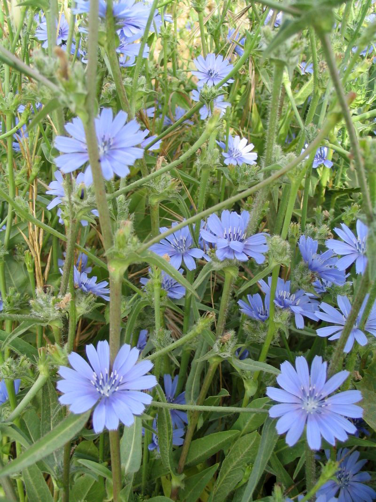
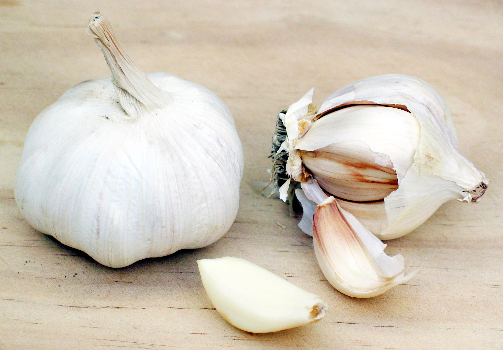
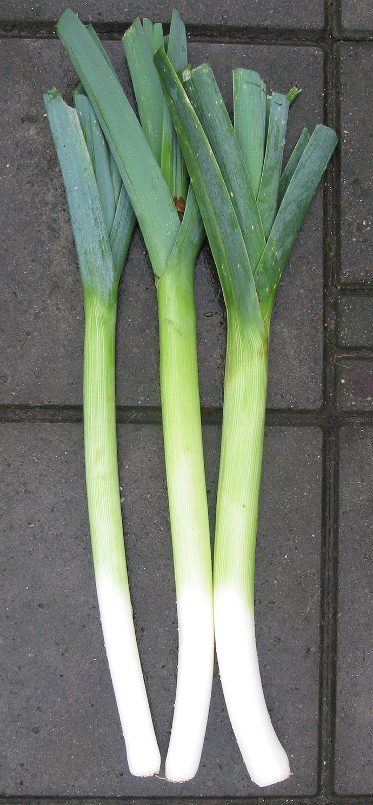
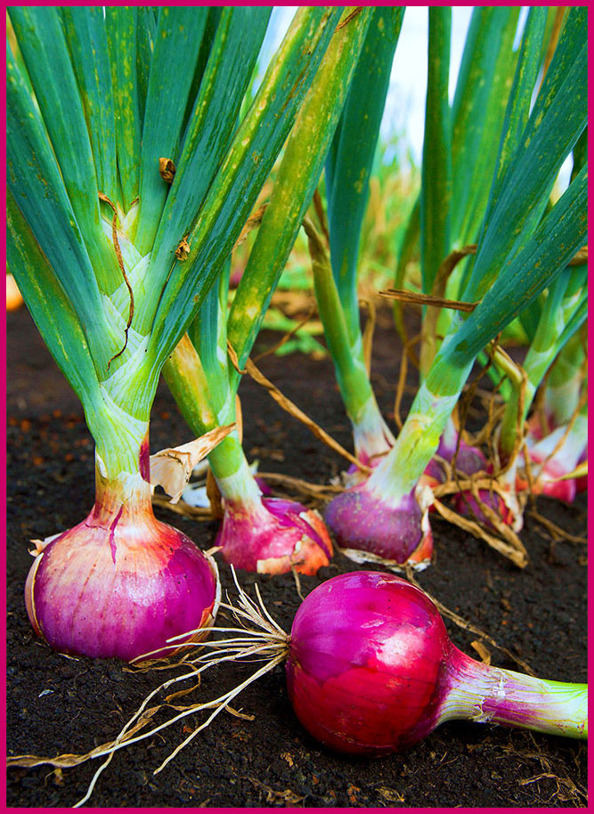

# Plants and Trees in the Bible

## License Information

Plants and Trees in the Bible © United Bible Societies, 2025. Adapted from: <cite>Each According to its Kind: Plants and Trees in the Bible</cite>, by Robert Koops © 2012 United Bible Societies. This work is licensed under Creative Commons Attribution-ShareAlike 4.0 International (<a href="https://creativecommons.org/licenses/by-sa/4.0/">https://creativecommons.org/licenses/by-sa/4.0/</a>).

--------------------------------

## 標題：葉類蔬菜（leafy vegetables） (id: FLORA:3.2)

3\.2 標題：葉類蔬菜（leafy vegetables）
==============================

我們這裡討論的葉類蔬菜是種植的或採摘的，或者兩者都有。聖經中列出了四種葉類蔬菜：苦菜、蒜、韭蔥和洋蔥。此外，我們從近東的考古發掘以及希臘和羅馬的文獻中了解到，在聖經時期之前的幾百年甚至上千年，人們就已經開始採摘和食用其他種類的葉類蔬菜，例如豌豆和葫蘆巴（直譯「希臘乾草」）。雖然聖經並沒有提到這些葉類蔬菜，但我們幾乎可以肯定，聖經時期的人們也吃這些蔬菜。

希伯來文*‘esev* 在舊約中出現了33次，通常指可以食用的「香草」（參[GEN 9:3](https://ref.ly/Gen9:3) 等）。祖海里認為，希伯來文短語*‘esev hassadeh* （「田間／田野裡的草／植物」）大概是指在野外採摘的可食用香草、野菜等植物（參[2KI 19:26](https://ref.ly/2Kgs19:26) 等）。然而在聖經時期，由於栽培仍在發展的進程中，因此有時候我們無法得知某種食物究竟是種植的還是採摘的。

在希伯來文中，蔬菜的另一個統稱是[2KI 4:39](https://ref.ly/2Kgs4:39) 中的*’oroth* 。經文記載，有個年輕的先知去田野摘*’oroth* 。祖海里注意到這件事發生在約旦河谷的吉甲附近，他指出，*’oroth* 可能是指芝麻菜，就是阿拉伯文中的*jarjir* 。他的根據是：在《他勒目》中，*’oroth* 和*gargir* 是同一種植物。然而，上下文表明這是一個通稱，因此這裡最有可能的意思仍然是「蔬菜」或「香草」。該詞是複數形式，而且亞蘭文譯本使用的詞語無疑是一個通稱，這兩點都説明*’oroth* 是指「蔬菜」或「香草」。*’Oroth* 源於希伯來文詞根*’arah* （意為「摘、採集、採摘」），這一點也支持*’oroth* 在這裡是籠統地指「採摘的東西」。

這裡的另一個希伯來文統稱是*chatsir* （出現了22次），祖海里認為這個詞最初是指「韭蔥」（參[NUM 11:5](https://ref.ly/Num11:5) ），但後來意思變成「牧草」或「田間的香草」（參[PSA 37:2](https://ref.ly/Ps37:2) 等）。

希伯來文名詞*deshe’* （出現了14次）是所有植物的統稱。[GEN 1:11](https://ref.ly/Gen1:11) 使用了這個名詞及其動詞形式，譯為「長出植物」。

另一個表示蔬菜的希伯來文統稱是*yaraq* ，出現在[DEU 11:10](https://ref.ly/Deut11:10); [1KI 21:2](https://ref.ly/1Kgs21:2); [PRO 15:17](https://ref.ly/Prov15:17) 中。[1KI 21:2](https://ref.ly/1Kgs21:2) 記載，亞哈王覬覦拿伯的葡萄園，想拿來作自己的*gan yaraq* （「菜園」）。由於植物分類方法和統稱的用法在不同語言中可能是不同的，因此這種表述方式可能會給翻譯者帶來困難。在許多語言中，根據所種植物的不同，不同類型的農田有不同的名稱。拿伯的葡萄園就在王宮的旁邊，因此表示「菜園」的詞需要與這個情況相符合。如果沒有合適的特定詞彙，翻譯者可以使用「我可以種菜的地方」或「我可以種東西的地方」等類短語。

希伯來文*zeru‘a* /*zero‘nim* （[LEV 11:37](https://ref.ly/Lev11:37); [ISA 61:11](https://ref.ly/Isa61:11); [DAN 1:12](https://ref.ly/Dan1:12); [DAN 1:16](https://ref.ly/Dan1:16) ）是動詞「種植」的名詞形式，字面意思是「種植的東西」。有些譯本根據上下文將這個詞譯為「種子」、「植物」或「種的東西」。有幾個譯本在[DAN 1:12](https://ref.ly/Dan1:12); [DAN 1:16](https://ref.ly/Dan1:16) 中將這個詞譯為「蔬菜」。

希臘文*lachanon* 在[ROM 14:2](https://ref.ly/Rom14:2) 中是蔬菜的統稱。在[LUK 11:42](https://ref.ly/Luke11:42) ，這個詞所指的植物包括薄荷和芸香，因此翻譯成「香草」是合宜的。RSV (Revised Standard Version (1952)) 在[MAT 13:32](https://ref.ly/Matt13:32) 和[MRK 4:32](https://ref.ly/Mark4:32) 中把這個詞譯為"shrubs"（「灌木」），因為在這兩節經文中，該詞指的是芥菜種長成後的植株。

* **Associated Passages:** 創世記 9:3; 列王紀下 19:26; 列王紀下 4:39; 民數記 11:5; 詩篇 37:2; 創世記 1:11; 申命記 11:10; 列王紀上 21:2; 箴言 15:17; 利未記 11:37; 以賽亞書 61:11; 但以理書 1:12; 但以理書 1:16; 羅馬書 14:2; 路加福音 11:42; 馬太福音 13:32; 馬可福音 4:32

## 標題：苦菜（bitter herbs） (id: FLORA:3.2.1)

3\.2\.1 標題：苦菜（bitter herbs）
===========================

經文出處
----

Hebrew 來： מָרֹר (音譯： maror)

[EXO 12:8](https://ref.ly/Exod12:8), [NUM 9:11](https://ref.ly/Num9:11), [LAM 3:15](https://ref.ly/Lam3:15)

討論
--

*矮菊苣 (Iorsh (Wikimedia Commons))*

在[EXO 12:8](https://ref.ly/Exod12:8); [NUM 9:11](https://ref.ly/Num9:11) 中，希伯來文*merorim* 是*maror* 的複數形式，源於意為「變苦」的詞根*marar* （比較[RUT 1:20](https://ref.ly/Ruth1:20) 中的「瑪拉」一名），因此這個詞可能指某種特定的植物，也可能是一個通稱。祖海里認為，*merorim* 可能是指矮菊苣（學名*Cichorium pumilum* ）、小菊苣（學名*Reichardia tingitana* ），和／或其他某種長著苦葉子的植物。莫爾登克提出，這個詞可能是指苦苣、蒲公英或酸模。除了上面提到的植物，《米示拿》還列出了生菜、刺芹、山葵和苦苣菜。換句話說，拉比認為，在逾越節的宴席上，選擇這些植物中的任何一種都是遵行吃*merorim* 的誡命。

特殊意義
----

在逾越節吃「無酵餅」和「苦菜」，是因為這些食物可以很快預備好，讓人回想起以色列人倉促離開埃及的情景（參[EXO 12:11](https://ref.ly/Exod12:11) ）。他們可能把苦菜做成燉菜或醬菜，好在這種緊急情況下吃。

翻譯
--

翻譯者最好用描述性的短語來翻譯「苦菜」，但如果沒有這樣的短語，那麼可以譯成某種有苦味的植物，或者在緊急情況下煮出來的某種醬菜或燉菜。可以按照某種主要語言音譯矮菊苣，例如：*hindiba* /*kasiniya* （阿拉伯文）、*chicoree* （法文）、*escarole* （西班牙文）和*chicoria* （葡萄牙文）。

* **Associated Passages:** 出埃及記 12:8; 民數記 9:11; 耶利米哀歌 3:15; 路得記 1:20; 出埃及記 12:11

## 標題：蒜（garlic） (id: FLORA:3.2.2)

3\.2\.2 標題：蒜（garlic）
====================

經文出處
----

Hebrew 來： שׁוּמִים (音譯： shum)

[NUM 11:5](https://ref.ly/Num11:5)

討論
--

*蒜頭，蒜瓣 (© Donovan Govan (Wikimedia Commons))*

蒜（學名*Allium sativum* ）在埃及、西亞和歐洲都非常受歡迎，在聖經時期可能也是這樣。在埃及和死海地區的古墓，人們發現了大量的蒜，年代可以追溯到主前3500年至主前3000年左右，這證明蒜在以色列人出埃及之前就已經被廣泛使用。希臘作家普林尼知道三種蒜。蒜被用來祭祀神明、入藥、做調料和保存肉類。

描述
--

蒜長著一個和洋蔥相像的鱗莖，但比洋蔥小，分四五個蒜瓣，每瓣都可以長成一棵新的植株，因為蒜不是通過種子來繁殖的。蒜瓣在英文中稱為"cloves"（「小鱗莖」）。蒜的味道和氣味非常獨特，在世界各地被用來調味和入藥。

特殊意義
----

[NUM 11:5](https://ref.ly/Num11:5) 羅列了以色列人在西奈曠野漂流時想吃的多種美味，其中包括洋蔥、韭蔥，還有蒜。

翻譯
--

蒜起源於中東，但其野生原种不詳。目前，蒜在世界各地都有種植，因此通常可以找到當地的名稱。如果沒有當地的名稱，鑒於[NUM 11:5](https://ref.ly/Num11:5) 的上下文是非修辭性的，建議按照某種主要語言進行音譯（例如，阿拉伯文*tawm* /*toum* 、法文*ail* 、西班牙文*ajo* /*aho* 、葡萄牙文*alho* /*alyo* 、斯瓦希里文*kitunguu**saumu* 、沃洛夫文*laaj* 、豪薩文*tafarnuwa* ）。

* **Associated Passages:** 民數記 11:5

## 標題：韭蔥（leek） (id: FLORA:3.2.3)

3\.2\.3 標題：韭蔥（leek）
===================

經文出處
----

Hebrew 來： חָצִיר (音譯： chatsir)

[NUM 11:5](https://ref.ly/Num11:5)

討論
--

*韭蔥植株 (Elisabeth Östman (Wikimedia Commons))*

根據祖海里的意見，[NUM 11:5](https://ref.ly/Num11:5) 中的希伯來文*chatsir* 指的是韭蔥（學名*Allium porrum* ），這個意見也得到了莫爾登克的支持；但赫珀認為，該詞更可能是指沙拉韭蔥（學名*Allium kurrat* ；又稱埃及韭蔥）；人們在埃及的古墓中發現了這種韭蔥。莫爾登克等人認爲，*chatsir* 也可能是葫蘆巴（學名*Trigonella foenum\-graecum* ），在埃及和聖地的人都知道這種香草。在舊約的其他經文中，*chatsir* 的意思是「草」、「香草」或「乾草」，因此這個詞可能是統稱任何可食用的綠色植物（參[5\.1\.2 草 (grass)](#FLORA:5.1.2) ）。然而，在同時出現「洋蔥」和「蒜」的經文中，這個詞應該是指韭蔥。祖海里認為*chatsir* 最初指的是某種特定的植物，後來變成了一個統稱。

描述
--

*剝好待售的韭蔥 (© Rasbak (Wikimedia Commons))*

韭蔥的葉子像洋蔥，味道也像洋蔥，但韭蔥的葉子是扁的，而洋蔥的葉子是圓的且空心。韭蔥的「鱗莖」（如果可以這樣說的話）又細又長，至少有10厘米（4英吋）。韭蔥可以拌沙拉生吃，也可以做成燉菜。

特殊意義
----

在古代，韭蔥被認為是窮人的食物。《民數記》記載，以色列人離開埃及後，非常想吃韭蔥、洋蔥和蒜等蔬菜。

翻譯
--

韭蔥遍佈世界各地。在西非，韭蔥不像洋蔥那麼普遍，但我在尼日利亞和岡比亞的大城市都看到有韭蔥售賣。鑒於[NUM 11:5](https://ref.ly/Num11:5) 這節經文是非修辭性的，翻譯者應該找到當地的三種蔥屬（學名*Allium* ）植物來翻譯韭蔥、洋蔥和蒜；或者音譯這三種植物，韭蔥可以按照法文*poireau* 、西班牙文*puerro* 、葡萄牙文*alho porro* 等進行音譯。

* **Associated Passages:** 民數記 11:5

## 標題：洋蔥（onion） (id: FLORA:3.2.4)

3\.2\.4 標題：洋蔥（onion）
====================

經文出處
----

Hebrew 來： בָּצָל (音譯： batsal)

[NUM 11:5](https://ref.ly/Num11:5)

討論
--

*洋蔥植株 (Stephen Ausmus (Wikimedia Commons))*

毫无疑问，希伯来文*batsal* 指的是我们现在所稱的洋葱（學名*Allium cepa* ）的原种。這種植物可能原產於聖地。早在主前3200年，埃及人就已熟知洋葱、韭蔥和蒜。希臘文《七十士譯本》把*batsal* 譯為*krommuon* 。

描述
--

*洋蔥鱗莖 (© Donovan Govan (Wikimedia Commons))*

洋蔥的葉子是空心的，莖也是空心的，高約30厘米（1英呎），花呈球狀。根是一個圓形的鱗莖，由一層緊貼一層的可食用的肥厚組織包裹而成。洋蔥的味道辛辣，但埃及品種的洋蔥是甜的。

特殊意義
----

在西奈曠野漂流的40年間，以色列人懷念在埃及生活時吃的可口食物，其中就有洋蔥、蒜和其他好吃的東西。

翻譯
--

洋蔥、韭蔥和蒜都隸於蔥屬（學名*Allium* ），這個屬約有600個物種，主要分佈在世界上的溫帶地區。洋蔥現在在非洲非常普遍，如果某種語言沒有洋蔥的名稱是很令人意外的，通常是外來語，例如豪薩文中的*albasa* （源自阿拉伯文；注意它和希伯來文*batsal* 很像）。如果需要按照某種主要語言進行音譯，可以考慮法文*oignon* 、西班牙文*cebolla* 、葡萄牙文*cebola* 、意大利文*cipolla* ，或斯瓦希里文*kitunguu* 。

* **Associated Passages:** 民數記 11:5

