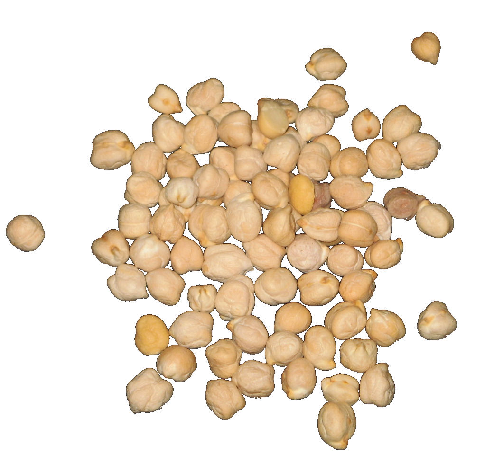
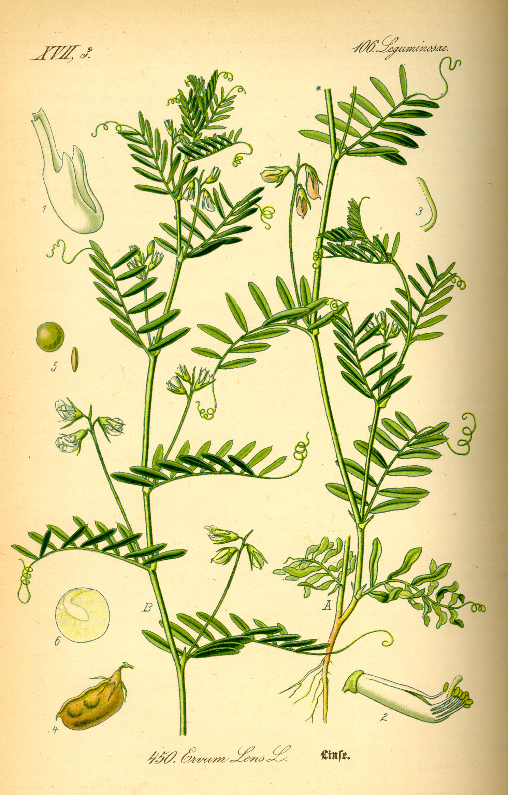

# Plants and Trees in the Bible

## License Information

Plants and Trees in the Bible © United Bible Societies, 2025. Adapted from: <cite>Each According to its Kind: Plants and Trees in the Bible</cite>, by Robert Koops © 2012 United Bible Societies. This work is licensed under Creative Commons Attribution-ShareAlike 4.0 International (<a href="https://creativecommons.org/licenses/by-sa/4.0/">https://creativecommons.org/licenses/by-sa/4.0/</a>).

--------------------------------

## 標題：豆類植物（pulses） (id: FLORA:3.3)

3\.3 標題：豆類植物（pulses）
====================

聖經中提到三種豆類植物：蠶豆、鷹嘴豆和扁豆。

## 標題：蠶豆（beans） (id: FLORA:3.3.1)

3\.3\.1 標題：蠶豆（beans）
====================

經文出處
----

Hebrew 來： פּוֹל (音譯： pol)

[2SA 17:28](https://ref.ly/2Sam17:28), [EZK 4:9](https://ref.ly/Ezek4:9)

討論
--

*蠶豆植株 (© Rasbak (Wikimedia Commons))*

解經家和翻譯者一致認為，希伯來文*pol* 指的是蠶豆（學名*Vicia faba* 、*Faba vulgaris* ）。蠶豆在中東種植了幾千年，而且可能就原產於那裡。目前還沒有發現蠶豆的野生品種，很有可能它們的原种已經滅絕了。考古學家在耶利哥發掘時，發現了蠶豆的殘餘物，年代可追溯到7000至8000年前。

描述
--

蠶豆是一種直立植物，而非藤本植物，可以長到1米（3英呎）高，枝子只長在莖的上部。蠶豆沒有捲鬚，這一點和今天許多種類的豆子不同。蠶豆的花是白色的，成熟後形成豆莢，裡面有3—6顆豆子，豆子又大又扁，呈奶油色或棕褐色。

特殊意義
----

[2SA 17:28](https://ref.ly/2Sam17:28) 記載，大衛王在躲避他兒子押沙龍的時候，人們給他送來食物，其中就有蠶豆。在[EZK 4:9](https://ref.ly/Ezek4:9) 中，上帝吩咐以西結要當眾用小麥、大麥、蠶豆、扁豆（即他能夠找到的任何糧食）來做「餅」，這裡的重點可能是，優質的餅很快就會在耶路撒冷變得稀缺。

翻譯
--

蠶豆屬（或野豌豆屬；學名*Vicia* ）至少有200個品種，蠶豆就是其中的一種。蠶豆屬隸於龐大的豆科。希伯來文*pol* 可能實際上不止指一種豆子，其中包括我們現在所知道的豌豆。由於世界各地都知道蠶豆和豌豆，翻譯者應該能夠找到一個當地的對等詞。在《撒母耳記下》和《以西結書》的這兩節經文中，*pol* 都是出現在清單裡面。如果翻譯者無法找到當地的豆子品種，那麼可以採用音譯（例如，阿拉伯文*adas* 、法文*faverole* 或*fève* 或*haricot* 、西班牙文*frijol* 、葡萄牙文*fava* 或*favarola* 或*feijão* ，斯瓦希里文*haragwe* 、拉丁文*vicia* ）。

* **Associated Passages:** 撒母耳記下 17:28; 以西結書 4:9

## 標題：鷹嘴豆（chickpeas） (id: FLORA:3.3.2)

3\.3\.2 標題：鷹嘴豆（chickpeas）
=========================

經文出處
----

Hebrew 來： חָמִיץ (音譯： chamits)

[ISA 30:24](https://ref.ly/Isa30:24)

討論
--

*鷹嘴豆植株 (© H. Zell (Wikimedia Commons))*

以賽亞先知在[ISA 30:24](https://ref.ly/Isa30:24) 中說，當上帝復興猶大國的時候，牛和驢必吃「用鏟子和杈子揚淨的」（*belil chamits* ）。希伯來文*belil* 意為「草料、飼料」，這是人們普遍接受的，但修飾詞*chamits* 的意思存在爭議。RSV (Revised Standard Version (1952)) 將這個詞譯為"salted"（「加鹽的」），GNB (Good News Bible) 譯為"finest and best"（「最精細的和最好的」），REB (Revised English Bible (1989)) 譯為"well\-seasoned"（「調好味的」），NLT (New Living Translation) 譯為"good"（「好的」）。NRSV (New Revised Standard Version (1989)) 和NAB (New American Bible (1970)) 把兩個詞合在一起，譯為"silage"（「青儲飼料」）。然而，希伯來文*chamits* 與阿拉伯文*chumus* 及亞蘭文*chimtsa* 同源，而且後面兩個詞都是指鷹嘴豆（學名*Cicer arietinum* ）。因此，祖海里建議將*chamits* 譯成「鷹嘴豆」。翻譯者的選擇取決於對*chamits* 的兩種解釋：一種有同源詞的證據支持，另一種有傳統的釋經支持。在耶利哥的發掘中，考古學家發現的鷹嘴豆至少可追溯到主前2000年，比以賽亞時期早得多；另外，考古學家聲稱在中東其他地方的遺址中也發現了鷹嘴豆，其中一些可追溯到主前7000年。在新月沃地北部，人們發現了鷹嘴豆的野生品種，因此，植物學家相信鷹嘴豆就起源於那裡。

描述
--

*鷹嘴豆 (© Sanjay Acharya (Wikimedia Commons))*

鷹嘴豆植株約有20厘米（8英吋）高，莖和枝上都有對生的小葉子，開藍色或白色的花，並結出一個短豆莢，裡面有1—2顆近乎立方體的棕褐色種子。

特殊意義
----

[ISA 30:24](https://ref.ly/Isa30:24) 旨在展示猶大輝煌的將來，到那時，就是牛和驢也必吃美味的食物。

翻譯
--

這裡的語境是修辭性的，所以如果翻譯者把*chamits* 理解為「鷹嘴豆」，那麼可以使用一個文化上的對等詞，最好是當地家畜喜歡吃的一種植物。如果翻譯者找不到特定的詞語來翻譯鷹嘴豆，則可使用一個統稱或一般性的短語。如果想要採用某種主要語言的音譯，可以考慮阿拉伯文*hummus* 、法文*pois**chiche* 或*cicerole* 、葡萄牙文*graão**de**bico* ，或者西班牙文*garbanzo* 。另一方面，如果依循*chamits* 的另一種解釋，也可以譯為「好的食物」、「最好的食物」、「混勻的食物」等。

* **Associated Passages:** 以賽亞書 30:24

## 標題：扁豆（lentils） (id: FLORA:3.3.3)

3\.3\.3 標題：扁豆（lentils）
======================

經文出處
----

Hebrew 來： עֲדָשָׁה (音譯： ‘adashah)

[GEN 25:34](https://ref.ly/Gen25:34), [2SA 17:28](https://ref.ly/2Sam17:28), [2SA 23:11](https://ref.ly/2Sam23:11), [EZK 4:9](https://ref.ly/Ezek4:9)

討論
--

*紅扁豆 (© Ray Pritz (UBS))*

學者一致認為，希伯來文*‘adashah* 指的是扁豆（學名*Lens culinaris* ，曾作*Lens esculenta* ）。阿拉伯文*‘adas* 、聖經成書之後的希伯來文獻中幾次出現該詞，以及《七十士譯本》，都證實這個詞指的是扁豆。考古發掘中發現的主前第六個或第七個千年的種子表明，扁豆是人類最早種植的植物之一。在這些考古中，扁豆經常與小麥和大麥種子一起被發現。

描述
--

*扁豆植株 (Otto Wilhelm Thomé Flora von Deutschland, Österreich und der Schweiz 1885\)*

扁豆是一種分枝低、莖軟的植物，像南瓜和西葫蘆一樣長著捲鬚，花朵粉紅色，可以像蠶豆那樣長成豆莢，豆莢很短，裡面只有一粒豌豆大小的種子。有一種扁豆的豆粒是紅棕色的，因此[GEN 25:30](https://ref.ly/Gen25:30) 說是「紅的」湯。豆莢通常兩個或三個一簇。在聖地，扁豆在比較冷的季節（11月—3月）生長。

特殊意義
----

[EZK 4:9](https://ref.ly/Ezek4:9) 提到一種奇怪的餅，用包括扁豆在內的六種穀物和豆類做成，可能是為了表明食物將會短缺，人們只能找到什麼就吃什麼。扁豆通常用來煮湯或做燉菜。雅各就是用這樣的紅豆湯誘使哥哥以掃放棄了長子的權利。大衛被押沙龍追趕時，有人送食物給他，其中就有扁豆。

翻譯
--

現今，扁豆廣泛分佈在亞洲、印度和北非。在人們不知道扁豆的地方，我們建議使用當地某種豆子的名稱來翻譯，而不使用音譯。不過，[EZK 4:9](https://ref.ly/Ezek4:9) 也提到了「蠶豆」，因此可以將「蠶豆和扁豆」譯為「不同種類的豆子」。在[GEN 25:34](https://ref.ly/Gen25:34) 中，用一個一般性的表達來翻譯「紅扁豆湯」比較合適，例如「豆子湯」、「燉豆子」（"bean stew"；CEV (Contemporary English Version) ），或「蔬菜湯」（"vegetable soup"；NCV (New Century Version) ）。如果想按某種主要語言進行音譯，可以考慮阿拉伯文*adas* 、法文*cristallin* 或*lentille* 、西班牙文*lenteja* 、葡萄牙文*lentilha* ，或斯瓦希里文*adesi* 。

* **Associated Passages:** 創世記 25:34; 撒母耳記下 17:28; 撒母耳記下 23:11; 以西結書 4:9; 創世記 25:30

