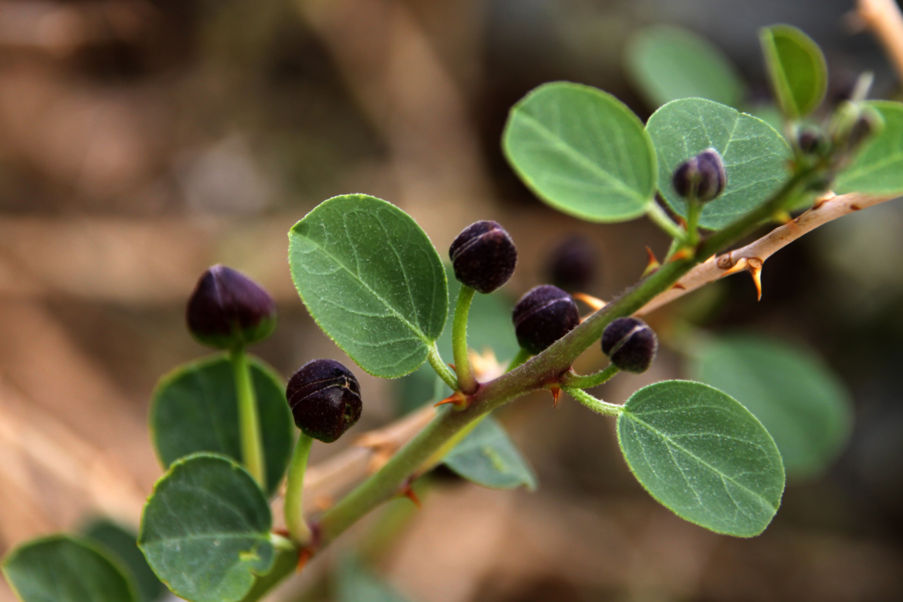
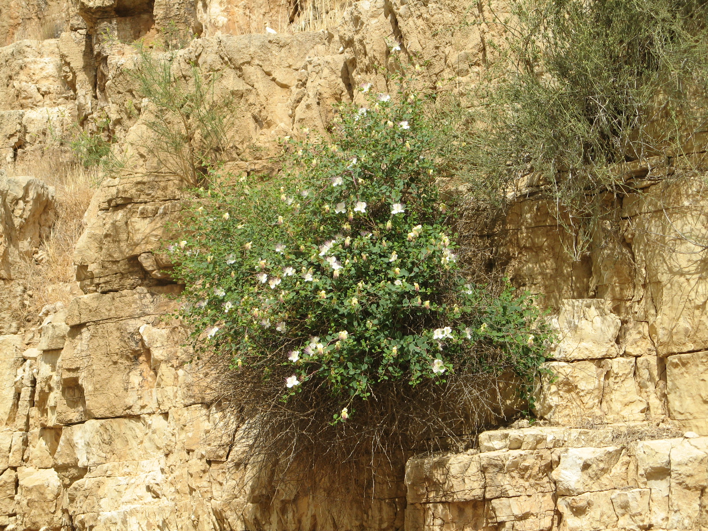
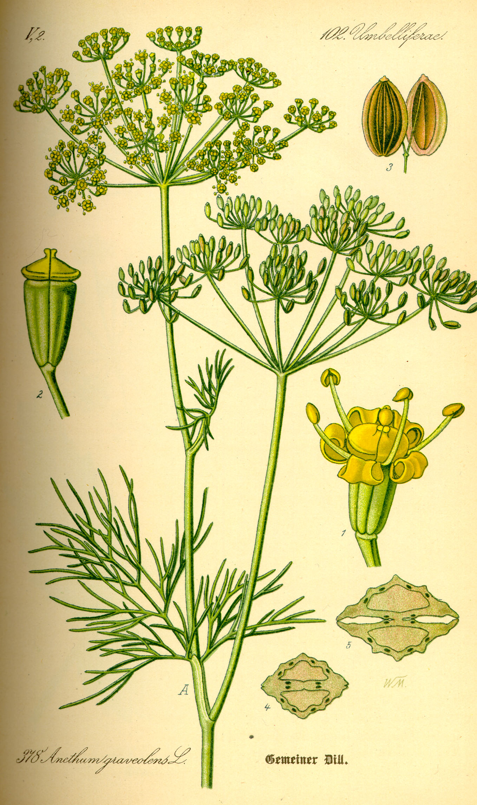
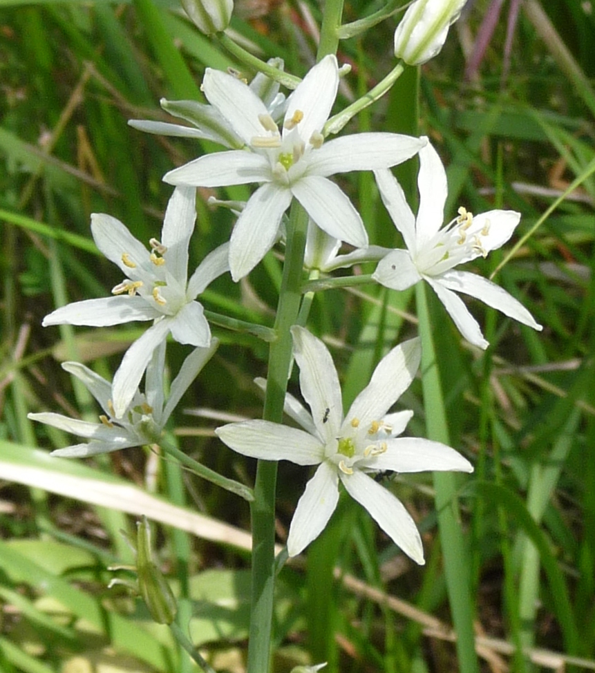
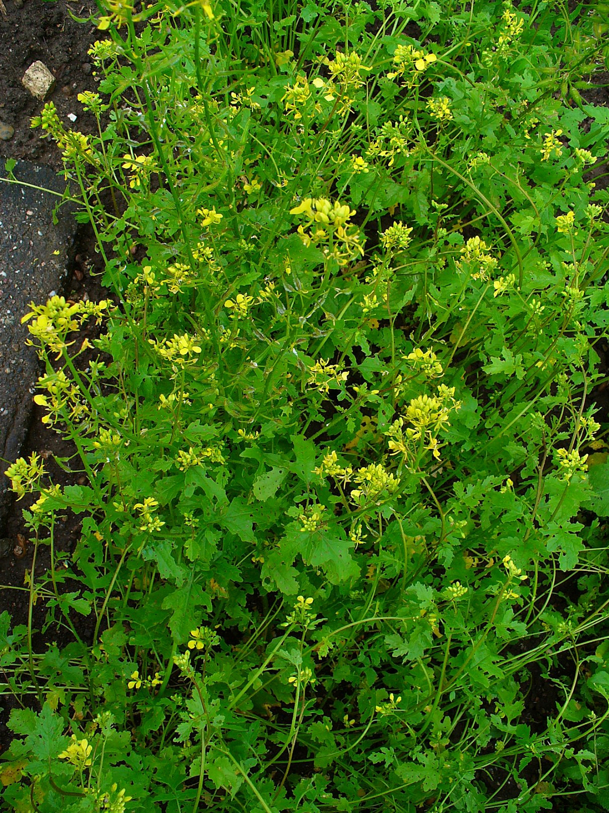
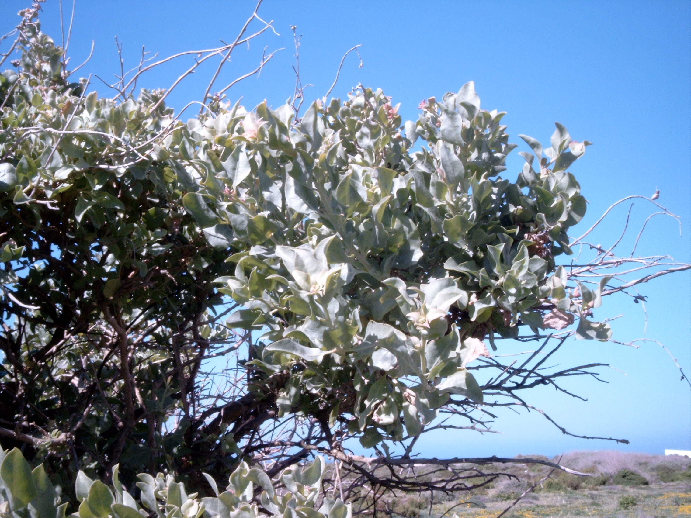
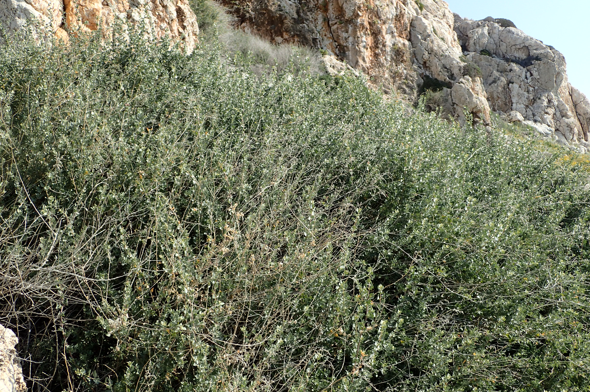

# Plants and Trees in the Bible

## License Information

Plants and Trees in the Bible © United Bible Societies, 2025. Adapted from: <cite>Each According to its Kind: Plants and Trees in the Bible</cite>, by Robert Koops © 2012 United Bible Societies. This work is licensed under Creative Commons Attribution-ShareAlike 4.0 International (<a href="https://creativecommons.org/licenses/by-sa/4.0/">https://creativecommons.org/licenses/by-sa/4.0/</a>).

--------------------------------

## 標題：調味料（condiments） (id: FLORA:3.5)

3\.5 標題：調味料（condiments）
=======================

聖經中提到11種調味料：刺山柑、芫荽、孜然、蒔蘿、鴿子糞、錦葵、薄荷、芥菜、黑種草、濱藜和芸香。

## 標題：刺山柑（刺山柑灌木、刺山柑漿果）（Caper [caper bush, caper berry]） (id: FLORA:3.5.1)

3\.5\.1 標題：刺山柑（刺山柑灌木、刺山柑漿果）（Caper \[caper bush, caper berry]）
=============================================================

經文出處
----

Hebrew 來： אֲבִיּוֹנָה (音譯： ’aviyonah)

[ECC 12:5](https://ref.ly/Eccl12:5)

討論
--

*刺山柑的花和花蕾 (Iorsh (Wikimedia Commons))*

[ECC 12:0](https://ref.ly/Eccl12:0) 描繪了美好的老年，在分句「慾望（希伯來文*’aviyonah* ）不再挑起」之後是一系列的比喻。*’Aviyonah* 這個詞在聖經中只出現了一次，因此它的意思還有很多爭論。《七十士譯本》的翻譯者採用了這個詞的第一個意思，譯為「刺山柑漿果」，指的是中東一種常見的小灌木刺山柑（學名*Capparis spinosa* ）的辣味花蕾。敘利亞文譯本、《武加大譯本》、NAB (New American Bible (1970)) 和GECL (German Common Language Version (Gute Nachricht Bibel)) 也採用了這個譯法。GW (God's Word Translation) 、JB (Jerusalem Bible (1966)) 和NJPSV (New Jewish Publication Society Version) 的譯法類似，為「刺山柑灌木」（"caper bush"），NEB (New English Bible (1970)) 和REB (Revised English Bible (1989)) 則譯為「刺山柑花蕾」（"caper\-buds"）。*La Nouvelle Bible Segond* 和*La Sainte Bible: Version Synodale* 簡單地譯為「刺山柑」，FRCL (French Common Language Version (Bible en français courant)) 使用了統稱「香料」。

*刺山柑花蕾 (© Yuvalr (Wikimedia Commons))*

古時的猶太人和其他一些族群用刺山柑漿果和醃製的刺山柑花蕾來增進食慾。另外，在希臘文和希伯來文字典中，意為「慾望」的詞語似乎就是源於刺山柑和慾望之間的聯繫。中世紀的歐洲人認為刺山柑漿果是一種春藥，然而莫爾登克沒有找到它在古代用作春藥的證據。

許多知名的植物學家相信，摩西五經中的希伯來文*’ezov* 一詞並不是指牛膝草（《七十士譯本》同）或馬郁蘭（「敘利亞牛膝草」），而是指生長在埃及和西奈曠野的刺山柑灌木；在那裡，上帝吩咐以色列人在慶祝逾越節時使用這種植物。這種植物生長在城牆的裂縫中，與[1KI 5:13](https://ref.ly/1Kgs5:13) （《和》4:33）所述所羅門對於植物的認識相符。有些學者甚至說，刺山柑灌木枝的枝條長度符合[JHN 19:29](https://ref.ly/John19:29) 中的描述（希臘文*hussōpos* ），在這節經文中，兵丁用一根枝條把一塊海綿送到耶穌的嘴邊。然而，根據詞源學，祖海里和其他一些人相信，*’ezov* 和 *hussōpos* 最有可能是指馬郁蘭。我同意他們的意見。關於這些詞語的討論，另參[5\.2\.4 馬郁蘭 (marjoram)](#FLORA:5.2.4) 。

描述
--

*刺山柑灌木 (© Ray Pritz (UBS))*

在開闊的地帶，刺山柑可以長成1米（3英呎）高的灌木，但更普遍的情況是，這種植物蔓延在岩石和倒塌的牆垣上，或者懸掛在懸崖和外牆的裂縫上。刺山柑的花很漂亮，有3片白紫色的花瓣和許多長而彎的紫色雄蕊。葉子呈圓形，灰綠色。花朵在夜晚開放，第二天早上枯萎，最後長成一根花梗和一個漿果，並且漿果裡面含許多種子。

特殊意義
----

*刺山柑花 (© Klearchos Kapoutsis (Wikimedia Commons))*

在中東和許多其他地方，人們把刺山柑的花蕾泡在醋里，然後和肉一起吃。這個過程稱為「醃製」，早在基督時期之前，以色列、埃及和阿拉伯就已經出現了腌製食物。中東人也吃刺山柑的辣果子。現今，醃製的刺山柑花蕾在整個歐洲都很受歡迎，尤其是在法國。古希臘作家常常提到這種植物。人們用刺山柑來治療胃脹氣。

翻譯
--

刺山柑在整個地中海地區很常見。另一個品種（學名*Capparis sodado* ）生長在東非（蘇丹）、阿拉伯和印度南部。這是一種幾乎沒有葉子的多刺灌木，長著可食用的漿果。山柑屬（學名*Capparis* ）的另外四個品種分佈於南美洲（主要在阿根廷、巴西南部、哥倫比亞、巴拉圭和委內瑞拉），名叫*Pan y agua* 和*Sacha\-poroto* 。那裡的人們也吃這些植物的果實，但它們顯然不如南歐的刺山柑那樣受歡迎。[ECC 12:5](https://ref.ly/Eccl12:5) 提到的刺山柑出現在一系列比喻中，因此，「刺山柑」的翻譯取決於翻譯者如何處理「杏樹」和其他比喻：是保留它們的字面意思，還是使用當地對等詞或統稱來進行「歸化」。在這節經文中，我們傾向於使用當地一種具有相同功能的植物來替代，從而保留語言上的詩意；這裡可以使用能夠刺激味蕾的一種植物。在這裡，我們想要表達老人不能享用辛辣的食物這個意思。如果要翻譯得更符合字面意思，可以使用英文的音譯，把整個分句譯為「*kaparis* 不再使你／他垂涎」，並在腳註中註明*kaparis* 是猶太人常吃的一種香料。另外也可以按照以下語言進行音譯：阿拉伯文*assaf* /*alkabara* 、法文*capre* 、葡萄牙文*alcaparras* ，或者西班牙文*alcaparron* /*caparra* 。RSV (Revised Standard Version (1952)) 作"desire fails"（「慾望衰敗」），這種翻譯是非比喻性的。如果採用這個譯法，那麼要增加一個腳註，說明這裡的希伯來文是指一種辛辣的食物。

* **Associated Passages:** 傳道書 12:5; 傳道書 12:0; 列王紀上 5:13; 約翰福音 19:29

## 標題：芫荽（coriander） (id: FLORA:3.5.2)

3\.5\.2 標題：芫荽（coriander）
========================

經文出處
----

Hebrew 來： גַּד (音譯： gad)

[EXO 16:31](https://ref.ly/Exod16:31), [NUM 11:7](https://ref.ly/Num11:7)

討論
--

*芫荽花 (© Niepokój Zbigniew (Wikimedia Commons))*

[EXO 16:31](https://ref.ly/Exod16:31) 記載，上帝施行神蹟，賜給在曠野漂流的以色列人一種叫做「嗎哪」的食物，這種食物「像芫荽子，是白的」。芫荽（學名*Coriandrum sativum* ）確實生長在埃及和聖地。然而，它的種子不是白的，而更像是棕色或灰色。[NUM 11:7](https://ref.ly/Num11:7) 告訴我們，嗎哪的顏色「如同bdellium」，我們對bdellium幾乎沒有任何確定的了解。此外，《七十士譯本》用了希臘文*korion* ，但這個詞不是指芫荽。阿拉伯文名稱*gidda* 與希伯來文*gad* 同源，指的是另一種植物，即艾草。另外，[EXO 16:14](https://ref.ly/Exod16:14) 描述嗎哪是「薄片狀的」，然而芫荽的種子卻是球形或卵形的，這使問題更加複雜了。

鑒於上述疑難，祖海里懷疑*gad* 這個詞不是指我們今天所知的芫荽。他推測，早期的翻譯者不知道*gad* 指的是什麼，就取了意為芫荽的布匿文*goid* ，從而把*gad* 和芫荽聯繫在一起。如果作者說「好像芫荽的花」，那我們還好理解一些，因為芫荽的花是白色的，但文本用了「子」，即種子。有可能早期的講述者或抄經者在傳遞文本時犯了一個錯誤。希伯來文的*perach* （「花」）會不會被*zera‘* （「種子」）取代了呢？

然而，經文原意確實也有可能是指芫荽種子，而嗎哪和芫荽種子比較的是大小，芫荽種子的直徑約4毫米（3/16英吋），和胡椒籽的大小差不多。因此，REB (Revised English Bible (1989)) 和NAB (New American Bible (1970)) 譯為："like coriander seed, but white"（「好像芫荽的種子，然而是白色的」）。另一種可能是，作者想要比較的是種子群聚在一起的樣子，或者是種子的硬度。[NUM 11:8](https://ref.ly/Num11:8) 告訴我們，百姓用臼搗，或用磨來磨，表明嗎哪具有一定的硬度。

描述
--

*芫荽種子 (© Sanjay Acharya (Wikimedia Commons))*

芫荽高約60厘米（2英呎），上面的葉子比較細碎，下面的葉子較闊，開白色或紅色的小花，香味濃郁。種子含油，呈棕色或灰色，大小和小豌豆差不多。芫荽的葉子和種子在古時用於烹飪，今天仍然用來做湯和沙拉。從種子中提取的芳香油有時用來製作香水和入藥。

特殊意義
----

如上所述，經文用芫荽來描述嗎哪的外形。可惜的是，我們不知道比較的是顏色、形狀、大小，還是手感。在以色列和埃及，一直到伊拉克和印度，芫荽都很常見。葉子用作烹飪調料，也用來製作香水。但如果比較的要點是芫荽的種子，那麼這些都是無關緊要的。

翻譯
--

《〈出埃及記〉手冊》（*A Handbook on Exodus* ）提出，芫荽和嗎哪作比較的要點是芫荽種子的形狀和大小，我們對此並不確定，所以很難找到一個文化上的對等詞。因此，翻譯者可以採用一般性的譯法，例如，GNB (Good News Bible) 譯成"like a small white seed"（「好像一顆白色的小種子」），並沒有提到芫荽（但在腳註中有說明）。翻譯者也可以依循REB (Revised English Bible (1989)) 和NAB (New American Bible (1970)) 的譯法（"like coriander seed, but white"，「好像芫荽種子，然而是白色的」），把種子和顏色分開。如果把種子和顏色分開，翻譯者可以按照某種語言來音譯「芫荽」，例如法文*koriyandro* 或*korion* 、阿拉伯文*kuzbara* 、葡萄牙文*coentro* 、西班牙文*cilantro* ，或者按照希伯來文*gad* 進行音譯。

《七十士譯本》把[EXO 16:31](https://ref.ly/Exod16:31) 中芫荽的希臘文（*korion* ）上移到了第14節。有些譯本採納了這個做法，但幫助不大。

* **Associated Passages:** 出埃及記 16:31; 民數記 11:7; 出埃及記 16:14; 民數記 11:8

## 標題：孜然芹、孜然（cumin [cumin]） (id: FLORA:3.5.3)

3\.5\.3 標題：孜然芹、孜然（cumin \[cumin]）
=================================

經文出處
----

Hebrew 來： כַּמֹּן (音譯： kammon)

[ISA 28:25](https://ref.ly/Isa28:25), [ISA 28:27](https://ref.ly/Isa28:27), [ISA 28:27](https://ref.ly/Isa28:27)

Greek 希： κύμινον (音譯： kuminon)

[MAT 23:23](https://ref.ly/Matt23:23)

討論
--

*孜然 (Franz Eugen Köhler (Wikimedia Commons))*

[ISA 28:25](https://ref.ly/Isa28:25); [ISA 28:25](https://ref.ly/Isa28:25); [ISA 28:27](https://ref.ly/Isa28:27); [ISA 28:27](https://ref.ly/Isa28:27) 提到兩種有爭議的種子：*qetsach* （參[3\.5\.9 黑種草（黑小茴香、黑子草、斯亞丹、肉豆蔻花）（nigella \[kalonji, black cumin, black seed, charnushka, nutmeg flower]）](#FLORA:3.5.9) ）和*kammon* 。這裡的*kammon* 種子可能就是孜然的種子，其英文名稱（cumin、cummin）源自拉丁文學名*Cuminum cyminum* ，而後者源自希臘文。孜然在地中海地區（尤其是敘利亞）和埃塞俄比亞很常見，甚至可能在埃及當地就有出產。埃及人用孜然來烹飪和入藥。

描述
--

孜然和胡蘿蔔屬於同一個科，從植株的底部就長出許多分枝，葉子和花與胡蘿蔔相似，不過種子的味道比胡蘿蔔種子更有刺激性。孜然是一年生植物，高度可達50—60厘米（20—24英吋）。

特殊意義
----

[ISA 28:25](https://ref.ly/Isa28:25); [ISA 28:25](https://ref.ly/Isa28:25); [ISA 28:27](https://ref.ly/Isa28:27); [ISA 28:27](https://ref.ly/Isa28:27) 提到了孜然和其他植物，以說明不同的植物及其果實需要不同的照料和處理（例如在脫粒時，孜然和黑種草比硬穀物更容易損壞）。這兩節經文出自以賽亞向驕傲的以色列領袖所講的一個比喻，這些領袖以為他們知道上帝如何對待百姓。有趣的是，馬耳他的農民如今仍然使用以賽亞所述的方法來打孜然。在新約時期，猶太人的領袖不確定是否要獻上孜然的十分之一，因為《摩西律法》並沒有明確提到這種植物。為謹慎起見，他們堅持要百姓獻上孜然的十分之一。但是，他們忽略了公義和憐憫，因此受到耶穌的譴責（[MAT 23:23](https://ref.ly/Matt23:23) ）。

翻譯
--

翻譯者可以按照某種主要語言進行音譯（例如，西班牙文*comino* 、葡萄牙文*cuminho* 或*cominho* 、阿拉伯文*kamun* 、斯瓦希里文*jamda* 或*kisibiti* 或*jira* ），也可以根據[MAT 23:23](https://ref.ly/Matt23:23) 中其他詞語（「薄荷」和「蒔蘿」）的處理方式來尋找一個對等詞。簡譯本可以使用「各種田園小作物」這類一般性的短語。

* **Associated Passages:** 以賽亞書 28:25; 以賽亞書 28:27; 馬太福音 23:23

## 標題：蒔蘿（dill） (id: FLORA:3.5.4)

3\.5\.4 標題：蒔蘿（dill）
===================

經文出處
----

Greek 希： ἄνηθον (音譯： anēthon)

[MAT 23:23](https://ref.ly/Matt23:23)

討論
--

*蒔蘿花 (© PatríciaR (Wikimedia Commons))*

KJV (King James Version (1611)) 把[MAT 23:23](https://ref.ly/Matt23:23) 中的希臘文*anēthon* 譯為"anise"（「八角茴香」），但現在學者一致認為耶穌指的是蒔蘿（學名*Anethum graveolens* ），這是一種花園香草。RSV (Revised Standard Version (1952)) 、NEB (New English Bible (1970)) 和REB (Revised English Bible (1989)) 把[ISA 28:25](https://ref.ly/Isa28:25); [ISA 28:27](https://ref.ly/Isa28:27); [ISA 28:27](https://ref.ly/Isa28:27) 中的希伯來文*qetsach* 譯為"dill"「蒔蘿」，現在被認為是錯誤的。（參[3\.5\.9 黑種草（黑小茴香、黑子草、斯亞丹、肉豆蔻花）（nigella \[kalonji, black cumin, black seed, charnushka, nutmeg flower]）](#FLORA:3.5.9) 。）

描述
--

*蒔蘿植株 (Prof. Dr. Otto Wilhelm Thomé Flora von Deutschland, Österreich und der Schweiz 1885, Gera, Germany)*

蒔蘿是一種一年生植物，可長到50厘米（20英吋）高。與胡蘿蔔、歐芹和小茴香一樣，蒔蘿長著很細的葉子，黃色的花朵好像一個有蓋的杯子，葉子和種子有一股很好聞的辛香味。

特殊意義
----

像孜然（3\.5\.3）和薄荷（3\.5\.7）等例子一樣，耶穌也借用蒔蘿來譴責猶太宗教領袖扭曲的價值觀，他們無視窮人的不幸，毫無憐憫地要求他們繳納十分之一，哪怕是花園作物的小種子。

翻譯
--

蒔蘿在西亞、印度、歐洲和美洲都為人所熟知。如果翻譯者對[MAT 23:23](https://ref.ly/Matt23:23) 所述的其他植物，即薄荷和孜然，採用了音譯，那麼「蒔蘿」也可以按照希臘文*anēthon* 或某種主要語言進行音譯（例如，法文*aneth* 、西班牙文*anega* 或*eneldo* 或*aneto* 、葡萄牙文*endro* 或*aneto* 或*funcho* 、阿拉伯文*bazrul* 或*shibit* 或*sjama* ）。學者對於這裡的語境是不是修辭性的尚有爭議，因此翻譯者可以音譯這三種植物，另外也可以選擇文化上的對等詞。翻譯者需要特別注意[2KI 6:25](https://ref.ly/2Kgs6:25) 的平行經文，那裡並沒有提到蒔蘿。AT (American Translation (Goodspeed, 1935)) 、Mft (Moffatt Translation (1926)) 、韦茅斯（Weymouth），以及一些現代英文譯本在這裡使用了"dill"（「蒔蘿」）。

* **Associated Passages:** 馬太福音 23:23; 以賽亞書 28:25; 以賽亞書 28:27; 列王紀下 6:25

## 標題：鴿子糞（伯利恆之星、傘花虎眼萬年青）（dove’s dung [star of bethlehem]） (id: FLORA:3.5.5)

3\.5\.5 標題：鴿子糞（伯利恆之星、傘花虎眼萬年青）（dove’s dung \[star of bethlehem]）
===============================================================

經文出處
----

Hebrew 來： חֲרָאִים, חרצנים (音譯： chareyonim或chartsonim)

[2KI 6:25](https://ref.ly/2Kgs6:25)

討論
--

*伯利恆之星植株 (Iorsh (Wikimedia Commons))*

在撒瑪利亞城被圍困的敘事中，[2KI 6:25](https://ref.ly/2Kgs6:25) 說「四分之一卡布的鴿子糞值五舍客勒」。撒瑪利亞人必定已經身處絕境，但即便如此，他們應該也不會吃鴿子的糞便，因此專家給出了三種可能性：

1\. 原作者寫的是希伯來文*chartsonim* （「野生洋蔥」），但被錯抄成了*chareyonim* （「鴿子糞」）。NJB (New Jerusalem Bible (1985)) 和NAB (New American Bible (1970)) 採取了這種解釋。

2\. 鴿子糞是一種常見植物的名稱（GNB (Good News Bible) 和NLT (New Living Translation) 中的腳註）。這種被稱為「鴿子糞」的植物可能是：

（1）刺槐豆或長角豆（NIV (New International Version (1984)) 、REB (Revised English Bible (1989)) 、NJPSV (New Jewish Publication Society Version) 中的腳註）；

（2）一種花的鱗莖（林奈（Linnaeus）、約瑟夫）。

3\. 真正的鴿子糞，進行了加工以替代鹽（GECL (German Common Language Version (Gute Nachricht Bibel)) ［1982］中的腳註）。

赫珀認為鴿子糞不大可能是指長角豆或刺槐豆，他認為2（2）的可能性更大，即*chareyonim* 指的是伯利恆之星（學名*Ornithogalum narbonense* ；又稱傘花虎眼萬年青）的鱗莖。根據歷史學家的說法，在撒瑪利亞被圍困期間，這種植物的鱗莖以每杯約兩盎司白銀的價格出售。林奈称伯利恆之星為ornitho\-galum（鳥糞）。這個名稱的字面意思是鳥奶，表明這位植物學家可能知道它與「鳥糞」之類的名字有聯繫。在眾多虎眼萬年青屬（學名*Ornithogalum* ）植物中，只有一種可食用，其他都是有毒的。我在尼日利亞生活過，那裡有一種叫「鳥糞」的植物，葉子是一種很受歡迎的做湯食材（豪薩文稱為*kashin tsuntsu* ），因此我更傾向於接受上面的解釋2。安德森（Anderson）、祖海里和哈魯范尼（Hareuveni）沒有提到「鴿子糞」，可能是因為他們不認為這是一種植物。

描述
--

*伯利恆之星 (© Hectonichus (Wikimedia Commons))*

伯利恆之星的植株高約25厘米（10英吋），底部有一束細長的葉子，芳香的白色花朵長在一根莖上，有6片花瓣。這種植物在春季末期開花，僅開放兩星期左右就會枯萎。花在早上開放，通常到中午就會閉合。

特殊意義
----

不論「鴿子糞」在[2KI 6:25](https://ref.ly/2Kgs6:25) 中指的是什麼，目的都是描寫撒瑪利亞居民在圍城期間的絕望處境，在當時的情況下，即便是幾乎不能吃的東西都能賣出高價。

翻譯
--

關於[JOB 6:6](https://ref.ly/Job6:6) 中「鴿子糞」的譯法，用某種勉強能吃、市場上有售的食物，或者「野生洋蔥」等類短語來翻譯都是合適的。翻譯者如果使用一種常用的度量單位或錢幣來替代「卡布」和「舍客勒」，會有助於讀者掌握這裡的重點。只要能夠把銀子的價值合理地表達出來，「鴿子糞」和「驢頭」的類比也會有助於讀者理解。如果翻譯者用當地的一種物品來替代「鴿子糞」，那麼必須是一種非常低廉的商品。《七十士譯本》按照字面意思翻譯「鴿子糞」。翻譯者如果想要直譯，像RSV (Revised Standard Version (1952)) 和NLT (New Living Translation) 所做的那樣，則要在腳註中說明「鴿子糞」可能是一種植物。如果採用音譯，可以按照法文*ornithogale* 或*aspergette* 、葡萄牙文*ornitogalos* ，或西班牙文*ornitogala* 。

* **Associated Passages:** 列王紀下 6:25; 約伯記 6:6

## 標題：錦葵（mallow） (id: FLORA:3.5.6)

3\.5\.6 標題：錦葵（mallow）
=====================

經文出處
----

Hebrew 來： חַלָּמוּת (音譯： challamuth)

[JOB 24:24](https://ref.ly/Job24:24)

Hebrew 來： כֹּל (音譯： kol)

[JOB 6:6](https://ref.ly/Job6:6)

討論
--

*馬齒莧 (© Júlio Reis (Wikimedia Commons))*

在[JOB 6:6](https://ref.ly/Job6:6) 中，約伯回應他所謂的朋友那些毫無幫助、毫不友善的話語時，問了這樣一個問題：「食物淡而無鹽豈可吃呢？馬齒莧（希伯來文*challamuth* ）的黏液有什麼滋味呢？」這兩行平行詩句的要點是：（1）無味的東西需要鹽；（2）*challamuth* 的黏液無味。

關於希伯來文*challamuth* 一詞在這裡是否指植物，學者仍有許多爭議。有些譯本將這個詞譯為「蛋白」（"white of an egg"，GNB (Good News Bible) 、NLT (New Living Translation) 、GW (God's Word Translation) ；"egg white"，NIV (New International Version (1984)) ），有位解經家提出這可能是指「石灰水」、「灰泥」，甚至「死人」。然而，根據阿拉伯文同源詞*lachamut* 和米示拿傳統，祖海里認為*challamuth* 可能是指錦葵科（學名*Malvaceae* ）中的一種或多種植物，即歐錦葵（學名*Malva sylvestris* ）、法國錦葵（學名*Malva nicaeensis* ），或蜀葵（學名*Alcea setosa* ）。REB (Revised English Bible (1989)) 譯為"mallow"（「錦葵」）。該科的一些物種是山羊的食物，貝都因人也會煮來吃。

然而，赫珀認為*challamuth* 是普通的馬齒莧（學名*Portulaca oleracea* ），這是另一種用來做沙拉和入藥的植物。莫爾登克認為[JOB 6:6](https://ref.ly/Job6:6) 中根本沒有植物。

描述
--

*普通錦葵 (© Alvesgaspar (Wikimedia Commons))*

普通錦葵是一種小型植物，可以長到大約25厘米（10英吋）高，葉子為圓形、淺裂狀或心形，莖長，開紫色花。

特殊意義
----

如果*challamuth* 指的是一種植物，那麼在[JOB 6:6](https://ref.ly/Job6:6) 中，這種植物就是象徵一種無味的、黏稠的東西。約伯形容他朋友的話像黏滑的*challamuth* ，毫無味道、毫無幫助。毫不意外，比勒達在[JOB 8:1](https://ref.ly/Job8:1) 中以同樣的方式回應約伯，說約伯的話如「狂風」。

翻譯
--

[JOB 6:6](https://ref.ly/Job6:6) ：由於專家的意見分歧很大，翻譯者在翻譯*challamuth* 時，最簡單的方法就是依循所在地區的某個主要譯本。這節經文是修辭性的，因此翻譯者如果想要追求詩體效果，可以找一個文化上的對等詞——某種沒有味道的植物，或者其他難吃的東西，例如生蛋清。

這裡有一個重要的問題：到底*challamuth* 是完全不能吃的東西，還是某種加了鹽就可以吃的東西？在非洲，秋葵和玫瑰茄都是大家所熟知（且有黏液）的植物，可以用這樣的植物來翻譯。然而，翻譯者要謹慎，因為人們常常把秋葵和玫瑰茄放到湯裡吃，而且覺得很美味！《〈約伯記〉手冊》（*A Handbook on The Book of Job* ）用了大致相同的篇幅來闡述「馬齒莧」、「錦葵」、「馬利筋」和「蛋清」等譯法，最後建議採用「蛋清」，GNB (Good News Bible) 就用了這個譯法。然而，如果翻譯者想把*challamuth* 譯為一種植物，我們根據兩種假設提供了下述翻譯範例：

1\. 如果希伯來文*tafel* （「無味的東西」）和*rir challamuth* （「馬齒莧的黏液」）指的是完全不可食用的東西，那麼[JOB 6:6](https://ref.ly/Job6:6) 有兩種譯法：

「給我吃的東西，沒有人能嚥下去。它好像灰泥，又像馬利筋（或：大戟属仙人掌／錦葵）的汁液。」

「沒有人吃得下石灰水（或：灰泥／沙子／稻草／棉花）。馬利筋的汁液（或：大戟的汁液）毫無味道。」

2\. 如果這兩個希伯來文詞語指的是可食用但無味的東西，有以下兩種譯法：

「給我吃的東西，沒有人能下嚥，好像無鹽的流食（或：生木薯或某種沒有什麼味道的當地普通食物），又像錦葵的汁液（或：某種沒有味道但可以食用植物的汁液）。」

「沒有人吃得下沒加鹽的半流質食物（或：生木薯或某種味道寡淡的當地食物，例如大米）。錦葵的汁液（或：某種無味但是可以食用的植物的汁液）毫無味道。」

這些譯法都可以為約伯的下句話作鋪墊：「我心不肯挨近。」

[JOB 24:24](https://ref.ly/Job24:24) ：HOTTP (Hebrew Old Testament Text Project (UBS)) 提出，譯為「好像錦葵」（"like the mallow"；RSV (Revised Standard Version (1952)) ）的希伯來文*kakol* 的意思可能是「像眾人」或「像傘形花序」。（傘形花序是長在一根花軸上的一簇花。）如果*kakol* 後面的希伯來文動詞真的意指「閉合」，那麼「傘形花序」就顯得很奇怪，因為據我所知，傘形花序不會「閉合」。因此，如果翻譯者在這裡依循HOTTP (Hebrew Old Testament Text Project (UBS)) ，我們建議譯為「像眾人」。NIV (New International Version (1984)) 就是採取這個意思，把這節經文的第二行譯為"they are brought low and gathered up like all others"（「他們降為卑，像眾人一樣被收聚」；LB (Living Bible (1971)) 、NAB (New American Bible (1970)) 和沃爾弗斯（Wolfers）的譯法類似）。

根據波普（Pope）的意見，《七十士譯本》把*kol* 譯為一種名叫「鹽草」的植物。如果翻譯者要依循《七十士譯本》，「鹽草」這個譯名要優於「錦葵」。如果需要按照英文進行音譯，那麼從植物學的角度，"saltwort"（「鹽草」；NJB (New Jerusalem Bible (1985)) ）或「鹽土植物」比"mallow"（「錦葵」；RSV (Revised Standard Version (1952)) 、NJPSV (New Jewish Publication Society Version) ）更準確。參[3\.5\.10 濱藜（鹽草）（orache \[saltwort]）](#FLORA:3.5.10) 。

GNB (Good News Bible) 和CEV (Contemporary English Version) 把*kol* 譯為"weeds"（「雜草」），以避開確定植物品種的問題，但這個籠統的譯法無疑會使文本有所減色。

* **Associated Passages:** 約伯記 24:24; 約伯記 6:6; 約伯記 8:1

## 標題：薄荷（mint） (id: FLORA:3.5.7)

3\.5\.7 標題：薄荷（mint）
===================

經文出處
----

Greek 希： ἡδύοσμον (音譯： hēduosmon)

[MAT 23:23](https://ref.ly/Matt23:23), [LUK 11:42](https://ref.ly/Luke11:42)

討論
--

*歐薄荷 (© Isidre blanc (Wikimedia Commons))*

歐薄荷（學名*Mentha longifolia* ）是聖地最常見的一種薄荷，分佈在全以色列的河岸上。猶太人稱之為*dandanah* ，這個希伯來文詞語沒有出現在舊約中。猶太人把這種薄荷的葉子和奶、黃瓜一起煮成熱飲，也會把薄荷葉入藥或作烹飪調料，羅馬人和希臘人也這樣做。莫爾登克說，猶太人把薄荷葉撒在會堂的地面上，當人們進來踩在葉子上面時，葉子就會散發出香味。

描述
--

歐薄荷比其他品種的薄荷要大，可長到2米（7英呎）高，葉子小而柔軟，邊緣為鋸齒狀，花朵呈淡紫色。

特殊意義
----

在[MAT 23:23](https://ref.ly/Matt23:23) 和[LUK 11:42](https://ref.ly/Luke11:42) 中，耶穌譴責法利賽人恪守律法，凡物都獻上十分之一，不僅是橄欖、棗和小麥等主要糧食作物，甚至薄荷等摘來做湯的葉子也要繳納，但他們卻無視公義和貧窮的問題。

翻譯
--

全世界溫帶地區至少分佈有25種薄荷。在西非，薄荷是一種廣為人知的茶葉添加劑。在[MAT 23:23](https://ref.ly/Matt23:23) 和[LUK 11:42](https://ref.ly/Luke11:42) 中，這個詞的譯法取決於翻譯者如何處理經文中提到的其他植物（蒔蘿、孜然和芸香）。如果當地沒有這些植物，翻譯者可以音譯某種主要語言（例如，法文*menthe* 、西班牙文*menta* 、葡萄牙文*hortelã* 或*hisopo* 或*erva**de**São**Lourenco* 、斯瓦希里文*mnaanaa* ）。在簡譯本中，翻譯者可以使用一個概括性的短語來涵蓋所有這些植物，例如「田園中的各種矮小植物」。

* **Associated Passages:** 馬太福音 23:23; 路加福音 11:42

## 標題：芥菜（mustard） (id: FLORA:3.5.8)

3\.5\.8 標題：芥菜（mustard）
======================

經文出處
----

Greek 希： σίναπι (音譯： sinapi)

[MAT 13:31](https://ref.ly/Matt13:31), [MAT 17:20](https://ref.ly/Matt17:20), [MRK 4:31](https://ref.ly/Mark4:31), [LUK 13:19](https://ref.ly/Luke13:19), [LUK 17:6](https://ref.ly/Luke17:6)

討論
--

*白芥植株 (© H. Zell (Wikimedia Commons))*

耶穌曾經講過一個芥菜種的比喻，關於這個著名比喻中所提到的植物是什麼，人們並沒有完全一致的看法。聖地有兩種芥菜，即黑芥（學名*Brassica nigra* ）和白芥（學名*Sinapis alba* ），這兩種芥菜很可能在聖經時期就已經生長在那裡了。祖海里和莫爾登克認為是黑芥，而赫珀未下定論。聖經時期的人們種植或採摘這兩種植物，可能更多是為了獲取入藥或烹飪的油，而不是作香料。這兩種芥菜現今都有種植。

描述
--

*芥菜種子和大頭針 (© Ray Pritz (UBS))*

芥菜與其他一些人們熟知的蔬菜有親緣關係，例如羽衣甘藍、西蘭花、花椰菜、抱子甘藍、蕪菁甘藍和大白菜。芥菜是一年生植物，高度可達2米（7英呎），長著枝條，就像是一棵樹。枝子末端有亮黃色的花，4片花瓣，和十字花科（學名*Brassicaceae* ）幾乎所有的植物一樣。芥菜的種子在菜園植物中是比較小的，直徑約2毫米（1/12英吋），但絕對不是最小的。

特殊意義
----

耶穌所講的芥菜種比喻的重點是：微小的東西也可以產生出巨大而複雜的事物，就像上帝的國，或像一個人因著信心做出驚人之舉。

翻譯
--

世界上已知的芥菜至少有30種，其中21種在歐洲。其他品種分佈在北非、印度、日本和中國。福音書中每次提到芥菜種時，都旨在強調：芥菜的種子很小，但長成的植株卻很大。翻譯者即便找到芥菜的近緣植物，也必須注意種子與植株的大小對比。如果找不到有效的對等詞，就要按照某種主要語言進行音譯，例如，法文*moutarde* 、西班牙文*mostaza* 、葡萄牙文*mostarda* 、阿拉伯文*khardal**aswad* ，或斯瓦希里文*haradali* 。

* **Associated Passages:** 馬太福音 13:31; 馬太福音 17:20; 馬可福音 4:31; 路加福音 13:19; 路加福音 17:6

## 標題：黑種草（黑小茴香、黑子草、斯亞丹、肉豆蔻花）（nigella [kalonji, black cumin, black seed, charnushka, nutmeg flower]） (id: FLORA:3.5.9)

3\.5\.9 標題：黑種草（黑小茴香、黑子草、斯亞丹、肉豆蔻花）（nigella \[kalonji, black cumin, black seed, charnushka, nutmeg flower]）
=========================================================================================================

經文出處
----

Hebrew 來： קֶצַח (音譯： qetsach)

[ISA 28:25](https://ref.ly/Isa28:25), [ISA 28:27](https://ref.ly/Isa28:27), [ISA 28:27](https://ref.ly/Isa28:27)

討論
--

*黑種草植株 (Franz Eugen Köhler, Köhler's Medizinal\-Pflanzen)*

比較各英文譯本的[ISA 28:25](https://ref.ly/Isa28:25); [ISA 28:27](https://ref.ly/Isa28:27); [ISA 28:27](https://ref.ly/Isa28:27) 可以看出，翻譯者對希伯來文*qetsach* 非常困惑。這個詞被譯為「雞鼬」（"fitches"；KJV (King James Version (1611)) ）、「蒔蘿」（"dill"；RSV (Revised Standard Version (1952)) 、GNB (Good News Bible) 、CEV (Contemporary English Version) 、NLT (New Living Translation) 、NEB (New English Bible (1970)) 、REB (Revised English Bible (1989)) ）、「小茴香」（"fennel"；JB (Jerusalem Bible (1966)) 、NJB (New Jerusalem Bible (1985)) ），以及「藏茴香」（"caraway"；NIV (New International Version (1984)) ）等。祖海里認為這些譯法都不準確，他確信*qetsach* 指的是黑種草（學名*Nigella sativa* ），又稱為肉豆蔻花、黑孜然（black cumin，中文常稱「黑小茴香」）、黑子草、斯亞丹。（這兩節經文中的希伯來文*kammon* 是指普通的孜然；參[3\.5\.3 孜然芹、孜然 (cumin \[cumin])](#FLORA:3.5.3) 。）赫珀也同意祖海里的看法，並且顯然得到了波斯特（Post）、莫爾登克等人的支持。在亞蘭文和阿拉伯文中，*qetsach* 的對等詞是*qatscha* 。直到今天，猶太人、阿拉伯人和歐洲人仍然用黑種草籽來點綴蛋糕和麵包。黑種草還可以用作調味料。

描述
--

黑種草是一年生植物，可以長到大約30厘米（1英呎）高，葉子像蒔蘿和胡蘿蔔葉一樣帶有花邊，開藍綠色的花，有5片花瓣。花的基部會長成一個種莢，裡面有許多黑色的圓種子，氣味刺鼻。

特殊意義
----

以賽亞在講給以色列領袖的一個比喻中提到了幾種植物，黑種草就是其中之一。他說，農民在為下一個季節作準備時，不會毀壞當季的工作成果。他這個比喻是對那些自以為什麼都知道、好譏誚的人說的，這些人聲稱上帝的道路是已經完全定死的。以賽亞反駁他們說：上帝的道路是根據他所造之物的情況而定的，就像農民根據不同作物的需要來種植和收穫那樣。

翻譯
--

黑種草的名稱很多，說明這種植物在世界各地都很受歡迎。幸好，如今它的拉丁名*Nigella* 取代了令人困惑的「黑孜然」（或「黑小茴香」）這個名稱。這樣很好，因為黑種草與孜然（和小茴香）是完全不同的植物。同樣地，「肉豆蔻花」和「藏茴香」這兩個名稱也失去了人們的青睞。因此，為避免英文帶來的混淆，翻譯者可以通過從其他主要語言進行音譯，例如拉丁文（*nigella* ）、法文和荷蘭文（*nigelle* ）、西班牙文（*agenuz* 、*neguilla* 、*arañuel* ）、德文（*Nigella* 、*Schwartzkümmel* ［字面意為「黑種子」）、希伯來文（*qetsach* ）、波斯文（*kalanji* ），或阿拉伯文（*habbet as suda* 、*kamun aswad* 、*shuniz* ）。黑種草在亞蘭文中是*tikur azmud* ，在印尼文中是*jinten hitam* 。

* **Associated Passages:** 以賽亞書 28:25; 以賽亞書 28:27

## 標題：濱藜（鹽草）（orache [saltwort]） (id: FLORA:3.5.10)

3\.5\.10 標題：濱藜（鹽草）（orache \[saltwort]）
======================================

經文出處
----

Hebrew 來： מַלּוּחַ (音譯： malluach)

[JOB 30:4](https://ref.ly/Job30:4)

討論
--

*濱藜 (© Karsten Niehaus (Academic.com))*

[JOB 30:4](https://ref.ly/Job30:4) 描寫了一群可憐的人在飢餓時採摘*malluach* 和灌木的葉子來吃。有少數植物學家把*malluach* 譯為「錦葵」（"mallow"；RSV (Revised Standard Version (1952)) 同），但祖海里依循莫爾登克等人的看法，認為*malluach* 是指灌木濱藜（學名*Atriplex halimus* ），也稱為鹽草。希臘文《七十士譯本》譯作*halimōn* （源自*halmē* ，意為「鹹的」），指的是一種鹽草或濱藜。濱藜在沙漠、地中海和死海沿岸的鹽堿地尤其常見。如果我們依循《七十士譯本》，濱藜或鹽草也可用在[JOB 24:24](https://ref.ly/Job24:24) （参[3\.5\.6 錦葵 (mallow)](#FLORA:3.5.6) ）。

描述
--

*灌木濱藜 (© Krzysztof Ziarnek, Kenraiz (Wikimedia Commons))*

濱藜植株可長到2米（7英呎）高，從地面開始就長出許多枝子。莖和枝上長著銀灰色的小葉子，上面覆蓋著細小的毛。葉子可吃，但很鹹。濱藜和菠菜同隸於藜科（學名*Chenopodiaceae* ）。

翻譯
--

由於無法確定希伯來文*malluach* 指的是什麼植物，翻譯者在這裡可以採用一般性的短語，譯為「粗糙的葉子」（"coarse leaves"；NLT (New Living Translation) ）、「無味的灌木」（"tasteless shrubs"；CEV (Contemporary English Version) ）、「沙漠植物」（"desert plants"；NCV (New Century Version) ），或「在沙漠中生長的植物」（"plants of the desert"；GNB (Good News Bible) ）。NIV (New International Version (1984)) 譯作"salt herbs"（「鹽苦菜」），指的是濱藜的耐鹽性，這種性質反映在《七十士譯本》的用詞及其別稱「鹽草」中。然而，這裡也可以使用某種植物的名稱；如果想要這樣翻譯，可以根據某種主要語言進行音譯（例如，英文*orash* 、法文*arroche* ），也可以新造一個類似「鹽灌木」這樣的詞。翻譯者不應使用「錦葵」，因為它指的是[JOB 6:6](https://ref.ly/Job6:6) 中提到的另一種植物（參[3\.5\.6 錦葵 (mallow)](#FLORA:3.5.6) ）。

* **Associated Passages:** 約伯記 30:4; 約伯記 24:24; 約伯記 6:6

## 標題：芸香（rue） (id: FLORA:3.5.11)

3\.5\.11 標題：芸香（rue）
===================

經文出處
----

Greek 希： πήγανον (音譯： pēganon)

[LUK 11:42](https://ref.ly/Luke11:42)

討論
--

*芸香花 (© Zeynel Cebeci (Wikimedia Commons))*

在耶穌時期，聖地只有一種比較常見的野生芸香，即敘利亞芸香（學名*Ruta chalepensis* ），這很可能就是耶穌斥責法利賽人時提到的那種芸香（[LUK 11:42](https://ref.ly/Luke11:42) ）。後來，猶太人從南歐引入了一種栽培類芸香（學名*Ruta graveolens* ），這種芸香和敘利亞芸香十分相似。直到今天，芸香在從敘利亞到西奈的整個中東地區仍然很常見。芸香具有濃郁的特殊氣味，現今仍用於烹飪和入藥。希臘人、羅馬人和猶太人用它來治療蛇咬，以及蜜蜂、黃蜂和蝎子的蟄刺；另外，他們認為芸香還可以治療精神錯亂、癲癇，甚至「邪惡之眼」。在後聖經時期的猶太文學作品中，芸香被稱為*pigam* ，這個詞與希臘文*pēganon* 和阿拉伯文*fegan* 同源。

描述
--

*芸香植株 (Otto Wilhelm Thomé Flora von Deutschland, Österreich und der Schweiz 1885, via Kurt Stueber)*

芸香是一種小型灌木植物，可長到1米（3英呎）高，在地面處就開始生出許多枝子，開許多黃色花朵，葉子很香。

特殊意義
----

古猶太法典《他勒目》規定，種植的植物應獻上十分之一。新約時期，人們已經種植了芸香、蒔蘿等從前沒有種植過的植物。法利賽人把《他勒目》中關於奉獻的規條應用到了這些小作物上，使普通百姓的生活更加艱難，但他們卻忽略了公義和憐憫，這是耶穌和法利賽人之間的核心分歧。

翻譯
--

根據[LUK 11:42](https://ref.ly/Luke11:42) 中「薄荷」的具體譯法，翻譯者可以使用一個文化上的對等詞來翻譯「芸香」，或者使用一個表示「薄荷、芸香和各種香草」的一般性短語。由於這裡的語境是非修辭性的，所提到的植物也是中東獨有的，因此適合採用「芸香」的音譯；可以按照希臘文*pēganon* 或某種主要語言進行音譯。英文"rue"（「芸香」）源自古英文*ruwe* ，而*ruwe* 則源於拉丁文*ruta* 和希臘文*rhyte* 。

* **Associated Passages:** 路加福音 11:42

