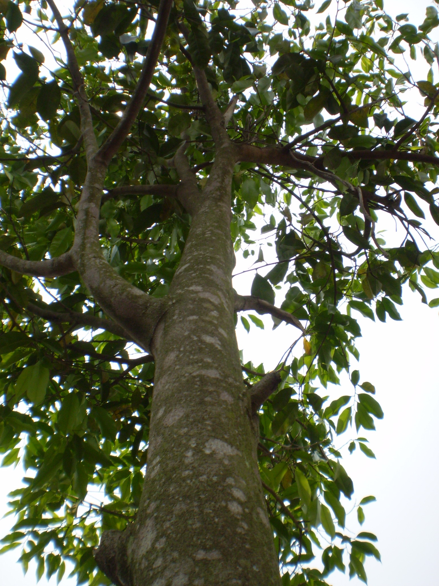
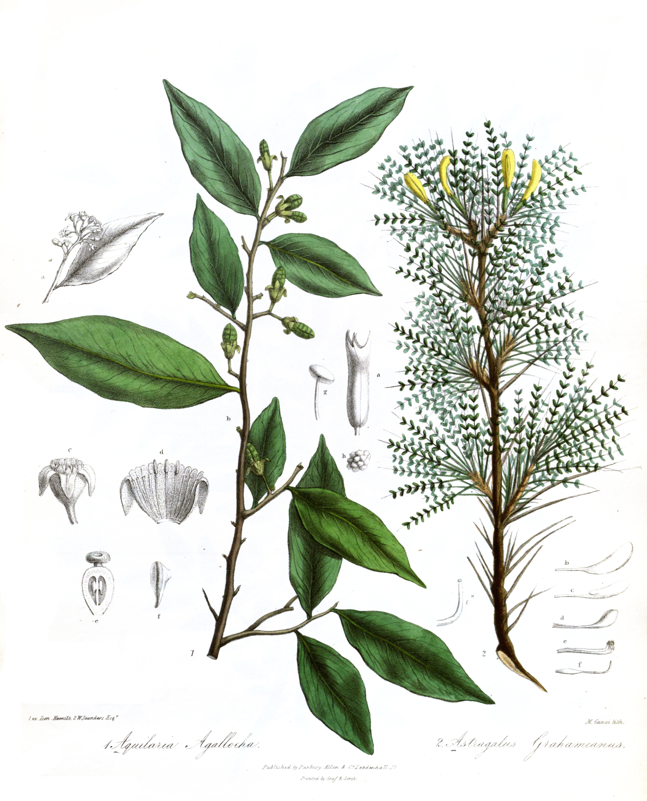
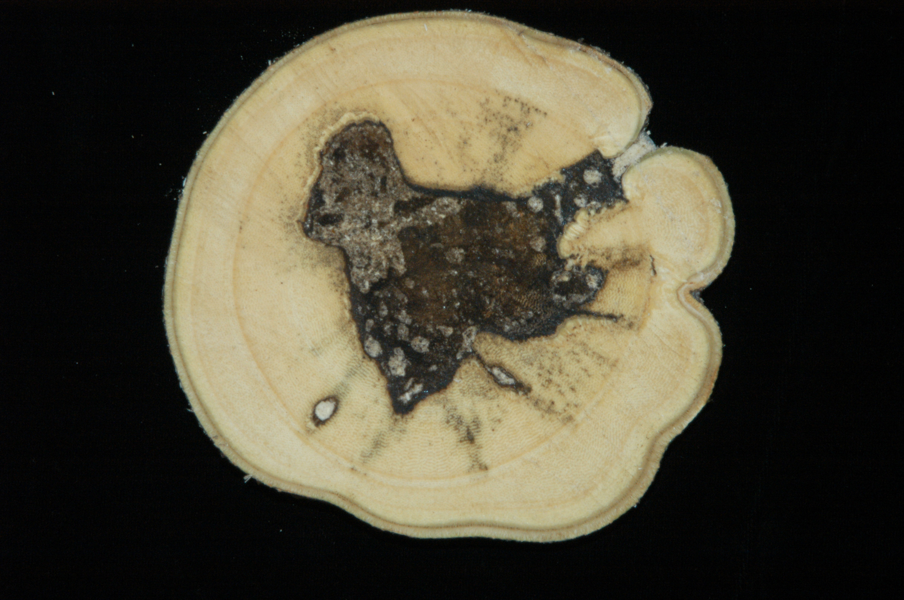
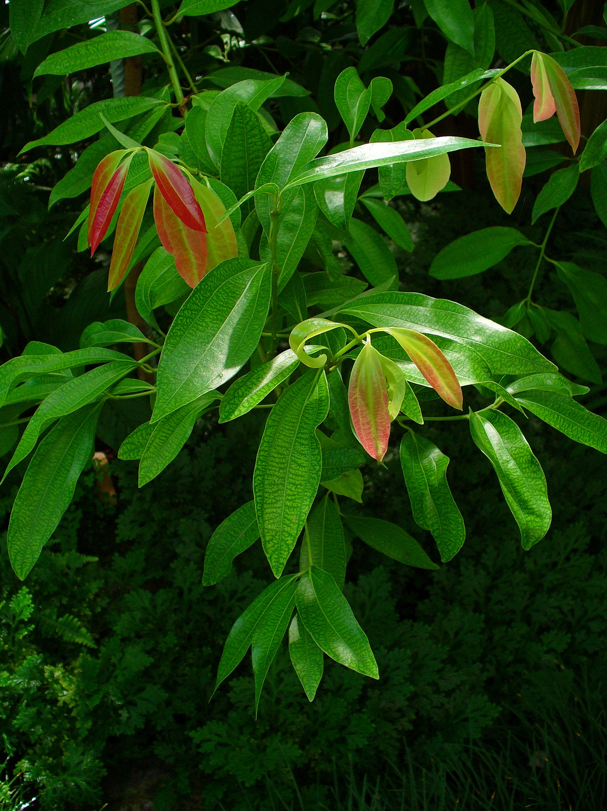
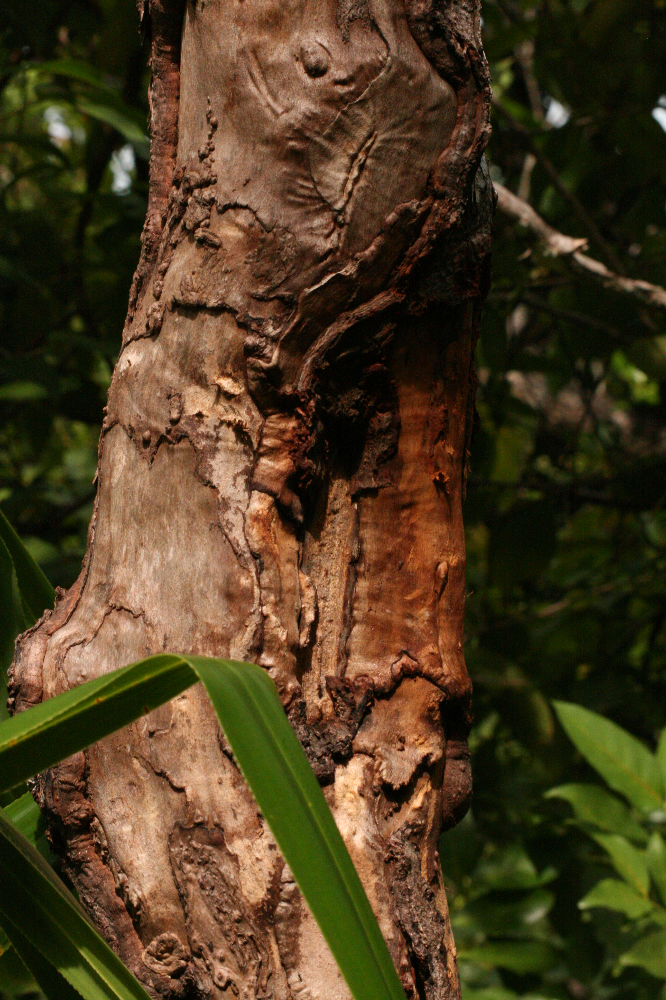
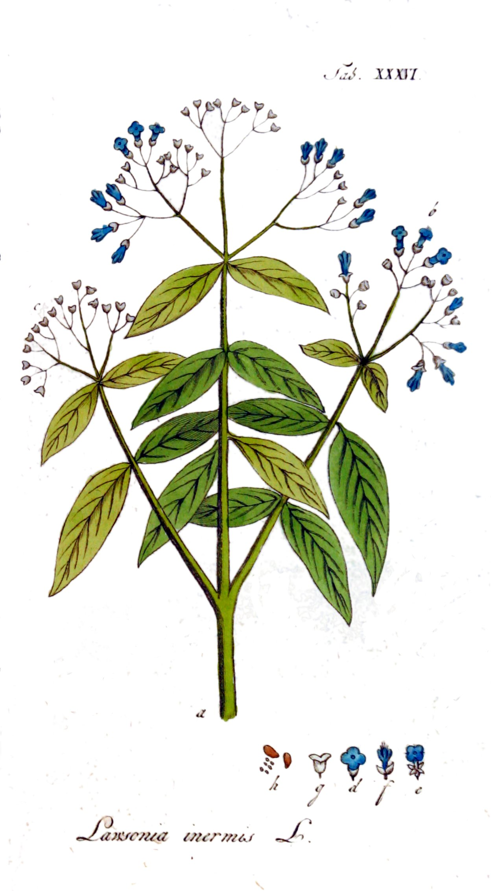
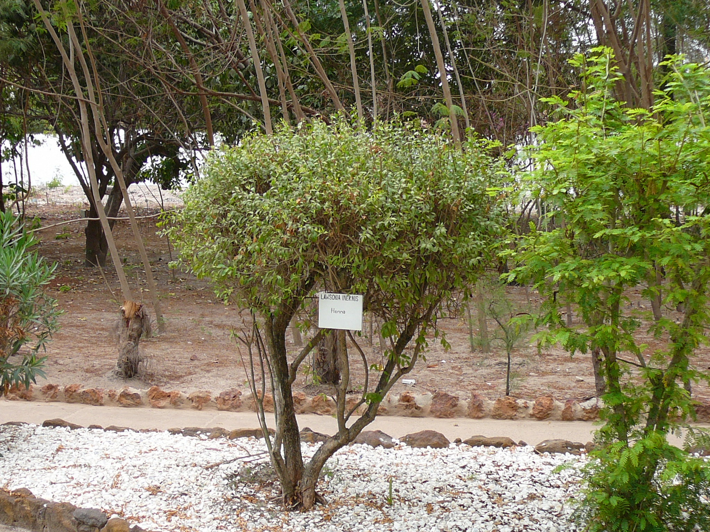
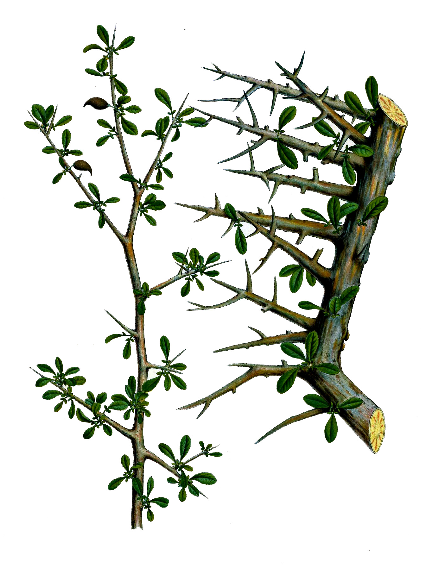
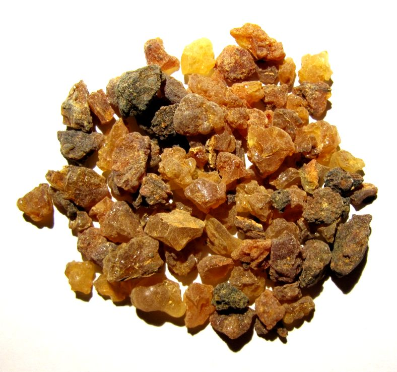
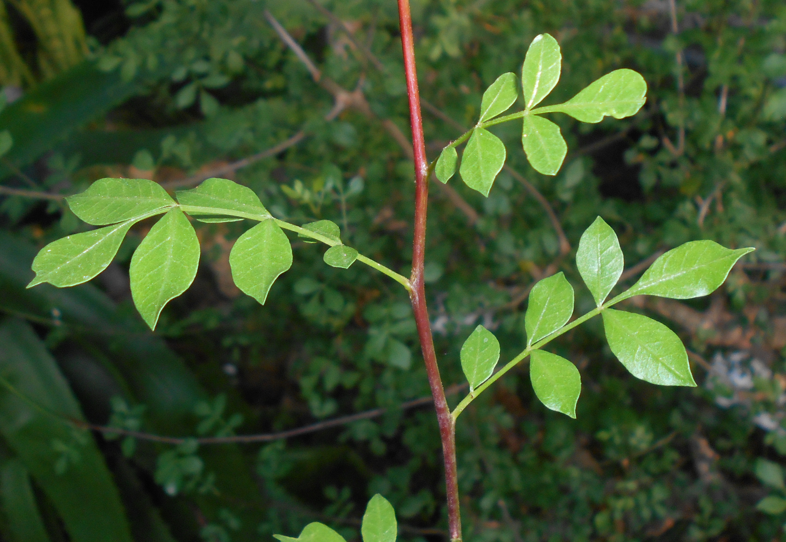

# Plants and Trees in the Bible

## License Information

Plants and Trees in the Bible © United Bible Societies, 2025. Adapted from: <cite>Each According to its Kind: Plants and Trees in the Bible</cite>, by Robert Koops © 2012 United Bible Societies. This work is licensed under Creative Commons Attribution-ShareAlike 4.0 International (<a href="https://creativecommons.org/licenses/by-sa/4.0/">https://creativecommons.org/licenses/by-sa/4.0/</a>).

--------------------------------

## 標題：製作香和香水的樹木和植物 (id: FLORA:4.1)

4\.1 標題：製作香和香水的樹木和植物
====================

## 標題：沉香樹、沉香木（鷹木、伽羅木）（agarwood [eaglewood, aloeswood, lingaloes]） (id: FLORA:4.1.1)

4\.1\.1 標題：沉香樹、沉香木（鷹木、伽羅木）（agarwood \[eaglewood, aloeswood, lingaloes]）
=======================================================================

經文出處
----

Hebrew 來： אֲהָלִים (音譯： ’ahalim)

[NUM 24:6](https://ref.ly/Num24:6), [PRO 7:17](https://ref.ly/Prov7:17)

Hebrew 來： אֲהָלוֹת (音譯： ’ahaloth)

[PSA 45:9](https://ref.ly/Ps45:9), [SNG 4:14](https://ref.ly/Song4:14)

討論
--

*站在沉香樹旁的人（不丹） (DXLINH (Wikimedia Commons))*

祖海里非常確信[PSA 45:9](https://ref.ly/Ps45:9) （《和》45:8）中的*’ahaloth* 就是沉香木或鷹木（學名*Aquillaria agallocha* ），這是一種原產於印度北部的樹木。（他曾說，沉香木也原產於東非，但這似乎是一個錯誤）。古希臘作家迪奧斯科里季斯（Dioscorides）稱其為鷹木（*agallochon* ），這是出產於印度和阿拉伯半島的樹木。安德森贊成這個觀點，解經家斯奈思（Snaith）和巴德（Budd）也都贊同。赫珀（Hepper）對此表示懷疑，因為他對印度與遠東在這段歷史時期有貿易往來的說法存有疑問，但是因為不能提出其他可能的植物，他也就附和了這種看法。這種木材的碎屑在印度稱為*agar* （赫珀，第140頁），作為燃香出售。所羅門王的遠航探險（[1KI 9:26–1KI 9:28](https://ref.ly/1Kgs9:26-1Kgs9:28) ）可能曾取道提瑪（[JOB 6:19](https://ref.ly/Job6:19) ）或底但（[ISA 21:13](https://ref.ly/Isa21:13) ）等神秘的地方，然後從印度帶回來這種珍貴的商品；提瑪和底但可能位於阿拉伯半島。

在[NUM 24:6](https://ref.ly/Num24:6) 中，希伯來文*'ahalim* 不是指沉香樹的香木條，而是指實際的樹木。這節經文的最後兩行是：「如耶和華栽種的沉香樹（*’ahalim* ），又如水邊的香柏木。」這兩句平行詩句描繪樹木正在旺盛地生長。如果沉香樹確實只在遠東才有，那麼巴蘭或《民數記》的作者如何得知它們的樣子呢？巴德和其他一些學者認為，在這節經文中，大自然的多種元素融合在一幅繁茂、美麗的奇異景象之中。Mft (Moffatt Translation (1926)) 將*’ahalim* 譯為"oaks"（「橡樹」），認為這裡描繪的是中東的樹種；莫爾登克贊同這種觀點。

在英文中，沉香樹也稱為"lignaloes"或"aloeswood"，但它與中東、馬達加斯加和非洲南部原產的蘆薈（學名*Aloe vera* ）沒有任何關係（參[4\.2\.1 蘆薈（苦蘆薈）（aloe \[bitter aloe]）](#FLORA:4.2.1) ）。

描述
--

*沉香木 (W. Saunders (Wikimedia Commons))*

鷹木或沉香樹的高度為35—40米（115—132英呎），周長4米（13英呎）。木料芳香，特別是在被某種真菌感染時，沉香樹會產生一種芳香樹脂來對抗真菌。

特殊意義
----

*男子抱著沉香原木展示含樹脂的樹心 (Photo courtesy of Robert A. Blanchette (University of Minnesota))*

《民數記》提到了沉香木，這很不尋常；除此之外，聖經別處提及沉香木時，均同時提到了沒藥，證實這種芳香物質被人用來製作香和香水。人們取材的傳統做法是：將長了很多年的沉香樹砍倒，以獲取樹木中心含樹脂的木材。現今，由於這種樹木的數量嚴重下降，泰國、不丹和其他東南亞國家的人們已經找到了促使樹齡較小的樹木產生樹脂的方法。許多世紀以來，這種樹脂一直是佛教和伊斯蘭教儀式中很重要的部分，並且也用於製作香水和入藥。古埃及的屍體防腐工匠同樣使用沉香木和其他香料。日本人在香道儀式（*koh\-do* ）中，也會使用沉香木和檀香木。

翻譯
--

由於沉香樹在東非和印度（梵文作*aghal* ）廣為人知，這些地區的翻譯者應該能夠找到當地的名稱。在阿拉伯文中，沉香木被稱為*oud* （「木頭」），歐洲的調香師也使用這個名稱，但由於其成本昂貴，所以很少見。這種樹在日文中稱為*jin\-koh* ，印尼文稱為*gaharu* 。其他地方的翻譯者需要考慮：當沒藥和沉香這兩個詞同時出現時，應當如何翻譯。如果「沒藥」採用音譯，那麼「沉香」也可以音譯。在亞洲，這種樹的名稱得自其產物（沉香）。在[PSA 45:9](https://ref.ly/Ps45:9) （《和》45:8）、[PRO 7:17](https://ref.ly/Prov7:17) 和[SNG 4:14](https://ref.ly/Song4:14) 中，需要音譯的是芳香物質的名稱（「沉香」），而不是這種樹（「沉香樹」）。有些學者認為這些經文是修辭性的，因此翻譯者可以使用當地文化中的對等詞來翻譯沒藥和沉香。對於[NUM 24:6](https://ref.ly/Num24:6) ，巴蘭對以色列人的祝福雖具修辭色彩，甚至可能是某種想象，但這是一個比較複雜的案例，因為這節經文將沉香樹與香柏木配對使用，而香柏木在非修辭性的語境中也被頻繁引用。這裡，翻譯者需要在歷史和地理上的準確性與修辭效果之間做出選擇。

* **Associated Passages:** 民數記 24:6; 箴言 7:17; 詩篇 45:9; 雅歌 4:14; 列王紀上 9:26; 列王紀上 9:28; 約伯記 6:19; 以賽亞書 21:13

## 標題：香菖蒲（calamus [sweet flag, aromatic cane, sweet cane, ginger grass]） (id: FLORA:4.1.2)

4\.1\.2 標題：香菖蒲（calamus \[sweet flag, aromatic cane, sweet cane, ginger grass]）
==============================================================================

經文出處
----

Hebrew 來： קָנֶה (音譯： qaneh)

[SNG 4:14](https://ref.ly/Song4:14), [ISA 43:24](https://ref.ly/Isa43:24), [EZK 27:19](https://ref.ly/Ezek27:19)

Hebrew 來： קְנֵה־בֹשֶׂם (音譯： qeneh bosem)

[EXO 30:23](https://ref.ly/Exod30:23)

Hebrew 來： קָנֶה הַטּוֹב (音譯： qaneh hattov)

[JER 6:20](https://ref.ly/Jer6:20)

討論
--

*香菖蒲 (CostaPPPR (Wikimedia Commons))*

希伯來文*qaneh* /*qeneh* 的意思是「莖」或「稈」，*tov* 意為「好」，*bosem* 表示「有香氣的」。關於*qaneh* 的辨識，目前有三種意見。許多植物學家認為，這個詞指的是香茅屬（學名*Cymbopogon* ）中三四種香草的任何一種，其中一種在以色列有野生。這是一種可能。另一種解釋是：這種植物是從印度引進。在印度還有其他香味的香茅屬植物，並且從古至今都有栽培，如薑草（玫瑰草；學名*Cymbopogon martinii* ）、駱駝草（學名*Cymbopogon schoenanthrus* ）和檸檬草（學名*Cymbopogon citratus* ）。其中，祖海里和莫爾登克都傾向於「薑草」的解釋，這種草也稱為「甜菖蒲」。然而，這個詞的第三種可能就是真正的菖蒲（學名*Acorus calamus* ）。這是一種外形類似蘆葦的植物，更常見的名稱是「水菖蒲」。學者對於這種植物的起源爭論非常大，可能是源於印度，然後蔓延到歐洲的沼澤地區，又稱為蒲根、莖蒲、白菖、溪蓀、蘭蓀等。埃及學家若雷（Joret）認為法老也用過這種草。植物學家伯基爾（Burkill）認為，希臘人知道如何使用水菖蒲的薑狀根，但他們將其與真正的薑草的根混淆了，結果給後人留下了這種混亂的局面（赫珀，第144頁）。

描述
--

薑草（第二種解釋）為叢生植物，高度超過1米（3英呎），並且像劍草一樣有堅硬的葉子。人們通過煮沸和蒸餾葉子來提取油脂。

 \<Image Id\="calamus\-alt"/\> 菖蒲（第三種解釋）是一種蘆葦，長著堅硬的葉子，莖上的綠色花序特別顯眼，可以長到約50厘米（20英吋）高。

特殊意義
----

[EXO 30:23](https://ref.ly/Exod30:23) 記載，*qeneh bosem* 是膏抹祭司所用聖油的成分之一。

翻譯
--

[ISA 43:24](https://ref.ly/Isa43:24) 和[JER 6:20](https://ref.ly/Jer6:20) 提到了*qaneh* ，有學者認為是修辭性的。在這兩處經文中，可以採用當地的文化對等詞，並記住*qaneh* 是與乳香一起出現的。翻譯者可能會覺得最好以同樣的方式處理這兩個詞。如果是這樣，可以用草或蘆葦的統稱加上一個意為「芳香的」詞語來翻譯*qaneh* 。亞洲的翻譯者可以使用薑草或檸檬草的當地名稱。或者，翻譯者也可以直接音譯希臘文*kalamos* ，加不加「甜」字都可以。香菖蒲／薑草的提取物是一種油，因此可以譯為「甜菖蒲油」。翻譯者可以也考慮按照某種主要語言的詞語進行音譯，例如，法文*verveine* 或*citronelle* 、葡萄牙文*erva* \-*cideira* 、西班牙文*limonaria* 或*paja**de**Meca* 或*Pasto cetron* 或*Zacate lemon* 或*palmarosa* 、中文「石菖蒲」。

* **Associated Passages:** 雅歌 4:14; 以賽亞書 43:24; 以西結書 27:19; 出埃及記 30:23; 耶利米書 6:20

## 標題：桂皮（cassia） (id: FLORA:4.1.3)

4\.1\.3 標題：桂皮（cassia）
=====================

經文出處
----

Hebrew 來： קִדָּה (音譯： qiddah)

[EXO 30:24](https://ref.ly/Exod30:24), [EZK 27:19](https://ref.ly/Ezek27:19)

Hebrew 來： קְצִיעָה (音譯： qetsi‘ah)

[PSA 45:9](https://ref.ly/Ps45:9)

討論
--

*桂皮樹下的印度女子 (J.M. Garg (Wikimedia Commons))*

與上文討論的沉香樹的情況一樣（[4\.1\.1 沉香樹、沉香木（鷹木、伽羅木）（agarwood \[eaglewood, aloeswood, lingaloes]）](#FLORA:4.1.1) ），祖海里確信，希伯來文*qiddah* 和*qetsi‘ah* 是指從肉桂樹（學名*Cinnamomum cassia* ）的葉子、嫩枝或樹皮中獲取的油或粉末。肉桂樹生長在東亞地區。「桂皮」這個名字可能來自印度東北部和孟加拉的卡西族人，他們先前生活在阿薩姆邦和緬甸等地，在古代從事桂皮貿易。因此，桂皮油可能是從東亞帶到了以色列。然而，對於[EXO 30:23](https://ref.ly/Exod30:23); [EXO 30:24](https://ref.ly/Exod30:24) 中的「桂皮」和「香肉桂」，赫珀認為這些香料可能不是人們一般認為的亞洲香料。他引用盧卡斯（Lucas）和哈里斯（Harris）對古埃及材料的研究，指出埃及墳墓中沒有這些亞洲香料的證據（赫珀，第138頁）。如果它們是由備受欺壓的以色列人帶到迦南的，那為什麼沒有被更富裕的埃及人使用呢？此外，摩西是如何在偏遠的西奈山區得到這些東西的呢？赫珀傾向於認為，香樹皮和樹脂是來源於阿拉伯半島南部和非洲東北部。請注意提瑪和底但的商隊（[JOB 6:19](https://ref.ly/Job6:19) ；[ISA 21:13](https://ref.ly/Isa21:13); [ISA 21:14](https://ref.ly/Isa21:14) ），以及示巴女王的拜訪（[1KI 10:2](https://ref.ly/1Kgs10:2) ）。

描述
--

亞洲桂皮樹可長到10米（33英呎）高，長著獨特的對生葉子，上有三條淺色葉脈或葉肋，由基部輻射出去。花朵很小，成簇下垂。

特殊意義
----

[EXO 30:24](https://ref.ly/Exod30:24) 記載，*qiddah* 是祭司膏抹所用聖油中的一種成分。在[JOB 42:14](https://ref.ly/Job42:14) 中，希伯來文*qetsi'ah* 是約伯的一個女兒的名字。

翻譯
--

桂皮與廣為人知的香料肉桂密切相關。事實上，在北美銷售的大部分「肉桂」都是桂皮。歐洲人和南美人更願意使用斯里蘭卡和其他地方的真正肉桂。由於桂皮原產於東亞，那裡的翻譯者會知道桂皮在當地的名稱，例如，印尼文*kayu manis cina* 、韓文*kaeseo* 、泰文*ob choey chin* /*thephatharo* ，以及越南文*que don* /*que quang* 。中文至少有十個名稱，包括「官桂」、「桂辛」等。在中國，人們栽培這種植物以獲取其樹皮、花蕾和油。由於提到桂皮的經文是非修辭性的，所以其他地區的翻譯者可以按照一種主要語言的詞語來音譯這個詞，例如，阿拉伯文*darsini* 或*kirfa* 或*karfa* 或*salika* 、法文*kas* 或*kanéfis* 或*kanel**de**chin* /*selon* 、西班牙文／葡萄牙文*cassia* 或*canela de la China* 。桂皮（cassia）隸於樟屬（學名*Cinnamomum* ），與非洲盛產的決明屬（學名*Cassia* ）植物完全不同。因此，按照"cassia"進行音譯在非洲可能會令人產生誤解。為了避免讀者將其與非洲決明屬植物（沒有香味）錯誤地聯繫在一起，非洲的翻譯者可以採取以下譯法：

1\. 音譯希伯來文*qiddah* ；

2\. 音譯英文（*kasiya* ），並用腳註說明這種樹與非洲的決明屬樹木沒有關係；

3\. 用一種眾所周知的馨香樹膠替代。

* **Associated Passages:** 出埃及記 30:24; 以西結書 27:19; 詩篇 45:9; 出埃及記 30:23; 約伯記 6:19; 以賽亞書 21:13; 以賽亞書 21:14; 列王紀上 10:2; 約伯記 42:14

## 標題：肉桂（cinnamon） (id: FLORA:4.1.4)

4\.1\.4 標題：肉桂（cinnamon）
=======================

經文出處
----

Hebrew 來： קִנָּמוֹן (音譯： qinnamon)

[EXO 30:23](https://ref.ly/Exod30:23), [PRO 7:17](https://ref.ly/Prov7:17), [SNG 4:14](https://ref.ly/Song4:14)

Greek 希： κιννάμωμον (音譯： kinnamōmon)

[REV 18:13](https://ref.ly/Rev18:13), [SIR 24:15](https://ref.ly/Sir24:15)

討論
--

*肉桂葉 (H. Zell (Wikimedia Commons))*

錫蘭肉桂（學名*Cinnamomum verum* 、*Cinnamomum zeylanicum* ）是一種主要生長在斯里蘭卡、印度和緬甸的樹。如果追溯字源，希伯來文*qinnamon* 可能是源自馬來文／印尼文*kayu**manis* 的早期形式，意思是「甜木」。關於肉桂的討論，存在著與桂皮類似的爭議，即舊約中提到的肉桂是從遠東進口的，還是當時就有來自阿拉伯或非洲的、稱為*qinnamon* 的香料，因為這個名稱在撰寫舊約書卷時就已經為人所知。有些學者認為，早在主前第二個千年，印度和埃及之間就有貿易往來。事實上，有人認為著名的埃及女王哈特謝普蘇特（Hatshepsut）在主前1490年就從朋特（Punt）帶回來了沒藥或乳香樹，這個地方可能位於索馬里甚至是印度。然而，她顯然沒有帶回來肉桂樹，並且在埃及陵墓發現的香料中也沒有肉桂和桂皮。因此，聖經中提到的"cinnamon"（「肉桂」）究竟是哪種植物，現今仍舊不明。

描述
--

*剝掉樹皮的肉桂樹 (Marion Schneider \& Christoph Aistleitner (Wikimedia Commons))*

真正的肉桂樹可長到10米（33英呎）高。莖幹分枝茂盛，革質葉子長10—15厘米（4—6英吋），有三條淺色的輻射狀葉脈。刮掉海綿狀的外皮後，會露出芳香的淺棕色內皮。這種內皮有肉桂味，把它切割下來並乾燥後，樹皮就會捲曲成小卷。肉桂樹的小花會發出難聞的氣味。

特殊意義
----

*真正肉桂樹的樹皮和桂皮 (Antti Vähä\-Sipilä (Wikimedia Commons))*

[EXO 30:23](https://ref.ly/Exod30:23) 記載，用於塗抹帳幕、約櫃和膏抹祭司的聖膏油中有肉桂的成分。[PRO 7:17](https://ref.ly/Prov7:17) 所述誘惑人的女子，就是用肉桂加上沒藥和沉香熏了她的床榻。今天，肉桂皮被磨成粉末作為食物的調料，也用作香和香水的成分，甚至葉子和未成熟的漿果（「芽」）也作為調味品出售。

翻譯
--

亞洲的翻譯者可以採用自己語言中表示肉桂的詞語，例如中文「肉桂」或「錫蘭肉桂」、韓文*kye* /*kyepi* 或*sillon\-gyepi* 、馬來文*kayu manis* 、尼泊爾文*dalchini* 、泰米爾文*lavanga pattai* 、泰文*ob**choey* ，以及越南文*cay que* /*nhuc que* 或*que ranh* ，甚至可以區分桂皮和肉桂。在其他地區，最好音譯希伯來文*qinnamon* 或某種主要語言（例如，英文*sinamon* 、法文*kanel* 、西班牙文／葡萄牙文*kanela* 、阿拉伯文*kirfa* 或*darini* 或*salika* ）。由於樹皮會被研磨成粉末，因此可以用「樹皮」或「粉末」來將其分類。在[EXO 30:23](https://ref.ly/Exod30:23); [EXO 30:24](https://ref.ly/Exod30:24) 中，翻譯者需要用兩個不同的詞語，來翻譯密切相關的桂皮和肉桂。

* **Associated Passages:** 出埃及記 30:23; 箴言 7:17; 雅歌 4:14; 啟示錄 18:13; 德訓篇 24:15; 出埃及記 30:24

## 標題：小茴香（白松香）（fennel [galbanum]） (id: FLORA:4.1.5)

4\.1\.5 標題：小茴香（白松香）（fennel \[galbanum]）
=======================================

經文出處
----

Hebrew 來： חֶלְבְּנָה (音譯： chelbenah)

[EXO 30:34](https://ref.ly/Exod30:34)

Greek 希： χαλβάνη (音譯： chalbanē)

[SIR 24:15](https://ref.ly/Sir24:15)

討論
--

*小茴香植株 (Franz Eugen Köhler, Köhler's Medizinal\-Pflanzen (Wikimedia Commons))*

雖然聖經中提到的白松香所指何物並不確定，但很有可能是一種樹脂，來自一種名為小茴香（學名*Ferula galbaniflua* ）的植物。這種植物生長在印度、伊朗和阿富汗，特別是在伊朗的高山上。小茴香與歐芹科有親緣關係。今天，大多數的白松香商品來自於黎巴嫩和伊朗。

描述
--

*小茴香花 (Tigerente (Wikimedia Commons))*

小茴香可以長到1\.5米（5英呎）高。小葉纖細有光澤，莖粗而光滑，傘狀花序，種子有光澤且很小。這種植物有乳狀汁液，會從節部自行分泌而出，或者在切割後從莖部滲出。汁液乾燥後，會結成芳香的淡綠色或淡黃色小珠。味苦，氣味濃郁。有一種小茴香生長在加利利（學名*Ferula communis* ），但它不產白松香脂。另一種小茴香生長在北非，名為*silphion* （可能是*Ferula tingitana* ），其圖案曾出現在迦太基出土的羅馬錢幣上。

特殊意義
----

摩西在[EXO 30:34](https://ref.ly/Exod30:34) 說，白松香（喜利比拿）是以色列人在帳幕中所燃聖香的成分之一。亞述人將白松香用作熏香。它可能就是[GEN 37:25](https://ref.ly/Gen37:25) 中提到的「香料」。羅馬作家普林尼認為，這是一種非常有效的藥物。

翻譯
--

由於小茴香並不為人所熟知，因此大多數翻譯者都需要按照某種主要語言進行音譯，比如：

1\. 音譯希伯來文詞語：*helibena* 、*elbenahi* 、*lebena* ；

2\. 通過英文音譯拉丁文詞語：*galbanum* ；

3\. 用當地的某種樹膠來替代，增加*chelbenah* 或*galbanum* 作為輔助說明，或在腳註中說明；

4\. 音譯這種植物的名稱，同時增加分類詞「樹膠」：*ferula* （法文）樹膠、*feneli* （英文）樹膠，或*hinojo* /*ferula* （西班牙文）樹膠。

* **Associated Passages:** 出埃及記 30:34; 德訓篇 24:15; 創世記 37:25

## 標題：乳香（frankincense） (id: FLORA:4.1.6)

4\.1\.6 標題：乳香（frankincense）
===========================

經文出處
----

Hebrew 來： לְבוֹנָה (音譯： levonah)

[EXO 30:34](https://ref.ly/Exod30:34), [LEV 2:1](https://ref.ly/Lev2:1), [LEV 2:2](https://ref.ly/Lev2:2), [LEV 2:15](https://ref.ly/Lev2:15), [LEV 2:16](https://ref.ly/Lev2:16), [LEV 5:11](https://ref.ly/Lev5:11), [LEV 6:8](https://ref.ly/Lev6:8), [LEV 24:7](https://ref.ly/Lev24:7), [NUM 5:15](https://ref.ly/Num5:15), [1CH 9:29](https://ref.ly/1Chr9:29), [NEH 13:5](https://ref.ly/Neh13:5), [NEH 13:9](https://ref.ly/Neh13:9), [SNG 3:6](https://ref.ly/Song3:6), [SNG 4:6](https://ref.ly/Song4:6), [SNG 4:14](https://ref.ly/Song4:14), [ISA 43:23](https://ref.ly/Isa43:23), [ISA 60:6](https://ref.ly/Isa60:6), [ISA 66:3](https://ref.ly/Isa66:3), [JER 6:20](https://ref.ly/Jer6:20), [JER 17:26](https://ref.ly/Jer17:26), [JER 41:5](https://ref.ly/Jer41:5)

Greek 希： λιβανόομαι (音譯： libanoomai（動詞）)

[3MA 5:45](https://ref.ly/3Macc5:45)

Greek 希： λίβανος (音譯： libanos)

[MAT 2:11](https://ref.ly/Matt2:11), [REV 18:13](https://ref.ly/Rev18:13), [SIR 24:15](https://ref.ly/Sir24:15), [SIR 39:14](https://ref.ly/Sir39:14), [BAR 1:10](https://ref.ly/Bar1:10), [3MA 5:10](https://ref.ly/3Macc5:10)

Greek 希： λιβανωτός (音譯： libanōtos)

[3MA 5:2](https://ref.ly/3Macc5:2)

討論
--

*乳香樹 (Eckhard Pecher (Wikimedia Commons))*

*乳香樹的枝子 (Franz Eugen Köhler, Köhler's Medizinal\-Pflanzen (Wikimedia Commons))*

乳香（學名*Boswellia sacra* ）產自乳香屬（学名*Boswellia* ）15種芳香植物中的一種，該植物所產生的黃色或淺紅色樹膠就是乳香，可能是從阿拉伯半島、非洲或亞洲輸入到以色列的。埃及的圖畫記錄顯示，哈特謝普蘇特女王曾經前往一個叫作朋特（Punt）的地方（可能位於索馬里甚至是印度），帶回來了看起來像是乳香屬的樹木，並把它們種植在她宮殿的花園裡面。赫珀認為，以色列人起初使用來自索馬里的樹膠（學名*Boswellia carteri* ），埃塞俄比亞樹膠（*Boswellia papyrifera* ）和阿拉伯樹膠（*Boswellia sacra* ），後來才得到來自印度的乳香（*Boswellia serrata* ）。有些人稱乳香為*olibanum* （這是一個中東詞語，意思是「香」），但是*olibanum* 可能僅指來自印度的*Boswellia serrata* ，這種植物具有檸檬／酸橙的氣味，真正的乳香則是柑橘的氣味。

現今，最好的乳香來自阿曼，但也門和索馬里的產量也很大。*Olibanum* 這個名稱可能來自阿拉伯文*al\-lubán* （「牛奶」），或者源自意思是「黎巴嫩油」的詞語。希伯來文*levonah* 的意思可能是「白色」或「黎巴嫩人」。

描述
--

乳香樹實際上是灌木，高達3米（10英呎），有多條樹幹從地裡冒出來，長著羽狀葉子，開綠色或白色的小花。乳香樹的樹膠會自動從樹枝上滴下來，但是也可以通過割開樹幹上的樹皮來獲取。流出的樹脂為球狀，過一段時間會變硬。

特殊意義
----

*乳香塊 (snotch (Wikimedia Commons))*

乳香是古代以色列人在帳幕中所燃聖香的成分之一。另外，律法規定的素祭也包含了乳香。

翻譯
--

翻譯者可以增加一個合適的分類詞（例如，「某某樹脂」）。如果採用音譯，建議音譯希伯來文（*labona* 、*lebonahi* ）、希臘文（*libano* ）、法文（*bosweli* 、*olibán* ），或阿拉伯文（*akor* 、*mager* 、*mogar* ），會比音譯英文（*firankinsensi* ）更加好讀。

[JER 6:20](https://ref.ly/Jer6:20) 記載，上帝說「從示巴來的乳香（*levonah* ），從遠方出的香菖蒲（*qaneh hattov* ），奉來給我有何用呢？」這個反問句中提到兩種植物製品（*levonah* 和*qaneh hattov* ），兩者都是指香。這個反問句可以轉換為肯定陳述句如下：

你從示巴帶來*levonah* 是無益的。

忘掉你從遙遠的地方帶來的*qaneh hattov* 吧。

如果採用比較自由的翻譯方式，可以將兩種植物材料視為「香」。翻譯示例如下：

你远路风尘從示巴把香帶來，但又何必呢？

何必費力從遙遠的國家帶來祭物呢？

這節經文的下半句有助於解釋上半句的含義，如果能夠使意思更加明顯，那麼將上下兩個半句交換位置也未嘗不可。

* **Associated Passages:** 出埃及記 30:34; 利未記 2:1; 利未記 2:2; 利未記 2:15; 利未記 2:16; 利未記 5:11; 利未記 6:8; 利未記 24:7; 民數記 5:15; 歷代志上 9:29; 尼希米記 13:5; 尼希米記 13:9; 雅歌 3:6; 雅歌 4:6; 雅歌 4:14; 以賽亞書 43:23; 以賽亞書 60:6; 以賽亞書 66:3; 耶利米書 6:20; 耶利米書 17:26; 耶利米書 41:5; 瑪加伯三書 5:45; 馬太福音 2:11; 啟示錄 18:13; 德訓篇 24:15; 德訓篇 39:14; 巴路克 1:10; 瑪加伯三書 5:10; 瑪加伯三書 5:2

## 標題：散沫花（henna） (id: FLORA:4.1.7)

4\.1\.7 標題：散沫花（henna）
=====================

經文出處
----

Hebrew 來： כֹּפֶר (音譯： kofer)

[SNG 1:14](https://ref.ly/Song1:14), [SNG 4:13](https://ref.ly/Song4:13)

討論
--

*散沫花植株 (Adolphus Ypey, Vervolg ob de Avbeeldingen der artseny\-gewassen met derzelver Nederduitsche en Latynsche beschryvingen, Eersde Deel, 1813, via Kurt Stueber)*

散沫花（學名*Lawsonia inermis* ）在舊約時期生長在死海周圍的綠洲中，又名埃及女貞樹，在非洲、南亞和澳大利亞北部炎熱乾燥的地區很常見。在過去和現在，散沫花的用處主要是從其乾燥的葉子中提取染料，但是在[SNG 1:14](https://ref.ly/Song1:14) 中，作者提到的卻是它的花朵。散沫花的花朵確實美麗芳香，呈「束狀」（希伯來文*’eshkol* ），可以看作一個編織物品，與第13節中沒藥的小袋子平行，或者看作一个花環，或者直接看作隱•基底泉上方梯田中的花叢。[SNG 4:13](https://ref.ly/Song4:13) 的散沫花比較特別，因為希伯來文本是以複數形式（*kefarim* ）出現；同樣以複數出現的是比散沫花更加特別的希伯來文*neradim* （源於*nerd* ；參[4\.1\.9 甘松（哪噠）（spikenard \[nard]）](#FLORA:4.1.9) ），兩種植物平行出現。這些植物的果實都不明顯，因此這節經文可以看作是揉合了香料和花朵的浪漫比喻。

描述
--

*散沫花灌木 (© Atamari (Wikimedia Commons))*

散沫花是一種灌木，高度為2—3米（7—10英呎）。葉子對生，開許多芳香的白花。葉子會分泌一種紅色汁液，許多國家的人用它來做染料，給皮膚或頭髮染色。

特殊意義
----

在[SNG 1:14](https://ref.ly/Song1:14) ，新娘將她的良人比作馨香美麗的散沫花花朵，在隱•基底泉上方梯田的葡萄園裡面或附近生長。在[SNG 4:13](https://ref.ly/Song4:13) ，新郎將他的佳偶比作花園或果園，那裡生長著各種芳香美麗的植物，其中一些來自異國。

翻譯
--

在提到散沫花的兩處經文中，上下文顯然是個比喻，因此可以用當地已知的相應植物來替代。有些地方只知道散沫花是給頭髮、皮膚或指甲染色的，此時就要用一種替代植物，或是在腳註中說明，經文關注的是這種花的芳香和美麗。在[SNG 4:13](https://ref.ly/Song4:13) 中，大多數英文譯本忽略了這個詞的複數形式，也許是認為它只是受到了前文複數「果子」的影響，因而未予重視。另外，翻譯者也可以按照某種主要語言的詞語進行音譯，例如，法文*henné* 、西班牙文*alcana* 或*alheña* 、葡萄牙文*hena* 或*alfenero* ，或者阿拉伯文*hinna* 。近來，人們又開始使用散沫花來進行皮膚裝飾（"mehndi"），這可能會使翻譯者更容易找到一個合適的對等詞。KJV (King James Version (1611)) 中的"Camphire"（「指甲花」）也許可以作為一個文化上的替代詞。

* **Associated Passages:** 雅歌 1:14; 雅歌 4:13

## 標題：沒藥（myrrh） (id: FLORA:4.1.8)

4\.1\.8 標題：沒藥（myrrh）
====================

經文出處
----

Hebrew 來： מֹר (音譯： mor)

[EST 2:12](https://ref.ly/Esth2:12), [PSA 45:9](https://ref.ly/Ps45:9), [PRO 7:17](https://ref.ly/Prov7:17), [SNG 1:13](https://ref.ly/Song1:13), [SNG 3:6](https://ref.ly/Song3:6), [SNG 4:6](https://ref.ly/Song4:6), [SNG 4:14](https://ref.ly/Song4:14), [SNG 5:1](https://ref.ly/Song5:1), [SNG 5:5](https://ref.ly/Song5:5), [SNG 5:5](https://ref.ly/Song5:5), [SNG 5:13](https://ref.ly/Song5:13)

Hebrew 來： מָר־דְּרוֹר (音譯： mor deror)

[EXO 30:23](https://ref.ly/Exod30:23), [EXO 30:23](https://ref.ly/Exod30:23)

Greek 希： μύρον (音譯： muron)

[REV 18:13](https://ref.ly/Rev18:13)

Greek 希： σμύρνα (音譯： smurna)

[MAT 2:11](https://ref.ly/Matt2:11), [JHN 19:39](https://ref.ly/John19:39), [SIR 24:15](https://ref.ly/Sir24:15)

Greek 希： σμυρνίζω (音譯： smurnizō（動詞）)

[MRK 15:23](https://ref.ly/Mark15:23)

討論
--

*沒藥灌木的枝子 (Franz Eugen Köhler, Köhler's Medizinal\-Pflanzen)*

沒藥可能是聖經中最珍貴的香料，價值超過同等重量的黃金。參與編纂本手冊的植物學家同意，希伯來文*mor* 指的是沒藥屬（學名*Commiphora* ）中一種植物的樹脂，可能是*myrrha* 、*abyssinica* 或*schimperi* 的樹脂，這些植物都生長在現在的也門、埃塞俄比亞、索馬里和馬達加斯加地區。其他種類的沒藥可能來自印度（學名*Commiphora erythraea* 、*Commiphora opobalsamum* ）。另外，有一個更困難的問題，就是[EXO 30:23](https://ref.ly/Exod30:23) 中*deror* 一詞的含義。在出現這個詞的其他經文中，其含義是「自由」。因此，有些譯本在這裡將其譯成「流質的」，但我們並不確定「自由」就是指「流質的」。沒藥有時會與葡萄酒混合使用，這個事實可能表明*deror* 在這裡的意思是「流質的」，但另一方面，沒藥是以乾量單位而不是液量單位來稱量的，這又表明它不是液體（德拉姆，第407頁）。

在[GEN 37:25](https://ref.ly/Gen37:25); [GEN 43:11](https://ref.ly/Gen43:11) 中，RSV (Revised Standard Version (1952)) 將希伯來文*lot* 譯為"myrrh"（「沒藥」），但是根據最新的學術研究結果，這個詞應該譯為"ladanum"（「勞丹脂」）（參[4\.2\.5 岩玫瑰（勞丹脂）（rock rose \[ladanum]）](#FLORA:4.2.5) ）。

在[1KI 10:25](https://ref.ly/1Kgs10:25); [2CH 9:24](https://ref.ly/2Chr9:24) 中，RSV (Revised Standard Version (1952)) 將希伯來文*nesheq* 同樣譯為"myrrh"（「沒藥」）（類似地，REB (Revised English Bible (1989)) 譯為"perfume"「香水」），但大多數其他英文譯本將這個詞譯為"weapons"（「武器」）或"armor"（「盔甲」）。

描述
--

*沒藥樹膠塊 (© GeoTrinity (Wikimedia Commons))*

沒藥是一種灌木或灌木叢，長著厚密多刺的枝子，其伸展和彎曲的角度很奇特。葉子以三片為一組，果實像李子一樣呈卵形。木材和樹皮具有馨香的氣味。枝子會自然滲出汁液，但有些採集者會切開枝條以增加樹液的收穫量。樹液或樹膠在流出時呈透明或黃棕色，但乾燥後顏色會變暗。沒藥味苦（注意，*mor* 與意為「苦」的希伯來文*mar* 相似）。在市場上，沒藥常與卡他夫沒藥灌木（*bisabol* ）的樹膠混合。

特殊意義
----

*沒藥樹葉和花蕾 (© Salicyna (Wikimedia Commons))*

上帝指示以色列人，沒藥為聖膏油的成分之一（[EXO 30:23](https://ref.ly/Exod30:23) ），在《以斯帖記》、《詩篇》、《箴言》中，沒藥用作香水，在《雅歌》中出現過8次。東方博士也將其作為貴重的禮物獻給新生王（[MAT 2:11](https://ref.ly/Matt2:11) ）。當耶穌在十字架上垂死的時候，那些同情耶穌的旁觀者可能給他摻了沒藥的葡萄酒喝（[MRK 15:23](https://ref.ly/Mark15:23) ；參[MAT 27:34](https://ref.ly/Matt27:34) 中的平行敘述）。亞利馬太的約瑟和尼哥德慕帶來了沒藥和沉香，預備埋葬耶穌（[JHN 19:39](https://ref.ly/John19:39) ）。在古埃及，太陽神的祭壇上會焚燒沒藥；而在波斯，當國王出現在公眾面前時，王冠上面會繫著沒藥；羅馬人在葬禮和火葬時也會焚燒沒藥。這些事實在部分程度上解釋了沒藥為什麼會出現在[REV 18:13](https://ref.ly/Rev18:13) 的香料清單中（《和》、《和修》譯作「香膏」）。今天，沒藥被用在香水、乳液，甚至牙膏中。

翻譯
--

非洲之角和馬達加斯加生長著多種沒藥，因此這些地區的翻譯者要找到合適的譯詞應該沒有問題。對於[EXO 30:23](https://ref.ly/Exod30:23) 所述的沒藥是液體還是固體，學者似乎沒有達成共識，所以翻譯者可以忽略希伯來文*deror* （如CEV (Contemporary English Version) 的做法）。*Mor deror* 有幾種翻譯方法，例如，「沒藥條」（"sticks of myrrh"；REB (Revised English Bible (1989)) ）、「自由流動的沒藥」（"free\-flowing myrrh"；NAB (New American Bible (1970)) ）、「凝結的沒藥」（"solidified myrrh"；NJPSV (New Jewish Publication Society Version) ）、「沒藥粉」（"powdered myrrh"；GW (God's Word Translation) 、德拉姆）、「鮮沒藥」（"fresh myrrh"；NJB (New Jerusalem Bible (1985)) ）、「液體沒藥」（"liquid myrrh"；GNB (Good News Bible) 、NIV (New International Version (1984)) 、NCV (New Century Version) ），以及「純沒藥」（"pure myrrh"；NLT (New Living Translation) 、LB (Living Bible (1971)) ）。如果採用音譯，可以音譯希伯來文*mor* 、阿拉伯文*mar* 、法文*mireh* ，或者西班牙文／葡萄牙文*mirra* 。英文或法文音譯需要稍作修改，以利於發音（例如，*mura* ），避免像一個早期的尼日利亞文譯本那樣，將不易發音的myrrh（「沒藥」）直接音譯而不加改變。

* **Associated Passages:** 以斯帖記 2:12; 詩篇 45:9; 箴言 7:17; 雅歌 1:13; 雅歌 3:6; 雅歌 4:6; 雅歌 4:14; 雅歌 5:1; 雅歌 5:5; 雅歌 5:13; 出埃及記 30:23; 啟示錄 18:13; 馬太福音 2:11; 約翰福音 19:39; 德訓篇 24:15; 馬可福音 15:23; 創世記 37:25; 創世記 43:11; 列王紀上 10:25; 歷代志下 9:24; 馬太福音 27:34

## 標題：甘松（哪噠）（spikenard [nard]） (id: FLORA:4.1.9)

4\.1\.9 標題：甘松（哪噠）（spikenard \[nard]）
====================================

經文出處
----

Hebrew 來： נֵרְדְּ (音譯： nerd)

[SNG 1:12](https://ref.ly/Song1:12), [SNG 4:13](https://ref.ly/Song4:13), [SNG 4:14](https://ref.ly/Song4:14)

Greek 希： νάρδος (音譯： nardos)

[MRK 14:3](https://ref.ly/Mark14:3), [JHN 12:3](https://ref.ly/John12:3)

討論
--

*甘松植株 (Joseph Dalton Hooker (Wikimedia Commons))*

在世界各地講英語的地方，人們使用"spikenard"（「甘松」）這個名字多過使用"nard"（「哪噠」）。甘松（哪噠）的希伯來文和希臘文詞語可用來指稱出自多種植物的多種不同物質。普林尼列出了12種。祖海里認為新約中的甘松與舊約中的甘松是同樣的東西，即來自印度的匙葉甘松（學名*Nardostachys jatamansi* ）。赫珀質疑聖經中的大多數香料源於印度的說法，他認為《雅歌》中提及的甘松可能是駱駝草（學名*Cymbopogon schoenanthus* ），這種草生長在阿拉伯和北非的沙漠中。亞述文稱之為*lardu* 。但是，如果《雅歌》是比較晚期的作品，那麼其中提到的甘松就很可能源於印度。在[MRK 14:3](https://ref.ly/Mark14:3); [JHN 12:3](https://ref.ly/John12:3) 中，RSV (Revised Standard Version (1952)) 將希臘文*nardos pistikos* 譯為"pure nard"（「純甘松」），但*pistikos* 的含義是值得商榷的。這個詞實際上可能來自梵文*picita* ，即甘松的當地名稱。在阿拉伯文中，甘松被稱為*sunbul Hindi* （「印度甘松」）。

描述
--

甘松是一種高度不到1米（3英呎）的綠葉灌木，全株具有濃郁的芳香，莖較短，每根莖的尖端有一束三片小窄葉。粉紅色的花朵為傘狀。人們將根莖（塊莖）搗碎，以提取味道辛辣的淡橙色或黃色的油。

特殊意義
----

[SNG 4:13](https://ref.ly/Song4:13); [SNG 4:14](https://ref.ly/Song4:14) 的比喻中兩次提及甘松，新娘被喻為茂盛的花園，裡面長滿了各種可愛的馨香植物和樹木。希伯來文本先是用複數形式提到甘松，與複數形式的散沫花平行，似乎是作為植物或樹木，或者是樹木所結果實的名稱。之後，甘松的單數形式又與番紅花平行，接著提到香菖蒲和肉桂等香料。甘松是古埃及、近東和羅馬的一種奢侈品。有一篇主後1100年左右的中醫文獻記載了甘松香的鎮靜效果。今天，中國人仍然用它來製作線香（*senko* ）和入藥。另外，甘松也是日本梅花節所用熏香的成分之一。[JHN 12:3](https://ref.ly/John12:3) 提到了甘松，那裡拉撒路的姐妹馬利亞用「極貴的純哪噠香膏」來膏抹耶穌。

翻譯
--

對於《雅歌》的比喻中提及的甘松，可以用當地文化中的對等詞來翻譯。《馬可福音》和《約翰福音》提到甘松當然是非修辭性的，所以應當盡量用甘松的當地名稱來翻譯；如果為了保持整體翻譯的一致性而採用音譯，建議使用"naridi"之類的音譯。

* **Associated Passages:** 雅歌 1:12; 雅歌 4:13; 雅歌 4:14; 馬可福音 14:3; 約翰福音 12:3

