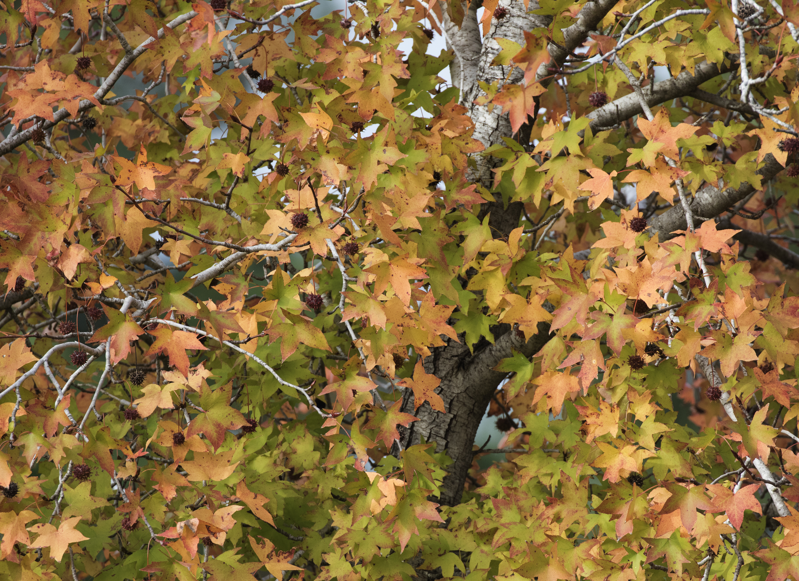
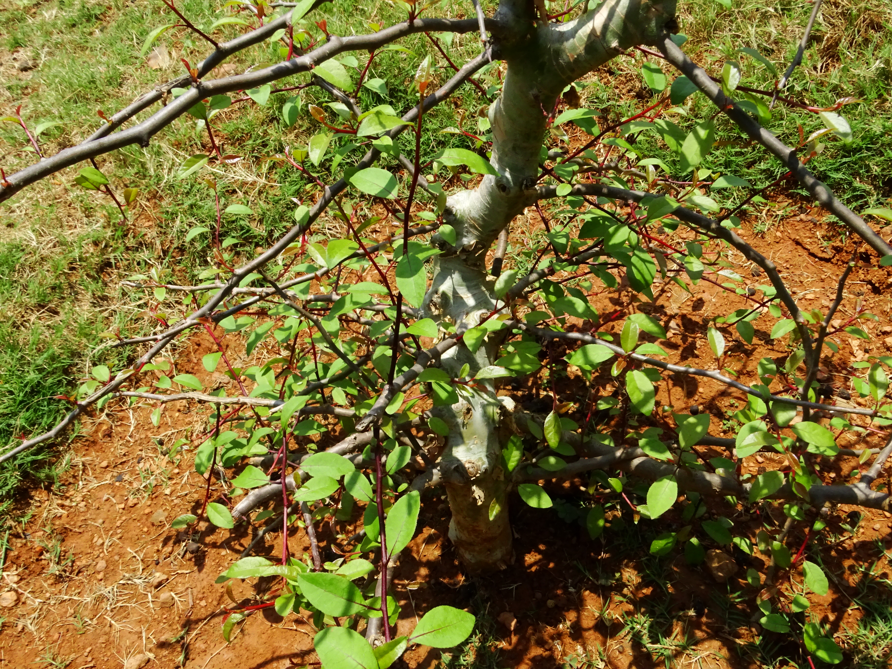

# Plants and Trees in the Bible

## License Information

Plants and Trees in the Bible © United Bible Societies, 2025. Adapted from: <cite>Each According to its Kind: Plants and Trees in the Bible</cite>, by Robert Koops © 2012 United Bible Societies. This work is licensed under Creative Commons Attribution-ShareAlike 4.0 International (<a href="https://creativecommons.org/licenses/by-sa/4.0/">https://creativecommons.org/licenses/by-sa/4.0/</a>).

--------------------------------

## 標題：藥膏和香膏（藥用植物） (id: FLORA:4.2)

4\.2 標題：藥膏和香膏（藥用植物）
===================

如前所述，許多用來製作香和香水的芳香植物也被認為具有治病的效果。下面列出的植物主要用於治療：蘆薈、蓖麻子、蘇合香、麥加香脂、岩玫瑰、番紅花和黃蓍膠。

為了有一個正確的開始，我們必須先處理各詞語的定義。正如本章介紹中所說，"balm"（「香膏」）一詞可能令人困惑。因為一般來說，它是指任何用來治療傷處或減輕疼痛的油性或樹脂狀物質。但也可以用來指阿拉伯半島出產的某種植物，以及從中取得的樹脂。本手冊兼取這兩種意思。請注意上面的標題，以及[4\.2\.3 蘇合香（東方楓香）（liquidambar \[Oriental sweetgum, storax]）](#FLORA:4.2.3) 和[4\.2\.4 麥加香脂（香脂、香膏）（opobalsamum \[balsam, balm]）](#FLORA:4.2.4) 對「香膏」的討論。

## 標題：蘆薈（苦蘆薈）（aloe [bitter aloe]） (id: FLORA:4.2.1)

4\.2\.1 標題：蘆薈（苦蘆薈）（aloe \[bitter aloe]）
=======================================

經文出處
----

Greek 希： ἀλόη (音譯： aloē)

[JHN 19:39](https://ref.ly/John19:39)

討論
--

*蘆薈 (© Thamizhpparithi Maari (Wikimedia Commons))*

翻譯者必須區別新約提到的沉香與某些譯本在舊約中所稱的沉香。在[NUM 24:6](https://ref.ly/Num24:6) 、[PSA 45:9](https://ref.ly/Ps45:9) （《和》45:8）和其他幾處經文中，沉香指的是印度北部生長的沉香樹的芳香木片（參[4\.1\.1 沉香樹、沉香木（鷹木、伽羅木）（agarwood \[eaglewood, aloeswood, lingaloes]）](#FLORA:4.1.1) ）。然而，新約中提到的沉香則是蘆薈（學名*Aloe vera* ）。這種蘆薈原產於非洲南部、阿拉伯半島和馬達加斯加。蘆薈葉中的凝膠狀物質用作藥物已有數百年之久，特別是用來治療皮膚的燒傷和擦傷，另外也用作瀉藥，今天還用來製作護膚霜、肥皂、洗髮水等，（在亞洲）甚至作為飲料，或加在茶裡面。

描述
--

蘆薈的葉子較硬，就像從植株中心長出的肥厚刀片，邊緣多刺，基本上為純綠色，有些品種帶有斑點。大多數蘆薈沒有可見的莖，但有些品種確實有莖。蘆薈可以長到1米（3英呎）以上。在花梗上綻開一簇簇紅色或黃色的管狀小花。

特殊意義
----

[JHN 19:39](https://ref.ly/John19:39) 記載，尼哥德慕帶來蘆薈和沒藥來塗抹耶穌的身體。

翻譯
--

蘆薈原產於非洲南部、馬達加斯加和阿拉伯半島，現在則遍佈世界各地的熱帶國家。這些地區的翻譯者應該可以找到該植物的當地名稱。[JHN 19:39](https://ref.ly/John19:39) 在一個非修辭語境中提到蘆薈，因此建議採用某種主要語言的音譯，但這也取決於同時出現的沒藥一詞的譯法。翻譯者可以按照拉丁文*alovera* 、法文*alowes* 或西班牙文*asibar* 進行音譯。

* **Associated Passages:** 約翰福音 19:39; 民數記 24:6; 詩篇 45:9

* **Associated ACAI Concepts:** Aloes (ID: `flora:Aloes`); Aloes (ID: `realia:Aloes`)

## 標題：蓖麻（castor oil plant [castor bean plant]） (id: FLORA:4.2.2)

4\.2\.2 標題：蓖麻（castor oil plant \[castor bean plant]）
====================================================

經文出處
----

Hebrew 來： קִיקָיוֹן (音譯： qiqayon)

[JON 4:6](https://ref.ly/Jonah4:6), [JON 4:6](https://ref.ly/Jonah4:6), [JON 4:7](https://ref.ly/Jonah4:7), [JON 4:9](https://ref.ly/Jonah4:9), [JON 4:10](https://ref.ly/Jonah4:10)

討論
--

*蓖麻葉 (© I, MJJR (Wikimedia Commons))*

從耶柔米和奧古斯丁時期以來，關於《約拿書》中的*qiqayon* 是什麼植物就一直存在爭議。祖海里、赫珀和莫爾登克都認為*qiqayon* 是指蓖麻（學名*Ricinus communis* ），並且NJB (New Jerusalem Bible (1985)) 、FFB 、多本註釋書和一些聖經百科全書都是照此而譯。然而，KJV (King James Version (1611)) 中"gourd"（「葫蘆」）的譯法也有著悠久的歷史，包括《七十士譯本》（希臘文*kolocuntha* ；參[5\.2\.6 野瓜（柯羅辛、苦西瓜、藥西瓜）（wild gourd \[colocynth, egusi, bitter apple]）](#FLORA:5.2.6) ）、REB (Revised English Bible (1989)) 、NAB (New American Bible (1970)) 、Mft (Moffatt Translation (1926)) 和AT (American Translation (Goodspeed, 1935)) 都依循此例。《拉丁文武加大譯本》將*qiqayon* 譯為*hedera* （「常春藤」；參[1\.10 常春藤 (ivy)](#FLORA:1.10) ），並且為《諾克斯譯本》採用，但這種譯法沒有植物學上的支持。1985年，羅賓遜（Robinson）對耶柔米以來的文獻進行了深入的研究，並勉強接受它是葫蘆（colocynth，苦西瓜）。有些學者甚至提出，這可能是故事中插入的亞述文詞語，只是為了使故事聽起來具有異國風情，甚或這只是一個虛構的詞。

描述
--

*蓖麻種柄 (© Parvathisri (Wikimedia Commons))*

蓖麻可以長到3米（10英呎）高，深綠色扇形葉子的寬度可以達到半米。莖上長有一串串帶刺的圓形種子。

特殊意義
----

古人將蓖麻子的油作為藥用，通常是用作瀉藥。在《約拿書》中，這種植物是上帝和他固執的先知之間激烈對抗的關鍵元素。

翻譯
--

許多翻譯者會在這裡選擇一個通稱，以避免在「葫蘆」和「蓖麻」之間做出選擇，例如譯成「藤本植物」（"vine"；CEV (Contemporary English Version) 、NIV (New International Version (1984)) ）或「植物」（"plant"；RSV (Revised Standard Version (1952)) 、GNB (Good News Bible) ）。NJPSV (New Jewish Publication Society Version) 譯成拉丁文的「蓖麻子」。由於蓖麻最初是非洲植物，因此那裡的大多數翻譯者都會知道這種植物。有些翻譯者可能更喜歡按照一種主要語言來音譯這個詞（例如，阿拉伯文*karwa* 、法文*ricin* 、葡萄牙文*ricino* 或*bofarera* 或*karapatero* 、西班牙文*catapucia* 或*higuera* 或*higuerillo* ），或者使用一個描述性短語，如「枝葉茂盛的灌木」。

* **Associated Passages:** 約拿書 4:6; 約拿書 4:7; 約拿書 4:9; 約拿書 4:10

* **Associated ACAI Concepts:** Castor Oil (ID: `flora:CastorOil`)

## 標題：蘇合香（東方楓香）（liquidambar [Oriental sweetgum, storax]） (id: FLORA:4.2.3)

4\.2\.3 標題：蘇合香（東方楓香）（liquidambar \[Oriental sweetgum, storax]）
==============================================================

經文出處
----

Hebrew 來： צֳרִי (音譯： tsori)

[GEN 37:25](https://ref.ly/Gen37:25), [GEN 43:11](https://ref.ly/Gen43:11), [JER 8:22](https://ref.ly/Jer8:22), [JER 46:11](https://ref.ly/Jer46:11), [JER 51:8](https://ref.ly/Jer51:8), [EZK 27:17](https://ref.ly/Ezek27:17)

Hebrew 來： נָטָף (音譯： nataf)

[EXO 30:34](https://ref.ly/Exod30:34)

Greek 希： στακτή (音譯： staktē)

[SIR 24:15](https://ref.ly/Sir24:15)

討論
--

*蘇合香樹 (Franz Eugen Köhler, Köhler's Medizinal\-Pflanzen)*

希伯來文*tsori* （「香膏」）可能是"storax"（「蘇合香」）這個詞的來源，祖海里認為蘇合香是乾了的蘇合香樹（學名*Liquidambar orientalis* ）的樹脂，這種樹在希伯來文中也被稱為*kataf* 或*nataf* 。FFB 和《安克聖經大詞典》（ABD (Anchor Bible Dictionary) ）主張，*tsori* 是生長在巴勒斯坦和埃及的鹵刺樹（學名*Balanites aegyptiaca* ），但這種見解存在一個問題：如果埃及本地就有大量這類樹脂，為什麼以實瑪利人（或米甸人）的商人還會把它帶到埃及去呢？因此，這個詞更有可能是一個統稱，涵蓋所有藥用香料。

在聖經中，希伯來文*nataf* 只在[EXO 30:34](https://ref.ly/Exod30:34) 出現過一次。《七十士譯本》將這個詞譯為*staktē* ，RSV (Revised Standard Version (1952)) 音譯為"stacte"。祖海里認為，*nataf* 是*tsori* （\= storax）的同義詞，該詞在聖經中出現過6次。赫珀勉強承認這是可能的，但指出*nataf* 也有可能是麥加香脂（參[4\.2\.4 麥加香脂（香脂、香膏）（opobalsamum \[balsam, balm]）](#FLORA:4.2.4) ），就是祖海里稱之為「香膏」的物質。蘇合香樹（或storax）過去在中東和土耳其廣泛生長，與生長在溪邊的安息香樹（styrax）非常不同（參[1\.22 安息香樹 (styrax)](#FLORA:1.22) ）。

描述
--

*蘇合香樹葉和果實 (© Zeynel Cebeci (Wikimedia Commons))*

蘇合香樹可長到10米（33英呎）高，葉柄長約4厘米（2英吋），上面長有深裂葉和圓形黃花，葉子有5個尖，果實帶刺。切割樹幹時會流出有黏性的灰棕色樹膠。

特殊意義
----

*乾燥的蘇合香果實 (© Zeynel Cebeci (Wikimedia Commons))*

《耶利米書》和《以西結書》提到這種植物的經文表明*tsori* 具有治療效果。我們從[EXO 30:34](https://ref.ly/Exod30:34) 得知，它會散發出芳香。[GEN 37:25](https://ref.ly/Gen37:25) 表明它在埃及人的貿易中很受重視。

翻譯
--

化石證據表明，楓香樹屬（學名*Liquidambar* ）的植物在數千年前就已在世界各地廣泛生長，但在冰川來到歐洲後，那裡的該屬樹木就消失了。除了中東的蘇合香（學名*Liquidambar orientalis* ）之外，存留的物種只剩華南和台灣的楓香樹（學名*Liquidambar formosana* ），以及美國東部和中美洲的北美楓香樹（學名*Liquidambar styraciflua* ）。

《創世記》和《以西結書》提及*tsori* 的語境並不帶修辭色彩，《出埃及記》中的*nataf* 也是如此。如果祖海里的推斷正確，並且翻譯者想要明確表達，那麼在這些經文中可以使用"storax"（「蘇合香」）的音譯。另外，翻譯者也可以在[EXO 30:34](https://ref.ly/Exod30:34) 中採用一般性的表達，例如「樹脂」（"resin"；NCV (New Century Version) ）或「樹膠脂」（"gum resin"；NIV (New International Version (1984)) 、REB (Revised English Bible (1989)) ）；也就是說，可以使用當地表示這種樹木所產凝固樹脂的詞語。

如果有「芳香的藥膏」這類詞語，翻譯者可以用它來表示《創世記》中的*tsori* 。*Tsori* 是[GEN 37:25](https://ref.ly/Gen37:25) 中以實瑪利商人攜帶的三種香料中的第二種，另外兩種是*neko’th* （「香料」）和*lot* （「沒藥」）。翻譯者可以用「不同種類的芳香藥物和香」等短語來涵蓋這三個單詞。也可以按照希伯來文*tsori* 或阿拉伯文*nakaa* /*nakati* 進行音譯。另外，不宜按照英文的"balm"（「香膏」）進行音譯。

* **Associated Passages:** 創世記 37:25; 創世記 43:11; 耶利米書 8:22; 耶利米書 46:11; 耶利米書 51:8; 以西結書 27:17; 出埃及記 30:34; 德訓篇 24:15

* **Associated ACAI Concepts:** Liquidambar (ID: `flora:Liquidambar`)

## 標題：麥加香脂（香脂、香膏）（opobalsamum [balsam, balm]） (id: FLORA:4.2.4)

4\.2\.4 標題：麥加香脂（香脂、香膏）（opobalsamum \[balsam, balm]）
===================================================

經文出處
----

Hebrew 來： בֹּשֶׂם (音譯： bosem)

[EXO 25:6](https://ref.ly/Exod25:6), [EXO 30:23](https://ref.ly/Exod30:23), [EXO 30:23](https://ref.ly/Exod30:23), [EXO 30:23](https://ref.ly/Exod30:23), [EXO 35:8](https://ref.ly/Exod35:8), [EXO 35:28](https://ref.ly/Exod35:28), [1KI 10:2](https://ref.ly/1Kgs10:2), [1KI 10:10](https://ref.ly/1Kgs10:10), [1KI 10:10](https://ref.ly/1Kgs10:10), [1KI 10:25](https://ref.ly/1Kgs10:25), [2KI 20:13](https://ref.ly/2Kgs20:13), [1CH 9:29](https://ref.ly/1Chr9:29), [1CH 9:30](https://ref.ly/1Chr9:30), [2CH 9:1](https://ref.ly/2Chr9:1), [2CH 9:9](https://ref.ly/2Chr9:9), [2CH 9:9](https://ref.ly/2Chr9:9), [2CH 9:24](https://ref.ly/2Chr9:24), [2CH 16:14](https://ref.ly/2Chr16:14), [2CH 32:27](https://ref.ly/2Chr32:27), [EST 2:12](https://ref.ly/Esth2:12), [SNG 4:10](https://ref.ly/Song4:10), [SNG 4:14](https://ref.ly/Song4:14), [SNG 4:16](https://ref.ly/Song4:16), [SNG 5:1](https://ref.ly/Song5:1), [SNG 5:13](https://ref.ly/Song5:13), [SNG 6:2](https://ref.ly/Song6:2), [SNG 8:14](https://ref.ly/Song8:14), [ISA 3:24](https://ref.ly/Isa3:24), [ISA 39:2](https://ref.ly/Isa39:2), [EZK 27:22](https://ref.ly/Ezek27:22)

討論
--

*香脂樹 (© Forestowlet (Wikimedia Commons))*

希伯來文*bosem* 在英文譯本中通常譯為"balm"（「香膏」；源自balsam「香脂」），可指任何類型的芳香治療物質，但也特指某種樹木的產物，即香脂樹或麥加香脂樹（學名*Commiphora gileadensis* ）。阿拉伯人稱其為*balasam* 或*balasham* 。在《他勒目》中，這種樹被稱為*afarsimon* 。另外，在隱•基底附近的考古發掘發現了一座古老的香脂油加工廠。

莫爾登克認為，[SNG 5:1](https://ref.ly/Song5:1) 中的*bosem* （譯為「香料」）是指黄蓍膠（參[4\.2\.7 黄蓍（黄蓍膠）（tragacanth \[gum tragacanth]）](#FLORA:4.2.7) ）。本手冊則認同祖海里和赫珀的觀點，認為*bosem* 與麥加香脂有關。

描述
--

麥加香脂樹性喜沙漠或半沙漠氣候，可長到2—3米（7—10英呎）高，葉子小而皺，以3片為一組，花為白色，結有豌豆大小的紅色漿果，裡面有一粒芳香的黃色種子。幼嫩樹枝的樹皮為灰色，長成後變成棕色。樹幹和樹枝會自動滲出綠色樹脂液滴，但是採脂者也可以切開樹枝來加快樹脂採集的過程。液滴會由綠色變為棕色，聚在一處落到地上，然後被人收集起來。

特殊意義
----

在聖經時期，香脂油是聖膏油、藥物和香水的成分之一。

翻譯
--

儘管一些地方有香脂樹的特定名稱，如阿拉伯半島西南部和索馬里等地，但也可以使用一般性的詞語或短語來翻譯*bosem* 。世界各地的乾旱地區至少分佈有上百種沒藥屬（學名*Commiphora* ）植物。有些地區的翻譯者會認識這些植物，還有一些翻譯者可能只知道香料市場上銷售的乾沒藥樹脂。

* **Associated Passages:** 出埃及記 25:6; 出埃及記 30:23; 出埃及記 35:8; 出埃及記 35:28; 列王紀上 10:2; 列王紀上 10:10; 列王紀上 10:25; 列王紀下 20:13; 歷代志上 9:29; 歷代志上 9:30; 歷代志下 9:1; 歷代志下 9:9; 歷代志下 9:24; 歷代志下 16:14; 歷代志下 32:27; 以斯帖記 2:12; 雅歌 4:10; 雅歌 4:14; 雅歌 4:16; 雅歌 5:1; 雅歌 5:13; 雅歌 6:2; 雅歌 8:14; 以賽亞書 3:24; 以賽亞書 39:2; 以西結書 27:22

* **Associated ACAI Concepts:** Balsam Tree (ID: `flora:BalsamTree`)

## 標題：岩玫瑰（勞丹脂）（rock rose [ladanum]） (id: FLORA:4.2.5)

4\.2\.5 標題：岩玫瑰（勞丹脂）（rock rose \[ladanum]）
=========================================

經文出處
----

Hebrew 來： לֹט (音譯： lot)

[GEN 37:25](https://ref.ly/Gen37:25), [GEN 43:11](https://ref.ly/Gen43:11)

討論
--

*岩玫瑰 (© Ray Pritz (UBS)*

在《創世記》中，希伯來文*lot* 被一些譯本錯譯為「沒藥」（"myrrh"；RSV (Revised Standard Version (1952)) 等）。這個詞應該譯成「勞丹脂」（"ladanum"）。勞丹脂是一種黏稠的汁液，來自一種名叫岩薔薇或土耳其岩玫瑰（學名*Cistus laurifolius* ）的低矮灌木，這種植物的毛葉會滲出汁液，變硬後以香料塊的形式出售，經研磨製成治療咳嗽、黏膜炎和痢疾的藥物。赫珀說它也用來製作香水。

在北非，勞丹脂被稱為*latai* （比較亞述文*ladanu* ）。希伯來文*lot* 的亞蘭文譯詞是*letem* ，類似於後聖經時期的希伯來文名稱*lotem* 。

描述
--

岩玫瑰灌木可長到約70厘米（28英吋）高，有多毛的葉子和較大的粉紅色花朵。

特殊意義
----

近東人用小耙子收集岩玫瑰葉子上出現的汁液，小耙子上面是柔軟的皮革條，而非金屬齒。在塞浦路斯島上，當地農民收集岩玫瑰膠的方式，是將岩玫瑰膠從覓食後的山羊的鬍鬚上梳理下來。今天，這種膠主要用來製香。

翻譯
--

經文提到岩玫瑰都是非比喻性的用法，因此翻譯者通常採用一般性的表達方式（例如，Mft (Moffatt Translation (1926)) 譯成"fragrant gum"，「芳香的膠」），或者採用音譯（例如，AT (American Translation (Goodspeed, 1935)) 譯成"laudanum"）。另外，也可以按照希伯來文*lot* 或阿拉伯文*ladan* 進行音譯。

[EXO 30:34](https://ref.ly/Exod30:34) ：大多數解經家也許受到《七十士譯本》的影響，認為希伯來文*shecheleth* （「施喜列」，希臘文譯作"onycha"）指的是"onyx"（「瑪瑙」）；然而瑪瑙是一種石頭，而非植物。祖海里對這個詞沒有進行論述。鑒於上下文（聖香成分清單），FFB 和赫珀都認為這可能是一種分泌樹脂的植物，可能是岩薔薇屬（學名*Cistus* ），如勞丹脂。莫爾登克認為，施喜列可能指兩種物質，一是某種樹脂，另一種是地中海某種軟體動物的殼所產出的物質。以下證據支持該詞是指樹脂：聖經的阿拉伯文譯本作*ladana* ，暗示這種物質是勞丹脂。鑒於*shecheleth* 具體是什麼物質並不確定，翻譯者可以簡單地按照某種主要語言進行音譯，如英文（*onika* 、*oniki* ）。對於那些想要具體表達含義的翻譯者，可以考慮「軟體動物香」（"mollusk scent"；德拉姆）或「芳香貝殼」（"aromatic shell"；REB (Revised English Bible (1989)) ）等詞語。

* **Associated Passages:** 創世記 37:25; 創世記 43:11; 出埃及記 30:34

* **Associated ACAI Concepts:** Rock Rose (ID: `flora:Ladanum`)

## 標題：番紅花（saffron crocus） (id: FLORA:4.2.6)

4\.2\.6 標題：番紅花（saffron crocus）
==============================

經文出處
----

Hebrew 來： כַּרְכֹּם (音譯： karkom)

[SNG 4:14](https://ref.ly/Song4:14)

討論
--

*番紅花 (© Dixi (Wikimedia Commons))*

參與編纂本手冊的植物學家同意，希伯來文*karkom* 就是番紅花（學名*Crocus sativus* ）。但也有一些人認為，依據其阿拉伯文名稱*kurkum* 或*kurkam* ，這是指印度植物薑黃（學名*Curcuma longa* ）。然而，莫爾登克認為，阿拉伯文*kurkum* 指的是植物，它的產物名叫*saferan* ，並衍生出英文單詞"saffron"（「番紅花」；比較阿拉伯文*asfar* ，意為「黃色」）。現今，番紅花作為食品添加劑和染料而廣為人知，但在聖經時期，它也曾用作香水和藥物。這種物質來自番紅花的紅紫色花朵，在聖經時期遍佈整個小亞細亞。從那時起，番紅花在歐洲、英國和美國被廣泛種植。英文單詞"crocus"（「番紅花」）源自希臘文*krokos* ，而這個希臘文詞語則源自希伯來文*karkom* 。

根據考古學的相關記錄，番紅花在主前7世紀的亞述，以及後來的克里特島（青銅器時代）都有種植。在現今屬於伊拉克的地區，發現一些距今四千年的圖畫中有以番紅花為基底的油墨。蘇美爾人將番紅花用於藥物和魔法藥水，並與其他王國進行番紅花的交易。與克里特人進行的國際貿易在主前第二個千年達到頂峰。由於波斯人和／或蒙古人的東征西討，番紅花在整個亞洲傳播開來，得到廣泛的使用。今天，印度的佛教僧侶穿著番紅花色長袍。中東的商人販賣乾的紅花（學名*Carthamus tinctorius* ），稱之為*saferan* ，但真正的番紅花香料只來自番紅花植物的花。假番紅花在西班牙文中合宜地稱為*alazor bastardo* ，在法文中稱為*safran batard* （西班牙文的"bastardo"和法文的"batard"均有「雜種、雜交」的意思）。

描述
--

番紅花植株長著較長的、錐形的草狀葉子，從地下的洋蔥狀球莖中長出，高度不到13厘米（5英吋），開漂亮的紅色或紫色花朵。

特殊意義
----

在聖經時期，番紅花用來製作香水和入藥，但今天主要是作布料和食品的著色劑。番紅花價格昂貴的一個原因是，大約要用600朵花才能產出幾滴番紅花油。

翻譯
--

自聖經時期以來，番紅花主要生長在地中海地區的盆地，但在印度、大洋洲和北非也有很多，因此在這些地方，翻譯者可以很容易找到當地的名稱。在其他地區，建議採用某種主要語言的音譯，例如阿拉伯文*asfar* 或*zafaran* 或*kruku* 或*kurkum* 、法文*safran* 、葡萄牙文*asafrao* ，或者西班牙文*azafran* 。

* **Associated Passages:** 雅歌 4:14

* **Associated ACAI Concepts:** Saffron Plant (ID: `flora:SaffronPlant`)

## 標題：黄蓍（黄蓍膠）（tragacanth [gum tragacanth]） (id: FLORA:4.2.7)

4\.2\.7 標題：黄蓍（黄蓍膠）（tragacanth \[gum tragacanth]）
================================================

經文出處
----

Hebrew 來： נְכֹאת (音譯： neko’th)

[GEN 37:25](https://ref.ly/Gen37:25), [GEN 43:11](https://ref.ly/Gen43:11)

討論
--

*黃蓍 (© Gideon Pisanty (Wikimedia Commons))*

希伯來文*neko’th* （「樹膠」）是[GEN 37:25](https://ref.ly/Gen37:25) 中提到的三種香料中的第一種，由以實瑪利人連同*tsori* （「香膏」）和*lot* （被誤譯為「沒藥」）一起帶到埃及。[GEN 43:11](https://ref.ly/Gen43:11) 記載，雅各吩咐他的兒子們帶一些*neko’th* 送給埃及法老。它是製香的重要成分，也可入藥。希伯來文*neko’th* 指的是黃蓍。在黃蓍屬（學名*Astragalus* ）的1,800種黃蓍（常稱為「紫雲英」）中，大多數都會產生黃蓍膠，但是生長在猶大和基列的黃蓍（學名*Astragalus gummifer* 、*Astragalus bethlehemiticus* ）的產膠量極高。

描述
--

黃蓍灌木可長到大約50厘米（20英吋）高，從基部開始就密集分枝。一些生長在高海拔或貧瘠土壤中的黃蓍緊貼著地面，看起來像是帶著銳刺的海葵或針墊。花從葉子與莖的連接處長出，落花後結出毛茸茸的小果實，隨風傳播。

特殊意義
----

黃蓍灌木的樹液儲存在根部，在乾燥季節為植物提供水分。收集樹液的人將其根部露出來，切開一個口子，並放置一個杯子來接住從根部滲出的樹液。他們通常會以這種方式，同時從許多株黃蓍灌木中獲取樹液。割取樹液的工作通常在6月開始。現今，黃蓍仍然用來製作熏香和藥品，另外也用於製作皮革、烘焙，甚至用在雪茄生產中。

翻譯
--

REB (Revised English Bible (1989)) 和NJB (New Jerusalem Bible (1985)) 將*neko’th* 譯為"gum tragacanth"（「黄蓍膠」），GNB (Good News Bible) 、NIV (New International Version (1984)) 、NLT (New Living Translation) 和NCV (New Century Version) 將這個詞譯為"spices"（「香料」）。GW (God's Word Translation) 把[GEN 37:25](https://ref.ly/Gen37:25) 中的三種物質巧妙地譯成"materials for cosmetics, medicine, and embalming"（「化妝品、藥物和防腐所用物質」）。這種植物的阿拉伯文是*nakaa* 或*nakaath* 。

《創世記》提及這些物質的語境都不是修辭性的，因此翻譯者可以選擇一般性的短語來涵蓋清單中的所有名稱。另外，也可以將*neko’th* 譯成「塗抹用的藥膏」，或者根據某種主要語言進行音譯。有一種基於英文的音譯是"tiragacanti"，但這個詞有些冗長。如果目標語言中有表示乾樹液（樹膠）的詞語，可以單獨使用該詞，或者與音譯結合使用。在有些地方，音譯阿拉伯文*nakaa* 一詞是很便利的譯法。

* **Associated Passages:** 創世記 37:25; 創世記 43:11

* **Associated ACAI Concepts:** Gum Tragacanth (ID: `flora:GumTragacanth`)
