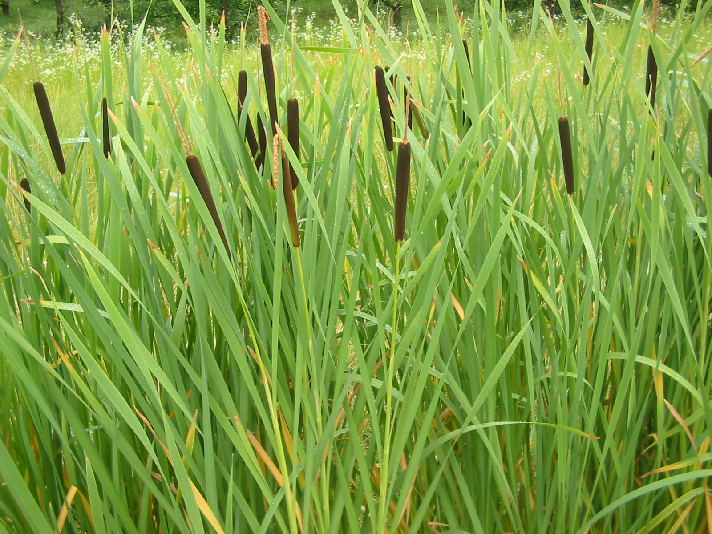
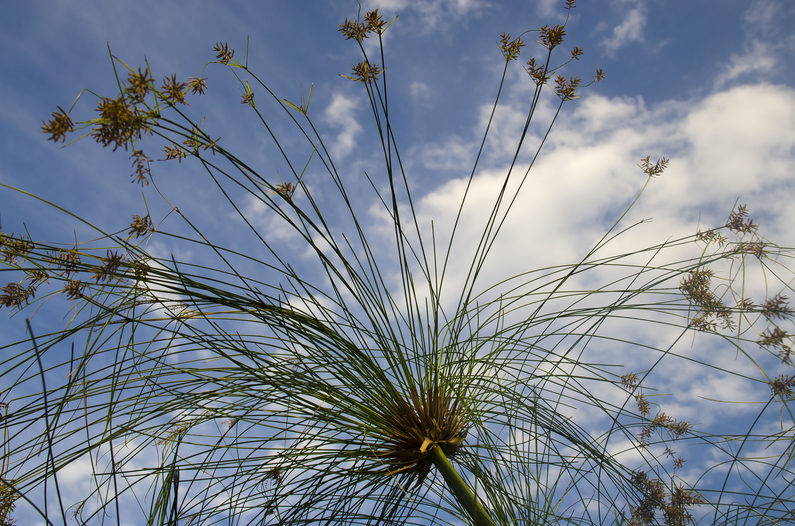
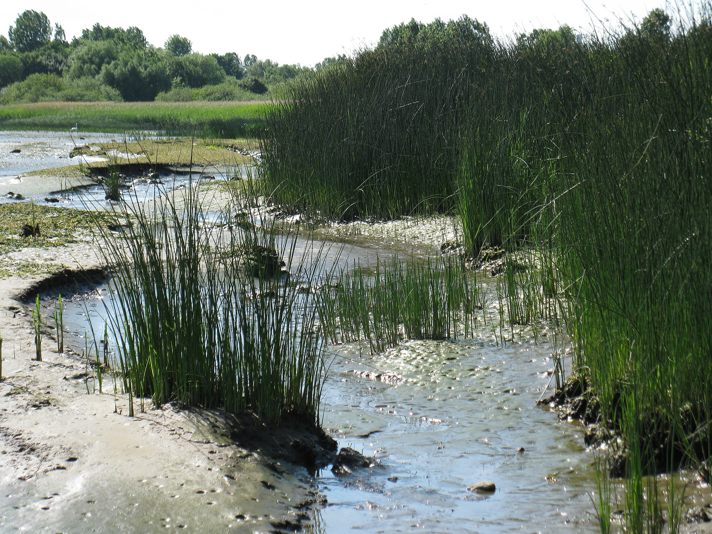
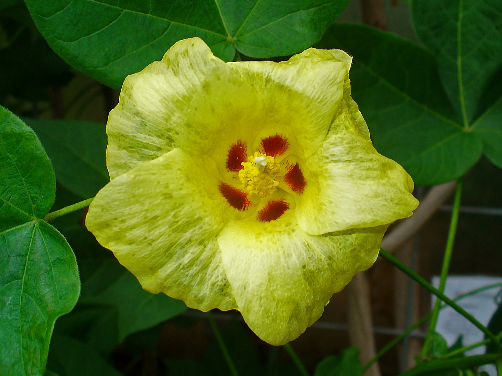

# Plants and Trees in the Bible

## License Information

Plants and Trees in the Bible © United Bible Societies, 2025. Adapted from: <cite>Each According to its Kind: Plants and Trees in the Bible</cite>, by Robert Koops © 2012 United Bible Societies. This work is licensed under Creative Commons Attribution-ShareAlike 4.0 International (<a href="https://creativecommons.org/licenses/by-sa/4.0/">https://creativecommons.org/licenses/by-sa/4.0/</a>).

--------------------------------

## 標題：用於紡織和建築的植物 (id: FLORA:5.1)

5\.1 標題：用於紡織和建築的植物
==================

在討論這部分內容之前，我們需要先澄清一些一般性的表達。有些人認為，草就是在耕種前必須從田裡除掉的一些綠色植物，或是長在房子周圍、需要定期修剪的東西。但是，植物學家將草劃作一個極大的科（禾本科；學名*Poaceae* ），包含9,000多個物種，分成600個屬。這個科涵蓋世界各地主要的糧食作物（穀類）：大米、玉米、高粱、小麥、大麥、藜麥、黑麥等等；還包括重要的建築材料竹子，以及用來製作籃子、床、樂器、紙張、椅子的蘆葦和藤條。甚至甘蔗也是一種草。這些植物的莖都是中空的，葉子在莖節處長出，都生有保護葉子基部的葉鞘、某種類型的穗、由風授粉的無瓣小花，以及生長在植株基部而非頂端的劍形窄葉。

關於希伯來文中的統稱和特定詞彙可能產生的問題，我們可以在[GEN 1:11](https://ref.ly/Gen1:11); [GEN 1:12](https://ref.ly/Gen1:12) 看到一個很好的例子。從字面意思來看，上帝在第11節的開頭說：「地要長出（*tadshe’* ）芽（*deshe’* ），含種子的植物（*‘esev* ），以及結果子的果樹……。」對於希伯來文*deshe’* 一詞，學者仍有爭論，不確定這個詞是引出後面兩個類別的統稱，還是指「草、含種子的植物和果樹」這三個類別中的第一類（詳參[5\.1\.2 草 (grass)](#FLORA:5.1.2) 中的討論和翻譯）。

另一個希伯來文統稱出現在[GEN 1:30](https://ref.ly/Gen1:30) ，那裡提到上帝將*yereq ‘esev* （意為「綠色植物」）賜給動物作食物。有意思的是，[GEN 9:3](https://ref.ly/Gen9:3) 同樣記載了*yereq ‘esev* 一詞，但卻是連同動物的肉一起賜給挪亞作食物的。

還有一個需要提及的希伯來文統稱是*siach* 。這個詞通常意為「抱怨」、「沉思」、「默想」或「喋喋不休」，但在一些地方是指「灌木叢」或「灌木」。在[GEN 2:5](https://ref.ly/Gen2:5); [GEN 21:15](https://ref.ly/Gen21:15); [JOB 30:4](https://ref.ly/Job30:4); [JOB 30:7](https://ref.ly/Job30:7) 中，*siach* 是後一種意思。

* **Associated Passages:** 創世記 1:11; 創世記 1:12; 創世記 1:30; 創世記 9:3; 創世記 2:5; 創世記 21:15; 約伯記 30:4; 約伯記 30:7

## 標題：香蒲（cattail [reed-mace]） (id: FLORA:5.1.1)

5\.1\.1 標題：香蒲（cattail \[reed\-mace]）
====================================

經文出處
----

Hebrew 來： סוּף (音譯： suf)

[EXO 2:3](https://ref.ly/Exod2:3), [EXO 2:5](https://ref.ly/Exod2:5), [ISA 19:6](https://ref.ly/Isa19:6), [JON 2:6](https://ref.ly/Jonah2:6)

討論
--

希伯來文*suf* 所指的香蒲可能不止一種，香蒲又名「貓尾草」、「水燭」和「蒲草」。以色列有兩種香蒲：長苞香蒲（學名*Typha domingensis* ）和寬葉香蒲（學名*Typha latifolia* ；祖海里認為是*Typha australis* ）。這兩種香蒲都喜歡生長在河邊或溪邊緩慢的水流中。祖海里（Zohary）推測，*suf* 可能是很多種水生植物的統稱。[JON 2:6](https://ref.ly/Jonah2:6) （《和》2:5）提到*suf* ，中文譯本多譯為「海草」，可算是支持此論點的例子。在[ISA 19:6](https://ref.ly/Isa19:6) ，*suf* 與*qaneh* （「蘆葦」）是一組成對的詞，因此幾乎可以肯定*suf* 就是香蒲，因為兩者都生長在沼澤和緩流的小溪中。

有些解經家認為，耶穌被人戲弄時，放在他手裡的「葦子」是一根香蒲草的稈（[MAT 27:29](https://ref.ly/Matt27:29) ）。還有些人則反對這個看法，認為香蒲花梗不會在一年中這麼早的時候成熟。但是，這根香蒲草的稈也可能是前一年的。關於此爭論，目前仍未有共識。

描述
--

香蒲草的高度可達3米（10英呎），柔軟且毛茸茸的棕色果穗非常顯眼，果穗最終裂成蓬鬆狀，被風吹落，漂在水面上。這種植物的粗根會沿著淺水湖泊和溪流的底部匍匐蔓延，長長的葉子又直又尖。

特殊意義
----

香蒲草葉在聖經時期就用來製作籃子和墊子，現今依然如此。這種植物的粗根、花粉和嫩莖都可食用。《出埃及記》中的香蒲（蘆葦）眾所周知，摩西的母親正是把他藏在漂浮的小箱子裡面，然後把箱子擱在了香蒲叢中。

翻譯
--

香蒲的大部分品種分佈在歐洲和北美洲，葉子用來編製墊子和椅座。印度有一種香蒲屬（學名*Typha* ）植物叫做象蒲（學名*Typha elephantina* ），人們用它來造紙和製作裝飾品。生活在河流附近的翻譯者可能有其他類似蘆葦的植物名稱用作譯詞，然而需要留意，聖經共提到過四種類似蘆葦的植物（另參[5\.1\.3 紙莎草、蒲草 (papyrus)](#FLORA:5.1.3) 、[5\.1\.4 蘆葦（普通蘆葦、蘆竹）（reed \[common reed, giant reed]）](#FLORA:5.1.4) 和[5\.1\.5 燈心草（蒲草、莎草）（rush \[bulrush, sedge]）](#FLORA:5.1.5) ）。在[EXO 2:3](https://ref.ly/Exod2:3); [EXO 2:5](https://ref.ly/Exod2:5) ，許多英文譯本都使用了統稱"reeds"（「蘆葦」；RSV (Revised Standard Version (1952)) 、NRSV (New Revised Standard Version (1989)) 、NIV (New International Version (1984)) 、LB (Living Bible (1971)) 、REB (Revised English Bible (1989)) 、NJB (New Jerusalem Bible (1985)) 、NJPSV (New Jewish Publication Society Version) ）。GW (God's Word Translation) 譯作"papyrus plants"（「紙莎草」），但是植物學家認為，紙莎草更適合作為希伯來文*gome’* 的譯詞。在不熟悉水邊植物的地方，可以譯成「很高的草」（"tall grass"；GNB (Good News Bible) 、CEV (Contemporary English Version) ）或「很高的草稈」（"tall stalks of grass"；NCV (New Century Version) ）等一般性的表述。對於《出埃及記》和《以賽亞書》中的*suf* ，主要譯法有：

1\. 使用當地生長在溪流或河水中的一種草；

2\. 使用「草」的統稱；

3\. 使用描述性短語，如「很高的草」。

希伯來文*suf* 在[JON 2:6](https://ref.ly/Jonah2:6) （《和》2:5）中的含義不同。該節經文所記的植物生長在水裡，但沒有根，或者扎根在淺海的海底。因此，英文譯本通常譯成"seaweed"（「海草」；GNB (Good News Bible) 、CEV (Contemporary English Version) 、NLT (New Living Translation) 、GW (God's Word Translation) 、REB (Revised English Bible (1989)) ），這是一種葉子長長的、似草的植物，通常不固著在海床上。

如果需要音譯*suf* ，可以考慮音譯以下主要語言的詞語：阿拉伯文*bardi* 或*but* 或*dadi* 或*tifa* 、法文*jonc* 或*marset* 、葡萄牙文*murao* 或*tabua* 、西班牙文*aseña* 或*enea* 或*espadaina* 或*españada* 或*junco* 或*macio* 或*totora* 或*tule espidilla* 。

希伯來文*yam suf* （字面意為「蘆葦海」）在《七十士譯本》和許多其他譯本中被譯成「紅海」，這種譯法有些不準確。除非目標語言文化中的「紅海」翻譯傳統根深蒂固，否則應依照《〈出埃及記〉手冊》（*A Handbook on Exodus* ）的建議，按照希伯來文本直譯成「蘆葦海」，或採用現代的對等詞「蘇伊士灣」（"Gulf of Suez"；如GNB (Good News Bible) ）。如果使用「紅海」，則應在腳註裡註明希伯來文本的字面意思是「蘆葦海」。

* **Associated Passages:** 出埃及記 2:3; 出埃及記 2:5; 以賽亞書 19:6; 約拿書 2:6; 馬太福音 27:29

## 標題：草（grass） (id: FLORA:5.1.2)

5\.1\.2 標題：草（grass）
===================

經文出處
----

Hebrew 來： אָחוּ (音譯： ’achu)

[GEN 41:2](https://ref.ly/Gen41:2), [GEN 41:18](https://ref.ly/Gen41:18), [JOB 8:11](https://ref.ly/Job8:11)

Hebrew 來： דשׁא (音譯： dasha’（動詞）)

[GEN 1:11](https://ref.ly/Gen1:11), [JOL 2:22](https://ref.ly/Joel2:22)

Hebrew 來： דֶּשֶׁא (音譯： deshe’)

[GEN 1:11](https://ref.ly/Gen1:11), [GEN 1:12](https://ref.ly/Gen1:12), [DEU 32:2](https://ref.ly/Deut32:2), [2SA 23:4](https://ref.ly/2Sam23:4), [2KI 19:26](https://ref.ly/2Kgs19:26), [JOB 6:5](https://ref.ly/Job6:5), [JOB 38:27](https://ref.ly/Job38:27), [PSA 23:2](https://ref.ly/Ps23:2), [PSA 37:2](https://ref.ly/Ps37:2), [PRO 27:25](https://ref.ly/Prov27:25), [ISA 15:6](https://ref.ly/Isa15:6), [ISA 37:27](https://ref.ly/Isa37:27), [ISA 66:14](https://ref.ly/Isa66:14), [JER 14:5](https://ref.ly/Jer14:5)

Hebrew 來： דֶּתֶא (音譯： dethe’)

[DAN 4:12](https://ref.ly/Dan4:12), [DAN 4:20](https://ref.ly/Dan4:20)

Hebrew 來： חָצִיר (音譯： chatsir)

[1KI 18:5](https://ref.ly/1Kgs18:5), [2KI 19:26](https://ref.ly/2Kgs19:26), [JOB 8:12](https://ref.ly/Job8:12), [JOB 40:15](https://ref.ly/Job40:15), [PSA 37:2](https://ref.ly/Ps37:2), [PSA 90:5](https://ref.ly/Ps90:5), [PSA 103:15](https://ref.ly/Ps103:15), [PSA 104:14](https://ref.ly/Ps104:14), [PSA 129:6](https://ref.ly/Ps129:6), [PSA 147:8](https://ref.ly/Ps147:8), [PRO 27:25](https://ref.ly/Prov27:25), [ISA 15:6](https://ref.ly/Isa15:6), [ISA 34:13](https://ref.ly/Isa34:13), [ISA 35:7](https://ref.ly/Isa35:7), [ISA 37:27](https://ref.ly/Isa37:27), [ISA 40:6](https://ref.ly/Isa40:6), [ISA 40:7](https://ref.ly/Isa40:7), [ISA 40:7](https://ref.ly/Isa40:7), [ISA 40:8](https://ref.ly/Isa40:8), [ISA 44:4](https://ref.ly/Isa44:4), [ISA 51:12](https://ref.ly/Isa51:12)

Hebrew 來： חֲשַׁשׁ (音譯： chashash)

[ISA 5:24](https://ref.ly/Isa5:24), [ISA 33:11](https://ref.ly/Isa33:11)

Hebrew 來： יֶרֶק (音譯： yereq)

[GEN 1:30](https://ref.ly/Gen1:30), [GEN 9:3](https://ref.ly/Gen9:3), [EXO 10:15](https://ref.ly/Exod10:15), [NUM 22:4](https://ref.ly/Num22:4), [2KI 19:26](https://ref.ly/2Kgs19:26), [PSA 37:2](https://ref.ly/Ps37:2), [ISA 15:6](https://ref.ly/Isa15:6), [ISA 37:27](https://ref.ly/Isa37:27)

Hebrew 來： מִרְעֶה (音譯： mir‘eh)

[GEN 47:4](https://ref.ly/Gen47:4), [1CH 4:39](https://ref.ly/1Chr4:39), [1CH 4:40](https://ref.ly/1Chr4:40), [1CH 4:41](https://ref.ly/1Chr4:41), [JOB 39:8](https://ref.ly/Job39:8), [ISA 32:14](https://ref.ly/Isa32:14), [LAM 1:6](https://ref.ly/Lam1:6), [EZK 34:14](https://ref.ly/Ezek34:14), [EZK 34:14](https://ref.ly/Ezek34:14), [EZK 34:18](https://ref.ly/Ezek34:18), [EZK 34:18](https://ref.ly/Ezek34:18), [JOL 1:18](https://ref.ly/Joel1:18), [NAM 2:12](https://ref.ly/Nah2:12)

Hebrew 來： עֲשַׂב (音譯： ‘asav)

[DAN 4:12](https://ref.ly/Dan4:12), [DAN 4:22](https://ref.ly/Dan4:22), [DAN 4:29](https://ref.ly/Dan4:29), [DAN 4:30](https://ref.ly/Dan4:30), [DAN 5:21](https://ref.ly/Dan5:21)

Hebrew 來： עֵשֶׂב (音譯： ‘esev)

[GEN 1:11](https://ref.ly/Gen1:11), [GEN 1:12](https://ref.ly/Gen1:12), [GEN 1:29](https://ref.ly/Gen1:29), [GEN 1:30](https://ref.ly/Gen1:30), [GEN 2:5](https://ref.ly/Gen2:5), [GEN 3:18](https://ref.ly/Gen3:18), [GEN 9:3](https://ref.ly/Gen9:3), [EXO 9:22](https://ref.ly/Exod9:22), [EXO 9:25](https://ref.ly/Exod9:25), [EXO 10:12](https://ref.ly/Exod10:12), [EXO 10:15](https://ref.ly/Exod10:15), [EXO 10:15](https://ref.ly/Exod10:15), [DEU 11:15](https://ref.ly/Deut11:15), [DEU 29:22](https://ref.ly/Deut29:22), [DEU 32:2](https://ref.ly/Deut32:2), [2KI 19:26](https://ref.ly/2Kgs19:26), [JOB 5:25](https://ref.ly/Job5:25), [PSA 72:16](https://ref.ly/Ps72:16), [PSA 92:8](https://ref.ly/Ps92:8), [PSA 102:5](https://ref.ly/Ps102:5), [PSA 102:12](https://ref.ly/Ps102:12), [PSA 104:14](https://ref.ly/Ps104:14), [PSA 105:35](https://ref.ly/Ps105:35), [PSA 106:20](https://ref.ly/Ps106:20), [PRO 19:12](https://ref.ly/Prov19:12), [PRO 27:25](https://ref.ly/Prov27:25), [ISA 37:27](https://ref.ly/Isa37:27), [ISA 42:15](https://ref.ly/Isa42:15), [JER 12:4](https://ref.ly/Jer12:4), [JER 14:6](https://ref.ly/Jer14:6), [AMO 7:2](https://ref.ly/Amos7:2), [MIC 5:6](https://ref.ly/Mic5:6), [ZEC 10:1](https://ref.ly/Zech10:1)

Greek 希： βοτάνη (音譯： botanē)

[HEB 6:7](https://ref.ly/Heb6:7), [WIS 16:12](https://ref.ly/Wis16:12)

Greek 希： λάχανον (音譯： lachanon)

[MAT 13:32](https://ref.ly/Matt13:32), [MRK 4:32](https://ref.ly/Mark4:32), [LUK 11:42](https://ref.ly/Luke11:42), [ROM 14:2](https://ref.ly/Rom14:2)

Greek 希： χλόη (音譯： chloē)

[SIR 40:22](https://ref.ly/Sir40:22), [SIR 43:21](https://ref.ly/Sir43:21)

Greek 希： χόρτος (音譯： chortos)

[MAT 6:30](https://ref.ly/Matt6:30), [MAT 13:26](https://ref.ly/Matt13:26), [MAT 14:19](https://ref.ly/Matt14:19), [MRK 4:28](https://ref.ly/Mark4:28), [MRK 6:39](https://ref.ly/Mark6:39), [LUK 12:28](https://ref.ly/Luke12:28), [JHN 6:10](https://ref.ly/John6:10), [1CO 3:12](https://ref.ly/1Cor3:12), [JAS 1:10](https://ref.ly/Jas1:10), [JAS 1:11](https://ref.ly/Jas1:11), [1PE 1:24](https://ref.ly/1Pet1:24), [1PE 1:24](https://ref.ly/1Pet1:24), [1PE 1:24](https://ref.ly/1Pet1:24), [REV 8:7](https://ref.ly/Rev8:7), [REV 9:4](https://ref.ly/Rev9:4), [SIR 40:16](https://ref.ly/Sir40:16)

Latin 拉： faenum

Latin 拉： faenum

[2ES 9:27](https://ref.ly/2Esd9:27), [2ES 15:42](https://ref.ly/2Esd15:42)

討論
--

聖地有450多種草，因此上面的希伯來文、亞蘭文、希臘文和拉丁文詞語不大可能是指特定的物種。這些詞語可能是統稱，在不同的時間或地點，指稱各種不同種類的草。

祖海里認為，[GEN 41:2](https://ref.ly/Gen41:2); [GEN 41:18](https://ref.ly/Gen41:18) 中的希伯來文*’achu* （「蘆葦」）指的不是一種草，而是「用於放牧的沼澤濕地」（第127頁；參KJV (King James Version (1611)) "meadow"，「草地」）。然而，[JOB 8:11](https://ref.ly/Job8:11) 似乎明確地提到某種植物（與蒲草平行），指出*’achu* 需要在有水的地方生長。

希伯來文*chashash* 在[ISA 5:24](https://ref.ly/Isa5:24) 中是指乾草，與碎稭平行，意指必被燒滅的惡人。在[ISA 33:11](https://ref.ly/Isa33:11) ，惡人徒勞無益的計謀被比作*chashash* ，同樣與碎稭平行。

希伯來文*yereq* （「綠色」）在舊約出現過8次，都是指植被。其中大部分出現在短語中，如*yereq ‘esev* （在[GEN 1:30](https://ref.ly/Gen1:30); [GEN 9:3](https://ref.ly/Gen9:3) 譯作「綠色植物」、「綠色的菜蔬」），或*yereq deshe’* （在[2KI 19:26](https://ref.ly/2Kgs19:26); [PSA 37:2](https://ref.ly/Ps37:2); [ISA 37:27](https://ref.ly/Isa37:27) 譯作「嫩草」或「青菜」）。然而，有3處經文的*yereq* 是單獨使用的，在[EXO 10:15](https://ref.ly/Exod10:15); [NUM 22:4](https://ref.ly/Num22:4); [ISA 15:6](https://ref.ly/Isa15:6) 中分別譯作「青草」、「青綠之物」或「綠的東西」。

希伯來文*deshe’* 有時被譯為「草」。這個詞通常出現在修辭語境中，常與*chatsir* 、*yereq* 或*‘esev* 平行。

希伯來文*‘esev* 在聖經中出現33次。RSV (Revised Standard Version (1952)) 有12次將其譯作"plant"（「植物」），12次譯作"grass"（「草」），5次譯作"herb"（「草木」）或"herbage"（「牧草」），4次譯作"vegetation"（「菜蔬」）。因為有些語言可能不存在像「植物」這樣的統稱，所以在這些經文中，很多時候可以根據語境來譯成「草」或「生長的東西」等。

表示「牧場」的詞語有很多，牧場就是綿羊、山羊和牛吃草的地方。希伯來文至少有5個表示「牧場」的詞語：除了上文所列的*mir‘eh* ，還有*migrash* （114次，大多出現在《約書亞記》和《歷代志上》）、*dover* （[ISA 5:17](https://ref.ly/Isa5:17) ；[MIC 2:12](https://ref.ly/Mic2:12) ）、*kar* （[PSA 37:20](https://ref.ly/Ps37:20) ，[PSA 65:14](https://ref.ly/Ps65:14) ［《和》65:13］；[ISA 30:23](https://ref.ly/Isa30:23) ）和*nawah* （11次）。

除此之外，還有譯作「稻草」的希伯來文*teven* ，指用來做磚和鋪在動物身下的乾草。例如，這個詞出現在[GEN 24:25](https://ref.ly/Gen24:25); [GEN 24:32](https://ref.ly/Gen24:32) ，但翻譯者需要注意的是，這裡的「稻草」不是給駱駝吃的，而是放在地上吸收尿液的。

有兩個希伯來文詞語常被譯為「飼料」（即動物的食物）或「草料」，即*belil* （[JOB 6:5](https://ref.ly/Job6:5) ，[JOB 24:6](https://ref.ly/Job24:6) ；[ISA 30:24](https://ref.ly/Isa30:24) ）和*mispo’* （[GEN 24:25](https://ref.ly/Gen24:25) ，[GEN 24:32](https://ref.ly/Gen24:32) ，[GEN 42:27](https://ref.ly/Gen42:27) ，[GEN 43:24](https://ref.ly/Gen43:24) ；[JDG 19:19](https://ref.ly/Judg19:19) ）。這兩個詞可能是指某種草類。

希臘文*chortos* 在新約出現了15次，RSV (Revised Standard Version (1952)) 通常將其譯作"grass"（「草」）。

希臘文*lachanon* 在新約出現了4次。這是一個花園植物的統稱，可根據上下文來翻譯。[MAT 13:32](https://ref.ly/Matt13:32) 和[MRK 4:32](https://ref.ly/Mark4:32) 提到，芥菜種長起來比園中所有的*lachanon* （「灌木」）都要大。[LUK 11:42](https://ref.ly/Luke11:42) 記載，法利賽人將薄荷、芸香和各樣*lachanon* （「香草」）獻上十分之一。[ROM 14:2](https://ref.ly/Rom14:2) 說，信心軟弱的弟兄只吃*lachanon* （「蔬菜」）。

希臘文*botanē* 也是一個統稱，在[HEB 6:7](https://ref.ly/Heb6:7) 譯作「植被」（"vegetation"；RSV (Revised Standard Version (1952)) ），中文譯本多譯為「蔬菜」。

在次經中，希臘文*chloē* 意為「嫩綠的禾苗」（[SIR 40:22](https://ref.ly/Sir40:22) ，[SIR 43:21](https://ref.ly/Sir43:21) ）。《七十士譯本》使用這個詞來翻譯希伯來文*deshe’* （[2SA 23:4](https://ref.ly/2Sam23:4) ；[2KI 19:26](https://ref.ly/2Kgs19:26) ；[JOB 38:27](https://ref.ly/Job38:27) ；[PSA 23:2](https://ref.ly/Ps23:2) ，[PSA 37:2](https://ref.ly/Ps37:2) ）。

描述
--

對大多數翻譯者來說，草極其常見，因此不需要特別加以描述。但對於生活在北極圈內，或者不宜人居的荒漠地帶的翻譯者來說，翻譯聖地的草可能會不太容易。其中一個常見的問題是，當地語言有太多特定詞語但沒有「草」的統稱。在尼日爾（Tamasheq），曾有一個翻譯團隊因為[MRK 6:39](https://ref.ly/Mark6:39) 中的「坐在青草地上」一語而十分困擾，因為他們唯一知道的一種草只出現在短暫的雨季，沒有任何人會願意坐在上面。草可以描述為：高不到1米（3英呎）的植物，葉子狹窄、青綠、挺直，通常成束或成簇地生長。

特殊意義
----

在[PSA 90:5](https://ref.ly/Ps90:5) 和[ISA 40:6](https://ref.ly/Isa40:6); [ISA 40:7](https://ref.ly/Isa40:7) 中，作者用草作為比喻，強調人生命的短暫。在[MAT 6:30](https://ref.ly/Matt6:30) ，耶穌將「野地裡的草」作為沒有太大價值的東西，來與人進行比較。

翻譯
--

在一些非洲語言中，「草」的譯詞實際上指的是「未開發的植物」，與作為食物、入藥和製作器具的植物相對。希伯來文也可能存在這樣的區別，只是目前我們還未發現。在翻譯之前，需要先研究當地人對植物的分類；在了解當地的植物分類之後，翻譯者就可以決定在多大程度上加以使用，這取決於對整體翻譯的通盤考量。

如果可能，希伯來文*deshe’* 的譯詞應含有植物新長出來或發出新芽的意思。由於*deshe’* 常出現在修辭語境中，並且常與其他指草的詞語平行，所以翻譯者需要找出兩三個用來指草以及類似草的植物的詞語。

[GEN 1:11](https://ref.ly/Gen1:11) a：「地要長出植物（*deshe’* ）。」由於這節經文與第20節平行，故本手冊贊同大多數學者的觀點，即*deshe’* 是一個統稱，引出後面的兩個類別（參本章的介紹部分）。翻譯者需要使用一個涵蓋最廣的植物統稱來翻譯這裡的*deshe’* 。如果沒有合適的統稱，可以使用「有葉子的東西」或「發芽的東西」這樣的短語。萬不得已的情況下，可以不譯這個統稱，直接翻譯後面具體的詞語。

[GEN 1:11](https://ref.ly/Gen1:11) b：「結種子的植物。」我們很難知道這裡的希伯來文短語（*‘esev mazri‘a zera‘* ）指的是像稻子這樣「果實」即是種子的植物，還是任何一種有種子的植物，包括番茄、辣椒、葡萄、茄子等等。關於這節經文，英文譯本的譯文含糊不清，例如，GNB (Good News Bible) 譯作"those that bear grain"（「結出穀物的植物」），CEV (Contemporary English Version) 譯作"grain"（「穀物」），NCV (New Century Version) 譯作"some to make grain for seeds"（「一些結子粒為種子的植物」），NIV (New International Version (1984)) 譯作"seed\-bearing plants"（「含種子的植物」；NJB (New Jerusalem Bible (1985)) 、NJPSV (New Jewish Publication Society Version) 同；NLT (New Living Translation) 、GW (God's Word Translation) 相似），REB (Revised English Bible (1989)) 譯作"plants that bear seed"（「帶種子的植物」）。如果譯成grain（「穀物」，相當於英式英語中的corn），可能太狹義了。無論怎樣，這類植物都與接下來「結果子的植物」相對，如蘋果和芒果。

[GEN 1:11](https://ref.ly/Gen1:11) c：「會結果子且果子裡有種子的果樹。」這節經文需要探討的問題是，希伯來文短語*’asher zar‘o vo* （意為「果子裡有種子」）是像「鳥是空中的鳥」這種多餘的表述，還是實際增添了新的內容。GNB (Good News Bible) 和CEV (Contemporary English Version) 將其理解為多餘的表述（GNB (Good News Bible) 譯作"those that bear fruit"，「結果子的樹木」；CEV (Contemporary English Version) 譯作"fruit trees"，「果樹」）。其他譯本似乎認為有必要保留這個短語（例如，NCV (New Century Version) 譯作"others to make fruits with seeds in them"，「結果子且果子裡有種子的其他植物」；NJB (New Jerusalem Bible (1985)) 譯作"fruit trees……bearing fruit with their seed inside"，「結果子且果子裡有種子的……果樹」；NJPSV (New Jewish Publication Society Version) 類似）。

[GEN 1:11](https://ref.ly/Gen1:11) d：「各從其類」。GW (God's Word Translation) 譯作"each according to its own type"（「各從其種類」）。英文譯本對這個希伯來文短語主要有三種解釋：

1\. 有些譯本認為這個短語是在強調植物類型的多樣性；例如，GNB (Good News Bible) 和CEV (Contemporary English Version) 譯作"all kinds of plants"（「所有種類的植物」；NAB (New American Bible (1970)) 、NJPSV (New Jewish Publication Society Version) 類似）。

2\. 有些譯本的重點在於植物的分門別類；例如，NIV (New International Version (1984)) 譯作"according to their various kinds"（「根據它們不同的種類」）、NJB (New Jerusalem Bible (1985)) 譯作"each corresponding to its own species"（「各自對應自己的物種」）。

3\. 有些譯本側重植物的繁殖；例如，NCV (New Century Version) 譯作"Every seed will produce more of its own kind of plant"（「每個種子都將長成同類的植物」），NLT (New Living Translation) 譯作"The seeds will then produce the kinds of plants and trees from which they came"（「種子將長成自身所出的植物和樹木種類」）。比較REB (Revised English Bible (1989)) 的譯文："each with its own kind of seed"（「各自含有自身種類的種子」）。

在[GEN 1:11](https://ref.ly/Gen1:11) ，作者表達的一個主題似乎是創造的秩序——類別和子類別。這個論點支持了NIV (New International Version (1984)) 和NJB (New Jerusalem Bible (1985)) 的譯文。但是，文中反覆使用「種子」一詞，表明作者也對遺傳法則的規律性感興趣。與這個主題相呼應，《申命記》所述的律法嚴格禁止在田裡混種不同種類的植物（在有些語言中是「種子」！），也禁止穿混合布料做成的衣服。關於希伯來人對這一點的關切，基督自己也作了補充：「荊棘上豈能摘葡萄呢？蒺藜裡豈能摘無花果呢？」（[MAT 7:16](https://ref.ly/Matt7:16) ）。以下是[GEN 1:11](https://ref.ly/Gen1:11) 的兩個翻譯範本：

1\. 地要長滿植物。要有結種子的植物（或一個當地亞種），以及結果子的樹木（或一個當地亞種）。每種植物結不同種類的種子。

2\. 地要長出各樣植物，遍滿地面。要有草、灌木和樹木（或結種子的植物和結果子的樹木；或穀物、蔬菜和果樹）。每種植物要繁衍自身。

翻譯者應該先研究自己語言的植物分類系統，然後仔細考慮這節經文的兩種基本結構，確定哪一種更符合自己的語言。NLT (New Living Translation) 和一些註釋書所作的三重區分很可能更符合當地的植物分類系統。若是這樣，不妨採納。

翻譯者在研究了當地的植物分類系統之後，必須決定是要採用該分類系統，還是嘗試表現希伯來人的分類。如果沒有中間程度的統稱，翻譯者可以使用「大米等植物」和「芒果等植物」之類的短語，不過這可能會讓人以為，經文最初的讀者知道大米或芒果等作物。

希伯來人的植物分類方法更多是從類型學的角度，而沒有嚴格的邏輯性或科學性，所以我們看到了一些重疊的分類或是較為模稜兩可的分類。也許，作者最想要表達的是上帝造物的有序。

[2KI 19:26](https://ref.ly/2Kgs19:26) ：這節經文的後兩行是「如房頂上的草（*chatsir* ），又如未長成而枯乾的禾稼」（同[ISA 37:27](https://ref.ly/Isa37:27) ；[PSA 129:6](https://ref.ly/Ps129:6) 類似）。這兩行詩描繪的景象是：一座平頂房屋的屋頂落上了一些塵土，形成一個利於草籽發芽的環境，但土層很淺，由於缺乏水分和土壤，草註定很快就要枯萎死亡。然而，最後一行有一個文本問題。HOTTP (Hebrew Old Testament Text Project (UBS)) 支持MT (Masoretic Text) 的文本，即「未長成就枯萎／烤焦」（*shedefah lifne qamah* ）。HOTTP (Hebrew Old Testament Text Project (UBS)) 把MT (Masoretic Text) 的可靠性定為C級，不支持「被東風吹枯萎／烤焦」（*shedefah lifne qadim* ）這一猜測。GNB (Good News Bible) 和REB (Revised English Bible (1989)) 採納了這個猜測。HOTTP (Hebrew Old Testament Text Project (UBS)) 推斷：抄經者不具備充分的希伯來文知識，不理解這一行的意思，因而猜測其意可能是「被東風烤焦」，這種說法也是非常符合邏輯的。但各譯本基本上已有共識，一致遵循MT (Masoretic Text) 的文本（如RSV (Revised Standard Version (1952)) 、NIV (New International Version (1984)) 、LB (Living Bible (1971)) 、GW (God's Word Translation) ）。NJPSV (New Jewish Publication Society Version) 也參照了MT (Masoretic Text) ，但卻將最後一行譯作"blasted before the standing grain"（「在長成挺立的植株之前就枯萎」），這在上下文中完全說不通。

* **Associated Passages:** 創世記 41:2; 創世記 41:18; 約伯記 8:11; 創世記 1:11; 約珥書 2:22; 創世記 1:12; 申命記 32:2; 撒母耳記下 23:4; 列王紀下 19:26; 約伯記 6:5; 約伯記 38:27; 詩篇 23:2; 詩篇 37:2; 箴言 27:25; 以賽亞書 15:6; 以賽亞書 37:27; 以賽亞書 66:14; 耶利米書 14:5; 但以理書 4:12; 但以理書 4:20; 列王紀上 18:5; 約伯記 8:12; 約伯記 40:15; 詩篇 90:5; 詩篇 103:15; 詩篇 104:14; 詩篇 129:6; 詩篇 147:8; 以賽亞書 34:13; 以賽亞書 35:7; 以賽亞書 40:6; 以賽亞書 40:7; 以賽亞書 40:8; 以賽亞書 44:4; 以賽亞書 51:12; 以賽亞書 5:24; 以賽亞書 33:11; 創世記 1:30; 創世記 9:3; 出埃及記 10:15; 民數記 22:4; 創世記 47:4; 歷代志上 4:39; 歷代志上 4:40; 歷代志上 4:41; 約伯記 39:8; 以賽亞書 32:14; 耶利米哀歌 1:6; 以西結書 34:14; 以西結書 34:18; 約珥書 1:18; 那鴻書 2:12; 但以理書 4:22; 但以理書 4:29; 但以理書 4:30; 但以理書 5:21; 創世記 1:29; 創世記 2:5; 創世記 3:18; 出埃及記 9:22; 出埃及記 9:25; 出埃及記 10:12; 申命記 11:15; 申命記 29:22; 約伯記 5:25; 詩篇 72:16; 詩篇 92:8; 詩篇 102:5; 詩篇 102:12; 詩篇 105:35; 詩篇 106:20; 箴言 19:12; 以賽亞書 42:15; 耶利米書 12:4; 耶利米書 14:6; 阿摩司書 7:2; 彌迦書 5:6; 撒迦利亞書 10:1; 希伯來書 6:7; 智慧篇 16:12; 馬太福音 13:32; 馬可福音 4:32; 路加福音 11:42; 羅馬書 14:2; 德訓篇 40:22; 德訓篇 43:21; 馬太福音 6:30; 馬太福音 13:26; 馬太福音 14:19; 馬可福音 4:28; 馬可福音 6:39; 路加福音 12:28; 約翰福音 6:10; 哥林多前書 3:12; 雅各書 1:10; 雅各書 1:11; 彼得前書 1:24; 啟示錄 8:7; 啟示錄 9:4; 德訓篇 40:16; 厄斯德拉下 9:27; 厄斯德拉下 15:42; 以賽亞書 5:17; 彌迦書 2:12; 詩篇 37:20; 詩篇 65:14; 以賽亞書 30:23; 創世記 24:25; 創世記 24:32; 約伯記 24:6; 以賽亞書 30:24; 創世記 42:27; 創世記 43:24; 士師記 19:19; 馬太福音 7:16

## 標題：紙莎草、蒲草（papyrus） (id: FLORA:5.1.3)

5\.1\.3 標題：紙莎草、蒲草（papyrus）
==========================

經文出處
----

Hebrew 來： גֹּמֶא (音譯： gome’)

[EXO 2:3](https://ref.ly/Exod2:3), [JOB 8:11](https://ref.ly/Job8:11), [ISA 18:2](https://ref.ly/Isa18:2), [ISA 35:7](https://ref.ly/Isa35:7)

Hebrew 來： אֵבֶה (音譯： ’eveh)

[JOB 9:26](https://ref.ly/Job9:26)

討論
--

對於聖經中提及的各種蘆葦究竟是什麼品種，植物學界仍有相當大的爭議，但根據詞源學和實際情況，人們普遍認為希伯來文*gome’* 指的是紙莎草（又名蒲草；學名*Cyperus Papyrus* ）。至於希伯來文*’eveh* ，[JOB 9:26](https://ref.ly/Job9:26) 中的短語「*’eveh* 做的快船」暗示*’eveh* 指紙莎草，因為埃及除了有木船，還有紙莎草做的船。然而，在這節經文中，英文譯本有"papyrus"（「紙莎草」；NIV (New International Version (1984)) ）和"reed"（「蘆葦」；RSV (Revised Standard Version (1952)) 、REB (Revised English Bible (1989)) ）兩種譯法。

描述
--

紙莎草是一種很高的草，生有許多花莖，花莖高度可達6米（20英呎），直徑達10厘米（4英吋）。莖頂端的穗分成數百個分支，像棕櫚樹頂一樣伸展開來，每個分支都開小花。

特殊意義
----

紙莎草是古代近東用途最廣的草。在埃及，人們用紙莎草製作箱子、墊子、繩子，最特別的是做紙張。當約基別試圖解救幼子摩西脫離法老的殘暴法令所害時，她或許想到了紙莎草造船的功能（[EXO 2:3](https://ref.ly/Exod2:3) ）。約伯的朋友比勒達以紙莎草是一種需要水的植物來抨擊約伯，暗示他必定犯了罪（[JOB 8:11](https://ref.ly/Job8:11) ）。[ISA 18:2](https://ref.ly/Isa18:2) 提到「使者在水面上，坐蒲草船過海」，藉此象徵埃及強大的政治力量。窮人還用紙莎草做桶、棚屋、涼鞋和衣服。然而，紙莎草通常不用來編籃子，這或許有些出人意料。與現今撒哈拉沙漠以南的非洲地區的製作方式相似，埃及人的籃子是以海棗樹葉、纖維或劈開的葉片中脈為心，外面纏繞纖維（像吉他弦一樣）製成的，呈盤繞結構。

翻譯
--

世界上有超過600種莎草屬（學名*Cyperus* ）植物，生長在熱帶和溫帶氣候地區，但是很多都和紙莎草的外形不相像。例如，分佈在西亞和非洲的油莎草隸於莎草屬，塊莖（又稱*chufa* 或*Zulu nut* ）很可口。亞洲各地用來做墊子的可可草（續根草）和其他幾種類型的草也隸於莎草屬。紙莎草今天在埃及很少見，但在烏干達北部卻生長得很繁茂，當地稱之為*sudd* 。

希伯來文*gome’* 在經文中出現的語境大部分是修辭性的（[EXO 2:3](https://ref.ly/Exod2:3) 除外），因此翻譯者可以用當地在修辭意義上對等的詞語來替代。然而，如果原來的植物名稱被替代，最好在腳註中註明原詞，特別是在這個詞語和某個特定地區有關聯的經文裡；例如，在[ISA 18:1](https://ref.ly/Isa18:1) ，蒲草船和「埃塞俄比亞」有關聯。在[EXO 2:3](https://ref.ly/Exod2:3) ，摩西的母親用的不是「蒲草」（"bulrushes"；RSV (Revised Standard Version (1952)) 、KJV (King James Version (1611)) ），而是紙莎草；用的不是「籃子」（"basket"；RSV (Revised Standard Version (1952)) ），而是「箱子」（"box"；希伯來文*tevah* ）。若有表示「箱子」的詞，就應該使用該詞。不然，可以使用「籃子」的統稱，並用一種編製籃子的韌草來指明材料。以下是*gome’* 的幾種譯法：

1\. 採用當地的一種韌草作為譯詞；

2\. 使用描述性的短語，如「堅韌的草」；

3\. 使用「草」的統稱；

4\. 在[EXO 2:3](https://ref.ly/Exod2:3) 中，把這種植物隱含在動詞「編織」或名詞「箱子／籃子」裡；

5\. 使用「燈心草」（"rush"；REB (Revised English Bible (1989)) ）、「紙莎草」（"papyrus reeds"；LB (Living Bible (1971)) ）或「蘆葦」（"reeds"；GNB (Good News Bible) ）為譯詞。

如果需要音譯紙莎草，可以按照法文*jonc* 或葡萄牙文／西班牙文*papiro* 。

[ISA 35:7](https://ref.ly/Isa35:7) ：這節經文的最後兩行是：「野狗躺臥休息之處，必長出青草、蘆葦和蒲草（*gome’* ）。」在這裡，翻譯者必須有一組表示「草」的詞語，因為這兩行平行詩句需要表現出一種遞進：曾經的沙漠（野狗出沒的地方）將變成沼澤，普通的草將變成水生的草。

* **Associated Passages:** 出埃及記 2:3; 約伯記 8:11; 以賽亞書 18:2; 以賽亞書 35:7; 約伯記 9:26; 以賽亞書 18:1

## 標題：蘆葦（普通蘆葦、蘆竹）（reed [common reed, giant reed]） (id: FLORA:5.1.4)

5\.1\.4 標題：蘆葦（普通蘆葦、蘆竹）（reed \[common reed, giant reed]）
=======================================================

經文出處
----

Hebrew 來： קָנֶה (音譯： qaneh)

[1KI 14:15](https://ref.ly/1Kgs14:15), [2KI 18:21](https://ref.ly/2Kgs18:21), [JOB 40:21](https://ref.ly/Job40:21), [PSA 68:31](https://ref.ly/Ps68:31), [ISA 19:6](https://ref.ly/Isa19:6), [ISA 35:7](https://ref.ly/Isa35:7), [ISA 36:6](https://ref.ly/Isa36:6), [ISA 42:3](https://ref.ly/Isa42:3), [EZK 29:6](https://ref.ly/Ezek29:6), [EZK 40:3](https://ref.ly/Ezek40:3), [EZK 40:5](https://ref.ly/Ezek40:5), [EZK 40:5](https://ref.ly/Ezek40:5), [EZK 40:5](https://ref.ly/Ezek40:5), [EZK 40:6](https://ref.ly/Ezek40:6), [EZK 40:6](https://ref.ly/Ezek40:6), [EZK 40:7](https://ref.ly/Ezek40:7), [EZK 40:7](https://ref.ly/Ezek40:7), [EZK 40:7](https://ref.ly/Ezek40:7), [EZK 40:8](https://ref.ly/Ezek40:8), [EZK 41:8](https://ref.ly/Ezek41:8), [EZK 42:16](https://ref.ly/Ezek42:16), [EZK 42:16](https://ref.ly/Ezek42:16), [EZK 42:16](https://ref.ly/Ezek42:16), [EZK 42:17](https://ref.ly/Ezek42:17), [EZK 42:17](https://ref.ly/Ezek42:17), [EZK 42:18](https://ref.ly/Ezek42:18), [EZK 42:18](https://ref.ly/Ezek42:18), [EZK 42:19](https://ref.ly/Ezek42:19), [EZK 42:19](https://ref.ly/Ezek42:19)

Greek 希： καλάμη (音譯： kalamē)

[1CO 3:12](https://ref.ly/1Cor3:12), [WIS 3:7](https://ref.ly/Wis3:7)

Greek 希： κάλαμος (音譯： kalamos)

[MAT 11:7](https://ref.ly/Matt11:7), [MAT 12:20](https://ref.ly/Matt12:20), [MAT 27:29](https://ref.ly/Matt27:29), [MAT 27:30](https://ref.ly/Matt27:30), [MAT 27:48](https://ref.ly/Matt27:48), [MRK 15:19](https://ref.ly/Mark15:19), [MRK 15:36](https://ref.ly/Mark15:36), [LUK 7:24](https://ref.ly/Luke7:24), [3JN 1:13](https://ref.ly/3John1:13), [REV 11:1](https://ref.ly/Rev11:1), [REV 21:15](https://ref.ly/Rev21:15), [REV 21:16](https://ref.ly/Rev21:16), [3MA 2:22](https://ref.ly/3Macc2:22)

討論
--

以色列的蘆葦分為兩大類，即普通蘆葦（學名*Phragmites australis* ）和蘆竹（學名*Arundo donax* ），然而在某個給定的聖經語境中，很難分辨作者指的是哪一種蘆葦。

英文"cane"（「杖、藤、中空的莖」）源自希伯來文*qaneh* 。在眾多指稱蘆葦和燈心草的希伯來文詞語中，*qaneh* 的含義最廣。就像英文"reed"（「蘆葦」）一樣，*qaneh* 可以具體地指某種蘆葦，也可以是幾種水生植物的統稱。這個詞也用來指法老夢中的麥稈（[GEN 41:5](https://ref.ly/Gen41:5) ，[GEN 41:22](https://ref.ly/Gen41:22) ）、帳幕中金燈臺的幹和枝子（[EXO 25:31](https://ref.ly/Exod25:31); [EXO 25:32](https://ref.ly/Exod25:32); [EXO 25:33](https://ref.ly/Exod25:33) ，[EXO 25:35](https://ref.ly/Exod25:35); [EXO 25:36](https://ref.ly/Exod25:36) ，[EXO 37:17](https://ref.ly/Exod37:17); [EXO 37:18](https://ref.ly/Exod37:18); [EXO 37:19](https://ref.ly/Exod37:19) ，[EXO 37:21](https://ref.ly/Exod37:21); [EXO 37:22](https://ref.ly/Exod37:22) ）、天平的桿（[ISA 46:6](https://ref.ly/Isa46:6) ）、人的上臂（[JOB 31:22](https://ref.ly/Job31:22) ）、丈量竿（[EZK 40:3](https://ref.ly/Ezek40:3) ，[EZK 40:5](https://ref.ly/Ezek40:5); [EZK 40:6](https://ref.ly/Ezek40:6); [EZK 40:7](https://ref.ly/Ezek40:7); [EZK 40:8](https://ref.ly/Ezek40:8) ，[EZK 40:5](https://ref.ly/Ezek40:5) ，[EZK 42:16](https://ref.ly/Ezek42:16); [EZK 42:17](https://ref.ly/Ezek42:17); [EZK 42:18](https://ref.ly/Ezek42:18); [EZK 42:19](https://ref.ly/Ezek42:19) ），以及香菖蒲（[EXO 30:23](https://ref.ly/Exod30:23) ；[SNG 4:14](https://ref.ly/Song4:14) ；[ISA 43:24](https://ref.ly/Isa43:24) ；[JER 6:20](https://ref.ly/Jer6:20) ；[EZK 27:19](https://ref.ly/Ezek27:19) ；參[4\.1\.2 香菖蒲（水菖蒲、香甘蔗、甜甘蔗、薑草）(calamus \[sweet flag, aromatic cane, sweet cane, ginger grass])](#FLORA:4.1.2) ）。

希臘文*kalamos* 也用來指丈量的杖（[REV 11:1](https://ref.ly/Rev11:1) ，[REV 21:15](https://ref.ly/Rev21:15); [REV 21:16](https://ref.ly/Rev21:16) ）和筆（[3JN 1:13](https://ref.ly/3John1:13) ；[3MA 4:20](https://ref.ly/3Macc4:20) ）。關於蘆葦筆的討論，參WTH ，[1\.7\.3 筆 (pen)](#REALIA:1.7.3) 。

描述
--

普通蘆葦是一種很高的草，葉子硬而尖，羽毛狀花序的高度可達2米（7英呎）以上。這種蘆葦生長在湖泊和溪流中，根在水底匍匐，並生出新葉和莖。

蘆竹的外形與普通蘆葦相似，但不是生長在水中，而是長在河岸上。中空的莖稈看起來像竹子，其上巨大的羽毛狀花序可達5米（17英呎）高。

特殊意義
----

這兩種蘆葦都可用來製作籃子、墊子、笛子、筆、箭和屋頂。[ISA 42:3](https://ref.ly/Isa42:3) 說，彌賽亞將溫和地對待軟弱的人，「壓傷的蘆葦，他不折斷」，這個溫柔的形象與當時典型的鐵腕暴君形成對比。在[2KI 18:21](https://ref.ly/2Kgs18:21) 、[ISA 36:6](https://ref.ly/Isa36:6) 和[EZK 29:6](https://ref.ly/Ezek29:6) ，法老被比作一根靠不住的蘆葦杖。在[1KI 14:15](https://ref.ly/1Kgs14:15) ，以色列被比作水中搖動的蘆葦。

翻譯
--

地中海地區的普通蘆葦在歐洲、印度、日本和北美都有近緣植物。一般認為，普通蘆葦是蘆葦屬（學名*Phragmites* ）的唯一一種植物，但也有一些植物學家將其分為3個物種。普通蘆葦對自然資源的保護非常重要，因為它為許多種類的動物和鳥類提供了棲息地。在北美，適應環境能力較弱的當地品種正在被源自歐洲的更強壯的品種所取代，這些外來品種也正威脅著其他種類的沼澤植物。此外，日本人會食用蘆葦的嫩芽，印第安人曾吃蘆葦的種子。

蘆竹屬（學名*Arundo* ）植物遍佈地中海地區和臺灣，至今仍用於製作單簧管簧片、管風琴管（「西班牙藤」）、釣魚竿和手杖。

蘆葦中的纖維素可用於人造絲工業。

對於生活在湖泊和河流附近的翻譯者來說，即使找不到蘆葦的近緣植物，也必定能找到對等的植物。其他翻譯者可以採用一般性的表述，譯成「草」或「長在水裡面的很高的草」等類短語。

* **Associated Passages:** 列王紀上 14:15; 列王紀下 18:21; 約伯記 40:21; 詩篇 68:31; 以賽亞書 19:6; 以賽亞書 35:7; 以賽亞書 36:6; 以賽亞書 42:3; 以西結書 29:6; 以西結書 40:3; 以西結書 40:5; 以西結書 40:6; 以西結書 40:7; 以西結書 40:8; 以西結書 41:8; 以西結書 42:16; 以西結書 42:17; 以西結書 42:18; 以西結書 42:19; 哥林多前書 3:12; 智慧篇 3:7; 馬太福音 11:7; 馬太福音 12:20; 馬太福音 27:29; 馬太福音 27:30; 馬太福音 27:48; 馬可福音 15:19; 馬可福音 15:36; 路加福音 7:24; 約翰三書 1:13; 啟示錄 11:1; 啟示錄 21:15; 啟示錄 21:16; 瑪加伯三書 2:22; 創世記 41:5; 創世記 41:22; 出埃及記 25:31; 出埃及記 25:32; 出埃及記 25:33; 出埃及記 25:35; 出埃及記 25:36; 出埃及記 37:17; 出埃及記 37:18; 出埃及記 37:19; 出埃及記 37:21; 出埃及記 37:22; 以賽亞書 46:6; 約伯記 31:22; 出埃及記 30:23; 雅歌 4:14; 以賽亞書 43:24; 耶利米書 6:20; 以西結書 27:19; 瑪加伯三書 4:20

## 標題：燈心草（蒲草、莎草）（rush [bulrush, sedge]） (id: FLORA:5.1.5)

5\.1\.5 標題：燈心草（蒲草、莎草）（rush \[bulrush, sedge]）
=============================================

經文出處
----

Hebrew 來： אַגְמוֹן (音譯： ’agmon)

[JOB 41:12](https://ref.ly/Job41:12), [ISA 9:13](https://ref.ly/Isa9:13), [ISA 19:15](https://ref.ly/Isa19:15), [ISA 58:5](https://ref.ly/Isa58:5)

討論
--

地中海沼澤地區生長著許多種燈心草（或莎草），其中兩種是湖泊燈心草（學名*Scirpus lacustris* ）和軟燈心草（學名*Juncus effusus* ）。莫爾登克（Moldenke）指出，聖地生長著15種藨草屬（學名*Scirpus* ）植物和21種燈心草屬（學名*Juncus* ）植物。祖海里確信，RSV (Revised Standard Version (1952)) 譯作"reed"（「蘆葦」）或"rush"（「燈心草」）的希伯來文*’agmon* 是一個統稱，不應等同於某種特定的植物。

描述
--

燈心草生長在潮濕的沙地和河畔，莖稈可高達1米（3英呎），沒有葉子，頂端下方的莖稈側面長著小花簇。

特殊意義
----

燈心草常用來編製墊子和籃子，也用來作房屋的牆壁和隔斷。

翻譯
--

燈心草屬（學名*Juncus* ）至少有200種植物。生活在溪流附近的翻譯者可以輕鬆地找到與聖經提到的物種相近或相同的植物。在其他地方，翻譯者可以將其譯成「生長在水中的很高的植物」。在[ISA 58:5](https://ref.ly/Isa58:5) 的修辭語境中（「如蘆葦般低頭」），翻譯者可以使用符合「低頭」這一描述的植物來替代。

赫珀（Hepper）認為，RSV (Revised Standard Version (1952)) 和KJV (King James Version (1611)) 將[EXO 2:3](https://ref.ly/Exod2:3) 中的希伯來文*gome’* 錯譯成"bulrushes"（「蒲草」），其實應該是"papyrus"（「紙莎草」）；參[5\.1\.3 紙莎草、蒲草 (papyrus)](#FLORA:5.1.3) 。

* **Associated Passages:** 約伯記 41:12; 以賽亞書 9:13; 以賽亞書 19:15; 以賽亞書 58:5; 出埃及記 2:3

## 標題：棉花（cotton） (id: FLORA:5.1.6)

5\.1\.6 標題：棉花（cotton）
=====================

經文出處
----

Hebrew 來： חוֹרַי (音譯： choray)

[ISA 19:9](https://ref.ly/Isa19:9)

Hebrew 來： כַּרְפַּס (音譯： karpas)

[EST 1:6](https://ref.ly/Esth1:6)

討論
--

在印度河流域（今天的巴基斯坦），草棉（學名*Gossypium herbaceum* ）的種植和紡織至少已有5000年的歷史。在那裡，人們發現了同樣年代久遠的棉布殘餘物。然而，直到基督降生前幾百年，棉花才在以色列地種植。

以斯帖的故事發生在巴比倫，亞哈隨魯（薛西斯）王統治期間（主前485—主前465年）。那個時候，棉花和亞麻產品可能已經在整個巴比倫帝國往來交易，並且這兩種植物的種植面積可能都在擴大，但印度、巴基斯坦和巴比倫地區可能仍是棉花和亞麻最大的產地。主前5世紀的希羅多德提到來自印度的「長羊毛的樹」。

《以斯帖記》的作者描述了由*karpas* 製成的布料。希伯來文*karpas* 源自梵文，梵文是印度在很久以前使用的語言，而棉花就是在印度栽培的。這或許證明*karpas* 可能單指棉花，特別是因為同一節經文中的另一個希伯來文詞語*buts* 可能指「亞麻」。

有些植物學家指出，聖經中提到的一些「亞麻布」實際上可能是棉布，特別是在較晚寫成的舊約書卷中，因為那時棉花已經廣為人知。此外，有49處經文提到希伯來文*tekeleth* ，這個詞通常譯作「藍色」或「紫色」，並且常與*argamon* 一起出現，可能是指棉紗，不過有些學者認為這種材料肯定是羊毛。

[ISA 19:9](https://ref.ly/Isa19:9) 是一則論到埃及的默示，其中提到「織布（*choray* ）的」，與「以細緻的麻編織的」平行。這節經文支持下述觀點：在舊約時期，至少在以色列王國時期，棉花就已經在埃及廣泛使用了。

描述
--

印度和阿拉伯的原產棉花（「黎凡特棉」）可以長到2米（7英呎）高，葉子柔軟、淺裂（像其近緣植物芙蓉和蜀葵）。黃色的花朵類似錦葵，中間是紫色的。花朵成熟後，下面的棉鈴會膨脹裂開，露出一團白色細絲，也就是我們所稱的「棉花」。

特殊意義
----

棉花主要用來織布，也用於醫藥（做藥簽）和其他多種行業。

翻譯
--

現今，棉花在世界各地廣泛種植，特別是在氣候溫暖乾燥的地區。樹棉（學名*Gossypium arboreum* ）原產於北非，現種植於尼羅河上游的上埃及地區。另一種海島棉（學名*Gossypium barbadense* ）則生長在西印度群島。埃及、印度、中國和尼日利亞都大量種植棉花，因為棉布是這些國家最重要的紡織品。如果需要從一種主要語言音譯棉花，建議音譯以下詞語：法文*cotonnier* 、葡萄牙文*algodão* 或*algodeiro* 、西班牙文*algodonero* 、阿拉伯文*kutun* ，或者英文*cotton* 。

[EST 1:6](https://ref.ly/Esth1:6) a：希伯來文短語*chur choray utekeleth* 被譯作「有白色的棉布幔子和藍色帳子」（RSV (Revised Standard Version (1952)) 直譯）。有些譯本在這裡只提到一件物品（NIV (New International Version (1984)) 、NLT (New Living Translation) 、GW (God's Word Translation) 、NJB (New Jerusalem Bible (1985)) ），顯然是將*utekeleth* （「和藍色」）解作物品*karpas* 的另一種顏色。有些譯本提到兩件物品（RSV (Revised Standard Version (1952)) 、NRSV (New Revised Standard Version (1989)) 、REB (Revised English Bible (1989)) 、NAB (New American Bible (1970)) ），是將*chur karpas* 理解為白色的幔子或帳子，將*tekeleth* 理解為藍色的幔子或帳子。

即使翻譯者的民族並不種植棉花，他們也會從布料商那裡得知棉花的名稱。如果不知道，建議按照一種主要語言進行音譯。

對於[EST 1:6](https://ref.ly/Esth1:6) a中提到的材料，就英文譯本來說，我認為較好的譯法依次是：

1\. "blue and white cotton curtains"（「藍色和白色棉布 幔子」；GNB (Good News Bible) 、CEV (Contemporary English Version) ）；

2\. "\[hangings of] white cotton and blue wool "（「白色棉布 和藍色羊毛 的（帳子）」；NJPSV (New Jewish Publication Society Version) ）；

3\. "white and violet hangings"（「白色和紫色的帳子」；NJB (New Jerusalem Bible (1985)) ，此譯本沒有提到任何材料）；

4\. "hangings of white and blue linen "（「白色和藍色亞麻布 的帳子」；NIV (New International Version (1984)) ；NLT (New Living Translation) 類似）；

5\. "white and violet hangings of linen and cotton "（「白色和紫色的亞麻布 及棉布 帳子」；布什）。

* **Associated Passages:** 以賽亞書 19:9; 以斯帖記 1:6

## 標題：亞麻（亞麻布）（flax [linen]） (id: FLORA:5.1.7)

5\.1\.7 標題：亞麻（亞麻布）（flax \[linen]）
=================================

經文出處
----

Hebrew 來： אֵטוּן (音譯： ’etun)

[PRO 7:16](https://ref.ly/Prov7:16)

Hebrew 來： בַּד (音譯： bad)

[EXO 28:42](https://ref.ly/Exod28:42), [EXO 39:28](https://ref.ly/Exod39:28), [LEV 6:3](https://ref.ly/Lev6:3), [LEV 6:3](https://ref.ly/Lev6:3), [LEV 16:4](https://ref.ly/Lev16:4), [LEV 16:4](https://ref.ly/Lev16:4), [LEV 16:4](https://ref.ly/Lev16:4), [LEV 16:4](https://ref.ly/Lev16:4), [LEV 16:23](https://ref.ly/Lev16:23), [LEV 16:32](https://ref.ly/Lev16:32), [1SA 2:18](https://ref.ly/1Sam2:18), [1SA 22:18](https://ref.ly/1Sam22:18), [2SA 6:14](https://ref.ly/2Sam6:14), [1CH 15:27](https://ref.ly/1Chr15:27), [EZK 9:2](https://ref.ly/Ezek9:2), [EZK 9:3](https://ref.ly/Ezek9:3), [EZK 9:11](https://ref.ly/Ezek9:11), [EZK 10:2](https://ref.ly/Ezek10:2), [EZK 10:6](https://ref.ly/Ezek10:6), [EZK 10:7](https://ref.ly/Ezek10:7), [DAN 10:5](https://ref.ly/Dan10:5), [DAN 12:6](https://ref.ly/Dan12:6), [DAN 12:7](https://ref.ly/Dan12:7)

Hebrew 來： בּוּץ (音譯： buts)

[1CH 4:21](https://ref.ly/1Chr4:21), [1CH 15:27](https://ref.ly/1Chr15:27), [2CH 2:13](https://ref.ly/2Chr2:13), [2CH 3:14](https://ref.ly/2Chr3:14), [2CH 5:12](https://ref.ly/2Chr5:12), [EST 1:6](https://ref.ly/Esth1:6), [EST 8:15](https://ref.ly/Esth8:15), [EZK 27:16](https://ref.ly/Ezek27:16)

Hebrew 來： סָדִין (音譯： sadin)

[JDG 14:12](https://ref.ly/Judg14:12), [JDG 14:13](https://ref.ly/Judg14:13), [PRO 31:24](https://ref.ly/Prov31:24), [ISA 3:23](https://ref.ly/Isa3:23)

Hebrew 來： פֵּשֶׁת, פִּשְׁתָּה (音譯： pesheth, pishtah)

[EXO 9:31](https://ref.ly/Exod9:31), [EXO 9:31](https://ref.ly/Exod9:31), [LEV 13:47](https://ref.ly/Lev13:47), [LEV 13:48](https://ref.ly/Lev13:48), [LEV 13:52](https://ref.ly/Lev13:52), [LEV 13:59](https://ref.ly/Lev13:59), [DEU 22:11](https://ref.ly/Deut22:11), [JOS 2:6](https://ref.ly/Josh2:6), [JDG 15:14](https://ref.ly/Judg15:14), [PRO 31:13](https://ref.ly/Prov31:13), [ISA 19:9](https://ref.ly/Isa19:9), [ISA 42:3](https://ref.ly/Isa42:3), [ISA 43:17](https://ref.ly/Isa43:17), [JER 13:1](https://ref.ly/Jer13:1), [EZK 40:3](https://ref.ly/Ezek40:3), [EZK 44:17](https://ref.ly/Ezek44:17), [EZK 44:18](https://ref.ly/Ezek44:18), [EZK 44:18](https://ref.ly/Ezek44:18), [HOS 2:7](https://ref.ly/Hos2:7), [HOS 2:11](https://ref.ly/Hos2:11)

Hebrew 來： שֵׁשׁ (音譯： shesh)

[GEN 41:42](https://ref.ly/Gen41:42), [EXO 25:4](https://ref.ly/Exod25:4), [EXO 26:1](https://ref.ly/Exod26:1), [EXO 26:31](https://ref.ly/Exod26:31), [EXO 26:36](https://ref.ly/Exod26:36), [EXO 27:9](https://ref.ly/Exod27:9), [EXO 27:16](https://ref.ly/Exod27:16), [EXO 27:18](https://ref.ly/Exod27:18), [EXO 28:5](https://ref.ly/Exod28:5), [EXO 28:6](https://ref.ly/Exod28:6), [EXO 28:8](https://ref.ly/Exod28:8), [EXO 28:15](https://ref.ly/Exod28:15), [EXO 28:39](https://ref.ly/Exod28:39), [EXO 28:39](https://ref.ly/Exod28:39), [EXO 35:6](https://ref.ly/Exod35:6), [EXO 35:23](https://ref.ly/Exod35:23), [EXO 35:25](https://ref.ly/Exod35:25), [EXO 35:35](https://ref.ly/Exod35:35), [EXO 36:8](https://ref.ly/Exod36:8), [EXO 36:35](https://ref.ly/Exod36:35), [EXO 36:37](https://ref.ly/Exod36:37), [EXO 38:9](https://ref.ly/Exod38:9), [EXO 38:16](https://ref.ly/Exod38:16), [EXO 38:18](https://ref.ly/Exod38:18), [EXO 38:23](https://ref.ly/Exod38:23), [EXO 39:2](https://ref.ly/Exod39:2), [EXO 39:3](https://ref.ly/Exod39:3), [EXO 39:5](https://ref.ly/Exod39:5), [EXO 39:8](https://ref.ly/Exod39:8), [EXO 39:27](https://ref.ly/Exod39:27), [EXO 39:28](https://ref.ly/Exod39:28), [EXO 39:28](https://ref.ly/Exod39:28), [EXO 39:28](https://ref.ly/Exod39:28), [EXO 39:29](https://ref.ly/Exod39:29), [PRO 31:22](https://ref.ly/Prov31:22), [EZK 16:10](https://ref.ly/Ezek16:10), [EZK 16:13](https://ref.ly/Ezek16:13), [EZK 16:13](https://ref.ly/Ezek16:13), [EZK 27:7](https://ref.ly/Ezek27:7)

Greek 希： βύσσινος (音譯： bussinos)

[REV 18:12](https://ref.ly/Rev18:12), [REV 18:16](https://ref.ly/Rev18:16), [REV 19:8](https://ref.ly/Rev19:8), [REV 19:8](https://ref.ly/Rev19:8), [REV 19:14](https://ref.ly/Rev19:14), [1ES 3:6](https://ref.ly/1Esd3:6)

Greek 希： βύσσος (音譯： bussos)

[LUK 16:19](https://ref.ly/Luke16:19)

Greek 希： λίνον; λινοῦς (音譯： linon, linous)

[MAT 12:20](https://ref.ly/Matt12:20), [REV 15:6](https://ref.ly/Rev15:6), [JDT 16:8](https://ref.ly/Jdt16:8)

Greek 希： ὀθόνη; ὀθόνιον (音譯： othonē, othonion)

[LUK 24:12](https://ref.ly/Luke24:12), [JHN 19:40](https://ref.ly/John19:40), [JHN 20:5](https://ref.ly/John20:5), [JHN 20:6](https://ref.ly/John20:6), [JHN 20:7](https://ref.ly/John20:7), [ACT 10:11](https://ref.ly/Acts10:11), [ACT 11:5](https://ref.ly/Acts11:5)

Greek 希： σινδών (音譯： sindōn)

[MAT 27:59](https://ref.ly/Matt27:59), [MRK 14:51](https://ref.ly/Mark14:51), [MRK 14:52](https://ref.ly/Mark14:52), [MRK 15:46](https://ref.ly/Mark15:46), [MRK 15:46](https://ref.ly/Mark15:46), [LUK 23:53](https://ref.ly/Luke23:53)

討論
--

早在主前5000年，亞麻布的原料亞麻（學名*Linum usitatissimum* ）就開始在中東種植，包括迦南地區。亞麻甚至可能起源於聖地（祖海里，第78頁）。一份來自以色列基色的文獻提到了亞麻的種植，時間約在掃羅王時期（主前1000年），指出亞麻和羊毛是布匹的主要原料。[JOS 2:6](https://ref.ly/Josh2:6) 記載，以色列人的探子被喇合藏在了亞麻梗中。亞麻在埃及廣泛種植，並用來編織成布料和墊子。

如果事實真如祖海里所言，亞麻確實曾在聖地培植，那麼*pesheth* 和*pishtah* 可能是最初指稱亞麻的希伯來文詞語。這兩個詞可能與*pashat* 有關，意為「剝去」或「剝皮」，或者與*pasas* 有關，意為「分解」。*Pesheth* 和*pishtah* 在舊約中使用了20次，其中兩次明確用來指稱這種植物（[EXO 9:31](https://ref.ly/Exod9:31); [JOS 2:6](https://ref.ly/Josh2:6) ）。其他經文出處是指加工後的亞麻（[JDG 15:14](https://ref.ly/Judg15:14) ；[PRO 31:13](https://ref.ly/Prov31:13) ；[ISA 19:9](https://ref.ly/Isa19:9) ；[HOS 2:7](https://ref.ly/Hos2:7) ［《和》2:5］，[HOS 2:11](https://ref.ly/Hos2:11) ［《和》2:9］）。還有幾處是指亞麻製品，即燈心（[ISA 42:3](https://ref.ly/Isa42:3); [ISA 43:17](https://ref.ly/Isa43:17) ）、麻繩（[EZK 40:3](https://ref.ly/Ezek40:3) ）和衣物（[JER 13:1](https://ref.ly/Jer13:1); [EZK 44:17](https://ref.ly/Ezek44:17); [EZK 44:18](https://ref.ly/Ezek44:18); [EZK 44:18](https://ref.ly/Ezek44:18) ）。

希伯來人很可能是在埃及寄居期間，從那裡借來*shesh* 這個詞的，因為亞麻也在埃及種植。亞麻的埃及文是*shent* （源於*shen\-suten* ）。希伯來文*shesh* 在舊約中使用了38次：指法老給約瑟穿上的細麻衣、《出埃及記》中帳幕的幔子和帷子、以弗得和祭司的外袍。[PRO 31:22](https://ref.ly/Prov31:22) 中的才德婦人也穿它。在[EZK 16:10](https://ref.ly/Ezek16:10); [EZK 16:13](https://ref.ly/Ezek16:13); [EZK 16:13](https://ref.ly/Ezek16:13) ，細麻布與絲綢成對出現；[EZK 27:7](https://ref.ly/Ezek27:7) 記載，「埃及的*shesh* 」是船帆的材料。

有幾處提到亞麻的經文使用的是希伯來文*bad* 。[EXO 28:42](https://ref.ly/Exod28:42) 記載，祭司的內袍是用*bad* 做的，之後《利未記》用*bad* 來描述祭司所穿的各件衣服——外袍、褲子、腰帶和頭巾。後來，在提到撒母耳和大衛王所穿的以弗得時，*bad* 又出現了；在《以西結書》和《但以理書》中，我們看到「一個人穿著*bad* 」的異象。

在《歷代志上下》、《以斯帖記》和《以西結書》，表示亞麻布的希伯來文是*buts* ，用來描述聖殿詩班、王和富人所穿的長袍。莫爾登克認為這個詞是亞述文，指東方出產的亞麻布。但是，*buts* 也可能是源於埃及文的外來詞（比較埃及文*nbos* ，意為「穿上衣服」）；另外，注意希伯來文動詞*bots* /*bits* 的意思是「使變白」或「漂白」（《昂格爾聖經字典》，*Unger’s Bible Dictionary* ）。在這些經文中，《七十士譯本》通常使用希臘文*bussos* 或*bussinos* 為譯詞。

舊約有4處經文出現希伯來文*sadin* （「亞麻衣服」）：[JDG 14:12](https://ref.ly/Judg14:12) （參孫答應將細麻內衣給他的敵人）、[PRO 31:24](https://ref.ly/Prov31:24) （才德的婦人做細麻布衣裳），以及[ISA 3:23](https://ref.ly/Isa3:23) （耶路撒冷富貴的女子穿細麻衣）。在這些經文中，《七十士譯本》使用的希臘文是*bussos* 或*sindōn* 。

希伯來文*’etun* 只出現在[PRO 7:16](https://ref.ly/Prov7:16) ，指埃及麻織的被單（比較指裹屍布的希臘文*othonion* ，以及在[ACT 10:11](https://ref.ly/Acts10:11) 中，指彼得在異象中所見大布的希臘文*othonē* ）。《七十士譯本》在這裡使用的希臘文是*amphitapos* ，該詞通常指雙面的毯子。

在新約中，表示亞麻的希臘文詞語主要有3個：*linon* /*linous* 、*sindōn* 和*othonē* /*othonion* 。在[REV 15:6](https://ref.ly/Rev15:6) ，*linon* 是指天使穿的衣服；在[MAT 12:20](https://ref.ly/Matt12:20) 指「將殘的燈心」（引用[ISA 42:3](https://ref.ly/Isa42:3) ，與《七十士譯本》[ISA 42:3](https://ref.ly/Isa42:3) 所用的希臘文詞語相同)。符類福音書的作者用*sindōn* 指約瑟和尼哥德慕用來裹耶穌的麻布。馬可用同一個詞指耶穌被捕時，那個在場的少年人所披的麻布（[MRK 14:51](https://ref.ly/Mark14:51); [MRK 14:52](https://ref.ly/Mark14:52) ）。約翰用另一個希臘文*othonion* 來表示耶穌的裹屍布。

在拉撒路的故事中，那個財主穿著「細麻布」（*bussos* ）衣服（[LUK 16:19](https://ref.ly/Luke16:19) ）。希臘文*bussos* 是*bussinos* 的詞根，*bussinos* 是指用亞麻布做成的內衣、長袍和頭巾（[REV 18:12](https://ref.ly/Rev18:12) ，[REV 18:16](https://ref.ly/Rev18:16) ，[REV 19:8](https://ref.ly/Rev19:8); [REV 19:8](https://ref.ly/Rev19:8) ，[REV 19:14](https://ref.ly/Rev19:14) ；[1ES 3:6](https://ref.ly/1Esd3:6) ）。

這些表示亞麻的希伯來文和希臘文詞語指的是布料還是衣服，如襯衫、長袍、內衣、外套等，我們通常很難判斷。更多關於亞麻布的討論，參WTH ，[1\.5\.3\.7 麻、亞麻、細麻布 (linen)](#REALIA:1.5.3.7) 。

描述
--

亞麻高約1米（3英呎），比芝麻植株略高。葉子較窄，花為寶藍色，有5個花瓣。蒴果含油，可用於烹飪和稀釋油漆。亞麻成熟後，植株會被連根拔起，稭稈要放置一段時間使其乾燥。然後，將稭稈進行浸泡、晾乾、捶打等步驟，使纖維分離出來，再把纖維進行梳理並織成布。

特殊意義
----

亞麻布在以色列地比較昂貴，因其質地輕又易染色而受到珍視。以色列人的祭司穿亞麻布衣服來減少出汗（參[EZK 44:18](https://ref.ly/Ezek44:18); [EZK 44:18](https://ref.ly/Ezek44:18) ）。他們在離開聖殿時必須脫掉這些聖衣，「免得……使百姓成為聖」（[EZK 44:19](https://ref.ly/Ezek44:19) ）。還有一件事情表明猶太人非常珍視亞麻布，即他們用細麻布埋葬死者，並且據稱死海古卷就是用細麻布包裹著的。另外，亞麻植物還具有其他特別用途，壓碎的亞麻稭稈還可用來製作繩子和燈心，亞麻籽可用來榨油。

今天，人們種植亞麻主要是為了榨取亞麻籽的油，而不是為了獲取亞麻纖維，不過人們也用亞麻稭稈製作特殊的紙張。

在聖經中，亞麻的比喻性用法比較少，而且都是在強調這種材料的脆弱。在[JDG 15:14](https://ref.ly/Judg15:14) ，亞麻纖維被用來比喻捆綁參孫的繩索（它們像亞麻線一樣斷開）。[ISA 42:3](https://ref.ly/Isa42:3) 說，彌賽亞會溫和地對待軟弱的人，「將殘的燈火（*pishtah* ），他不熄滅」，這個形象與當時典型的鐵腕暴君形成鮮明對比。[ISA 43:17](https://ref.ly/Isa43:17) 描述了仇敵巴比倫人的命運：他們滅沒，好像熄滅的「燈火（*pishtah* ）」。

翻譯
--

亞麻布（或其他名稱相似的布料）在世界各地都十分普遍。翻譯者所在地區的布料商可能知道其商業名稱，此時翻譯者可以使用這個名稱。在尼日利亞北部的豪薩，亞麻稱為*lilin* 。在有些地方，亞麻布只用於埋葬死者。在這種情況下，如果在翻譯中使用了該詞，則需要在腳註中註明這個文化差異。由於亞麻布的顏色源自漂白的工序，所以在很多地方可以考慮使用「精美的白布」這樣的一般性短語。在指亞麻布衣服時，英文通俗譯本使用的是"beautiful clothing"（「美麗的衣服」；NLT (New Living Translation) ）或"fine clothes"（「精緻的衣服」；CEV (Contemporary English Version) ）這樣的短語。在上文提到的三節比喻性經文中（[JDG 15:14](https://ref.ly/Judg15:14); [ISA 42:3](https://ref.ly/Isa42:3); [ISA 43:17](https://ref.ly/Isa43:17) ），翻譯者可以用當地文化中一個恰當的比喻來替代，或用一個表示軟弱或脆弱的副詞來翻譯。在不具有修辭意義的經文中，可按照下述某種主要語言的詞語進行音譯：拉丁文*linum* 、阿拉伯文*fitas* 或*kattan* 、西班牙文*lino* 、葡萄牙文*linho* 、法文*lin* 、泰米爾文*alvira* ，或者中文「亞麻」。

[EXO 9:31](https://ref.ly/Exod9:31); [EXO 9:31](https://ref.ly/Exod9:31) 提到的亞麻植物並非修辭性的，翻譯者可以按照一種主要語言進行音譯，如英文*filaks* /*filas* ，或希伯來文*pishita* /*fisita* 。

* **Associated Passages:** 箴言 7:16; 出埃及記 28:42; 出埃及記 39:28; 利未記 6:3; 利未記 16:4; 利未記 16:23; 利未記 16:32; 撒母耳記上 2:18; 撒母耳記上 22:18; 撒母耳記下 6:14; 歷代志上 15:27; 以西結書 9:2; 以西結書 9:3; 以西結書 9:11; 以西結書 10:2; 以西結書 10:6; 以西結書 10:7; 但以理書 10:5; 但以理書 12:6; 但以理書 12:7; 歷代志上 4:21; 歷代志下 2:13; 歷代志下 3:14; 歷代志下 5:12; 以斯帖記 1:6; 以斯帖記 8:15; 以西結書 27:16; 士師記 14:12; 士師記 14:13; 箴言 31:24; 以賽亞書 3:23; 出埃及記 9:31; 利未記 13:47; 利未記 13:48; 利未記 13:52; 利未記 13:59; 申命記 22:11; 約書亞記 2:6; 士師記 15:14; 箴言 31:13; 以賽亞書 19:9; 以賽亞書 42:3; 以賽亞書 43:17; 耶利米書 13:1; 以西結書 40:3; 以西結書 44:17; 以西結書 44:18; 何西阿書 2:7; 何西阿書 2:11; 創世記 41:42; 出埃及記 25:4; 出埃及記 26:1; 出埃及記 26:31; 出埃及記 26:36; 出埃及記 27:9; 出埃及記 27:16; 出埃及記 27:18; 出埃及記 28:5; 出埃及記 28:6; 出埃及記 28:8; 出埃及記 28:15; 出埃及記 28:39; 出埃及記 35:6; 出埃及記 35:23; 出埃及記 35:25; 出埃及記 35:35; 出埃及記 36:8; 出埃及記 36:35; 出埃及記 36:37; 出埃及記 38:9; 出埃及記 38:16; 出埃及記 38:18; 出埃及記 38:23; 出埃及記 39:2; 出埃及記 39:3; 出埃及記 39:5; 出埃及記 39:8; 出埃及記 39:27; 出埃及記 39:29; 箴言 31:22; 以西結書 16:10; 以西結書 16:13; 以西結書 27:7; 啟示錄 18:12; 啟示錄 18:16; 啟示錄 19:8; 啟示錄 19:14; 厄斯德拉上 3:6; 路加福音 16:19; 馬太福音 12:20; 啟示錄 15:6; 友弟德傳 16:8; 路加福音 24:12; 約翰福音 19:40; 約翰福音 20:5; 約翰福音 20:6; 約翰福音 20:7; 使徒行傳 10:11; 使徒行傳 11:5; 馬太福音 27:59; 馬可福音 14:51; 馬可福音 14:52; 馬可福音 15:46; 路加福音 23:53; 以西結書 44:19

