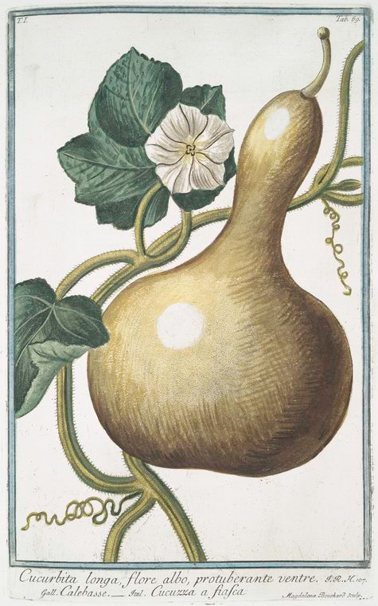
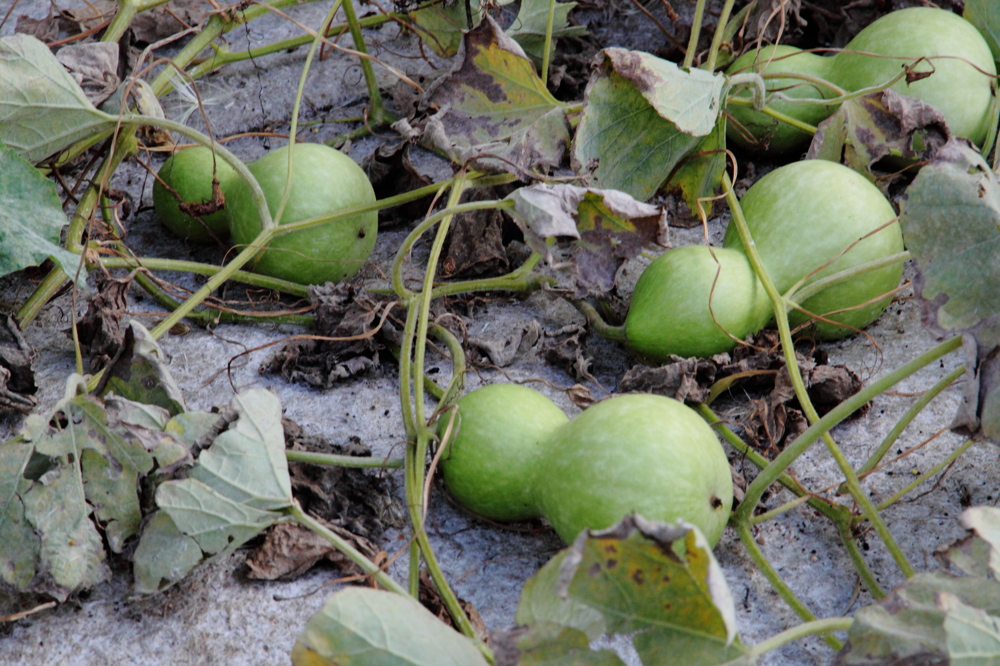
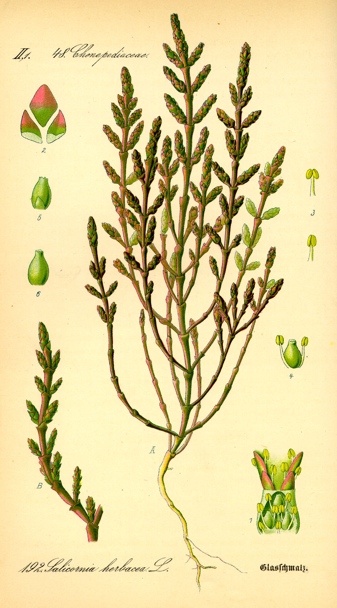
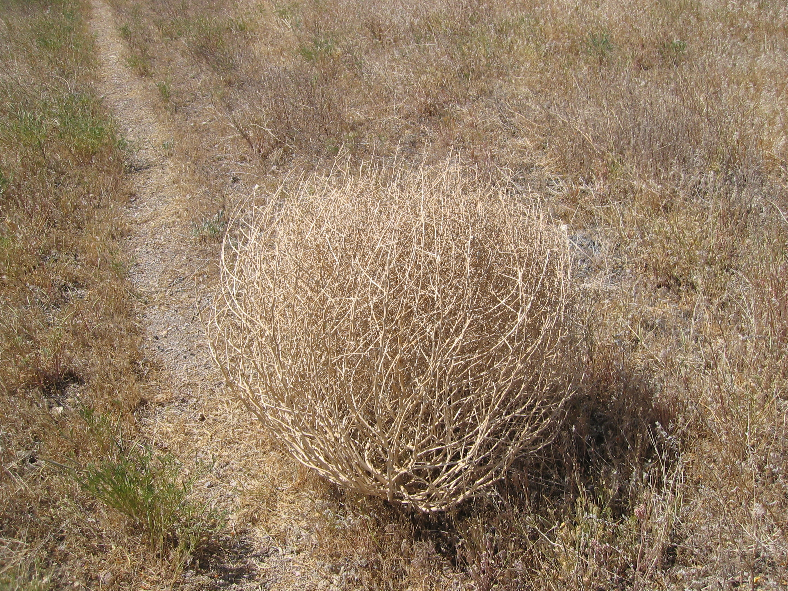
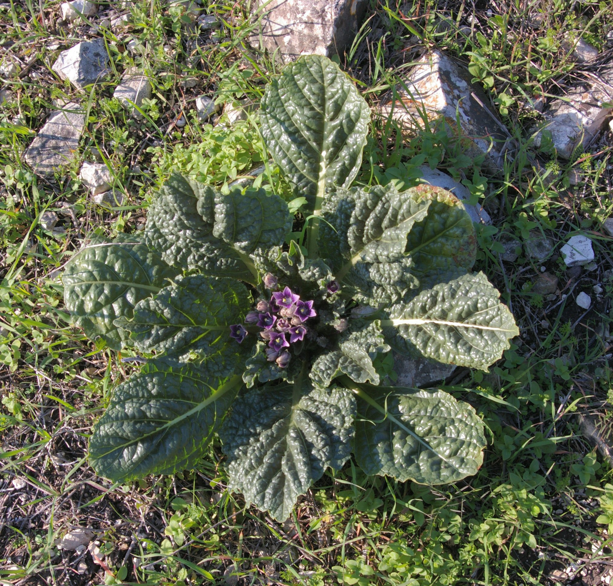
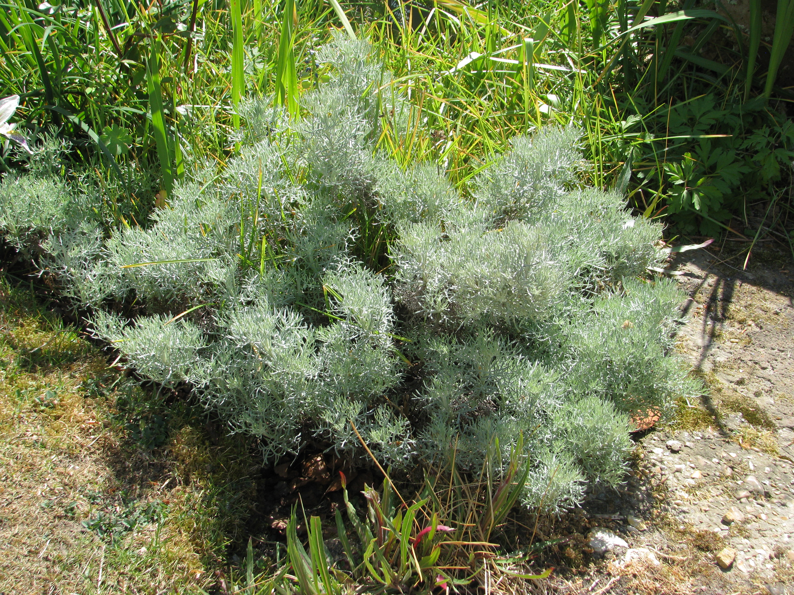

# Plants and Trees in the Bible

## License Information

Plants and Trees in the Bible © United Bible Societies, 2025. Adapted from: <cite>Each According to its Kind: Plants and Trees in the Bible</cite>, by Robert Koops © 2012 United Bible Societies. This work is licensed under Creative Commons Attribution-ShareAlike 4.0 International (<a href="https://creativecommons.org/licenses/by-sa/4.0/">https://creativecommons.org/licenses/by-sa/4.0/</a>).

--------------------------------

## 標題：其他實用的植物 (id: FLORA:5.2)

5\.2 標題：其他實用的植物
===============

本節討論的植物包括葫蘆、梭梭（用於製作鹼液）、曼德拉草、馬郁蘭（牛膝草）、毒參、野瓜和苦艾。雖然後3種可以入藥，但這不是我們在聖經中看到的主要功能，所以我們將其列在這裡，而沒有放在第4章。

## 標題：葫蘆（bottle gourd） (id: FLORA:5.2.1)

5\.2\.1 標題：葫蘆（bottle gourd）
===========================

經文出處
----

Hebrew 來： פְּקָעִים (音譯： peqa‘im)

[1KI 6:18](https://ref.ly/1Kgs6:18), [1KI 7:24](https://ref.ly/1Kgs7:24), [1KI 7:24](https://ref.ly/1Kgs7:24)

討論
--

*葫蘆 (Bonelli (NYPL Digitalcollections))*

葫蘆（學名*Lagenaria siceraria* ）是人類最早種植的植物之一，可作食物，入藥，以及製作各種器皿和樂器。葫蘆原產於非洲，可能在一萬年前左右，由於人為或自然因素被引入到亞洲和美洲。這個植物屬的名稱來自拉丁文*lagoena* ，意思是「長頸瓶」（幾乎可以確定，最早的羅馬長頸瓶就是用乾葫蘆製成）。這種植物的名稱源於拉丁文的「乾」一詞，說明其果實乾了以後很有用。無疑，住在聖地的人們會把切開的葫蘆用作家裡的碗或「長柄勺」，就像我們在非洲和亞洲看到的那樣。但是，聖經中提到葫蘆時，僅僅是說在所羅門聖殿裡的香柏木上刻著葫蘆圖案（[1KI 6:18](https://ref.ly/1Kgs6:18) ），以及聖殿前面的大銅盆裝飾著葫蘆圖案（[1KI 7:24](https://ref.ly/1Kgs7:24); [1KI 7:24](https://ref.ly/1Kgs7:24) ）。祖海里認為，葫蘆也出現在地名「底連」（Dilean，[JOS 15:38](https://ref.ly/Josh15:38) ）中；Dilean源於希伯來文*dela‘ath* ，在聖經成書之後的時期，*dela‘ath* 是葫蘆的希伯來文名稱。

描述
--

葫蘆是一種藤蔓植物，與黃瓜和南瓜一樣。葫蘆的莖是四方形的，有棱，有毛，長度可達5米（17英呎）。葉子為心形，大小和人的手掌差不多，葉緣輕微淺裂。花為黃色，有5個花瓣，花落後結出的果實根據品種不同有許多種形狀。大多數葫蘆的一端是球形，並且帶一個細長的突出部分，所以切成兩半後非常實用，可在廚房裡作大勺子用。

特殊意義
----

*葫蘆 (Hyunjung Kim (Wikimedia Commons))*

數千年來，葫蘆一直用作容器，或者切開後作舀水的器具，另外也用來製作樂器。大多數葫蘆品種的果肉都很苦，有時甚至有毒。在一些國家，有些品種還用作藥物，有通便、驅蟲、治療胸痛和頭痛的功效。在非洲南部，葉子和未成熟的幼果被當作蔬菜食用。

翻譯
--

*葫蘆 (Muséum de Toulouse (Wikimedia Commons))*

在非洲和亞洲的溫帶和熱帶地區，翻譯者應該很容易找到表示葫蘆的詞語。葫蘆在法國稱為*courge bouteille* ，在葡萄牙稱為*abo­bora\-carneira* 或*cabaco* ，在拉丁美洲稱為*calabaza* 或*cogorda* ，在中國稱為「匏瓜」，在印度稱為*lauki* ，在印度尼西亞稱為*labu* ，在日本稱為*hyotan* 或*yugao* ，在馬來西亞稱為*labu ayer* ，在菲律賓稱為*upo* ，在斯里蘭卡稱為*diya labu* ，在泰國稱為*buap khaus* ，在越南稱為*bau* 。

如果當地人們唯一熟知的葫蘆是圓球形的，那麼提供插圖會有助於讀者理解，或者可以在腳註中描述我們所知的聖地葫蘆的特殊形狀。葫蘆與[2KI 4:39](https://ref.ly/2Kgs4:39) 提到的野瓜是近緣物種，這種野瓜使一群先知發生食物中毒（參[5\.2\.6 野瓜（柯羅辛、苦西瓜、藥西瓜）（wild gourd \[colocynth, egusi, bitter apple]）](#FLORA:5.2.6) ）。對於[JON 4:6](https://ref.ly/Jonah4:6) 中的「葫蘆」（"gourd"；KJV (King James Version (1611)) 、REB (Revised English Bible (1989)) ），現在認為該植物是蓖麻（參[4\.2\.2 蓖麻 (castor oil plant \[castor bean plant])](#FLORA:4.2.2) ）。

* **Associated Passages:** 列王紀上 6:18; 列王紀上 7:24; 約書亞記 15:38; 列王紀下 4:39; 約拿書 4:6

* **Associated ACAI Concepts:** Bottle Gourd (ID: `flora:BottleGourd`)

## 標題：梭梭（豬毛菜屬[Salsola]、鹽角草屬[Salicornia]）（hammada [Salsola, Salicornia]） (id: FLORA:5.2.2)

5\.2\.2 標題：梭梭（豬毛菜屬\[Salsola]、鹽角草屬\[Salicornia]）（hammada \[Salsola, Salicornia]）
===============================================================================

經文出處
----

Hebrew 來： בֹּר (音譯： bor)

[JOB 9:30](https://ref.ly/Job9:30), [ISA 1:25](https://ref.ly/Isa1:25)

Hebrew 來： בֹּרִית (音譯： borith)

[JER 2:22](https://ref.ly/Jer2:22), [MAL 3:2](https://ref.ly/Mal3:2)

討論
--

*梭梭 (Otto Wilhelm Thomé Flora von Deutschland, Österreich und der Schweiz 1885, via Kurt Stueber (Wikimedia Commons))*

*拿著乾豬毛菜（「風滾草」）植株的男孩 (Dcrjsr (Wikimedia Commons))*

 耶利米時期的猶太人還沒有肥皂，肥皂要在許多個世紀以後才出現。然而，他們將某些植物的灰與橄欖油混合，做出了一種類似肥皂的東西。其中一種植物是梭梭樹（學名*Hammada salicornica* ），常見於沙漠，阿拉伯文稱為*rimth* 。赫珀說，任何一種家裡產生的灰燼都可以當作肥皂的原料，但是藜科灌木（\[Salsola]豬毛菜屬和\[Salicornia]鹽角草屬、鹽草和海蓬子）的灰特別有效。莫爾登克贊成這個觀點，並進一步補充說，阿拉伯人稱鹽草為*kali* 或*elkali* ，化學術語鹼（alkali）就是由此衍生而來。

描述
--

鹽角草屬（學名\[Salicornia]）有兩種。白梭梭是一種無葉灌木，經常生長在金合歡樹旁邊，高不到1米（3英呎），莖綠色、多節。小花在12月左右開放，所結的小果實裡面有一粒羽翼狀的種子，可以隨風散播。黑梭梭與之類似，但顏色較深，喜砂土，在北非也有分佈。

特殊意義
----

[MAL 3:2](https://ref.ly/Mal3:2) 提到漂布，指的是洗去羊毛織物上的天然油脂，好進行染色。漂布的人把某些植物的灰燼和橄欖油混合，製成我們所說的鹼液或蘇打，然後漂洗衣物，並在漂布場曬乾（參[2KI 18:17](https://ref.ly/2Kgs18:17) ）。漂布所用的鹼液要比肥皂強勁得多，更像是今天的漂白劑，《瑪拉基書》就是用這種「漂布的鹼」來描述上帝對他子民進行的強力清潔。

翻譯
--

我們建議翻譯者先研究當地製作肥皂的方法，了解其中的成分，以找到合適的譯詞。如果要保留[JER 2:22](https://ref.ly/Jer2:22) 中希伯來文本的平行結構，翻譯者需要有兩個表示「使某物潔淨」的詞語。如果沒有「鹼液」（或「蘇打」）的對等詞，翻譯者可以考慮使用當地詩歌中表示擦洗身體之物的文化對等詞，比如西非的絲瓜或浮石。如果需要音譯*Salsola kali* （帶刺的鹽草），可以按照希伯來文*borith* 、阿拉伯文*hurd* 或*shawk ahhmar* 、法文*soude conchee* 或*sonde kali* 、葡萄牙文*barilla espinhosa* 或*soda* 或*trago\-espinhoso* 、西班牙文*abrojos* 或*barella* 或*salsora* 等詞語進行音譯。

* **Associated Passages:** 約伯記 9:30; 以賽亞書 1:25; 耶利米書 2:22; 瑪拉基書 3:2; 列王紀下 18:17

* **Associated ACAI Concepts:** Hammada (ID: `flora:Soap`)

## 標題：曼德拉草（「愛情果」）（mandrake ["love apple"]） (id: FLORA:5.2.3)

5\.2\.3 標題：曼德拉草（「愛情果」）（mandrake \["love apple"]）
================================================

經文出處
----

Hebrew 來： דּוּדָאִים (音譯： duda’im)

[GEN 30:14](https://ref.ly/Gen30:14), [GEN 30:14](https://ref.ly/Gen30:14), [GEN 30:15](https://ref.ly/Gen30:15), [GEN 30:15](https://ref.ly/Gen30:15), [GEN 30:16](https://ref.ly/Gen30:16), [SNG 7:14](https://ref.ly/Song7:14)

討論
--

*曼德拉草植株 (איתן פרמן (Wikimedia Commons))*

解經家對於希伯來文*duda’im* 所指植物的意見不一。許多解經家斷言，這個詞必定是指曼陀羅（毒參茄）或曼德拉草（學名*Mandragora autumnalis* ），但祖海里認為這是不可能的，因為曼陀羅從來沒有生長在美索不達米亞地區，即[GEN 30:14](https://ref.ly/Gen30:14); [GEN 30:15](https://ref.ly/Gen30:15); [GEN 30:16](https://ref.ly/Gen30:16) 的故事所在地。在[SNG 7:14](https://ref.ly/Song7:14) （《和》7:13），*duda’im* 是指一種與蘋果有關的、種植在河岸上的「佳美果子」（不像《創世記》中的*duda’im* 那樣是從地裡挖出來的）。不論這種生長在美索不達米亞的植物原本是什麼物種，當以色列人講述這個故事時，他們使用了一個聽眾都知道的詞，即*duda’im* 。《創世記》的上下文暗示，*duda’im* 與生育能力有關。根據學者們的意見，在聖經時期最受歡迎的助孕植物是曼陀羅。《七十士譯本》和《他爾根》的翻譯者帶著他們自己對於愛和生育的看法，將*duda’im* 置於聖地的背景下，卻無意弄清這種生長在美索不達米亞的植物究竟是什麼。英文譯本參照《七十士譯本》，使用了"mandrake"（「曼德拉草」）一詞。

描述
--

*中世紀書籍中繪製的曼德拉草的根 (Wikimedia Commons)*

曼德拉草是一種沒有莖的草本植物，與土豆和番茄有親緣關係，但長的更貼近地面。葉子為深綠色，長30厘米（1英呎），寬10厘米（4英吋），呈玫瑰狀從中心向外展開。紫色或藍色的花開在靠近植株中心的莖上，果實呈黃色，成熟後看起來像鳥巢裡的蛋。曼德拉草有一種獨特的氣味，有些人覺得香甜，有些人覺得刺鼻。根很粗壯，通常是分叉的，看起來像人的身體，這也許就是它催情的名聲在中東和歐洲遠播的原因，也是「愛情果」這個名字的由來。

特殊意義
----

傳說，曼德拉草具有很多神奇的特性。比如，當曼德拉草從地裡拔出時會發出尖叫聲，葉子在黑暗中會發光。在中世紀，德意志人給它們穿上衣服，向其獻祭，以免冒犯神靈。法蘭西人相信小精靈住在曼德拉草裡面，並要求人們每天獻祭。1630年，漢堡的三名婦女因被控行巫術而處死，原因是她們的家中有曼德拉草的根。阿拉伯人稱曼德拉草為「魔鬼的蠟燭」。

翻譯
--

「曼德拉草」的譯法有：

1\. 使用類似的植物，比如「野生茄子」（如尼日利亞的貝羅姆文），並加上腳註。有些地方可以仿照尼日利亞的豪薩文*gautan daji* （或*yalo* ）。

2\. 使用一個功能對等詞，即當地眾所周知的某種助孕植物，如尼日利亞的蒂夫文的譯法（*mkehem* ）。

3\. 新造一個描述性短語，如「愛情花」（"love flower"；CEV (Contemporary English Version) ）或「愛情果」。

4\. 按照希伯來文*duda’im* 或某種主要語言進行音譯，如英文*mandaraki* 或法文*mandragore* ，並在腳註中說明這種植物可能被人認為具有助孕能力。在音譯時，建議增加「的根」一語，說明是這種植物的根產生效力。

* **Associated Passages:** 創世記 30:14; 創世記 30:15; 創世記 30:16; 雅歌 7:14

* **Associated ACAI Concepts:** Mandrake (ID: `flora:Mandrake`)

## 標題：馬郁蘭（marjoram） (id: FLORA:5.2.4)

5\.2\.4 標題：馬郁蘭（marjoram）
========================

經文出處
----

Hebrew 來： אֵזוֹב (音譯： ’ezov)

[EXO 12:22](https://ref.ly/Exod12:22), [LEV 14:4](https://ref.ly/Lev14:4), [LEV 14:6](https://ref.ly/Lev14:6), [LEV 14:49](https://ref.ly/Lev14:49), [LEV 14:51](https://ref.ly/Lev14:51), [LEV 14:52](https://ref.ly/Lev14:52), [NUM 19:6](https://ref.ly/Num19:6), [NUM 19:18](https://ref.ly/Num19:18), [1KI 5:13](https://ref.ly/1Kgs5:13), [PSA 51:9](https://ref.ly/Ps51:9)

Greek 希： ὕσσωπος (音譯： hussōpos)

[JHN 19:29](https://ref.ly/John19:29), [HEB 9:19](https://ref.ly/Heb9:19)

討論
--

*馬郁蘭（牛膝草） (Ray Pritz (UBS))*

*馬郁蘭花 (Gidip (Wikimedia Commons))*

 祖海里、赫珀和ABD (Anchor Bible Dictionary) 都認為希伯來文*’ezov* 可能是指馬郁蘭（學名*Origanum syriacum* 或*Majorana syriaca* ）。《七十士譯本》的翻譯者決定使用希臘文名稱*hussōpos* （意為「牛膝草」，英文"hyssop"）為譯詞，這個詞通常是指一種歐洲植物，類似聖地的馬郁蘭。有些植物學家把聖經中提到的馬郁蘭稱為「敘利亞牛膝草」，帶來了更大的困惑。《國際標準聖經百科全書》（*The International Standard Bible Encyclopedia* ）指出，*’ezov* 可能包括多種植物。我們認為「敘利亞牛膝草」這個名稱太過於以歐洲為中心，故建議譯成「馬郁蘭」。*’Ezov* 和*hussōpos* 是同源詞。19世紀和20世紀的一些植物學家查考了「刺山柑」的阿拉伯文（*el asaf* ，後來演變成*lassaf* ），並推測五經中的*’ezov* 必定是指這種盛產於埃及和阿拉伯沙漠的刺山柑灌木（參[3\.5\.1 刺山柑（刺山柑灌木、刺山柑漿果）(Caper \[caper bush, caper berry])](#FLORA:3.5.1) ）。的確，在[1KI 5:13](https://ref.ly/1Kgs5:13) （《和》4:33），牆上長的刺山柑灌木比馬郁蘭更說得通。*’Ezov* 是猶太人在潔淨禮儀時所需要的植物。是否存在以下可能：當希伯來人進入應許之地後，他們在那裡發現了很多馬郁蘭，潔淨禮儀隨之發生改變，*’ezov* 「符合律法」的定義發生了延伸，從而將馬郁蘭包含在內呢？馬郁蘭是一種多毛植物，淋灑水非常方便。因此，新約《約翰福音》中的*hussōpos* 一詞指馬郁蘭的莖是很有可能的。

描述
--

馬郁蘭植株高50—80厘米（20—32英吋），葉小，有很多分枝。莖上長著很多茸毛，因此很適合做刷子。馬郁蘭的花是白色的。葉子和莖可以提取油脂，加在肥皂或乳液中以添加香氣。

特殊意義
----

在現今的歐洲和中東，馬郁蘭被用作調味品，聖經時期可能也是這樣。但是，聖經記載這種植物是用作刷子。以色列人快要出埃及的時候，摩西吩咐他們把血塗在門框上，給滅命的天使作越過的記號，他們就是用這種植物塗血的。這個事件標誌著逾越節的開始，猶太人從此謹守逾越節。在[PSA 51:9](https://ref.ly/Ps51:9) （《和》51:7），*’ezov* 象徵靈性上的潔淨。提到這個詞的第三處經文是[1KI 5:13](https://ref.ly/1Kgs5:13) （《和》4:33；所涉問題見下文討論），這裡*’ezov* 指一種不起眼的植物，與高大佳美的黎巴嫩香柏樹作對比。

翻譯
--

有很多英文譯本出於尊重傳統，用"hyssop"（「牛膝草」）來翻譯*’ezov* ；REB (Revised English Bible (1989)) 沒有採用這種譯法。翻譯者沒有必要延續這個傳統，應該盡量採用在植物學上更正確的「馬郁蘭」一詞。

[EXO 12:22](https://ref.ly/Exod12:22) a：「要拿一把牛膝草（*’ezov* ），蘸盆裡的血。」在《出埃及記》的經文中，*’ezov* 的功用比植物本身是什麼更為重要。翻譯者即使採用「esov的枝子」這樣的音譯，也應該使用「灑」這樣的動詞來激發讀者對這個畫面的想象。如果翻譯者選擇使用當地通常用於淋灑水的植物，那麼需要增加腳註說明原文所指植物是什麼。如果翻譯者習慣音譯英文，那麼最好音譯"marjoram"（「馬郁蘭」），而非"hyssop"（「牛膝草」）。此外，翻譯者還可以音譯拉丁文*majorana* 、西班牙文*mejorana* 或阿拉伯文*mardakush* 等詞語。綜上所述，「馬郁蘭」的部分譯法如下：

1\. 一般性的表述，如「葉子」；

2\. 音譯（見上文）；

3\. 替代成當地一種用來點灑水的植物，並加腳註。

西非有多種馬郁蘭的近緣植物，翻譯者可從中選擇。在這些候選植物中，有一種葉子帶毛的植物生長在岡比亞，被用作驅蚊劑。尼日利亞的蒂夫族稱同一種植物為*huuhuu* ，尼日利亞的艾特薩克族（Etsako）稱其為「蚊草」。這種植物的葉子有一種辛辣的味道，並且因為多毛而適合做刷子。

[1KI 5:13](https://ref.ly/1Kgs5:13) a（《和》4:33a）：「他（所羅門）講論草木，從黎巴嫩的香柏樹直到牆上長的牛膝草（*’ezov* ）」（「草木」在RSV (Revised Standard Version (1952)) 作"trees"「各種樹木」）。這節經文有三個不解之處：

1\. 馬郁蘭（類似歐洲牛膝草）不是一種樹，而是一種相對低矮的植物，長著細小的葉子和白色的花。如果目標語言中有涵蓋「樹」和「植物」的統稱，翻譯者應該使用該詞語。德弗里斯（De Vries）認為，希伯來文*‘ets* （「樹」）的含義比英文"tree"（「樹」）更廣，因為這個詞還包含了我們所說的藤本植物（參[EZK 15:2](https://ref.ly/Ezek15:2) ）。儘管如此，將*‘ets* 這個詞延伸到涵蓋馬郁蘭這樣的草本植物在內也是很牽強的，這也是一些學者仍然不相信*’ezov* 是馬郁蘭的原因之一。例如，赫珀傾向於同意特里斯特拉姆（Tristram）和鮑爾弗（Balfour）的意見，這兩人在19世紀末提出，*’ezov* 在這裡指的是刺山柑灌木（參[3\.5\.1 刺山柑（刺山柑灌木、刺山柑漿果）(Caper \[caper bush, caper berry])](#FLORA:3.5.1) ）。他們的觀點有一部分是基於同源詞的證據：刺山柑灌木的阿拉伯文是*lassaf* （源於*el asaf* ），這個詞似乎與*’ezov* 同源，但馬郁蘭的阿拉伯文（*zaatar* ）卻與之完全無關。有人可能會說，刺山柑也不是樹，但很重要的是，它確實有木質的莖。

2\. 「牆上長的*’ezov* 」這個短語很奇怪，因為實際上，馬郁蘭通常不會長在牆縫裡面。馬郁蘭性喜岩質土壤，但是不太可能長到牆上。即使對小學生來說，這個植物學上的細節也是顯而易見的，難道偉大的生物學家所羅門王會在這上面出錯嗎？

3\. 在這節經文裡，從文學的角度來說，與馬郁蘭相比，從牆縫中長出的植物更能與高大的香柏樹形成鮮明的對比。上文提到的刺山柑是一個很好的備選，因為這種植物確實生長在城牆的裂縫中，而且與香柏樹形成強烈對比。然而，較晚期的植物學家並不贊同這種意見，並且其他多處出現該詞的經文也不適合譯成刺山柑。以色列人在出埃及時，用一束*’ezov* 把血塗在門框上。馬郁蘭的莖多毛，非常適合作此用途，刺山柑灌木卻不是特別適合。那麼，*’ezov* 是否可能在不同的語境中指不同的植物呢？這並非沒有先例。例如，祖海里認為希伯來文*berosh* 在有些經文中指「柏樹」，在另一些經文中指「杉樹」（參[1\.6 柏樹 (cypress)](#FLORA:1.6) ）。希伯來文*suf* 也出現了相同的情況，這個詞可以指「香蒲」，也可以指「海藻」（參[5\.1\.1 香蒲 (cattail \[reed\-mace])](#FLORA:5.1.1) ）。

還有最後一個證據，然而遺憾的是，這個證據也沒能解決爭議。這個證據是：刺山柑灌木在曠野非常多見，而馬郁蘭更多生長在人們開墾的濕潤梯田上。所以，或許在以色列人出埃及的時候，還可以在那裡找到馬郁蘭，但在曠野就沒有了。因此，他們難道是出於迫不得已，才在灑血禮儀上使用刺山柑灌木嗎？

[1KI 5:13](https://ref.ly/1Kgs5:13) （《和》4:33）中的*’ezov* 譯法總結如下：

1\. 音譯*’ezov* （*esobu* 、*esofi* ）或馬郁蘭（*marjoramu* 、*macora* ）；

2\. 替代成當地一種可以長在牆上的植物。

以下是這節經文前半部分的一個翻譯示例：「所羅門講論各樣草木／植物，從黎巴嫩（山上）高大的香柏樹一直到城牆上面（低矮）的majoram/esob/kaper/kafer/asafu。」

* **Associated Passages:** 出埃及記 12:22; 利未記 14:4; 利未記 14:6; 利未記 14:49; 利未記 14:51; 利未記 14:52; 民數記 19:6; 民數記 19:18; 列王紀上 5:13; 詩篇 51:9; 約翰福音 19:29; 希伯來書 9:19; 以西結書 15:2

* **Associated ACAI Concepts:** Hyssop (ID: `flora:Hyssop`)

## 標題：毒參（poison hemlock [black henbane, gall]） (id: FLORA:5.2.5)

5\.2\.5 標題：毒參（poison hemlock \[black henbane, gall]）
====================================================

經文出處
----

Hebrew 來： רֹאשׁ, רוֹשׁ (音譯： ro’sh, rosh)

[DEU 29:17](https://ref.ly/Deut29:17), [DEU 32:32](https://ref.ly/Deut32:32), [PSA 69:22](https://ref.ly/Ps69:22), [JER 8:14](https://ref.ly/Jer8:14), [JER 9:14](https://ref.ly/Jer9:14), [JER 23:15](https://ref.ly/Jer23:15), [LAM 3:5](https://ref.ly/Lam3:5), [LAM 3:19](https://ref.ly/Lam3:19), [HOS 10:4](https://ref.ly/Hos10:4), [AMO 6:12](https://ref.ly/Amos6:12)

Greek 希： χολή (音譯： cholē)

[MAT 27:34](https://ref.ly/Matt27:34), [ACT 8:23](https://ref.ly/Acts8:23)

討論
--

*天仙子（黑莨菪） (Franz Eugen Köhler, Köhler's Medizinal\-Pflanzen (Wikimedia Commons))*

*毒參 (Franz Eugen Köhler, Köhler's Medizinal\-Pflanzen (Wikimedia Commons))*

 祖海里提出，希伯來文*ro’sh* /*rosh* 最初可能是某種有毒植物的名稱，後來推及到許多產生毒素的植物。*Ro’sh* /*rosh* 常譯作「毒藥」，也可指提取自毒參（學名*Conium maculatum* ；英文Poison Hemlock）的毒芹鹼。毒參隸於傘形科，與另一種英文同名的常綠樹（Hemlock，鐵杉）沒有親緣關係。赫珀說，[HOS 10:4](https://ref.ly/Hos10:4) （「……如苦菜滋生在田間的犁溝中」）中的*ro’sh* 一詞可能不是指毒參，因為毒參通常不會生長在田地裡。根據他的意見，這節經文更可能是指有脈紋的天仙子（學名*Hyoscyamus reticulatus* ）。舊約提到*ro’sh* /*rosh* 有10次，在《七十士譯本》中有5次譯作希臘文*cholē* （「苦膽」）。這表明*ro’sh/rosh* 是作為統稱使用的，指一種味苦的有毒物質，並且不一定源於植物。[DEU 32:33](https://ref.ly/Deut32:33) 提到的*ro’sh* 出自蛇，《次經‧多比傳》（《思》《多俾亞傳》）中的*cholē* 出自魚（[TOB 6:4](https://ref.ly/Tob6:4); [TOB 6:5](https://ref.ly/Tob6:5); [TOB 6:7](https://ref.ly/Tob6:7) ，[TOB 6:9](https://ref.ly/Tob6:9) ，[TOB 11:4](https://ref.ly/Tob11:4) ，[TOB 11:8](https://ref.ly/Tob11:8) ，[TOB 11:11](https://ref.ly/Tob11:11) ）。

[MRK 15:23](https://ref.ly/Mark15:23) 記載，耶穌在馬上被釘十字架的時候，有人（可能是他的門徒）拿「沒藥調和的酒」給他作鎮靜劑。馬太有意呼應[PSA 69:22](https://ref.ly/Ps69:22) a（RSV (Revised Standard Version (1952)) 直譯「他們拿毒藥給我當食物」；「毒藥」在《七十士譯本》作*cholē* ；《和》69:21a），寫道：「士兵拿苦膽調和的酒給耶穌喝」（[MAT 27:34](https://ref.ly/Matt27:34) ）；他使用了希臘文中表示苦膽／毒藥的統稱*cholē* ，以此強調救主承受的羞辱。

描述
--

毒參的高度為1\.5—2\.5米（5—8英呎）。莖綠色、表面光滑，靠底部的地方長有紫色或紅色的條紋。葉子像胡蘿蔔葉一樣呈花邊狀，葉長可達半米（2英呎），白色小花成簇生長，呈小傘狀。因此，毒參可能會被誤認為是歐芹或野生胡蘿蔔。根很粗壯，像歐洲防風草的根。葉子和根均散發出一種苦味。

兩年生天仙子具有不同的形態，但一般可以長到1米（3英呎）或者更高（包括花在內）。莖直立，多分枝，長有白色的傘狀花序。灰綠色的卵形葉子尖端銳利，葉長可達30厘米（1英呎），葉面覆滿具有黏性的毛。

在古代，希臘和阿拉伯的醫生用毒參作鎮靜劑，但過量服用將會致命，或者會導致語言能力喪失或癱瘓。天仙子（英文henbane，意為「殺雞藥」）曾被希臘人用作催眠和止痛的藥物。歐洲人在中世紀就使用天仙子，11世紀的盎格魯\-撒克遜醫學著作在「亨貝爾」（henbell）的名目下提到了天仙子。從毒參中提取的毒素叫做「毒芹鹼」。

翻譯
--

舊約中所有提及*ro’sh* /*rosh* 的經文都是修辭性的，因此翻譯者可以自由尋找富有表現力的當地詞語作為譯詞。另外，由於毒藥經常用於打獵、捕魚或滅鼠，因此大多數語言都會有表示毒藥的詞。經文提到*ro’sh* /*rosh* 時，有一半與希伯來文*la‘anah* 成對出現（參[5\.2\.7 苦艾 (wormwood)](#FLORA:5.2.7) ），因此翻譯者需要尋找一個合適的詞對。如果沒有表示「毒藥」的詞語，那麼也可以用有毒植物的名稱來替代這對詞語。毒參遍佈中歐、南歐、亞洲和北非，並被引進北美和南美。野生天仙子遍佈歐洲中部和南部、西亞、印度，一直到西伯利亞，現今也生長在北美和南美，特別是巴西。天仙子屬（學名*Hyoscyamus* ）的一個近緣物種生長範圍廣泛，從加那利群島起，經北非一直到亞洲都有發現。

* **Associated Passages:** 申命記 29:17; 申命記 32:32; 詩篇 69:22; 耶利米書 8:14; 耶利米書 9:14; 耶利米書 23:15; 耶利米哀歌 3:5; 耶利米哀歌 3:19; 何西阿書 10:4; 阿摩司書 6:12; 馬太福音 27:34; 使徒行傳 8:23; 申命記 32:33; 多俾亞傳 6:4; 多俾亞傳 6:5; 多俾亞傳 6:7; 多俾亞傳 6:9; 多俾亞傳 11:4; 多俾亞傳 11:8; 多俾亞傳 11:11; 馬可福音 15:23

* **Associated ACAI Concepts:** Poisonous Hemlock (ID: `flora:PoisonousHemlock`)

## 標題：野瓜（柯羅辛、苦西瓜、藥西瓜）（wild gourd [colocynth, egusi, bitter apple]） (id: FLORA:5.2.6)

5\.2\.6 標題：野瓜（柯羅辛、苦西瓜、藥西瓜）（wild gourd \[colocynth, egusi, bitter apple]）
========================================================================

經文出處
----

Hebrew 來： גֶּפֶן סְדוֹם (音譯： gefen sedom)

[DEU 32:32](https://ref.ly/Deut32:32), [DEU 32:32](https://ref.ly/Deut32:32)

Hebrew 來： פַּקֻּעֹת שָׂדֶה (音譯： paqu‘oth sadeh)

[2KI 4:39](https://ref.ly/2Kgs4:39), [2KI 4:39](https://ref.ly/2Kgs4:39)

討論
--

*柯羅辛藤 (Ji\-Elle (Wikimedia Commons))*

[2KI 4:39](https://ref.ly/2Kgs4:39) 提到的先知門徒可能來自城裡。他出去摘「菜」時甚至可能不知道該採些什麼。他發現了一棵*gefen sadeh* （字面意為「田間的藤」）。希伯來文*gefen* 泛指攀爬或纏繞的植物，但是和英文"vine"（「藤」）一樣，這個詞也可以特指葡萄藤。在這節經文中，這個詞指的是野瓜或柯羅辛（藥西瓜），一種在乾燥氣候裡常見的藤本植物。柯羅辛的果實（*paqu‘oth* ）有幾分毒性，不過瓜的粉末可作藥用。柯羅辛除了生長在沿海平原之外，現仍生長在約旦河谷靠近吉甲的地方，據說先知門徒的故事就發生在那裡。根據赫珀的研究，在主後54年，羅馬皇帝革老丟就是被他的妻子用柯羅辛毒死的。相關的希伯來文*peqa‘im* 出現在其他地方，指葫蘆的果實（參[5\.2\.1 葫蘆 (bottle gourd)](#FLORA:5.2.1) ）。

*長在藤上的柯羅辛 (H. Zell (Wikimedia Commons))*

赫珀認為，摩西的歌（[DEU 32:32](https://ref.ly/Deut32:32) ）提到的「所多瑪的葡萄樹」（希伯來文*gefen sedom* ）可能是柯羅辛（學名*Citrullus colocynthis* ）。雖然這個比喻很恰當，但經文本身可能根本不是指一種有毒的植物，而僅僅是把悖逆頑梗的以色列人比作罪惡的所多瑪人。赫珀還指出，[DEU 29:17](https://ref.ly/Deut29:17) （《和》29:18）、[PSA 69:22](https://ref.ly/Ps69:22) （《和》69:21）、[JER 8:14](https://ref.ly/Jer8:14) 、[JER 9:14](https://ref.ly/Jer9:14) （《和》9:15）、[JER 23:15](https://ref.ly/Jer23:15) 和[AMO 6:12](https://ref.ly/Amos6:12) 中的希伯來文*ro’sh* 所指的植物可能就是柯羅辛（參[5\.2\.2 梭梭（豬毛菜屬\[Salsola]、鹽角草屬\[Salicornia]））（hammada \[Salsola, Salicornia]）](#FLORA:5.2.2) ）。

描述
--

柯羅辛藤與西瓜藤、黃瓜藤和葫蘆藤很相似。根粗壯，富含水分，可以深深紮入土裡。莖匍匐於地，捲鬚纏在灌木或籬笆上。葉子呈三角形，葉緣淺裂，像西瓜的葉子。花朵黃色，果實黃色、球形，大小如大蘋果或西柚。果殼堅硬光滑，果肉鬆軟，種子白色或棕色。

特殊意義
----

*柯羅辛 (Franz Eugen Köhler, Köhler's Medizinal\-Pflanzen (Wikimedia Commons))*

西奈半島和尼革夫西部的阿拉伯人供應柯羅辛給醫藥市場，用於治療胃病和通便。在食物匱乏的時期，人們會把柯羅辛的種子磨成麵做麵包。在存放羊毛衣物時，柯羅辛也可用來驅蛾。

翻譯
--

柯羅辛生長在整個地中海地區和西亞。有些翻譯者的語言可能沒有一個表示攀緣植物的統稱，但他們可能有「植物」這個更一般性的詞語，或者也可以採用「野生黃瓜」這樣的短語。需要記住的一點是：[2KI 4:39](https://ref.ly/2Kgs4:39) 中的希伯來文短語*paqu‘oth sadeh* （「野瓜」）是個籠統的名稱，先知門徒自己也不認識這種果實。因此，只有使用較為籠統的詞語為譯詞，這個故事才最合理。聖經植物學家非常確定這個門徒發現的瓜藤就是柯羅辛，但從某種意義上說，這並非故事的重點，因為故事的目的在於顯明上帝的奇妙大能。

如果要音譯「柯羅辛」，翻譯者可以按照法文*coloquinthe* 、西班牙／葡萄牙文*coloquinta* ，或阿拉伯文*banzal* 來音譯。

* **Associated Passages:** 申命記 32:32; 列王紀下 4:39; 申命記 29:17; 詩篇 69:22; 耶利米書 8:14; 耶利米書 9:14; 耶利米書 23:15; 阿摩司書 6:12

* **Associated ACAI Concepts:** Colocynth (ID: `flora:Colocynth`)

## 標題：苦艾（wormwood） (id: FLORA:5.2.7)

5\.2\.7 標題：苦艾（wormwood）
=======================

經文出處
----

Hebrew 來： לַעֲנָה (音譯： la‘anah)

[DEU 29:17](https://ref.ly/Deut29:17), [PRO 5:4](https://ref.ly/Prov5:4), [JER 9:14](https://ref.ly/Jer9:14), [JER 23:15](https://ref.ly/Jer23:15), [LAM 3:15](https://ref.ly/Lam3:15), [LAM 3:19](https://ref.ly/Lam3:19), [AMO 5:7](https://ref.ly/Amos5:7), [AMO 6:12](https://ref.ly/Amos6:12)

Greek 希： ἄψινθος (音譯： apsinthos)

[REV 8:11](https://ref.ly/Rev8:11), [REV 8:11](https://ref.ly/Rev8:11)

討論
--

*苦艾 (איתמר יפעת (Wikimedia Commons))*

希伯來文*la‘anah* 在字面上是指一種植物，但在舊約中只用作比喻，表示某種味道非常苦的東西。儘管證據很少，但解經家和植物學家一致認為，這個詞可能指一種從白苦艾中提取的物質。白苦艾盛產於聖地的曠野。

描述
--

*白苦艾 (Steve Law (Wikimedia Commons))*

白苦艾（學名*Artemisia herba\-alba* ）是一種不到半米（18英吋）高的灌木。葉子毛絨絨的，葉片細碎，在以色列涼爽的雨季結束時掉落，葉片在炎熱的季節會變為鱗片狀。在9月或10月左右，苦艾花以2至4朵成簇開放，並結成多毛的小果實。植物成熟後，把葉子和花曬乾可以製成一種非常苦的茶，或者磨成粉、製成膏或油以入藥。

特殊意義
----

舊約提到苦艾時，大多與希伯來文*ro’sh* （「毒藥／苦膽」）一詞成對使用，喻指痛苦的經歷和悲傷（參[5\.2\.5 毒參 (poison hemlock \[black henbane, gall])](#FLORA:5.2.5) ）。[REV 8:11](https://ref.ly/Rev8:11); [REV 8:11](https://ref.ly/Rev8:11) 提到，一顆名叫茵陳（希臘文*apsinthos* ）的星星使地上三分之一的水變苦且有毒。苦艾葉的味道很苦。少量的苦艾可用作麻醉劑，歐洲人用它來調酒（苦艾酒）。苦艾也可用來驅除飛蛾、跳蚤和腸道寄生蟲。

翻譯
--

聖地的白苦艾遍佈中東、北非（埃及、摩洛哥）和歐洲西南部，然而全世界至少有300種蒿屬（學名*Artemisia* ）植物，通常分佈在乾旱地區。中國的一種蒿屬植物（「黃花蒿」）被用作抗瘧疾的藥物。山道年蒿（學名*Artemisia cina* ）和驅蛔蒿（學名*Artemisia maritima* ）生長在歐亞大陸，從中提取的山道年（學名*Santonica* ）是一種驅腸蟲藥。因紐特人把青蒿（學名*Artemisia tilesii* ）當作可待因使用。美國西部的山艾樹也隸於蒿屬，美洲土著人曾將其用於多種用途。

大多數語言都有指稱葉子和／或根味苦植物的詞語。因為在舊約中提到苦艾的經文都是比喻性的，所以翻譯者可以使用當地的這類植物來表達經文的中心意思。如上所述，*la‘anah* 大多與*ro’sh* 成對出現，所以在這些經文中，這兩個詞要一起處理。如果沒有具體的植物，可以使用「苦果子」、「苦香料」或「苦物」等短語。如果需要，可以按照法文*absinthe* 、葡萄牙文*absinto* 或*losna* ，或者西班牙文*absintio* 或*ajenjo* 來音譯。

* **Associated Passages:** 申命記 29:17; 箴言 5:4; 耶利米書 9:14; 耶利米書 23:15; 耶利米哀歌 3:15; 耶利米哀歌 3:19; 阿摩司書 5:7; 阿摩司書 6:12; 啟示錄 8:11

* **Associated ACAI Concepts:** Wormwood (ID: `flora:Wormwood`)
