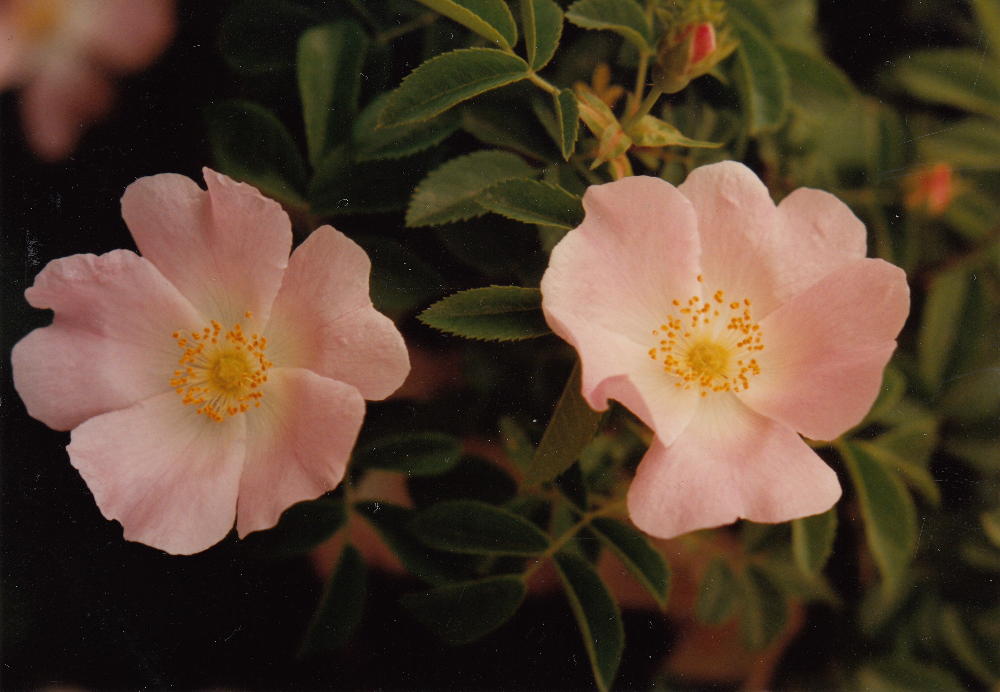
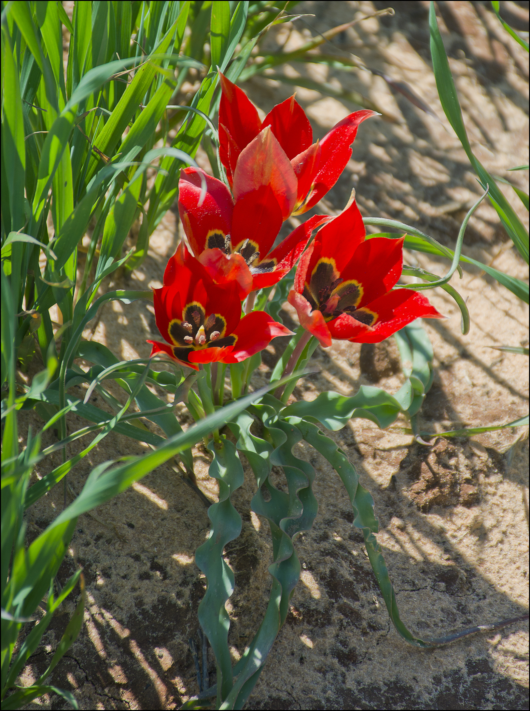

# Plants and Trees in the Bible

## License Information

Plants and Trees in the Bible © United Bible Societies, 2025. Adapted from: <cite>Each According to its Kind: Plants and Trees in the Bible</cite>, by Robert Koops © 2012 United Bible Societies. This work is licensed under Creative Commons Attribution-ShareAlike 4.0 International (<a href="https://creativecommons.org/licenses/by-sa/4.0/">https://creativecommons.org/licenses/by-sa/4.0/</a>).

--------------------------------

## 標題：花 (id: FLORA:6.1)

6\.1 標題：花
=========

有了以上的提醒，我們現在來討論我們認為可能是統指「花」的希伯來文和希臘文詞語。

希伯來文*tsits* 和*tsitsah* 出現了12次，意思是「花朵」或「花」。[NUM 17:23](https://ref.ly/Num17:23) （《和》17:8）記載，亞倫的杖「開了花」。所羅門聖殿的牆和門上都刻著「綻開的花」（[1KI 6:18](https://ref.ly/1Kgs6:18); [1KI 6:29](https://ref.ly/1Kgs6:29); [1KI 6:32](https://ref.ly/1Kgs6:32); [1KI 6:35](https://ref.ly/1Kgs6:35) ）。有幾位聖經作者用*tsits* 來形容人生的短暫（[JOB 14:2](https://ref.ly/Job14:2); [PSA 103:15](https://ref.ly/Ps103:15); [ISA 28:1](https://ref.ly/Isa28:1); [ISA 40:6](https://ref.ly/Isa40:6); [ISA 40:7](https://ref.ly/Isa40:7); [ISA 40:8](https://ref.ly/Isa40:8) ）。*Tsits* 的動詞形式（*tsuts* ）出現在[NUM 17:23](https://ref.ly/Num17:23) （《和》17:8）、[ISA 27:6](https://ref.ly/Isa27:6) 和[EZK 7:10](https://ref.ly/Ezek7:10) 中。這個希伯來文詞語在希臘文中的對等詞是*anthos* ，見於[JAS 1:10](https://ref.ly/Jas1:10); [JAS 1:11](https://ref.ly/Jas1:11) 和[1PE 1:24](https://ref.ly/1Pet1:24); [1PE 1:24](https://ref.ly/1Pet1:24) （引自[ISA 40:6](https://ref.ly/Isa40:6) ）。作者使用*tsits* 和*anthos* 這兩個詞時，是否指某種具體的植物呢？我們不得而知，因為符合描述的花有幾十種。當然，這對翻譯者來說就非常方便了，因為他們可以自由地選擇符合上下文的植物，《七十士譯本》、《武加大譯本》和KJV (King James Version (1611)) 的翻譯者就是這樣做的。我們在很多譯本的[SNG 2:1](https://ref.ly/Song2:1) 中，都能看到「沙崙的玫瑰」一語，原因也在於此。

希伯來文*nets* 出現在[GEN 40:10](https://ref.ly/Gen40:10) ，那裡提到法老的司酒長夢見一棵葡萄樹開了「花」。這個詞語也出現在[SNG 2:12](https://ref.ly/Song2:12) ，經文描寫：當地上的「百花」綻放時，歌唱的時候就到了。聖地有很多種紅色的花在春天開放。有意思的是，在伊拉克人所講的阿拉伯語中，有一個指這些花的同源詞（*nissan* ），祖海里（Zohary）認為，這個詞證實了希伯來曆中的尼散月與百花開放有聯繫的說法。與之相關的希伯來文名詞*nitstah* 出現在[JOB 15:33](https://ref.ly/Job15:33) 中，指的是橄欖樹的花；這個詞也出現在[ISA 18:5](https://ref.ly/Isa18:5) 中，指葡萄樹的花。與之相關的希伯來文動詞*natsats* （「開花」）出現在[ECC 12:5](https://ref.ly/Eccl12:5) 、[SNG 6:11](https://ref.ly/Song6:11) 和[SNG 7:13](https://ref.ly/Song7:13) （《和》7:12）中。

這裡還要提到希伯來文動詞*parach* ，這個詞一共出現了14次，意思是「開花」；名詞形式是*perach* ，一共出現了15次。[EXO 25:31](https://ref.ly/Exod25:31); [EXO 25:31](https://ref.ly/Exod25:31); [EXO 25:32](https://ref.ly/Exod25:32); [EXO 25:33](https://ref.ly/Exod25:33); [EXO 25:34](https://ref.ly/Exod25:34); [EXO 25:35](https://ref.ly/Exod25:35); [EXO 25:36](https://ref.ly/Exod25:36); [EXO 25:37](https://ref.ly/Exod25:37); [EXO 25:38](https://ref.ly/Exod25:38); [EXO 25:39](https://ref.ly/Exod25:39); [EXO 25:40](https://ref.ly/Exod25:40) 、[EXO 37:17](https://ref.ly/Exod37:17); [EXO 37:18](https://ref.ly/Exod37:18); [EXO 37:19](https://ref.ly/Exod37:19); [EXO 37:20](https://ref.ly/Exod37:20); [EXO 37:21](https://ref.ly/Exod37:21); [EXO 37:22](https://ref.ly/Exod37:22); [EXO 37:23](https://ref.ly/Exod37:23); [EXO 37:24](https://ref.ly/Exod37:24) 和[NUM 8:4](https://ref.ly/Num8:4) 在描述金燈臺時使用了*perach* 一詞，該提及非常重要。在這些經文中，作者把燈臺比作一個有莖有花的開花植物。七個枝子的頂端在希伯來文中被稱為*perach* ，在《七十士譯本》中作*krinon* 。這表明，《七十士譯本》的翻譯者認為希臘文*krinon* 泛指「花形的物件」或「花」。另一方面，[1KI 7:26](https://ref.ly/1Kgs7:26) 在描述聖殿中的大銅海時，希伯來文本說它的邊緣如*perach shushan* （「*shushan* 花」），《七十士譯本》譯為*blastos krinou* （「*krinon* 花」），這可能表明*shushan* 和*krinon* 都是指某種特定的花或一些花瓣彎曲的花（RSV (Revised Standard Version (1952)) 和GNB (Good News Bible) 譯為"lily"「百合花」）。此外，在[SNG 2:1](https://ref.ly/Song2:1) 中，*chavatseleth* 與*shushan* 平行，表明它們都是某種特定的花。這個問題關係到如何解釋許多其他不確定是特指某種花還是泛指花的經文，例如福音書中的短語「野地裡的百合花」（[MAT 6:28](https://ref.ly/Matt6:28) ；[LUK 12:27](https://ref.ly/Luke12:27) ）。馬太和路加使用了希臘文*krinon* ，但該詞在這裡很可能是統稱，指很多花，或者指某種常見的花，因為那時的「野地裡」還沒有真正的百合花。（白色的百合花只生長在森林裡。）*krinon* 可能指稱的花有冠狀銀蓮花、紅毛莨、罌粟、春菊或狗甘菊。

希臘文*anthos* 出現在[WIS 2:7](https://ref.ly/Wis2:7) 、[SIR 24:17](https://ref.ly/Sir24:17) 、[SIR 39:14](https://ref.ly/Sir39:14) 、[SIR 50:8](https://ref.ly/Sir50:8) 、[SIR 51:15](https://ref.ly/Sir51:15) 和[3MA 7:16](https://ref.ly/3Macc7:16) 中。在[WIS 2:7](https://ref.ly/Wis2:7) 中，這個詞似乎是指整棵開花植物，除此之外都是指「花朵」，即開花植物上面長著花瓣的那一部分。[SIR 50:8](https://ref.ly/Sir50:8) 提到了具體的花名——玫瑰（參[6\.1\.4 玫瑰（腓尼基玫瑰）（rose \[phoenician rose]）](#FLORA:6.1.4) ）。

拉丁文*flos* 出現在[2ES 5:24](https://ref.ly/2Esd5:24) 、[2ES 5:36](https://ref.ly/2Esd5:36) 、[2ES 6:3](https://ref.ly/2Esd6:3) 、[2ES 6:44](https://ref.ly/2Esd6:44) 、[2ES 9:17](https://ref.ly/2Esd9:17) 、[2ES 9:24](https://ref.ly/2Esd9:24) 、[2ES 9:26](https://ref.ly/2Esd9:26) 、[2ES 12:51](https://ref.ly/2Esd12:51) 和[2ES 15:50](https://ref.ly/2Esd15:50) 中，大多泛指開花植物。

我們在這一節討論的花包括：

* **Associated Passages:** 民數記 17:23; 列王紀上 6:18; 列王紀上 6:29; 列王紀上 6:32; 列王紀上 6:35; 約伯記 14:2; 詩篇 103:15; 以賽亞書 28:1; 以賽亞書 40:6; 以賽亞書 40:7; 以賽亞書 40:8; 以賽亞書 27:6; 以西結書 7:10; 雅各書 1:10; 雅各書 1:11; 彼得前書 1:24; 雅歌 2:1; 創世記 40:10; 雅歌 2:12; 約伯記 15:33; 以賽亞書 18:5; 傳道書 12:5; 雅歌 6:11; 雅歌 7:13; 出埃及記 25:31; 出埃及記 25:32; 出埃及記 25:33; 出埃及記 25:34; 出埃及記 25:35; 出埃及記 25:36; 出埃及記 25:37; 出埃及記 25:38; 出埃及記 25:39; 出埃及記 25:40; 出埃及記 37:17; 出埃及記 37:18; 出埃及記 37:19; 出埃及記 37:20; 出埃及記 37:21; 出埃及記 37:22; 出埃及記 37:23; 出埃及記 37:24; 民數記 8:4; 列王紀上 7:26; 馬太福音 6:28; 路加福音 12:27; 智慧篇 2:7; 德訓篇 24:17; 德訓篇 39:14; 德訓篇 50:8; 德訓篇 51:15; 瑪加伯三書 7:16; 厄斯德拉下 5:24; 厄斯德拉下 5:36; 厄斯德拉下 6:3; 厄斯德拉下 6:44; 厄斯德拉下 9:17; 厄斯德拉下 9:24; 厄斯德拉下 9:26; 厄斯德拉下 12:51; 厄斯德拉下 15:50

## 標題：銀蓮花（anemone [crown anemone]） (id: FLORA:6.1.1)

6\.1\.1 標題：銀蓮花（anemone \[crown anemone]）
========================================

經文出處
----

Greek 希： κρίνον (音譯： krinon)

[MAT 6:28](https://ref.ly/Matt6:28), [LUK 12:27](https://ref.ly/Luke12:27), [SIR 39:14](https://ref.ly/Sir39:14), [SIR 50:8](https://ref.ly/Sir50:8)

討論
--

關於耶穌所說的「野地裡的百合花」究竟是什麼，人們的爭論無休無止。許多學者對「百合花」所存的疑問是：在耶穌時期，「白百合」並不為人所熟知，也不是一種「野地裡的花」。然而，希臘文*krinon* 可能是許多不同品種的百合花的統稱（就像在中文和英文中一樣）。有一位植物學家（英國皇家植物園的史密斯）認為，紅頭巾百合原產於黎凡特（Levant），但這個說法存在爭議。實際上，*krinon* 所指的花可能範圍更廣，我們只能提出許多種可能中的一部分。其中一種是冠狀銀蓮花（學名*Anemone coronaria* ），每年春天在整個地中海盆地爭芳鬥艷。冠狀銀蓮花隸於毛莨科，在1月至3月間開花。

描述
--

銀蓮花可長到近50厘米（20英吋）高，根狀莖或根較粗，用來儲存營養和水，因此植株非常耐旱，能夠在乾燥地區生長。銀蓮花的葉子像胡蘿蔔一樣有花邊，花朵通常有6個大花瓣，顏色鮮艷，一般為紅色，花在夜間閉合。

特殊意義
----

耶穌以「野地裡的百合花」為例説明：雖然有些事物很美好，但是在上帝的眼中卻遠遠沒有他的兒女寶貴。

翻譯
--

全世界大約有120種銀蓮花，共35屬。由於這種花所在的上下文是教導性的（[MAT 6:28](https://ref.ly/Matt6:28) ；[LUK 12:27](https://ref.ly/Luke12:27) ），因此翻譯者可以用某種合適的野花來替代，或譯成一般性的短語「野花」。和RSV (Revised Standard Version (1952)) 一樣，許多英文譯本在這兩段經文中仍然使用"lilies of the field"（「野地裡的百合花」）。GNB (Good News Bible) 、CEV (Contemporary English Version) 和NAB (New American Bible (1970)) 作"wild flowers"（「野花」），而ICB (International Children's Bible) 譯為"flowers in the field"（「野地裡的花」；GW (God's Word Translation) 類似）。

* **Associated Passages:** 馬太福音 6:28; 路加福音 12:27; 德訓篇 39:14; 德訓篇 50:8

## 標題：百合花（白百合、聖母百合）（lily [white lily, madonna lily]） (id: FLORA:6.1.2)

6\.1\.2 標題：百合花（白百合、聖母百合）（lily \[white lily, madonna lily]）
==========================================================

經文出處
----

Hebrew 來： שׁוּשַׁן, שׁוֹשָׁן, שׁוֹשַׁנָּה (音譯： shushan, shoshan, shoshanah)

[1KI 7:19](https://ref.ly/1Kgs7:19), [1KI 7:22](https://ref.ly/1Kgs7:22), [1KI 7:26](https://ref.ly/1Kgs7:26), [2CH 4:5](https://ref.ly/2Chr4:5), [PSA 45:1](https://ref.ly/Ps45:1), [PSA 60:1](https://ref.ly/Ps60:1), [PSA 69:1](https://ref.ly/Ps69:1), [PSA 80:1](https://ref.ly/Ps80:1), [SNG 2:1](https://ref.ly/Song2:1), [SNG 2:2](https://ref.ly/Song2:2), [SNG 2:16](https://ref.ly/Song2:16), [SNG 4:5](https://ref.ly/Song4:5), [SNG 5:13](https://ref.ly/Song5:13), [SNG 6:2](https://ref.ly/Song6:2), [SNG 6:3](https://ref.ly/Song6:3), [SNG 7:3](https://ref.ly/Song7:3), [HOS 14:6](https://ref.ly/Hos14:6)

Latin 拉： lilium

Latin 拉： lilium

[2ES 2:19](https://ref.ly/2Esd2:19), [2ES 5:24](https://ref.ly/2Esd5:24)

討論
--

希伯來文*shushan* 譯作「百合花」的語言學依據主要是：這個詞在其他語言（敘利亞文、科普特文和阿拉伯文）中的同源詞指的是白百合。白百合在以色列一直都很罕見。在1925年以前，許多學者甚至認為聖地沒有這種花。（另外兩種百合在聖地很常見。）然而，現在有許多植物學家相信，至少在部分語境中，*shushan* 可能是指白百合（學名*Lilium candidum* ）。這種百合花也被稱為聖母百合，因為在中世紀的藝術和詩歌中，它經常與聖母馬利亞聯繫在一起。在[SNG 2:1](https://ref.ly/Song2:1) 中，RSV (Revised Standard Version (1952)) 將希伯來文*chavatseleth* 譯為"rose"（「玫瑰」），在[ISA 35:1](https://ref.ly/Isa35:1) 中譯為"crocus"（「番紅花」）；祖海里認為，該詞在這兩處經文中也可以譯為「百合」，但我們有理由持不同意見。

有些學者根據古代近東其他地方的柱頂上面雕刻的圖案，認為[1KI 7:19](https://ref.ly/1Kgs7:19); [1KI 7:22](https://ref.ly/1Kgs7:22) 所述裝飾聖殿柱子頂端的*shushan* 是白百合。如果事實的確如此，那麼*shushan* 在同一章再次出現（[1KI 7:26](https://ref.ly/1Kgs7:26) ），用來描述聖殿外面銅海的向下彎曲的邊緣時，可能指的是同一種植物（另見於[2CH 4:5](https://ref.ly/2Chr4:5) ）。在所有這些例子中，任何種類的百合都是有可能的，因為它們都有非常獨特的彎曲花瓣。

希伯來文*shushan* 也出現在《尼希米記》、《以斯帖記》和《但以理書》，指的是波斯的都城書珊。有些學者認為，書珊之所以叫這個名字是因爲該地有許多百合花。還有學者認為是源於該城神明的名字「因舒希納克」（"Inshushinak"）。然而，後面這種意見並不能證明百合花就不是書珊一名的起源，因為"Inshushinak"這個詞也有可能是源於*shushan* 。

希伯來文*shushan* 一詞也出現在幾篇詩篇的標題中（[PSA 45:1](https://ref.ly/Ps45:1); [PSA 60:1](https://ref.ly/Ps60:1); [PSA 69:1](https://ref.ly/Ps69:1); [PSA 80:1](https://ref.ly/Ps80:1) ），這裡可以使用百合花，不過讀者並不需要了解這種植物才能理解詩歌的意思。

[HOS 14:6](https://ref.ly/Hos14:6) （《和》14:5）展望一個「如百合花綻放」的新以色列。

《雅歌》也提到了*shushan* ，那裡的上下文表明它所指的花範圍更廣。例如，[SNG 2:16](https://ref.ly/Song2:16); [SNG 6:3](https://ref.ly/Song6:3) 指在田野的*shushan* 中牧放群羊。AT (American Translation (Goodspeed, 1935)) 譯為"hyacinths"（「風信子」），這是一種藍色的花；植物學家莫爾登克（Moldenke）贊同這個譯法。但是，這裡也可能是冠狀銀蓮花、罌粟，或是在春天開滿山谷和牧場的別的花。[SNG 5:13](https://ref.ly/Song5:13) 的第三行是：「他的嘴唇是*shoshanim* 。」有些人認為這裡作比較的是紅色，因此阿里爾和查納 布洛克（Ariel \& Chana Bloch）譯為，「他的嘴唇（是）紅色的百合花。」然而，正如墨菲（Murphy）所指出的，「這裡以花朵為喻，與其說與男子嘴唇的顏色有關，不如說與其帶來的愉悅有關」（第166頁）。[SNG 7:3](https://ref.ly/Song7:3) （《和》7:2）說，女子腰間繫著一串*shushan* 。這裡幾乎可以是任何一種花，但應該是一種花朵很多的花。因此，我們建議在這些經文中採用一個一般性的表達，如「美麗的花」，這主要是從實踐出發，過於從理論的角度。

現在，學者一般認為[MAT 6:28](https://ref.ly/Matt6:28); [LUK 12:27](https://ref.ly/Luke12:27) 中的希臘文*krinon* 指的是冠狀銀蓮花、普通罌粟，或者一整類植物（參[6\.1\.1 銀蓮花 (anemone \[crown anemone])](#FLORA:6.1.1) ）。

拉丁文*lilium* 源自希臘文，這個詞在[2ES 2:19](https://ref.ly/2Esd2:19); [2ES 5:24](https://ref.ly/2Esd5:24) 中是泛指。由於這兩節經文的上下文是啟示性的，因此不確定其中提到的百合是什麼品種。在[2ES 2:19](https://ref.ly/2Esd2:19) 中，百合花與玫瑰花配對（参[6\.1\.4 玫瑰（腓尼基玫瑰）（rose \[phoenician rose]）](#FLORA:6.1.4) ）。

描述
--

白百合可長到1\.5米（5英呎）高，球根，直立莖，葉子細長，花呈錐形，通常有5—6片花瓣，在莖的頂部直接朝上或略微朝下開花。

特殊意義
----

幾乎所有提到*shushan* 的經文都是在表達一種無與倫比的美麗。從很早的時候開始，在古代近東和歐洲，百合就因其美麗而被廣泛栽培。

翻譯
--

如果翻譯者確信*shushan* 指的是某種特定的花，並且當地有相應的品種，那就可以使用該名稱；或者也可以用一個文化對等詞來替代。不論是作為野花還是一種培育的花，百合花在世界各地都很有名。許多翻譯者更喜歡使用「花」或「美麗的花」這樣的短語，有些通俗譯本也是這樣處理的。我們不建議在詩體段落中使用音譯。在《雅歌》中，英文譯本通常譯為"lily/lilies"（「百合」），但FRCL (French Common Language Version (Bible en français courant)) 譯為「銀蓮花」，*La Biblia: Traducción en Lenguaje Actual* 譯為「玫瑰花」。

「野地裡的百合花」：參[6\.1\.1 銀蓮花 (anemone \[crown anemone])](#FLORA:6.1.1) 。

* **Associated Passages:** 列王紀上 7:19; 列王紀上 7:22; 列王紀上 7:26; 歷代志下 4:5; 詩篇 45:1; 詩篇 60:1; 詩篇 69:1; 詩篇 80:1; 雅歌 2:1; 雅歌 2:2; 雅歌 2:16; 雅歌 4:5; 雅歌 5:13; 雅歌 6:2; 雅歌 6:3; 雅歌 7:3; 何西阿書 14:6; 厄斯德拉下 2:19; 厄斯德拉下 5:24; 以賽亞書 35:1; 馬太福音 6:28; 路加福音 12:27

## 標題：水仙花（黄水仙花）（narcissus [daffodil]） (id: FLORA:6.1.3)

6\.1\.3 標題：水仙花（黄水仙花）（narcissus \[daffodil]）
===========================================

經文出處
----

Hebrew 來： חֲבַצֶּלֶת (音譯： chavatseleth)

[ISA 35:1](https://ref.ly/Isa35:1)

討論
--

[ISA 35:1](https://ref.ly/Isa35:1) 宣告，復興後的以色列必「如*chavatseleth* 」綻放。同一個希伯來文詞語也出現在[SNG 2:1](https://ref.ly/Song2:1) ，在那裡，年輕的女子形容自己是「沙崙的*chavatseleth* 」（著名的「沙崙的玫瑰」）。許多植物學家認為，這兩節經文中提到的植物是水仙花（學名*Narcissus tazetta* ）。墨菲認為也有可能是日光蘭。還有學者認為是番紅花、山地鬱金香或白百合（聖母百合）。我們依循莫爾登克的觀點，區分了《以賽亞書》和《雅歌》的不同語境，在[ISA 35:1](https://ref.ly/Isa35:1) 中譯為水仙花（或黃水仙），在[SNG 2:1](https://ref.ly/Song2:1) 中譯為鬱金香（參[6\.1\.5 鬱金香（山地鬱金香，「沙崙的玫瑰」）（tulip \[mountain tulip, "rose of sharon"]）](#FLORA:6.1.5) ）。水仙花和鬱金香一樣，盛產於凱撒利亞和約帕（今特拉維夫）之間的沙崙平原，以及整個以色列的其他地方。事實上，從以色列橫亙亞洲一直到中國，都有很多水仙花。水仙花氣味芳香，深受人們喜愛，人們喜歡用它來做花束。水仙在早春開花。

描述
--

水仙屬（學名*Narcissus* ）有許多品種，其中包括黃水仙花和北美所稱的「長壽花」。然而，許多人常把「水仙」與黃水仙花這個特定品種聯繫在一起，甚至幾乎等同起來。水仙高約30—45厘米（12—18英吋），葉子長、扁且窄。水仙的根是一個洋蔥狀的鱗莖，花朵通常有6片可愛的乳白色花瓣，從亮黃色漏斗狀的花心向外輻射。莖在臨近開花時會彎曲，因此花朵不是朝上，而是朝外或朝下。

特殊意義
----

顯然，以賽亞是用*chavatseleth* 來描述新以色列土地上的新群體，在那裡，沙漠必成為有大片鮮艷花朵綻放之地。水仙非常符合這個描述。這種花是以希臘神話裡的美少年那喀索斯（Narcissus）的名字命名的。另外，從他的名字還衍生出希臘文*narkē* ，意思是「失去知覺的」；英文"narcotic"（「麻醉的」）這個詞就是源自希臘文*narkē* 。對於希臘人來說，那喀索斯代表虛榮，因為他不回應他人的愛，而更喜歡凝視自己在水中的倒影。黃色的水仙花是威爾士的國花，人們在聖大衛日（3月1日）會佩戴這種花。在中國，水仙是新年期間一種常見的裝飾花卉。

翻譯
--

各英文譯本對[ISA 35:1](https://ref.ly/Isa35:1) 中*chavatseleth* 的譯法差異很大。RSV (Revised Standard Version (1952)) 、NRSV (New Revised Standard Version (1989)) 、NIV (New International Version (1984)) 和*The Message* 譯為"crocus"（「番紅花」）；NEB (New English Bible (1970)) 和REB (Revised English Bible (1989)) 譯為"asphodel"（「日光蘭」）；KJV (King James Version (1611)) 、NKJV (New King James Version (1982)) 和NJPSV (New Jewish Publication Society Version) 譯為"rose"（「玫瑰花」）；GW (God's Word Translation) 譯為"lily"（「百合花」）；而GNB (Good News Bible) 、CEV (Contemporary English Version) 、NLT (New Living Translation) 和NCV (New Century Version) 使用了統稱"flowers"（「花」）。歐洲、北美洲和亞洲的翻譯者都會知道水仙花。由於許多學者認為*chavatseleth* 也有可能是番紅花、水仙、鬱金香或聖母百合，因此翻譯者如果在當地或附近的某種主要語言中發現這些詞，也可以進行音譯，雖然我們通常不建議在詩體經文中使用音譯。翻譯者最好使用能引起相同情感的某種花來替代，或使用描述性的語言，例如「繁花似錦」。

* **Associated Passages:** 以賽亞書 35:1; 雅歌 2:1

## 標題：玫瑰（腓尼基玫瑰）（rose [phoenician rose]） (id: FLORA:6.1.4)

6\.1\.4 標題：玫瑰（腓尼基玫瑰）（rose \[phoenician rose]）
=============================================

經文出處
----

Greek 希： ῥόδον (音譯： rodon)

[ESG 1:6](https://ref.ly/EsthGr1:6), [WIS 2:8](https://ref.ly/Wis2:8), [SIR 24:14](https://ref.ly/Sir24:14), [SIR 39:13](https://ref.ly/Sir39:13), [SIR 50:8](https://ref.ly/Sir50:8)

Latin 拉： rosa

Latin 拉： rosa

[2ES 2:19](https://ref.ly/2Esd2:19)

討論
--

學者普遍認為，次經中的希臘文*rodon* 指的是腓尼基玫瑰（學名*Rosa phoenicia* ）。這種玫瑰原產於土耳其地區，也生長在黎巴嫩和伊拉克北部，其同屬植物分佈廣泛，從西歐經尼泊爾山脈一直到中國都有。然而，莫爾登克認為，《次經‧便西拉智訓》（《思》《德訓篇》）中的*rodon* 一詞指的是夾竹桃（學名*Nerium oleander* ）。我們認為這兩種花都有可能。

描述
--

腓尼基玫瑰是一種多刺植物，木質莖，高度為1—2米（3—7英呎）。枝子像葡萄藤，上面長著很小的鈎狀刺。葉子很小，有毛，邊緣呈鋸齒狀。開許多小白花，氣味芬芳。花瓣掉落後，種子就留在一個圓形的果實裡，這種果實叫做「玫瑰果」。

夾竹桃在溫帶國家已經栽培了許多個世紀。這種灌木在約旦平原和以色列其他地方的溪流旁邊生長繁茂，高2—4米（7—13英呎），枝葉濃密，開滿粉色的花朵。葉子很細，長約8厘米（3英吋）。葉子和花都會分泌一種有毒的乳白色樹脂。

特殊意義
----

數千年來，玫瑰一直為人所喜愛。早在主前2000年，埃及人就開始種植玫瑰。基督時期，羅馬人非常喜愛玫瑰，以致作家賀拉西（Horace）擔心農民因為玫瑰而疏忽了橄欖園。羅馬人用玫瑰花瓣烹飪、釀酒，又用玫瑰精油沐浴。歐洲人對玫瑰的熱情更進一步，他們培育出了複合品種的新型玫瑰；到現在，我們已經擁有數百個栽培品種。在一些地區，人們還使用花瓣凋謝後留下的球形「玫瑰果」，用於醫藥和熱飲中。《次經‧便西拉智訓》（《思》《德訓篇》）中的經文明確指出，玫瑰因其美麗而被人珍視。

翻譯
--

《次經‧便西拉智訓》（《思》《德訓篇》）提到玫瑰的語境都是修辭性的，因此翻譯者最好用當地一種象徵美麗和芳香的花來翻譯。如果不是特別強調感染力，可以使用描述性短語，例如「美麗的花」，或者使用某種主要語言名稱的音譯，例如*rosa* （西班牙文）、*warda* （阿拉伯文），或*mugunga* /*jangmi* （韓文）。在[2ES 2:19](https://ref.ly/2Esd2:19) 中，「玫瑰」與「百合花」成對出現（參[6\.1\.2 百合花（白百合、聖母百合）（lily \[white lily, madonna lily]）](#FLORA:6.1.2) ），因此這兩種花要採用相同的譯法。

沙崙的玫瑰：參[6\.1\.5 鬱金香（山地鬱金香，「沙崙的玫瑰」）（tulip \[mountain tulip, "rose of sharon"]）](#FLORA:6.1.5) 。

* **Associated Passages:** 以斯帖記補篇 1:6; 智慧篇 2:8; 德訓篇 24:14; 德訓篇 39:13; 德訓篇 50:8; 厄斯德拉下 2:19

## 標題：鬱金香（山地鬱金香，「沙崙的玫瑰」）（tulip [mountain tulip, "rose of sharon"]） (id: FLORA:6.1.5)

6\.1\.5 標題：鬱金香（山地鬱金香，「沙崙的玫瑰」）（tulip \[mountain tulip, "rose of sharon"]）
========================================================================

經文出處
----

Hebrew 來： חֲבַצֶּלֶת (音譯： chavatseleth)

[SNG 2:1](https://ref.ly/Song2:1)

討論
--

 在[SNG 2:1](https://ref.ly/Song2:1) 中，女子形容自己是「沙崙的玫瑰花」（希伯來文*chavatseleth* ），是「谷中的百合花」（希伯來文*shushan* ）。沙崙是一片肥沃的平原，位於地中海沿岸的迦密山和約帕之間。大多數植物學家認爲，沙崙的「玫瑰」並不是玫瑰，儘管這個名字在英文譯本和中文譯本中一直沿用至今（如RSV (Revised Standard Version (1952)) 、CEV (Contemporary English Version) 、NIV (New International Version (1984)) 、NLT (New Living Translation) 、NJB (New Jerusalem Bible (1985)) 、NJPSV (New Jewish Publication Society Version) 、《和》、《和修》等）。希伯來文*chavatselah* 可能與動詞*batsal* 有關，意思是「形成球狀物」，因此這種花有多種可能，包括番紅花、水仙花（黃水仙）、鬱金香和聖母百合。這些植物的花苞確實是球狀的，花瓣捲成一團。同一個詞也出現在[ISA 35:1](https://ref.ly/Isa35:1) ，該節經文宣告復興後的以色列必「如*chavatseleth* 綻放」。[HOS 14:6](https://ref.ly/Hos14:6) b（《和》14:5b）中的平行經文（「他必如*shushan* 開放」）可能表明：*chavatseleth* 與真正的百合花是同義詞。然而，我們在上面已經討論過，*shushan* 實際上可能是一個通稱（參[6\.1\.2 百合花（白百合、聖母百合）（lily \[white lily, madonna lily]）](#FLORA:6.1.2) ），並且在[ISA 35:1](https://ref.ly/Isa35:1) 中，*chavatseleth* 指的是水仙花／黃水仙（參[6\.1\.3 水仙花（黄水仙花）（narcissus \[daffodil]）](#FLORA:6.1.3) ）。因此在[SNG 2:1](https://ref.ly/Song2:1) 中，我們還剩下三種可能：番紅花、水仙花／黃水仙，以及鬱金香（山地鬱金香或沙崙鬱金香）。（順帶一提，花店把另外兩種花稱為「沙崙玫瑰」，這讓人們更加困惑。其中一種花實際上是木槿，另一種是金絲桃。）我們依循希伯來大學哈魯范尼（Hareuveni）教授和植物學家莫爾登克的觀點，認為[SNG 2:1](https://ref.ly/Song2:1) 中的*chavatseleth* 最有可能是山地鬱金香（學名*Tulipa montana* ），其次是沙崙鬱金香（學名*Tulipa agenensis* ；有些植物學家認為它們是同一品種）。

描述
--

山地鬱金香和沙崙鬱金香都能長到15—30厘米（6—12英吋）高，灰綠色的葉子呈矛狀，長長的莖上只開一朵花，花瓣深紅色，有4—5片，像頭巾那樣相互重疊。鬱金香在土耳其文（*shuliban* ）和波斯文（*thuliband* /*dulband* ）中的意思就是「頭巾」。英文中的鬱金香（tulip）來自古法文*dulipan* ，這個法文詞則源自波斯文*thuliband* 。

特殊意義
----

不論*chavatseleth* 指的是鬱金香、番紅花、水仙花，還是其他的花，它在[SNG 2:1](https://ref.ly/Song2:1) 中顯然是形容美麗。

翻譯
--

在[SNG 2:1](https://ref.ly/Song2:1) ，*chavatseleth* 被譯為「玫瑰」（"rose"；RSV (Revised Standard Version (1952)) 、KJV (King James Version (1611)) 、NKJV (New King James Version (1982)) 、NIV (New International Version (1984)) 、REB (Revised English Bible (1989)) ）、日光蘭（"asphodel"；NEB (New English Bible (1970)) ）、「野花」（"wild flower"；GNB (Good News Bible) ）、「花」（FRCL (French Common Language Version (Bible en français courant)) ）和「番紅花」（"saffron \[crocus]"；AT (American Translation (Goodspeed, 1935)) ）。近代的解經家認為，在這節經文中，少女只是用兩種普通的花來作比較，有意地對自己的美貌輕描淡寫。因此，GNB (Good News Bible) 把第一行譯為，"I am only a wild flower in Sharon"（英文直譯：「我只是沙崙的一朵野花」）。翻譯者可以考慮使用當地某種具有相同特徵的花，或者像GNB (Good News Bible) 那樣使用一般性的表達。從詩歌的角度來說，具體的植物名稱比一個籠統的詞語更有感染力。

* **Associated Passages:** 雅歌 2:1; 以賽亞書 35:1; 何西阿書 14:6

