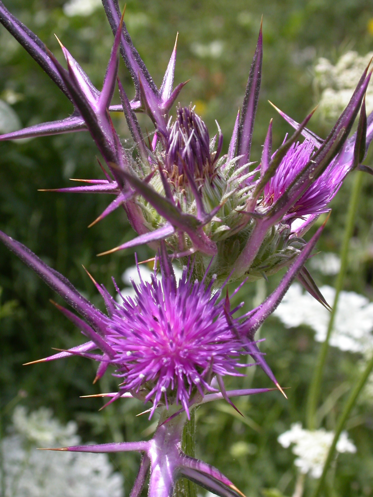

# Plants and Trees in the Bible

## License Information

Plants and Trees in the Bible © United Bible Societies, 2025. Adapted from: <cite>Each According to its Kind: Plants and Trees in the Bible</cite>, by Robert Koops © 2012 United Bible Societies. This work is licensed under Creative Commons Attribution-ShareAlike 4.0 International (<a href="https://creativecommons.org/licenses/by-sa/4.0/">https://creativecommons.org/licenses/by-sa/4.0/</a>).

--------------------------------

## 標題：荊棘、蒺藜、樹莓和石南 (id: FLORA:6.2)

6\.2 標題：荊棘、蒺藜、樹莓和石南
===================

聖經大約有二十多個指荊棘和多刺植物的希伯來文和希臘文名稱，而聖地至少有七八十種這類植物。若要把這些名稱與植物對應起來，簡直比花的對應難度還要大。有些情況下，某個詞語可能根本不是指一種特定的植物，但我們甚至不確知哪些詞語是統稱。如果使用次數越多意味著該詞越有可能是統稱，那麼希伯來文*qots* 和希臘文*akantha* 是最常用來指荊棘和多刺植物的詞語。

在大多數情況下，我們根本不知道這些詞語是指多刺植物中的哪一種。在關於野生喬木和灌木的討論中（參[1\.2 歐洲枸杞 (boxthorn)](#FLORA:1.2) ），我們已經談到了歐洲枸杞（學名*Lycium europaeum* ）和濱棗（基督刺；學名*Ziziphus spina\-christi* ）。在本章，我們會討論其他的品種。我們對這些聖經植物的了解是基於以下兩個信息源：（1）古植物學，即關於古時有哪些植物可能生長在中東的研究；（2）相關語言中的同源詞。我們研究同源詞的原因是：儘管希伯來文不常使用已有幾百年之久，但這些植物的阿拉伯文和敘利亞文名稱可能一直沿用至今，並且很多名稱與希伯來文名稱相似，這可能會提供一些線索，讓我們知道希伯來文可能指的是什麼植物。

到目前為止，我們還沒有討論植物用作地名或人名的情況，但值得一提的是，荊棘類植物在這些名稱中佔有一席之地；例如，在[GEN 4:23](https://ref.ly/Gen4:23) 中，拉麥妻子的名字「亞大」和「洗拉」其實是有刺植物的名稱。至於名字有沒有可能影響她們的性格和行為，則留給讀者見仁見智。無論如何，希伯來文讀者在讀到拉麥的故事時，一定會注意到這一點。同樣，希伯來文名字「沙密」的意思是「多刺的」，儘管這個詞在有些語境中被譯為「鑽石」或「金剛鑽」（如[JER 17:1](https://ref.ly/Jer17:1) ）。希伯來文*qots* 的意思是「有刺灌木」，出現在「哥斯」和「哈歌斯」這兩個人名中；《歷代志上》、《以斯拉記》和《尼希米記》提到了這兩個人。

生物學家對枝刺（thorns）、葉刺（spines）和皮刺（prickles）做了明確的區分。枝刺由樹枝變態發育而來，葉刺由樹葉變態發育而來，而皮刺通常是葉子上的微小突起，尤其是在較小的植物上。英文也用"thorns"來指帶刺的樹或灌木。蒺藜是葉子邊緣有尖刺的開花植物，分多個屬，大多是菊科植物（學名*Asteraceae* ）。蕁麻隸於蕁麻屬（學名*Urtica* ），幾乎所有蕁麻屬植物的莖和葉上都有刺毛。刺痛是由這種植物分泌的毒素引起的。我們接下來討論「石南」和「樹莓」。

* **Associated Passages:** 創世記 4:23; 耶利米書 17:1

## 標題：蒺藜（thistles） (id: FLORA:6.2.1)

6\.2\.1 標題：蒺藜（thistles）
=======================

經文出處
----

Hebrew 來： בַּרְקָן (音譯： barqan)

[JDG 8:7](https://ref.ly/Judg8:7), [JDG 8:16](https://ref.ly/Judg8:16)

Hebrew 來： גַּלְגַּל (音譯： galgal)

[PSA 83:14](https://ref.ly/Ps83:14), [ISA 17:13](https://ref.ly/Isa17:13)

Hebrew 來： דַּרְדַּר (音譯： dardar)

[GEN 3:18](https://ref.ly/Gen3:18), [HOS 10:8](https://ref.ly/Hos10:8)

Hebrew 來： חוֹחַ (音譯： choach)

[1SA 13:6](https://ref.ly/1Sam13:6), [2KI 14:9](https://ref.ly/2Kgs14:9), [2KI 14:9](https://ref.ly/2Kgs14:9), [2CH 25:18](https://ref.ly/2Chr25:18), [2CH 25:18](https://ref.ly/2Chr25:18), [JOB 31:40](https://ref.ly/Job31:40), [PRO 26:9](https://ref.ly/Prov26:9), [SNG 2:2](https://ref.ly/Song2:2), [ISA 34:13](https://ref.ly/Isa34:13), [HOS 9:6](https://ref.ly/Hos9:6)

討論
--

有些經文的上下文表明，聖經中的一些植物可能是蒺藜，在希伯來文中主要用*barqan* 、*dardar* 和*choach* 來指稱。然而，*galgal* 、*sirah* 和*qots* 等其他希伯來文詞語也可能是指蒺藜。以下可能是聖經中提到的一些蒺藜：

**風滾薊** （學名*Gundelia tournefortii* ）是廣泛分佈在中東地區的一種薊屬植物；早春時候，這種植物的幼苗會被當作蔬菜來吃。然而，在植株成熟後，葉子會變得又乾又尖，並且整棵植物也會變成球形。到了一定的時候，莖會折斷，植物變成一棵「風滾草」在風中滾動，同時散播種子。這種植物在阿拉伯文中被稱為*akub* 或*ka’aub* 。地名"Akov"可能就源於這種植物。

在[PSA 83:14](https://ref.ly/Ps83:14) （《和》83:13）和[ISA 17:13](https://ref.ly/Isa17:13) 中，希伯來文*galgal* 可能是指風滾薊或豬毛菜（又名俄羅斯薊或風滾草；學名*Salsola kali* ；參[5\.2\.2 梭梭（豬毛菜屬\[Salsola]、鹽角草屬\[Salicornia]）（hammada \[Salsola, Salicornia]）](#FLORA:5.2.2) ）。豬毛菜和風滾薊一樣呈球形，乾了之後會斷，被強風吹著翻滾。

**奶薊** （學名*Silybum marianum* ），又稱為瑪麗薊、聖瑪麗草、聖薊或水飛薊，分佈在南歐、北非和中東，一年生或兩年生草本植物，高1—2米（3—7英呎），與其他薊屬植物一樣長著裂開的葉子和尖刺。奶薊每根莖上長一個頭狀花序，上面集生許多粉色或紫色的小花，形成一朵大花。有些人相信，從奶薊種子中提取的一種化學物質（水飛薊素）可以增強肝功能，被用來治療肝硬化、肝炎和膽囊疾病。北美和南美有水飛薊屬（學名*Silybum* ）的近緣植物。

**敘利亞薊** （學名*Notobasis syriaca* ）原產於地中海地區，從加那利群島起，經摩洛哥向東，一直到埃及、伊朗和阿塞拜疆都有，也生長在歐洲的地中海沿岸。祖海里認為，這種薊可能就是基甸責打疏割長老所用的*barkan* （[JDG 8:7](https://ref.ly/Judg8:7); [JDG 8:16](https://ref.ly/Judg8:16) ）。敘利亞薊是一年生植物，可長到1米（3英呎）高，葉片呈螺旋狀排列，深裂，灰綠色中帶白色葉脈，邊緣和頂端有尖刺。花瓣紫色，周圍有尖刺。

**金黃薊** （學名*Scolymus maculatus* ；又稱普通薊或牡蠣薊）是一種一年生或多年生植物，可長到1米（3英呎）高，花為亮黃色。與其他薊屬植物一樣，葉子邊緣有尖刺。

**伊比利亞薊** （學名*Centaurea iberica* ）又稱針刺矢車菊、星薊或西班牙薊。祖海里認為，希伯來文*dardar* 可能是指這種薊，但它不是田地裡的雜草，因此不符合[GEN 3:18](https://ref.ly/Gen3:18) 的語境。赫珀（Hepper）則認為有可能是騰紅花（學名*Carthamus tenuis* ）、克里特刺芹（學名*Eryngium creticum* ）、芒柄花（學名*Ononis antiquorum* ），或牧豆樹（學名*Prosopis farcta* ）。另外，也有可能是風滾薊、藍刺頭（學名*Echinops adenocaulus* ）和蘇格蘭大翅薊（學名*Onopordum cynarocephalum* ）。

翻譯
--

法語地區的翻譯者可能知道一種叫做*artichout sauvage* （「野生菜薊」）的薊屬植物，在葡萄牙文中稱為*cardo leiteiro* ，在西班牙文中稱為*cardo de Maria* 或*cardo lechero* 。某些地區的翻譯者可能知道薊屬植物。如果不知道，譯為任何一種惹人厭的植物，尤其是有刺的植物，就足夠了。

翻譯者需要知道，「荊棘和蒺藜」等類短語是一種修辭手法，稱為「詞對」，目的是強調所描述的情形很嚴重、很棘手。例如亞當在伊甸園中可悲的選擇所導致的後果（[GEN 3:18](https://ref.ly/Gen3:18) ），或臨到撒瑪利亞拜偶像之人的懲罰（[HOS 10:8](https://ref.ly/Hos10:8) ）。由於這些都是修辭性的段落，翻譯者要盡量表達出整個短語的強烈語氣，而希伯來文中的植物具體是什麼並不是這裡的重點。如果找不到一個人所熟知的、指荊棘類植物的特定詞彙，翻譯者可以使用「令人討厭的多刺植物」或「各樣的荊棘」之類短語，來表達負面的意思。另外，如果沒有帶刺植物，也可以使用農民認為對莊稼具有破壞性的任何植物。請注意英文譯本在[GEN 3:18](https://ref.ly/Gen3:18) 中的差異：NJB (New Jerusalem Bible (1985)) 譯為"brambles and thistles"（「樹莓和蒺藜」），GNB (Good News Bible) 譯為"weeds and thorns"「雜草和荊棘」。

* **Associated Passages:** 士師記 8:7; 士師記 8:16; 詩篇 83:14; 以賽亞書 17:13; 創世記 3:18; 何西阿書 10:8; 撒母耳記上 13:6; 列王紀下 14:9; 歷代志下 25:18; 約伯記 31:40; 箴言 26:9; 雅歌 2:2; 以賽亞書 34:13; 何西阿書 9:6

## 標題：蕁麻（nettles） (id: FLORA:6.2.2)

6\.2\.2 標題：蕁麻（nettles）
======================

經文出處
----

Hebrew 來： חָרוּל (音譯： charul)

[JOB 30:7](https://ref.ly/Job30:7), [PRO 24:31](https://ref.ly/Prov24:31), [ZEP 2:9](https://ref.ly/Zeph2:9)

Hebrew 來： סָרָב (音譯： sarav)

[EZK 2:6](https://ref.ly/Ezek2:6)

Hebrew 來： סִרְפַּד (音譯： sirpad)

[ISA 55:13](https://ref.ly/Isa55:13)

Hebrew 來： קִמּוֹשׂ (音譯： qimmos)

[PRO 24:31](https://ref.ly/Prov24:31), [ISA 34:13](https://ref.ly/Isa34:13), [HOS 9:6](https://ref.ly/Hos9:6)

討論
--

 蕁麻有30—45種，隸於蕁麻科（學名*Urtica* ），主要分佈在世界上的溫帶地區。以色列常見的蕁麻有3種，可能在聖經時期就已存在了，分別是：尾尖蕁麻（學名*Urtica caudata* 、*Urtica membranacea* ）、羅馬蕁麻（學名*Urtica pilulifera* ；又稱小球蕁麻）、歐蕁麻（學名*Urtica urens* ；又稱異株蕁麻）。大多數蕁麻是多年生植物，有刺毛。希伯來文詞根*s\-r\-f* 和*ch\-r\-h* 都是「灼燒」或「灼熱」的意思，被蕁麻刺過的人很能意會這一點。有一種蕁麻的阿拉伯文名稱在以色列是*chorreig* ，在埃及是*sorbei* 。

特殊意義
----

上面列出的所有經文都出現在修辭語境中，重點是植物多刺或刺痛人。蕁麻一直以來都是許多農場的公害。它們很容易在廢棄了的居住地發芽生長，經常和財狼、貓頭鷹一起被援引，來描述一個國家被敵人摧毀，變為荒場的景象。今天，很多地方的人會吃嫩蕁麻的尖。蕁麻的提取物用於治療關節炎和花粉熱，也用作洗髮水的一種去屑成分。

翻譯
--

蕁麻分佈在遠東、亞洲、歐洲和北美洲。這些地區的翻譯者可以用一個專稱，也可以採用一個包含所有帶莖刺、葉刺、針刺或倒刺的荊棘類植物的統稱。如果要在腳註中補充音譯，可以考慮法文*orties* 、葡萄牙文*urtiga* 、西班牙文*ortiga* ，以及阿拉伯文*angura* 或*nabat* 或*akub* 。

* **Associated Passages:** 約伯記 30:7; 箴言 24:31; 西番雅書 2:9; 以西結書 2:6; 以賽亞書 55:13; 以賽亞書 34:13; 何西阿書 9:6

## 標題：其他帶刺植物（荊棘、樹莓和石南）（other thorny plants [thorns, brambles, briers]） (id: FLORA:6.2.3)

6\.2\.3 標題：其他帶刺植物（荊棘、樹莓和石南）（other thorny plants \[thorns, brambles, briers]）
============================================================================

經文出處
----

Hebrew 來： חֵדֶק (音譯： chedeq)

[PRO 15:19](https://ref.ly/Prov15:19), [MIC 7:4](https://ref.ly/Mic7:4)

Hebrew 來： נַעֲצוּץ (音譯： na‘atsuts)

[ISA 7:19](https://ref.ly/Isa7:19), [ISA 55:13](https://ref.ly/Isa55:13)

Hebrew 來： סִירָה (音譯： sirah)

[ECC 7:6](https://ref.ly/Eccl7:6), [ISA 34:13](https://ref.ly/Isa34:13), [HOS 2:8](https://ref.ly/Hos2:8), [NAM 1:10](https://ref.ly/Nah1:10)

Hebrew 來： סַלּוֹן, סִלּוֹן (音譯： sallon/sillon)

[EZK 2:6](https://ref.ly/Ezek2:6), [EZK 28:24](https://ref.ly/Ezek28:24)

Hebrew 來： צֵן, צְנִינִים (音譯： tsen, tseninim)

[NUM 33:55](https://ref.ly/Num33:55), [JOS 23:13](https://ref.ly/Josh23:13), [JOB 5:5](https://ref.ly/Job5:5), [PRO 22:5](https://ref.ly/Prov22:5)

Hebrew 來： קוֹץ (音譯： qots)

[GEN 3:18](https://ref.ly/Gen3:18), [EXO 22:5](https://ref.ly/Exod22:5), [JDG 8:7](https://ref.ly/Judg8:7), [JDG 8:16](https://ref.ly/Judg8:16), [2SA 23:6](https://ref.ly/2Sam23:6), [PSA 118:12](https://ref.ly/Ps118:12), [ISA 32:13](https://ref.ly/Isa32:13), [ISA 33:12](https://ref.ly/Isa33:12), [JER 4:3](https://ref.ly/Jer4:3), [JER 12:13](https://ref.ly/Jer12:13), [EZK 28:24](https://ref.ly/Ezek28:24), [HOS 10:8](https://ref.ly/Hos10:8)

Hebrew 來： שֵׂךְ (音譯： sek)

[NUM 33:55](https://ref.ly/Num33:55)

Hebrew 來： שַׁיִת (音譯： shayith)

[ISA 5:6](https://ref.ly/Isa5:6), [ISA 7:23](https://ref.ly/Isa7:23), [ISA 7:24](https://ref.ly/Isa7:24), [ISA 7:25](https://ref.ly/Isa7:25), [ISA 9:17](https://ref.ly/Isa9:17), [ISA 10:17](https://ref.ly/Isa10:17), [ISA 27:4](https://ref.ly/Isa27:4)

Hebrew 來： שָׁמִיר (音譯： shamir)

[ISA 5:6](https://ref.ly/Isa5:6), [ISA 7:23](https://ref.ly/Isa7:23), [ISA 7:24](https://ref.ly/Isa7:24), [ISA 7:25](https://ref.ly/Isa7:25), [ISA 9:17](https://ref.ly/Isa9:17), [ISA 10:17](https://ref.ly/Isa10:17), [ISA 27:4](https://ref.ly/Isa27:4), [ISA 32:13](https://ref.ly/Isa32:13)

Greek 希： ἄκανθα (音譯： akantha)

[MAT 7:16](https://ref.ly/Matt7:16), [MAT 13:7](https://ref.ly/Matt13:7), [MAT 13:7](https://ref.ly/Matt13:7), [MAT 13:22](https://ref.ly/Matt13:22), [MAT 27:29](https://ref.ly/Matt27:29), [MRK 4:7](https://ref.ly/Matt4:7), [MRK 4:7](https://ref.ly/Matt4:7), [MRK 4:18](https://ref.ly/Matt4:18), [LUK 6:44](https://ref.ly/Mark6:44), [LUK 8:7](https://ref.ly/Mark8:7), [LUK 8:7](https://ref.ly/Mark8:7), [LUK 8:14](https://ref.ly/Mark8:14), [JHN 19:2](https://ref.ly/Luke19:2), [HEB 6:8](https://ref.ly/Phlm6:8), [SIR 28:24](https://ref.ly/Wis28:24)

Greek 希： ἀκάνθινος (音譯： akanthinos)

[MRK 15:17](https://ref.ly/Matt15:17), [JHN 19:5](https://ref.ly/Luke19:5)

Greek 希： βάτος (音譯： batos)

[MRK 12:26](https://ref.ly/Matt12:26), [LUK 6:44](https://ref.ly/Mark6:44), [LUK 20:37](https://ref.ly/Mark20:37), [ACT 7:30](https://ref.ly/John7:30), [ACT 7:35](https://ref.ly/John7:35)

Greek 希： ῥάμνος (音譯： ramnos)

[LJE 1:70](https://ref.ly/Bar1:70)

Greek 希： τρίβολος (音譯： tribolos)

[MAT 7:16](https://ref.ly/Matt7:16), [HEB 6:8](https://ref.ly/Phlm6:8)

Latin 拉： spina

Latin 拉： spina

[2ES 16:33](https://ref.ly/1Esd16:33), [2ES 16:78](https://ref.ly/1Esd16:78)

討論
--

這裡，我們把9個希伯來文詞語、5個希臘文詞語和1個拉丁文詞語放在一起，本來還要把希伯來文*‘atad* 放在這裡，但是因為這種植物有樹那麼大，因此我們把它放到了第1章（參[1\.2 歐洲枸杞 (boxthorn)](#FLORA:1.2) ）。另外，希伯來文*barqan* 也可以放在這裡討論，但我們認為這個詞是指蒺藜（參[6\.2\.1 蒺藜 (thistles)](#FLORA:6.2.1) ）。赫珀認為，*barqan* 可能是指枸杞的枝子。下面討論的希伯來文和希臘文詞語在英文中通常譯為"thorn"（「荊棘」）、"bramble"（「樹莓」）或"brier"（「石南」）。「石南」和「樹莓」這兩個詞語有專門的用法。樹莓專指薔薇科（懸鈎子屬；學名*Rubus* ）中的有刺植物，包括黑莓和覆盆子，這兩種植物都是歐洲和北美洲常見的食用植物。石南可能是指一種開粉色花朵的玫瑰，也叫野薔薇或多花薔薇，或者是指美國東部的一種多刺藤類植物，名叫菝葜、綠薔薇等。

*chedeq*

提到這個希伯來文詞語的兩處經文都與柵欄或籬笆（*mesukah* ）有關。[PRO 15:19](https://ref.ly/Prov15:19) 第一行的字面意思是「懶惰人的道路像荊棘（*chedeq* ）籬笆」。[MIC 7:4](https://ref.ly/Mic7:4) 第一行說「他們當中最好的，不過像石南（*chedeq* ）」，與「他們最正直的，不過如荊棘籬笆」平行。[ISA 5:5](https://ref.ly/Isa5:5) 提到了帶籬笆的葡萄園。這個籬笆可能是用石頭砌成的，但是頂上可能鋪了多刺地榆或基督刺的枝子。[HOS 2:8](https://ref.ly/Hos2:8) （《和》2:6）提到上帝用「荊棘」（*sirah* ）堵塞頑梗任性的以色列人的道路。

*na‘atsuts*

這個希伯來文詞語在《以賽亞書》中出現了兩次。[ISA 7:19](https://ref.ly/Isa7:19) 說，蒼蠅和蜜蜂將停在「荊棘叢」（*na‘atsuts* ）中。後來，在關於新以色列的異象中，[ISA 55:13](https://ref.ly/Isa55:13) 宣告佳美的香柏樹必代替荊棘叢（*na‘atsuts* ），芬芳的桃金娘樹必代替石南（*sirpad* ）。

*sirah*

出現這個希伯來文詞語的兩處經文是：[ECC 7:6](https://ref.ly/Eccl7:6) （「好像鍋子下面燒荊棘［*sirah* ］的爆聲……」），以及[HOS 2:8](https://ref.ly/Hos2:8) （「因此，我要用荊棘堵塞她的道［*sirah* ］」；《和》2:6）。根據祖海里的意見，*sirah* 可能指多刺植物或多刺地榆（學名*Sarcopoterium spinosum* ）。現今，與這個詞語相關聯的阿拉伯文*sir* /*thir* 所指的植物仍被用來修築籬笆，以及作為烹飪和石灰窰的燃料。

*sallon* /*sillon*

提到這個希伯來文詞語的兩處經文都出自《以西結書》。在[EZK 2:6](https://ref.ly/Ezek2:6) 中，該詞與*sarav* 組成一個詞對：「雖有石南（*sarav* ）和荊棘（*sallon* ）在你那裡……。」[EZK 28:24](https://ref.ly/Ezek28:24) 宣告，在復興後的以色列，「那裡必不再有石南（*sillon* ）刺人，也不再有荊棘（*qots* ）傷害他們。」

*tsen* 、*tseninim*

希伯來文單數詞*tsen* 有兩次指稱植物，還有一次出現在[AMO 4:2](https://ref.ly/Amos4:2) 中，意為「鈎子」。[PRO 22:5](https://ref.ly/Prov22:5) a說，「乖僻人的路上有荊棘（*tsen* ）和網羅。」赫珀認為，這裡可能是指正樹莓（黑莓；學名*Rubus sanguineus* ；法文*mûre* 、*mûrier* ，西班牙文*zarza* ）。[JOB 5:5](https://ref.ly/Job5:5) 說，「他的莊稼被飢餓的人吃盡了，就是在荊棘（*tsen* ）裡的也搶去了……。」關於這節難解經文的討論，參閱下文。在[NUM 33:55](https://ref.ly/Num33:55); [JOS 23:13](https://ref.ly/Josh23:13) 中，希伯來文複數詞*tseninim* 是一個隱喻：「以色列的敵人將像他們身上的刺。」

*qots*

這個詞可能是希伯來文中最常用來表示荊棘的詞語，共出現了12次，其中6次與*barqan* 、*dardar* 、*sillon* 或*shamir* 組成詞對。

*sek*

這個希伯來文詞語只在[NUM 33:55](https://ref.ly/Num33:55) 中出現過1次，經文說，迦南地的居民「必成為你們眼中的刺（*sek* ），肋下的荊棘（*tseninim* ）。」然而，關於*sek* 的含義，有幾個相關的詞語為我們提供了線索：在[JOB 40:31](https://ref.ly/Job40:31) （《和》41:7）中，*sukkah* 指魚叉，而*sakkin* 意為「刀」。

*shayith*

這個希伯來文詞語出現了7次，每次都與*shamir* 組成詞對，且僅出現在《以賽亞書》中。

*shamir*

這個希伯來文詞語在《以賽亞書》中出現了8次，指植物，其中7次與*shayith* 平行。RSV (Revised Standard Version (1952)) 通常把這個詞對譯為"briers \[*shamir* ] and thorns \[*shayith* ]"（「石南和荊棘」）。在[ISA 10:17](https://ref.ly/Isa10:17) 中，這兩個希伯來文詞語的順序調換了，因此RSV (Revised Standard Version (1952)) 譯為"thorns and briers"（「荊棘和石南」）。在[JER 17:1](https://ref.ly/Jer17:1) 、[JER 17:1](https://ref.ly/Jer17:1) 、[EZK 3:9](https://ref.ly/Ezek3:9) 和[ZEC 7:12](https://ref.ly/Zech7:12) 中，RSV (Revised Standard Version (1952)) 把*shamir* 譯為"diamond"（「鑽石」）或"adamant"（「金剛鑽」），這是一種堅硬的石頭。「沙密」這個名字在[JOS 15:48](https://ref.ly/Josh15:48) 和[JDG 10:1](https://ref.ly/Judg10:1); [JDG 10:2](https://ref.ly/Judg10:2) 中是地名，在[1CH 24:24](https://ref.ly/1Chr24:24) 中是人名。

*akantha*

這個希臘文詞語出現在[MAT 7:16](https://ref.ly/Matt7:16) b，經文反問：「豈能在荊棘（*akantha* ）上摘葡萄呢？豈能在蒺藜（*tribolos* ）裡摘無花果呢？」有意思的是，[LUK 6:44](https://ref.ly/Mark6:44) 中的平行經文保留了*akantha* ，但用*batos* （「樹莓灌木」）替代了*tribolos* 。在[HEB 6:8](https://ref.ly/Phlm6:8) 中，*akantha* 又和*tribolos* 構成詞對。*Akantha* 也出現在撒種的比喻中（[MAT 13:7](https://ref.ly/Matt13:7); [MAT 13:7](https://ref.ly/Matt13:7); [MAT 13:22](https://ref.ly/Matt13:22); [MRK 4:7](https://ref.ly/Matt4:7); [MRK 4:7](https://ref.ly/Matt4:7); [MRK 4:18](https://ref.ly/Matt4:18); [LUK 8:7](https://ref.ly/Mark8:7); [LUK 8:7](https://ref.ly/Mark8:7); [LUK 8:14](https://ref.ly/Mark8:14) ）。[MAT 27:29](https://ref.ly/Matt27:29) 和[JHN 19:2](https://ref.ly/Luke19:2) 記載，兵丁把「荊棘（*akantha* ）冠冕」戴在耶穌的頭上。幾個世紀以來，學者們一直在猜測這幾節經文中的*akantha* 指的是什麼植物。林奈（Linnaeus）確信它就是敘利亞的基督刺（學名*Ziziphus spina\-christi* ），因此他把這種植物命名為「基督刺」。還有一些學者，特別是希伯來植物學家，則認為是多刺地榆（學名*Sarcopoterium spinosum* ），他們的理由是兵丁會用最容易找到的有刺植物。另外也可能是濱棗（學名*Paliurus spina\-christi* ）、棗蓮（學名*Ziziphus lotus* ），或枸杞（學名*Lycium shawii* ；參[1\.2 歐洲枸杞 (boxthorn)](#FLORA:1.2) ）。我們相信，馬太和約翰對這些荊棘出自哪種灌木並不感興趣，所以他們在這裡用了一個通稱。

*akanthinos*

這個希臘文詞語源於*akantha* ，在[MRK 15:17](https://ref.ly/Matt15:17); [JHN 19:5](https://ref.ly/Luke19:5) 中用來指稱荊棘冠冕。該詞似乎是一個通用詞，意為「多刺的」或「用荊棘做成的」。

*batos*

在[EXO 3:2](https://ref.ly/Exod3:2); [EXO 3:3](https://ref.ly/Exod3:3); [EXO 3:4](https://ref.ly/Exod3:4) 中，《七十士譯本》將著名的燒著的荊棘（希伯來文*seneh* ）譯為希臘文*batos* ，並且在故事的複述中使用了這個詞（[MRK 12:26](https://ref.ly/Matt12:26); [LUK 20:37](https://ref.ly/Mark20:37); [ACT 7:30](https://ref.ly/John7:30); [ACT 7:35](https://ref.ly/John7:35) ；參[1\.4 燒著的荊棘(burning bush)](#FLORA:1.4) ）。唯一能表明這個詞可能表示有刺植物的線索是：路加在[LUK 6:44](https://ref.ly/Mark6:44) b把它與*akantha* 平行使用，「因為無花果不是從荊棘（*akantha* ）上摘來的，葡萄也不是從樹莓灌木（*batos* ）裡摘來的。」

*ramnos*

[LJE 1:70](https://ref.ly/Bar1:70) 與[JER 10:5](https://ref.ly/Jer10:5) 相呼應；在[LJE 1:70](https://ref.ly/Bar1:70) ，希臘文*ramnos* 指的是鳥類棲息的一種灌木。那麽，RSV (Revised Standard Version (1952)) 的翻譯者如何知道這是「荊棘叢」的呢？他們把[LJE 1:71](https://ref.ly/Bar1:71) 中的*ramnos* 譯作"thorn bush"（「荊棘叢」），可能是因為《七十士譯本》的翻譯者用*ramnos* 來翻譯[JDG 9:14](https://ref.ly/Judg9:14); [JDG 9:15](https://ref.ly/Judg9:15) 中意為「樹莓」的希伯來文*‘atad* 的緣故（參[1\.2 歐洲枸杞 (boxthorn)](#FLORA:1.2) ）。

*tribolos*

這個希臘文詞語只在[MAT 7:16](https://ref.ly/Matt7:16); [HEB 6:8](https://ref.ly/Phlm6:8) 出現過，譯為「蒺藜」，兩處都與*akantha* 構成詞對。

*spina*

在[2ES 16:33](https://ref.ly/1Esd16:33); [2ES 16:78](https://ref.ly/1Esd16:78) 中，拉丁文*spina* 指生長在荒道上的荊棘。根據該處的語境，翻譯者需要使用一個灌木的通稱，這種灌木會阻擋道路，使人們不能輕易通過。

翻譯
--

與蒺藜和蕁麻的情況一樣，其他有刺植物所在的上下文通常是修辭性的，翻譯者可以自由使用恰當的文化對等詞。許多時候，這些經文會出現詞對（例如，「荊棘和蒺藜」、「荊棘和石南」），或者在平行句中出現同義詞。在許多語言中，「有刺植物」語意域中可供選擇的詞彙可能沒有希伯來文那麼多，因此翻譯者只能重複使用詞彙，盡可能地保持一致。

[JDG 8:7](https://ref.ly/Judg8:7); [JDG 8:16](https://ref.ly/Judg8:16) ：這兩節經文中有兩個問題。首先，這裡提到的植物是什麼？其次，譯為「鞭打」（*dush* ）的希伯來文動詞是什麼意思？基甸承諾會懲罰疏割人，用「荊棘」（*qots* ）和「石南」（*barqan* ）鞭打他們的身體。希伯來文動詞*dush* 出現在其他地方時，意思是「打禾」、「踐踏」或「打」。我們並不確定，這裡是指基甸威脅用帶刺植物的枝條責打疏割人，還是說這是一個比喻，實際意思是「我必處理你們的肉，就像農民在收穫的季節打場一樣，只是我要用帶刺的枝條。」翻譯者要記得，打穀的方式在過去和現在有許多種，比如用棍子打、用驢和牛踩、拖動打穀機來碾壓等。我們可以設想，在農業發展的過程中，最初是用棍打，然後是用牲畜踩踏穀物，最後是發明打穀機。動詞*dush* 起初是「打」的意思，隨著技術的更新，它的意思變得更加具體。打穀機的底部有突出物，可以將穀物壓碎並使外皮脫落（參WTH ，[1\.1\.8\.2 打穀機、脫粒板 (threshing board, sledge)](#REALIA:1.1.8.2) ）。因此，有些解經家認為*barqan* 在這裡可能是指打穀機。然而，最簡單的答案往往就是最好的答案；對於基甸的威脅，可能用一個意為「打」（"beat"；GNB (Good News Bible) ）或「鞭打」（"whip"；NCV (New Century Version) 、GW (God's Word Translation) ）的動詞來翻譯就足夠了，不需要譯為「踐踏」（"trample"；NRSV (New Revised Standard Version (1989)) ）、「打穀」（"thresh"；NJPSV (New Jewish Publication Society Version) ），或「抽打」（"flail"；RSV (Revised Standard Version (1952)) 、REB (Revised English Bible (1989)) ）。把*dush* 譯為「撕裂」（"tear"；NIV (New International Version (1984)) 、NLT (New Living Translation) 、NKJV (New King James Version (1982)) ），似乎超出了這個詞的正常語義範圍。儘管如此，作者使用了「你們的肉體」，而不是簡單的「你們」，表明作者的意圖可能不僅僅是「用某種工具打人」。因此，依循NIV (New International Version (1984)) 、NLT (New Living Translation) 和NKJV (New King James Version (1982)) 的譯本也有一定的道理。

[JOB 5:5](https://ref.ly/Job5:5) ：這節經文說，上帝通過讓窮人獲得富人的財產，來給予富人以應得的報應。第二行似乎是說，「他們必搶去（富人的）莊稼，就是在荊棘（*tsinnim* ，即*tsen* 的複數）裡的也搶去了。」有些解經家認為*tsinnim* 在這裡是指荊棘，他們的理解是：這裡或者是指田邊長著多刺植物的地方，播種時有種子落到了那裡（如GNB (Good News Bible) 、NCV (New Century Version) 、GW (God's Word Translation) ；參[MAT 13:7](https://ref.ly/Matt13:7) ）；或者是指用荊棘籬笆圍起來的田地，這是很常見的。後一種情況的意思是，窮人甚至會穿過荊棘籬笆去奪取富人的糧食（如NLT (New Living Translation) 、FRCL (French Common Language Version (Bible en français courant)) ）。

有些解經家認為上述情況很奇怪，他們認為作者本來想說的不是「荊棘」，而是另一個詞。REB (Revised English Bible (1989)) 和NJPSV (New Jewish Publication Society Version) 認為*tsinnim* 是*tsinna’* （籃子／背筐）的複數形式。NJPSV (New Jewish Publication Society Version) 譯作"carrying it off in baskets"（英文直譯：「把它裝進籃子裡帶走」），而REB (Revised English Bible (1989)) 是"stronger men seize it from the panniers"（「更強壯的人把它從背筐裡拿走」）。這裡譯為「更強壯的人」，是因為翻譯者把希伯來文*’el* 解作「強壯的人」，而不是介詞"to"（「對、向」）。其他採用不同文本修訂的解經家和譯本把這一行翻譯成「帶到隱秘的地方去」（Dhorme，多爾姆）、「他把它帶給飢餓的人」（Guillaume，紀堯姆）、"or God shall take it away by blight"（英文直譯：「上帝必使其枯萎，把它奪走」；NAB (New American Bible (1970)) ，帶方括號），以及"God snatches it from their mouths"（「上帝將其從他們口中奪去」；NJB (New Jerusalem Bible (1985)) ）。《七十士譯本》可能依循了另一份文本，譯為「但他們必不能從災難中得救」。有些解經家認為這一行無法翻譯，因此將其刪掉了。猶太解經家摩西 艾澤曼（Moshe Eisemann）稍微作了以下解釋：「那些貧窮的拾穗者並不着急。他們不緊不慢地拾取麥穗，甚至從長著荊棘的地方或荊棘籬笆後面拾取，因為他們並不害怕會被人驅趕。」考慮到這一點，我建議依循GNB (Good News Bible) 和NCV (New Century Version) ，或NLT (New Living Translation) 和FRCL (French Common Language Version (Bible en français courant)) ，保留「荊棘」這個譯法。

* **Associated Passages:** 箴言 15:19; 彌迦書 7:4; 以賽亞書 7:19; 以賽亞書 55:13; 傳道書 7:6; 以賽亞書 34:13; 何西阿書 2:8; 那鴻書 1:10; 以西結書 2:6; 以西結書 28:24; 民數記 33:55; 約書亞記 23:13; 約伯記 5:5; 箴言 22:5; 創世記 3:18; 出埃及記 22:5; 士師記 8:7; 士師記 8:16; 撒母耳記下 23:6; 詩篇 118:12; 以賽亞書 32:13; 以賽亞書 33:12; 耶利米書 4:3; 耶利米書 12:13; 何西阿書 10:8; 以賽亞書 5:6; 以賽亞書 7:23; 以賽亞書 7:24; 以賽亞書 7:25; 以賽亞書 9:17; 以賽亞書 10:17; 以賽亞書 27:4; 馬太福音 7:16; 馬太福音 13:7; 馬太福音 13:22; 馬太福音 27:29; 馬可福音 4:7; 馬可福音 4:18; 路加福音 6:44; 路加福音 8:7; 路加福音 8:14; 約翰福音 19:2; 希伯來書 6:8; 德訓篇 28:24; 馬可福音 15:17; 約翰福音 19:5; 馬可福音 12:26; 路加福音 20:37; 使徒行傳 7:30; 使徒行傳 7:35; 耶利米書信 1:70; 厄斯德拉下 16:33; 厄斯德拉下 16:78; 以賽亞書 5:5; 阿摩司書 4:2; 約伯記 40:31; 耶利米書 17:1; 以西結書 3:9; 撒迦利亞書 7:12; 約書亞記 15:48; 士師記 10:1; 士師記 10:2; 歷代志上 24:24; 出埃及記 3:2; 出埃及記 3:3; 出埃及記 3:4; 耶利米書 10:5; 耶利米書信 1:71; 士師記 9:14; 士師記 9:15

