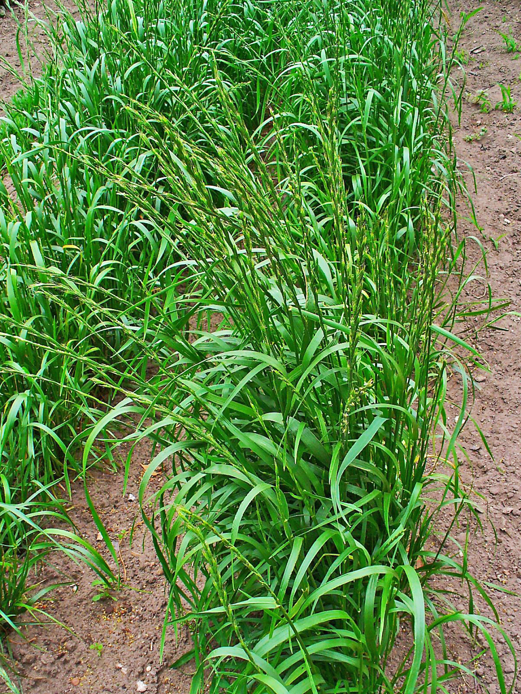

# Plants and Trees in the Bible

## License Information

Plants and Trees in the Bible © United Bible Societies, 2025. Adapted from: <cite>Each According to its Kind: Plants and Trees in the Bible</cite>, by Robert Koops © 2012 United Bible Societies. This work is licensed under Creative Commons Attribution-ShareAlike 4.0 International (<a href="https://creativecommons.org/licenses/by-sa/4.0/">https://creativecommons.org/licenses/by-sa/4.0/</a>).

--------------------------------

## 標題：雜草 (id: FLORA:6.3)

6\.3 標題：雜草
==========

聖經中提到有一種植物，其名字本身並沒有多刺的意思。這種植物之所以不受歡迎是因為它頑固地生長在不該生長的地方。它就是福音書一個著名比喻中的「稗子」。

## 標題：雜草（稗子、毒麥）（weed [tare, darnel]） (id: FLORA:6.3.1)

6\.3\.1 標題：雜草（稗子、毒麥）（weed \[tare, darnel]）
==========================================

經文出處
----

Hebrew 來： בָּאְשָׁה (音譯： ba’ashah)

[JOB 31:40](https://ref.ly/Job31:40)

Greek 希： ζιζάνιον (音譯： zizanion)

[MAT 13:25](https://ref.ly/Matt13:25), [MAT 13:26](https://ref.ly/Matt13:26), [MAT 13:27](https://ref.ly/Matt13:27), [MAT 13:29](https://ref.ly/Matt13:29), [MAT 13:30](https://ref.ly/Matt13:30), [MAT 13:36](https://ref.ly/Matt13:36), [MAT 13:38](https://ref.ly/Matt13:38), [MAT 13:40](https://ref.ly/Matt13:40)

討論
--

*毒麥 (Wikimedia Commons)*

[MAT 13:25](https://ref.ly/Matt13:25) 講到仇敵把雜草（或稗子）的種子撒到麥子裡。雖然聖地的田裡有很多種有害的雜草，但希臘文*zizanion* 在這裡最有可能指的是毒麥（學名*Lolium temulentum* ）。埃及墳墓和拉吉考古發掘的證據告訴我們，毒麥這種有害的雜草已經煩擾人們至少3000年了。毒麥的外形很像二粒小麥，兩者很難區分。

希伯來文名詞*ba’ashah* 只在[JOB 31:40](https://ref.ly/Job31:40) 中出現了一次，但它的動詞形式在舊約出現過很多次，意思是「發臭」，就像腐爛的瘡或屍體那樣。這個名詞實際上並不是指一種植物，它的字面意思是「發臭的東西」。然而在[JOB 31:40](https://ref.ly/Job31:40) 中，該詞與希伯來文*choach* （「蒺藜」；參[6\.2\.1 蒺藜 (thistles)](#FLORA:6.2.1) ）平行，因此在這個上下文中有「發臭的／難聞的雜草」的意思。有詞典將這個詞解作一種叫做「臭草」的植物，但它在這節經文裡的意思比較寬泛，指任何散發出臭味的雜草。

描述
--

*毒麥 (H. Zell (Wikimedia Commons))*

毒麥是一年生植物，分佈在整個巴勒斯坦地區，植株高為30—60厘米（1—2英呎）。

特殊意義
----

聖經提到毒麥時，僅是一種有害的植物。不過，亞述人曾把毒麥入藥。

翻譯
--

聖經時期的農民在面對討厭的雜草時會感到沮喪，農業地區的翻譯者應該不難理解這一點。毒麥廣為人知，因此具有很多名字（例如，法文*herbe a couteau* 、*herbe d’ivrogue* 、*ivraie* ，西班牙文*barrachuela* 、*cizaña* 、*cominillo* 、*joyo* 、*trigollo* ，葡萄牙文*joio* ）。翻譯者如果不了解農村和農業，需要向農民討教合適的譯名。聖經提到的「假的麥子」可能會有文化上的對等詞。若不然，在雜草的比喻中，翻譯者可以採用「假的麥子」這類短語。

* **Associated Passages:** 約伯記 31:40; 馬太福音 13:25; 馬太福音 13:26; 馬太福音 13:27; 馬太福音 13:29; 馬太福音 13:30; 馬太福音 13:36; 馬太福音 13:38; 馬太福音 13:40

* **Associated ACAI Concepts:** Weed (ID: `flora:Weed`)
